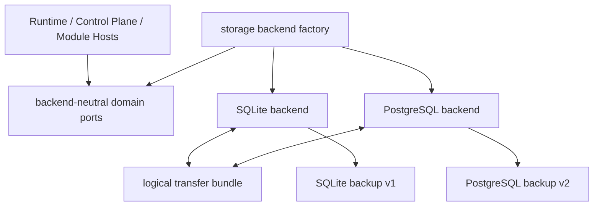

# FreeAgent SQLite + PostgreSQL 双后端与可验证迁移设计（方案 B）

> S0 状态：`HISTORICAL_NON_NORMATIVE`。仅供旧后端抽象语义回溯，不再指导当前 Store；当前架构权威见本目录 `README.md`。

状态：用户已确认方案 B；本文与关联 RuntimeCatalog v2 relation 投影增补均为进入实施计划前的书面审阅稿。

## 1. 决策摘要

FreeAgent 保留 SQLite 作为默认、嵌入式、单机后端，同时新增独立的 PostgreSQL 后端。两个后端共享同一组领域契约和验收语义，但拥有各自的 SQL、迁移、触发器、锁、搜索、错误映射、备份与隐私实现。

第一版 PostgreSQL 不引入分布式执行：

- 一个数据库同时只允许一个 FreeAgent 写入所有者；
- 写事务继续经过单一操作连接串行提交；
- 不使用 `SKIP LOCKED` 扩展并发 claim；
- 不允许多个 Runtime 实例共同消费任务；
- 不做在线双写、CDC 或静默故障切换。

SQLite 与 PostgreSQL 之间使用离线、版本化、内容寻址的逻辑迁移包。迁移不覆盖源库，不向已存在的目标数据集做部分合并，也不把 `UNKNOWN` 外部效果转化为可重放请求。

## 2. 目标与非目标

### 2.1 目标

1. SQLite 当前行为和公开备份格式保持兼容。
2. PostgreSQL 实现相同的可信内核状态机、冻结证据、预算、账本、恢复和可选模块持久化能力。
3. 后端选择只发生在组合根，Runtime、Agent、Workspace、Skill、MCP 和领域代码不依赖具体数据库。
4. SQLite → PostgreSQL 与 PostgreSQL → SQLite 都可通过同一逻辑迁移格式完成。
5. 每次迁移都能证明记录数量、规范值、冻结哈希、外部工件和目标不变量一致。
6. 任一后端未实现要求能力时，在监听、claim 或外部调用前失败关闭。

### 2.2 非目标

- 不创建通用 ORM。
- 不把现有 2,500 余处 SQLite 占位符机械替换成 PostgreSQL 占位符。
- 不尝试让同一份 SQL 同时运行在两个引擎上。
- 不把 PostgreSQL 当成自动获得水平扩展能力的开关。
- 不保证两个搜索引擎产生逐位相同的内部相关性分数。
- 不使用数据库备份文件作为跨引擎迁移格式。
- 不在本阶段实现在线迁移、双写、自动故障转移或多主。

## 3. 对最初设计的影响

### 3.1 保持不变

- Agent 仍是轻量、可跨 Workspace 使用的版本化个体。
- Workspace、Agent、Role、Knowledge、Memory、Skill、MCP 与 Sidecar 仍可独立装配。
- `pure_chat` 在零可选模块下仍可运行。
- Agent/Workspace 装配、权限交集和 RunManifest 冻结语义不因数据库改变。
- Composite、Specialist、Reviewer、公平调度、RAG、85% 压缩、100% 最小完整前缀移除、`UNKNOWN` 禁止语义重放均保持原语义。
- PostgreSQL 不获得绕过 ToolGateway、预算、DispatchAttempt、outbox、cursor、审计或终态持久化的路径。

### 3.2 增加但不改变产品模型

- 部署配置增加数据库引擎选择。
- 存储层增加后端能力报告、引擎限定的 Schema 身份和迁移工具。
- PostgreSQL 需要独立运维：环境变量提供的 DSN、专用角色、连接、备份和恢复；首版不复用模块侧 SecretRef resolver。
- 跨后端迁移后，Knowledge 检索排序可能因搜索引擎差异变化；迁移会使检索缓存失效，并在迁移报告中明确标记。

### 3.3 本阶段明确不做的根本变化

如果以后允许多个 PostgreSQL Runtime 实例并发 claim，将改变当前“单所有者 + 单 operation queue”模型，需要重新设计隔离级别、行锁、租约、公平性、重试和跨进程故障测试。它不是本方案的隐含能力。

## 4. 架构边界



### 4.1 包职责

#### `internal/store`

继续只拥有领域值、错误和窄接口。它不得导入 SQLite 或 PostgreSQL 驱动，也不得包含 SQL 方言判断。

#### `internal/store/backend`

新增组合根存储边界，负责：

- `Engine`：`sqlite` 或 `postgres`;
- 严格配置解码；
- 后端工厂；
- 核心与第一方能力聚合接口；
- 由编译期断言和测试支撑的 typed immutable capability descriptor；
- 启动前的能力要求校验；
- fencing/liveness 信号；
- 统一关闭顺序。

它不得拥有任何业务 SQL。

#### `internal/store/sqlite`

保留当前实现、连接所有权、迁移身份、Schema 指纹、FTS5、备份 v1 和隐私 WAL finalization。为接入共享契约而做的重构必须是行为保持型重构。

#### `internal/store/postgres`

拥有 PostgreSQL 专用实现：

- `pgx/v5` 原生连接接入；
- 连接所有权与串行操作连接；
- PostgreSQL Migration FS；
- Schema metadata、指纹和校验器；
- PostgreSQL 查询、约束、触发器与 SQLSTATE 映射；
- 搜索投影；
- 显式 inventory sequence；
- PostgreSQL 备份和隐私能力实现。

#### `internal/archive`

从 SQLite 包中迁出领域类型、规范 JSON、哈希校验和 `Repository` 接口。SQLite 与 PostgreSQL 各自实现行选择、事务复核与 retention mutation。

#### `internal/store/transfer`

拥有语言无关的逻辑迁移格式、清单、限制、哈希、导出/导入编排和双后端往返校验。它通过后端提供的 `Exporter`/`Importer` 端口工作，不接收裸 `*sql.DB`。

#### PostgreSQL backup provider

只为 PostgreSQL 新增 engine-qualified backup provider 和极窄的组合根接口。现有 SQLite backup v1 命令、文件格式和验证代码保持原位，避免为了抽象而改变已经稳定的 v1 字节格式。

### 4.2 核心与可选模块接口

为避免“某个端口没实现但运行到一半才发现”，存储能力分三层：

1. `KernelStore`：生产 Runtime 必需的 Task/Run、调度、Context、模型 Dispatch/Result、outbox 和恢复端口；关闭权不属于 Runtime Store。
2. `FirstPartyStore`：在 `KernelStore` 上聚合 Knowledge、Memory、Tool、Channel cursor、Media 和 Cache/Cost 等第一方运行模块端口。
3. `AdminStore`：聚合 Workspace/Agent/Profile/Catalog、Governance、Archive 和 Reconciliation 等离线/控制平面数据库端口，不暴露给 Runtime 或第三方模块。跨引擎迁移和备份需要维护所有权及独立生命周期，明确不嵌入 `AdminStore`。

精确聚合边界如下；新增的 catalog/governance/archive admin interfaces 在各自领域包中定义，不放回 SQLite 包：

```go
type WorkspaceRoutingGuard interface {
    RequireWorkspaceRouting(context.Context) error
}

type KernelStore interface {
    store.RuntimeStateStore
    store.WorkspaceRefIngress
    store.ScheduledExecutionStore
    store.ContextCheckpointStore
    store.ContextClaimReleaseStore
    store.ModelBudgetLedger
    store.ModelDispatchLedger
    store.ModelDispatchQueryPort
    store.ModelResultCommitPort
    store.ModelResultResumePort
    store.ModelToolRoundCompletionStore
    store.ModelTeamInitialStore
    store.ProviderUsageQueryPort
    store.TaskResultReader
    WorkspaceRoutingGuard
}

type FirstPartyStore interface {
    KernelStore
    store.InboundMediaStore
    toolgateway.Store
    channel.ChannelCursorStore
    knowledge.Gateway
    memory.Store
    memory.LearningBackfiller
    memory.LearningLifecycleProbe
    cachecontrol.Repository
}

type AdminStore interface {
    FirstPartyStore
    reconcile.Repository
    archive.Repository
    governance.Repository
    workspacecatalog.Repository
    team.CatalogRepository
    appprofile.CatalogRepository
    knowledge.SeedRepository
}

type StableStore interface {
    AdminStore
    store.ContextPrivacyStore
}

type ExperimentalPostgresStore interface {
    AdminStore
    store.ContextLogicalPrivacyStore
}

type BackendFence struct {
    Code string
    Err  error
}

type BackendLifecycle interface {
    FatalFence() <-chan BackendFence
    Close(context.Context) error
}

type TransferEndpoint interface {
    Export(context.Context, transfer.ExportRequest) (transfer.ExportReceipt, error)
    Import(context.Context, transfer.ImportRequest) (transfer.ImportReceipt, error)
}

type OpenedStableBackend struct {
    Store        StableStore
    Capabilities CapabilityDescriptor
    Lifecycle    BackendLifecycle
}

type OpenedExperimentalPostgresBackend struct {
    Store        ExperimentalPostgresStore
    Capabilities CapabilityDescriptor
    Lifecycle    BackendLifecycle
}

type OpenedMaintenanceBackend struct {
    Transfer     TransferEndpoint
    Capabilities CapabilityDescriptor
    Lifecycle    BackendLifecycle
}
```

`store.RuntimeStateStore` 在第一个 contracts 子项目中从现有 `store.Store` 精确拆出，包含当前 `Store` 除 `Close()` 外的全部状态方法：

```go
type RuntimeStateStore interface {
    Ingress
    ProfileIngress
    RecordContextCompilation(context.Context, contextcompiler.Manifest, *contextcompiler.ContextSummary) error
    CompleteTask(context.Context, Completion) error
    RetryTask(context.Context, executor.RuntimeAttempt, error, time.Time) error
    FailTask(context.Context, executor.RuntimeAttempt, error) error
    BlockTask(context.Context, executor.RuntimeAttempt, error) error
    ClaimNextOutbox(context.Context) (OutboxItem, error)
    MarkOutboxSent(context.Context, string, channel.Receipt) error
    MarkOutboxFailure(context.Context, string, channel.DeliveryFailureKind, error, time.Time) error
    RecoverInFlight(context.Context) error
    ListActiveAgentVersions(context.Context, string) ([]team.AgentVersion, error)
    FreezeRunSingle(context.Context, FreezeRunSingleRequest) error
    FreezeRunTeam(context.Context, FreezeRunTeamRequest) error
    LoadRunTeam(context.Context, string, string) (RunTeamState, error)
    StartRunSlot(context.Context, StartRunSlotRequest) (RunSlotWork, error)
    RecordRunSlotContext(context.Context, RunSlotContextCompilation) error
    SucceedRunSlot(context.Context, RunSlotSuccess) (ArtifactRef, error)
    FailRunSlot(context.Context, RunSlotFailure) error
    RecoverRunSlots(context.Context) (SlotRecoveryResult, error)
    ReleaseComposition(context.Context, CompositionRelease) error
    LoadRunSlotInputs(context.Context, RunSlotInputRequest) (RunSlotInputs, error)
    ReconcileNextTeamRun(context.Context) (TeamRunReconciliation, error)
    FinalizeTeamRun(context.Context, TeamFinalization) error
    AbortTeamRun(context.Context, string, string, error) error
}

// Transitional compatibility for existing internal SQLite callers only.
type Store interface {
    RuntimeStateStore
    Close() error
}
```

Factory 不把 concrete SQLite/PostgreSQL store 直接放入 `Opened*Backend.Store`。它返回一个只匿名嵌入 `StableStore` 或 `ExperimentalPostgresStore` interface 的 non-closing view；该 wrapper 不提供 `Unwrap`，其动态 method set 也不含 `Close`。raw concrete store 只保存在私有 lifecycle implementation 中。因而 Runtime 即使做 `interface{ Close() error }` 或 lifecycle 类型断言也必须失败，不能绕过组合根。

`governance.Repository`、`workspacecatalog.Repository`、`team.CatalogRepository`、`appprofile.CatalogRepository` 和 `knowledge.SeedRepository` 是从当前 concrete SQLite import/control methods 提取出的新窄接口；实施计划必须逐个列出其现有方法，不允许使用 catch-all `Exec`。

两个正式稳定后端最终都必须通过 `StableStore` 的编译期断言和契约测试。受限 PostgreSQL 阶段必须通过 `ExperimentalPostgresStore` 的编译期断言，因此不会靠运行时 capability 字符串假装实现 logical privacy，但它不能标为 production/stable。Runtime 仍依据 Profile 只装配所需模块；“后端具备端口”不等于“Agent 自动启用模块”，因此不会破坏最小聊天模式。

组合根使用四个精确构造入口，不返回含糊的 `any` 或“可选方法集合”：

- `OpenSQLiteRuntime(...) (OpenedStableBackend, error)`；
- `OpenPostgresRuntime(...) (OpenedExperimentalPostgresBackend, error)`；物理隐私完成后才能新增稳定构造入口；
- `OpenSQLiteTransfer(...) (OpenedMaintenanceBackend, error)`；
- `OpenPostgresTransfer(...) (OpenedMaintenanceBackend, error)`。

Runtime handle 与 maintenance handle 互斥获取同一后端所有权，不能同时存在。`FatalFence` 是容量为 1 的只读信号：后端必须先原子进入 fenced 状态并使全部后续操作失败，再至多发送一个 `BackendFence` 并关闭 channel；正常关闭只关闭 channel、不伪造 fatal value。组合根独占 `Lifecycle`；Runtime 和模块只取得 non-closing Store view。组合根先关闭 claim/external-effect admission 并完成已有 lifecycle drain，之后才调用 `BackendLifecycle.Close` 排空数据库 operation queue。过渡期 concrete `store.Store.Close()` 只能由 lifecycle adapter 内部调用，绝不从 factory product 泄漏。

`TransferEndpoint` 只存在于 maintenance product，不可从 Runtime handle 取得。SQLite complete backup v1 继续使用现有专用命令实现；PostgreSQL backup v2 使用 `internal/store/postgres` 自己的窄 provider 和独立构造入口。二者都不塞入 `AdminStore`，也不为了表面统一而改写 SQLite backup v1。

第三方模块仍只能取得自身窄接口，不能取得 `FirstPartyStore`、`AdminStore`、裸数据库连接或后端工厂。聚合接口和 compile assertions 放在 `internal/store/backend`，避免领域包形成 import cycle。

## 5. 配置和启动

### 5.1 配置形态

组合根接受互斥配置，并保留当前 SQLite 使用方式：

```text
engine=sqlite
sqlite.path=data/agent.db
# existing: --db / FREEAGENT_DB

engine=postgres
postgres.dsn=FREEAGENT_POSTGRES_DSN (environment only)
postgres.schema=freeagent
```

规则：

- 默认引擎为 SQLite；
- 现有 `--db` 和 `FREEAGENT_DB` 行为不变；
- SQLite 不读取 PostgreSQL 字段；
- PostgreSQL 不接受文件路径；
- PostgreSQL DSN 首版只从 `FREEAGENT_POSTGRES_DSN` 读取，不接受含 DSN 的命令行参数；现有 SecretRef resolver 仅服务 module hosts，不扩权为数据库 resolver；
- DSN、口令和证书内容不得进入 Profile、RunManifest、日志、错误、事件、备份清单或迁移清单；
- 未知字段、冲突字段和空引用均在打开数据库前拒绝。

后端选择和命令要求先进行不接触数据库的 static preflight。配置为 PostgreSQL 时，任何错误都直接失败，绝不回退到 SQLite。只有 static preflight 通过后才打开数据库；打开后再验证动态 Schema capabilities。一个不支持的命令必须在 migration、seed、artifact publish 或目标 mutation 前拒绝。

V1 的 canonical schema identity 使用唯一的 strict CJSON 文档：

```text
CanonicalSchemaIdentityV1 {
  SchemaVersion = 1
  Engine = "sqlite" | "postgres"
  CanonicalNamespace
}

CanonicalSchemaIdentityHash = H(
  "freeagent.canonical-schema-identity.v1",
  CanonicalCanonicalSchemaIdentityBytes
)
```

SQLite 的 `CanonicalNamespace` 固定为 `main`。PostgreSQL 的
`postgres.schema` 只接受 ASCII lower-case `[a-z_][a-z0-9_]{0,62}`；禁止 quoted
identifier、大小写折叠、点号、空白和 Unicode 等价形式。所有 SQL 对象引用都把
该精确值作为一个 quoted identifier 完全限定，绝不依赖 `search_path`。source
manifest、target import receipt 与首次打开验证必须使用同一 identity hash。
CanonicalSchemaIdentityHash 只标识逻辑 namespace，不参与 owner-lock key。V1 坚持
“一个 PostgreSQL database 同时只有一个 FreeAgent owner product”，即使两个配置
指向不同 schema，也必须互斥。

### 5.2 PostgreSQL 单所有者

首个支持范围固定为 PostgreSQL 18 dedicated primary，使用直连 TLS session；不经过 transaction-mode pooler，不向只读副本写入，也不宣称 PostgreSQL 17 或其他兼容数据库已通过。增加其他 major version 必须有独立 `PostgreSQLPhysicalSchemaFingerprint` 和完整证据矩阵。

PostgreSQL 后端打开时：

1. 建立一个固定的 `pgx.Conn` session，并用两段 32-bit key 调用
   `pg_try_advisory_lock`。两段 key 都是 database-local 固定常量：令
   `OwnerLockDigest=SHA256(UTF8("freeagent.postgres-database-owner-lock.v1"))`，
   key1/key2 分别是 digest `[0:4]`、`[4:8]` 的 big-endian signed int32；它们与
   DSN、database 名、CanonicalNamespace 和 CanonicalSchemaIdentityHash 均无关；
2. 获取失败时返回稳定的 `STORE_ALREADY_OWNED`，且不做迁移或默认数据写入；
3. 该 session 同时持有所有权锁并执行全部 Runtime 数据库操作，内部 operation queue 保证同一时刻至多一个 query 或 transaction；`pgx.Conn` 不被并发使用；
4. 不建立第二条运行时写连接，避免“所有权连接已丢失但操作连接仍继续写”的 split-brain 窗口；
5. session 发生连接错误后，Store 永久进入 fenced 状态，拒绝新 claim 和 mutation，不自动重获所有权；
6. 关闭时先停止准入和外部效果，再排空唯一 operation queue，最后释放并关闭该 session。

Store 向组合根暴露一次性的 fatal fence signal。组合根收到后立即关闭 claim admission 和新 external-effect admission，再执行已有生命周期 drain；数据库后端本身不负责排空 Runtime 外部效果。

PostgreSQL 官方文档确认 session-level advisory lock 会保持到显式释放或会话结束，`pg_try_advisory_lock` 在冲突时立即返回 `false`。这正适合作为 FreeAgent 进程间的合作式所有权门，但它不是数据库权限替代品：

- <https://www.postgresql.org/docs/current/functions-admin.html#FUNCTIONS-ADVISORY-LOCKS>
- <https://www.postgresql.org/docs/current/view-pg-locks.html>

部署必须使用专用应用写角色，并撤销不必要的 `PUBLIC` 权限。所有 FreeAgent 写命令都必须获取相同所有权锁；超级用户或绕过应用的直接 SQL 不属于受支持写入路径：

- <https://www.postgresql.org/docs/current/ddl-priv.html>

### 5.3 运行前能力门

后端返回受信内部 typed immutable capability descriptor，例如：

```text
engine
engine_schema_version
logical_schema_version
single_owner
serialized_operations
knowledge_search
complete_backup
physical_privacy_finalization
cross_engine_export
cross_engine_import
```

组合根根据启用的 Profile 和命令所需能力做一次启动前检查。缺失能力必须在监听端口、claim 任务、发送 Channel 消息或调用模型/Tool 之前失败。descriptor 由 concrete type、compile assertion、Schema verification 和测试共同支撑，不接受外部 JSON 自报。

## 6. Schema 与数据表示

### 6.1 两套物理 Schema，一套领域语义

SQLite 与 PostgreSQL 使用独立 migration set 和独立物理指纹。不得用 SQLite 的 `user_version`、`sqlite_schema` 或对象 SQL 文本作为 PostgreSQL 权威。

每个后端都暴露：

- public application identity；
- engine identity；
- engine schema version；
- logical schema version；
- migration-set digest；
- physical schema fingerprint。

现有 SQLite identity、schema version 和 backup v1 不静默改写。需要新增逻辑版本字段时，通过正常、可回滚的下一版 SQLite migration 完成。

### 6.2 规范 JSON

需要参与哈希、冻结、重放或迁移对账的 JSON 继续以规范 UTF-8 文本作为权威值。PostgreSQL 可以通过 `::jsonb`、生成列或表达式索引查询，但不得只保存 JSONB 后再声称原字节未变。

### 6.3 时间和排序

- RFC3339Nano 文本继续用于公开/规范时间表示；
- 已有 `*_order_ns` 使用有符号 64 位整数保持确定性；
- ID、fairness 和冻结清单排序使用明确的 bytewise/`C` collation；
- 不依赖数据库创建时的默认 locale。

PostgreSQL 文档说明 `C`/`POSIX` 按字节排序，而 locale 会影响 `ORDER BY` 和比较；因此所有决定哈希、游标或公平性的排序都必须显式指定：

- <https://www.postgresql.org/docs/current/collation.html>

### 6.4 `rowid` 替代

SQLite reconciliation 目前使用物理 `rowid` 作为增量扫描游标。PostgreSQL 禁止使用 `ctid`。

首版需要显式处理两个 SQLite 物理顺序：

- `model_dispatch_attempts.rowid`：驱动 `reconciliation_inventory_cursors.last_rowid`；
- `model_call_reservations.rowid`：驱动 staged-result/reconciliation 的先后判断。

PostgreSQL 对应表增加不可变 `BIGINT GENERATED ... AS IDENTITY` inventory sequence。SQLite Schema 不增加镜像列，也不为迁移修改现有 `rowid` 行为。

逻辑迁移格式把这两个当前已具备语义的 SQLite rowid 投影为明确的跨库 sequence：

- `model_dispatch_attempts.rowid` ↔ PostgreSQL `dispatch_sequence`；
- `model_call_reservations.rowid` ↔ PostgreSQL `reservation_sequence`。

SQLite exporter 读取并导出精确 rowid，包括可能存在的数值空洞；PostgreSQL importer 显式插入对应 sequence。反向导入 SQLite 时使用显式 `INSERT(rowid, ...)` 恢复相同值，再原样恢复 `reconciliation_inventory_cursors.last_rowid`。这不增加或修改 SQLite 列。

另外单独导出 `sqlite_sequence` 中两个 AUTOINCREMENT high-water mark：

- `cache_control_policy_activations.activation_sequence`；
- `profile_catalog_activations.activation_sequence`。

即使最大值对应的历史行已删除，high-water mark 也必须保留；目标 importer 在数据验证后恢复对应 sequence authority。导入后必须证明：

- 两个关系的身份顺序一致；
- cursor 之前/之后的记录集合一致；
- sequence high-water mark 大于等于最大已导入值且精确保留源端已消费区间；
- 不会把已扫描记录重新当成新 UNKNOWN，也不会跳过未扫描记录。

两类 sequence 语义必须区分：`model_dispatch_attempts`/
`model_call_reservations` 的 portable 状态是已提交行本身携带的 logical sequence
及其数值空洞；PostgreSQL 因失败事务消耗但没有落行的 identity catalog 值是
engine-local，不进入 root。两个 AUTOINCREMENT activation 的 portable 状态则
包含独立 high-water，即使最高行已删除也精确保留，目标下一次分配必须为
`high_water + 1`。raw SQLite/PostgreSQL sequence catalog 永不直接进入 root；
若未来要把其他 allocator 的已消费区间提升为业务语义，必须新增版本化
portable allocator authority，不能临时读取物理 catalog。

`dispatch_sequence`、`reservation_sequence` 和
`reconciliation_inventory_cursors.last_rowid` 都已经是 PA/PH relation 的规范
字段，只通过各自 relation root 进入 `logical_state_root` 一次；不得再复制到
transport metadata。唯一额外 transport block 是
`transfer_activation_high_water_v1`，它恰好包含下列两个按
`TransportOrdinal` 升序排列的记录，不允许缺失、重复或增加第三个记录：

| TransportOrdinal | LogicalSequenceName | ScalarType | CanonicalEncodingID |
|---:|---|---|---|
| 1 | `cache_control_policy_activations.activation_sequence` | `SIGNED_INT64_NONNEGATIVE` | `freeagent.sint64-be-twos-complement.v1` |
| 2 | `profile_catalog_activations.activation_sequence` | `SIGNED_INT64_NONNEGATIVE` | `freeagent.sint64-be-twos-complement.v1` |

每条记录的固定字段顺序为
`TransportOrdinal / LogicalSequenceName / HighWaterInclusive / ScalarType /
CanonicalEncodingID`。`HighWaterInclusive` 是 `0..math.MaxInt64` 的有符号 64 位
整数；空历史使用 0，最大已提交 activation 仍须小于等于它，等于
`math.MaxInt64` 时目标 allocator 必须以 overflow 失败而不能回绕。

block 的规范字节逐项定义为：4-byte unsigned big-endian `schema_version=1`、
4-byte unsigned big-endian `record_count=2`，随后每条记录先写 4-byte unsigned
big-endian `record_length`，再写 record bytes。record bytes 依固定字段顺序编码：
ordinal 为 4-byte unsigned big-endian；每个 UTF-8 字符串为 4-byte unsigned
big-endian byte length 后接原字节；high-water 为 8-byte big-endian two's
complement signed int64。长度溢出、非规范 UTF-8、非固定字符串、尾随字节或
非递增 ordinal 一律拒绝。`TransportStateRoot =
H("freeagent.transfer-transport-state.v1", block_bytes)`；
`logical_state_root` 只包含该 `TransportStateRoot` 一次，不直接包含 block 中的
单条记录。SQLite 与 PostgreSQL 必须使用同一共享编码器，不能编码物理 catalog
名称或目标端下一值。

PostgreSQL 对两个 activation allocator 的规范映射固定如下。对应 sequence 必须
为 `START 1 INCREMENT 1 NO CYCLE CACHE 1`；maintenance owner 独占且 Runtime 已
drain 后，在同一导出 snapshot 中读取 `last_value/is_called`。`is_called=false`
映射为 `HighWaterInclusive=0`，`is_called=true` 映射为精确 `last_value`。
PostgreSQL `nextval` 已消费但事务随后回滚的值属于这两个 activation allocator 的
portable consumed interval，因而会提高 high-water；这与 dispatch/reservation
未落行 identity 的 engine-local 规则不同。

导入 PostgreSQL 时，0 使用等价于 `setval(sequence,1,false)` 的初始化；
`1..math.MaxInt64` 使用等价于 `setval(sequence,high_water,true)` 的初始化；最大值
表示 exhausted，下一次分配必须失败。导入 SQLite 时，0 删除对应
`sqlite_sequence` authority row，正数原样恢复。两端都必须在设置前验证现有最大
activation 值不大于 high-water，并在设置后读取验证下一值语义。Exporter 只把
上述规范 scalar 编入 transport block，不把 sequence catalog row、OID、物理
sequence name 或 `is_called` 直接编码进 root。

### 6.5 约束和触发器

PostgreSQL migration 必须逐项映射当前由 SQLite `CHECK`、外键和触发器保证的领域不变量。映射表需要记录：

- SQLite object；
- 领域不变量；
- PostgreSQL object/function；
- 负向测试；
- tamper/restart 测试。

只有“行为被 Go 层的同一事务性验证完全替代”时才能不移植某个触发器，并必须有故障注入证明不存在绕过窗口。

### 6.6 逻辑数据集清单

`freeagent.logical-transfer.v1` 使用检查入库、内容寻址的 logical schema descriptor 作为唯一数据集权威。`transfer/schema_v1.cjson` 继续描述当前 public baseline；引入 RuntimeCatalog/Provider authority 后必须生成不可重解释 v1 的 `transfer/schema_v2.cjson`。当前设计仓库尚未提交该生成物，因此 RuntimeCatalog v2 的 export/import capability 必须保持 disabled，且不得发布 v2 的 RelationDescriptorSetHash、ImportPlanHash 或 LogicalSchemaFingerprint。v2 的 mixed-state 实体必须遵守关联
`2026-07-21-runtime-catalog-authority-design.md` §18.4：迁移单位是共享逻辑 projection，不是物理 ordinary table。SQLite 与 PostgreSQL 可以使用不同物理表，但必须输出逐字段、逐 predicate 相同的 PA/PH relation；EL/D 不进入 root。

Exporter 在导出前把实际 Schema object set 与物理分类清单比对，同时把每个逻辑 projection 与 descriptor fingerprint 比对；出现未分类、缺失、重复 relation、字段/predicate 不同或活动 EL 行时失败。禁止把同含 authority/history/current 的物理整行直接导出。

每个 relation descriptor 的唯一规范文档固定为：

```text
RelationDescriptorIdentityV1 {
  SchemaVersion = 1
  LogicalSchemaVersion
  RelationOrdinal
  LogicalRelationName
  ProjectionVersion
  Class = PA | PH | EL | D
  RootIncluded

  TypedSortKeyFields[] {
    FieldName
    ScalarType
    Direction
    NullOrder
    Comparator
  }

  UniqueConstraintIdentity

  OrderedIncludedFields[] {
    FieldName
    ScalarType
    Nullable
    CanonicalEncodingID
  }

  ExportBlockerPredicateID
  PortableRowPredicateID
  ImportPolicy
  TargetInitialState
}

RelationDescriptorIdentityV2 {
  SchemaVersion = 2
  LogicalSchemaVersion
  RelationOrdinal
  LogicalRelationName
  ProjectionVersion
  Class = PA | PH | EL | D
  RootIncluded

  TypedSortKeyFields[] {
    FieldName
    ScalarType
    Direction
    NullOrder
    Comparator
  }

  UniqueConstraintIdentity

  OrderedIntraRelationPredecessorConstraints[] {
    LogicalConstraintIdentity
    OrderedNaturalKeyFields[]
    OrdinalField
    PreviousPresentField
    PreviousHashField
    RowHashField
    FirstOrdinal = 1
    GenesisPreviousHashLiteral
    ImportOrderPolicy = TYPED_SORT_KEY_PREFIX_THEN_ORDINAL_ASC
  }

  OrderedIncludedFields[] {
    FieldName
    ScalarType
    Nullable
    CanonicalEncodingID
  }

  ExportBlockerPredicateID
  PortableRowPredicateID
  ImportPolicy
  TargetInitialState
}

RelationFieldSchemaIdentityV1 {
  SchemaVersion = 1
  LogicalSchemaVersion
  RelationOrdinal
  OrderedIncludedFields[] {
    FieldName
    ScalarType
    Nullable
    CanonicalEncodingID
  }
}

RelationDescriptorFingerprintV1 = H(
  "freeagent.transfer-relation-descriptor.v1",
  CanonicalRelationDescriptorIdentityV1Bytes
)

RelationDescriptorFingerprintV2 = H(
  "freeagent.transfer-relation-descriptor.v2",
  CanonicalRelationDescriptorIdentityV2Bytes
)

IncludedFieldSchemaHash = H(
  "freeagent.transfer-relation-field-schema.v1",
  CanonicalRelationFieldSchemaIdentityBytes
)
```

V1 的 `SchemaVersion`、两个数组和所有字符串字段始终存在；V2 的 `SchemaVersion`、三个数组和
所有字符串字段始终存在；禁止省略或使用 `null`。public baseline/logical schema v1 继续只接受
RelationDescriptorIdentityV1 和 v1 hash domain；RuntimeCatalog logical schema v2 的全部 descriptor 必须
使用 RelationDescriptorIdentityV2 和 v2 domain，不能混用或回写既有 v1 identity。
`LogicalRelationName` 固定匹配 `[a-z][a-z0-9_]{0,127}`，因此禁止 `/`、`\\`、点段、
控制字符和平台保留路径形式。field name、constraint/predicate/encoding identity
都是非空、最多 128 UTF-8 bytes 的 ASCII identity；语义上允许为空的 predicate
固定编码为空字符串。数组顺序
属于 identity，不能由 JSON object key 顺序、数据库列枚举或语言 struct 顺序推导。
descriptor 自身不包含 fingerprint、ImportPlanHash 或 state/manifest hash；在一个
LogicalSchemaVersion 内以 RelationOrdinal 为自然键，LogicalRelationName 另行唯一。

组合矩阵固定为：PA/PH 使用 `RootIncluded=true,ImportPolicy=IMPORT_ROWS,
TargetInitialState=IMPORTED_EXACT`；EL 使用 `RootIncluded=false,
ImportPolicy=EXCLUDE_VERIFY_ZERO,TargetInitialState=EMPTY`；D 使用
`RootIncluded=false,ImportPolicy=EXCLUDE_REBUILD,
TargetInitialState=REBUILT_FROM_AUTHORITY`。其他组合、未知 ScalarType/encoding、
空 sort key、重复字段或未被 UniqueConstraintIdentity 证明唯一的完整 sort key
一律失败。TypedSortKey 明确每个字段的方向和 `nulls:first|last`，即使
当前约束不允许 null 也必须声明。text 固定为无 locale 的 unsigned UTF-8
byte order，bytes 为 unsigned lexicographic byte order，signed integer 按
精确数值顺序，boolean 为 `false < true`。V1 禁止把 `float64_bits` 用作排序
键；若未来确有需要，必须先版本化定义 IEEE-754 total-order 编码。
UniqueConstraintIdentity 必须指向能证明完整 sort key 唯一的 PK/UNIQUE
constraint。

`OrderedIntraRelationPredecessorConstraints` V2 只允许表达同一 relation 内的单步、不可分叉
previous-hash 链，不是通用 self-edge 逃生口。每个 entry 必须满足：

- `OrderedNaturalKeyFields` 非空、无重复，并与 TypedSortKeyFields 的起始字段同列同序；
- `OrdinalField` 紧随该 prefix、为升序 unsigned integer；同一 natural key 从 FirstOrdinal=1 连续递增；
- ordinal=1 时 PreviousPresentField=false 且 PreviousHashField 等于 descriptor 锁定的非空 64-hex
  GenesisPreviousHashLiteral；ordinal>1 时 present=true，previous hash 逐字段等于同 key、ordinal-1
  的 RowHashField；
- typed sort key 必须使 predecessor row 严格早于 child；exporter/Restore 重验全链，importer 必须按文件
  顺序逐行 insert 并在每行后保持对应 FK immediate，禁止 unordered bulk insert、延迟到 relation 末尾或
  关闭约束；
- V2 每个 relation 最多两个 entry，且它们的字段集合不得重叠。没有该结构的 relation 精确编码 `[]`。

该结构及其数组顺序进入 RelationDescriptorFingerprint、RelationDescriptorSetHash 与 ImportPlanHash，
不改变只描述 included columns 的 IncludedFieldSchemaHash；schema generator 还必须
证明每个 entry 对应一个同列同序 physical self-FK 和同 key/ordinal UNIQUE。它只处理“父行已经在同一
relation 文件更早位置”的 row-level edge，不进入 RequiredParentRelationOrdinals，也不计入 deferred set。

SQLite 查询使用显式 `ORDER BY ... COLLATE BINARY`，PostgreSQL 使用能够证明同一 UTF-8 byte order 的显式表达式/`C` collation；两端 exporter 仍用共享的 Go typed comparator 逐行复核，不能把数据库默认 locale 当作证明。导出遇到非单调行或重复完整键立即失败。Importer 在写入前用同一 comparator 拒绝非单调或重复键，因此两个引擎不能仅因物理扫描顺序不同而产生不同 root。

当前 public baseline/v1 的分类规则固定如下；它不能覆盖 v2 新增的
RuntimeCatalog、Gate、Claim、Sandbox 或 Effect/Host lease mixed-state
投影：

1. **Portable authoritative**
   - 当前物理 inventory 是 80 个 ordinary tables + 2 个 virtual tables；
   - 其中 75 个 ordinary physical tables 提供 portable projection；最终
     logical relation 数量以 descriptor 为准，mixed-state 拆分后不要求等于
     物理表数量；
   - 包括 `knowledge_collections.cache_epoch`、`model_call_cache_scheduling`、`model_dispatch_ledger_epochs`、scheduler state/sequences、cursor、UNKNOWN/reconciliation、catalog、governance、learning、archive 和所有 frozen evidence；
   - 已提交的 dispatch/reservation logical sequence 和 cursor 只随对应 PA/PH
     relation 进入 root；§6.4 唯一定义的两个 activation high-water 只通过
     `transfer_activation_high_water_v1` 的 `TransportStateRoot` 进入
     `logical_state_root` 一次。
2. **Derived, exclude and rebuild**
   - 3 个 ordinary D：`knowledge_cjk_short_projections`、
     `knowledge_cjk_short_terms`、`retrieval_cache`；
   - 2 个 virtual D：`knowledge_fts`、`knowledge_cjk_fts`。
3. **Engine-local, exclude**
   - 2 个 ordinary physical-excluded：`freeagent_schema_meta`、
     `context_privacy_physical_finalizations`；
   - 新增的 import/backup verification receipts；
   - PostgreSQL catalog objects 和 SQLite `sqlite_sequence` 本体。
4. **Managed external state**
   - database rows 中受管且内容寻址的 artifact blobs 单独进入 artifact manifest/`artifact_root`；
   - RuntimeCatalog v2 的 tenant ContentPayload metadata 是 PA；其 LogicalBlobID
     对应正文是 managed artifact，只在 artifact root 保存一次；已完成隐私清除的
     `content_payload_tombstones_v1` 同样是 PA，但不允许对应 artifact item；live 与
     tombstone identity 必须互斥；
   - Sidecar unmanaged state 继续作为显式 exclusion，不伪装为完整迁移。
5. **Never export**
   - DSN、SecretRef 解析值、Provider/Channel credentials、进程环境、日志和临时文件。

分类不得依赖名称模式。新增 `foo_cache`、index 或 virtual table 若没有版本化
descriptor，必须作为未分类失败；不能自动归入 D。
RuntimeCatalog v2 仅额外把精确 relation `member_tool_view_cache` 声明为 D；
其他 v2 authority/history/current 分类以关联 Runtime 规范 §18.4 的检查入库
descriptor 为准。

Derived rebuild 使用导入后的 authoritative Knowledge rows离线重建，不执行普通 runtime mutation，不增加或重写已导入的 `knowledge_collections.cache_epoch`。完成 rebuild 后再安装/校验相关触发器和索引。

### 6.7 Logical schema identity 与 ImportPlan

`RelationOrdinal` 只定义 relation descriptor、transfer 文件和
`logical_state_root` 的稳定顺序，不表示数据库插入顺序。跨 relation 导入依赖
由 schema-level、检查入库的 `ImportPlanV1` 唯一定义：

```text
ImportPlanV1 {
  SchemaVersion = 1
  LogicalSchemaVersion
  RelationDescriptorSetHash

  OrderedImportPhases[] {
    PhaseOrdinal
    OrderedRelations[] {
      RelationOrdinal
      RequiredParentRelationOrdinals[]
      DeferredConstraintSetID
    }
  }

  OrderedDeferredConstraintSets[] {
    DeferredConstraintSetID
    OrderedLogicalConstraintIdentities[]
    ValidateAfterPhaseOrdinal
  }
}
```

规则固定如下：

- PhaseOrdinal 从 1 连续递增；每个 PA/PH relation 必须在全部 phase 中恰好
  出现一次，EL、D、managed blob 和
  `transfer_activation_high_water_v1` 不得出现；
- 同一 phase 的 relation 按 RelationOrdinal 升序编码；
  RequiredParentRelationOrdinals 是全部直接 logical FK、复合 authority FK 和
  immutable evidence 父 relation 的并集，只保存直接边并按 ordinal 升序去重；
- discriminated relation 必须列出所有合法分支的父 relation，即使当前 bundle
  没有该分支行；父 relation 无行不取消依赖边；
- 普通跨 relation parent 必须在更早 phase。self-edge、同 phase 或向后边只允许由非空
  DeferredConstraintSetID 精确授权；唯一例外是 RelationDescriptor 已锁定且通过上述全部检查的
  `OrderedIntraRelationPredecessorConstraints`，它不属于 relation-level DAG/self-edge。V1 每个 relation
  最多属于一个 deferred set；
- deferred set 逐名列出后端中立 logical constraint identity 和固定验证 phase；
  SQLite/PostgreSQL 只映射这些约束，禁止关闭全部 FK、CHECK/UNIQUE、trigger，
  也禁止 PostgreSQL `session_replication_role=replica`；
- 到达 ValidateAfterPhaseOrdinal 必须强制验证该 set 并恢复 immediate；最终
  phase 后不得存在未验证 set，任一失败回滚整个 staging transaction。

本规范全部 transfer-specific `H(domain,payload)` 固定为
`SHA256(uint32_be(len(domain_utf8)) || domain_utf8 ||
uint64_be(len(payload)) || payload)`；domain 必须是本文给出的非空 ASCII 原字节，
payload 必须是一个精确 strict-CJSON document bytes 或本文明确的 binary block
bytes。禁止字符串拼接、多参数隐式序列化、十六进制文本代替原 payload 或省略长度
frame。普通文件 SHA-256 明确写作 `SHA256(file_bytes)`，不使用该 domain framing。

全部 schema identity 文档使用下文定义的 FreeAgent Strict CJSON V1：未知字段/
duplicate key 拒绝；所有字段和数组始终存在，不能用省略或 `null` 表达默认值；
ordinal/version 为 uint32；phase、relation、parent ordinal 均按数值升序；deferred set ID 与
constraint identity 使用唯一 ASCII/unsigned UTF-8 byte order。没有 deferred
constraint 的 relation 必须编码 `DeferredConstraintSetID=""`，禁止省略或编码
`null`。规范 identity 文档固定为：

```text
RelationDescriptorSetIdentityV1 {
  SchemaVersion = 1
  LogicalSchemaVersion
  OrderedRelations[] {
    RelationOrdinal
    RelationDescriptorFingerprint
  }
}

TransportSchemaDescriptorV1 {
  SchemaVersion = 1
  TransportRelationName = "transfer_activation_high_water_v1"
  TransportBlockSchemaVersion = 1
  BlockHeaderEncodingID = "freeagent.transfer-activation-high-water-header.v1"
  RecordFramingEncodingID = "freeagent.transfer-activation-high-water-record.v1"
  TransportStateHashDomain = "freeagent.transfer-transport-state.v1"
  OrderedRecordFields = [
    "TransportOrdinal", "LogicalSequenceName", "HighWaterInclusive",
    "ScalarType", "CanonicalEncodingID"
  ]
  OrderedRecordDescriptors[] {
    TransportOrdinal
    LogicalSequenceName
    ScalarType
    CanonicalEncodingID
  }
}

LogicalSchemaIdentityV1 {
  SchemaVersion = 1
  LogicalSchemaVersion
  RelationDescriptorSetHash
  ImportPlanHash
  TransportSchemaHash
}

RelationDescriptorSetHash = H(
  "freeagent.transfer-relation-descriptor-set.v1",
  CanonicalRelationDescriptorSetIdentityBytes
)

ImportPlanHash = H(
  "freeagent.logical-import-plan.v1",
  CanonicalImportPlanBytes
)

TransportSchemaHash = H(
  "freeagent.transfer-transport-schema.v1",
  CanonicalTransportSchemaDescriptorBytes
)

LogicalSchemaFingerprint = H(
  "freeagent.logical-schema-identity.v1",
  CanonicalLogicalSchemaIdentityBytes
)
```

`OrderedRelations` 精确包含按 ordinal 排序的全部 relation descriptor；两个固定
activation record descriptor 的值逐字段等于 §6.4 的表格，且顺序为 1、2。
上述 `Canonical...Bytes` 都是相应 identity document 的 strict CJSON UTF-8
字节，不使用 `/` 字符串拼接、语言结构体默认序列化或数据库 JSON 输出。
SQLite/PostgreSQL/exporter/importer 共用同一编码实现与 golden vectors。

relation descriptor 不包含 ImportPlanHash；ImportPlan 只包含先行计算的
RelationDescriptorSetHash，不包含自身 hash、LogicalSchemaFingerprint、manifest
digest 或任何 state/artifact root，因而不存在哈希循环。ImportPlan 与上述 schema
identity hash 不作为独立输入进入 `logical_state_root` 或 `artifact_root`；
manifest、receipt 分别绑定它们。ImportPlan 任一改变必须提升
LogicalSchemaVersion，禁止在同一版本下重解释；版本提升仍会通过
`logical_state_root` 已有的 LogicalSchemaVersion 输入改变状态根，不能把这条
规则误读为“计划可在同版本静默变化”。

Importer 只执行本地二进制检查入库的 plan，并逐项重算/比较
RelationDescriptorSetHash、ImportPlanHash、TransportSchemaHash 和
LogicalSchemaFingerprint。迁移包不得提供可执行 plan；即使携带 plan bytes 也
仅作审计材料。RuntimeCatalog v2 的固定 Context/ModelCall/Core phase、直接父边、
两个逐约束 deferred sets 与 activation row-predecessor descriptors 由关联 Runtime 规范 §18.4.1 定义，并编译成同一个
`transfer/schema_v2.cjson`，不能由后端另行安排。该文件是实现阶段的强制 release
artifact，而不是可由本设计文档中的摘要替代：它必须逐 relation 封闭列出 ordinal、
完整 descriptor/field schema、portable predicate、phase、全部 direct parents 与精确
deferred set，并通过双后端 inventory set-equality、golden hash 和独立审查后才可启用。

## 7. 事务、错误与恢复

### 7.1 事务

- 每个当前 SQLite 原子状态转换在 PostgreSQL 中仍是单事务；
- 单操作连接保证首版写事务不会并发交错；
- 外部效果前仍先写 DispatchAttempt/Tool/outbox 权威记录；
- 外部效果后的终态提交仍使用无取消的有界 finalizer context；
- `UNKNOWN`、reconciliation、resume job 和 cursor CAS 语义不因引擎改变。

### 7.2 错误映射

PostgreSQL 驱动错误只在后端内部解析。SQLSTATE 被映射为现有领域错误：

- unique/check/foreign-key violation 只有在 SQLSTATE 与检查入库的 constraint/function identity 同时匹配时，才映射为对应领域冲突或持久化损坏；
- serialization/deadlock/connection loss → 仅在明确 pre-wire 或安全事务重试边界标记 retryable；
- 连接在外部效果之后丢失 → `UNKNOWN` 或 terminal-durability 路径，禁止语义重放；
- 熟悉 SQLSTATE 下的未知 constraint/function、以及未知 SQLSTATE → 失败关闭，不把错误文本暴露为业务决策。

### 7.3 Schema 损坏

任一必需对象、触发器、函数、索引、权限或 fingerprint 不匹配时：

- Store 打开失败；
- 不执行默认 seed；
- 不启动 Runtime；
- 不自动“修复”未知对象；
- 给出不含凭据、长度受限的诊断。

## 8. Knowledge 搜索

SQLite 保留 FTS5/CJK 实现。PostgreSQL 使用独立的全文/相似度索引和查询，不尝试把 FTS5 SQL 机械翻译。

跨后端共同契约要求：

- Tenant、Workspace、Agent collection ceiling 和 Task scope 完全一致；
- stale/current revision、`NO_RAG`/`LIGHT_RAG`/`FRESH_RAG` 语义一致；
- Unicode、中文一/二字、trigram、更新、撤销、空查询和上限行为有共同语料；
- 每个引擎内部排序确定；
- 确定性 tie 以 item ID 收口；
- 不允许无权限记录进入候选集。

两个引擎不承诺逐位相同 BM25/相关性分数。迁移启用时：

- 对外可审计的 Knowledge `QuerySignature` 继续保持后端中立，不因存储引擎改变；
- 仅私有 `retrieval_cache` key/envelope 加入 search engine identity/version；
- 旧检索缓存不迁移为可命中缓存；
- 迁移报告运行固定语料的 top-k 差异检查；
- 权限、候选完整性或确定性失败是阻断项；
- 仅相关性顺序差异被明确记录，不伪装为零差异。

## 9. 双向逻辑迁移

### 9.1 格式

跨引擎格式为 `freeagent.logical-transfer.v1`，是独立于 SQLite backup v1 和 PostgreSQL backup v2 的目录包：

```text
manifest.cjson
manifest.sha256
relations/<ordinal>-<logical-name>.jsonl
transport/transfer_activation_high_water_v1.bin
artifacts/manifest.cjson
artifacts/blobs/<content-digest-prefix>/<content-digest>.blob
report/source-verification.cjson
```

以下 metadata/identity wire documents 都使用 FreeAgent Strict CJSON V1：先按各自
封闭 schema 验证，再要求输入 bytes 与 RFC 8785 JSON Canonicalization Scheme 的
UTF-8 输出逐字节相同。parser 必须在构造 object 前拒绝 duplicate key；object member
排序、string escaping、literal 和 UTF-8 规则全部采用 RFC 8785，禁止 BOM、无效 Unicode
scalar、尾随 byte 与非规范等价编码。字段名区分大小写，未知/缺失字段全部拒绝。
metadata/identity 文档禁止 `null`；relation row 是唯一例外，并且只有 descriptor 中
对应 `OrderedIncludedField.Nullable=true` 时才允许 JSON `null`。

V1 的 scalar/type table 是封闭的：

| 规范类型 | wire JSON 表示与范围 |
|---|---|
| `uint32` | JSON integer，`0..4294967295`；禁止负零、指数、小数 |
| `safe_uint64`（全部 count/byte-count） | JSON integer，`0..9007199254740991`；超界包失败，不做舍入 |
| `bool` | JSON `true`/`false`；固定验证位必须为 `true` |
| enum | 大小写敏感的封闭 ASCII string；只能取文档列出的值 |
| digest/hash | 恰好 64 个小写 ASCII hex |
| engine/version/implementation identity | 非空、最多 128 bytes，匹配 `[A-Za-z0-9][A-Za-z0-9._+:-]{0,127}` |
| UTC time | RFC3339Nano、零时区且以 `Z` 结束 |
| fixed path | 必须逐字节等于 schema 给出的 ASCII literal |

所有名为 `SchemaVersion`、`LogicalSchemaVersion`、`...Ordinal`、`...Version` 且未被
显式声明为产品版本 string 的 metadata 字段都是 uint32；所有 `...Count`、
`...ByteCount`、`ContentBytes` 是 `safe_uint64`。`SourceEngineVersion`、
`TargetEngineVersion`、`SemanticVersion` 是上表的 version string；EngineSchemaVersion
是 uint32。数组长度必须等于同文档 count，且不得超过 `4294967295`；单个 strict-CJSON
metadata document 最大 16 MiB，单个 identity string 除已给出更小限制外最大 512 bytes。

relation row 仍先按 descriptor 的 `ScalarType/Nullable/CanonicalEncodingID` 验证：
`TEXT` 是原样 JSON string；`SIGNED_INT64` 是 JSON string `"0"` 或匹配
`-?[1-9][0-9]*` 且数值位于 `[-9223372036854775808,9223372036854775807]`；
`UNSIGNED_INT64` 是 JSON string `"0"` 或匹配 `[1-9][0-9]*` 且数值位于
`[0,18446744073709551615]`。两者都拒绝 `-0`、`+0`、`+1`、前导零和越界。
`BOOLEAN` 是 JSON boolean；`BYTES` 是无 padding base64url JSON
string；`FLOAT64_BITS` 是 16 位小写 IEEE-754 bits JSON string；nullable field 才可为
JSON `null`。因此完整 int64/uint64 不经过 binary64 JSON number，也不存在跨实现舍入。
同一 ScalarType 只能使用检查入库 descriptor 指定的 V1 CanonicalEncodingID；未知组合
失败关闭。RFC 8785 与上述更窄类型规则冲突时，以“先类型拒绝、再 RFC 8785 规范化”的
两阶段规则为准。

```text
TransferImplementationIdentityV1 {
  ImplementationID
  SemanticVersion
  BuildIdentityHash
}
```

ImplementationID/SemanticVersion 是非空、长度受限 ASCII；BuildIdentityHash 是
64 位小写 hex。Exporter/Importer 都复用该结构，但分别保存自己的值。

#### Relation 文件与 root

每个 relation 文件固定使用
`RowFramingEncodingID="freeagent.transfer-jsonl-lf.v1"`：每行恰好一个 strict CJSON
object，字段集合和标量编码逐字段等于 descriptor 的 OrderedIncludedFields；每条
row 后恰好一个 `0x0a`，包括末行；禁止 BOM、CRLF、空行、注释、尾随空白；空
relation 是精确 0-byte 文件。文件名唯一计算为
`relations/<RelationOrdinal十进制无前导零>-<LogicalRelationName>.jsonl`，row 按
TypedSortKeyFields 严格递增。

```text
RelationRootDocumentV1 {
  SchemaVersion = 1
  RelationOrdinal
  RelationDescriptorFingerprint
  IncludedFieldSchemaHash
  RowFramingEncodingID = "freeagent.transfer-jsonl-lf.v1"
  RowCount
  RelationFileByteCount
  RelationFileSHA256
}

RelationRootRefV1 {
  RelationOrdinal
  RelationDescriptorFingerprint
  RowCount
  RelationRootHash
}

RelationRootSetDocumentV1 {
  SchemaVersion = 1
  RelationCount
  OrderedRelationRootRefs[]
}

LogicalStateRootDocumentV1 {
  SchemaVersion = 1
  LogicalSchemaVersion
  RelationRootSetHash
  TransportStateRoot
}
```

计算式固定为：

```text
RelationRootHash = H(
  "freeagent.transfer-relation.v1",
  CanonicalRelationRootDocumentBytes
)
RelationRootSetHash = H(
  "freeagent.transfer-relation-root-set.v1",
  CanonicalRelationRootSetDocumentBytes
)
logical_state_root = H(
  "freeagent.logical-state-root.v1",
  CanonicalLogicalStateRootDocumentBytes
)
```

RelationFileSHA256 是普通 `SHA256(exact_file_bytes)`。空 relation 固定使用 count/
bytes=0 与 SHA256(empty)，但 RelationRootHash 仍来自非空 document。
OrderedRelationRootRefs 精确包含全部且仅包含 PA/PH relation，按 RelationOrdinal
严格递增；descriptor、count、root 重复/缺失/额外或不一致均失败。
LogicalStateRootDocument 不含自身 hash，不含 source engine、物理 Schema、四个 schema
identity、proof/report、时间、artifact、D/EL 或 receipt；dispatch/reservation
sequence/cursor 只通过各自 relation root 进入一次，两个 activation high-water 只
通过 TransportStateRoot 进入一次。

#### Current-zero proof

```text
CurrentZeroProofBodyV1 {
  SchemaVersion = 1
  ProofPurpose = SOURCE_EXPORT_BLOCKER | TARGET_INITIAL_STATE
  RelationOrdinal
  LogicalRelationName
  RelationDescriptorFingerprint
  PredicateID
  ObservedRowCount = 0
}

CurrentZeroProofV1 {
  # 精确包含 CurrentZeroProofBodyV1 的全部扁平字段
  ...
  CurrentZeroProofHash
}

CurrentZeroProofSetDocumentV1 {
  SchemaVersion = 1
  ProofPurpose
  ProofCount
  OrderedProofHashes[]
}

CurrentZeroProofHash = H(
  "freeagent.current-zero-proof.v1",
  CanonicalCurrentZeroProofBodyBytes
)
CurrentZeroProofSetHash = H(
  "freeagent.current-zero-proof-set.v1",
  CanonicalCurrentZeroProofSetDocumentBytes
)
```

proof hash 必须从精确 Body document 计算，不能通过通用 map 删除字段。PredicateID
逐字段等于对应 EL descriptor 的 ExportBlockerPredicateID；ObservedRowCount 只能为
0。自然键为 `(ProofPurpose,RelationOrdinal,PredicateID)`；同一 set 只含同一 purpose，
按 `(RelationOrdinal,PredicateID)` 数值/unsigned UTF-8 顺序严格递增。每个具有非空
blocker predicate 的 EL descriptor 恰有一条 proof；缺失、额外、重复、purpose 混用
或任一 `ObservedRowCount != 0` 均失败。`ProofCount` 必须同时等于
`len(OrderedProofHashes)` 和外层 `Ordered...CurrentZeroProofs` 的长度；每个数组元素的
hash 必须逐项等于 set 中同 ordinal 的值，非空 blocker 集合因此合法地具有非零
ProofCount。

#### Relation manifest entry

```text
RelationManifestEntryV1 {
  RelationOrdinal
  LogicalRelationName
  ProjectionVersion
  Class = PA | PH
  RelationDescriptorFingerprint
  IncludedFieldSchemaHash
  ExportBlockerPredicateID
  PortableRowPredicateID
  RelationFilePath
  RowFramingEncodingID
  RowCount
  RelationFileByteCount
  RelationFileSHA256
  RelationRootHash
}
```

entry 以 RelationOrdinal 为自然键并按其严格递增。RelationFilePath 必须等于规范
计算值；RelationRootSetDocument 必须逐字段等于 entries 的 ref 投影。

#### Source verification report

```text
SourceVerificationReportV1 {
  SchemaVersion = 1
  FormatID = "freeagent.logical-transfer.v1"
  SourceEngine = sqlite | postgres
  SourceEngineVersion
  SourceEngineSchemaVersion
  SourceCanonicalSchemaIdentityHash
  LogicalSchemaVersion
  SourcePhysicalSchemaFingerprint
  LogicalSchemaFingerprint
  RelationDescriptorSetHash
  ImportPlanHash
  TransportSchemaHash
  RelationRootSetHash
  TransportStateRoot
  LogicalStateRoot
  SourceCurrentZeroProofSetHash
  ManagedArtifactManifestDigest
  ArtifactRoot
  VerifiedRelationCount
  VerifiedRelationRowCount
  VerifiedRelationFileByteCount
  VerifiedManagedArtifactItemCount
  VerifiedManagedArtifactPhysicalFileCount
  VerifiedManagedArtifactPhysicalByteCount
  PhysicalSchemaVerified = true
  LogicalSchemaIdentityVerified = true
  ImportPlanVerified = true
  RelationInventoryVerified = true
  RelationOrderingAndUniquenessVerified = true
  CurrentZeroVerified = true
  ManagedArtifactsVerified = true
  ExporterIdentity = TransferImplementationIdentityV1
  VerificationCompletedAt
}
```

所有 `...Verified` 字段必须为 true；false 不是带警告成功。时间是规范 UTC
RFC3339Nano 且以 `Z` 结束。report 文件不包含自身 digest、BundleID 或 manifest
digest；`SourceVerificationReportDigest = H(
"freeagent.source-verification-report.v1",ExactSourceVerificationReportCJSONBytes)`。

report 与 manifest 的重复声明没有“近似相等”或任选一份权威：manifest 的
`SourceEngine/SourceEngineVersion/SourceEngineSchemaVersion/
SourceCanonicalSchemaIdentityHash/LogicalSchemaVersion/
SourcePhysicalSchemaFingerprint/LogicalSchemaFingerprint/
RelationDescriptorSetHash/ImportPlanHash/TransportSchemaHash/
RelationRootSetHash/TransportStateRoot/LogicalStateRoot/
SourceCurrentZeroProofSetHash/ManagedArtifactManifestDigest/ArtifactRoot/
ExporterIdentity` 必须分别逐字段、逐类型等于 report 同名字段。计数映射固定为
`RelationCount=VerifiedRelationCount`、
`TotalRelationRowCount=VerifiedRelationRowCount`、
`TotalRelationFileByteCount=VerifiedRelationFileByteCount`、
`ManagedArtifactItemCount=VerifiedManagedArtifactItemCount`、
`ManagedArtifactPhysicalFileCount=VerifiedManagedArtifactPhysicalFileCount`、
`ManagedArtifactPhysicalByteCount=VerifiedManagedArtifactPhysicalByteCount`。
manifest 的 `SourceVerificationReportDigest/ByteCount` 必须由该精确 report 文件重算，
且 `VerificationCompletedAt <= CreatedAt`。任一重复字段替换、JSON scalar 类型替换或
count 不等都在 manifest publish 前失败。

#### 顶层 manifest 与三个独立根域

```text
LogicalTransferManifestV1 {
  SchemaVersion = 1
  FormatID = "freeagent.logical-transfer.v1"
  SourceEngine
  SourceEngineVersion
  SourceEngineSchemaVersion
  SourceCanonicalSchemaIdentityHash
  LogicalSchemaVersion
  SourcePhysicalSchemaFingerprint
  LogicalSchemaFingerprint
  RelationDescriptorSetHash
  ImportPlanHash
  TransportSchemaHash
  TransportBlockPath =
    "transport/transfer_activation_high_water_v1.bin"
  TransportBlockByteCount
  TransportBlockSHA256
  TransportStateRoot
  RelationCount
  TotalRelationRowCount
  TotalRelationFileByteCount
  OrderedRelationEntries[] = RelationManifestEntryV1
  RelationRootSet = RelationRootSetDocumentV1
  RelationRootSetHash
  LogicalStateRoot
  OrderedSourceCurrentZeroProofs[] = CurrentZeroProofV1
  SourceCurrentZeroProofSet = CurrentZeroProofSetDocumentV1
  SourceCurrentZeroProofSetHash
  ManagedArtifactManifestPath = "artifacts/manifest.cjson"
  ManagedArtifactManifestByteCount
  ManagedArtifactManifestDigest
  ManagedArtifactItemCount
  ManagedArtifactLogicalByteCount
  ManagedArtifactPhysicalFileCount
  ManagedArtifactPhysicalByteCount
  ArtifactRoot
  SourceVerificationReportPath = "report/source-verification.cjson"
  SourceVerificationReportByteCount
  SourceVerificationReportDigest
  PayloadFileCount
  PayloadFileByteCount
  ExporterIdentity = TransferImplementationIdentityV1
  CreatedAt
  OperatorAuditLabel
}
```

全部嵌套结构和 root 必须重算并逐字段相等。ManagedArtifactLogicalByteCount 是逻辑
items 之和，physical count/bytes 只统计唯一 blob 文件。PayloadFileCount/ByteCount
恰好统计 relation files、唯一 transport block、artifacts manifest、唯一 blob files
和 source report；不统计 manifest.cjson/manifest.sha256，避免自计数循环。
CreatedAt 使用 UTC RFC3339Nano `Z`；OperatorAuditLabel 始终存在，允许空字符串，
否则为最多 256 bytes、无控制字符的 NFC UTF-8。

```text
bundle_manifest_digest = H(
  "freeagent.logical-transfer-manifest.v1",
  ExactManifestCJSONUTF8Bytes
)
BundleID = "sha256:" + bundle_manifest_digest
```

BundleID 只是 API/日志/receipt 的确定性别名，不是第二个随机 ID，也不再次 hash。
manifest.cjson 禁止包含 BundleID、bundle_manifest_digest、receipt hash 或自身长度/
hash。`manifest.sha256` 是精确 64-byte 文件，只含 digest 的 64 个小写 ASCII hex，
无 BOM、换行、空白或 `sha256:` 前缀；Operator 独立提供的 expected digest 采用同一
裸格式。

三个域始终分离：logical state root 只表达版本化 PA/PH 与唯一 transport state；
artifact root 只表达 managed artifacts；bundle manifest digest 绑定 source metadata、
proof/report、两个 root 与审计信息。跨引擎往返只要求前两个 root 分别相同；receipt
同时绑定三者，不能用一个通用 “root” 代替。

`artifacts/manifest.cjson` 是 strict CJSON 的
`ManagedArtifactManifestV1`，精确 schema 为：

```text
ManagedArtifactManifestV1 {
  SchemaVersion = 1
  ItemCount
  TotalContentBytes
  OrderedItems[] {
    ArtifactOrdinal
    ArtifactKind
    TenantID
    LogicalArtifactID
    ContentDigest
    ContentBytes
    PayloadEncodingID
    RelativePath
    ArtifactItemHash
  }
}

ManagedArtifactRootDocumentV1 {
  SchemaVersion = 1
  ItemCount
  TotalContentBytes
  OrderedItemRefs[] {
    ArtifactOrdinal
    ArtifactItemHash
  }
}
```

所有字段始终存在；没有租户的部署级工件以 `TenantID=""` 表示，禁止
`null`/省略。`ContentBytes` 为上表的 `safe_uint64`；digest/hash 是固定 64 位小写 hex。
item 按 `(ArtifactKind,TenantID,LogicalArtifactID,ContentDigest)` 的 unsigned
UTF-8/bytes 顺序严格递增，ordinal 从 0 连续；自然唯一键为
`(ArtifactKind,TenantID,LogicalArtifactID)`。多个 tenant item 只有在 digest/size/
encoding 完全相同时才可引用同一 RelativePath/物理 blob；这只是物理去重，不
合并逻辑授权。item hash 使用
`freeagent.managed-artifact-item.v1` 覆盖不含自身 hash 的 item canonical bytes；
`artifact_root = H("freeagent.managed-artifact-root.v1",
CanonicalManagedArtifactRootDocumentBytes)`。空集合使用 count/bytes 为 0、refs
为空数组的同一 root document，得到固定非空 root。`TotalContentBytes` 是全部
逻辑 items 的 ContentBytes 之和；共享同一物理 path 的 items 仍分别计入，实际
bundle 文件总字节数由顶层 manifest 的独立 physical-file 统计记录。manifest
digest 使用
`freeagent.managed-artifact-manifest.v1` 覆盖其精确 CJSON bytes，并由顶层
manifest 绑定。

V1 的 `AllowedArtifactKinds` 恰好为 `["CONTENT_PAYLOAD"]`；空值、其他值或
大小写变体必须在 artifact publish 前失败。增加 kind 必须提升 managed-artifact
schema version，并同时定义 relation binding、path、自然键与 payload 验证规则。

Artifact item 的存在性按自然键
`(ArtifactKind,TenantID,LogicalArtifactID)` 判断，不按 ContentDigest/RelativePath
判断。不同 tenant 的 live item 可以在 digest/size/encoding 全等时共享同一物理
content-digest path；artifact root 仍为每个 tenant 的逻辑授权分别保留 item。某
tenant 的 tombstone 要求该自然键没有 item、没有 retained database reference、
没有 tenant-scoped cache/index copy；另一 tenant 仍有同 digest live item 时，共享
文件可以继续存在，不能误判为该 tombstone 携带 blob。只有所有 tenant 均无 live
item/reference 时，物理文件才是可回收 orphan。要求 tenant-specific plaintext
物理消失的部署必须禁用跨 tenant plaintext 去重或使用 tenant-scoped encryption，
不能同时声称共享 path 与全局字节消失。

`ArtifactKind=CONTENT_PAYLOAD` 时，TenantID、LogicalArtifactID、ContentDigest、
ContentBytes、PayloadEncodingID 必须以复合外键/导出验证逐字段等于 live
`content_payload_documents_v1`；LogicalArtifactID 是该行的 LogicalBlobID。
文件路径固定使用 `ContentDigest`（不是 LogicalBlobID）：
`artifacts/blobs/<digest 前两位>/<64-hex ContentDigest>.blob`。文件精确字节必须
匹配 size/digest，且每个 live managed payload 恰好有一个 item；合法 tombstone
没有 item。额外、缺失、重复、路径大小写变化、不同 prefix 或尾随文件均失败。

为使“从未在该 PostgreSQL target 落物理正文”的 imported tombstone 能再次导出，
staging importer 可写入下列 target-local、root-excluded、不可转移证明：

```text
ContentPayloadArtifactAbsenceProofBodyV1 {
  SchemaVersion = 1
  ProofKind = "NEVER_MATERIALIZED_BY_IMPORT_V1"
  TargetEngine = "postgres"
  TargetCanonicalSchemaIdentityHash
  OriginBundleManifestDigest
  TenantID
  LogicalBlobID
  ContentDigest
  ContentBytes
  PayloadEncodingID
  ContentPayloadTombstoneHash
  MatchingArtifactItemCount = 0
  RetainedReferenceCount = 0
  TenantScopedDerivedCopyCount = 0
}

ContentPayloadArtifactAbsenceProofV1 {
  # 精确包含 Body 的全部扁平字段
  ...
  ArtifactAbsenceProofHash
}

ContentPayloadArtifactAbsenceProofSetDocumentV1 {
  SchemaVersion = 1
  ProofCount
  OrderedProofRefs[] {
    TenantID
    LogicalBlobID
    ContentPayloadTombstoneHash
    ArtifactAbsenceProofHash
  }
}
```

proof 与 set 分别使用
`freeagent.content-payload-artifact-absence-proof.v1` 和
`freeagent.content-payload-artifact-absence-proof-set.v1` 域，即
`ArtifactAbsenceProofHash=H(first_domain,CanonicalProofBodyBytes)`、
`ArtifactAbsenceProofSetHash=H(second_domain,CanonicalProofSetDocumentBytes)`。自然键为
`(TargetCanonicalSchemaIdentityHash,TenantID,LogicalBlobID,
ContentPayloadTombstoneHash)`；set 按 TenantID/LogicalBlobID/tombstone hash 的
unsigned UTF-8/bytes 顺序严格递增，空集合也产生规范非空 root。

只有受信 importer 在全新 staging target 中验证 bundle 对该 tombstone 无 item、
无 live row/ref，且从未发布该逻辑 artifact identity 后才能写入。Runtime 与普通
privacy path 永远无写权限；proof append-only，不得更新/删除，也不得导出。共享
digest path 因另一 tenant live item 存在不使 identity-scoped proof 失效。该 proof
只证明本 target 从未 materialize 该逻辑正文，绝不是 PostgreSQL physical-erasure
receipt；本 target 曾有 live payload 后再 purge 时禁止生成。import receipt 必须
绑定完整 ArtifactAbsenceProofSetHash，后续 export 还须重验该 receipt、origin bundle
digest、精确 tombstone 与三个定义完备的零计数。不存在第四个隐式审计计数；
“从未发布该 identity”由全新 target、importer-only 写入
边界、不可变 proof 以及 item/reference/tenant-derived-copy 三项为零共同证明。

V1 只允许 source 与 target 的 `logical_schema_version` 精确相同；它不在 transfer 中执行升级。需要升级时，先使用源引擎自己的已验证 migration 升到目标 logical version，再重新导出。

每个 relation 使用检查入库的字段清单和顺序，禁止 `SELECT *`。标量编码区分 null、UTF-8 text、signed integer、boolean、bytes 和 `float64_bits`；浮点数以精确的 16 位小写 IEEE-754 binary64 hex bits 表示，禁止依赖驱动 decimal formatting。

逻辑迁移包包含真实业务数据，安全级别等同完整备份。创建、验证和导入均拒绝 symlink、路径逃逸、公开可写目录和权限过宽的普通文件；临时目录使用私有权限并在原子安装前完成文件与父目录同步。DSN、SecretRef 解析值、Provider 凭据和进程环境永不进入包内。首版不宣称自带传输加密，跨主机移动必须使用 Operator 已批准的加密通道或加密介质。

Importer 需要 Operator 通过独立通道提供 `expected_bundle_manifest_digest`；它必须等于重新计算的 `bundle_manifest_digest`。只验证包内 manifest 和它自己的 digest 只能发现损坏，不能证明来源。V1 不包含签名信任系统，hostile/off-host signed manifest 属于后续独立设计。验证同时拒绝 duplicate JSON keys、未知字段、额外文件、缺失文件、symlink、Windows junction/reparse point、device/socket/FIFO 和其他特殊对象。

现有 durable artifact 行中的 `storage_uri="sqlite:inline:v1"` 在首版被定义为历史逻辑协议标记，而不是当前存储引擎声明。PostgreSQL 必须原样保存、验证并解释该值；不得仅因字符串包含 `sqlite` 而改写 frozen bytes/hash。将来只有通过独立、双端迁移和 hash 兼容设计，才能引入新的 engine-neutral URI。

上述 wire schema 必须检查入库不可由运行时重生成 expected 值的 golden fixtures：

```text
transfer/testdata/wire_v1/
  relation-descriptor.cjson
  relation-descriptor-set.cjson
  import-plan.cjson
  transport-schema.cjson
  logical-schema-identity.cjson
  transfer-activation-high-water.bin
  h-frame-empty.bin
  h-frame-cjson.bin
  h-frame-binary.bin
  empty-relation.jsonl
  one-row-relation.jsonl
  relation-root-empty.cjson
  relation-root-one-row.cjson
  relation-root-set.cjson
  logical-state-root.cjson
  source-current-zero-proofs.cjson
  target-current-zero-proofs.cjson
  source-verification.cjson
  managed-artifact-empty.cjson
  artifact-absence-proof-one.cjson
  artifact-absence-proof-set-empty.cjson
  artifact-absence-proof-set-one.cjson
  manifest.cjson
  manifest.sha256
  import-receipt.cjson
  expected-hashes.cjson
```

expected-hashes 固定保存 descriptor/field-schema/descriptor-set/import-plan/
transport-schema/logical-schema/transport-state/relation/root-set/logical-state/current-zero/
source-report/managed-artifact/absence-proof/absence-set/manifest/receipt hash、BundleID，
以及 empty/CJSON/binary 三个 `H(domain,payload)` frame 的精确 bytes 与 digest。非空
absence set 必须被一份 receipt golden 绑定；另有 raw `SHA256(payload)` 与 H-frame
digest 不等的负向 vector。
两端 exporter/importer 和独立 verifier 必须读取同一 literal bytes 得到相同结果，
测试不得调用被测实现改写 expected。负向 fixtures 至少覆盖未知/缺失/null/duplicate
字段、数组乱序、ordinal 缺口、未知 enum、uint 溢出、hash 大写、BOM/CRLF、末行无
LF/多空行、manifest 自含 digest/BundleID、manifest.sha256 带换行/前缀/空白、
ObservedRowCount 非零、ProofCount/数组长度不等、purpose 混用、report↔manifest 每类
重复字段替换、JSON scalar 类型替换、root-set 与 entries 不等、receipt 同 target 不同 digest，
以及 payload count/bytes 错算 manifest 自身；全部须在 publish/target mutation 前失败。

### 9.2 导出

1. 停止源 Runtime 准入并排空外部效果。
2. 获取源后端维护所有权。
3. 验证 Schema、隐私状态和未完成迁移。
4. 在同一一致快照中执行每个 EL `export_blocker_predicate`；任一 blocker 命中的
   行存在就中止，不得先过滤。`core_runtime_instance_current_v1` 与
   `core_invocation_scope_current_v1` 的 predicate 都固定为任意状态
   `COUNT(*) != 0`，因此已经关闭 sender 但尚未提交完整 join/termination/
   FENCED history、删除 current 的行同样阻断导出。任何 ContentPayload tombstone
   仍有 retained authority、同一 `(TenantID,LogicalBlobID)` artifact item 或
   tenant-scoped cache/index copy 时都阻断。除此之外，它必须满足二选一：
   source-local physical-finalization receipt 已确定；或 PostgreSQL source 中存在
   与当前 canonical schema identity、origin import receipt/bundle digest 及精确
   tombstone 全字段匹配的 NEVER_MATERIALIZED absence proof。后一证明仅适用于从未
   在本 target materialize 的 imported tombstone。另一 tenant 的 live item 共享
   digest path 不算该 tombstone 携带 blob；无任何 live item 引用却仍存在的文件是
   orphan blocker，必须先按回收/finalization 规则处理。
   PurgeEvent→Tombstone 复合 FK、reference-closure descriptor、zero retained root
   任一缺失或不一致同样阻断；logical purge event 不能替代上述物理/absence proof。
5. 按 descriptor 的固定 relation ordinal 与 typed `sort_key` 顺序导出 PA/PH
   projection，并逐行验证严格单调和唯一。
6. 流式计算每个 relation digest 与 `logical_state_root`，执行数量/字节上限；
   manifest 保存 descriptor fingerprints、predicate IDs 和 current-zero proofs。
7. 复制并复核所有受管外部工件。
8. 计算独立 `artifact_root`，生成 source-verification report，再生成 manifest 和 `bundle_manifest_digest`；二次核对源快照身份后原子安装逻辑包。
9. 源数据库保持不变。

### 9.3 导入

导入回执只有下列一个封闭 schema：

```text
ImportReceiptBodyV1 {
  SchemaVersion = 1
  ReceiptKind = "CROSS_ENGINE_IMPORT"
  TargetEngine = sqlite | postgres
  TargetEngineVersion
  TargetEngineSchemaVersion
  TargetCanonicalSchemaIdentityHash
  TargetPhysicalSchemaFingerprint
  SourceEngine
  SourceCanonicalSchemaIdentityHash
  SourcePhysicalSchemaFingerprint
  BundleID
  BundleManifestDigest
  ExpectedBundleManifestDigest
  LogicalSchemaVersion
  LogicalSchemaFingerprint
  RelationDescriptorSetHash
  ImportPlanHash
  TransportSchemaHash
  RelationRootSet = RelationRootSetDocumentV1
  RelationRootSetHash
  TransportStateRoot
  LogicalStateRoot
  OrderedSourceCurrentZeroProofs[] = CurrentZeroProofV1
  SourceCurrentZeroProofSet = CurrentZeroProofSetDocumentV1
  SourceCurrentZeroProofSetHash
  OrderedTargetInitialStateProofs[] = CurrentZeroProofV1
  TargetInitialStateProofSet = CurrentZeroProofSetDocumentV1
  TargetInitialStateProofSetHash
  ArtifactAbsenceProofSet =
    ContentPayloadArtifactAbsenceProofSetDocumentV1
  ArtifactAbsenceProofSetHash
  ManagedArtifactManifestDigest
  ArtifactRoot
  SourceVerificationReportDigest
  ImporterIdentity = TransferImplementationIdentityV1
  ImportedAt
}

ImportReceiptV1 {
  # 精确包含 ImportReceiptBodyV1 的全部扁平字段
  ...
  ImportReceiptHash
}

ImportReceiptHash = H(
  "freeagent.logical-import-receipt.v1",
  CanonicalImportReceiptBodyBytes
)
```

禁止用通用 map 删除 hash 字段再序列化。BundleID 必须等于
`"sha256:"+BundleManifestDigest`，ExpectedBundleManifestDigest 必须与其裸 digest
相等。source proof 数组/set 逐字节等于 manifest；target set purpose 固定为
TARGET_INITIAL_STATE 并覆盖全部 EL blocker。relation root set、四个 schema identity、
logical/transport/artifact root、managed manifest 与 source report digest 均重算相等。

receipt 的自然/幂等键为
`(TargetCanonicalSchemaIdentityHash,BundleManifestDigest)`，并对
TargetCanonicalSchemaIdentityHash 单独 UNIQUE：相同 target、相同 manifest、相同
receipt hash 为幂等成功；同 target 不同 digest/hash 失败。relation 保存精确
CanonicalBodyBytes 与 ImportReceiptHash，逐字节重算；ImportedAt 使用规范 UTC
RFC3339Nano `Z`。

1. 严格解码并只读验证所有路径、大小、数量、封闭字段、relation/file/root、
   `logical_state_root`、`artifact_root`、manifest digest 与 Operator 独立提供的
   expected digest；此步不接触目标数据库或 artifact store。
2. 加载本地检查入库的 descriptor、transport schema 与 ImportPlan，重算四个
   schema identity hash 并与 manifest 精确比较；同时验证 logical version、phase、
   direct-parent/deferred physical mapping、全部 relation↔ManagedArtifact 交叉引用、
   ArtifactKind allowlist 与 tombstone absence。任一不匹配必须在 publish 前失败。
3. 取得目标 maintenance ownership。SQLite 必须是新的空数据库；PostgreSQL 的
   canonical namespace 必须不存在——同名 schema 即使为空也拒绝，不能 drop/覆盖。
   创建带随机 nonce 的唯一 staging schema，并记录其 OID、owner 与目标
   CanonicalSchemaIdentityHash；禁止合并到已有数据。
4. 再次验证 ManagedArtifactManifest 后发布受管工件，使用 create-no-replace；
   既有 path 的精确 bytes/size/digest 相同视为幂等，不同则失败。每个 live identity
   恰有一个 item，tombstone identity 没有 item。
5. 在 Runtime 永远不可访问的 staging 创建导入 Schema：包含基础表、类型、静态
   约束和外键，尚未安装拒绝历史终态 insert 的 runtime transition triggers。
6. 在独占 staging transaction 中按本地 plan 的连续 phase 导入 PA/PH；每 phase
   验证 immediate constraints，只延迟 plan 精确列出的 logical constraints，并在
   固定 phase 强制验证。按 relation 恢复 dispatch/reservation sequence/cursor，按
   §6.4 engine-specific mapping 恢复两个 activation high-water。EL/D 不导入；gate
   初始化 CLOSED/absence，Host/launch/claim/sender/Effect/Host lease 为空。失败回滚
   全部 authoritative rows。ContentPayloadPurgeEvent 必须先于 Tombstone，后者以
   完整复合 FK 引用事件且不得发布 artifact。
7. 离线重建 derived search state，不得修改 authoritative epochs。
8. 运行独立历史状态验证器；通过后安装全部 runtime trigger/function/index。禁止
   `session_replication_role=replica`，也禁止向 Runtime 暴露未完成 schema。
9. SQLite 在 staging 内执行现有 secure-delete、WAL checkpoint/truncate，并为所有
   imported purge event 写新的 target-local physical-finalization receipts。
   PostgreSQL 只为满足 §9.1 全部前提的 imported tombstone 写窄义
   NEVER_MATERIALIZED absence proof；不得为本地曾 materialize 后 purge 的 payload
   写该证明，也不得导入源端 receipt/proof。
10. 运行 staging physical-structure、领域不变量与隐私校验；PostgreSQL 此处的
    fingerprint 仅作 pre-promotion 检查，最终 fingerprint 在 canonical 名下重算。
11. 重新导出目标 logical/artifact inventory，分别匹配源 root；执行全部
    TARGET_INITIAL_STATE predicates，生成并保存 target current-zero proof set。
12. 运行命名长链路只读/恢复验证，证明普通 Store open 不会 seed、repair、补写
    receipt/proof 或 recovery-mutate 已验证状态。
13. 仅在全部成功后提交唯一 ImportReceiptV1 并启用 canonical 目标：
    - SQLite：在 staging database 内提交 receipt，关闭并 fsync 后原子安装新文件；
    - PostgreSQL：在同一最终 transaction 中确认 advisory lock 仍持有、canonical
      namespace 仍不存在且 staging OID/owner 未变；rename staging 为精确 canonical
      名，重新计算 canonical fingerprint、两个 root 与 target current-zero proof
      set，全部匹配后写 receipt，再 commit。rename、最终验证与 receipt 不得跨事务。
14. 任一步失败都不得留下 Runtime 可打开的部分目标；publish 后失败只允许留下受
    retention/orphan 规则管理的无引用 content-addressed 文件。

SQLite importer 的 physical finalization 在导入事务提交后、canonical promotion 前、独占 staging handle 下完成；它复用 SQLite 已有“先 checkpoint/truncate、后写 receipt”的成功顺序。receipt 事务本身不包含已清除的敏感 payload。最终 fingerprint/隐私验证发生在这些 target-local receipts 存在之后，所以第一次普通 Store open 必须是只验证、不补写。

不能把最终状态直接 insert 到已完成全部 migration 的空 Schema：现有 model result、proposal、learning job 等 pristine/transition triggers 会正确拒绝历史终态。受信导入 Schema 是唯一允许的离线路径；它不对 Runtime、模块或第三方开放，且只有在完整数据验证、最终 trigger 安装和 fingerprint 校验后才能提升。

数据库发布和外部文件发布无法成为一个跨介质原子事务，因此采用“工件先发布、数据库回执后提交”：

- 工件按内容寻址且禁止覆盖，提前发布只可能产生无引用 orphan；
- 导入事务的 receipt 精确绑定 `bundle_manifest_digest`、`logical_state_root` 和 `artifact_root`；
- 提交确认丢失时，重试先查询 receipt；存在且一致即返回成功，不重复导入；
- receipt 不存在时可以在同一 staging 目标安全重试；
- 后台/操作员恢复只删除超过保留期、没有任何 receipt/数据库引用且 digest 已复核的 orphan；
- 绝不先发布数据库引用再尝试补文件。

### 9.4 Cutover 与 rollback

迁移完成本身不自动启动目标：

1. target 保持 fenced/未监听；
2. 在 source maintenance ownership 仍独占时，用同一最终一致 snapshot 重新计算
   source CanonicalSchemaIdentityHash、PhysicalSchemaFingerprint、LogicalSchemaVersion、
   LogicalSchemaFingerprint、RelationDescriptorSetHash、ImportPlanHash、
   TransportSchemaHash、`logical_state_root`、`artifact_root` 及全部
   SOURCE_EXPORT_BLOCKER proofs；这些值必须分别等于 manifest/source report。
   同时重新执行 §9.2 第 4 步的全部 root-excluded privacy predicates：每个 tombstone
   必须仍有精确 PurgeEvent closure，并按 source engine 具备有效 physical-finalization
   receipt 或满足窄义 NEVER_MATERIALIZED absence proof；item/reference/
   tenant-derived-copy 三个计数仍为零。EL/current 或隐私证明即使不改变 root，只要
   不再成立也拒绝 cutover；
3. Operator 进行一次明确的 backend 配置切换；
4. target 首次打开先以只读 bootstrap verifier 验证 receipt body/hash、Operator
   expected manifest digest、target canonical schema identity/fingerprint、receipt 中的
   source canonical identity/fingerprint、四个 schema identity、relation/transport/
   logical/artifact roots、source current-zero proof set、target initial-state proof set与
   ArtifactAbsenceProofSet。它必须重新运行全部 TARGET_INITIAL_STATE predicates并重新
   生成/比较 TargetInitialStateProofSet；SQLite target 逐条重验 target-local
   physical-finalization receipts，PostgreSQL target 逐条重验 receipt 绑定的
   NEVER_MATERIALIZED ArtifactAbsenceProofSet。两分支都重新验证精确 PurgeEvent/
   tombstone closure 与三个零计数；任一值与 manifest/receipt 不同即失败关闭。
   所有检查必须在创建新 owner/epoch/gate 或任何其他 mutation 前完成；全部通过后才
   允许 bootstrap 创建新的 engine-local current；
5. target 接受第一笔写入前，可以放弃 target 并重新启动未改变的 source；
6. target 接受任何写入后，不允许把旧 source 直接切回或与 target 合并；rollback 必须再次停止 target，生成新的反向离线迁移包并按同一流程导入。

root 等价比较点是目标 Runtime 第一笔 mutation 之前。验证通过后创建的新
BackendOwnerEpoch、Host/launch/claim/lease 和追加的目标历史属于合法新状态；
此后若要迁回必须以新的目标 root 为源，不能继续要求它等于旧 source root。

### 9.5 往返证明

至少执行：

- SQLite A → PostgreSQL B → SQLite C；
- PostgreSQL A → SQLite B → PostgreSQL C。

比较项：

- `logical_state_root`；
- 每个 relation 的 count/digest；
- RunManifest、LockedMCP、ContextManifest、Agent/Workspace/Profile hash；
- DispatchAttempt、Usage/Cost/Cache、UNKNOWN 和 reconciliation 状态；
- Channel cursor revision/payload；
- Managed artifact digest；
- 学习任务、治理提案、拒绝来源与 archive 记录；
- `model_dispatch_attempts`/`model_call_reservations` 的已提交 logical sequence、
  数值空洞、inventory 顺序和 cursor 分界；其未落行的 engine allocator
  high-water 不参与比较。
- 两个 activation allocator 的 `transfer_activation_high_water_v1` 规范字节与
  `TransportStateRoot`；dispatch/reservation 已提交 sequence/cursor 不得在
  transport block 中出现第二份。

迁移不得：

- 把 `UNKNOWN` 改成失败或成功；
- 重建新的外部 idempotency key；
- 重新提交已拒绝的学习/知识来源；
- 把缓存 observation 解释为新的 provider 事实；
- 改变冻结 JSON 字节和其 hash domain。

## 10. 备份与恢复

### 10.1 SQLite

现有 SQLite complete backup v1 保持字节和验证语义不变。

### 10.2 PostgreSQL

PostgreSQL backup v2 至少绑定：

- engine=`postgres`；
- PostgreSQL server major version；
- engine/logical schema version 和 fingerprint；
- dump format/tool identity；
- dump file digest；
- 受管外部工件；
- UNKNOWN inventory、cursor、catalog、冻结装配和所有账本；
- 明确的未受管 Sidecar state 排除项。

备份在维护所有权下创建一致快照。PostgreSQL 官方文档说明 `pg_dump` 产生内部一致的数据库快照，因此可作为同引擎备份载体；但它不是跨引擎迁移格式：

- <https://www.postgresql.org/docs/current/backup-dump.html>

验证必须把备份恢复到一次性 PostgreSQL 数据库，运行完整 Schema/领域不变量/工件复核，再删除一次性数据库。仅校验 dump 文件 hash 不足以标记备份可恢复。

## 11. 隐私与物理清除

### 11.1 SQLite

继续使用已存在的 logical purge、`secure_delete`、WAL checkpoint/truncate、启动恢复和 finalization receipt。

现有 `store.ContextPrivacyStore.PurgeContextForMessage` 的语义保持为“logical purge 与物理 finalization 都完成后才返回成功”。为给 PostgreSQL 提供诚实的阶段性边界，可以在内部新增两个更窄端口：

```go
type ContextLogicalPrivacyStore interface {
    PurgeContextLogically(context.Context, ContextPrivacyRequest) (ContextPrivacyPending, error)
}

type ContextPrivacyFinalizer interface {
    FinalizeContextPrivacy(context.Context, ContextPrivacyPending) (ContextPrivacyResult, error)
}
```

SQLite 的现有 façade 依次调用两者并保持现有返回语义；现有调用方不降级为只等待 logical purge。

### 11.2 PostgreSQL

普通 `DELETE` 不等于物理清除。PostgreSQL 官方文档说明删除/更新后的 tuple 会成为 dead tuple，之后由 `VACUUM` 处理；`VACUUM FULL` 还会写出新表副本。它不能单独证明副本、WAL、备份或底层介质中的敏感字节已不可恢复：

- <https://www.postgresql.org/docs/current/sql-vacuum.html>

因此首个 PostgreSQL 实现必须：

- 支持 logical purge、索引/缓存/工件/派生状态删除和 tombstone；
- 只实现新的 logical 端口，不实现现有完整 `ContextPrivacyStore` façade；
- 将 `physical_privacy_finalization=false`；
- 对要求物理 finalization 的生产 Profile/命令在执行前失败；
- 不写入伪造的“物理清除完成”receipt；
- 不把 `VACUUM` 结果映射为 SQLite 等价证明。

跨引擎 export 必须拒绝仍有 pending SQLite physical finalization 的源库。
`context_privacy_physical_finalizations` 不进入 `logical_state_root`，也不导入
PostgreSQL；SQLite receipt 永远不能作为 PostgreSQL erasure 证明。唯一窄例外是
§9.1 的 target-local NEVER_MATERIALIZED absence proof：它只让“导入时已是 tombstone
且本目标从未落过正文”的 PostgreSQL 状态再次导出，不代表物理清除。PostgreSQL
本地 live→purge 没有真实 finalization 时仍阻断。反向迁移回 SQLite 后，只有目标
SQLite 对当前 logical state 自己完成 finalization，才能产生新的 SQLite receipt。

PostgreSQL 的生产级物理清除需要单独批准的设计，优先候选是应用层信封加密、按隐私作用域管理 DEK、通过 SecretRef/KMS 包装、删除包装密钥并生成可审计的 crypto-erasure receipt。该子系统在独立设计、威胁建模、备份/副本验证和故障注入完成前不属于本方案的已实现能力。

## 12. 验收与成熟度

### 12.1 契约测试

同一套 backend conformance fixtures 对 SQLite 和 PostgreSQL 运行：

- ingest 去重和 Workspace 权限；
- 公平 claim、租约、恢复和无重复执行；
- frozen RunManifest/assembly；
- Context checkpoint、85% 压缩证据和 100% 最小完整前缀移除；
- Model DispatchAttempt、Usage、Cost、Cache、UNKNOWN、resume；
- ToolGateway/outbox/Channel cursor；
- Knowledge、Memory、Governance、Archive；
- schema tamper、重启和关闭。

### 12.2 PostgreSQL 专项测试

- 第二个所有者在任何 mutation 前被拒绝；
- 控制连接断开后 Store 停止接受新 claim；
- 多 goroutine 混合 query 与 transaction 仍由同一 operation queue 串行执行，`pgx.Conn` 从不并发使用；
- fatal fence 先阻断数据库 mutation，再由组合根同时关闭 claim admission 和 external-effect admission；两个门都做故障注入断言；
- factory 返回的 Runtime Store 动态值不能断言为 `interface{ Close() error }`、`BackendLifecycle` 或 raw-store unwrapper；只有组合根持有 lifecycle；
- 优雅关闭故障注入证明顺序固定为“两类 admission 关闭 → 已有 external effects drain → operation queue drain → session close”，任一 Runtime/模块调用都不能提前关闭数据库；
- SQLSTATE 映射不导致 post-wire 重放；
- locale 与默认 search path 变化不影响确定性；
- schema/function/trigger/privilege tamper 被发现；
- PostgreSQL 18 dedicated-primary CI 服务；
- 本地通过 `FREEAGENT_TEST_POSTGRES_DSN` opt-in，未提供 DSN 时明确 skip，不伪装为通过。

### 12.3 迁移专项测试

- 双向空库、满库、边界大小和大批量；
- bundle 路径穿越、重复 key、未知字段、截断、超限、digest 错误；
- metadata `safe_uint64` 的 `2^53-1` 成功、`2^53` 拒绝；relation-row int64/uint64 的
  两端边界成功，`-0/+0/+1`、前导零和上下界外一值均拒绝；
- relation 缺失/重复/乱序、descriptor/字段顺序/predicate/import policy 替换；
- ImportPlanHash/LogicalSchemaFingerprint/RelationDescriptorSetHash/
  TransportSchemaHash 替换、同一 LogicalSchemaVersion 下本地 plan 不同或试图
  执行 bundle 自带 plan；
- `transfer/schema_v2.cjson` 缺失、篡改、未通过双后端 inventory set-equality、golden
  hash 或冻结审查时，RuntimeCatalog v2 export/import capability 必须为 false，且不得
  产生 RelationDescriptorSetHash/ImportPlanHash/LogicalSchemaFingerprint；
- schema identity/plan/ArtifactKind/relation-artifact binding 任一不匹配时，目标
  database 与 artifact store 均保持零变化；禁止先 publish 后发现不兼容；
- PostgreSQL schema 名大小写、quoted/Unicode/点号/空白变体均失败；已有空
  canonical schema、staging OID/owner 被换、rename 后 fingerprint 变化、promotion
  与 receipt 任一步失败都不得产生可打开 target；
- 同一 PostgreSQL database 中即使 CanonicalNamespace 不同，两个 Runtime/maintenance
  owner 也必须竞争同一固定 advisory lock；第二个 owner 返回 STORE_ALREADY_OWNED；
- ImportPlan phase 重复/缺口/乱序、relation 重复或缺失、EL/D/transport block
  混入、parent 边缺失/多余/晚于 child、未知/空 deferred set、constraint identity
  或物理映射缺失、验证 phase 错误、最终仍有未验证 set；
- checkpoint parent self-edge、business PIA→RPA 与 ModelCall→Context 三个精确
  deferred set 的成功路径，以及删除 set、跨 ModelCall、缺 provenance；Core
  Attempt 早于 grant、result evidence 早于 terminal lease、
  termination proof 早于证明叶子、final FENCED transition 早于 proof 均失败；
- 三个 set 任一缺失、混入反向 immediate constraint、扩大到其他 FK/CHECK，或未在
  Runtime §18.4.1 指定 phase 验证均失败；业务/对账 split projection 重叠/漏行、
  Binding/GateGrant/Attempt 顺序或立即 FK 错误、重新引入旧 reconciliation deferred
  set 均失败；
- 全局关闭 FK/trigger、延迟未列出的约束或使用
  `session_replication_role=replica` 均失败；ImportPlan 不能在同一
  LogicalSchemaVersion 下变化，也不得作为独立字段追加进 logical state root；
  合法版本提升仍通过既有 LogicalSchemaVersion 输入改变 root；
- RelationOrdinal 交换、重复、缺口或改按 relation name 排序均失败；sort-key
  字段顺序、类型、方向、null order、comparator、UniqueConstraintIdentity 或
  CanonicalEncodingID 任一变化都会改变 descriptor fingerprint；
- text/bytes/signed integer/boolean/null 的 typed ordering 跨引擎一致，空
  relation 产生稳定非空 root；
- baseline inventory 精确断言 80 ordinary、2 virtual、75 portable ordinary、
  5 D、2 physical-excluded、0 未分类；新增未声明 `foo_cache` 不会自动变 D；
- 同一 mixed physical row 的 PA/PH projection 跨引擎逐字段相同，EL/D 不进入
  root；
- 修改 `model_call_cache_scheduling`、Usage/Cost observation、ledger epoch、
  scheduler 或 cursor 必须改变 root；修改六个精确 D relation 不改变 root，
  且 D 可从 authoritative rows 离线重建；
- 任一活动 launch/gate/claim/Effect/Host lease 或任意状态的 Core runtime/
  invocation-scope current 行使导出失败，不能被 exporter 静默过滤；尤其
  QUIESCED current 在完整 proof/final FENCED history 提交并删除前仍必须阻断；
- export 后 source 新增任一 EL/current 行时，两个 root 即使不变也因最终 source
  proof-set 失败而拒绝；receipt 后 target 插入任一 current 行时首次打开拒绝，且
  不得先创建新 owner 或 gate；
- cutover 前 source canonical identity、physical fingerprint、四个 schema identity 或
  current-zero proof 任一漂移均拒绝；receipt 后 target 注入 current 行、替换 target
  fingerprint/absence proof/initial-state proof 任一项时 bootstrap 只读失败且零 mutation；
- export 后删除/替换 source physical-finalization receipt 或 absence proof 时 cutover
  拒绝；receipt 后删除/替换 SQLite target-local physical-finalization receipt 时首次打开
  零 mutation 失败；
- portable 终态 history 完整导入，但目标 current gate=CLOSED/absence 且
  launch/claim/sender/lease 为空；
- frozen hash、cursor、sequence、artifact tamper；
- rowid/identity 数值空洞和 cursor 前后集合双向保持；删除最高 activation 行
  后 high-water 仍保持且目标下一值严格为 `high_water + 1`；raw sequence
  catalog 差异不影响 root，规范化 high-water 差异必须影响 root；
- PostgreSQL activation sequence 的 `is_called=false` 规范化为 0；成功 nextval、
  回滚事务已消费 nextval、删最高 activation 行及 MaxInt64 exhausted 均产生精确
  high-water/下一值；dispatch/reservation 的失败 identity 消耗仍不进 root；
- transport block 缺失/重复/多余记录、ordinal/名称/type/encoding ID/byte
  framing/尾随字节篡改均失败；把 dispatch/reservation sequence 或 cursor
  重复加入 transport block 也失败；
- staging 中途失败与重试；
- artifact publish 在各边界失败、数据库 commit acknowledgement 丢失及同 receipt 幂等恢复；
- ContentPayload metadata 进入 logical root、LogicalBlobID 对应正文进入 artifact
  root；同 tenant 同 digest 只发布一个 blob，source=projected 复用；缺失、截断、
  size/digest 或跨 tenant ref 篡改均失败；合法 payload tombstone 进入 logical
  root 且没有 artifact item，live/tombstone 冲突、tombstone 被 retained authority
  引用或重新携带 blob 均失败；
- SQLite tombstone → PostgreSQL 时生成窄义 never-materialized proof，随后
  PostgreSQL → SQLite 可导出；缺 proof、字段/target/bundle/tombstone 替换、Runtime
  伪写 proof、曾存在 live payload 后伪造 proof 均失败。PostgreSQL 本地 purge 且
  无真实 physical finalization 时继续阻断；不把 absence proof 宣称为 erasure；
- tenant A tombstone 与 tenant B 同 digest live item 可共享物理 path，但 A 没有
  item/ref；删除 B 后遗留文件成为 orphan。若 A 自身仍有 item/ref 则失败；
- ManagedArtifact item/schema/ordinal/sort key/path/size/digest/hash domain、manifest
  digest 和规范空 root golden vectors 跨后端一致；路径必须使用 ContentDigest，
  不能替换为 LogicalBlobID；
- V1 ArtifactKind 仅接受精确 `CONTENT_PAYLOAD`；空值、未知值和大小写变体均在
  publish 前失败；
- relation JSONL 的 0-byte 空集合、末行 LF、CRLF/BOM/空行拒绝；manifest 自排除、
  64-byte 无换行 manifest.sha256、BundleID/receipt/golden hashes 跨引擎逐字节一致；
- 无 receipt/无引用 orphan 的保留期回收，以及有 receipt 或引用时绝不回收；
- cutover 前 source root、canonical/physical identity、schema identity 或
  SOURCE_EXPORT_BLOCKER proof 任一变化均拒绝；
- SQLite target 在 staging 内完成 WAL truncate 与 target-local privacy finalization，首次普通 Store open 不补写；
- 往返 `logical_state_root` 与 `artifact_root`；
- 源库在成功和失败路径都不变；
- `UNKNOWN` 与外部效果账本无语义重放。

### 12.4 成熟度门

PostgreSQL 只有同时满足以下条件才可从 `planned` 升级：

1. PostgreSQL 18 Schema 和全端口契约测试通过；
2. 双向往返迁移通过；
3. PostgreSQL backup v2 真实 restore 验证通过；
4. 长链路、故障注入和优雅关停通过；
5. README、PRD 和 capability matrix 与证据一致。

在物理隐私机制完成前：

- PostgreSQL 可以标记为受限 `experimental`；
- 不得对需要物理 finalization 的部署标记 `stable`；
- SQLite 的现有成熟度不受影响。

## 13. 实施分解

该范围过大，不写成一个一次性实施计划。按以下五个可独立审查的子项目推进：

1. **Backend contracts and factory**
   - 抽取 archive/admin 契约；
   - 从 legacy `store.Store` 拆出无 `Close` 的 `RuntimeStateStore`，并建立不可 unwrap 的 non-closing factory view；
   - 建立 `KernelStore`、`FirstPartyStore`、`AdminStore`、`StableStore` 和 `ExperimentalPostgresStore`；
   - 建立精确的 runtime/maintenance products、fatal-fence lifecycle 与 transfer endpoint；
   - 严格后端配置与能力门；
   - SQLite 行为保持接入。
2. **PostgreSQL core parity**
   - 所有权、migration、Schema identity、核心 Task/Run/Context/Model/outbox/recovery；
   - 不含可选模块和迁移工具。
3. **PostgreSQL first-party module parity**
   - Knowledge、Memory、Tool、Cursor、Cache/Cost、Governance、Archive、Catalog；
   - 搜索共同契约与 engine-qualified cache invalidation。
4. **Cross-engine transfer**
   - `logical-transfer.v1`；
   - SQLite/PostgreSQL exporter/importer；
   - 双向与往返证明。
5. **Backup, privacy and release evidence**
   - PostgreSQL backup v2；
   - logical privacy；
   - 物理隐私独立决策；
   - 长链路与公开成熟度更新。

每个子项目都必须遵循测试先行和独立审查；前一项目未通过 0 Critical / 0 Important 门，不进入后一项目。

## 14. 设计自检

- 无 `TBD`、占位实现或“驱动替换”假设。
- SQLite 与 PostgreSQL 的物理职责未混合。
- 可选模块存在于能力层，但不会变成 Agent 的必装模块。
- 跨库迁移与同引擎备份明确分离。
- `UNKNOWN`、冻结证据和外部效果语义在迁移中保持。
- 搜索排序差异被显式处理，未承诺虚假的逐位等价。
- PostgreSQL 物理隐私缺口失败关闭，未伪造生产能力。
- 分布式 PostgreSQL 被明确排除，不会偷偷改变原始调度模型。

## 15. 已确认的发布范围

本轮已确认采用**受限 experimental PostgreSQL**：完成独立 PostgreSQL 后端、logical
privacy、备份与离线双向迁移，但不实现完整 `ContextPrivacyStore`，并固定
`physical_privacy_finalization=false`。要求物理清除的部署继续使用 SQLite；PostgreSQL
本地 live→purge 在没有真实 finalization 证明时继续阻断 export。

应用层信封加密、隐私作用域 DEK、KMS/SecretRef 包装、密钥销毁 receipt、现有数据
加密迁移，以及备份/WAL/副本威胁模型和故障注入，是未来把 PostgreSQL 提升为 stable
physical privacy 的强制 release prerequisites，必须单独设计和批准；它们不再是本轮
未决分支，也不改变 Agent/Workspace/模块化产品模型。

签名迁移清单不在本轮范围内：首版限定离线受控迁移，并要求 Operator 通过独立通道提供 `expected_bundle_manifest_digest`。若未来需要在不可信主机或不可信传输方之间交换迁移包，再单独设计签名信任链。
