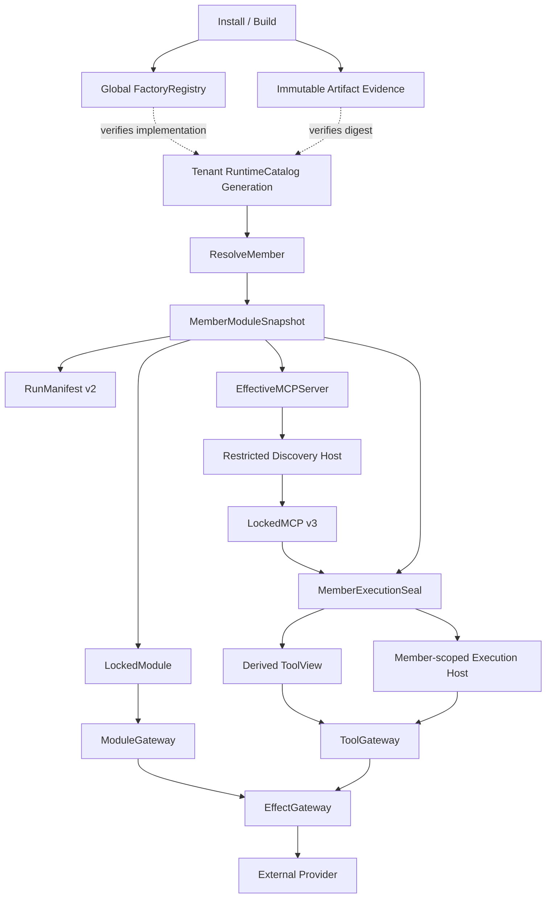

# FreeAgent RuntimeCatalog 与成员级执行授权设计（方案 B）

> S0 状态：`HISTORICAL_NON_NORMATIVE`。仅供 Catalog 与授权语义回溯，不再指导当前实现；当前架构权威见本目录 `README.md`。

日期：2026-07-21  
状态：用户已确认方案 B；本文为进入实施计划前的正式设计稿  
关联设计：

- `2026-07-20-locked-mcp-evidence-first-discovery-design.md`
- `2026-07-20-storage-backend-b-design.md`
- `2026-07-19-task3-lossless-persistence-design.md`

## 1. 决策摘要

FreeAgent 采用两层结构：

1. **进程级 FactoryRegistry 与不可变制品证据层**
   - 只登记无状态构造器、协议适配器和可验证的实现制品；
   - 不保存租户授权、租户配置、Secret、运行时会话或成员 ToolView；
   - 不作为任何 Agent、Workspace 或 Run 的执行授权来源。
2. **租户级完整 RuntimeCatalog 代际**
   - 每个租户拥有自己的完整、不可变目录代际；
   - 修改通过租户级 CAS 发布一个新代际；
   - 每个 Run 冻结且只冻结一个租户目录代际；
   - 同一个 Run 的每个成员根据自己的 Agent、Workspace、Profile、任务要求和权限交集生成独立快照。

这不是“全局目录加租户覆盖层”。运行时不得把全局 FactoryRegistry 当成缺省授权，也不得在租户目录未命中时实时回退到全局目录。

`Skill` 继续是可外挂的内容与工作流模块，不直接成为 RuntimeCatalog 中的可执行 Provider。若 Skill 需要执行工具，该工具必须通过一个独立、明确授权的运行时 Provider 暴露。

## 2. 对最初设计的影响

### 2.1 保持不变

- Agent 与 Workspace 继续自由组合，不被固定领域知识或单一运行时绑定。
- Role、Knowledge、Memory、Skill、MCP、Sidecar 等模块继续独立可选。
- `pure_chat` 允许零可选模块运行。
- 单领域专家、复合 Agent、审核 Agent 和普通填充型 Agent 继续并存。
- 领域知识仍优先通过共享 RAG 和标签检索获取，而不是固化进 Agent Workspace。
- Agent 的轻量基础记忆、上下文压缩、85% 压缩阈值和 100% 时按顺序移除最小完整前缀的原则不变。
- 多 Workspace 公平调度、权限交集、预算、调用账本、`UNKNOWN` 禁止语义重放等既有规则不变。
- PAB、情感或性格闭环不进入核心；以后可以作为外挂模块接入。
- SQLite 继续是默认后端，PostgreSQL 是同等语义的独立后端。

### 2.2 新增但不改变产品模型

- 增加“可执行实现从哪里来、由谁授权、冻结了哪个版本”的完整证据链。
- 将当前进程级 ToolGateway 改造成 Run/Member 级不可变 ToolView。
- 将 MCP Host 从协议传输原语提升为受目录、快照、权限和预算约束的生产运行时组件。
- RunManifest 升级到 v2，保存租户目录代际和成员级装配快照。
- 数据库增加目录、代际、成员快照、租约、撤销和 MCP 锁定证据。
- 为每次模型调用增加稳定调用位置和 ContextSourceAuthority 使用证明；它只
  保存“谁在何次调用中获准读取什么”的引用，不复制共享 RAG/Skill/Memory
  正文，也不把知识塞回 Agent Workspace。
- 为可信内核对账 route 增加 engine-local fencing；它只约束运行中 sender，
  不把 Core Provider 变成 Agent 必装模块或 RuntimeCatalog 全局 fallback。

这些变化落实模块化边界，不把 Agent 或 Workspace 变成重量级固定容器。

### 2.3 本轮 P0 终审修复对最初想法的影响

结论是**不改变最初产品设计**。新增的 Run lifecycle/generation-lease proof、model/query budget ledger、sender
fence、outcome-aware evidence parent 与精确 relation inventory 都属于 Store/执行控制面的可验证性闭包：它们不新增
Agent/Workspace 必装模块，不把 CoreModel 放进 RuntimeCatalog，不给 Skill 执行权限，不启用自动查询/自动预热/
自动重放，也不把 PAB 带入核心。`pure_chat` 仍不装载任何可选 Provider/Skill/MCP/Host/Secret；只有真正创建
Model dispatch 或显式 UNKNOWN reconciliation 时才产生对应账本行。代价是这些启用路径增加事务行数与迁移关系，
收益是并发预算、跨后端恢复和 UNKNOWN 证据不再依赖 opaque hash 或进程内状态。

## 3. 目标与非目标

### 3.1 目标

1. 一个租户不能通过另一个租户启用的外挂 Module/MCP Provider 获得执行权限。
2. Run 启动后不受普通目录更新影响，能够按冻结证据重启和恢复。
3. 同一 Run 的不同成员只能看到各自获准的工具与模块。
4. MCP 初始化、发现和调用都能追溯到同一组不可变身份与配置版本。
5. 纯聊天在空目录、空模块列表下仍能正常冻结和运行。
6. SQLite 与 PostgreSQL 保存完全相同的逻辑文档、哈希、代际、租约和撤销语义。
7. 跨数据库迁移后可以重建同一 RunManifest、成员快照和 LockedMCP 证据。
8. 普通禁用影响新 Run；紧急制品撤销可以阻止已冻结 Run 后续通过该
   Catalog Provider 发起的调用。
9. 任何缺失、歧义、版本漂移或恢复失败都在 Catalog Provider 调用之前
   失败关闭。

### 3.2 非目标

- 不实现全局基础目录与租户覆盖层的实时合并。
- 不实现跨租户共享逻辑授权。
- 不实现运行中自动切换 Provider。
- 不实现在线双写、分布式执行、多主目录发布或跨进程并发 claim。
- 不把 Skill 内容当成可执行二进制或 MCP Provider。
- 不让 MCP 服务端自行决定 FreeAgent 成员权限。
- 不在 FactoryRegistry 中保存 Secret 或租户配置。
- 不因缓存预热、成本优化或控制平面建议改变冻结授权。
- 首版不把核心模型 Provider、外部 Channel、核心 Store 或 Executor 纳入
  RuntimeCatalog；它们继续使用各自现有的可信配置、Dispatch 账本、
  Outbox/Channel cursor 和权限边界。
- 不把任意第三方 in-process 代码称为已隔离；没有已验证 OS sandbox 的
  本地第三方进程不具备 production 执行资格。

## 4. 核心术语与所有权

| 对象 | 所有者 | 是否授权源 | 是否可变 |
|---|---|---:|---:|
| FactoryRegistry | 进程 | 否 | 启动期构建，运行期只读 |
| ArtifactEvidence | 发布/安装层 | 否 | 按摘要不可变 |
| RuntimeCatalogGeneration | 单一租户 | 是 | 不可变，新版本新代际 |
| RuntimeCatalogEntry | 由租户代际引用 | 仅在代际内生效 | 内容寻址、不可变 |
| Module definition | Workspace/Agent/Profile | 参与装配 | 版本化 |
| TaskRequirements | Task | 参与装配 | Run 冻结后不可变 |
| MemberModuleSnapshot | Run + Member | 是 | 不可变 |
| RunManifest v2 | Run | 是 | 不可变 |
| LockedMCP v3 | Run + Member + Binding | 是 | 不可变 |
| Host session | Run + Member + Binding | 否，受冻结证据约束 | 临时 |
| MemberExecutionSeal | Run + Member | 是 | 一次性封存、不可变 |
| ToolView materialization | Run + Member + Seal | 否，可重建缓存 | 不原地扩展 |
| EffectAdmissionLease | Run + DispatchAttempt | 是 | 结果单独结算，执行器 QUIESCED 后释放 |
| HostArtifactLease | Host instance | 否，保护加载中的制品 | Host 关闭后释放 |
| SandboxBrokerTrustRootSet | 部署级 TCB | 是，仅证明 Broker 身份 | 进程启动后只读 |
| SandboxLaunchReservation | Backend owner + Host | 是，仅启动准入 | 一次性状态机 |
| SandboxAttestation | Broker + 精确 Host/process | 是，仅隔离证明 | 短期、一次性消费 |
| ReconciliationProviderRouteAuthority/Authority/Gate | 原业务 InvocationSlot/UNKNOWN | 是，仅只读对账 | 路线预冻结、Gate 一次性 |
| ReconciliationVerdict | 原 UNKNOWN Attempt | 是 | insert-once、不可变 |
| ModelCallPosition reservation | Run + Member + checkpoint | 是 | 一位置一次性绑定 |
| ContextManifest v2 | Model Dispatch | 是 | 不可变 |
| ContextSourceAuthority | ModelCall + Member | 是，仅内容读取/投影 | insert-once、不可变 |
| ContentPayload | Tenant shared content store | 否，是正文父记录 | 内容寻址、不可变、跨 Agent/Workspace 复用 |
| ContentVersion/UseEvidence | 共享内容版本 + ModelCall | 是，仅证明精确来源/读取 | insert-once、不可变，不复制正文 |
| CoreRuntimeInstance | Backend owner + Tenant + Core route | 否，engine-local liveness | fencing 状态机 |
| CoreRuntimeActivationGrant | 一次 ACTIVE transition | 是，Attempt 的稳定执行绑定 | insert-once、不可变 |
| CoreRuntimeTerminationProof | 一次 final fence | 是，仅证明 sender 已静止 | insert-once、不可变 |
| Secret value | Secret provider | 否 | 通过版本引用解析 |

## 5. 总体结构



虚线表示“可实例化与可验证”，不是授权继承。实线冻结链才构成执行授权。

## 6. 全局 FactoryRegistry

### 6.1 职责

FactoryRegistry 只负责：

- 根据精确身份找到无状态构造器或适配器；
- 验证构造器声明的 Runtime kind、Host kind 和协议版本；
- 验证实现制品摘要与安装证据一致；
- 创建仍需经过租户目录、成员快照和策略检查的候选实例；
- 报告支持的静态能力，不报告租户启用状态。

### 6.2 精确键

逻辑键至少包含：

```text
FactoryKind
FactoryID
HostKind
ProtocolVersion
ArtifactDigest
```

比较使用规范化字节和精确相等，不允许：

- 仅按显示名称匹配；
- 自动选择“最新版本”；
- 协议版本模糊回退；
- 摘要缺失时按路径或包名猜测；
- 租户目录未命中时选择同 kind 的任意工厂。

### 6.3 生命周期

- 进程启动时构建只读快照。
- 重复精确键且实现证据不同，启动失败。
- 运行期安装或卸载需要构建新的进程级快照，不原地篡改。
- 已冻结 Run 的恢复要求精确工厂和制品仍可验证；缺失时 Run 进入明确的安全阻断状态，不换用近似实现。

## 7. 不可变制品证据

制品证据可以被多个租户引用，但不授予任何权限。证据至少记录：

- 制品内容摘要；
- 制品格式和平台约束；
- 构建或安装验证状态；
- 对应 Factory 精确键；
- 可选签名或供应链证据。

制品路径、加载时间、进程 ID 和动态实例 ID 不进入稳定身份哈希。
制品证据本身永远不可变；全局紧急撤销使用独立、append-only、带单调
序号的 `ArtifactRevocationRecord`，当前撤销状态只是这些记录的投影。

## 8. 租户级 RuntimeCatalog

### 8.1 完整代际

每个租户的一个代际是完整目录，不是增量补丁。发布新代际时：

1. 读取当前租户代际；
2. 构造完整候选文档；
3. 验证所有条目和引用；
4. 规范化并计算哈希；
5. 使用 `expected_generation` 和 `expected_hash` 做 CAS；
6. 成功后将候选发布为新的当前代际。

不同租户的更新互不增加对方代际，也不争用同一全局 CAS。

### 8.2 空目录

空目录是合法完整代际。它仍有：

- 正模式版本；
- TenantID；
- 正代际号；
- 空的有序条目集合；
- 一个规范的空 SkillContentCatalog 正代际及其 hash；
- 稳定目录哈希。

空 generation 1 证明“零外挂也能启动”，但 `pure_chat` 不要求租户当前
RuntimeCatalog 必须为空。RuntimeCatalog 是该租户可被装配的授权上限，不是
自动装配集合；即使当前代际包含 Provider，pure_chat 的 MemberSnapshot、
MemberExecutionSeal 和 ToolView 仍显式选择零 Provider，不创建外挂
Module/MCP Host、不读取模块 Secret，也不获得工具。纯聊天仍可调用核心模型
Provider；核心模型选择和调用继续经过既有 Model route、预算、
DispatchAttempt 和 Usage/Cost 账本，不从 RuntimeCatalog 获得权限。

创建租户时，在同一事务中先创建空 SkillContentCatalog generation 1，再
创建引用它的空 RuntimeCatalog generation 1。这里的“空”表示没有
executable entry、没有 Skill membership；锚点本身不是已装配 Skill，也
不会触发内容加载。

### 8.3 条目

RuntimeCatalogEntry 表示一个可执行 Provider 身份。它可以被多个租户代际引用，但只有租户代际成员关系产生授权。

条目至少包含：

- 条目正模式版本；
- Runtime kind；
- 稳定 Provider ID；
- Factory 精确键；
- 制品摘要；
- Host kind；
- 协议版本；
- 静态能力摘要；
- 配置 Schema 摘要；
- 兼容性约束；
- 条目内容哈希。

条目本体不重复 TenantID，以便相同内容身份安全复用。数据库中的“租户代际—条目成员关系”必须包含 TenantID、generation、ordinal 和 entry hash。

### 8.4 首版 Runtime kind、核心能力与 Skill

首版 RuntimeCatalog 只登记 `MemberModuleSnapshot` 能够冻结的两类外挂
可执行实现：

- `EffectiveMemberModule.Runtime` 引用的 Module Provider；它可以使用
  `IN_PROCESS` 或 `SIDECAR` Host kind，Knowledge/Memory 等能力只有作为
  显式 Module attachment 时才进入这里；
- `EffectiveMCPServer.Runtime` 引用的 MCP Provider。

Host kind 同时带强制 TrustClass：

- `IN_PROCESS + CORE_TCB`：只允许编译进 FreeAgent 可信内核、存在于
  构建期 allowlist、制品摘要与当前二进制身份一致的第一方实现；
- 租户上传、第三方 Go plugin、DLL/so 和任意原生库永远不能登记为
  IN_PROCESS；
- 第三方扩展默认使用 SIDECAR 或 MCP；
- 本地第三方进程只有在平台 sandbox/capability broker 报告已验证隔离时
  才可在 production mode 激活；没有该能力时失败关闭，不能仅靠依赖注入
  声称隔离；
- 远程 MCP 仍受网络、SSRF、Secret、权限和 EffectGateway 边界约束。

本地第三方 SIDECAR 和 MCP stdio 的隔离证明使用独立
`SandboxAttestation`。它由可信、OS 专用的 CapabilityBroker 签发，而不是
租户、Provider 或 FactoryRegistry 自证：

```text
schema_version = 1
TrustDomainID / BrokerID / BrokerKeyID / BrokerTrustRootSetHash
BackendID / BackendOwnerEpoch
HostInstanceID / HostRole / ProviderBindingIdentityHash
SandboxLaunchReservationID / BrokerLaunchID / OSProcessIdentityHash
BrokerLaunchLedgerHash
HostPlatformHash
ArtifactDigest / ExecutableIdentityHash
SandboxProfileID / SandboxProfileVersion
RequestedCapabilitySetHash / GrantedIsolationSetHash
FilesystemBoundaryHash / NetworkBoundaryHash / ProcessBoundaryHash
ResourceCeilingHash
IssuedAt / ExpiresAt / AttestationNonce
AttestationHash / BrokerSignature
```

Attestation 使用独立 `freeagent.sandbox-attestation.v1` hash domain，精确绑定
单次 Backend owner、Host、Broker launch、OS 进程、制品、可执行身份、请求
权限和实际隔离边界；它不授予租户执行权，只证明该 Host 的运行条件。

Broker 信任根由进程/部署级 TCB 配置 `SandboxBrokerTrustRootSet` 拥有，启动
前加载并在进程生命周期内只读。其规范正文冻结 TrustDomainID、set version、
按 `(TrustDomainID, BrokerID, BrokerKeyID)` 排序的 public key/status 和
TrustRootSetHash；同一个 Broker key/public-key digest 不得登记到多个
TrustDomain。租户、Provider、RuntimeCatalog、数据库和迁移包都不能新增或
替换信任根；租户提供、自签、未知 key 或 Attestation 中替换 TrustDomainID
一律拒绝。目标后端使用目标部署自己的信任根，并在 cutover 前预检兼容性。

每次启动使用持久化 `SandboxLaunchReservation` 一次性状态机：

```text
RESERVED -> LAUNCH_PENDING -> ATTESTED -> CONSUMED
    \-> FENCED(reason=NEVER_LAUNCHED)
               \             \-> FENCE_PENDING -> FENCED
                \----------------^
```

Reservation 规范 grant 至少包含：

```text
schema_version = 1
TrustDomainID / BrokerID / BrokerKeyID / BrokerTrustRootSetHash
BackendID / BackendOwnerEpoch
ReservationID / AttestationNonce / BrokerLaunchSpecHash
HostInstanceID / HostRole / ProviderBindingIdentityHash
ArtifactDigest / ExecutableIdentityHash
RequestedCapabilitySetHash / SandboxProfileID / SandboxProfileVersion
ReservationGrantHash
```

1. 当前 ACTIVE Backend owner 先保存 `RESERVED` grant，再以 CAS 转为
   LAUNCH_PENDING；ReservationID + AttestationNonce 是发给 Broker 的不可变
   幂等键，BrokerLaunchSpecHash 覆盖精确启动参数；
2. production CapabilityBroker 必须拥有独立持久化启动账本，在创建 OS
   process 前按该幂等键 durable-reserve，提供
   `StartOrGetLaunch/GetLaunch/ReconcileLaunch/FenceLaunch`；重复请求只能返回
   同一个 BrokerLaunchID/OSProcessIdentityHash，不能创建第二个进程；
3. Broker 将 ledger state、BrokerLaunchID/OSProcessIdentityHash 和上述
   grant 身份签入 Attestation；Runtime 收到后把 Reservation CAS 为 ATTESTED；
4. Store 事务验证 owner、信任域、签名、有效期、边界和撤销 watermark，以
   CAS 消费 ATTESTED；同一事务创建 HostArtifactLease；
5. 数据库提交结果模糊时先按 ReservationID 读取并严格验证，不再次启动；
   Broker 响应丢失、Runtime 在响应前崩溃或 ATTESTED 落库前崩溃时，只能按
   原幂等键 Get/Reconcile，不能另发新启动；
6. Broker 必须在自身重启后从持久账本和带 Reservation 标签的 OS
   process/container group 重建同一 launch。Broker 不可查询、账本/OS 事实
   冲突或无法证明进程静止时，Reservation 进入 FENCE_PENDING，Run 保持
   SUSPENDED；不得创建新 Reservation、完成关停、迁移或释放制品；
7. FenceLaunch 证明精确进程不存在或已经 QUIESCED 后，Reservation 才能进入
   FENCED。新 Backend owner 只能 reconcile/fence 旧 launch，不能把它接管为
   新 Host；
8. 若 Runtime 在 `RESERVED` 提交后、CAS 到 `LAUNCH_PENDING` 前崩溃或由当前
   ACTIVE owner 显式取消未启动 reservation，只有在数据库仍精确为
   `RESERVED`，BrokerLaunchID、OSProcessIdentityHash、BrokerLaunchLedgerHash、
   AttestationHash 均为空，不存在 Attestation consumption/HostArtifactLease，
   且原 owner epoch 已被 fence（或就是执行取消的当前 ACTIVE owner）时，才可
   直接 CAS 为 `FENCED(reason=NEVER_LAUNCHED)`。该 CAS、终态 history 追加与
   liveness 释放必须同事务完成。发送 Broker 请求必须严格发生在
   `LAUNCH_PENDING` 提交之后，因此这个分支不调用 Broker；只要读到
   `LAUNCH_PENDING` 或任一 launch/process/attestation/ledger 身份，就必须走原
   ReservationID + AttestationNonce 的 Get/Reconcile/Fence 流程，不能猜测
   “尚未启动”。

SandboxLaunchReservation 在 HostArtifactLease 创建前就是 liveness lease，
阻止 Run 终态、Artifact GC 和离线 transfer。跨 BackendOwnerEpoch、
HostInstanceID、HostRole、launch、进程或 lease 的证明替换全部拒绝。

以下唯一约束在 SQLite/PostgreSQL 中完全一致：

```text
(TrustDomainID, BrokerID, BrokerLaunchID)
(BackendID, BackendOwnerEpoch, OSProcessIdentityHash)
(BackendID, BackendOwnerEpoch, ReservationID)
```

并且每个
`(BackendID, BackendOwnerEpoch, HostInstanceID, HostRole)` 最多一个活动
Reservation，消费后最多一个活动 HostArtifactLease；AttestationHash 也只能
被消费一次。

Host 创建、Stage 1、PREWIRE/POSTWIRE 和恢复都验证 Attestation、一次性消费
事实及最新撤销 watermark，并把 AttestationHash 绑定到 HostArtifactLease。
重启后必须创建新的 Reservation 并取得新证明，旧证明不能复活 Host。

Sandbox 撤销使用统一规范记录：

```text
schema_version = 1
RevocationKind = BROKER_KEY | ATTESTATION
TrustDomainID
RevocationSeq
BrokerID / BrokerKeyID
AttestationHash（ATTESTATION 时必填，BROKER_KEY 时必须为空）
ReasonCode
RecordHash
```

RevocationSeq 在 TrustDomainID 内单调递增，唯一键为
`(TrustDomainID, RevocationSeq)`；记录使用
`freeagent.sandbox-revocation.v1`，append-only。`BROKER_KEY` 撤销影响该 key
在其被 TCB 钉住的唯一 TrustDomain 内签发的全部证明，`ATTESTATION` 只影响
精确 hash。watermark 查询键是
`(TrustDomainID, BrokerID, BrokerKeyID)`；两种记录均通过同一窄端口发布、
读取和比较，Attestation 不能通过声明另一个 domain 逃逸。

Attestation/Broker key 紧急撤销按精确证明查找受影响成员，在同一串行操作中
关闭成员 gate：PREWIRE 结算 NOT_EXECUTED，POSTWIRE 完成或变 UNKNOWN；
随后 fence/终止精确本地进程并等待 EffectAdmissionLease QUIESCED，Host 确认
关闭后才释放 HostArtifactLease。不得在同一 Run 中换一个较弱 sandbox
profile 重新打开原 Seal。

没有可验证 CapabilityBroker、证明过期/撤销、平台能力不足或请求权限超出
隔离边界时，production mode 必须拒绝本地第三方 SIDECAR/MCP stdio。远程
MCP 不需要本地进程 attestation，但继续受远程传输安全边界约束。

EffectGateway 是授权与账本边界，不是恶意 in-process 代码的沙箱。CORE_TCB
若绕过 Gateway 属于可信内核安全缺陷，不能以 RuntimeCatalog 设计掩盖。

核心模型 Provider、Channel adapter、Store 和 Executor 不属于首版
RuntimeCatalog。它们不是“全局目录 fallback”，而是 FreeAgent 可信内核
已有的独立 authority path。以后若要统一管理，必须设计新的版本化契约和
每次调用准入，不能通过给本目录增加一个 kind 隐式扩大授权范围。

Skill 仍属于内容和工作流装配：

- Skill 文本、模板、规则和脚本描述由 Skill 模块管理；
- Skill 本身不因为被附加就获得进程执行能力；
- Skill 需要的工具必须绑定到独立 RuntimeCatalog Provider；
- Resolver 必须分别验证 Skill 内容授权与其工具 Provider 授权。

### 8.5 SkillContentCatalog

Skill 使用独立的内容权威，不复用可执行 RuntimeCatalog：

- 全局只保存不可变 Skill package/digest 证据；
- 每个租户拥有完整、不可变、按 CAS 发布的 SkillContentCatalog 代际，
  决定可附加的精确 SkillRef；
- 每个 RuntimeCatalogGeneration 头部冻结一个精确
  `SkillContentCatalogGeneration/Hash`；RuntimeCatalogHash 覆盖这个锚点，
  所以现有 MemberSnapshot 的 RuntimeCatalogGeneration/Hash 同时证明
  executable provider 与 Skill 内容授权，而不把 Skill 伪装成 executable entry；
- MemberModuleSnapshot 冻结 ID、version、digest、ConfigBlobRef、来源和
  granted capabilities；
- 普通禁用只影响新 Run；
- 精确内容安全撤销使用独立 append-only 记录，阻止当前 Run 再读取该
  Skill 内容，但不会自动切换版本，也不会产生可执行权限；
- Skill 中描述的脚本、命令或工具只有通过另一个已授权 Module/MCP
  Provider 才能执行。

发布新的 SkillContentCatalog current 本身不会改变任何现有
RuntimeCatalogGeneration 或 Run。要让新 Skill 进入后续装配，控制面必须再
以独立 CAS 发布一个引用该 Skill generation/hash 的新
RuntimeCatalogGeneration。两步之间崩溃时，新的 Skill 代际只是不可变、
尚未被 RuntimeCatalog 锚定的安全事实；Run 继续使用旧锚点。第二步失败可以
幂等重试或由以后目录代际引用，不能原地修改旧 RuntimeCatalog。

Skill 内容通常进入模型上下文，因此紧急撤销还必须关闭受影响 Run 的新
模型 Dispatch 准入：

- 尚未发送的模型 PREWIRE 结算为未执行；
- 已进入模型 POSTWIRE 的请求按既有 Model Dispatch 账本完成或变为 UNKNOWN；
- 存在 UNKNOWN 时保持 SUSPENDED，不得用删除 Skill 后的新提示语义重放；
- 下一次 ContextManifest 必须重新验证精确 Skill digest 和撤销序号。

SkillContentCatalog 至少持久化 package evidence、租户代际、按 ordinal
排序的 membership、current CAS、普通禁用和全局内容撤销记录。恢复与
SQLite ↔ PostgreSQL transfer 必须保留其规范文档、代际、哈希、顺序和
撤销序号。

候选 SQLite v2 中把 `SKILL` 当作 RuntimeCatalog executable provider 的旧
结构被本文明确替代；该候选迁移不得直接提升为生产迁移。正式 SQLite v2
使用独立 Skill 内容表与窄端口。

### 8.6 哈希

代际哈希覆盖：

```text
schema_version
tenant_id
generation
ordered(entry_hashes)
skill_content_catalog_generation
skill_content_catalog_hash
```

条目顺序是证据的一部分，使用显式 ordinal 保存。不得依赖数据库默认顺序、Map 遍历顺序或区域设置排序。

## 9. 配置、Secret 与会话边界

### 9.1 配置

目录条目只声明配置 Schema 和实现身份，不拥有 Provider-global 配置。
Workspace、Agent、Profile 或 Task attachment 继续拥有自己的配置；Resolver
将最终配置字节冻结为现有不可变
`ConfigBlobRef{SHA256, Size}`。ConfigBlobRef 只表示配置内容地址，不扩大
其公开 Schema。

EffectiveMemberModule、EffectiveMCPServer 或等价的 resolved binding 在
自己的 authority hash 中共同绑定：

- TenantID；
- Module/MCP attachment 与 BindingSource provenance；
- Provider/Runtime identity；
- ConfigBlobRef；
- 精确 SecretRef 及精确版本；
- Config Schema 摘要。

同一 Provider 可在不同 Agent、成员或 Run 中使用不同 ConfigBlobRef，不会
形成第二配置真相源。Config blob 按内容地址只读保存，配置值不得进入全局
FactoryRegistry、RuntimeCatalogEntry 或日志。

`ConfigBlobRef` 只有在权威 `config_blobs` 存储中存在精确原始规范字节、
字节数与 SHA256 时才有效。恢复和迁移必须保留这些字节并重新计算引用，
不能只迁移 `{SHA256, Size}`；配置 blob 可以包含敏感配置但不得包含 Secret
值，Secret 仍只通过版本化 SecretRef 解析。

### 9.2 Secret

- Secret 值不进入 RunManifest、MemberModuleSnapshot、LockedMCP、日志或迁移包。
- 冻结文档只保存 SecretRef 和要求的版本。
- Host 构造时解析 Secret；解析结果只存在于受控实例内存。
- Secret 版本不匹配时失败关闭，不静默读取最新值。
- Secret 轮换只自动影响新 Run。已冻结 Run 始终要求精确 SecretRef 版本：
  - 原版本仍有效时继续使用原版本；
  - 原版本失效、撤销或已销毁时，先关闭该 Binding 的新准入；
  - 尚未上线路的调用结算为 `NOT_EXECUTED`；
  - 没有未决外部效果时，按冻结的 FailurePolicy 进入 `BLOCKED` 或明确的
    可选模块失效结果；
  - 存在 `POSTWIRE/UNKNOWN` 时保持 `SUSPENDED` 和租约，只允许对账；
  - 不得换用新 Secret 重放原语义请求。

### 9.3 MCP 会话作用域

MCP 会话键至少包含：

```text
TenantID
TaskID
RunID
MemberID
BindingHash
RuntimeCatalogGeneration
RuntimeCatalogHash
RunManifestHash
MemberSnapshotV2Hash
RunMemberBindingHash
GovernanceSnapshotHash
FrozenGovernanceRevocationWatermark
FactoryKey
ArtifactDigest
RuntimeIdentity
ConfigBlobHash
ExactSecretRefVersionSet
LockHash（执行 Host）
LockedMCPGovernanceAssociationHash（执行 Host）
MemberExecutionSealV2Hash（执行 Host）
```

不得跨租户、跨 Run、跨成员、跨 BindingHash、跨 GovernanceSnapshot/watermark、跨 LockHash、
跨 Association 或跨 SealHash
复用 MCP 会话。首版禁止在上述作用域之间共享带凭据的 HTTP client、
Cookie jar、HTTP/2 connection、stdio process 或任何服务端 session；只可
共享无状态编解码器、严格验证器和只读制品字节。

## 10. ResolveMember

`ResolveMember` 是无副作用、可重复的纯装配函数。输入至少包括：

- WorkspaceDefinition；
- AgentVersion；
- AssemblyProfile；
- TaskRequirements；
- 租户 RuntimeCatalogGeneration；
- 租户/Workspace/Agent 治理事实编译出的精确
  ResolvedMemberGovernancePolicySnapshot；
- 成员身份和被授予的权限边界；
- 可用模块版本和内容证据。

治理层先调用同样无副作用的 `ResolveMemberGovernance`，从精确
GovernancePolicyGeneration、source documents、成员/任务身份和 Provider
capability 生成完整 `ResolvedMemberGovernancePolicySnapshot`。随后
`ResolveMember` 只消费这个已解析 snapshot，并输出 `MemberModuleSnapshot`
或确定性错误；它不读取 governance current，也不创建或改写治理政策。

### 10.1 解析顺序

1. 验证所有输入文档和版本。
2. 计算 Workspace、Agent、Profile 和 TaskRequirements 的稳定哈希。
3. 根据显式装配规则选择模块，不使用进程全局默认模块。
4. 计算权限交集：

```text
Tenant policy
∩ Workspace policy
∩ Agent policy
∩ Profile policy
∩ Task requirements
∩ Provider capability
```

5. 对每个可执行绑定要求租户目录中存在精确条目。
6. 验证 resolved binding 中的 ConfigBlobRef、精确 SecretRef 版本和静态能力。
7. 验证并复制供 RunManifest v2 冻结的成员
   ResolutionScopeHash、RuntimeCatalogGenerationRefHash、PolicyGeneration/Hash、
   PolicyHash、四个 component hash、RunMemberBindingHash、GovernanceSnapshotHash 与
   FrozenGovernanceRevocationWatermark；PolicyHash 只用于稳定等价，不能替代 snapshot；
8. 生成稳定排序的 Modules、Skills 和 MCP bindings。
9. 计算成员快照哈希。

### 10.2 禁止行为

- 不因模块缺失而选择相似模块。
- 不因 MCP 不可用而把专业任务静默降级为普通聊天。
- 不把 `character_chat` 或其他 Profile 的缺失解释成通用 Profile。
- 不读取当前目录以外的未来代际。
- 不在不同成员间共享已解析的 ToolView。
- 不把动态 RunID、AttemptID 或时间戳放入稳定装配哈希。

### 10.3 GovernancePolicySnapshot

Tool、Content、Authority、Budget leaf document、严格 selector union、规则合并与
成员 snapshot 的 v1 wire 由
[`2026-07-22-governance-rule-wire-v1-lock.md`](2026-07-22-governance-rule-wire-v1-lock.md)
补充锁定。该补充只把既有 fail-closed 治理要求变成可恢复证据，不改变 Skill 的
非执行属性、`pure_chat` 零 Provider 或 Agent/Workspace 自由装配边界。

4B2 对本文件具有窄范围的版本化优先级：凡本文件旧段落仍只写 `DataScopeHash`、单一
`MatchedContentPolicyRuleHash`、仅 PolicyHash 的运行授权，或要求把 GovernanceSnapshotHash
直接写入 LockedMCP v3，均由 4B2 的 ClauseSet+actual-use proof、MatchedRuleSet、
RunMemberBinding+Snapshot tuple 和 MappingV2/Association 取代。旧 v1 字节只读审计，不在
原 domain 内重解释；LockedMCP v3 与 legacy MCP Tool Mapping v1 则保持原字节，由关联文档
闭合。

自本段起，未显式标注版本的 `MemberSnapshot`、`MemberExecutionSeal`、
`ProviderInvocationAuthority`、`SemanticInvocationDocument`、`ModelDispatchAuthority`、
`ContextSourceAuthority`、Tool/Content evidence 与 provenance 均指本设计中最新 V2；只有
明确写出 `v1` 或 `audit-only` 时才表示旧格式。`LockedMCP v3` 与
`MCPToolApprovalMapping v1` 是例外：既有 schema、规范字节与 hash 永久保持不变，由
MappingV2/Association/SealV2 在外层关闭治理快照。

治理授权不是进程配置，也不能由 MCP discovery 临时生成。租户拥有独立、
不可变、可 CAS 发布的 `GovernancePolicyGeneration`：

```text
schema_version = 1
TenantID
PolicyGeneration
ParentPolicyGenerationHash
OrderedSourcePolicyRefs
PolicyGenerationHash
```

`PolicyGenerationHash` 使用
`freeagent.governance-policy-generation.v1`。发布以
`(TenantID, expected current generation/hash)` 做 CAS；代际只能递增，
历史代际不可改写。`governance_policy_current` 只是新 Run 的选择指针，不是
既有 Run 的实时授权源。

每个 SourcePolicyRef 至少冻结：

```text
PolicyLayer
ScopeIdentityHash
SourcePolicyVersion
SourcePolicyDocumentHash
ToolPolicyDocumentHash
ContentPolicyDocumentHash
AuthorityPolicyDocumentHash
BudgetPolicyDocumentHash
```

来源层按以下固定顺序求限制性交集，而不是 last-writer-wins：

```text
PLATFORM_SAFETY_BASELINE
∩ TENANT
∩ WORKSPACE
∩ AGENT_VERSION
∩ ASSEMBLY_PROFILE
∩ TASK_SCOPE
∩ PROVIDER_CAPABILITY
```

更具体的层只能缩小上层已经允许的权限、数据范围、effect class、审批等级和
预算，不能新增上层没有授予的能力；任一显式 deny 优先。缺失、歧义或无法
验证的可执行 Provider 规则按 deny 处理。pure_chat 不因没有 Tool/Content
授权而失败，因为它不获得 Provider 执行权。

Run 冻结时，对每个成员按 4B2 exact wire 先生成稳定
`ResolvedMemberGovernancePolicyV1`，再生成运行期 `RunMemberBindingV1`，最后生成完整
`ResolvedMemberGovernancePolicySnapshotV1`。闭包固定为：

```text
MemberGovernanceResolutionScopeV1
  -> ResolvedMemberGovernancePolicyV1
  -> RunMemberBindingV1
  -> 四个完整 Resolved component documents
  -> GovernanceSnapshotHash
```

PolicyHash 不含 RunID、MemberOrdinal 或 watermark，仅用于稳定等价/缓存；运行授权必须引用
`RunMemberBindingHash + GovernanceSnapshotHash + FrozenGovernanceRevocationWatermark`。相同
PolicyHash 不能替换不同运行绑定或撤销水位的 snapshot。

4B2 RunMemberBinding exact body 还必须逐字段冻结：

```text
DeploymentTrustDomainID
PlatformSafetyBaselineAuthorityHash / ResultClassifierDefinitionHash
TenantScopeAuthorityHash / WorkspaceScopeAuthorityHash / AgentScopeAuthorityHash
WorkspaceScopeAssociationHash / AgentScopeAssociationHash / RunScopeAuthorityHash
TenantID / WorkspaceID / TaskID / RunID / MemberOrdinal / MemberID
ResolutionScopeHash / RuntimeCatalogGenerationRefHash
PolicyGeneration / PolicyGenerationHash / MemberGovernancePolicyHash
FrozenGovernanceRevocationWatermark / RunMemberBindingHash
```

stable identity authority、Definition/Version association、ContentBindingContribution generation/ref、
requested binding、classifier/baseline 的 exact wire 和信任边界均以 4B2 candidate 为准。

Tool、Content 与总 Policy 分别使用独立 hash domain：

```text
freeagent.governance-tool-policy.v1
freeagent.governance-content-policy.v1
freeagent.member-governance-policy.v1
```

本规范中所有 Tool、Content、CoreModel 与 reconciliation 的 required-permission 集合统一使用 4B2
候选冻结的 exact wire，不再定义局部字符串集合哈希：

```text
PermissionSetV1 {
  schema_version = 1
  ordered_permissions[] moduleapi.Permission
  permission_set_hash
}
```

`PermissionSetHash = H("freeagent.governance-permission-set.v1",
RFC8785(body deleting only permission_set_hash))`。输入必须已经按 `moduleapi.Permission` 的规范
ASCII/UTF-8 key 严格升序且无重复；空集合编码为 `ordered_permissions=[]`，仍产生非空 hash。
`RequiredPermissionCount` 只是从 normalized entries 派生的索引/child-shape scalar；下游 exact authority 明确
列出它时也必须等于数组长度，但它不属于 `PermissionSetV1` canonical body，也不得参与第二个 hash domain。所有
`RequiredPermissionSetHash` 必须逐字段等于对应 `PermissionSetV1.PermissionSetHash`；禁止对逗号拼接
字符串、Go map、数据库聚合顺序或缩减 permission 名称列表求 hash。

物理实现把 exact set 与其 normalized entries 保存为 portable PA：

```text
governance_permission_sets_v1 = FULL(PermissionSetV1)

governance_permission_set_entries_v1 {
  PermissionSetHash
  PermissionOrdinal
  Permission
}

uq_governance_permission_set_hash_parent_v1 {
  PermissionSetHash
}

uq_governance_permission_set_full_parent_v1 {
  SchemaVersion=1,PermissionSetHash,RequiredPermissionCount(derived)
}

uq_governance_permission_set_entry_parent_v1 {
  PermissionSetHash,RequiredPermissionCount(derived),PermissionOrdinal,Permission
}
```

entry ordinal 从 0 连续，base body 与 entries 必须双向 set-equality。只携带
`RequiredPermissionSetHash` 的 authority 立即引用 hash parent，并同时通过其 EvaluatedGrant、Mapping 或
resolved-policy 复合 parent 证明该 hash 的调用级归属；内嵌 full set 的 authority 引用 full parent。单独存在一个
合法 PermissionSet 只证明集合内容，不授予任何 Agent、Workspace、成员、Provider 或模型调用权限。
PermissionSet 的 direct-edge inventory 是封闭集合：任何 relation 只要含
`PermissionSetHash`、`RequiredPermissionSetHash`、`GrantedPermissionSetHash` 或
`EffectiveRequiredPermissionSetHash`，都必须用同列同序立即 FK 到
`uq_governance_permission_set_hash_parent_v1`；内嵌 full set 还必须 FK
`uq_governance_permission_set_full_parent_v1`。V1 允许的具体 consumers 恰为：

```text
governance_provider_binding_admissibility_proofs_v1
governance_evaluated_tool_grants_v1
governance_evaluated_content_grants_v1
member_execution_seal_entries_v2
member_snapshot_module_provider_bindings_v2
member_snapshot_mcp_provider_bindings_v2
mcp_tool_governance_mapping_entries_v2
mcp_content_governance_mapping_entries_v2
provider_invocation_authorities_v2 + five active projections
semantic_invocation_documents_v2
mcp_content_read_semantic_invocations_v2
core_reconciliation_governance_authorities_v1
reconciliation_provider_route_authorities_v2
model_permission_authorities_v1 + attempt child-shape + four mode shadows
model_call_reservation_finalized_v2 + initial/retry projections
model_dispatch_attempt_authorities_v2 + initial/retry/four mode projections
model_unknown_read_only_reconciliation_authorities_v1
model_unknown_read_only_reconciliation_authority_provider_status_v1
model_unknown_read_only_reconciliation_authority_signed_provider_receipt_v1
model_unknown_read_only_reconciliation_authority_operator_decision_v1
model_unknown_read_only_reconciliation_authority_common_parents_v1
model_unknown_reconciliation_governance_parents_v1
model_unknown_provider_status_acquisition_parents_v1
model_unknown_signed_provider_receipt_acquisition_parents_v1
model_unknown_operator_decision_acquisition_parents_v1
skill_content_use_authorities_v2
knowledge_content_authorities_v2
memory_content_authorities_v2
mcp_content_retrieval_evidence_v2
tool_result_evidence_v2
tool_result_content_use_authorities_v2
context_source_authorities_v2 + seven SourceKind projections
context_content_provenance_documents_v2 + seven SourceKind source-link projections
```

`reconciliation_query_key_authorities_v1` 与 `reconciliation_authorities_v1` 不含 PermissionSet 字段，因而明确不在
consumer 清单；其权限闭包分别由 route/governance parent 的直接边提供，禁止给它们伪造一个并不存在的
`RequiredPermissionSetHash`。其中 BindingAdmissibilityProof、两个 EvaluatedGrant、ModelPermission、
CoreReconciliationGovernanceAuthority 与上述 Model UNKNOWN reconciliation base/四个 projections
既要直连 PermissionSet parent，又要连接自己的 policy/binding/scope composite parent；不能用后者的传递可达性
代替 direct FK。schema descriptor 对全部 `*PermissionSetHash` 列执行反向 set-equality：出现未列 consumer、漏
direct edge、或 consumer 列值与其 BindingProof/EvaluatedGrant/ModelPermission/CoreRecon parent 不等都视为
Schema 损坏。五个 Model UNKNOWN reconciliation authority consumers 各自保存 `RequiredPermissionSetHash` typed scalar，
立即引用 hash parent；base 与 common projection 还保存 derived count 并立即引用 full parent，三个 branch
projection 通过同列同序 FK 引用 base/common 后仍必须各自保留 direct PermissionSet edge。不得把
base→projection 或 governance closure 的传递可达性当成 direct edge。schema-introspection golden 对清单做
双向 set-equality：所有含四类 `*PermissionSetHash` 列的 relation 恰好出现一次，且每个声明 consumer 恰有一条
普通、立即、非 partial FK。三个 outcome-aware acquisition parents 因内嵌 authority common parent 而复制 full
PermissionSet，它们同样各自直连 hash+full parents，并逐字段等于所引用 authority；不能只靠 acquisition→authority
传递边。
Store 必须提供 `PutPermissionSetWithEntries`/`GetPermissionSetStrict`，同一事务写 base+normalized
entries；`internal/governance` repository 是唯一构造入口，其他模块只按 hash 读取。strict restore 重算 canonical
bytes/hash、连续 ordinal、count/root、base↔entries 双向 set-equality和上面每条 immediate edge；不得从 consumer
聚合字符串、旧 singular 字段或 current cache 补造 entries。
这些 V1/V2 authority 尚未形成首个公开稳定 wire；本次是 pre-first-release correction。不得把旧 singular
permission 字段或 model-private set hash 作为已发布历史静默迁移；若实现仓中曾生成候选数据，只能丢弃并按
本 exact wire 重建，不能原地重解释其 bytes/hash。

CanonicalResolvedToolPolicy 按 Governance generation source-group 顺序保留完整 all-matches
rule program，冻结 effect class、权限、审批等级、DataScopeClause、请求/结果上限、预算类别和
MCP operator revision/delivery/local gateway identity。CanonicalResolvedContentPolicy 覆盖所有
可进入模型上下文的
`SourceKind`：

```text
SKILL | KNOWLEDGE | MEMORY |
MCP_RESOURCE | MCP_RESOURCE_TEMPLATE_RESULT | MCP_PROMPT | TOOL_RESULT
```

每条规范规则至少冻结完整 SourcePolicyRef/applicability、`SourceKind /
SelectorIdentityHash / RequiredPermissions[] / DataScopeClause /
MaxSourceBytes / MaxProjectedBytes / ProjectionPolicyHash / RuleOrdinal / RuleHash`。
一个实际 grant 保存有序 MatchedRuleSet，不能用单一 synthetic RuleHash 丢失 all-matches 来源。
selector 的严格类型矩阵为：Skill 使用
精确 SkillRef/package/tag；Knowledge 使用 collection/source/tag/version；
Memory 使用 owner/scope/record kind；MCP 三类内容沿用精确 URI、模板或 Prompt
identity 及参数/展开边界；Tool result 使用 Provider/operation/result class。
Content policy 只授权“读取并投影为模型输入”，不授权执行 Provider，也不
放宽 ToolPolicy。规则按完整 canonical body 稳定排序；相同 selector/effect 但不同 ceiling
可以共存并全部收窄，只拒绝完整 body 重复。冲突不能按输入顺序覆盖。缺失精确匹配时 deny；
pure_chat 的空内容集合仍合法，MODULAR 可以零 executable Provider 但显式选择
Skill/RAG/Memory。

冻结采用“事务外纯预计算 + 提交时精确 CAS 重验”：

1. 控制面读取预期 `governance_policy_current` generation/hash 和当时全部
   适用治理撤销 watermark；
2. 读取不可变 generation/source documents，先对所有成员运行
   ResolveMemberGovernance，再把结果传给 ResolveMember；
3. 在冻结提交事务中重新比较 current generation/hash 与每个预期撤销
   watermark；任一变化都回滚并丢弃候选，不混用新旧事实；
4. 重新验证 generation 文档、全部 SourcePolicyDocument、成员 snapshot
   和引用哈希；
5. 保存完整 scope/policy/binding/snapshot，并把每个成员的 MemberOrdinal、
   RunMemberBindingHash、ResolutionScopeHash、RuntimeCatalogGenerationRefHash、
   PolicyGeneration/Hash、PolicyHash、四个 component hash、GovernanceSnapshotHash 与冻结
   watermark 写入 RunManifest v2；
6. 与成员模块快照、Manifest、generation lease、Seal 和初始 gate 状态一次
   提交。事务内打开 Module-only gate 时使用的就是同一次撤销 watermark
   比较；提交之后的新撤销由串行撤销操作立即关闭受影响 gate。

Stage 1 只能读取 Manifest 指向的完整 snapshot，并从其 Tool/Content 正文派生
MCPToolGovernanceMappingV2、MCPContentGovernanceMappingV2、legacy Tool Mapping v1 projection 与
LockedMCPGovernanceAssociationV1；LockedMCP v3 bytes/hash 不变。数据库重启、SQLite/
PostgreSQL 迁移和 Host 重证明都必须重新计算 generation、snapshot、mapping、projection 与
association 哈希；只保存哈希、
读取“最新政策”或按当前 Workspace/Agent 配置重编译均不构成恢复。

## 11. RunManifest v2

### 11.1 版本边界

RunManifest 使用独立正模式版本常量，不再与 app profile 的其他文档共用一个全局 `SchemaVersion`。

所有新 Run 只写 v2，并使用新的 `freeagent.run-manifest.v2` 哈希领域。
除下表明确废弃、只在 v1 audit bytes 中保留的 opaque model route-set 字段外，v2 是
现有 v1 authority 的严格语义超集；不得删除或弱化其他 v1 字段。

### 11.2 v1 → v2 字段矩阵

| v1 authority | v2 处理 |
|---|---|
| SchemaVersion | 独立常量升级为 2 |
| TaskID | 原值保留 |
| RunID | 原值保留 |
| TenantID | 原值保留 |
| WorkspaceID | 原值保留 |
| TaskScopeHash | 原值保留 |
| ProfileSnapshotHash | 原值保留 |
| ResolvedProfile | 固定 inline 完整 `ResolvedProfileV1`；不允许 inline/ref 二选一 |
| Orchestrator | 原精确 Ref 保留 |
| AgentVersions[].MemberID | 原值保留 |
| AgentVersions[].AgentID | 原值保留 |
| AgentVersions[].AgentVersionID | 原值保留 |
| AgentVersions[].SpecHash | 作为 compatibility SpecHash 保留 |
| TeamSnapshotHash | 原值保留 |
| legacy v1 model route-set hash field | v2 不保留这个 opaque 字段；迁移时必须解析并重建为完整 `CoreModelRouteSetAuthorityV1`，写入 `CoreModelRouteSetAuthorityHash`。无法证明完整 route/build/config 父闭包的 v1 值只读审计，不能授权新调用 |
| ManifestHash | 按 v2 完整正文和新哈希领域重算 |

RunManifestV2 的唯一 exact wire 固定为：

```text
RunManifestV2 {
  schema_version = 2
  deployment_trust_domain_id
  task_id / run_id / tenant_id / workspace_id
  task_scope_hash / profile_snapshot_hash
  resolved_profile ResolvedProfileV1 {
    schema_version / profile_id / profile_version / profile_spec_hash
    modules / bindings / orchestrator / policy / resolution_hash
  }
  orchestrator { id / version }
  agent_versions[] {
    member_id / agent_id / agent_version_id / spec_hash
  }
  team_snapshot_hash
  workspace_definition_hash / assembly_profile_hash / task_requirements_hash
  core_model_route_set_authority_hash
  runtime_catalog_generation / runtime_catalog_hash
  member_count
  ordered_member_refs[] { full RunManifestMemberRefV2 }
  run_authority_policy_set_hash / run_budget_policy_set_hash
  manifest_hash
}

RunManifestMemberRefV2 {
  member_ordinal / member_id / run_member_binding_hash
  agent_id / agent_version_id / agent_version_hash / compatibility_spec_hash
  member_snapshot_v2_hash
  deployment_trust_domain_id
  platform_safety_baseline_authority_hash / result_classifier_definition_hash
  tenant_scope_authority_hash / workspace_scope_authority_hash / agent_scope_authority_hash
  workspace_scope_association_hash / agent_scope_association_hash / run_scope_authority_hash
  resolution_scope_hash / runtime_catalog_generation_ref_hash
  policy_generation / policy_generation_hash / policy_hash
  tool_policy_hash / content_policy_hash / authority_policy_hash / budget_policy_hash
  governance_snapshot_hash / frozen_governance_revocation_watermark
}
```

`RunManifestV2` 使用 `freeagent.run-manifest.v2`；唯一自身 hash 名为
`ManifestHash`/JSON `manifest_hash`，子 relation 的 `RunManifestHash` typed column 必须精确等于该
JSON 字段。hash preimage 是删除且仅删除 `manifest_hash` 后的完整 RFC 8785 UTF-8 body；禁止
任何其他 RunManifest hash 别名。单份 body 最大 16 MiB，inline `ResolvedProfileV1` 最大 1 MiB。
`member_count` 为 1..256，等于 `agent_versions` 与 `ordered_member_refs` 的长度；member ordinal 从 0
连续，ordered refs 必须已经按 ordinal 排列。`agent_versions` 延续 v1 的
`(member_id,agent_id,agent_version_id)` unsigned UTF-8 排序；两数组按 MemberID 双向
set-equality，且 `spec_hash=compatibility_spec_hash`。MemberID、MemberSnapshotV2Hash、
RunMemberBindingHash 分别唯一；所有 member ref 的 DeploymentTrustDomainID 等于顶层值。
RuntimeCatalogGeneration 是正 JSON-safe integer。New/Restore 必须用全部完整
MemberSnapshotV2/GovernanceSnapshot parents 逐项重算，不能只接受 refs 中的 hash。

Run 级 `run_authority_policy_set_hash` 与 `run_budget_policy_set_hash` 分别覆盖按 member ordinal
排列的 `(member_id,authority_policy_hash)` 与 `(member_id,budget_policy_hash)`，domain 固定为
`freeagent.run-authority-policy-set.v1` 与 `freeagent.run-budget-policy-set.v1`，不是某个成员 hash 的别名。
物理实现保存 `run_manifests_v2` PA 与 normalized `run_manifest_member_refs_v2` PA，并提供：

```text
uq_run_manifest_v2_parent {
  DeploymentTrustDomainID,TenantID,TaskID,RunID,
  ManifestHash,CoreModelRouteSetAuthorityHash
}

uq_run_manifest_member_parent_v2 {
  DeploymentTrustDomainID,TenantID,TaskID,RunID,ManifestHash,
  MemberOrdinal,MemberID,RunMemberBindingHash,
  AgentID,AgentVersionID,AgentVersionHash,CompatibilitySpecHash,MemberSnapshotV2Hash,
  PlatformSafetyBaselineAuthorityHash,ResultClassifierDefinitionHash,
  TenantScopeAuthorityHash,WorkspaceScopeAuthorityHash,AgentScopeAuthorityHash,
  WorkspaceScopeAssociationHash,AgentScopeAssociationHash,RunScopeAuthorityHash,
  ResolutionScopeHash,RuntimeCatalogGenerationRefHash,
  PolicyGeneration,PolicyGenerationHash,PolicyHash,
  ToolPolicyHash,ContentPolicyHash,AuthorityPolicyHash,BudgetPolicyHash,
  GovernanceSnapshotHash,FrozenGovernanceRevocationWatermark,
  CoreModelRouteSetAuthorityHash
}
```

MemberSnapshotV2 使用新的 `freeagent.member-module-snapshot.v2` domain。其 exact canonical body
固定为：

```text
schema_version = 2
TenantID / TaskID / RunID / MemberOrdinal / MemberID
DeploymentTrustDomainID
PlatformSafetyBaselineAuthorityHash / ResultClassifierDefinitionHash
TenantScopeAuthorityHash / WorkspaceID / WorkspaceScopeAuthorityHash /
  WorkspaceDefinitionHash / WorkspaceScopeAssociationHash
AgentID / AgentScopeAuthorityHash / AgentVersionID / AgentVersionHash /
  AgentScopeAssociationHash / CompatibilitySpecHash
AssemblyProfileID / AssemblyProfileVersionID / AssemblyProfileHash
TaskScopeHash / TaskRequirementsHash / RunScopeAuthorityHash
RuntimeCatalogGeneration / RuntimeCatalogHash / RuntimeCatalogGenerationRefHash /
  SkillContentCatalogGeneration / SkillContentCatalogHash
ResolutionScopeHash / RunMemberBindingHash
PolicyGeneration / PolicyGenerationHash / PolicyHash
ToolPolicyHash / ContentPolicyHash / AuthorityPolicyHash / BudgetPolicyHash
GovernanceSnapshotHash / FrozenGovernanceRevocationWatermark
OrderedModuleBindings[] {
  RuntimeCatalogMembershipRefHash / CandidateHash /
  ProviderSelectionPolicyHash / FailurePolicy / ExposureKind /
  LockedModuleLockHash /
  GrantedPermissionSetHash
}
OrderedMCPBindings[] {
  RuntimeCatalogMembershipRefHash / CandidateHash /
  ProviderSelectionPolicyHash / FailurePolicy / ExposureKind /
  ServerBindingHash /
  GrantedPermissionSetHash
}
OrderedSkillBindings[] { full SkillContentCatalogMembershipRefV1 }
OrderedContentBindingContributionGenerationRefs[] {
  full ContentBindingContributionGenerationRefV1
}
OrderedSelectedContentBindingContributions[] { full ContentBindingContributionRefV1 }
OrderedRequestedContentBindings[] { full RequestedContentBindingV1/Authority }
MemberSnapshotV2Hash
```

所有 nested wire、排序、count/byte cap 与 hash domain 以
`2026-07-22-governance-rule-wire-v1-lock.md` 的当前 4B2 候选为唯一待锁定义；父规范不允许
重新解释。只有双方 exact wire 同步、literal golden 全绿并完成独立 0C/0I 复审后，二者才能共同
标记 locked/stable。每个 Module/MCP binding 保存完整 RuntimeCatalogMembershipRefHash+CandidateHash+
ProviderSelectionPolicyHash+FailurePolicy+ExposureKind；每个
Skill/Contribution/RequestedBinding 保存完整 ref/authority。PURE_CHAT 的上述六个 ordered optional
集合必须全为空且不得出现 Provider Secret/Host。现有 MemberModuleSnapshot v1 原字节只读兼容，
不得原地升级。
Manifest member ref 以完整同序 tuple 复合引用 MemberSnapshotV2 与 Governance snapshot parent。

OrderedModuleBindings/OrderedMCPBindings 必须分别规范化为两个 portable PA relations，而不是仅留在 snapshot
JSON 中：

```text
member_snapshot_module_provider_bindings_v2 {
  DeploymentTrustDomainID,TenantID,TaskID,RunID,MemberOrdinal,MemberID,
  MemberSnapshotV2Hash,BindingOrdinal,RuntimeCatalogMembershipRefHash,CandidateHash,
  ProviderSelectionPolicyHash,FailurePolicy,ExposureKind,LockedModuleLockHash,
  GrantedPermissionSetHash
}
member_snapshot_mcp_provider_bindings_v2 {
  DeploymentTrustDomainID,TenantID,TaskID,RunID,MemberOrdinal,MemberID,
  MemberSnapshotV2Hash,BindingOrdinal,RuntimeCatalogMembershipRefHash,CandidateHash,
  ProviderSelectionPolicyHash,FailurePolicy,ExposureKind,ServerBindingHash,
  GrantedPermissionSetHash
}
```

每个 ordinal 从 0 连续；两 relation 分别与 snapshot 中对应 ordered array 双向 set-equality。每行以
`GrantedPermissionSetHash` 立即 FK PermissionSet hash parent，并同时复合引用 exact membership/candidate/lock 或
binding parent；合法 PermissionSet 的存在不能替代 member binding。两 relation 各有独立 RelationOrdinal。

DeploymentTrustDomainID 必须逐字段等于 ResolutionScope、RunMemberBinding、MemberSnapshotV2 和
RunManifestV2 member ref，并通过完整 baseline、classifier 与 TenantScopeAuthority parents 证明；
Workspace/Agent/Run authority 经同一个 tenant parent 继承。来自不同 deployment trust domain 的各自
合法 roots 不能组合成一个 member closure。

`ProviderBindingAdmissibilityProofV1` 是从已冻结 MemberSnapshotV2 的 exact binding 按 operation/use
后置派生的 PA，绝不属于 snapshot preimage。一个 Module/MCP binding 可以对应多个 operation/use
proof；Grant、Mapping、PIA 与 Semantic 以复合 FK 把 proof 绑定回同一 snapshot/binding。
MemberExecutionSealV2 只冻结 selected binding/lock/mapping/association，不绑定 operation/use 级 proof；
否则一个 binding 的多 proof 基数会错误地被压成一次性 Seal 的单值字段。
把 proof hash 写回 binding tuple 会同时形成 `MemberSnapshotV2Hash -> ProofHash ->
MemberSnapshotV2Hash` 自环和错误的一对一基数，New/Restore/schema generator 必须明确拒绝。

ContentBinding sidecar 的静态闭包必须逐层复合验证
`ContributionAuthority -> Generation -> GenerationRef -> ContributionRef -> ResolutionScope ->
RequestedBindingOrigin -> MemberSnapshotV2`。TenantID、完整 OwnerRef/OwnerRefHash、Generation、
GenerationHash、ContributionOrdinal/Kind/Hash 必须逐字段相等；selected ref 的 GenerationRef 必须就是
ResolutionScope 对同一 exact owner 线性化读取并冻结的 current-at-construction ref。TASK owner 还必须
通过同一 `{TenantID,TaskID,TaskScopeHash,TaskRequirementsHash}` parent 关闭，禁止把无 TenantID 的
TaskRequirements/BindingSource 重包装到另一租户。portable Restore 只恢复 history，不推进 current。
`ContributionRef` relation 是每个 Generation.OrderedContributions 的全量 normalized membership：
ordinal 必须从 0 连续、count/root 与 Generation 正文完全相等，且每个 ref 同时复合引用完整
ContributionAuthority、Generation 与 GenerationRef；不能只靠 Generation row 中的变长数组完成物理 FK。

`OrderedSelectedContentBindingContributions` 必须等于全部 RequestedBinding origins 中
CONTENT_BINDING_CONTRIBUTION refs 的去重全量集合，每项恰好一次，按
`(OwnerClassOrder,OwnerRefHash,Generation,ContributionOrdinal,ContributionRefHash)` 严格递增；多项、
少项、历史代、未使用项或重复项均拒绝。它不是调用方可自由提供的附件列表。

AgentVersion 升级时，MemoryContentVersion 的 owner 仍是稳定 AgentScopeAuthorityHash；新旧 version
association 指向同一 AgentScope 时，新版本可通过自己 OwnerRef 的新 contribution generation 显式
重选同一 memory binding，并重新验证 ACL/revocation/scope/record kind。不得激活旧 generation、复制
旧授权或跨 AgentScope 自动继承。

同一语义字段不能同时由两个可漂移来源提供。兼容 SpecHash 只用于证明当前
AgentVersion 与现有 v1 AgentSpec 的关系；执行身份使用 public
AgentVersion Hash 和 `MemberSnapshotV2Hash`。旧 `MemberSnapshotHash` 只允许出现在
v1 audit-only 记录中，不能作为新运行授权父记录。

### 11.3 v1 升级闸门与旧规范替代

v1 缺少 RuntimeCatalog generation、MemberModuleSnapshot 和新权限闭包，
所以 v2 Runtime 不得通过“绑定 bundled generation 1”猜测历史授权。

- v1 decoder 只用于审计和升级前盘点；
- Schema 升级默认拒绝数据库中存在任何非终态 v1 Run；
- 首选在仍运行 v1 语义的旧 Runtime 下优雅 drain 到终态；
- 无法 drain 时，只能由 Operator 显式选择隔离/终态化，保留原因和原始
  v1 证据；迁移器不得自动这样做；
- 只有外部提供了完整、可验证、无推断的 Catalog、MemberSnapshot 和
  v2 全字段证据，显式离线转换才可生成 v2；
- v2 Runtime 永远不恢复或执行原生 v1 Run；
- 已终态 v1 Run 作为 audit-only 历史保留，不获取 generation lease。

本文明确替代 `2026-07-19-task3-lossless-persistence-design.md` §11 中两项
旧决定：`SKILL` 不再是 executable RuntimeCatalog entry；v1 Run 不再通过
generation-1 lease backfill 获得缺失的历史授权。其他无冲突的无损持久化
要求继续有效。

### 11.4 v2 必须冻结

- 上表所有 v1 保留字段；
- 所有 v2 新增字段；
- 所有成员的 MemberSnapshotV2 与 ResolvedMemberGovernancePolicySnapshotV1 完整规范文档或
  内容地址，以及 RunMemberBindingHash/snapshot/watermark 复合 parent；
- 成员顺序、角色和精确 AgentVersion 双哈希关系；
- stage-one `EffectiveMCPServer` 绑定由 MemberSnapshot 完整冻结；
- 预算和权限的明确哈希；
- Manifest 自身哈希。

同一 Run 的所有成员必须引用同一个租户目录 generation/hash。

LockedMCP v3 是 Run 冻结之后、任何 Tool effect 之前生成的追加式执行证据。它本身保持原
bytes/hash，通过 Run、Member、MemberSnapshotV2Hash、stage-one binding、Tool/Content
Governance MappingV2 与 LockedMCPGovernanceAssociationV1 闭包关联，但不回写或修改不可变
RunManifest。

## 12. 原子冻结与代际租约

### 12.1 冻结流程

1. 控制面读取预期租户 RuntimeCatalog current generation/hash、其 Skill
   锚点、预期 GovernancePolicy current generation/hash，以及适用制品、
   Skill 和治理撤销 watermark。
2. 对所有计划成员先运行 `ResolveMemberGovernance`，再把各自完整治理
   snapshot 传给 `ResolveMember`；pure_chat 即使面对非空目录也显式选择
   零 Provider。
3. 构造全部 ResolutionScope、稳定 Policy、RunMemberBinding、治理 snapshot、MemberSnapshotV2、
   RunManifest v2 和依赖文档；先后顺序避免任何 snapshot/Manifest hash 循环。
4. 开启数据库事务。
5. 重新验证 RuntimeCatalog current、GovernancePolicy current 及全部预期
   撤销 watermark 仍精确相等。
6. 只验证本 Run 实际选择的 RuntimeCatalog entries、Skill refs 和 policy
   refs 未被紧急撤销；目录中未被任何成员选择的撤销条目不阻断该 Run。
7. 保存成员/治理快照、RunMemberBinding、Manifest、确定性 LockedModule 和 stage-one
   `EffectiveMCPServer` 绑定证据。
8. 先追加并验证 `run_lifecycle_initial_frozen_v1` 对应的 ordinal-0 `NONE→FROZEN`
   transition；该 initial transition 是后续 generation lease grant 的已存在父记录。
9. 再为该 Run 插入唯一目录代际租约 grant；grant 的
   `AcquiredByRunStateTransitionHash` 必须立即 FK 第 8 步的完整 initial parent。
10. 为每个成员创建初始 CLOSED Provider execution gate。
11. 没有 MCP 的成员可在同一事务中创建 Module-only/empty
   MemberExecutionSeal；Module-only 成员原子打开 Provider gate，pure_chat
   只标记 core-model readiness，不获得任何 Provider 权限；打开 gate 前的
   政策/制品撤销检查属于同一提交线性化点。
12. 一次提交。

以上是同一事务中的物理写入顺序，不是逻辑上可交换的清单：initial 必须先于引用它的 grant，gate/seal
必须晚于 initial+grant。必须在 7→8、8→9、9→10、10→11 和提交前分别做 fault injection；任一步失败都
整体回滚，不得留下无 initial 的 grant、无 grant 的可执行 gate 或其他半冻结 Run。

Run 生命周期在本规范中的共享、可迁移权威不是服务层枚举或可覆写 current，而是：

```text
RunLifecycleTransitionV1 {
  schema_version = 1
  tenant_id / task_id / run_id
  transition_ordinal / previous_transition_hash
  from_state = NONE | FROZEN | RUNNING | SUSPENDED | WAITING_RECONCILIATION
  to_state = FROZEN | RUNNING | SUSPENDED | WAITING_RECONCILIATION |
             SUCCEEDED | FAILED | BLOCKED | CANCELLED
  occurred_at_unix_millis / reason_code
  run_lifecycle_transition_hash
}
```

domain 为 `freeagent.run-lifecycle-transition.v1`。`run_lifecycle_transition_history_v1` 是 PH；ordinal 从 0
连续，ordinal 0 的唯一边是 `NONE→FROZEN`，previous hash 固定为
`H("freeagent.run-lifecycle-transition-genesis.v1",
JCS({"tenant_id":"<tenant>","task_id":"<task>","run_id":"<run>"}))`。合法非终态边只有
`FROZEN→RUNNING|SUSPENDED|WAITING_RECONCILIATION`、
`RUNNING→SUSPENDED|WAITING_RECONCILIATION`、`SUSPENDED→RUNNING|WAITING_RECONCILIATION` 和
`WAITING_RECONCILIATION→RUNNING|SUSPENDED`；任一非终态可在终态准入满足时转为
`SUCCEEDED|FAILED|BLOCKED|CANCELLED`。终态无出边。只要仍有 UNKNOWN verdict 未确定，就只能进入/停留
`WAITING_RECONCILIATION`，不能进入终态。

`run_lifecycle_initial_frozen_v1` 与 `run_lifecycle_terminal_v1` 是 rooted PH projections，分别提供：

```text
uq_run_lifecycle_initial_frozen_parent_v1 {
  TenantID,TaskID,RunID,TransitionOrdinal=0,FromState=NONE,ToState=FROZEN,
  PreviousTransitionHash,RunLifecycleTransitionHash
}
uq_run_lifecycle_terminal_parent_v1 {
  TenantID,TaskID,RunID,TransitionOrdinal,PreviousTransitionHash,FromState,
  ToState=SUCCEEDED|FAILED|BLOCKED|CANCELLED,RunLifecycleTransitionHash
}
```

base 与两个 projections 按 transition hash 做相应 predicate 的双向 set-equality；
`(TenantID,TaskID,RunID,TransitionOrdinal)` 和 transition hash 都是普通 non-partial UNIQUE。当前状态由同一
snapshot 下唯一 tail 推导，不能由另一张 current 表或 ORM 默认值补造。

### 12.2 一个 Run 一个代际租约

generation lease 是可迁移的 Run 冻结事实，不是 Host/进程 liveness，也不存在可覆写的
`runtime_catalog_leases_v1` current row。唯一 exact wire 为：

```text
RuntimeCatalogGenerationLeaseGrantV1 {
  schema_version = 1
  tenant_id / task_id / run_id
  runtime_catalog_generation / runtime_catalog_generation_hash
  runtime_catalog_generation_ref_hash
  run_manifest_hash
  acquired_by_run_state_transition_hash
  runtime_catalog_generation_lease_id
  runtime_catalog_generation_lease_grant_hash
}

RuntimeCatalogGenerationLeaseReleaseV1 {
  schema_version = 1
  full RuntimeCatalogGenerationLeaseGrantV1 scalar identity
  release_ordinal = 1
  from_state = ACTIVE
  to_state = RELEASED
  terminal_run_state / terminal_run_state_transition_hash
  run_terminal_quiescence_proof_hash
  released_at_unix_millis / reason_code
  previous_release_hash =
    H("freeagent.runtime-catalog-generation-lease-release-genesis.v1",
      JCS({"runtime_catalog_generation_lease_grant_hash":"<hash>"}))
  runtime_catalog_generation_lease_release_hash
}

RunTerminalQuiescenceProofV1 {
  schema_version = 1
  tenant_id / task_id / run_id
  terminal_run_state / terminal_run_state_transition_hash
  provider_gate_closed_count / provider_gate_closed_root
  model_gate_closed_count / model_gate_closed_root
  reconciliation_gate_closed_count / reconciliation_gate_closed_root
  effect_lease_terminal_count / effect_lease_terminal_root
  active_provider_sender_count = 0
  active_model_sender_count = 0
  active_reconciliation_sender_count = 0
  active_effect_lease_count = 0
  proof_snapshot_sequence
  run_terminal_quiescence_proof_hash
}
```

domains 分别为 `freeagent.runtime-catalog-generation-lease-grant.v1` 与
`freeagent.runtime-catalog-generation-lease-release.v1`；quiescence proof domain 为
`freeagent.run-terminal-quiescence-proof.v1`。`runtime_catalog_generation_lease_grants_v1`
是 PA，`runtime_catalog_generation_lease_release_history_v1` 是 PH；grant hash、
`(TenantID,TaskID,RunID)` 和 `(TenantID,RuntimeCatalogGeneration,
RuntimeCatalogGenerationHash,RunID)` 分别是普通 non-partial UNIQUE。release 以完整同列同序 FK
引用 grant 和 `uq_run_lifecycle_terminal_parent_v1`；release 还立即 FK
`run_terminal_quiescence_proofs_v1`（PA）的完整 named parent。每份 grant 至多一条 release。quiescence proof 的
四个 root 的 allowed base relations 恰为：PROVIDER=`provider_execution_gate_history_v2` 的该 Run 最终 CLOSED
rows；MODEL=`model_dispatch_gate_history_v2` 的该 Run 最终 CLOSED rows；RECONCILIATION=
`reconciliation_gate_terminal_history_v2` 的该 Run SETTLED/FENCED rows；EFFECT=
`effect_admission_lease_history_business_v2` 与 `effect_admission_lease_history_reconciliation_v2` 的该 Run
QUIESCED/RELEASED rows。typed shadows 不重复进入 root。每个 entry 的 exact body 为
`{kind,logical_relation_name,canonical_primary_key_digest,canonical_row_digest}`，两个 digest 分别对 descriptor
comparator 编码的完整 PK bytes 和 Strict CJSON canonical row bytes 求 lowercase SHA-256；entry hash 为
`lowerhex(SHA256(UTF8("freeagent.run-terminal-quiescence-entry.v1")||0x00||JCS(body)))`。entry 按
`(LogicalRelationName unsigned UTF-8, descriptor primary-key comparator)` 严格排序，ordinal 从 0 连续；重复 PK、
非 allowed relation、非最终状态或同一 base+shadow 重复均拒绝。

固定
`kind` 分别为 `PROVIDER_GATE_CLOSED`、`MODEL_GATE_CLOSED`、
`RECONCILIATION_GATE_CLOSED`、`EFFECT_LEASE_TERMINAL`；先构造
`body = u32be(count) || Σ(u32be(ordinal)||hex32(entry_hash))`，再计算
`lowerhex(SHA256(UTF8("freeagent.run-terminal-quiescence-root.v1") || 0x00 || UTF8(kind) || 0x00 || body))`。
禁止 JCS array、SQL 聚合、rowid 或 relation name 替换 kind。count=0 时 body 恰为四个零 byte，四个 literal
empty-root goldens 依 kind 顺序为
`33b304087f3aaa8851d2ffc34a4f3d2c95e89733c00a13610b19d39eb6938098`、
`05e850e2a2aada346b1c44afcaaab19a9bb08daa93f4f574efe6c0be486c3030`、
`c4d4985ff408ff0652938e68f38f5c1cab9c124f2e832074f2c1328c0eb8b6c2`、
`ef1977a37419fcb12a8e984b190959404afe10cad3ec8c32d1074f396a5979d4`。
proof 与 terminal transition 必须在同一
transaction snapshot 验证，四个 active count 必须为 0；漏 gate family、漏 effect terminal 或 root/count
不等均拒绝 release。`ACTIVE` 是“存在 grant 且不存在 release”的规范反连接结果，
不是第三张 current relation；Store 必须在同一事务和同一快照内求值，禁止内存计数、时间 TTL 或 Host
状态替代它。

四个 active count 的唯一同快照来源固定如下；它们是故意重叠的独立 guard，不能去重、互相替代或从
terminal outcome/history 反推：

```text
active_provider_sender_count = COUNT(
  effect_admission_lease_current_v2
  WHERE TenantID/TaskID/RunID = proof Run AND AdmissionKind=BUSINESS_PROVIDER)

active_model_sender_count = COUNT(
  model_dispatch_attempt_current_v2
  WHERE TenantID/TaskID/RunID = proof Run)

active_reconciliation_sender_count = COUNT(
  effect_admission_lease_current_v2
  WHERE TenantID/TaskID/RunID = proof Run AND AdmissionKind=RECONCILIATION_PROVIDER)
  + COUNT(model_unknown_provider_status_query_sender_current_v1
          WHERE TenantID/TaskID/RunID = proof Run)

active_effect_lease_count = COUNT(
  effect_admission_lease_current_v2
  WHERE TenantID/TaskID/RunID = proof Run)
```

proof 与其引用的 terminal `RunLifecycleTransitionV1` 必须由同一数据库事务、同一一致性 snapshot 生成。
`ProofSnapshotSequence` 的唯一来源是该 terminal transition 的 `TransitionOrdinal`，必须逐值相等，并在
`run_terminal_quiescence_proofs_v1` 上建立普通 non-partial UNIQUE
`(TenantID,TaskID,RunID,ProofSnapshotSequence)`；不得使用数据库 sequence、时间或内存计数替代。
源 ordinal 在转换前必须验证 `<= MaxUint32`，超界直接拒绝，禁止截断或 wrap。四个 count、root entry ordinal、
数组长度及任何进入 `u32be` 的值同样先以宽整数检查 `<= MaxUint32`，再转换为 uint32；加法也使用 checked
arithmetic。所有 sender/current 的创建和 CAS 还必须复合验证 Run 当前 lifecycle tail 等于预期的非终态
`{TransitionOrdinal,RunLifecycleTransitionHash}`；一旦 terminal tail 已提交，任何新 sender/current 都失败关闭。

- 租约归属 TenantID + TaskID + RunID + generation/hash；一个 Run 不按成员重复获取。
- 冻结事务同时写 grant、RunManifest 和 `run_lifecycle_initial_frozen_v1` 对应的 initial transition；grant 的
  `AcquiredByRunStateTransitionHash` 必须立即 FK `uq_run_lifecycle_initial_frozen_parent_v1`，任一失败全部回滚。
- grant 存在且 release 不存在时阻止该 generation 的物理清理；普通新代际发布不等待旧 grant 释放。
- portable export/import 保留 grant/release 原字节；非终态 Run 的未释放 grant 也必须迁移，目标不得为它
  生成新 lease ID 或把它解释成 Host liveness。

### 12.3 HostArtifactLease

Catalog generation lease 保护冻结的逻辑目录，不能证明某个 Host 已经关闭，
也不能保护仍被进程加载的 Artifact。因此每个活动 Host 另持
`HostArtifactLease`：

- 作用域至少包含 SourceBackendID、BackendOwnerEpoch、HostArtifactLeaseID、
  HostInstanceID、HostRole
  （DISCOVERY/EXECUTION）、Tenant、Run、Member、
  discriminated ProviderBindingIdentity、FactoryKey 和 ArtifactDigest；
- MODULE 的 ProviderBindingIdentity 是 `ModuleRef + LockedModule.LockHash`；
- MCP Discovery Host 使用 BindingHash，MCP Execution Host 使用
  `BindingHash + LockedMCP.LockHash`；
- 本地第三方 SIDECAR/MCP stdio 还必须绑定当前有效的
  SandboxLaunchReservationID、SandboxAttestationHash、BrokerID、
  BrokerLaunchID、OSProcessIdentityHash 和 attestation revocation
  watermark；
- Discovery Host 与 Execution Host 分别记录生命周期；
- Host 关闭完成后才释放；关闭结果不明确时保留租约并进入清理扫描；
- Artifact GC 必须同时证明没有 generation 引用和 HostArtifactLease；
- generation lease 的释放不能替代 HostArtifactLease 释放。

lease 的稳定父证据不是可变 current 或未来终态 history，而是在取得 lease 时与 current
同事务 insert-once 的：

```text
HostArtifactLeaseGrantDocumentV1 {
  schema_version = 1
  TenantID / RunID / MemberID
  SourceBackendID / BackendOwnerEpoch
  HostArtifactLeaseID / HostInstanceID / HostRole
  ProviderBindingIdentityHash / FactoryKey / ArtifactDigest
  SandboxAttestationHash
  HostArtifactLeaseGrantHash
}
```

grant 使用 `freeagent.host-artifact-lease-grant.v1`，是 PA audit authority；current 和
terminal history 都以完整复合 FK 指向它。命名 parent UNIQUE 固定为
`uq_host_artifact_lease_execution_parent_v1{TenantID,RunID,MemberID,SourceBackendID,
BackendOwnerEpoch,HostArtifactLeaseID,HostInstanceID,HostArtifactLeaseGrantHash,HostRole,
ProviderBindingIdentityHash,FactoryKey,ArtifactDigest}`。Attempt/Binding/Claim/EffectLease 的
CATALOG_HOST 分支也以完全同列同序引用该 UNIQUE；运行时另验 current ACTIVE，离线目标
只导入 grant/history、不复活 current。

### 12.4 generation lease 释放

租约释放必须由共享 Run 生命周期判定，不在各 Repository 中复制状态名单。

- 当前 `SUCCEEDED`、`FAILED`、`BLOCKED` 等真正终态释放租约；以后若增加
  Run 级取消终态，也必须先进入共享状态机的明确终态集合；
- `SUSPENDED` 不释放；
- 外部效果为 `UNKNOWN` 的调用不得因恢复扫描而被语义重放；
- 只有执行门已关闭且所有 EffectAdmissionLease 已 `QUIESCED/RELEASED`，终态落库和
  generation lease release history 才可与终态 Run transition 在同一事务内完成；
- `RuntimeCatalogGenerationLeaseReleaseV1.TerminalRunStateTransitionHash` 必须立即 FK 同事务写入的
  `uq_run_lifecycle_terminal_parent_v1`，并与 `RunTerminalQuiescenceProofV1` 的 terminal tuple 逐字段相等；
  `SUSPENDED`、任何含
  UNKNOWN 外部效果的非终态以及仅关闭 sender 都不是释放证据；
- 进程崩溃后恢复扫描只能对“终态 transition 已存在、exact quiescence proof 已存在、release 缺失”的同一
  grant 幂等补写唯一 release；幂等键是 `RuntimeCatalogGenerationLeaseGrantHash`，相同 release body/hash 返回
  success，不同 terminal/proof/reason 返回 conflict。若不能与既有 terminal transition/proof 做 exact FK 则失败
  关闭，绝不重放外部效果。

## 13. Provider 调用与 LockedMCP 两阶段准入

### 13.0 通用 ProviderInvocationAuthorityV2

RuntimeCatalog 同时包含外挂 Module 与 MCP，不能让非 MCP Module 绕过
ToolGateway。所有 Catalog Provider 调用先构造通用
`ProviderInvocationAuthorityV2`：

```text
ProviderInvocationAuthorityV2 {
schema_version = 2
DeploymentTrustDomainID
TenantID
TaskID
RunID
MemberOrdinal
MemberID
RunManifestHash
MemberSnapshotV2Hash
ResolutionScopeHash
RunMemberBindingHash
GovernanceSnapshotHash
FrozenGovernanceRevocationWatermark
MemberExecutionSealV2Hash
MemberExecutionSealStatus = READY
MemberExecutionSealEntryOrdinal
MemberExecutionSealEntryResolutionStatus = READY
MemberGovernancePolicyHash
RuntimeCatalogGeneration
RuntimeCatalogHash
CatalogEntryHash
CatalogMembershipRefHash
CandidateHash
ProviderSelectionPolicyHash
FailurePolicy = REQUIRED | OPTIONAL
ExposureKind = ORDINARY_TOOLVIEW | RECONCILIATION_ONLY
FactoryKey
ArtifactDigest
RuntimeIdentity
ConfigBlobRef
ExactSecretRefVersionSet
GrantedPermissions
GrantedPermissionSetHash
RequiredPermissionSetHash
BindingAdmissibilityProofHash
EffectPolicy
ProviderKind = MODULE | MCP
Module *ProviderInvocationModuleBranchV2
MCP *ProviderInvocationMCPBranchV2
InvocationOperationKind = TOOL_OPERATION | MCP_CONTENT_READ
full InvocationOperationBranchTupleV2 / InvocationOperationBranchTupleHash
AdmissionPurpose = BUSINESS | RECONCILIATION
ProviderBindingIdentityHash
ReconciliationProviderRouteLink *ReconciliationProviderRouteLinkV2
ReconciliationProviderRouteAuthorityHash（按 AdmissionPurpose 严格判别；见 §13.4）
ReconciliationAuthorityHash（按 AdmissionPurpose 严格判别）
ReconciliationGateHash（按 AdmissionPurpose 严格判别）
AuthorityHash
}
```

其中 route link 是嵌入 PIA canonical body、但没有独立 self hash 的 strict pointer：

```text
ReconciliationProviderRouteLinkV2:
  schema_version = 2
  AuthorityKind = CATALOG_PROVIDER | CORE_TCB_PROVIDER
  OriginalInvocationSlotID
  OriginalInvocationCallPositionHash
  OriginalReservationAuthorityHash
  ContractRef ReadOnlyReconciliationContractRefV1
  ReconciliationResolutionPolicyHash
  ReconciliationQueryKeyAuthorityHash
  BudgetPolicyHash
  ReconciliationRevocationSnapshotHash
  CatalogRouteProviderSelection *CatalogRouteProviderSelectionLinkV1
  CatalogReconciliationSandboxRequirementHash

CatalogRouteProviderSelectionLinkV1:
  schema_version = 1
  ProviderKind = MODULE | MCP
  CatalogMembershipRefHash
  CandidateHash
  ProviderSelectionPolicyHash
  FailurePolicy = REQUIRED | OPTIONAL
  ExposureKind = RECONCILIATION_ONLY
```

BUSINESS 且 route hash 为 field-specific sentinel 时 link 必须为 JSON `null`；BUSINESS 且冻结了
route、以及全部 RECONCILIATION PIA，link 必须非 null 并逐字段等于该 route。base physical relation 仅在
link 非 null 时展开这些列；link 为 null 时全部展开列为 SQL `NULL`，不能填 sentinel。授权 FK 只由下文
NONE/CATALOG/CORE 及 MODULE/MCP active-column projection 建立，不允许直接对 nullable base 列建条件宽 FK。
link 非 null 时，CATALOG_PROVIDER 的 CatalogRouteProviderSelection 必须非 null，且
CatalogReconciliationSandboxRequirementHash 必须等于 route 的真实值；CORE_TCB_PROVIDER 的 selection pointer
必须为 JSON `null`，SandboxRequirement 必须使用 §13.0.1 的 `sandbox_requirement_hash` inactive literal。其余 link 字段两分支
都必填且逐字段等于 route；未知 kind 或跨分支值失败关闭。
BUSINESS PIA 的 link 若非 null，original Slot/CallPosition/Reservation 三元组还必须等于该 PIA 后续
concrete Semantic 与 ReservationSemanticBinding 使用的同一业务调用三元组；下面的
`uq_business_pia_{catalog|core}_route_call_parent_v2` active projection FK 机械关闭这条约束，不能只等到
UNKNOWN 后再检查。

Provider branch 是 exact strict-pointer union；canonical JSON 的 pointer key 固定为区分大小写的
`module` 与 `mcp`，两个 key 始终存在，非活动 branch 必须编码 JSON `null`：

```text
ProviderInvocationModuleBranchV2 {
  schema_version = 2
  LockedModuleLockHash
  ModuleRef
  ModuleManifestHash
  CapabilitySetHash
  CapabilityIdentity
  MaxEffectClass
}

ProviderInvocationMCPBranchV2 {
  schema_version = 2
  ServerBindingHash
  LockedMCPLockHash
  LegacyApprovalMappingHashV1
  ToolGovernanceMappingHashV2
  ContentGovernanceMappingHashV2
  LockedMCPGovernanceAssociationHash
}
```

`ProviderKind=MODULE` 当且仅当 `module` 非 null 且 `mcp=null`；`ProviderKind=MCP` 当且仅当
`mcp` 非 null 且 `module=null`。branch 内不得重复保存 operation identity；Tool、Resource、
ResourceTemplate 与 Prompt 的 call-specific identity 只由紧随其后的
`InvocationOperationBranchTupleV2` exact union 表达。MCP branch 的 `ServerBindingHash` 是
MemberSnapshot/Seal 的规范列名；任何 legacy child 名 `BindingHash` 必须映射到该列且值逐字节相等，
不能形成第二个 binding identity。

`InvocationOperationKind` 是 strict union。TOOL_OPERATION 携带 exact OperationIdentityHash、
EvaluatedToolGrantHash/MatchedToolPolicyRuleSetHash；MCP_CONTENT_READ 只允许 ProviderKind=MCP，携带
EvaluatedContentGrantHash/MatchedContentPolicyRuleSetHash、GovernedSourceIdentityHash、
`MCPContentReadRequestIdentityV1.RequestIdentityHash` 与 Content Mapping normalized-entry hash。规范正文始终编码
`module`、`mcp`、`tool_operation` 与 `mcp_content_read` 四个 pointer key，所有非活动 pointer 固定为 JSON
`null`；为复合外键展开的 physical typed columns 中，非活动 branch 的全部列
固定为 SQL `NULL`，不得填 sentinel 或伪造父记录。RequiredPermissionSetHash 必须等于 4B2
ProviderBindingAdmissibilityProof.EffectiveRequiredPermissionSetHash，GrantedPermissionSetHash 必须等于
MemberSnapshot exact binding；PIA 不得只保存可被截短的数组。每份 Catalog PIA 的
`ProviderSelectionPolicyHash/FailurePolicy/ExposureKind` 必须同时以完整复合 FK 指向
`uq_resolution_scope_provider_selection_parent_v1` 和 ProviderKind 对应的
`uq_member_snapshot_module_provider_parent_v2`/`uq_member_snapshot_mcp_provider_parent_v2`，并按 ProviderKind
直接引用下文 `uq_member_execution_seal_ready_module_provider_parent_v2` 或
`uq_member_execution_seal_ready_mcp_provider_parent_v2`。该 FK 同时证明整个 Seal 为 READY、本条 entry 为
READY；只引用 SealHash 或成员级 gate 不合格。BUSINESS PIA
固定 `ExposureKind=ORDINARY_TOOLVIEW`；RECONCILIATION PIA 固定
`ExposureKind=RECONCILIATION_ONLY`。FailurePolicy 必须等于 policy/snapshot 原值，不能只凭 policy hash 反查。

三个 reconciliation 字段使用固定判别矩阵：`AdmissionPurpose=BUSINESS` 时
`ReconciliationProviderRouteAuthorityHash` 按冻结策略为非空或 field-specific empty sentinel，
`ReconciliationAuthorityHash/ReconciliationGateHash` 必须为各自 empty sentinel；
`AdmissionPurpose=RECONCILIATION` 时 `InvocationOperationKind` 必须为 `TOOL_OPERATION`，三个 hash
全部必填，route link 必须非 null 且 AuthorityKind 固定 `CATALOG_PROVIDER`，并以同列同序立即复合 FK 指向同一 route、
ReconciliationAuthority 与 GateGrantV2。
RECONCILIATION PIA 不能成为另一份 ReconciliationAuthority 的原业务父记录。

上述摘要在 canonical body 中固定展开为以下 embedded strict union；`FULL(...)` 在后文 claim/lease/
transfer descriptor 中必须逐字段展开，不能实现成 opaque JSON：

```text
InvocationOperationBranchTupleV2:
  schema_version = 2
  InvocationOperationKind = TOOL_OPERATION | MCP_CONTENT_READ
  ToolOperation *ToolOperationInvocationBranchV2
  MCPContentRead *MCPContentReadInvocationBranchV2
  InvocationOperationBranchTupleHash

ToolOperationInvocationBranchV2:
  OperationIdentityHash
  EvaluatedToolGrantHash / MatchedToolPolicyRuleSetHash
  BindingAdmissibilityProofHash / RequiredPermissionSetHash
  DataScopeClauseSetHash / ScopeUseContextHash / ScopeAncestryProofHash
  CanonicalRequestDigest / CanonicalRequestBytes / TargetHash
  ExactBudgetCategory / full ProviderBudgetLimitsV1 / ApprovalRequirement
  ToolMappingEntryApprovalHash

MCPContentReadInvocationBranchV2:
  EvaluatedContentGrantHash / MatchedContentPolicyRuleSetHash
  BindingAdmissibilityProofHash / RequiredPermissionSetHash
  GovernedSourceIdentityHash / SourceScopeAuthorityHash / RequestedBindingWitnessHash
  SourceAccessCompatibilityProofHash
  DataScopeClauseSetHash / ScopeUseContextHash / ScopeAncestryProofHash
  ContentMappingEntryApprovalHash / ProjectionPolicyHash
  MaxSourceBytes / MaxProjectedBytes / MaxRequestBytes / MaxResultBytes
  BudgetCategory / full ProviderBudgetLimitsV1 / ApprovalRequirement
  full MCPContentReadRequestIdentityV1
```

恰好一个 pointer 非 null且与 kind 一致；TOOL 的 ToolMappingEntryApprovalHash 对 MODULE 使用字段专用
sentinel、对 MCP_TOOL 必须指向 normalized Mapping entry。tuple hash 使用
`freeagent.invocation-operation-branch-tuple.v2`，删除且仅删除自身 hash。PIA、concrete Semantic、
各自保存同一完整 tuple 的同序展开与同一 hash。ReservationSemanticBinding、Attempt、Claim、
EffectLease 和 terminal evidence 保存 operation kind + tuple hash，并经 §13.2.1 的 Tool/MCP typed shadow 以
`{TenantID,TaskID,RunID,MemberID,SemanticInvocationHash,InvocationOperationKind,
InvocationOperationBranchTupleHash}` 同列同序分别复合引用
`uq_tool_semantic_operation_parent_v2` 或 `uq_mcp_content_read_semantic_operation_parent_v2`；数据库不存在可跨
两个 concrete relations 的 generic parent。它们不重复嵌入整份 tuple 正文。任何层级 hash/kind 不等、
切换 branch 或只保存“无 Tool grant”sentinel 都失败关闭。
§18.4 的 claim/lease/Attempt physical projections 可以把 FULL tuple 展开成 typed included columns 以供
复合 FK、portable verification 与索引使用；活动 branch 的列必须逐字段等于 semantic parent，非活动
branch 的列必须全部为 SQL `NULL`。这些列不是 canonical document 中第二份可独立变化的 nested tuple。

#### 13.0.1 inactive hash sentinel 的唯一 wire

本文所有 `field-specific empty/inactive sentinel` 若字段语义为 hash/digest，统一使用
`GovernanceInactiveFieldHashV1(field_name)`：body 是 RFC 8785 UTF-8、无 BOM/换行的
`{"field_name":"<exact_json_field_name>","schema_version":1}`，结果固定为
`lowerhex(SHA256(UTF8("freeagent.governance-inactive-field.v1") || 0x00 || body))`。
field name 必须是下表区分大小写的 ASCII snake_case 原字节；未知 name、别名、跨字段复用、空串、
全零 hash、真实父 hash 或不同 framing 一律拒绝。非 hash text/ID、uint、bool 与 enum 的 inactive wire
分别固定为 `""`、`0`、`false` 与该 enum 明示的 `NONE`；严格 pointer union 只按其 exact schema 使用
JSON `null`，不得把本 sentinel 塞入 pointer。新增 inactive hash 字段必须提升 schema、追加下表和
literal golden，不能在实现中临时派生。

```text
reconciliation_provider_route_authority_hash  2facbae43be0702eafd1ae8645659957aa583ef5eb08fd2840ed5d68c147bd00
reconciliation_authority_hash                 5890fe2a4e6f8ea551bcedcd58e8cb7ec29f5e702a01e0d7a9138ef1ffd605a0
reconciliation_gate_hash                      50a5ba842f4b00524115380648729d35e7295cd72e1278c1ac00f7520f1b9846
reconciliation_attempt_binding_hash           c082a02ee89e07761c6e3c629638b0ca2a8d5574fd4c6356f31ab9ef2ac042a7
provider_invocation_authority_hash             78a39239d79269594c3516a0bbc334f90bb4ea9b2ec4e8e4ccf2d40af3f230fb
locked_mcp_lock_hash                           0358f92966dbaa47e44bde9acfc0639e732b5a0319b12158adac8945011b5a21
tool_governance_mapping_hash_v2                f33e32aea7108b12259f6eb4e29fa1ae9602577630809c37f0ca0fc6145bed4c
content_governance_mapping_hash_v2             37dca7fdafcfcecf2aebebecc8a888eb5090ed0e3646ae5c779d0f1ee3c32693
locked_mcp_governance_association_hash          ebc931a66744666628da93ffa85be2b2911030f476eb78c48dbf4b2f4f0c4f73
tool_mapping_entry_approval_hash               07ffefaa0e0d7f67d8ea1a2d8808bd14f6995fa57912984f3350b7f401ac8609
content_mapping_entry_approval_hash            f1bf5d509102d721c01205ac92d62c3aac3357130c0918a891d8892d6bc1608f
tool_policy_hash                               3d4992be6865eb52ccff535a22478ef1f335068a0bff14cf0a4efc144cb4d969
content_policy_hash                            e38695b49dd551010732829e3e8e0f930b6281b4f5772baa5a19a76d985f302e
source_policy_document_hash                    904f2af769f79efdb69aed6982343e5917329a004058d84c20e8f0d1eb1e8964
rule_hash                                      cd1baac4b6f4c4d55ea0613977cec90fb0ef7daacb09015c72675bf347dc9010
host_artifact_lease_grant_hash                 1165b923930be46b950d5fbc12756ee7fffe4d1590b6d603d2f2338fabdb727e
provider_binding_identity_hash                 1a67e3f0f341f4bbf7ae037b0575f187b1715d81db5e06578e7252d76f9253c8
artifact_digest                                aa5cc07b820ba509db2abbbb1d73cb1e4728d96e122aa5906309b53a3e09aa54
core_route_identity_hash                       a9c4fd762aa986c5ad9bf2a2020a55a85c864da6222d09201c85c21a27d59de8
core_runtime_activation_grant_hash             3174fc8d3e002c4d4509d1a93222ec0ad5259cc397bd08b631a6f9e90fb7f9ae
active_core_route_fence_hash                   119fa7ded7049fcba09ab4b9f9d73e46ae35efc792ee7a3e29054de30954b1fc
candidate_hash                                 ef5d6df4ed26802798a7b701d30d49b61501507b84938d6e29db6a83a71c5dc9
catalog_membership_ref_hash                    6aee2f48e97c4785e703a23fc1a0485d16b5c0c53d02a3af9dc33df55ba392c8
binding_authority_hash                         2a8eec5ec23244d9d4a7617972700b1839e22408818cad593f778e734d890795
binding_hash                                   938a50c6c2d87b2ce14bc378c8a8bd7422128afcf6a170c06f58d6397bce24f3
legacy_approval_mapping_hash_v1                b8567a4b1cda920e4e10f4a131b15f01ba0a16dd3c52fc5e1ebc58be9a4790bf
locked_module_lock_hash                        db06a9f93bf57ac02a8958afa27d61a6bc26b39baeadedf6b41ba6df11356885
module_manifest_hash                           05139042fb76e96939a9a07c1c1297749e877b44c137bac9342dcd542c69d1f3
sandbox_requirement_hash                       b5026f36d7eed79628cf6e8cd0b658a4128b769afac016ad2993820dc10820c4
```

上述 literal table 是 canonical test oracle；测试不得调用被测 sentinel 实现生成 expected。Canonical
document 使用 strict pointer union 时始终编码所有已声明 pointer key，活动 branch 编码 object、非活动
branch 编码 JSON `null`。非 pointer 判别矩阵若需要统一 physical composite key，
其扁平 inactive hash 才使用本表；`InvocationOperationBranchTupleV2` 这类 strict pointer union 的非活动
branch physical columns 固定为 SQL `NULL`，不使用本表。因而 route 的 MODULE/MCP、Catalog/Core 正文不会
把 inactive branch 冒充 active parent。

AuthorityHash 使用 `freeagent.provider-invocation-authority.v2` 覆盖严格
discriminated 的完整规范正文；动态 owner、Host、claim、AttemptID 和时间戳
不进入该 hash。

`ProviderBindingIdentityHash` 不是调用方自报字段。它使用
`freeagent.provider-binding-identity.v1` 覆盖 strict CJSON 的判别正文：MODULE 分支精确
包含 `ProviderKind/ModuleRef/LockedModuleLockHash`；MCP 分支精确包含
`ProviderKind/ServerBindingHash/LockedMCPLockHash`。这里不存在 `BindingHash`/`LockHash` 的第二套 wire；
legacy 输入必须先按 §13.0 的逐字段映射规范化，再计算 identity。PIA 保存派生值并建立命名 parent UNIQUE：

```text
uq_provider_invocation_catalog_target_parent_v2 {
  DeploymentTrustDomainID,TenantID,TaskID,RunID,MemberOrdinal,MemberID,
  MemberSnapshotV2Hash,ResolutionScopeHash,RunMemberBindingHash,
  GovernanceSnapshotHash,FrozenGovernanceRevocationWatermark,
  AuthorityHash,AdmissionPurpose,CandidateHash,CatalogMembershipRefHash,
  ProviderSelectionPolicyHash,FailurePolicy,ExposureKind,
  ReconciliationProviderRouteAuthorityHash,ReconciliationAuthorityHash,ReconciliationGateHash,
  ProviderBindingIdentityHash,FactoryKey,ArtifactDigest,
  InvocationOperationKind,InvocationOperationBranchTupleHash,
  RequiredPermissionSetHash,BindingAdmissibilityProofHash
}

uq_business_pia_none_route_call_parent_v2 {
  DeploymentTrustDomainID,TenantID,TaskID,RunID,MemberOrdinal,MemberID,ResolutionScopeHash,
  AuthorityHash,AdmissionPurpose=BUSINESS,
  ReconciliationProviderRouteAuthorityHash=<field sentinel>,
  ReconciliationAuthorityHash=<field sentinel>,ReconciliationGateHash=<field sentinel>
}
uq_business_pia_catalog_route_call_parent_v2 {
  DeploymentTrustDomainID,TenantID,TaskID,RunID,MemberOrdinal,MemberID,ResolutionScopeHash,
  AuthorityHash,AdmissionPurpose=BUSINESS,
  ReconciliationProviderRouteAuthorityHash,
  OriginalInvocationSlotID,OriginalInvocationCallPositionHash,OriginalReservationAuthorityHash,
  FULL(active CATALOG_PROVIDER ReconciliationProviderRouteLinkV2 columns)
}
uq_business_pia_core_route_call_parent_v2 {
  DeploymentTrustDomainID,TenantID,TaskID,RunID,MemberOrdinal,MemberID,ResolutionScopeHash,
  AuthorityHash,AdmissionPurpose=BUSINESS,
  ReconciliationProviderRouteAuthorityHash,
  OriginalInvocationSlotID,OriginalInvocationCallPositionHash,OriginalReservationAuthorityHash,
  FULL(active CORE_TCB_PROVIDER ReconciliationProviderRouteLinkV2 columns)
}
uq_reconciliation_pia_module_call_parent_v2 {
  FULL(uq_provider_invocation_catalog_target_parent_v2),ProviderKind=MODULE,
  FULL(ProviderInvocationModuleBranchV2),
  FULL(active CATALOG_PROVIDER ReconciliationProviderRouteLinkV2 columns)
}
uq_reconciliation_pia_mcp_call_parent_v2 {
  FULL(uq_provider_invocation_catalog_target_parent_v2),ProviderKind=MCP,
  FULL(ProviderInvocationMCPBranchV2),
  FULL(active CATALOG_PROVIDER ReconciliationProviderRouteLinkV2 columns)
}
```

上述 parents 分别由正式 normalized PA relations
`provider_invocation_authority_business_none_v2`、
`provider_invocation_authority_business_catalog_route_v2`、
`provider_invocation_authority_business_core_route_v2`、
`provider_invocation_authority_reconciliation_module_v2` 与
`provider_invocation_authority_reconciliation_mcp_v2` 提供。每个 relation 只展开活动 route/provider branch；
canonical PIA 中未活动 pointer 仍为 JSON `null`，base relation 的 physical 列仍为 SQL `NULL`，但这些列不进入
projection UNIQUE/FK。Catalog Attempt 对 target parent 建立直接复合 FK；Binding 则通过 §13.4.3 的
`reconciliation_binding_catalog_attempt_parents_v1` shadow block，按 ProviderKind 对对应 reconciliation
module/mcp parent 建立同列同序复合 FK，因而不能把另一 Binding、Factory 或 Artifact 的有效 Host grant 替入
本次 Authority。BUSINESS
PIA 按 NONE/CATALOG/CORE 恰好引用一个 route-call parent；Catalog route 中
`RouteExposureKind=RECONCILIATION_ONLY`，它与该 PIA 自身固定的
`ExposureKind=ORDINARY_TOOLVIEW` 是两个不同的冻结 selection，不能混用或只比较 policy hash。

`EffectGateway` 负责共同的目录、配置、Secret、Artifact、成员权限、预算、
撤销、执行门、DispatchAttempt 和 EffectAdmissionLease。`ModuleGateway`
与 `ToolGateway` 只是类型安全的专用入口：

可能产生外部效果的原调用若允许 Provider 对账，必须在该调用进入 PREWIRE 前把
`ReconciliationResolutionPolicyHash/ReconciliationQueryKeyAuthorityHash/
ReconciliationProviderRouteAuthorityHash` 冻结进本 Authority；进入 PREWIRE 后
不得补写、替换或从 current 目录推断。普通业务 authority 必须是
`AdmissionPurpose=BUSINESS`，route hash 可按冻结策略存在或使用 field-specific empty
sentinel。Catalog 对账调用的 call-specific authority 只能在原调用已成为 UNKNOWN、且新的
CallPosition/ScopeUse/Proof/规范请求均已存在后创建；其 `AdmissionPurpose=RECONCILIATION`，
并必须引用原业务 authority 冻结的同一个 route hash。该引用只证明本次调用来自预冻结路线，
不配置下一次对账；对账结果再次模糊时保持 UNKNOWN，不能形成无限对账链。没有冻结路线的
业务调用只能采用已签名外部回执或人工判定，不能临时选择 Provider。Catalog 对账 authority
不能被普通 ToolView 暴露。

- ModuleGateway 必须验证 `LockedModule.ValidateAgainst(snapshot)`、精确
  capability 和 MaxEffectClass；
- ToolGateway 必须额外验证 LockedMCP、MCPToolApprovalMapping、Seal 和
  ToolIdentity；其中 LockedMCP v3 仍验证 legacy MCPToolApprovalMapping v1，
  执行授权还必须验证 MCPToolGovernanceMappingV2 与
  LockedMCPGovernanceAssociationV1；
- Resource/ResourceTemplate/Prompt fetch 必须验证独立
  MCPContentGovernanceMappingV2、LockedMCPGovernanceAssociationV1，并通过
  MCP 专用只读入口复用 EffectGateway；
- 任何 Module/MCP Host 都不能直接获得外部发送能力或内部 Store。

### 13.1 阶段一：初始化和发现

阶段一必须从成员快照中的精确 MCP binding 构造 Host：

1. 验证 Factory、Artifact、目录条目、resolved binding 中的
   ConfigBlobRef 和精确 SecretRef；本地第三方 Host 还验证当前
   SandboxAttestation 与撤销 watermark；
2. 读取成员快照已经冻结的 `BindingHash`，重新计算并验证；阶段一不得创建
   或替换 BindingHash；
3. 在成员 Provider execution gate 仍为 CLOSED 时，获取作用域为
   `(Tenant, Run, Member, BindingHash)` 的独立受限 discovery claim/gate
   和 HostArtifactLease；该 gate 只准 initialize/list；持久化 claim 至少
   包含 DiscoveryClaimID、BackendOwnerEpoch、HostArtifactLeaseID、
   HostInstanceID、DiscoveryEpoch、状态与到期边界；
4. 建立成员作用域的受限 Discovery Host；
5. 完成 MCP initialize 协商；
6. 在同一个 discovery epoch 内按 LockedMCP v3 读取四类原始分页结果；
7. 从原始发现证据派生目录和 descriptor/schema digest；
8. 按 RunManifest v2 冻结的 RunMemberBindingHash/GovernanceSnapshotHash/watermark 从
   治理仓库读取完整 resolved Tool/Content 规则程序，将其与派生 Tool、Resource、
   ResourceTemplate、Prompt 精确映射；不得读取“当前最新”政策；
9. 构造 LockedMCP record；
10. 在一个独立原子事务中持久化 InitializeEvidence、DiscoveryEvidence、完整 legacy
    MCPToolApprovalMapping v1、MCPToolGovernanceMappingV2、
    MCPContentGovernanceMappingV2、LockedMCP v3 和
    LockedMCPGovernanceAssociationV1；
11. 只有上述完整闭包提交成功，LockedMCP 才能参与 MemberExecutionSealV2。

只保存 Mapping hash 不够；数据库必须保存可严格重建的完整规范文档。
Mapping 的每个 ordered entry 还必须形成可复合引用的 normalized PA relation：

```text
mcp_tool_governance_mapping_entries_v2:
  TenantID / RunID / MemberID / MemberSnapshotV2Hash / RunMemberBindingHash
  CandidateHash / CatalogMembershipRefHash / ServerBindingHash
  ToolGovernanceMappingHashV2 / EntryOrdinal
  full MCPToolGovernanceApprovalV2 / ApprovalHash

mcp_content_governance_mapping_entries_v2:
  TenantID / RunID / MemberID / MemberSnapshotV2Hash / RunMemberBindingHash
  CandidateHash / CatalogMembershipRefHash / ServerBindingHash
  ContentGovernanceMappingHashV2 / EntryOrdinal
  full MCPContentGovernanceApprovalV2 / ApprovalHash
```

EntryOrdinal 从 0 连续且完整 body/root 重算等于父 Mapping ordered array；每个 relation 对上述 envelope+
ordinal+ApprovalHash 建 named parent UNIQUE，并以完整复合 FK 指向 Mapping、EvaluatedGrant、
ProviderBindingAdmissibilityProof 与 exact LockedMCP discovery identity。Invocation branch tuple 的
ToolMappingEntryApprovalHash/ContentMappingEntryApprovalHash 必须等于对应 relation 的 ApprovalHash；
MODULE 使用字段专用 sentinel。多个独立 UNIQUE 不能拼接替代这一个 entry parent。

审批映射是操作者治理事实，不是 MCP Server 的输出。Discovery 只能提供
待映射的描述；它不得决定 effect class、权限、审批等级、数据范围或预算。
没有匹配精确治理事实的 Tool/Resource/ResourceTemplate/Prompt 默认不进入
Seal；ContentApprovalMapping 整体缺失时，
Resource/ResourceTemplate/Prompt 默认全部 deny。
缺失的 Tool 或 Content policy 必须生成规范的空 deny-all mapping 文档及
非空 MappingHash，不能用空字符串表达“也许没有政策”。同一 Run 的
discovery 重试始终使用冻结的治理 generation；紧急撤回另走 append-only
revocation，不静默替换 policy snapshot。

LockedMCP v3 的 Schema、规范字节和现有字段保持不变：

- `LockedMCP.LockHash` 仍是锁身份；
- `LockedMCP.ApprovalMappingHash` 仍引用现有
  `MCPToolApprovalMapping.MappingHash`；
- Tool/Content Governance MappingV2 与 snapshot/watermark 不向 LockedMCP v3 正文添加字段；
- `LockedMCPGovernanceAssociationV1` 和 MemberExecutionSealV2 绑定 LockHash、legacy mapping、
  两个 MappingV2 与治理 snapshot。

这不会把已完成并验证的 LockedMCP v3 偷偷改造成伪 v4。

阶段一不修改 RunManifest。每个 `(Tenant, Run, Member, BindingHash)` 只能
成功提交一个 LockedMCP record，使用唯一约束和 CAS 保证。并发、重试和
模糊提交遵守：

- 数据库提交结果不明确时，先按唯一键读取并严格验证；禁止直接重新发现；
- 只有确认没有已提交记录且原发现 claim 已失效，才可开始新的 discovery；
- initialize、分页、字节、页数、Schema、时间、次数和成本都受固定上限；
- 分页期间收到 `list_changed`、服务身份变化或 discovery epoch 变化时，
  整轮失败，不保存混合目录；
- 提交事务内验证 Run 仍为 `PREPARING/nonterminal`，并断言成员 Provider
  execution gate 仍为 `CLOSED`；这里的 Run 生命周期检查不能误称为
  Provider execution gate；
- 提交事务内重新验证目录租约、MemberSnapshotV2Hash、RunMemberBindingHash、
  GovernanceSnapshotHash、BindingHash、Secret
  版本、冻结治理快照和最新撤销序号；
- 提交事务内按 DiscoveryClaimID 重新验证 claim 仍为 `ACTIVE`、未过期，
  BackendOwnerEpoch 仍是当前 owner，且精确 HostArtifactLeaseID/
  HostInstanceID 仍活动并属于本提交者；随后以 CAS 在同一事务中把 claim
  标为 `CONSUMED` 并插入全部发现证据、legacy Mapping v1、两个 Governance MappingV2、
  LockedMCP 与 Association；
- claim 已过期、被 fence、owner/Host 身份变化或已被其他提交消费时，旧
  worker 必须失败关闭，不能提交或复活发现结果；
- 发现失败只允许在冻结 FailurePolicy 范围内重试；不得无限启动远程连接
  或 stdio 进程；
- 不得把仅存在于内存中的锁视为可执行证据。

Discovery/initialize 不属于业务 Tool effect，但仍可能创建远程会话或本地
进程，所以每次 Host 尝试都有独立生命周期账本和有界清理责任。

### 13.2 阶段二：每次调用

每次 Catalog Provider 调用和只读对账 Provider 调用都使用
`EffectAdmissionLease`，不能只做“检查后发送”。EffectGateway 暴露两个
互斥 admission validator：

- `BUSINESS_PROVIDER` 验证普通 Provider execution gate 和
  ProviderInvocationAuthorityV2；
- `RECONCILIATION_PROVIDER` 验证 §13.4 的 ReconciliationAuthority/Gate，
  并断言普通业务 gate 仍为 CLOSED。

两者只共享下面的 Slot、PREWIRE/POSTWIRE、Attempt、预算与 lease 状态机；
任何调用不能同时通过两类 validator，也不能从一类中途切换到另一类。调用
状态至少分为：

```text
Admission kind:
  BUSINESS_PROVIDER | RECONCILIATION_PROVIDER

Dispatch phase:
  PREWIRE | POSTWIRE | SETTLED

External outcome:
  NOT_EXECUTED | SUCCEEDED | REPORTED_ERROR | UNKNOWN

Result disposition:
  NONE | RELEASED | WITHHELD_REVOKED | WITHHELD_PERMISSION | WITHHELD_UNKNOWN

Effect lease state:
  ACTIVE | QUIESCING | QUIESCED | RELEASED

Execution target:
  CATALOG_HOST:
    完整 CatalogExecutionTargetTupleV1 + PIA parent
  CORE_TCB_ROUTE（仅 §13.4）:
    SourceBackendID / BackendOwnerEpoch
    CoreRuntimeInstanceID / CoreRouteIdentityHash
    CoreRuntimeActivationGrantHash / ActiveFenceVersion / ActiveCoreRouteFenceHash
```

Provider 调用的 outcome/disposition 是严格矩阵，不允许调用方任选枚举值：

```text
NOT_EXECUTED      -> NONE
SUCCEEDED         -> RELEASED | WITHHELD_REVOKED | WITHHELD_PERMISSION
REPORTED_ERROR    -> RELEASED | WITHHELD_REVOKED | WITHHELD_PERMISSION
UNKNOWN           -> WITHHELD_UNKNOWN
```

`NONE` 表示没有结果可发布，`WITHHELD_UNKNOWN` 表示外部结果尚不可判定；二者都不能生成
Tool-result/Content evidence。尤其不能用 `RELEASED` 编码 PREWIRE 的 NOT_EXECUTED 或 POSTWIRE 的
UNKNOWN。DispatchAttempt terminal observation、EffectAdmissionLease terminal、portable projection、恢复器
与两个后端的 CHECK/validator 必须使用同一矩阵。

每个 `BUSINESS_PROVIDER` DispatchAttempt authority 还必须在 PREWIRE 前持久化
`ReconciliationResolutionPolicyHash`、`OrderedAllowedEvidenceKinds` 与 `AllowedEvidenceKindsHash`，其 exact
body/hash 算法采用 §13.4，之后不可更新。集合包含 `PROVIDER_QUERY` 当且仅当 PIA 已冻结非 sentinel 的
`ReconciliationProviderRouteAuthorityHash` 与 `ReconciliationQueryKeyAuthorityHash`；缺少 PREWIRE 前由
adapter 持久化的 query-key authority 时不得保留该 kind。没有 Provider route 的 Attempt 只能冻结签名回执
和/或人工判定，而且该调用可达的 route/contract-association/query-key/sandbox/Host 行数必须为零；共享
contract definition 与同租户其他 ContentPayload 不计入。该三元组属于原 Attempt
authority，不属于可变 observation/current。`RECONCILIATION_PROVIDER` Attempt 不生成新的允许集合，也不能
成为下一层 ReconciliationAuthority 的原业务父记录。实际 Provider 查询的预算只在后续 reconciliation
Attempt PREWIRE 前按普通 Provider budget ledger 原子预留；不得在更早的 policy/Authority 中预留或引用
未来预算。

External outcome 与 EffectAdmissionLease 生命周期彼此独立。`UNKNOWN` 可以
先持久化，但只有执行器已可靠静止，lease 才能从 QUIESCING 进入 QUIESCED。
两种 Execution target 使用严格字段矩阵并都绑定完整 OwnerEpochRef。V1 唯一的
`CatalogExecutionTargetTupleV1` 固定为：

```text
TenantID / RunID / MemberID
SourceBackendID / BackendOwnerEpoch
HostArtifactLeaseID / HostInstanceID / HostArtifactLeaseGrantHash
HostRole = EXECUTION
ProviderBindingIdentityHash / FactoryKey / ArtifactDigest
```

它必须逐字段、
同列同序贯穿 DispatchAttempt authority、ReconciliationAttemptBinding 的 Catalog
分支、InvocationSlotClaim current/history、EffectAdmissionLease current/history 和
`host_artifact_lease_grants_v1` 的命名 parent UNIQUE。Core 分支对应的全部 Catalog
target 字段使用各自 field-specific empty sentinel。Catalog 分支对应的全部 Core 字段
使用 empty/zero sentinel；
不得只保存 HostInstanceID 或只凭当前 Host 反推历史 lease。

Catalog Binding/Attempt 必须同时：(a) 用上述完整 tuple 引用
`uq_host_artifact_lease_execution_parent_v1`；(b) 用
`{TenantID,TaskID,RunID,MemberID,MemberSnapshotV2Hash,RunMemberBindingHash,GovernanceSnapshotHash,
FrozenGovernanceRevocationWatermark,ProviderInvocationAuthorityHash,
ProviderAdmissionPurpose,CandidateHash,CatalogMembershipRefHash,
ReconciliationProviderRouteAuthorityHash,ReconciliationAuthorityHash,ReconciliationGateHash,
ProviderBindingIdentityHash,FactoryKey,ArtifactDigest,InvocationOperationKind,
InvocationOperationBranchTupleHash,RequiredPermissionSetHash,BindingAdmissibilityProofHash}` 引用
`uq_provider_invocation_catalog_target_parent_v2`。其中 BUSINESS_PROVIDER 的
ProviderAdmissionPurpose 固定 BUSINESS，对账 Catalog PIA 固定 RECONCILIATION。由此机械保证
HostRole=EXECUTION，且 Host grant 的 Binding/Factory/Artifact 逐字段等于本次 PIA。
在该 child FK 中，`ProviderInvocationAuthorityHash` 对应 parent 的 `AuthorityHash`，
`ProviderAdmissionPurpose` 对应 `AdmissionPurpose`；其余列名称、顺序和值完全相同，不得以别名建立
另一份缩短的 UNIQUE。
CORE_TCB_ROUTE 不得伪造 Catalog generation lease、MemberExecutionSeal 或
HostArtifactLease；其 sender/liveness 由同一个 EffectAdmissionLease 和
current CoreRouteFenceHash 负责，历史绑定由 immutable activation grant 负责。

`AdmissionKind` 不是内存 validator 选择，而是一次性持久化判别字段。它必须
逐字段相等地进入 SemanticInvocationDocumentV2、DispatchAttempt 和
EffectAdmissionLease 的引用闭包；PREWIRE 与 POSTWIRE CAS 比较同一个值，
任何恢复器都不得改写。DispatchAttempt/lease 另保存判别式
ProviderInvocationAuthorityHash、ReconciliationAuthorityHash 和
ReconciliationGateHash；严格矩阵为：

- `BUSINESS_PROVIDER`：SemanticInvocation 的 AuthorityHash 等于
  ProviderInvocationAuthorityHash，且复合外键指向
  `AdmissionPurpose=BUSINESS` 的 ProviderInvocationAuthorityV2；
  ReconciliationAuthorityHash/ReconciliationGateHash 必须为空，Execution
  target 只能是 CATALOG_HOST；
- `RECONCILIATION_PROVIDER + CATALOG_HOST`：SemanticInvocation 的
  AuthorityHash 等于精确 ReconciliationAuthorityHash；Authority/Gate 均
  必填。ProviderInvocationAuthorityHash 必须等于 UNKNOWN 后由冻结
  ReconciliationProviderRouteAuthority 与本次 CallPosition/ScopeProof/request 构造的
  call-specific Catalog Provider authority；其 AdmissionPurpose=RECONCILIATION，且
  ReconciliationProviderRouteAuthorityHash 必须逐字段等于业务 PIA 和
  ReconciliationAuthority 中的同一值；
- `RECONCILIATION_PROVIDER + CORE_TCB_ROUTE`：AuthorityHash 同样等于精确
  ReconciliationAuthorityHash，Authority/Gate 均必填；
  ProviderInvocationAuthorityHash 必须为空，由 ReconciliationProviderRouteAuthority CORE 分支提供 route；
- `BUSINESS_PROVIDER + CORE_TCB_ROUTE` 永远非法；业务 ProviderAuthority 中
  预冻结的未来 ReconciliationProviderRouteAuthorityHash 不会改变本 Attempt 的
  AdmissionKind；
- CHECK、复合外键和唯一约束同时禁止双重归属、空壳分支和中途切换；仅验证
  一个 hash 存在或只在 Go 代码中选择 validator 不合格。InvocationSlotClaim
  必须直接保存这些判别字段，或以包含 AttemptID、AdmissionKind、AuthorityHash
  和 ExecutionTargetKind 的复合外键绑定 Attempt。POSTWIRE 根据数据库已保存
  的 kind 选择 validator；缺失/未知 kind 失败关闭，不能默认 BUSINESS 或从
  target 反推。

`ReconciliationAttemptBindingHash` 另逐字段进入 RECONCILIATION_PROVIDER 的
DispatchAttempt、InvocationSlotClaim 和 EffectAdmissionLease；BUSINESS_PROVIDER
固定使用 field-specific empty sentinel。它们以完整复合 FK 指向 §13.4 的 binding。
SemanticInvocation 只保存 Authority/Gate/Slot，不保存 binding hash：binding 单向
引用已存在 Semantic，Attempt 再单向引用 binding，从而不形成 Semantic↔binding
循环。Authority/Gate/target 字段仍逐字段保留，但权威组合由 binding 唯一定义。

#### 13.2.0 CoreRuntimeInstance liveness/fence

`CORE_TCB_ROUTE` 的稳定 provider/build/config 授权来自 §13.4；实际 sender
由 engine-local `CoreRuntimeInstanceCurrent` 拥有：

```text
BackendID / BackendOwnerEpoch
TenantID
CoreRuntimeInstanceID
CoreRouteIdentityHash
CoreProviderID / CoreProviderVersion
CoreProviderDescriptorHash / CoreProviderImplementationHash
CoreBuildTrustAnchorHash / CoreRouteConfigHash
ConfigBlobRef / ExactSecretRefVersionSet
IsolationMode = ROUTE_SHARED | INVOCATION
IsolationScopeHash
FenceVersion / CoreRouteFenceHash
MaterializationState = NOT_MATERIALIZED | MATERIALIZATION_PENDING | MATERIALIZED
MaterializationBarrierVersionHash
CoreRuntimeActivationGrantHash（仅 ACTIVE 或曾经 ACTIVE 的 current 必填）
State = STARTING | ACTIVE | FENCE_PENDING | QUIESCED
ActiveEffectLeaseCount / ActiveInvocationScopeCount（仅派生观测）
TerminationProofHash（仅 QUIESCED 必填）
```

```text
STARTING -> ACTIVE -> FENCE_PENDING -> QUIESCED -> FENCED(history only)
    \-----------------> FENCE_PENDING -> QUIESCED -> FENCED(history only)
```

CORE_TCB_PROVIDER 的稳定字段先使用 `freeagent.core-route-identity.v1` 计算
CoreRouteIdentityHash，覆盖 Tenant、provider ID/version、descriptor、
implementation、build trust anchor、route config、ConfigBlobRef 和精确 SecretRef
版本集，但排除 CoreRouteIdentityHash 自身和
ReconciliationProviderRouteAuthorityHash；随后 route authority 的规范 hash 再覆盖这个已计算
字段。租户、数据库或运行期 instance 不能自报 route identity。
`CoreRouteFenceHash` 使用 `freeagent.core-route-fence.v1` 覆盖 Backend、owner
epoch、Tenant、instance、CoreRouteIdentityHash、IsolationMode/
IsolationScopeHash 与 FenceVersion；
State 和计数不进入 route fence hash，但每次状态变化都比较精确 hash/version。

本节全部 Core 规范文档统一保存 `DocumentEnvelope{CanonicalBodyBytes,
DocumentHash}`。结构块中列出的自身 hash 是 rehydrated API/envelope 字段，不属于
`CanonicalBodyBytes`：后者固定为从完整 logical object 删除且仅删除自身 hash key 后的 RFC 8785
UTF-8 bytes，`DocumentHash=lowerhex(SHA256(UTF8(domain)||0x00||CanonicalBodyBytes))`。
重复 key、未知 key、无效 UTF-8、BOM、尾随字节、把自身 hash 放回 canonical body、或把自身 hash
编码为空串后计算均拒绝。indexed columns 必须逐字段等于解码 body；entry hash 也不进入自身 entry
body，父文档可以覆盖 entry hash；entries 按从 0 连续的 ordinal 排序。
MaterializationBarrierVersionHash、CoreRuntimeActivationGrantHash、TerminationProofHash 以及下文全部
proof/entry hash 都是 envelope digest，禁止任何上游文档引用直接或间接包含自身 hash 的下游文档。

Core portable 文档中的可选引用统一使用非空规范结构
`OptionalCoreRefV1{Present,Ordinal,Hash}`。`CoreRefKindV1` 是下列封闭、区分大小写
的 ASCII 枚举；未知值、别名、空白、大小写转换和未来值均失败关闭：

```text
PARENT_HANDLE_IDENTITY
INTENDED_HANDLE_MANIFEST
ACTIVATION_GRANT
ATTEMPT_SEMANTIC_INVOCATION
ATTEMPT_AUTHORITY
ATTEMPT_RECONCILIATION_AUTHORITY
ATTEMPT_RECONCILIATION_GATE
ATTEMPT_RECONCILIATION_BINDING
ATTEMPT_CORE_ROUTE_IDENTITY
ATTEMPT_CORE_RUNTIME_ACTIVATION_GRANT
ATTEMPT_ACTIVE_CORE_ROUTE_FENCE
```

空引用正文固定为 RFC 8785 UTF-8、无 BOM/换行的
`{"ref_kind":"<CoreRefKindV1>"}`；`CoreEmptyReferenceHash` 固定为
`lowerhex(SHA256(UTF8("freeagent.core-empty-reference.v1") || 0x00 ||
CanonicalCoreEmptyReferenceBody))`。字段映射固定如下：

| 字段位置 | CoreRefKindV1 |
|---|---|
| `ParentHandleIdentityRef.Hash` 缺席 | `PARENT_HANDLE_IDENTITY` |
| 任意 `IntendedHandleManifestHash` 缺席 | `INTENDED_HANDLE_MANIFEST` |
| scope/transport/termination 的 grant hash 缺席 | `ACTIVATION_GRANT` |
| absent Attempt tuple 的 `SemanticInvocationHash` | `ATTEMPT_SEMANTIC_INVOCATION` |
| absent Attempt tuple 的 `AuthorityHash` | `ATTEMPT_AUTHORITY` |
| absent Attempt tuple 的 `ReconciliationAuthorityHash` | `ATTEMPT_RECONCILIATION_AUTHORITY` |
| absent Attempt tuple 的 `ReconciliationGateHash` | `ATTEMPT_RECONCILIATION_GATE` |
| absent Attempt tuple 的 `ReconciliationAttemptBindingHash` | `ATTEMPT_RECONCILIATION_BINDING` |
| absent Attempt tuple 的 `CoreRouteIdentityHash` | `ATTEMPT_CORE_ROUTE_IDENTITY` |
| absent Attempt tuple 的 grant hash | `ATTEMPT_CORE_RUNTIME_ACTIVATION_GRANT` |
| absent Attempt tuple 的 route fence hash | `ATTEMPT_ACTIVE_CORE_ROUTE_FENCE` |

缺席时固定为 `Present=false,Ordinal=0,
Hash=CoreEmptyReferenceHash(RefKind)`；存在时 `Present=true` 且 ordinal/hash 为精确
父记录。仅含 hash 的 optional grant 存在时 ordinal=0。禁止 NULL、省略、空串、
全零 hash、跨字段复用 sentinel 或 false+真实父 hash。`CoreAttemptBindingPresent=false`
时 text/ID=`""`、uint=0、AdmissionKind/ExecutionTargetKind=`NONE`，每个 hash 使用
上表 field-specific sentinel；CHECK、strict validator 和 importer 实施同一矩阵。

规范 golden vectors（`RefKind -> lowerhex SHA-256`）为：

```text
PARENT_HANDLE_IDENTITY                    36fb39a5727fecab56beb4f9c4907e79395694a7ee74e3f0f1198d3ccfc35a56
INTENDED_HANDLE_MANIFEST                  3d01addd61ffd17c05c2f2cb9c6c1eb2f2d53850696b1602b251eff49f0ac7c1
ACTIVATION_GRANT                          26bd575483f716ca700e253c999b4dc03da41f2f97765f19fa1cc30758c15d8f
ATTEMPT_SEMANTIC_INVOCATION               d71e2dffd8824a241a686bfce948e7619cace70161015b041d29687cc93cf147
ATTEMPT_AUTHORITY                         72f89fa51661b72ee0ea577b762f6b3e12bdf4c3ad2cae7c1037e4a2b0a7be35
ATTEMPT_RECONCILIATION_AUTHORITY          807c01baa30f68cb4daa13334b2b94a97999194d7d7df4e12e01a19dce004b4c
ATTEMPT_RECONCILIATION_GATE               630c4dd56b949cb50a229ced1f8f6f46f340698840c95fcca1d4e4c709bf4952
ATTEMPT_RECONCILIATION_BINDING            3e492b85ff2af6d58d3b77789a38f7345ef8bac4b55bb2664a9800bba99ac2b8
ATTEMPT_CORE_ROUTE_IDENTITY               e0f8aca978c693a90b67b68f7ab01ee4972b8bb2a4567908a7e76bf7d8185a2c
ATTEMPT_CORE_RUNTIME_ACTIVATION_GRANT     b1a6f516780ab3046a4e9bdf856d34d903c87e802c16bff13e9e764b68fa14c6
ATTEMPT_ACTIVE_CORE_ROUTE_FENCE           87bd421798ae94347d1c3bbadb39019b9281fff1a48241079428102c425acca1
```

manifest、scope registry/proof 和 transport proof 共用同一个规范 handle 描述：

```text
CoreLifecycleImplementationIdentityV1 {
  SchemaVersion = 1
  DeploymentTrustDomainID
  ComponentKind = LIFECYCLE_ADAPTER | EVIDENCE_VERIFIER
  ComponentID / ComponentVersion / ImplementationArtifactDigest
  ComponentIdentityHash
}

CoreLifecycleEvidenceVerifierContractV1 {
  SchemaVersion = 1
  EvidenceVerifierIdentityHash
  ContractKind
  ReconcileSemantics = CREATE_OR_GET_RECONCILE_CLOSE_BY_RAW_KEY_V1
  NeverCreatedEvidenceKind = AUTHORITATIVE_CREATION_LEDGER_ABSENCE_V1
  OwnerDeathEvidenceKind = EXACT_CORE_OWNER_LIVENESS_V1
  ExpectedOwnerIdentitySchemaVersion = 1
  LifecycleIdempotencyKeySchemaVersion = 1
  EvidenceVerifierContractHash
}

CoreRuntimeInstanceOwnerV1 {
  TenantID / SourceBackendID / BackendOwnerEpoch /
  CoreRuntimeInstanceID / CoreRouteIdentityHash
}

CoreProcessHandleOwnerV1 {
  TenantID / SourceBackendID / BackendOwnerEpoch /
  CoreRuntimeInstanceID / CoreRouteIdentityHash /
  ProcessScopeKind / ProcessScopeID /
  ProcessHandleOrdinal / ProcessHandleIdentityHash
}

CoreLifecycleExpectedOwnerIdentityV1 {
  SchemaVersion = 1
  OwnerKind = CORE_RUNTIME_INSTANCE | PROCESS_HANDLE
  CoreRuntimeInstance *CoreRuntimeInstanceOwnerV1
  ProcessHandle *CoreProcessHandleOwnerV1
  ExpectedOwnerIdentityHash
}

CoreLifecycleHandleDescriptorV1 {
  HandleOrdinal / HandleID / HandleIdentityHash
  HandleKind = PROCESS | GOROUTINE | TRANSPORT | CONNECTION | STREAM | CAPABILITY
  ScopeKind = MATERIALIZATION | ROUTE | INVOCATION
  ScopeID / ParentHandleIdentityRef OptionalCoreRefV1 { Present / Ordinal / Hash }
  OriginKind = MATERIALIZATION_MANIFEST | INVOCATION_ATTEMPT
  OriginIdentityHash
  LifecycleAdapterIdentityHash / LifecycleContractHash
  LifecycleIdempotencyKey
  ExpectedOwnerIdentity CoreLifecycleExpectedOwnerIdentityV1
  RequiresCloseProof
}

CoreLifecycleContractDocumentV1 {
  SchemaVersion = 1
  LifecycleAdapterIdentity CoreLifecycleImplementationIdentityV1
  ContractKind = PROCESS_TERMINATE_V1 | GOROUTINE_JOIN_V1 |
    TRANSPORT_CLOSE_V1 | CONNECTION_CLOSE_V1 | STREAM_CLOSE_V1 |
    CAPABILITY_REVOKE_V1
  HandleKind
  EvidenceVerifierIdentity CoreLifecycleImplementationIdentityV1
  EvidenceVerifierContract CoreLifecycleEvidenceVerifierContractV1
  LifecycleContractHash
}
```

`ComponentIdentityHash`、`EvidenceVerifierContractHash`、`ExpectedOwnerIdentityHash` 和
`LifecycleContractHash` 分别使用 `freeagent.core-lifecycle-implementation-identity.v1`、
`freeagent.core-lifecycle-evidence-verifier-contract.v1`、
`freeagent.core-lifecycle-expected-owner-identity.v1` 与 `freeagent.core-lifecycle-contract.v1`；每个 hash
都覆盖删除且仅删除自身 hash 的完整 RFC 8785 body。ComponentID 使用 1..128-byte 小写 dotted
grammar；ComponentVersion 使用 `moduleapi.Ref.Version` 的 1..64-byte grammar；
`ImplementationArtifactDigest=lowerhex(SHA256(exact deployment-loaded implementation artifact bytes))`，
不得散列路径、显示版本或重新打包后的等价内容，也不接受调用方自报值。Owner 是严格 pointer union，非活动 pointer 为
JSON `null`，physical 展开列为 SQL `NULL`。CORE_RUNTIME_INSTANCE 必须等于 enclosing descriptor 的
route tuple；PROCESS_HANDLE 必须复合引用同 tenant/backend epoch/instance/route 下已提交且排序更早的
PROCESS descriptor。仅按 hash、显示名或当前进程观察匹配均非法。

Contract 内 adapter/verifier 的 ComponentKind 分别固定为 LIFECYCLE_ADAPTER/EVIDENCE_VERIFIER；verifier
contract 的 identity/ContractKind 必须等于 enclosing 字段。启动期 TCB 对实际加载的 adapter/verifier
制品字节重算 artifact digest，并把四份 byte-identical canonical entries 封装进不可伪造的
`TrustedCoreLifecycleDefinitionView`，键为
`{DeploymentTrustDomainID,LifecycleAdapterIdentityHash,ContractKind,EvidenceVerifierIdentityHash,
EvidenceVerifierContractHash,LifecycleContractHash}`。生产 constructor 只接受该 view。
`core_lifecycle_contracts_v1` 只是 portable audit PA；导入不能给目标部署新增可信 adapter/verifier，目标
TCB 必须已经存在 byte-identical entry。Create/Reconcile/Close 前必须按完整键查 view，重算四份
canonical hash 与实际 artifact digest 并逐 byte 比较；absent/mismatch 时 gate 保持 CLOSED、Core instance
保持 FENCE_PENDING、Run 保持 SUSPENDED，portable contract 不能降级成可信实现。descriptor 以
`uq_core_lifecycle_contract_descriptor_parent_v1{LifecycleAdapterIdentityHash,LifecycleContractHash}`
立即复合引用 contract。HandleKind、ScopeKind、RequiresCloseProof 与 outcome 全由下表派生：

| ContractKind | HandleKind | ScopeKind | Close proof | scope CloseOutcome | final Transport CloseOutcome |
|---|---|---|---:|---|---|
| `PROCESS_TERMINATE_V1` | PROCESS | MATERIALIZATION/ROUTE/INVOCATION | true | INVOCATION: NEVER_CREATED/TERMINATED/OWNER_PROCESS_DEATH_PROVEN；MATERIALIZATION/ROUTE 另可 DEFERRED_TO_ROUTE_FINAL | NEVER_CREATED/TERMINATED/OWNER_PROCESS_DEATH_PROVEN |
| `GOROUTINE_JOIN_V1` | GOROUTINE | MATERIALIZATION/ROUTE/INVOCATION | false | 只能 NOT_REQUIRED | 不进入 expected set |
| `TRANSPORT_CLOSE_V1` | TRANSPORT | MATERIALIZATION/ROUTE/INVOCATION | true | INVOCATION: NEVER_CREATED/CLOSED/OWNER_PROCESS_DEATH_PROVEN；MATERIALIZATION/ROUTE 另可 DEFERRED_TO_ROUTE_FINAL | NEVER_CREATED/CLOSED/OWNER_PROCESS_DEATH_PROVEN |
| `CONNECTION_CLOSE_V1` | CONNECTION | MATERIALIZATION/ROUTE/INVOCATION | true | 同 TRANSPORT | 同 TRANSPORT |
| `STREAM_CLOSE_V1` | STREAM | INVOCATION | true | NEVER_CREATED/CLOSED/OWNER_PROCESS_DEATH_PROVEN | NEVER_CREATED/CLOSED/OWNER_PROCESS_DEATH_PROVEN |
| `CAPABILITY_REVOKE_V1` | CAPABILITY | MATERIALIZATION/ROUTE/INVOCATION | true | INVOCATION: NEVER_CREATED/CLOSED/OWNER_PROCESS_DEATH_PROVEN；MATERIALIZATION/ROUTE 另可 DEFERRED_TO_ROUTE_FINAL | NEVER_CREATED/CLOSED/OWNER_PROCESS_DEATH_PROVEN |

所有 contract 的 JoinOutcome 允许 NEVER_CREATED/JOINED/NATURAL_EXIT/
OWNER_PROCESS_DEATH_PROVEN；PROCESS 不允许 JOINED，具体 validator 按 ContractKind
收窄。InvocationScopeJoinProof 的 JoinOutcome/CloseOutcome 因此增加 NEVER_CREATED。
只有用原 LifecycleIdempotencyKey 的 authoritative Reconcile 证明从未创建时才可
使用；“进程内没有观察到”不是证明。

NOT_REQUIRED 只允许 GOROUTINE_JOIN_V1。PROCESS/TRANSPORT/CONNECTION/STREAM/
CAPABILITY 必须进入最终 expected set，即使较早 invocation 已关闭；最终 proof 复用
同一 closure evidence。DEFERRED_TO_ROUTE_FINAL 只允许 MATERIALIZATION/ROUTE，
INVOCATION 必须在 scope proof 前关闭。OWNER_PROCESS_DEATH_PROVEN 必须由 contract
指定 verifier 对完整 ExpectedOwnerIdentity 证明：CORE_RUNTIME_INSTANCE evidence 必须关闭到精确 fenced
backend epoch/runtime tuple；PROCESS_HANDLE evidence 必须关闭到所引用 PROCESS descriptor 及其权威 lifecycle
ledger。只携带 ExpectedOwnerIdentityHash 的 verifier result 非法。GOROUTINE 不能隐藏 sender、
连接、stream 或外部效果 capability；这些必须登记为独立 close-required handle。

descriptor 的 HandleKind/LifecycleContractHash/RequiresCloseProof 必须逐字段等于
contract 派生结果；不一致在创建前失败。SQLite/PostgreSQL validator、恢复器、
scope finalizer 与 transport finalizer 复用同一矩阵，不能各自维护默认值。

descriptor 的出现位置实施封闭矩阵：

1. IntendedHandleManifest entries 必须
   `OriginKind=MATERIALIZATION_MANIFEST`，ScopeKind 仅 MATERIALIZATION/ROUTE；
   origin 只由当前 Tenant/Backend/Epoch/instance/ManifestOrdinal 计算，parent 若存在
   只能指向同 manifest 更小 HandleOrdinal；禁止 Attempt、grant 或未来 hash。
2. `ScopeOrigin=MATERIALIZATION` 的 registry/proof 逐字段复制 manifest entry，不得
   新增 descriptor，且 CoreAttemptBindingPresent=false。
3. `ScopeOrigin=ATTEMPT` 必须 `OriginKind=INVOCATION_ATTEMPT,
   ScopeKind=INVOCATION`，ScopeID 等于当前 invocation scope，origin 覆盖完整 present
   Attempt tuple；该 descriptor 不得出现在 manifest。
4. TransportCloseProof 只能复制 manifest/scope proof 已有 descriptor，
   OriginProofKind 与首次权威来源一致，不能在终止阶段发明第三种 origin。

哈希 DAG 固定为 `LifecycleContract -> IntendedHandleManifest -> MATERIALIZED Barrier
-> ActivationGrant -> Attempt -> InvocationScope -> TransportProof -> TerminationProof`。
strict validator/CHECK 拒绝 manifest invocation-origin、ATTEMPT scope materialization-
origin、同 scope 向后 parent ordinal及 transport proof 自造 descriptor，从结构上
消除 `Manifest -> Attempt -> Grant -> Manifest` 环。

`OriginIdentityHash` 使用 `freeagent.core-handle-origin.v1`：materialization 分支
覆盖 Tenant/Backend/Epoch/instance/ManifestOrdinal，不能引用包含 entry 的
ManifestHash；invocation 分支覆盖完整 CoreAttemptBindingTuple。
`HandleIdentityHash` 使用 `freeagent.core-lifecycle-handle-identity.v1` 覆盖
Tenant/Backend/Epoch/instance/route 与上面除自身 hash 外的全部 descriptor 字段。
同一 identity 出现不同 descriptor 立即失败；所有 create 前必须先把完整
descriptor 持久化，恢复只按原 LifecycleIdempotencyKey Reconcile/Close。

在 materialization PENDING 前先构造不可变
`CoreRuntimeIntendedHandleManifestDocument`：

```text
schema_version = 1
TenantID / SourceBackendID / BackendOwnerEpoch
CoreRuntimeInstanceID / CoreRouteIdentityHash
IsolationMode / IsolationScopeHash
PlannedFenceVersion / PlannedCoreRouteFenceHash
ManifestOrdinal / EntryCount / EntryRoot
Entries[] {
  CoreLifecycleHandleDescriptorV1（HandleID = IntendedHandleID）
  IntendedHandleEntryHash
}
IntendedHandleManifestHash
```

entry 与 manifest 分别使用 `freeagent.core-intended-handle-entry.v1` 和
`freeagent.core-intended-handle-manifest.v1`；EntryRoot 使用
`freeagent.core-intended-handle-entry-set.v1` 覆盖
`{HandleOrdinal,IntendedHandleEntryHash}`。

```text
MaxLifecycleIdempotencyKeyBytes = 85

CoreLifecycleIdempotencyKeySeedV1 {
  SchemaVersion = 1
  TenantID / SourceBackendID / BackendOwnerEpoch /
  CoreRuntimeInstanceID / CoreRouteIdentityHash /
  HandleOrdinal / HandleID / HandleKind /
  ScopeKind / ScopeID / ParentHandleIdentityRef OptionalCoreRefV1 { Present / Ordinal / Hash } /
  OriginKind / OriginIdentityHash /
  LifecycleAdapterIdentityHash / LifecycleContractHash /
  ExpectedOwnerIdentityHash
}
```

`LifecycleIdempotencyKeySeedHash = H("freeagent.core-lifecycle-idempotency-key-seed.v1", JCS(seed))`；seed
覆盖完整 `ParentHandleIdentityRef` 三元组，禁止只保存或只散列其 Hash。唯一合法
raw key 为 `"fa-core-lifecycle-v1." + LifecycleIdempotencyKeySeedHash`，精确 85 ASCII bytes 且匹配
`^fa-core-lifecycle-v1\.[0-9a-f]{64}$`。seed 排除 LifecycleIdempotencyKey 与 HandleIdentityHash，避免 hash
环；Core 在持久化 descriptor 前计算，Create/Reconcile/Close 始终收到同一 85 bytes。Restore 必须重算，
随后 HandleIdentityHash 覆盖 raw key。空值、trim/pad、uppercase、任意 adapter/provider 输入、只存 key hash
或其他长度全部拒绝。该 key 非秘密，禁止包含 tenant 文本、endpoint、credential、随机 retry ID 或时间戳。
PA relation `core_runtime_intended_handle_manifests_v1` 保存完整 canonical body；
自然唯一键为 `{TenantID,SourceBackendID,Epoch,CoreRuntimeInstanceID,
ManifestOrdinal}`，并建立可被 barrier 引用的复合 UNIQUE
`{TenantID,SourceBackendID,Epoch,CoreRuntimeInstanceID,CoreRouteIdentityHash,
ManifestOrdinal,IntendedHandleManifestHash}` 及 hash UNIQUE。即使计划创建零个
handle，PENDING 也要保存 instance-specific manifest，不能使用匿名空 hash。

创建任何连接、sender、goroutine、进程或 capability handle 前，必须先在同一
事务把 current 从 `NOT_MATERIALIZED` CAS 为 `MATERIALIZATION_PENDING` 并追加
不可变 `CoreRuntimeMaterializationBarrierDocument`：

```text
schema_version = 1
TenantID / SourceBackendID / BackendOwnerEpoch
CoreRuntimeInstanceID / CoreRouteIdentityHash
MaterializationOrdinal
FromMaterializationState / ToMaterializationState
IntendedHandleManifestPresent / IntendedHandleManifestOrdinal /
IntendedHandleManifestHash（OptionalCoreRefV1）
MaterializationBarrierVersionHash
```

文档使用 `freeagent.core-runtime-materialization-barrier.v1`。创建 STARTING 的
同一事务必须先追加 ordinal 0 的
`ABSENT -> NOT_MATERIALIZED` genesis，其 manifest ref 使用
`OptionalCoreRefV1(Present=false,Ordinal=0,RefKind=INTENDED_HANDLE_MANIFEST)`；
之后只允许 `NOT_MATERIALIZED -> MATERIALIZATION_PENDING -> MATERIALIZED`，
ordinal 连续且 insert-once，current 始终引用最新 barrier hash。所有实际 handle
必须先出现在 PENDING 的 manifest 中；PENDING 事务同时保存 manifest、barrier
history 与 current CAS，并必须已确定提交后才能创建 handle。MATERIALIZED
必须引用与直接前驱 PENDING 完全相同的 manifest；完成创建并把每个
handle 登记到结构化 scope 后才可追加 MATERIALIZED barrier。
进程内的“尚未创建”判断不构成证据；一旦持久化过 PENDING，即使随后没有观察到
handle，也必须执行正常对账、关闭和 join。

genesis 只使用上述唯一 absent sentinel；PENDING/MATERIALIZED 的 manifest ref
必须 Present=true 并复合 FK 指向 manifest。barrier 建立供 grant 精确证明
MATERIALIZED 的命名复合 UNIQUE
`uq_core_materialized_barrier_grant_parent_v1{TenantID,SourceBackendID,Epoch,
CoreRuntimeInstanceID,CoreRouteIdentityHash,MaterializationOrdinal,
ToMaterializationState,IntendedHandleManifestPresent,
IntendedHandleManifestOrdinal,IntendedHandleManifestHash,
MaterializationBarrierVersionHash}`；只有 `ToMaterializationState=MATERIALIZED` 的
行可作为 grant 父记录。另保留按 instance/route/barrier hash 的审计 UNIQUE。

完成部署 TCB、配置、Secret、撤销验证且 materialization 已为 MATERIALIZED 后，
`STARTING -> ACTIVE` 必须在一个事务内同时追加 transition、创建不可变
`CoreRuntimeActivationGrantDocument` 并把其 hash 写入 current：

```text
schema_version = 1
TenantID / SourceBackendID / BackendOwnerEpoch
CoreRuntimeInstanceID / CoreRouteIdentityHash
CoreProviderID / CoreProviderVersion
CoreProviderDescriptorHash / CoreProviderImplementationHash
CoreBuildTrustAnchorHash / CoreRouteConfigHash
ConfigBlobRef / ExactSecretRefVersionSetHash
IsolationMode / IsolationScopeHash
MaterializationOrdinal / MaterializationState = MATERIALIZED
IntendedHandleManifestPresent = true
IntendedHandleManifestOrdinal / IntendedHandleManifestHash
MaterializationBarrierVersionHash
ActiveFenceVersion / ActiveCoreRouteFenceHash
CoreRuntimeActivationGrantHash
```

grant 使用 `freeagent.core-runtime-activation-grant.v1`，永久不可变；自然唯一键为
`{TenantID,SourceBackendID,BackendOwnerEpoch,CoreRuntimeInstanceID,
ActiveFenceVersion,ActiveCoreRouteFenceHash}`，hash 另有 UNIQUE。它是 Attempt 的
稳定外键父记录，即使 current fence 后续旋转或 current 被删除也不能改写或
删除。另必须建立与 Attempt FK 列完全同序的复合 UNIQUE
`uq_core_activation_grant_attempt_parent_v1{TenantID,SourceBackendID,
BackendOwnerEpoch,CoreRuntimeInstanceID,CoreRouteIdentityHash,
CoreRuntimeActivationGrantHash,ActiveFenceVersion,ActiveCoreRouteFenceHash}`；两个
独立 UNIQUE 不能代替它。grant 还必须以与
`uq_core_materialized_barrier_grant_parent_v1` 完全同列同序的复合 FK 指向上述
MATERIALIZED barrier，并逐字段等于同一 manifest；没有该原子 grant 的 ACTIVE
transition 非法。

Core 分支的 `CoreAttemptBindingTuple` 固定为：

```text
TenantID / RunID / MemberID
AttemptID / InvocationSlotID / AttemptGeneration / SemanticInvocationHash
AdmissionKind = RECONCILIATION_PROVIDER
  AuthorityHash / ReconciliationAuthorityHash / ReconciliationGateHash
  ReconciliationAttemptBindingHash
SourceBackendID / BackendOwnerEpoch
ExecutionTargetKind = CORE_TCB_ROUTE
CoreRuntimeInstanceID / CoreRouteIdentityHash
CoreRuntimeActivationGrantHash / ActiveFenceVersion / ActiveCoreRouteFenceHash
```

当 scope 文档以 `CoreAttemptBindingPresent=false` 表示没有 Attempt 时，展开 tuple
仍全部存在：text/ID 固定 `""`、uint 固定 0、hash 固定为各 RefKind 的
CoreEmptyReferenceHash，AdmissionKind/ExecutionTargetKind 固定 `NONE`；不得编码
null/省略。Present=true 时全部字段必须满足上表并复合 FK 到 Attempt。

Core Attempt 的 ProviderInvocationAuthorityHash 必须为空；
`dispatch_attempt_authority_reconciliation_v1` 对上述全部字段同序建立
`uq_dispatch_attempt_core_binding_v1`，并用明确列
`{TenantID,SourceBackendID,BackendOwnerEpoch,CoreRuntimeInstanceID,
CoreRouteIdentityHash,CoreRuntimeActivationGrantHash,ActiveFenceVersion,
ActiveCoreRouteFenceHash}` 复合 FK 指向
`uq_core_activation_grant_attempt_parent_v1`。Claim current/history 和 EffectLease
current/history 必须保存完整 tuple，并复合 FK 指向 Attempt。Claim 明确增加
AttemptID、SemanticInvocationHash、AdmissionKind、AuthorityHash、
  ReconciliationAuthorityHash、ReconciliationGateHash 和
  ReconciliationAttemptBindingHash。

Attempt 不得反向 FK 到 Claim。原 `InvocationSlotClaimID` 应移除；若兼容存量而
保留，只能改名 `ObservedInvocationSlotClaimID`、只进入 observation history，
不得进入 Attempt authority/hash 或用于选择 claim。事务顺序固定为“grant 已存在
→ insert/read Attempt authority → insert Claim child → insert EffectLease child
→ append PREWIRE observation → commit”；PREWIRE/POSTWIRE 通过完整 tuple 查找并
CAS 精确 Claim child。

`STARTING/ACTIVE -> FENCE_PENDING` 必须以 CAS 单调增加 FenceVersion 并替换
current fence hash，使旧 capability handle 立即失效。随后取消并 join 该
instance 登记的全部 InvocationScope/transport；只有全部绑定 lease 已
QUIESCED/RELEASED 且规范终止证明成立才可进入 QUIESCED。派生计数不能作为
静止权威。

Core EffectLease 的 terminal leaf 不使用裸 hash。既有
`effect_admission_lease_history_reconciliation_v2` 对 Core 分支增加
`EffectAdmissionLeaseID / InvocationSlotID / AttemptGeneration /
EffectLeaseTerminalHistoryHash / CanonicalBodyBytes`；terminal body 使用
`freeagent.effect-admission-lease-terminal.v1`，完整覆盖 Tenant/Run/Member、
lease ID、§13.2.1 的完整 CoreAttemptBindingTuple、outcome/disposition、
`FinalLeaseState=QUIESCED|RELEASED`、reason 与 ordinal。复合 FK 指向精确 Core
Attempt，`{TenantID,RunID,MemberID,EffectAdmissionLeaseID}` 与 terminal hash
分别 UNIQUE。BoundEffectLeaseTerminalRoot 的集合必须等于数据库中绑定该
instance/grant 的全部 terminal lease，调用方不能提交子集。

每个被 join 的 scope 保存不可变 `InvocationScopeJoinProofDocument`：

```text
schema_version = 1
TenantID / SourceBackendID / BackendOwnerEpoch
CoreRuntimeInstanceID / CoreRouteIdentityHash
ScopeID / ScopeOrigin = MATERIALIZATION | ATTEMPT
IntendedHandleManifestPresent / IntendedHandleManifestOrdinal /
IntendedHandleManifestHash（OptionalCoreRefV1）
ActivationGrantPresent / CoreRuntimeActivationGrantHash（OptionalCoreRefV1）
CoreAttemptBindingPresent / CoreAttemptBindingTuple（严格判别）
FinalFenceVersion / FinalCoreRouteFenceHash
RegisteredHandleCount / RegisteredHandleRoot / JoinedHandleRoot
Handles[] {
  CoreLifecycleHandleDescriptorV1
  JoinOutcome = NEVER_CREATED | JOINED | NATURAL_EXIT |
                OWNER_PROCESS_DEATH_PROVEN
  JoinEvidenceKind / JoinEvidenceCanonicalBytes / JoinEvidenceHash
  CloseOutcome = NEVER_CREATED | NOT_REQUIRED | DEFERRED_TO_ROUTE_FINAL |
                 CLOSED | TERMINATED | OWNER_PROCESS_DEATH_PROVEN
  CloseEvidenceKind / CloseEvidenceCanonicalBytes / CloseEvidenceHash
  HandleJoinProofHash
}
InvocationScopeJoinProofHash
```

handle 与 scope proof 分别使用
`freeagent.core-scope-handle-join-proof.v1`、
`freeagent.core-invocation-scope-join-proof.v1`。RegisteredHandleRoot 必须等于
持久化 scope registry 全集，使用 `freeagent.core-registered-handle-set.v1` 覆盖
`{HandleOrdinal,HandleIdentityHash}`；JoinedHandleRoot 使用
`freeagent.core-joined-handle-set.v1` 覆盖
`{HandleOrdinal,HandleIdentityHash,HandleJoinProofHash}`，两者必须包含完全相同的
handle identity，
每项 outcome 均终止；HandleJoinProofHash 覆盖完整 handle descriptor、join 与
close outcome/evidence，不能只保存任意 hash。MATERIALIZATION scope 必填 manifest、
Attempt 为空；若 instance 从未 ACTIVE 则 grant 必须 absent，曾 ACTIVE 则 grant
必须 present 且等于最终 TerminationProof。ATTEMPT scope 必填 manifest/grant/完整
Attempt tuple 并复合 FK。ATTEMPT scope 的 `RequiresCloseProof=true` handle 在提交
proof 时必须已经携带终态 CloseOutcome/evidence；只有 MATERIALIZATION/ROUTE
handle 可以使用 `DEFERRED_TO_ROUTE_FINAL`，并必须在最终 TransportCloseProof 中
关闭。ROUTE_SHARED 正常完成调用时因此先关闭并证明该调用的 INVOCATION handles，
不会关闭仍供其他调用使用的 route handles。
PA relation `core_invocation_scope_join_proofs_v1` 以
`{TenantID,SourceBackendID,Epoch,CoreRuntimeInstanceID,ScopeID}` 和 proof hash
分别 UNIQUE。

对应 EL relation 不是一个只有名称的内存 map，而是固定：

```text
core_invocation_scope_current_v1 {
  TenantID / SourceBackendID / BackendOwnerEpoch
  CoreRuntimeInstanceID / CoreRouteIdentityHash
  ScopeID / ScopeOrigin
  IntendedHandleManifestPresent / IntendedHandleManifestOrdinal /
  IntendedHandleManifestHash
  ActivationGrantPresent / CoreRuntimeActivationGrantHash
  CoreAttemptBindingPresent / ExpandedCoreAttemptBindingTuple
  ScopeState = REGISTERING | ACTIVE | JOINING
  ScopeVersion
  RegisteredHandleCount / RegisteredHandleRoot
  RegisteredHandlesCanonicalBodyBytes
}
```

PK 为 `{TenantID,SourceBackendID,BackendOwnerEpoch,CoreRuntimeInstanceID,ScopeID}`；
manifest/grant/Attempt 的 presence 与复合 FK 矩阵逐字段等于 proof。注册体保存按
HandleOrdinal 排序的完整 `CoreLifecycleHandleDescriptorV1`，使用
`freeagent.core-registered-handle-set.v1` 重算 count/root；
`REGISTERING -> ACTIVE -> JOINING` 只按 ScopeVersion CAS 前进。创建每个 handle
前必须先把其 descriptor 追加进 registry 并确定提交；proof insert、最后一次
current CAS 与 current 删除在同一 finalizer transaction 中完成，模糊提交按 PK
读取并重算。任意状态任意 current 行均阻断导出；只有完整 proof 已提交才可删除。

全部 transport/connection/process closure 保存不可变
`TransportCloseProofDocument`：

```text
schema_version = 1
ProofKind = NEVER_MATERIALIZED | QUIESCED_JOIN
TenantID / SourceBackendID / BackendOwnerEpoch
CoreRuntimeInstanceID / CoreRouteIdentityHash
ActivationGrantPresent / CoreRuntimeActivationGrantHash（OptionalCoreRefV1）
FinalFenceVersion / FinalCoreRouteFenceHash
FinalMaterializationOrdinal / FinalMaterializationState /
MaterializationBarrierVersionHash
MaterializationLedgerCount / MaterializationLedgerRoot
IntendedHandleManifestPresent / IntendedHandleManifestOrdinal /
IntendedHandleManifestHash（OptionalCoreRefV1）
ExpectedTransportSetRoot / ClosedTransportSetRoot / EntryCount
Entries[] {
  TransportOrdinal
  CoreLifecycleHandleDescriptorV1
  OriginProofKind = MATERIALIZATION_MANIFEST | INVOCATION_SCOPE_PROOF
  OriginProofHash
  CloseOutcome = NEVER_CREATED | CLOSED | TERMINATED | OWNER_PROCESS_DEATH_PROVEN
  CloseEvidenceKind / CloseEvidenceCanonicalBytes / CloseEvidenceHash
  TransportCloseEntryHash
}
TransportCloseProofHash
```

entry、proof、ledger root 分别使用 `freeagent.core-transport-close-entry.v1`、
`freeagent.core-transport-close-proof.v1`、
`freeagent.core-runtime-materialization-ledger.v1`。ledger root 覆盖全部
`{MaterializationOrdinal,MaterializationBarrierVersionHash}`。expected/closed root
都使用 `freeagent.core-transport-handle-set.v1` 覆盖按 HandleIdentityHash 排序的
`{HandleIdentityHash}`；HandleIdentityHash 已覆盖完整 descriptor，entry hash 另覆盖
同一 descriptor、
origin proof 与 close evidence。

expected set 精确等于 manifest 中全部 `RequiresCloseProof=true` handle，加该
instance/activation grant 的全部 ATTEMPT ScopeJoinProof 中同样标记的 handle；
该 boolean 必须先由 CoreLifecycleContract 矩阵派生并逐 descriptor 验证，不能使用
调用方输入或默认 false；
MATERIALIZATION scope 只证明 manifest handle 已 join，不重复加入。正常完成的
ROUTE_SHARED invocation proof 即使早于 final fence，也按同一 immutable grant
纳入；其 close evidence 必须逐字段复用。HandleIdentityHash 在一个 instance 中
唯一，重复 identity（即使 descriptor 相同）也视为损坏。每个 expected identity
恰好有一个 entry，重算后 expected set 必须等于 closed set。PENDING 后不确定
是否创建时，只能用原
LifecycleIdempotencyKey Reconcile/Close，不能再次 Create；模糊结果不能写 proof。
PA relation `core_transport_close_proofs_v1` 对
`{TenantID,SourceBackendID,Epoch,CoreRuntimeInstanceID,FinalFenceVersion,
FinalCoreRouteFenceHash}` 建自然 UNIQUE，并另建供 TerminationProof 引用的同序
完整复合 UNIQUE `uq_core_transport_termination_parent_v1{ProofKind,TenantID,
SourceBackendID,Epoch,CoreRuntimeInstanceID,CoreRouteIdentityHash,
ActivationGrantPresent,CoreRuntimeActivationGrantHash,FinalFenceVersion,
FinalCoreRouteFenceHash,FinalMaterializationOrdinal,FinalMaterializationState,
MaterializationBarrierVersionHash,MaterializationLedgerCount,
MaterializationLedgerRoot,IntendedHandleManifestPresent,
IntendedHandleManifestOrdinal,IntendedHandleManifestHash,
ExpectedTransportSetRoot,ClosedTransportSetRoot,EntryCount,TransportCloseProofHash}`；
proof hash 另有 UNIQUE。descriptor 中这些都是独立 typed scalar columns，不能只
藏在 CanonicalBodyBytes 内。

以上叶子全部成立后才能创建不可变 `CoreRuntimeTerminationProofDocument`：

```text
schema_version = 1
ProofKind = QUIESCED_JOIN | NEVER_MATERIALIZED
TenantID / SourceBackendID / BackendOwnerEpoch
CoreRuntimeInstanceID / CoreRouteIdentityHash
ActivationGrantPresent / CoreRuntimeActivationGrantHash（OptionalCoreRefV1）
FinalFenceVersion / FinalCoreRouteFenceHash
FinalMaterializationOrdinal / FinalMaterializationState /
MaterializationBarrierVersionHash
MaterializationLedgerCount / MaterializationLedgerRoot
IntendedHandleManifestPresent / IntendedHandleManifestOrdinal /
IntendedHandleManifestHash（OptionalCoreRefV1）
BoundEffectLeaseTerminalCount / BoundEffectLeaseTerminalRoot
InvocationScopeJoinProofCount / InvocationScopeJoinRoot
ExpectedTransportSetRoot / ClosedTransportSetRoot / TransportEntryCount
TransportCloseProofHash
TerminationProofHash
```

`BoundEffectLeaseTerminalRoot` 使用
`freeagent.core-bound-effect-lease-terminal-set.v1` 覆盖按完整复合键排序的
`{AttemptID,EffectAdmissionLeaseID,FinalLeaseState,FinalOrdinal,
EffectLeaseTerminalHistoryHash}`；
`InvocationScopeJoinRoot` 使用 `freeagent.core-invocation-scope-join-set.v1`
覆盖按 ScopeID 排序的 `{ScopeID,InvocationScopeJoinProofHash}`。两个空集合也
各自产生规范非空 root。曾 ACTIVE 时，join 集合必须等于该 instance/immutable
activation grant 生命周期内的全部 scope proof，包括在 route final fence 前已经
正常完成的 ROUTE_SHARED invocation scope；从未 ACTIVE 时等于该 manifest 的全部
materialization scope proof。TerminationProof 以自身从 `ProofKind` 到
`TransportCloseProofHash` 的
全部 transport 字段，按 `uq_core_transport_termination_parent_v1` 完全同列同序
复合 FK 指向精确 transport-close proof；ProofKind、route、grant presence、final
fence、materialization ordinal/state/barrier/ledger、manifest presence、expected/
closed root、entry count 任一不等都失败，不能只按 proof hash 旁路。两个
lease/scope root/count 由同一事务读取完整 PH/PA relation 后计算，调用方不能提供。
`TerminationProofHash` 使用 `freeagent.core-runtime-termination-proof.v1`
覆盖不含自身 hash 的完整正文。

严格判别矩阵如下：

- `NEVER_MATERIALIZED` 只允许 materialization ledger 仅含 ordinal 0 genesis、
  final materialization ordinal=0/state=NOT_MATERIALIZED、从未产生 ACTIVE/grant、
  grant/manifest ref 均为各自 absent sentinel、lease/scope 集合均为规范空 root
  时使用；对应 TransportCloseProof 必须同样为 NEVER_MATERIALIZED、引用同一
  genesis barrier/ledger、expected/closed set 均为空且 entries 为空；
- 只要出现过 MATERIALIZATION_PENDING、MATERIALIZED 或 ACTIVE，就必须使用
  `QUIESCED_JOIN`，manifest ref 必须 present，final materialization ordinal/state/
  barrier 必须等于 ledger 最后一项，并引用完整 terminal/join roots 与不可变
  transport close proof；若曾 ACTIVE，grant ref 必须 present 并精确指向该 ACTIVE
  grant，全部 scope/transport 记录逐字段相等；从未 ACTIVE 的 PENDING cleanup
  则 grant 使用 absent sentinel，不能编码 NULL 或另一个空 hash；
- 任一活动 Claim/Lease、未 join scope、未关闭 transport、集合缺项或字段矩阵
  不一致都禁止进入 QUIESCED。

所有路径都必须 `FENCE_PENDING -> QUIESCED`；不存在无证明的直接 FENCED 分支。
随后在同一事务追加引用同一 `TerminationProofHash` 的最终 FENCED history 并
删除 current row。每个状态/materialization 转换都写 append-only history，不能
只保存最终快照。终态 instance、grant 或 proof 不得复活或改写。

ROUTE_SHARED 只允许部署 TCB descriptor 明确证明同租户有状态复用安全时使用，
IsolationScopeHash 必须等于 CoreRouteIdentityHash；每个调用的 sender、stream、
result buffer 和 capability handle 仍必须只属于一个 EffectAdmissionLease/
InvocationScope，不能跨调用共享。若实现持有调用级 session/credential、不能
单独取消/join stream，或 isolation 能力未知，必须失败关闭或选择 INVOCATION；
此时 IsolationScopeHash 等于 SemanticInvocationHash，一个 instance 只能绑定
一个 EffectLease。禁止任何跨租户有状态 instance/connection 复用。

PREWIRE/POSTWIRE 同时验证 current row 仍为同一 owner epoch、instance、
Tenant、CoreRouteIdentityHash、isolation scope、ACTIVE FenceVersion/hash 和同一
ActivationGrantHash。Attempt 以完整复合外键引用精确 immutable ACTIVE grant；
InvocationSlotClaim 与 EffectAdmissionLease 再以包含 AttemptID、grant hash 和
上述 ACTIVE tuple 的复合外键引用 Attempt，不能直接依赖可删除的 current 作为
历史父记录。ReconciliationProviderRouteAuthority 的 CORE 分支必须派生同一
CoreRouteIdentityHash。route current 不反向引用 Attempt/Gate，避免哈希/FK
循环。关停、owner 丢失或撤销先把 route 转入 FENCE_PENDING，再撤销 handles，
并取消/join 它绑定的全部 leases/scopes。无法证明全部静止时，相关 lease 保持
QUIESCING、Run 保持 SUSPENDED；不得为同一未决一次性 Gate 建立另一 route 或把
旧 sender 解释成已静止。current row 属 EL；activation grant、materialization
history、termination proof 与完整 transition history 属 PA/PH，导出要求最终
FENCED 且 current 不存在，详见 §18.4。

正常完成一个调用只结算该调用的 lease/scope，不关闭仍为 ACTIVE 的共享 route。
旧 epoch 的 STARTING/ACTIVE current 恢复时统一进入 FENCE_PENDING；已经处于
FENCE_PENDING 的 current 必须沿用同一 instance、最终 fence 和 materialization
ledger 幂等续做 cleanup，禁止重置、重建或再增加一次 fence；QUIESCED current
只可重验同一 TerminationProof 后提交最终 history/delete。若活动 Core
claim/lease 找不到精确 current route 或 immutable activation grant，视为结构
损坏，禁止合成新 instance。所有旧 epoch Core current 均追加最终 FENCED
history 并删除前，新 owner 不得进入 ACTIVE，也不得为相同 route identity 建立
新 instance 或宣称恢复完成。

#### 13.2.1 SemanticInvocationDocument

每次 Provider 调用先由持久化 Orchestrator/Checkpoint 发行不可伪造、insert-once 的
`InvocationCallPositionAuthorityV1`，再创建 `InvocationSlotReservation`。调用方不能自由填写
InvocationSlotID，也不能通过换 AttemptID 表示“新的语义调用”。

Reservation 的权威调用位置由以下自然键唯一确定：

```text
TenantID + RunID + MemberID + ParentCheckpointHash + PlanNodeID + CallOrdinal
```

PlanNodeID 与 CallOrdinal 是两个独立 canonical 字段，不能拼成第二种 `CallPositionKey`，也不能由
Provider、Host 或重试 worker 临时生成。PlanNodeID grammar、CallOrdinal JSON-safe/连续性规则以
4B2 候选为准。position authority 使用
`freeagent.governance-invocation-call-position.v1`，exact body 为：

```text
InvocationCallPositionAuthorityV1:
schema_version = 1
TenantID / TaskID / RunID / MemberID
ParentCheckpointHash / PlanNodeID / CallOrdinal
InvocationCallPositionHash
```

hash 删除且仅删除自身字段；它不含 Reservation、Semantic 或 Attempt hash。随后 insert-once 创建：

```text
InvocationSlotReservationAuthorityV1:
schema_version = 1
TenantID / TaskID / RunID / MemberID
InvocationSlotID / InvocationCallPositionHash
ParentCheckpointHash / PlanNodeID / CallOrdinal
ReservationAuthorityHash
```

它使用 `freeagent.invocation-slot-reservation-authority.v1`，全部 position 字段以同列同序复合 FK
指向上述 authority，且不含 SemanticInvocationHash。固定字面量 `AttemptGeneration=1`、状态和
checkpoint CAS 版本只存在于由 ReservationAuthorityHash 锚定的 mutable current/history ledger，
不进入 authority preimage；任何其他 generation 都是 schema corruption，而不是可恢复重试状态。创建
Reservation authority/current 与
把对应 checkpoint 从“计划调用”推进到“调用已保留”必须在同一事务中 CAS；
任一侧失败都回滚。数据库同时对自然键和 InvocationSlotID 建立唯一约束。

Provider semantic 使用两个不同的 concrete PA relation；不存在一个可把 Tool 字段留空后冒充
MCP content 的半结构体。`SemanticInvocationDocumentV2` 只表示 TOOL_OPERATION，exact body 为：

```text
schema_version = 2
InvocationOperationKind = TOOL_OPERATION
DeploymentTrustDomainID
TenantID / TaskID / RunID / MemberOrdinal / MemberID
ResolutionScopeHash / RunManifestHash
InvocationSlotID / InvocationCallPositionHash / ParentCheckpointHash
AdmissionKind = BUSINESS_PROVIDER | RECONCILIATION_PROVIDER
AuthorityHash / ReconciliationGateHash / ReconciliationProviderRouteAuthorityHash
MemberSnapshotV2Hash / RunMemberBindingHash
GovernanceSnapshotHash / FrozenGovernanceRevocationWatermark
CandidateHash / CatalogMembershipRefHash
BindingAuthorityHash
LockedMCPLockHash / ToolGovernanceMappingHashV2 / LockedMCPGovernanceAssociationHash
ToolMappingEntryApprovalHash
BindingAdmissibilityProofHash / RequiredPermissionSetHash
OperationIdentityHash / CanonicalRequestDigest / CanonicalRequestBytes / TargetHash
EvaluatedToolGrantHash / MatchedToolPolicyRuleSetHash
DataScopeClauseSetHash / ScopeUseContextHash / ScopeAncestryProofHash
ExactBudgetCategory / full ProviderBudgetLimitsV1 / ApprovalRequirement
InvocationOperationBranchTupleHash
SemanticInvocationHash
```

MODULE branch 的三个 LockedMCP/Mapping/Association 字段使用字段专用 sentinel；MCP_TOOL branch
必须全部非 sentinel 并复合引用同一 Candidate/binding/lock/mapping/association。任何 inactive branch
使用空字符串或通用 zero hash 都拒绝。AuthorityHash 按上面的 AdmissionKind 矩阵分别解释为业务
ProviderInvocationAuthorityHash 或 ReconciliationAuthorityHash。BUSINESS_PROVIDER 的
Catalog 分支要求 `BindingAuthorityHash=AuthorityHash=business PIA.AuthorityHash`；
RECONCILIATION_PROVIDER 的 Catalog 分支要求
`BindingAuthorityHash=call-specific reconciliation PIA.AuthorityHash`，但
`AuthorityHash=ReconciliationAuthorityHash`，且 PIA/ReconciliationAuthority/Semantic 的 route/gate
字段逐项相等。CORE_TCB_ROUTE 分支的 BindingAuthorityHash 使用 §13.0.1 对应 sentinel。
BUSINESS_PROVIDER 的
ReconciliationGateHash 固定为该字段的 empty sentinel；RECONCILIATION_PROVIDER 必须
保存非空精确 GateHash，并以
`uq_reconciliation_gate_semantic_parent_v2{FULL(ReconciliationRunMemberScopeV1),
ReconciliationAuthorityHash,ReconciliationGateHash}` 的同列同序复合 FK 直接指向
GateGrantV2。该命名 parent UNIQUE 由 GateGrantV2 提供；Semantic 不保存 ReservationSemanticBinding hash，
因此仍保持 GateGrant→Semantic→Binding→Attempt 的单向 DAG。它使用独立
领域 `freeagent.semantic-invocation.v2`。Catalog BUSINESS/RECONCILIATION 分支必须完整绑定上述
governance/candidate/grant/clause-set/use-context/proof；OperationIdentityHash 必须逐字段等于
EvaluatedToolGrant 内嵌 ExactToolOperationIdentity 的 hash，不能只验证 64-hex。CORE_TCB
reconciliation 分支的 Catalog/candidate/binding 字段使用字段特定 empty sentinel；本次调用的
ScopeUseContextHash/ScopeAncestryProofHash 仍必须非空并来自新的 reconciliation CallPosition，
稳定 Core build/config/secret/policy 闭包则由同一 ReconciliationProviderRouteAuthority、
ReconciliationAuthority 与 ReconciliationAttemptBinding 提供。AttemptID、传输请求 ID、
时间戳、BackendOwnerEpoch 和 HostInstanceID 不进入文档或哈希。

MCP Resource/Template/Prompt 读取只允许 BUSINESS_PROVIDER，并使用独立
`MCPContentReadSemanticInvocationV2` / `freeagent.mcp-content-read-semantic-invocation.v2`：

```text
schema_version = 2
InvocationOperationKind = MCP_CONTENT_READ
DeploymentTrustDomainID
TenantID / TaskID / RunID / MemberOrdinal / MemberID
ResolutionScopeHash / RunManifestHash
InvocationSlotID / InvocationCallPositionHash / ParentCheckpointHash
AdmissionKind = BUSINESS_PROVIDER
BindingAuthorityHash / ReconciliationProviderRouteAuthorityHash
MemberSnapshotV2Hash / RunMemberBindingHash
GovernanceSnapshotHash / FrozenGovernanceRevocationWatermark
CandidateHash / CatalogMembershipRefHash / ServerBindingHash / LockedMCPLockHash
ContentGovernanceMappingHashV2 / LockedMCPGovernanceAssociationHash
ContentMappingEntryApprovalHash
ProviderInvocationAuthorityV2Hash
EvaluatedContentGrantHash / MatchedContentPolicyRuleSetHash
BindingAdmissibilityProofHash / RequiredPermissionSetHash
GovernedSourceIdentityHash / SourceScopeAuthorityHash / RequestedBindingWitnessHash
SourceAccessCompatibilityProofHash
DataScopeClauseSetHash / ScopeUseContextHash / ScopeAncestryProofHash
ProjectionPolicyHash
MaxSourceBytes / MaxProjectedBytes / MaxRequestBytes / MaxResultBytes
BudgetCategory / full ProviderBudgetLimitsV1 / ApprovalRequirement
full MCPContentReadRequestIdentityV1
InvocationOperationBranchTupleHash
SemanticInvocationHash
```

RequestIdentity 是 Resource/Template/Prompt strict union，完整 canonical arguments/request 算法、no-args
sentinel、RFC 6570 expansion、byte limits 与 domains 逐字采用 4B2 候选 §11.3；所有 descriptor/source
字段必须逐字段等于 LockedMCP 与 Content Mapping normalized entry，且
ContentMappingEntryApprovalHash 等于该 exact entry 的 ApprovalHash。Tool semantic 与 content semantic
不得共享动态 semantic parent。两个 concrete relations 分别提供：

```text
uq_tool_semantic_operation_parent_v2 {
  TenantID,TaskID,RunID,MemberID,SemanticInvocationHash,
  InvocationOperationKind=TOOL_OPERATION,InvocationOperationBranchTupleHash
}
uq_mcp_content_read_semantic_operation_parent_v2 {
  TenantID,TaskID,RunID,MemberID,SemanticInvocationHash,
  InvocationOperationKind=MCP_CONTENT_READ,InvocationOperationBranchTupleHash
}
```

两者都是 ordinary non-partial UNIQUE，列名/顺序相同但父 relation identity 不同；任一 child 必须以固定
discriminator 选择且只选择其中一个 typed parent，不能让数据库在两个表之间做动态 FK。另一 concrete relation
不得存在同 hash。`ProviderInvocationAuthorityV2` 与 concrete Semantic 保存
同一 FULL branch tuple/hash；DispatchAttempt、Claim、EffectLease 与 terminal evidence 保存同一
operation kind + tuple hash 并复合引用 semantic parent，不能以“无 Tool grant sentinel”代替
ContentGrant/GovernedSource/RequestIdentity。

MCP content semantic 的 BindingAuthorityHash 必须等于 ProviderInvocationAuthorityV2Hash；二者指向
AdmissionPurpose=BUSINESS 的同一 PIA。ReconciliationProviderRouteAuthorityHash 逐字段等于该 PIA，
可为冻结 route hash 或 field-specific sentinel；MCP content 不允许 RECONCILIATION_PROVIDER admission。

异名列映射不是 ORM 约定，而是 descriptor 中冻结的等值边：

```text
MCPContentReadSemanticInvocationV2.ProviderInvocationAuthorityV2Hash
  = ProviderInvocationAuthorityDocumentV2.AuthorityHash
MCPContentReadSemanticInvocationV2.BindingAuthorityHash
  = ProviderInvocationAuthorityDocumentV2.AuthorityHash
MCPContentReadSemanticInvocationV2.ServerBindingHash
  = ProviderInvocationAuthorityDocumentV2.MCP.ServerBindingHash
MCPContentReadSemanticInvocationV2.LockedMCPLockHash
  = ProviderInvocationAuthorityDocumentV2.MCP.LockedMCPLockHash
MCPContentReadSemanticInvocationV2.ContentGovernanceMappingHashV2
  = ProviderInvocationAuthorityDocumentV2.MCP.ContentGovernanceMappingHashV2
MCPContentReadSemanticInvocationV2.LockedMCPGovernanceAssociationHash
  = ProviderInvocationAuthorityDocumentV2.MCP.LockedMCPGovernanceAssociationHash
MCPContentRetrievalEvidenceDocumentV2.ProviderInvocationAuthorityHash
  = MCPContentReadSemanticInvocationV2.ProviderInvocationAuthorityV2Hash
MCPContentRetrievalEvidenceDocumentV2.RetrievalSemanticInvocationHash
  = MCPContentReadSemanticInvocationV2.SemanticInvocationHash
MCPContentRetrievalEvidenceDocumentV2.BindingHash
  = MCPContentReadSemanticInvocationV2.ServerBindingHash
MCPContentRetrievalEvidenceDocumentV2.LockHash
  = MCPContentReadSemanticInvocationV2.LockedMCPLockHash
MCPContentRetrievalEvidenceDocumentV2.ContentGovernanceMappingHashV2
  = MCPContentReadSemanticInvocationV2.ContentGovernanceMappingHashV2
MCPContentRetrievalEvidenceDocumentV2.LockedMCPGovernanceAssociationHash
  = MCPContentReadSemanticInvocationV2.LockedMCPGovernanceAssociationHash
```

这些列以同列同序 composite FK 实施；尤其不能把合法 PIA hash、另一 Semantic 的 Binding/Lock 或当前 MCP
discovery cache 拼接成 RetrievalEvidence。

所有只保存 `InvocationOperationKind + InvocationOperationBranchTupleHash + SemanticInvocationHash` 的 generic
child 必须拆成以下 concrete typed shadows；花括号或运行时 family 不是 schema relation：

```text
invocation_reservation_semantic_binding_tool_v1
invocation_reservation_semantic_binding_mcp_content_read_v1
dispatch_attempt_authority_tool_operation_v1
dispatch_attempt_authority_mcp_content_read_operation_v1
invocation_slot_claim_current_tool_operation_v2
invocation_slot_claim_current_mcp_content_read_operation_v2
invocation_slot_claim_history_tool_operation_v2
invocation_slot_claim_history_mcp_content_read_operation_v2
effect_admission_lease_current_tool_operation_v2
effect_admission_lease_current_mcp_content_read_operation_v2
effect_admission_lease_history_tool_operation_v2
effect_admission_lease_history_mcp_content_read_operation_v2
dispatch_attempt_terminal_observation_tool_operation_v1
dispatch_attempt_terminal_observation_mcp_content_read_operation_v1
effect_admission_lease_terminal_tool_operation_v1
effect_admission_lease_terminal_mcp_content_read_operation_v1
business_unknown_terminal_tool_operation_v1
business_unknown_terminal_mcp_content_read_operation_v1
```

每个 shadow 保存 base natural identity/hash、固定 operation discriminator、tuple hash 与对应 concrete Semantic
parent 的全部列，并同时立即 FK base 与 `uq_tool_semantic_operation_parent_v2` 或
`uq_mcp_content_read_semantic_operation_parent_v2`。每个 base family 与其 Tool∪MCP 两 shadows 按 base hash/identity
双向 set-equality、互斥且全覆盖；每个 shadow 分配独立 RelationOrdinal。MCP shadow 还固定
`AdmissionKind=BUSINESS_PROVIDER`，任何 reconciliation MCP row 都非法；reconciliation branch 只可进入 Tool
shadow。current shadows 是 EL、随 base current 删除且不入 portable root；history/authority/terminal/UNKNOWN
shadows按其 base 的 PA/PH 分类进入 root。generic child 不再直接 FK 任一 semantic base，也不存在跨表动态父键。

已有 SemanticInvocation v1 规范字节保留为 audit-only；不得在 v1 domain 中补写这些字段或
用于新 Provider 调用。

Semantic 创建成功后再 insert-once 保存：

```text
InvocationReservationSemanticBindingV1:
schema_version = 1
TenantID / TaskID / RunID / MemberID / InvocationSlotID
InvocationCallPositionHash / ReservationAuthorityHash
AdmissionKind = BUSINESS_PROVIDER | RECONCILIATION_PROVIDER
BindingAuthorityHash
ReconciliationProviderRouteAuthorityHash
InvocationOperationKind = TOOL_OPERATION | MCP_CONTENT_READ
InvocationOperationBranchTupleHash
SemanticInvocationHash
ReservationSemanticBindingHash
```

它使用 `freeagent.governance-invocation-reservation-semantic-binding.v1`，对 ReservationAuthorityHash
和 concrete Semantic parent hash 分别 UNIQUE；operation kind 必须等于被引用 semantic relation 的
固定 branch，tuple hash 必须等于 concrete Semantic 的同名字段，并经上面的 Tool/MCP binding typed shadow
分别复合 FK 到 `uq_tool_semantic_operation_parent_v2` 或
`uq_mcp_content_read_semantic_operation_parent_v2`。Attempt、Claim 与 EffectLease 必须引用这份
binding，不能只引用可变 current。Semantic 与 Reservation authority 的
InvocationCallPositionHash 必须逐字段相等。TOOL_OPERATION 的 ScopeUseContext 必须是
`UsePositionKind=INVOCATION_CALL_POSITION` 且 UsePositionHash 等于该 InvocationCallPositionHash；
MCP_CONTENT_READ 的 ScopeUseContext 必须是 `UsePositionKind=MODEL_CALL_POSITION`，其
UsePositionHash 复合引用本次内容将进入的稳定 ModelCallPosition authority，绝不能强制等于 Provider
InvocationCallPositionHash。ScopeUseContext 只引用对应的先验 position authority，不引用后置
ReservationSemanticBinding、Semantic 或 mutable reservation current。
因此 hash/FK 顺序为 `checkpoint -> provider position authority + applicable model position authority ->
reservation authority + ScopeUseContext ->
concrete Semantic -> ReservationSemanticBinding -> Attempt`，不存在 Semantic 与 use-context/reservation
的反向环。

Binding 的 AdmissionKind/BindingAuthorityHash/route hash 必须逐字段等于 concrete Semantic 的同名
判别结果。BUSINESS_PROVIDER 且 route hash 非 sentinel 时，以
`{TenantID,TaskID,RunID,MemberID,BindingAuthorityHash,route hash,InvocationSlotID,
InvocationCallPositionHash,ReservationAuthorityHash}` 同列同序引用
`uq_business_pia_{catalog|core}_route_call_parent_v2`；BUSINESS 无 route 时只引用
`uq_business_pia_none_route_call_parent_v2`，route normalized rows 为零。RECONCILIATION_PROVIDER 不引用
business parent：Catalog 的 BindingAuthorityHash 等于
call-specific reconciliation PIA，Core 使用对应 inactive literal，二者的 route hash 都等于
ReconciliationAuthority/Semantic，后续再由 ReconciliationAttemptBinding 完整关闭。

V1 Provider wire 不定义 RetryAuthorization，也永远不重试同一个 InvocationSlot。
InvocationSlotReservation current 创建时 `AttemptGeneration=1`；全部 BUSINESS_PROVIDER 与
RECONCILIATION_PROVIDER DispatchAttempt、Claim、EffectLease 和 ReconciliationAttemptBinding 都必须携带
`AttemptGeneration=1`，其他值均为 schema corruption。`dispatch_attempt_authority_business_v1` 与
`dispatch_attempt_authority_reconciliation_v1` 分别提供
`uq_dispatch_attempt_slot_v1{TenantID,TaskID,RunID,MemberID,InvocationSlotID}`，因此一个 Slot 只能绑定一个
AttemptID/AttemptGeneration/SemanticInvocationHash。

PREWIRE/POSTWIRE 返回已有 in-flight row；确定结果返回已有 outcome；UNKNOWN 返回
reconciliation-required；NOT_EXECUTED 返回原 NOT_EXECUTED 事实，也不能增加 generation。业务确实需要再次
执行时，Orchestrator 必须以 checkpoint CAS 在新的 ParentCheckpointHash 或新的 PlanNodeID/CallOrdinal
创建新的 Position、Reservation、Slot、Semantic 和适用时的新 route；这是新的持久化业务意图，不是旧 Slot
重试。UNKNOWN、SUCCEEDED、REPORTED_ERROR 同样没有后继 generation。V1 不存在 RetryAuthorization 文档、
hash、relation、sentinel 或 deferred edge；AttemptGeneration 仅保留为值固定为 1 的前向版本判别字段。

每个执行中的 Reservation 另有一个可 fencing 的 `InvocationSlotClaim`，
至少绑定 ClaimID、AttemptGeneration、SourceBackendID/BackendOwnerEpoch、
ExecutionTargetKind、判别式完整 CatalogExecutionTargetTupleV1 或
CoreRuntimeInstanceID/CoreRouteIdentityHash/CoreRuntimeActivationGrantHash/
ActiveFenceVersion/ActiveCoreRouteFenceHash 和到期边界。
它是动态所有权，不
进入 SemanticInvocationHash；PREWIRE 与 POSTWIRE 都必须验证同一精确 claim。

#### 13.2.2 创建业务 PREWIRE

本节只定义 `BUSINESS_PROVIDER`。在同一个数据库事务和串行操作序列中：

1. 验证精确成员 Provider execution gate 仍为 OPEN 且 Run 允许执行；
2. 验证目录租约、HostArtifactLease、所需 SandboxAttestation 和最新撤销序号；
3. 验证 RunMemberBinding、GovernanceSnapshotHash、冻结 watermark、Candidate/CatalogMembership
   与 exact binding；此时不构造尚依赖 CallPosition/ScopeProof 的 PIA；
4. 验证 MemberExecutionSealV2Hash、SealStatus=READY、目标 entry 的 ResolutionStatus=READY、
   FailurePolicy/ExposureKind/ProviderSelectionPolicyHash 与 MemberSnapshot exact binding；业务调用要求
   ExposureKind=ORDINARY_TOOLVIEW。对 MODULE 再验证 LockedModuleLockHash、
   Module/Capability identity 和 MaxEffectClass；对 MCP 再验证 BindingHash、
   LockHash、LegacyApprovalMappingHashV1、两个 Governance MappingV2Hash 与 AssociationHash
   及精确调用 identity；
5. 验证参数/请求 Schema、权限、预算和任务范围；
6. 从冻结 checkpoint 取得 proposed InvocationSlotID，构造并先 insert-once 保存
   InvocationCallPositionAuthority 与 InvocationSlotReservationAuthority；新建 Reservation 固定
   `AttemptGeneration=1`，已有 Slot 按自然键读取同一 generation=1 的精确记录，绝不递增 generation；随后
   构造 ScopeUseContext/ScopeAncestryProof、exact canonical request/InvocationOperationBranchTuple，并确定
   proposed OriginalAttemptID；
7. 原业务 adapter 只能在内存中取得一个不产生外部 effect 的 provider correlation key，再构造
   `ReconciliationResolutionPolicyAuthorityV1`。若 key 只能在发送后由 Provider 返回，该 contract 不得启用
   PROVIDER_QUERY。缺键时必须在业务效果前从尚未提交的 policy 移除 PROVIDER_QUERY；若移除后允许集合为空，
   以 `RECONCILIATION_POLICY_EMPTY` 失败，不能创建 Attempt/PREWIRE；
8. 按 parent-first 顺序保存 resolution policy；若允许 Provider Query，再保存 correlation-key
   ContentPayloadDocument、ReconciliationQueryKeyAuthorityV1、ReconciliationRevocationSnapshot、可选
   CatalogReconciliationSandboxRequirement，最后保存 ReconciliationProviderRouteAuthority。route 必须来自
   Seal 中 `READY + RECONCILIATION_ONLY` 的具体 entry 或 sealed Core TCB source，并验证 contract、query-key、
   撤销分支、冻结候选和完整静态闭包；不允许时这些 relation 与查询 Host 数量均为零；
9. 构造并 insert-once 保存 BUSINESS ProviderInvocationAuthorityV2（引用可选 route/query-key/policy）、与
   operation kind 对应的 Tool SemanticInvocationDocumentV2 或 MCPContentReadSemanticInvocationV2，以及
   唯一 InvocationReservationSemanticBinding；
10. 预留预算；
11. 按 parent-first 顺序保存 `PREWIRE` DispatchAttempt 与 EffectAdmissionLease；至此唯一顺序为
   Position→Reservation→ScopeProof→Policy→ContentPayload→QueryKey→RevocationSnapshot→Sandbox→Route→
   PIA→Semantic→ReservationSemanticBinding→Attempt→Lease。这些记录在同一事务中形成闭包；SemanticInvocation、
   Attempt 与 lease 都持久化 `AdmissionKind=BUSINESS_PROVIDER`，且
   ReconciliationAuthority/Gate 引用为空；lease 的
   ExecutionTargetKind 为 CATALOG_HOST，并绑定完整 CatalogExecutionTargetTupleV1 与
   BUSINESS PIA parent；这些动态宿主/lease 字段不进入 AuthorityHash 或
   SemanticInvocationHash；
12. 提交。

调用方换一个动态 ID 不能绕过该唯一保留。

#### 13.2.3 唯一线性化点

Provider adapter 在写出任何可能触发外部效果的字节前，必须通过串行操作
把该 Attempt 从 `PREWIRE` 原子转换为 `POSTWIRE`。这个持久化转换是唯一的
调用准入线性化点：

- 转换事务再次验证三个权威记录中的 AdmissionKind 逐字段相等、其严格字段
  矩阵仍成立，并验证对应的业务 gate 或 ReconciliationGate、撤销序号、
  BackendOwnerEpoch，以及同一个 InvocationSlot ClaimID、固定
  `AttemptGeneration=1` 和 discriminated ExecutionTargetLeaseRef 仍活动且归
  当前 owner；成功转换以 CAS 消费该 claim 的
  发送权，旧或重复 claimant 不能跨入 Provider 边界；
- 转换成功后，该调用被视为在关门或撤销之前已经获准，即使实际 socket
  写入稍后发生；
- 转换失败时不得发送，并结算为 `NOT_EXECUTED`；
- 进程在 POSTWIRE 后、实际写入前崩溃时也保守记为 `UNKNOWN`，不猜测
  “应该还没发出”；
- 任何代码路径都不得绕过这个转换直接写外部连接。

PREWIRE 或 POSTWIRE 事务的提交结果不明确时，当前 Runtime 必须立即触发
FatalFence，关闭该发送器且不得发送或自动重试：

- 恢复读取到 POSTWIRE：保守按 UNKNOWN；
- 恢复读取到 PREWIRE：按 NOT_EXECUTED；
- 没有记录：视为未创建 Attempt；
- 不得仅凭内存返回值猜测事务是否提交。

对 IN_PROCESS Module，`POSTWIRE` 表示“跨入 Provider entrypoint 前”的同一
线性化点；对 SIDECAR/MCP，它表示“写出第一个可能触发 Provider 执行的
字节前”。命名不同不产生旁路。

IN_PROCESS 的“entrypoint 已返回”只有在结构化并发契约成立时才构成
quiescence proof：

- Provider 只能使用本次 `InvocationScope` 注入的 capability handles；
  不能获得裸 EffectGateway、Store、全局发送器或可长期保存的凭据客户端；
- 所有 goroutine/异步子任务必须通过 InvocationScope 创建、登记、取消和
  join；entrypoint 返回但仍有登记子任务时，调用仍未 QUIESCED；
- capability handle 在 scope 结束或被 fence 后立即失效，禁止保存到全局
  状态、静态单例或跨调用缓存；迟到调用必须被拒绝；
- 未 join 的子任务继续占用 EffectAdmissionLease，Run 保持 SUSPENDED；
- 绕过 scope、保留发送句柄或产生未登记异步效果属于 CORE_TCB 安全缺陷，
  必须触发 FatalFence、关闭全部相关 gate 并生成安全审计事件。

#### 13.2.4 关门、排空与终态

Run 终态、Artifact 撤销、Secret 撤销或 Binding 安全阻断必须先原子关闭
对应执行门，再处理活动租约：

- 仍为 PREWIRE：禁止进入 POSTWIRE，结算 `NOT_EXECUTED`；
- 已为 POSTWIRE：允许已经线性化的调用完成；到排空期限仍无确定终态，
  可以先持久化 `UNKNOWN`，但 lease 转为 QUIESCING，不得视为已经静止；
- 新 PREWIRE 和新 POSTWIRE 转换全部拒绝；
- SIDECAR/MCP 必须关闭或隔离该 Attempt 的精确 transport，并等待发送
  goroutine/process/stream 退出；IN_PROCESS TCB 必须等待 entrypoint 返回，
  无法强杀时 Run 继续 SUSPENDED；
- 只有执行器返回或 transport 获得可靠 fencing proof，lease 才能进入
  QUIESCED 并释放；
- Host 关闭必须等待绑定到自己的全部 lease QUIESCED；活动或 QUIESCING
  lease 存在时不得卸载制品；
- 活动效果 lease 未静止前，Run 不得提交终态或释放 Catalog generation lease；
- 终态、Attempt/outcome、预算结算和 generation lease 释放按共享状态机
  要求原子提交。

### 13.3 外部结果与释放分离

- Provider 的真实返回必须原样进入受限审计证据。
- 撤销或权限变化发生在调用返回后时，仍保存真实 `SUCCEEDED` 或
  `REPORTED_ERROR`，但可以标记为 `WITHHELD_*`，不得改写成另一个外部结果。
- 对有副作用 Tool，MCP `isError=true` 只表示服务端报告错误，不天然证明
  “没有执行”或“可以重试”；除非冻结映射包含可验证的精确错误语义，
  否则不得重放。
- UNKNOWN 对账是独立、只读、受权限和预算约束的调用，拥有自己的
  InvocationSlotReservation、SemanticInvocationDocumentV2 和
  DispatchAttempt；对账文档使用新的 InvocationSlotID 与
  SemanticInvocationHash，并显式保存
  `ReconcilesSemanticInvocationHash + OriginalAttemptID`。它可以把原 Hash
  作为 Provider 结果查询键，但绝不复用原 Hash、原 claim 或原 Tool call，
  也不重发原语义请求。
- `UNKNOWN` 表示外部结果未知，不表示本地执行器已经静止；监控和清理报告
  必须分别展示 outcome 与 lease/quiescence 状态。

### 13.4 独立对账准入

SUSPENDED Run 的普通成员 Provider execution gate 始终保持 CLOSED；对账只能消费本节冻结的
独立只读权威。以下 v1 文档共同遵守同一 wire 规则：正文是 RFC 8785/JCS strict object；未知、重复、
缺失 key 一律拒绝；只有明确声明为 pointer 的字段允许 JSON `null`，其余字段不得省略；整数必须在
JSON safe-integer 范围；ID 为 1..128 字节 ASCII token，version 为 1..64 字节 ASCII token。除另有
上限外，规范正文不得超过 1 MiB。每个自哈希都按
`lowerhex(SHA256(UTF8(domain) || 0x00 || JCS(body 删除且仅删除该文档自己的 hash 字段)))` 计算。嵌入对象没有
独立自哈希时不得删除任何字段。physical nullable pointer 使用 SQL `NULL`，不能以 sentinel 冒充父记录。

本节所有 authority/evidence 的唯一信任域轴为外层 `DeploymentTrustDomainID`。ContractRef、Catalog/Core
policy source、receipt verifier、operator authorizer、revocation snapshot、Route、PIA、Binding、Attempt、
Gate、terminal observation/lease、typed evidence 与 Verdict 中出现或由 definition hash 解出的
`DeploymentTrustDomainID` 必须逐字节等于该外层值，并最终等于 RunManifest/MemberSnapshot 的部署信任域。
不存在“hash 已合法所以可以跨 trust domain 引用”的例外。每个相关 named parent/FK 都把
`DeploymentTrustDomainID` 放在第一列；definition hash 的 parent 也必须是
`{DeploymentTrustDomainID,DefinitionHash,...}`，不能只按裸 hash 查找。以下 exact body 若把共同成员轴写成
`FULL(ReconciliationRunMemberScopeV1)`，宏的唯一展开为：

```text
DeploymentTrustDomainID,
TenantID,TaskID,RunID,MemberOrdinal,MemberID,
ResolutionScopeHash,RunManifestHash,MemberSnapshotV2Hash,RunMemberBindingHash,
GovernanceSnapshotHash,FrozenGovernanceRevocationWatermark
```

该宏只表示这些非空 scalar 的同序展开，不是 opaque JSON，也不创建第二份 nested authority。

#### 13.4.1 冻结定义、政策与 payload 引用

所有对账正文、查询键、回执、签名和结果都通过下列 strict value 引用 tenant content store：

```text
ContentPayloadRefV1 {
  content_payload_hash
  content_digest
  content_bytes
}
```

三个字段必须以同列同序复合 FK 指向同租户 `ContentPayloadDocument`；digest/bytes 必须逐字段相等。
该 value 不另算 hash，不得只保存一个裸 digest，也不得引用其他租户的 payload。

只读查询 contract 的 exact body 为：

```text
ReadOnlyReconciliationOperationContractV1 {
  schema_version = 1
  deployment_trust_domain_id
  contract_id / contract_version
  authority_kind = CATALOG_PROVIDER | CORE_TCB_PROVIDER
  operation_identity_hash
  adapter_implementation_digest
  query_key_kind = PROVIDER_IDEMPOTENCY_KEY | PROVIDER_REQUEST_ID | EXTERNAL_OPERATION_ID
  query_key_confidentiality = NON_SECRET_CORRELATION_ID
  canonical_request_kind = RECONCILIATION_QUERY_REQUEST_V1
  canonical_response_kind = RECONCILIATION_QUERY_RESPONSE_V1
  max_query_key_bytes = 1..4096
  max_request_bytes = 1..1048576
  max_response_bytes = 1..16777216
  effect_class = READ_ONLY_EXTERNAL
  original_business_payload_allowed = false
  semantic_replay_allowed = false
  read_only_operation_contract_hash
}

ReadOnlyReconciliationContractRefV1 {
  schema_version = 1
  deployment_trust_domain_id
  contract_id / contract_version
  authority_kind = CATALOG_PROVIDER | CORE_TCB_PROVIDER
  operation_identity_hash / adapter_implementation_digest
  query_key_kind = PROVIDER_IDEMPOTENCY_KEY | PROVIDER_REQUEST_ID | EXTERNAL_OPERATION_ID
  query_key_confidentiality = NON_SECRET_CORRELATION_ID
  canonical_request_kind = RECONCILIATION_QUERY_REQUEST_V1
  canonical_response_kind = RECONCILIATION_QUERY_RESPONSE_V1
  max_query_key_bytes / max_request_bytes / max_response_bytes
  effect_class = READ_ONLY_EXTERNAL
  original_business_payload_allowed = false
  semantic_replay_allowed = false
  read_only_operation_contract_hash
}
```

domain 为 `freeagent.reconciliation-read-only-operation-contract.v1`。contract 只能来自启动时封存的部署
TCB view；数据库、租户、迁移包只能携带 portable audit copy，不能新增、改写或把普通业务 operation
登记成只读查询。规范请求恰为：

```json
{"original_attempt_id":"...","query_key_kind":"...","query_key_value":"...","reconciles_semantic_invocation_hash":"...","schema_version":1}
```

规范响应恰为
`{"provider_status":"CONFIRMED_SUCCEEDED|CONFIRMED_REPORTED_ERROR|CONFIRMED_NOT_EXECUTED|UNRESOLVED","resolved_result":null|ResolvedResultRefV1,"schema_version":1}`；
除 `resolved_result` 外没有 nullable 字段。请求不得包含原业务 payload、参数或可触发原 operation 的字段。

`ReadOnlyReconciliationContractRefV1` 是无独立 self hash 的完整 exact embedded value；它的每个字段都必须
逐字段等于 contract 正文，并以同列同序立即 FK 到：

```text
uq_reconciliation_read_only_contract_ref_parent_v1 {
  DeploymentTrustDomainID,ContractID,ContractVersion,AuthorityKind,
  OperationIdentityHash,AdapterImplementationDigest,QueryKeyKind,QueryKeyConfidentiality,
  CanonicalRequestKind,CanonicalResponseKind,MaxQueryKeyBytes,MaxRequestBytes,MaxResponseBytes,
  EffectClass,OriginalBusinessPayloadAllowed,SemanticReplayAllowed,
  ReadOnlyOperationContractHash
}
```

ResolutionPolicy、QueryKey、Route 与 PIA route link 均内嵌同一份 byte-identical ref；只保存裸
contract hash、重新从 portable copy 推断 adapter 或混用另一 AuthorityKind 均失败关闭。实际 adapter 只能由
启动时 sealed `TrustedReconciliationAdapterView` 以
`{DeploymentTrustDomainID,AuthorityKind,OperationIdentityHash,AdapterImplementationDigest,
ReadOnlyOperationContractHash}` 精确取得，普通 FactoryRegistry、Catalog 或导入包不能建立该 TCB 信任。

部署 TCB 还提供两类 exact definition：

```text
ReconciliationReceiptVerifierDefinitionV1 {
  schema_version = 1
  deployment_trust_domain_id
  verifier_id / verifier_version
  verifier_implementation_digest
  signature_algorithm = ED25519 | ECDSA_P256_SHA256
  key_id / key_version / public_key_digest
  accepted_receipt_kind = RECONCILIATION_EXTERNAL_RECEIPT_V1
  ordered_allowed_verdict_kinds[]
  max_receipt_bytes = 1..1048576
  max_signature_bytes = 1..16384
  max_receipt_age_millis = 1..31536000000
  max_clock_skew_millis = 0..86400000
  reconciliation_receipt_verifier_definition_hash
}

ReconciliationOperatorAuthorizerDefinitionV1 {
  schema_version = 1
  deployment_trust_domain_id
  authorizer_id / authorizer_version
  authorizer_implementation_digest
  signature_algorithm = ED25519 | ECDSA_P256_SHA256
  key_id / key_version / public_key_digest
  ordered_allowed_roles[]
  ordered_allowed_verdict_kinds[]
  max_decision_bytes = 1..1048576
  max_signature_bytes = 1..16384
  max_decision_age_millis = 1..31536000000
  max_clock_skew_millis = 0..86400000
  reconciliation_operator_authorizer_definition_hash
}
```

domains 分别为 `freeagent.reconciliation-receipt-verifier-definition.v1` 和
`freeagent.reconciliation-operator-authorizer-definition.v1`。角色数组按 UTF-8 bytewise 升序、无重复、
1..64 项；verdict 数组是固定顺序
`CONFIRMED_SUCCEEDED,CONFIRMED_REPORTED_ERROR,CONFIRMED_NOT_EXECUTED` 下的非空子集。definition 必须与启动时
sealed TCB view 逐字节相等，portable copy 只供审计。密钥材料本身不
进入数据库；public-key digest、key/version 与 implementation digest 均为信任闭包的一部分。

签名 profile 不是由密码库默认值决定。`ED25519` 的 public-key canonical bytes 是 RFC 8032 32-byte raw
encoding，signature 是 64-byte raw encoding。`ECDSA_P256_SHA256` 的 public-key canonical bytes 是 SEC1
uncompressed 65-byte `0x04||X||Y`，signature 固定为 IEEE P1363 64-byte `r||s`，拒绝 ASN.1 DER、compressed
key、非 32-byte 分量、越界 r/s，并强制 low-S（`s <= n/2`）。`public_key_digest` 固定为
`lowerhex(SHA256(canonical public-key bytes))`；SignatureBytesBase64 只允许无换行 RFC 4648 canonical base64。
两后端和所有 verifier 必须使用同一 profile，不能接受“库能验证”的替代编码。

definitions 分别提供
`uq_reconciliation_receipt_verifier_trust_domain_parent_v1{DeploymentTrustDomainID,
ReconciliationReceiptVerifierDefinitionHash,VerifierID,VerifierVersion,VerifierImplementationDigest,
SignatureAlgorithm,KeyID,KeyVersion,PublicKeyDigest,MaxReceiptBytes,MaxSignatureBytes,
MaxReceiptAgeMillis,MaxClockSkewMillis}` 与
`uq_reconciliation_operator_authorizer_trust_domain_parent_v1{DeploymentTrustDomainID,
ReconciliationOperatorAuthorizerDefinitionHash,AuthorizerID,AuthorizerVersion,
AuthorizerImplementationDigest,SignatureAlgorithm,KeyID,KeyVersion,PublicKeyDigest,
MaxDecisionBytes,MaxSignatureBytes,MaxDecisionAgeMillis,MaxClockSkewMillis}`。policy/revocation/evidence 必须
以同一外层 DTD 直接引用这些 parents；只按 definition hash 的 FK 非法。

Catalog 治理来源使用：

```text
CatalogReconciliationPolicySourceV1 {
  schema_version = 1
  deployment_trust_domain_id
  tenant_id / task_id / run_id / member_ordinal / member_id
  resolution_scope_hash
  runtime_catalog_generation / runtime_catalog_hash
  catalog_membership_ref_hash / candidate_hash
  provider_kind = MODULE | MCP
  provider_selection_policy_hash
  failure_policy = REQUIRED | OPTIONAL
  exposure_kind = RECONCILIATION_ONLY
  member_governance_policy_hash
  catalog_reconciliation_policy_source_hash
}
```

domain 为 `freeagent.catalog-reconciliation-policy-source.v1`，并以完整复合 FK 指向同一成员冻结的
RuntimeCatalog membership、`uq_resolution_scope_provider_selection_parent_v1` 和
MemberGovernancePolicy；ProviderKind/FailurePolicy 必须逐字段等于 selection，ExposureKind 固定为
RECONCILIATION_ONLY。Core TCB 来源使用：

```text
CoreReconciliationPolicySourceV1 {
  schema_version = 1
  deployment_trust_domain_id
  source_id / source_version
  source_implementation_digest
  ordered_allowed_evidence_kinds[]
  read_only_operation_contract_hash *string
  receipt_verifier_definition_hash *string
  operator_authorizer_definition_hash *string
  core_reconciliation_policy_source_hash
}
```

domain 为 `freeagent.core-reconciliation-policy-source.v1`。三个 pointer 严格按允许集合存在：对应 kind
存在时非 null，否则为 JSON `null`。该来源只能来自启动时 sealed TCB view；不存在 opaque core policy 旁路。

Core provider 属于部署 TCB 不代表它可以绕过成员权限、数据范围或预算。每个选择
`CORE_TCB_PROVIDER` 的原业务调用还必须在 PREWIRE 前构造下列成员级 PA：

```text
CoreReconciliationGovernanceAuthorityV1 {
  schema_version = 1
  FULL(ReconciliationRunMemberScopeV1)
  MemberGovernancePolicyHash / CoreReconciliationPolicySourceHash
  ReadOnlyOperationContractHash / OperationIdentityHash
  AuthorityPolicyHash
  RequiredPermissionSet full PermissionSetV1
  DataScopeClauseSetHash
  BudgetPolicyHash / ExactBudgetCategory = reconciliation.provider_query
  FULL(ProviderBudgetLimitsV1) / ApprovalRequirement
  CoreReconciliationGovernanceAuthorityHash
}
```

domain 为 `freeagent.core-reconciliation-governance-authority.v1`。RequiredPermissionSet 复用唯一的
`PermissionSetV1` exact wire，非空且至少包含 `reconciliation.provider.query`；集合必须是同一成员冻结
AuthorityPolicy 的明确子集。DataScopeClauseSet 必须来自同一 ResolutionScope，并在实际 reconciliation
Semantic 上由新的 CallPosition/ScopeUseContext/ScopeAncestryProof 证明 actual use；空数据范围也必须使用
规范非空 empty-clause-set hash。budget authority 是同一成员冻结 BudgetPolicy 中
`reconciliation.provider_query` category 的完整最严格投影，不能只保存 BudgetPolicyHash。

relation `core_reconciliation_governance_authorities_v1` 提供：

```text
uq_core_reconciliation_governance_route_parent_v1 {
  FULL(ReconciliationRunMemberScopeV1),MemberGovernancePolicyHash,
  CoreReconciliationPolicySourceHash,ReadOnlyOperationContractHash,OperationIdentityHash,
  AuthorityPolicyHash,FULL(PermissionSetV1),
  DataScopeClauseSetHash,BudgetPolicyHash,ExactBudgetCategory,FULL(ProviderBudgetLimitsV1),
  ApprovalRequirement,CoreReconciliationGovernanceAuthorityHash
}
```

该 parent 逐字段 FK 到 RunMemberBinding/GovernanceSnapshot、ResolvedAuthorityPolicy、
ResolvedBudgetPolicy、DataScopeClauseSet 与 sealed Core source/contract。Core route、Semantic、Binding、
Attempt、PREWIRE budget reservation 对它使用同列同序立即 FK；目标部署的 TCB 信任只证明 adapter，不能
替代此成员 authority。

成员为原业务调用冻结的 resolution policy 是：

```text
ReconciliationResolutionPolicyAuthorityV1 {
  schema_version = 1
  deployment_trust_domain_id
  tenant_id / task_id / run_id / member_ordinal / member_id
  resolution_scope_hash
  original_invocation_slot_id
  original_invocation_call_position_hash
  original_reservation_authority_hash
  run_manifest_hash / member_snapshot_v2_hash / run_member_binding_hash
  governance_snapshot_hash / frozen_governance_revocation_watermark
  policy_source_kind = CATALOG_GOVERNANCE | CORE_TCB
  catalog_source *CatalogReconciliationPolicySourceV1
  core_source *CoreReconciliationPolicySourceV1
  provider_query *ProviderQueryResolutionPolicyV1
  signed_receipt *SignedReceiptResolutionPolicyV1
  operator_decision *OperatorDecisionResolutionPolicyV1
  ordered_allowed_evidence_kinds[]
  allowed_evidence_kinds_hash
  reconciliation_resolution_policy_hash
}

ProviderQueryResolutionPolicyV1 {
  schema_version = 1
  catalog_route_source_hash *string
  core_route_source_hash *string
  core_governance_authority_hash *string
  contract_ref ReadOnlyReconciliationContractRefV1
  max_query_attempts = 1
}
SignedReceiptResolutionPolicyV1 {
  receipt_verifier_definition_hash
  require_unexpired_receipt = true
}
OperatorDecisionResolutionPolicyV1 {
  operator_authorizer_definition_hash
  required_reason = true
}
```

domain 为 `freeagent.reconciliation-resolution-policy-authority.v1`。允许 enum 的唯一顺序是
`PROVIDER_QUERY(0), SIGNED_EXTERNAL_RECEIPT(1), OPERATOR_DECISION(2)`；数组为该顺序下的非空子集、无
重复。ProviderQueryResolutionPolicy 的两个 source pointer 与 `contract_ref.authority_kind` 形成 strict iff，并逐字段等于
本 policy 的活动 Catalog/Core source；`core_governance_authority_hash` 当且仅当 Core source 活动时非 null，
并完整引用同一成员/contract/operation 的 `uq_core_reconciliation_governance_route_parent_v1`。不能在 UNKNOWN
后换 route family。`AllowedEvidenceKindsHash` 继续且只按
`SHA256("freeagent.reconciliation-allowed-evidence-kinds.v1" || 0x00 ||
JCS({"ordered_allowed_evidence_kinds":[...],"schema_version":1}))` 计算。policy-source pointer 恰好一项
非 null；三个 resolution pointer 分别当且仅当其 kind 在数组中时非 null。Catalog source 与 Core source
不能互换。原 business Attempt 在 PREWIRE 前逐字段冻结 policy hash、数组和 AllowedEvidenceKindsHash；
后续不能从 current governance 重算或扩展它。

policy 的自然唯一键固定为
`{DeploymentTrustDomainID,TenantID,TaskID,RunID,MemberID,OriginalInvocationSlotID}`；另以
`{TenantID,TaskID,RunID,MemberID,OriginalInvocationCallPositionHash,
OriginalReservationAuthorityHash}` 建等价唯一约束。相同自然键写入不同 source、contract、definition、
allowed set 或 PolicyHash 一律冲突，不能靠包含 PolicyHash 的 parent UNIQUE 冒充“每 Slot 一份 policy”。
外层 trust domain/member ordinal/resolution scope/run-member tuple 与活动 Catalog/Core source、ContractRef、
verifier/authorizer definition 必须逐字段相等。

撤销快照的 exact body 为：

```text
ReconciliationRevocationSnapshotV1 {
  schema_version = 1
  deployment_trust_domain_id
  tenant_id / task_id / run_id / member_ordinal / member_id
  resolution_scope_hash
  run_manifest_hash / member_snapshot_v2_hash / run_member_binding_hash
  original_invocation_slot_id
  original_invocation_call_position_hash
  original_reservation_authority_hash
  reconciliation_resolution_policy_hash
  governance_snapshot_hash / frozen_governance_revocation_watermark
  provider_query_route *ProviderQueryRevocationRouteV1
  receipt_verifier *ReceiptVerifierRevocationRefV1
  operator_authorizer *OperatorAuthorizerRevocationRefV1
  ordered_revocation_refs[]
  revocation_set_hash
  reconciliation_revocation_snapshot_hash
}
ProviderQueryRevocationRouteV1 {
  schema_version = 1
  authority_kind = CATALOG_PROVIDER | CORE_TCB_PROVIDER
  catalog_source_hash *string
  core_source_hash *string
  contract_ref ReadOnlyReconciliationContractRefV1
}
ReceiptVerifierRevocationRefV1 {
  receipt_verifier_definition_hash
  verifier_key_revocation_watermark
}
OperatorAuthorizerRevocationRefV1 {
  operator_authorizer_definition_hash
  operator_key_revocation_watermark
}
ReconciliationRevocationRefV1 {
  schema_version = 1
  domain = GOVERNANCE_POLICY | CATALOG_ENTRY | CATALOG_MEMBERSHIP | CANDIDATE |
    PROVIDER_BINDING | ARTIFACT | CORE_PROVIDER | RECEIPT_VERIFIER_KEY |
    OPERATOR_AUTHORIZER_KEY
  key
  sequence
}
```

domain 为 `freeagent.reconciliation-revocation-snapshot.v1`。provider-query route 当且仅当 policy 允许
`PROVIDER_QUERY` 时非 null；其 Catalog/Core source pointer 与 AuthorityKind 形成严格 iff，完整 contract ref 必须
等于 policy。receipt/operator pointer 也分别与允许 kind 形成 iff，且 definition hash 分别逐字段等于 policy 的
SignedReceipt/OperatorDecision branch。provider route 的 AuthorityKind、Catalog/Core source 与 contract ref
也必须逐字段等于 policy 的 ProviderQuery branch；任一活动分支交换失败关闭。snapshot 外层 trust domain/
member ordinal/resolution scope/run-member tuple 必须等于 policy；所有活动 source、contract、verifier 与
authorizer definition 的 trust domain 又必须等于该外层值。snapshot 自然唯一键与 policy 相同；同一原 Slot
不允许第二份不同 revocation snapshot。

`ordered_revocation_refs` 的元素只能是 `ReconciliationRevocationRefV1`，最多 4096 项；key 是
1..512 bytes 的规范 ASCII token/tuple，sequence 是 JSON-safe 非负整数。按
`(domain enum ordinal,key UTF-8 bytes,sequence)` 严格递增，禁止重复 `(domain,key)`，且必须与活动 policy
branch 所要求的 Governance、Catalog/Core、verifier、authorizer 撤销来源精确 set-equality，不能只做
“至少覆盖”。`revocation_set_hash` 固定为
`lowerhex(SHA256(UTF8("freeagent.reconciliation-revocation-set.v1") || 0x00 ||
JCS({"ordered_revocation_refs":[...],"schema_version":1})))`。运行期 Sandbox Attestation/Broker 撤销继续
绑定实际 Host/Attempt/Lease，并在 PREWIRE/POSTWIRE 重验。

policy relation 必须提供 `uq_reconciliation_policy_revocation_parent_v1`，完整列依次为
Tenant/Task/Run/Member、原 Slot/CallPosition/Reservation 三元组、PolicyHash、PolicySourceKind、活动 source
完整标量、三个 nullable resolution branch 的完整标量、OrderedAllowedEvidenceKinds 与
AllowedEvidenceKindsHash；snapshot 以同列同序立即 FK 到该 parent。多个短 UNIQUE 或仅 PolicyHash 不得替代。

Catalog 对账 sandbox 不是 opaque hash，exact document 为：

```text
CatalogReconciliationSandboxRequirementV1 {
  schema_version = 1
  deployment_trust_domain_id
  tenant_id / task_id / run_id / member_ordinal / member_id
  resolution_scope_hash
  catalog_membership_ref_hash / candidate_hash / provider_binding_identity_hash
  isolation_kind = TRUSTED_IN_PROCESS | BROKERED_OS_PROCESS | REMOTE_TRANSPORT
  workspace_read_allowed = false
  workspace_write_allowed = false
  network_effect_class = READ_ONLY_EXTERNAL
  config_blob_ref
  exact_secret_ref_version_set_hash
  trusted_core_implementation_digest *string
  broker_trust_root_set_hash *string
  sandbox_profile_hash *string
  remote_transport_security_policy_hash *string
  catalog_reconciliation_sandbox_requirement_hash
}
```

domain 为 `freeagent.catalog-reconciliation-sandbox-requirement.v1`。TRUSTED_IN_PROCESS 仅
`trusted_core_implementation_digest` 非 null；BROKERED_OS_PROCESS 仅 broker/profile 两项非 null；
REMOTE_TRANSPORT 仅 remote transport policy 非 null。Config/Secret 必须逐字段等于冻结 Catalog route，
不得访问 Workspace 文件。Core route 不创建本 relation，并在 route/link physical 列使用
§13.0.1 的 `sandbox_requirement_hash` inactive literal。

#### 13.4.2 原业务 PREWIRE 前的查询键和路线

Provider query 所需的相关键不能在 UNKNOWN 后猜测或从动态 request ID 反推。原业务 adapter 必须在业务
PIA、Semantic、Attempt 与 PREWIRE 之前 insert-once 保存：

```text
ReconciliationQueryKeyAuthorityV1 {
  schema_version = 1
  deployment_trust_domain_id
  tenant_id / task_id / run_id / member_ordinal / member_id
  resolution_scope_hash
  run_manifest_hash / member_snapshot_v2_hash / run_member_binding_hash
  governance_snapshot_hash / frozen_governance_revocation_watermark
  original_invocation_slot_id
  original_invocation_call_position_hash
  original_reservation_authority_hash
  reconciliation_resolution_policy_hash
  contract_ref ReadOnlyReconciliationContractRefV1
  query_key_payload ContentPayloadRefV1
  reconciliation_query_key_authority_hash
}
```

domain 为 `freeagent.reconciliation-query-key-authority.v1`。payload 正文是 1..contract 上限字节的 UTF-8
相关键；kind 与 confidentiality 只从完整 contract ref 取得，不允许第二份漂移字段。QueryKey 立即引用同一
ResolutionPolicy 的 ProviderQuery branch 和 contract parent；虽声明为非 Secret，仍按 tenant content-at-rest policy 加密。自然键
`(TenantID,TaskID,RunID,MemberID,OriginalInvocationSlotID)` UNIQUE。提交模糊时按自然键读取、重哈希并
逐字段比较。policy 不允许 PROVIDER_QUERY 时本 relation、ContentPayload、route、contract/sandbox Host
实例均为零；允许但无法在 PREWIRE 前取得 query key 时，必须从冻结允许集合移除 PROVIDER_QUERY 后重建尚未
持久化的 policy，不能发送后补写。

`ReconciliationProviderRouteAuthorityDocumentV2` 的 exact logical body 为：

```text
ReconciliationProviderRouteAuthorityDocumentV2 {
schema_version = 2
DeploymentTrustDomainID
TenantID / TaskID / RunID / MemberOrdinal / MemberID
ResolutionScopeHash
OriginalInvocationSlotID / OriginalInvocationCallPositionHash / OriginalReservationAuthorityHash
AuthorityKind = CATALOG_PROVIDER | CORE_TCB_PROVIDER
ReconciliationResolutionPolicyHash
ContractRef ReadOnlyReconciliationContractRefV1
ReconciliationQueryKeyAuthorityHash
RunManifestHash / MemberSnapshotV2Hash / RunMemberBindingHash
GovernanceSnapshotHash / FrozenGovernanceRevocationWatermark
RequiredPermissionSet full PermissionSetV1 / DataScopeClauseSetHash / BudgetPolicyHash
ReconciliationRevocationSnapshotHash
CatalogProvider *ReconciliationCatalogProviderRouteBranchV2
CoreTCBProvider *ReconciliationCoreTCBProviderRouteBranchV2
ReconciliationProviderRouteAuthorityHash
}

ReconciliationCatalogProviderRouteBranchV2 {
  schema_version = 2
  CatalogReconciliationPolicySourceHash
  MemberExecutionSealV2Hash / MemberExecutionSealStatus = READY
  MemberExecutionSealEntryOrdinal / MemberExecutionSealEntryResolutionStatus = READY
  MemberGovernancePolicyHash
  RuntimeCatalogGeneration / RuntimeCatalogHash
  CatalogEntryHash / CatalogMembershipRefHash / CandidateHash
  ProviderSelectionPolicyHash / FailurePolicy = REQUIRED | OPTIONAL /
  ExposureKind = RECONCILIATION_ONLY / ProviderKind / ProviderBindingIdentityHash
  FactoryKey / ArtifactDigest / RuntimeIdentity
  ConfigBlobRef / ExactSecretRefVersionSet / GrantedPermissions / GrantedPermissionSetHash / EffectPolicy
  BindingAdmissibilityProofHash / InvocationOperationKind = TOOL_OPERATION
  OperationIdentityHash / EvaluatedToolGrantHash / MatchedToolPolicyRuleSetHash
  ExactBudgetCategory / FULL(ProviderBudgetLimitsV1)
  ApprovalRequirement / ToolMappingEntryApprovalHash
  Module *ReconciliationCatalogModuleRouteBranchV2
  MCP *ReconciliationCatalogMCPRouteBranchV2
  CatalogReconciliationSandboxRequirementHash
}

ReconciliationCatalogModuleRouteBranchV2 {
  schema_version = 2
  LockedModuleLockHash / ModuleRef / ModuleManifestHash / CapabilitySetHash /
  CapabilityIdentity / MaxEffectClass
}

ReconciliationCatalogMCPRouteBranchV2 {
  schema_version = 2
  ServerBindingHash / LockedMCPLockHash / LegacyApprovalMappingHashV1
  ToolGovernanceMappingHashV2 / ContentGovernanceMappingHashV2
  LockedMCPGovernanceAssociationHash
}

ReconciliationCoreTCBProviderRouteBranchV2 {
  schema_version = 2
  CoreReconciliationPolicySourceHash
  CoreReconciliationGovernanceAuthorityHash
  MemberGovernancePolicyHash / AuthorityPolicyHash
  RequiredPermissionSet full PermissionSetV1
  DataScopeClauseSetHash
  BudgetPolicyHash / ExactBudgetCategory = reconciliation.provider_query
  FULL(ProviderBudgetLimitsV1) / ApprovalRequirement
  OperationIdentityHash
  CoreProviderID / CoreProviderVersion / CoreProviderDescriptorHash
  CoreProviderImplementationHash / CoreBuildTrustAnchorHash / CoreRouteConfigHash
  ConfigBlobRef / ExactSecretRefVersionSet / CoreRouteIdentityHash
  CoreProviderRevocationWatermark
}
```

Core branch 的 permission/data-scope/budget 字段必须逐字段等于外层同名字段和
`uq_core_reconciliation_governance_route_parent_v1`；PermissionSet 的 schema version、完整有序数组与 hash、
category、limits 和 approval 都完整进入 Core branch hash/FK。Catalog branch 继续以 EvaluatedToolGrant/MatchedToolPolicyRuleSet/
BindingAdmissibilityProof 和完整 budget projection 建立成员授权。两条路线都必须在新 reconciliation Attempt
的 PREWIRE 事务实际预留同一 category/limits；TCB adapter、裸 policy hash 或调用时 current budget 不能替代。

domain/relation 继续固定为 `freeagent.reconciliation-provider-route-authority.v2` /
`reconciliation_provider_route_authorities_v2`。canonical JSON 的外层 pointer key 固定为
`catalog_provider` 与 `core_tcb_provider`，Catalog 内层 pointer key 固定为 `module` 与 `mcp`；全部 pointer
key 始终存在。`AuthorityKind=CATALOG_PROVIDER` 当且仅当 `catalog_provider` 非 null、
`core_tcb_provider=null`，其内部又按 ProviderKind 恰好激活一个 Module/MCP branch；
`AuthorityKind=CORE_TCB_PROVIDER` 当且仅当 `core_tcb_provider` 非 null、`catalog_provider=null`。
所有非活动 pointer 为 JSON `null`，physical
typed columns 为 SQL `NULL`；既有固定-width inactive hash 列才使用 §13.0.1 field-specific sentinel。
Catalog route 必须由同一成员 Seal 的 `RECONCILIATION_ONLY` binding 产生，绝不进入 ToolView；Core route
只能来自部署 TCB sealed source。route 不含未来 reconciliation Slot/Scope/Semantic/Attempt，不创建 Host，
不打开 gate。自然键为原 slot，insert-once。
Catalog branch 的 `OperationIdentityHash`、Core branch 的 `OperationIdentityHash` 都必须逐字段等于
`ContractRef.OperationIdentityHash`；AuthorityKind 与 adapter implementation digest 也必须等于 contract，
并通过 `uq_reconciliation_read_only_contract_ref_parent_v1` 立即 FK。路线实际执行只能取得同一 sealed
TrustedReconciliationAdapterView，不能把合法只读 contract 与另一 operation/adapter 拼接。
Catalog route 的 Candidate/CatalogMembership/ProviderSelectionPolicy/FailurePolicy/ExposureKind 必须以同列同序
同时引用 `uq_resolution_scope_provider_selection_parent_v1` 与 ProviderKind 对应的
`uq_member_snapshot_module_provider_parent_v2`/`uq_member_snapshot_mcp_provider_parent_v2`；ExposureKind 必须为
`RECONCILIATION_ONLY`，并按 ProviderKind 直接引用
`uq_member_execution_seal_ready_module_provider_parent_v2` 或
`uq_member_execution_seal_ready_mcp_provider_parent_v2`；该 FK 必须包含 entry ordinal、SealStatus=READY 与
ResolutionStatus=READY。route link 的 `CatalogRouteProviderSelection` 与 Catalog reconciliation PIA 的同名轴
逐字段等于这组父键；不能仅按 ProviderSelectionPolicyHash 查 current policy。

以下 named parents 必须由 policy/query-key/route relation 的 full scalar columns 提供，不能只拼多个短 UNIQUE：

```text
uq_reconciliation_resolution_policy_parent_v1 {
  FULL(ReconciliationRunMemberScopeV1),
  OriginalInvocationSlotID,OriginalInvocationCallPositionHash,OriginalReservationAuthorityHash,
  ReconciliationResolutionPolicyHash,OrderedAllowedEvidenceKinds,AllowedEvidenceKindsHash
}
uq_reconciliation_query_key_route_parent_v1 {
  FULL(ReconciliationRunMemberScopeV1),
  OriginalInvocationSlotID,OriginalInvocationCallPositionHash,OriginalReservationAuthorityHash,
  ReconciliationResolutionPolicyHash,FULL(ReadOnlyReconciliationContractRefV1),
  ReconciliationQueryKeyAuthorityHash
}
uq_reconciliation_route_authority_parent_v2 {
  DeploymentTrustDomainID,TenantID,TaskID,RunID,MemberOrdinal,MemberID,ResolutionScopeHash,
  OriginalInvocationSlotID,OriginalInvocationCallPositionHash,OriginalReservationAuthorityHash,
  ReconciliationProviderRouteAuthorityHash,AuthorityKind,
  ReconciliationResolutionPolicyHash,FULL(ReadOnlyReconciliationContractRefV1),
  ReconciliationQueryKeyAuthorityHash,FULL(PermissionSetV1),DataScopeClauseSetHash,BudgetPolicyHash,
  ReconciliationRevocationSnapshotHash,CatalogReconciliationSandboxRequirementHash
}
uq_reconciliation_catalog_route_link_parent_v2 {
  FULL(uq_reconciliation_route_authority_parent_v2),
  FULL(CATALOG_PROVIDER common scalar closure excluding Module/MCP pointer columns),
  FULL(CatalogRouteProviderSelectionLinkV1)
}
uq_reconciliation_core_route_link_parent_v2 {
  FULL(uq_reconciliation_route_authority_parent_v2),
  FULL(CORE_TCB_PROVIDER active scalar closure),
  FULL(uq_core_reconciliation_governance_route_parent_v1)
}
uq_reconciliation_catalog_module_route_pia_parent_v2 {
  FULL(uq_reconciliation_catalog_route_link_parent_v2),
  ProviderKind=MODULE,FULL(ReconciliationCatalogModuleRouteBranchV2)
}
uq_reconciliation_catalog_mcp_route_pia_parent_v2 {
  FULL(uq_reconciliation_catalog_route_link_parent_v2),
  ProviderKind=MCP,FULL(ReconciliationCatalogMCPRouteBranchV2)
}
```

`uq_reconciliation_route_authority_parent_v2` 只作为四个 active parent 的共享 included-field 宏，本身不是
任何 nullable child 的直接 FK target。其余 parent 都只展开 discriminator 对应的活动、非 null scalar；不包含 inactive Catalog/Core、Module/MCP
或 CatalogRouteProviderSelection pointer 列。原 business PIA 的 non-null route link 与 business Attempt 的
provider-query fields 按 AuthorityKind 条件引用 catalog/core link parent；后续 Catalog reconciliation PIA 再按
ProviderKind 条件引用 module/mcp route-PIA parent。所有 route、policy、query-key、revocation
snapshot、可选 Catalog sandbox requirement 与 business PIA/Attempt 在同一 PREWIRE 准备事务按 parent-first
顺序提交。无 PROVIDER_QUERY 时，该调用可达的 route link、query-key、sandbox、Host 与 contract-association
行数必须为零，也不得为该调用新建 query-key ContentPayload；部署共享 contract definition 与同租户其他
ContentPayload 不参与此调用级计数。PIA/Attempt 的对应固定-width hash 列使用 field-specific sentinel，
pointer/展开列为 SQL `NULL`，且不得启动任何查询 Host。

#### 13.4.3 UNKNOWN 终态权威、Authority、Gate 与 Attempt

原 business DispatchAttempt authority 为冻结政策提供命名父键：

```text
uq_business_attempt_reconciliation_common_parent_v1 {
  FULL(ReconciliationRunMemberScopeV1),
  AttemptID,InvocationSlotID,OriginalInvocationCallPositionHash,OriginalReservationAuthorityHash,
  OriginalReservationSemanticBindingHash,AttemptGeneration,SemanticInvocationHash,AuthorityHash,
  ReconciliationResolutionPolicyHash,ReconciliationRevocationSnapshotHash,
  OrderedAllowedEvidenceKinds,AllowedEvidenceKindsHash
}
uq_business_attempt_reconciliation_none_parent_v1 {
  FULL(uq_business_attempt_reconciliation_common_parent_v1),
  ReconciliationProviderRouteAuthorityHash=<field sentinel>,
  ReconciliationQueryKeyAuthorityHash=<field sentinel>
}
uq_business_attempt_reconciliation_catalog_parent_v1 {
  FULL(uq_business_attempt_reconciliation_common_parent_v1),
  ReconciliationProviderRouteAuthorityHash,ReconciliationQueryKeyAuthorityHash,
  FULL(active CATALOG_PROVIDER ReconciliationProviderRouteLinkV2 columns)
}
uq_business_attempt_reconciliation_core_parent_v1 {
  FULL(uq_business_attempt_reconciliation_common_parent_v1),
  ReconciliationProviderRouteAuthorityHash,ReconciliationQueryKeyAuthorityHash,
  FULL(active CORE_TCB_PROVIDER ReconciliationProviderRouteLinkV2 columns)
}
uq_business_attempt_terminal_parent_v1 {
  FULL(uq_business_attempt_reconciliation_common_parent_v1),
  AdmissionKind=BUSINESS_PROVIDER,ExecutionTargetKind=CATALOG_HOST,
  ProviderInvocationAuthorityHash=AuthorityHash,
  ReconciliationAuthorityHash=<field sentinel>,
  ReconciliationGateHash=<field sentinel>,
  ReconciliationAttemptBindingHash=<field sentinel>,
  FULL(CatalogExecutionTargetTupleV1)
}
```

Provider-query 不活动时两个 provider hash 使用各自 field-specific sentinel；AttemptGeneration 必须为 1。
该行只引用 `..._none_parent_v1`，route link 的 normalized row/展开列均不存在。Provider-query 活动时按
AuthorityKind 恰好引用 Catalog/Core parent 之一；Catalog parent 只含非 null selection scalar，Core parent
完全排除 selection pointer/columns。三个 parent 的 route/query-key/policy/allowed-set 必须逐字段等于
business PIA、policy 与对应 route parent；禁止创建一个含 optional/null link 的宽 FK。

UNKNOWN observation 本身不证明旧 sender 静止。原业务和对账 Attempt 共用下列 exact terminal PH wire：

```text
DispatchAttemptTerminalObservationV1 {
  schema_version = 1
  FULL(ReconciliationRunMemberScopeV1)
  attempt_parent DispatchAttemptParentRefV1
  attempt_id / invocation_slot_id / attempt_generation = 1
  semantic_invocation_hash
  admission_kind = BUSINESS_PROVIDER | RECONCILIATION_PROVIDER
  authority_hash / provider_invocation_authority_hash
  reconciliation_authority_hash / reconciliation_gate_hash /
    reconciliation_attempt_binding_hash
  observation_ordinal
  from_phase = PREWIRE | POSTWIRE
  terminal_phase = SETTLED
  external_outcome = NOT_EXECUTED | SUCCEEDED | REPORTED_ERROR | UNKNOWN
  result_disposition = NONE | RELEASED | WITHHELD_REVOKED |
    WITHHELD_PERMISSION | WITHHELD_UNKNOWN
  source_backend_id / backend_owner_epoch
  terminal_observation_hash
}

EffectAdmissionLeaseTerminalDocumentV1 {
  schema_version = 1
  FULL(ReconciliationRunMemberScopeV1)
  attempt_parent DispatchAttemptParentRefV1
  effect_admission_lease_id
  attempt_id / invocation_slot_id / attempt_generation = 1
  semantic_invocation_hash / admission_kind / authority_hash
  provider_invocation_authority_hash / reconciliation_authority_hash /
    reconciliation_gate_hash / reconciliation_attempt_binding_hash
  source_backend_id / backend_owner_epoch
  execution_target_kind = CATALOG_HOST | CORE_TCB_ROUTE
  catalog_target *CatalogExecutionTargetTupleV1
  core_target *CoreAttemptBindingTupleV1
  external_outcome = NOT_EXECUTED | SUCCEEDED | REPORTED_ERROR | UNKNOWN
  result_disposition = NONE | RELEASED | WITHHELD_REVOKED |
    WITHHELD_PERMISSION | WITHHELD_UNKNOWN
  final_lease_state = QUIESCED | RELEASED
  final_reason / final_ordinal
  effect_lease_terminal_history_hash
}
```

domains 分别为 `freeagent.dispatch-attempt-terminal-observation.v1` 与
`freeagent.effect-admission-lease-terminal.v1`。BUSINESS observation 固定
`authority_hash=provider_invocation_authority_hash` 且三个 reconciliation hash 使用各自 inactive literal；
RECONCILIATION observation 固定 `authority_hash=reconciliation_authority_hash` 且 Gate/Binding 非 inactive，
Catalog/Core target 再按既有矩阵决定 PIA hash。Observation 自然键为
`(TenantID,TaskID,RunID,MemberID,AttemptID,ObservationOrdinal)`，并另有每 Attempt terminal-only UNIQUE；
它以完整 Attempt identity 立即引用
`uq_dispatch_attempt_terminal_observation_parent_v1`。lease 的两个 target pointer key 始终存在并恰好一个
非 null；自然键为 `(TenantID,TaskID,RunID,MemberID,EffectAdmissionLeaseID)`，hash 另 UNIQUE。

`attempt_parent` 使用下文 branch-specific `DispatchAttemptParentRefV1`；它与外层重复的 Attempt/authority/
semantic 字段必须逐字段相等。BUSINESS branch 以完整 FK 引用
`uq_business_attempt_terminal_parent_v1`；BusinessUnknown 自身再按冻结对账路线另行引用
`uq_business_attempt_reconciliation_{none|catalog|core}_parent_v1`。RECONCILIATION branch 按
ExecutionTargetKind 引用 Catalog/Core Attempt parent。每个 FK projection 只展开活动 branch，绝不包含另一个
null target。outcome/disposition 必须满足 §13.2 的唯一矩阵；因此 UNKNOWN 固定
`WITHHELD_UNKNOWN`，NOT_EXECUTED 固定 `NONE`。`uq_dispatch_attempt_terminal_observation_parent_v1` 是逻辑
family 名，不是一个含 nullable union 的数据库 UNIQUE；descriptor 中必须展开为上述三个 branch names。

terminal observation 的正式 rooted PH projections 与 parent 为：
`dispatch_attempt_terminal_observation_business_catalog_v1` →
`uq_dispatch_attempt_terminal_observation_business_catalog_parent_v1`、
`dispatch_attempt_terminal_observation_reconciliation_catalog_v1` →
`uq_dispatch_attempt_terminal_observation_reconciliation_catalog_parent_v1`、
`dispatch_attempt_terminal_observation_reconciliation_core_v1` →
`uq_dispatch_attempt_terminal_observation_reconciliation_core_parent_v1`；每个 parent 都含完整活动
AttemptParent、ObservationOrdinal、phase/outcome/disposition、owner 与 terminal hash。lease terminal 的正式 rooted
PH projections 为 `effect_admission_lease_terminal_business_unknown_catalog_v1` →
`uq_business_unknown_catalog_lease_terminal_parent_v1`（完整 business Catalog Attempt identity、
LeaseID、ExternalOutcome=UNKNOWN、ResultDisposition=WITHHELD_UNKNOWN、FinalLeaseState、FinalOrdinal、terminal
hash），`effect_admission_lease_terminal_reconciliation_query_catalog_v1` →
`uq_reconciliation_query_catalog_lease_terminal_parent_v1`，以及
`effect_admission_lease_terminal_reconciliation_query_core_v1` →
`uq_reconciliation_query_core_lease_terminal_parent_v1`（完整 reconciliation Attempt/Binding/Gate active identity、
LeaseID、ExternalOutcome=SUCCEEDED、ResultDisposition=RELEASED、FinalLeaseState、FinalOrdinal、terminal hash）。
后两者是 Provider-evidence eligible 子投影；Gate terminal 对全部合法 outcome 的 FK 则分别引用
`effect_admission_lease_terminal_reconciliation_catalog_v1` →
`uq_reconciliation_lease_terminal_catalog_parent_v1` 与
`effect_admission_lease_terminal_reconciliation_core_v1` →
`uq_reconciliation_lease_terminal_core_parent_v1`，其 parent 保留实际 outcome/disposition。全部 projection 都进入
logical root；Catalog/Core predicate 互斥并覆盖对应 base history 的全部合法 terminal rows，query-eligible relation
严格等于其中 `SUCCEEDED+RELEASED` 子集。每个 parent 只含 discriminator-specific 活动列，不含 inactive target 列。

BusinessUnknown 不复制完整 Host target/owner，因此 business observation/lease projections 还各提供一个精确
child-shape UNIQUE：

```text
uq_business_unknown_observation_authority_parent_v1 {
  FULL(ReconciliationRunMemberScopeV1),
  OriginalAttemptID=AttemptID,OriginalInvocationSlotID=InvocationSlotID,AttemptGeneration,
  OriginalInvocationCallPositionHash,OriginalReservationAuthorityHash,
  OriginalReservationSemanticBindingHash,
  ReconcilesSemanticInvocationHash=SemanticInvocationHash,OriginalAuthorityHash=AuthorityHash,
  ReconciliationResolutionPolicyHash,ReconciliationRevocationSnapshotHash,
  OrderedAllowedEvidenceKinds,AllowedEvidenceKindsHash,
  UnknownObservationOrdinal=ObservationOrdinal,UnknownObservationHash=TerminalObservationHash
}
uq_business_unknown_catalog_lease_authority_parent_v1 {
  FULL(ReconciliationRunMemberScopeV1),
  OriginalAttemptID=AttemptID,OriginalInvocationSlotID=InvocationSlotID,AttemptGeneration,
  ReconcilesSemanticInvocationHash=SemanticInvocationHash,OriginalAuthorityHash=AuthorityHash,
  EffectAdmissionLeaseID,EffectLeaseTerminalHistoryHash,
  TerminalLeaseState=FinalLeaseState
}
```

两个 UNIQUE 只存在于 `BUSINESS_PROVIDER + CATALOG_HOST + UNKNOWN + WITHHELD_UNKNOWN` eligible rows；前者还要求
terminal observation，后者还要求 lease 已 `QUIESCED|RELEASED`。它们不是 partial UNIQUE：对应 rooted projection
保存完整 eligible row，并在上述 child-shape columns 上建立普通 UNIQUE。
只有两个 BusinessUnknown eligible parents 同时存在，才可开始对账：

```text
BusinessUnknownTerminalAuthorityV1 {
  schema_version = 1
  FULL(ReconciliationRunMemberScopeV1)
  original_attempt_id / original_invocation_slot_id / attempt_generation = 1
  original_invocation_call_position_hash / original_reservation_authority_hash
  original_reservation_semantic_binding_hash
  reconciles_semantic_invocation_hash / original_authority_hash
  reconciliation_resolution_policy_hash
  reconciliation_revocation_snapshot_hash
  reconciliation_provider_route_authority_hash
  reconciliation_query_key_authority_hash
  reconciliation_provider_route_link *ReconciliationProviderRouteLinkV2
  ordered_allowed_evidence_kinds[] / allowed_evidence_kinds_hash
  unknown_observation_ordinal / unknown_observation_hash
  effect_admission_lease_id / effect_lease_terminal_history_hash
  terminal_lease_state = QUIESCED | RELEASED
  business_unknown_terminal_authority_hash
}
```

domain 为 `freeagent.business-unknown-terminal-authority.v1`。它以同列同序立即 FK 引用
`uq_business_unknown_observation_authority_parent_v1` 与
`uq_business_unknown_catalog_lease_authority_parent_v1`；因此 observation 必为 UNKNOWN，lease 必已静止，而 child
不需要复制自己没有的 Host/owner 列。它还以完整 FK 直接引用原 business Attempt、
Semantic/PIA、resolution policy、revocation snapshot、可选 route、UNKNOWN observation 与 terminal lease
history；其中原 Attempt 轴按冻结 route family 以同列同序引用
`uq_business_attempt_reconciliation_{none|catalog|core}_parent_v1`。派生计数
或 current row 不能代替。命名父键为：

其 route/query-key 矩阵只由冻结集合决定：包含 PROVIDER_QUERY 时两 hash 都必须非 sentinel，并各自建立
立即复合 FK；不包含时两 hash 必须为各自 field-specific sentinel、可选 route link 为 JSON `null`、全部
physical 展开列为 SQL `NULL`，且不存在 route/query-key/contract/sandbox/Host 父记录。不得用 sentinel 建立
伪父键，也不得因最终选择 signed/operator evidence 而清除已经冻结的 provider route。

```text
uq_business_unknown_common_parent_v1 {
  FULL(ReconciliationRunMemberScopeV1),OriginalAttemptID,OriginalInvocationSlotID,AttemptGeneration,
  OriginalInvocationCallPositionHash,OriginalReservationAuthorityHash,
  OriginalReservationSemanticBindingHash,
  ReconcilesSemanticInvocationHash,OriginalAuthorityHash,
  ReconciliationResolutionPolicyHash,ReconciliationRevocationSnapshotHash,
  OrderedAllowedEvidenceKinds,AllowedEvidenceKindsHash,
  UnknownObservationOrdinal,UnknownObservationHash,
  EffectAdmissionLeaseID,EffectLeaseTerminalHistoryHash,TerminalLeaseState,
  BusinessUnknownTerminalAuthorityHash
}
uq_business_unknown_none_parent_v1 {
  FULL(uq_business_unknown_common_parent_v1),
  ReconciliationProviderRouteAuthorityHash=<field sentinel>,
  ReconciliationQueryKeyAuthorityHash=<field sentinel>
}
uq_business_unknown_catalog_parent_v1 {
  FULL(uq_business_unknown_common_parent_v1),
  ReconciliationProviderRouteAuthorityHash,ReconciliationQueryKeyAuthorityHash,
  FULL(active CATALOG_PROVIDER ReconciliationProviderRouteLinkV2 columns)
}
uq_business_unknown_core_parent_v1 {
  FULL(uq_business_unknown_common_parent_v1),
  ReconciliationProviderRouteAuthorityHash,ReconciliationQueryKeyAuthorityHash,
  FULL(active CORE_TCB_PROVIDER ReconciliationProviderRouteLinkV2 columns)
}

uq_business_unknown_authority_common_parent_v1 {
  FULL(ReconciliationRunMemberScopeV1),OriginalAttemptID,OriginalInvocationSlotID,AttemptGeneration,
  ReconcilesSemanticInvocationHash,OriginalAuthorityHash,
  BusinessUnknownTerminalAuthorityHash,
  ReconciliationResolutionPolicyHash,ReconciliationRevocationSnapshotHash,
  OrderedAllowedEvidenceKinds,AllowedEvidenceKindsHash
}
uq_business_unknown_authority_none_parent_v1 {
  FULL(uq_business_unknown_authority_common_parent_v1),
  ReconciliationProviderRouteAuthorityHash=<field sentinel>,
  ReconciliationQueryKeyAuthorityHash=<field sentinel>
}
uq_business_unknown_authority_catalog_parent_v1 {
  FULL(uq_business_unknown_authority_common_parent_v1),
  ReconciliationProviderRouteAuthorityHash,ReconciliationQueryKeyAuthorityHash,
  FULL(active CATALOG_PROVIDER ReconciliationProviderRouteLinkV2 columns)
}
uq_business_unknown_authority_core_parent_v1 {
  FULL(uq_business_unknown_authority_common_parent_v1),
  ReconciliationProviderRouteAuthorityHash,ReconciliationQueryKeyAuthorityHash,
  FULL(active CORE_TCB_PROVIDER ReconciliationProviderRouteLinkV2 columns)
}
```

前三个 terminal parents 只供拥有 observation/lease 全轴的 child 使用；后三个 authority parents 是
`ReconciliationAuthorityDocumentV1` 的精确 child-shape projection。Authority 只按冻结 policy 的
NONE/CATALOG/CORE 分支引用一个 authority parent。none parent 不含任何 nullable route 列；Catalog/Core parent
只含对应活动 link scalar。不得让 Authority、signed/operator evidence 或 Verdict 引用更宽的 terminal parent，
也不得重新生成一个含 nullable route union 的通用 UNIQUE/FK。
正式 normalized PA relations 为 `business_unknown_terminal_none_v1`、
`business_unknown_terminal_catalog_v1` 与 `business_unknown_terminal_core_v1`；每个 relation 只含本 branch 的
非 null scalar，并分别提供同 branch 的 terminal UNIQUE 与 authority child-shape UNIQUE。三个 predicate 互斥且
覆盖全部合法 BusinessUnknown rows；canonical base document 的 inactive pointer/SQL NULL 不进入这些 relations。

随后创建的 `ReconciliationAuthorityDocumentV1` exact body 为：

```text
ReconciliationAuthorityDocumentV1 {
schema_version = 1
FULL(ReconciliationRunMemberScopeV1)
OriginalAttemptID / OriginalInvocationSlotID / AttemptGeneration = 1
ReconcilesSemanticInvocationHash / OriginalAuthorityHash
BusinessUnknownTerminalAuthorityHash
ReconciliationResolutionPolicyHash / ReconciliationRevocationSnapshotHash
ReconciliationProviderRouteLink *ReconciliationProviderRouteLinkV2
ReconciliationProviderRouteAuthorityHash
ReconciliationQueryKeyAuthorityHash
OrderedAllowedEvidenceKinds[] / AllowedEvidenceKindsHash
ReconciliationAuthorityHash
}
```

domain 为 `freeagent.reconciliation-authority.v1`。全部字段按冻结 route family 以一个立即复合 FK 指向
`uq_business_unknown_authority_{none|catalog|core}_parent_v1`，并直接 FK 到 policy/revocation/query-key/route
parents。
包含 PROVIDER_QUERY 时 link、route hash、query-key hash 必填并逐字段相等；不包含时 link 为 JSON `null`，
两个 hash 为各自 field-specific sentinel，physical columns 为 SQL `NULL`。每个原 Attempt 最多一份
Authority，提交模糊时读取并重算，不能换 policy、route、query key 或 allowed set。

`reconciliation_authorities_v1` 提供 typed-evidence child-shape parent；Gate 则只能引用两个正式、rooted 的
gate-eligible PA projection：

```text
uq_reconciliation_authority_typed_evidence_parent_v1 {
  FULL(ReconciliationRunMemberScopeV1),OriginalAttemptID,
  ReconcilesSemanticInvocationHash,OriginalAuthorityHash,
  BusinessUnknownTerminalAuthorityHash,
  ReconciliationResolutionPolicyHash,ReconciliationRevocationSnapshotHash,
  ReconciliationAuthorityHash
}
reconciliation_authority_gate_catalog_eligible_v1
  -> uq_reconciliation_authority_catalog_gate_parent_v1 {
  FULL(ReconciliationRunMemberScopeV1),OriginalAttemptID,
  ReconcilesSemanticInvocationHash,BusinessUnknownTerminalAuthorityHash,
  ReconciliationResolutionPolicyHash,AllowedEvidenceKindsHash,
  ReconciliationAuthorityHash,ReconciliationProviderRouteAuthorityHash,
  ReconciliationProviderRouteAuthorityKind=CATALOG_PROVIDER,
  ReconciliationQueryKeyAuthorityHash
}
reconciliation_authority_gate_core_eligible_v1
  -> uq_reconciliation_authority_core_gate_parent_v1 {
  FULL(ReconciliationRunMemberScopeV1),OriginalAttemptID,
  ReconcilesSemanticInvocationHash,BusinessUnknownTerminalAuthorityHash,
  ReconciliationResolutionPolicyHash,AllowedEvidenceKindsHash,
  ReconciliationAuthorityHash,ReconciliationProviderRouteAuthorityHash,
  ReconciliationProviderRouteAuthorityKind=CORE_TCB_PROVIDER,
  ReconciliationQueryKeyAuthorityHash
}
```

typed-evidence parent 供 Provider query、signed receipt、operator decision 与 Verdict 使用。两个 gate-eligible relations 仅投影
`OrderedAllowedEvidenceKinds` 确实包含 `PROVIDER_QUERY`、query-key/route 均非 sentinel 且活动 route kind 匹配的
Authority；二者 predicate 互斥并与 canonical Authority 双向 set-equality。它们不含 nullable route union、terminal
observation、lease 或未来 Gate/Attempt 字段，但自身完整 PA rows 进入 logical root。signed-only/none Authority
无法产生 eligible row，因此 SQL 层不能创建 GateGrant。

Gate grant 保持 strict v2：

```text
ReconciliationGateGrantDocumentV2 {
  schema_version = 2
  FULL(ReconciliationRunMemberScopeV1)
  OriginalAttemptID / ReconcilesSemanticInvocationHash
  BusinessUnknownTerminalAuthorityHash
  ReconciliationResolutionPolicyHash / AllowedEvidenceKindsHash
  ReconciliationAuthorityHash
  ReconciliationProviderRouteAuthorityHash
  ReconciliationProviderRouteAuthorityKind = CATALOG_PROVIDER | CORE_TCB_PROVIDER
  ReconciliationQueryKeyAuthorityHash
  ReconciliationGateHash
}
```

domain 为 `freeagent.reconciliation-gate-grant.v2`。grant 按 route kind 以同列同序立即复合 FK 引用
`uq_reconciliation_authority_{catalog|core}_gate_parent_v1` 中恰好一个，但不引用未来 Attempt；记录存在仍为
CLOSED，只有 binding 与 runtime current 均建立后才 OPEN。它提供明确命名父键：

```text
uq_reconciliation_gate_grant_binding_parent_v2 {
  FULL(ReconciliationRunMemberScopeV1),OriginalAttemptID,ReconcilesSemanticInvocationHash,
  BusinessUnknownTerminalAuthorityHash,ReconciliationResolutionPolicyHash,
  ReconciliationAuthorityHash,ReconciliationProviderRouteAuthorityHash,
  ReconciliationProviderRouteAuthorityKind,ReconciliationQueryKeyAuthorityHash,
  ReconciliationGateHash
}
```

新对账 Attempt 前创建：

```text
ReconciliationAttemptBindingDocumentV1 {
  schema_version = 1
  DeploymentTrustDomainID
  TenantID / TaskID / RunID / MemberOrdinal / MemberID
  ResolutionScopeHash
  RunManifestHash / MemberSnapshotV2Hash / RunMemberBindingHash
  GovernanceSnapshotHash / FrozenGovernanceRevocationWatermark
  OriginalAttemptID / ReconcilesSemanticInvocationHash / BusinessUnknownTerminalAuthorityHash
  ReconciliationResolutionPolicyHash / ReconciliationRevocationSnapshotHash
  ReconciliationAuthorityHash / ReconciliationGateHash
  ReconciliationProviderRouteLink ReconciliationProviderRouteLinkV2
  ReconciliationProviderRouteAuthorityHash
  ReconciliationProviderRouteAuthorityKind = CATALOG_PROVIDER | CORE_TCB_PROVIDER
  ReconciliationQueryKeyAuthorityHash
  ReconciliationInvocationCallPositionHash / ReconciliationReservationAuthorityHash
  ReconciliationReservationSemanticBindingHash
  ReconciliationAttemptID / InvocationSlotID / AttemptGeneration = 1
  ReconciliationSemanticInvocationHash
  AdmissionKind = RECONCILIATION_PROVIDER
  ExecutionTargetKind = CATALOG_HOST | CORE_TCB_ROUTE
  CatalogExecution *CatalogReconciliationExecutionBindingV1
  CoreExecution *CoreReconciliationExecutionBindingV1
  ReconciliationAttemptBindingHash
}

CatalogReconciliationExecutionBindingV1 {
  schema_version = 1
  ProviderInvocationAuthorityHash
  ProviderAdmissionPurpose = RECONCILIATION
  CatalogTarget CatalogExecutionTargetTupleV1
}

CoreReconciliationExecutionBindingV1 {
  schema_version = 1
  CoreReconciliationGovernanceAuthorityHash
  CoreRuntimeActivationGrantHash
  CoreTarget CoreAttemptBindingTupleV1
}
```

`catalog_execution` 与 `core_execution` 两个 canonical JSON pointer key 始终存在，非活动 branch 为 JSON
`null`。`CATALOG_PROVIDER <-> CATALOG_HOST <-> catalog_execution!=null`、
`CORE_TCB_PROVIDER <-> CORE_TCB_ROUTE <-> core_execution!=null` 是严格 iff；route link 的 AuthorityKind 必须
逐字段等于外层 route kind。binding 使用
`freeagent.reconciliation-attempt-binding.v1`，立即引用 GateGrant、Authority、BusinessUnknown、route、
query key、新 Position/Reservation/Semantic/ReservationSemanticBinding、Catalog call-specific PIA 或
immutable Core activation grant；它只预留 AttemptID，不反向 FK 到未来 Attempt。三个自然 UNIQUE 分别为
原 Attempt、新 ReconciliationAttemptID 与新 InvocationSlotID 的完整 Tenant/Task/Run/Member 作用域。提供：

```text
uq_reconciliation_binding_original_attempt_v1 {
  TenantID,TaskID,RunID,MemberID,OriginalAttemptID
}
uq_reconciliation_binding_attempt_natural_v1 {
  TenantID,TaskID,RunID,MemberID,ReconciliationAttemptID
}
uq_reconciliation_binding_slot_natural_v1 {
  TenantID,TaskID,RunID,MemberID,InvocationSlotID
}
uq_reconciliation_binding_common_parent_v1 {
  FULL(ReconciliationRunMemberScopeV1),
  OriginalAttemptID,ReconcilesSemanticInvocationHash,
  BusinessUnknownTerminalAuthorityHash,ReconciliationAuthorityHash,ReconciliationGateHash,
  ReconciliationResolutionPolicyHash,ReconciliationRevocationSnapshotHash,
  ReconciliationProviderRouteAuthorityHash,ReconciliationProviderRouteAuthorityKind,
  ReconciliationQueryKeyAuthorityHash,ReconciliationInvocationCallPositionHash,
  ReconciliationReservationAuthorityHash,ReconciliationReservationSemanticBindingHash,
  ReconciliationAttemptID,InvocationSlotID,AttemptGeneration,
  ReconciliationSemanticInvocationHash,AdmissionKind,ReconciliationAttemptBindingHash
}
uq_reconciliation_binding_catalog_attempt_parent_v1 {
  FULL(uq_reconciliation_binding_common_parent_v1),
  ReconciliationProviderRouteAuthorityKind=CATALOG_PROVIDER,
  ExecutionTargetKind=CATALOG_HOST,
  FULL(active CATALOG_PROVIDER ReconciliationProviderRouteLinkV2 columns),
  FULL(CatalogReconciliationExecutionBindingV1)
}
uq_reconciliation_binding_core_attempt_parent_v1 {
  FULL(uq_reconciliation_binding_common_parent_v1),
  ReconciliationProviderRouteAuthorityKind=CORE_TCB_PROVIDER,
  ExecutionTargetKind=CORE_TCB_ROUTE,
  FULL(active CORE_TCB_PROVIDER ReconciliationProviderRouteLinkV2 columns),
  FULL(CoreReconciliationExecutionBindingV1),
  FULL(uq_core_reconciliation_governance_route_parent_v1)
}
uq_reconciliation_attempt_catalog_terminal_parent_v1 {
  FULL(uq_reconciliation_binding_catalog_attempt_parent_v1),
  DispatchAttemptAuthorityHash,InvocationOperationKind=TOOL_OPERATION,
  InvocationOperationBranchTupleHash
}
uq_reconciliation_attempt_core_terminal_parent_v1 {
  FULL(uq_reconciliation_binding_core_attempt_parent_v1),
  DispatchAttemptAuthorityHash,InvocationOperationKind=TOOL_OPERATION,
  InvocationOperationBranchTupleHash
}
```

Catalog Binding 的 canonical body 不复制 PIA 的 Module/MCP branch，因此它的正式 active projection 还必须保存
下列 typed physical shadow blocks：

```text
reconciliation_binding_catalog_attempt_parents_v1 {
  FULL(uq_reconciliation_binding_catalog_attempt_parent_v1)
  ProviderKind = MODULE | MCP
  ModulePIAShadow *ReconciliationBindingModulePIAShadowV1
  MCPPIAShadow *ReconciliationBindingMCPPIAShadowV1
}
ReconciliationBindingModulePIAShadowV1 {
  FULL(uq_reconciliation_pia_module_call_parent_v2)
}
ReconciliationBindingMCPPIAShadowV1 {
  FULL(uq_reconciliation_pia_mcp_call_parent_v2)
}
reconciliation_binding_core_attempt_parents_v1 {
  FULL(uq_reconciliation_binding_core_attempt_parent_v1)
}
```

Catalog projection 每个 Binding 恰好一行；ProviderKind 必须等于被引用 PIA，两个 shadow groups 恰好一个全
NOT NULL，另一个全 SQL `NULL`。活动 block 分别以完整同列同序 FK 引用 module/mcp PIA parent。shadow 中重复的
scope、route、PIA hash、ProviderBindingIdentityHash/FactoryKey/ArtifactDigest 静态 binding 轴，以及
operation/permission/data-scope/budget 轴必须等于 PIA；Binding canonical body 内独立的
`CatalogExecutionTargetTupleV1`、HostArtifactLeaseGrant 与 owner/Host identity 是本次执行的动态 host 轴，只与
Binding/Attempt/Host grant 逐字段相等，不得声称它们存在于 PIA shadow parent。
shadow blocks 不进入 `ReconciliationAttemptBindingDocumentV1` canonical body，却是 schema-v2 descriptor 明列、
portable/rooted 的 PA typed columns；导入时从 base Binding 与 PIA 逐字段重建并验证，不能从 current Host 猜测。
Core projection 不含任何 Module/MCP shadow。Catalog/Core projection predicate 互斥且覆盖全部合法 Binding，并分别
提供前两个 branch parent；新 reconciliation DispatchAttempt 按 target 对其中一个全列同序立即 FK。
后两个 named UNIQUE **由 `dispatch_attempt_authority_reconciliation_v1` relation 提供**，不是 Binding
的别名；Gate history/current、Claim、Lease 与 Provider evidence 只能引用 Attempt relation 的对应 parent，
从而机械证明 Attempt 已存在。所有 branch parent 只含活动 link/target 列，canonical document 的 inactive pointer
仍为 JSON `null`，physical inactive columns 仍为 SQL `NULL`，但它们绝不进入任何 FK column list。
Grant/Binding/Attempt authority 为 PA、history 为 PH、current 为 EL；schema introspection 必须证明不存在
GateGrant→Attempt、Binding→Attempt 或 Semantic→Binding 反向 FK。

上述 Attempt parent 的 exact embedded ref 为：

```text
DispatchAttemptParentRefV1 {
  schema_version = 1
  admission_kind = BUSINESS_PROVIDER | RECONCILIATION_PROVIDER
  business *BusinessDispatchAttemptParentRefV1
  reconciliation *ReconciliationDispatchAttemptParentRefV1
}
BusinessDispatchAttemptParentRefV1 {
  schema_version = 1
  FULL(uq_business_attempt_terminal_parent_v1)
}
ReconciliationDispatchAttemptParentRefV1 {
  schema_version = 1
  execution_target_kind = CATALOG_HOST | CORE_TCB_ROUTE
  catalog *CatalogDispatchAttemptParentRefV1
  core *CoreDispatchAttemptParentRefV1
}
CatalogDispatchAttemptParentRefV1 {
  schema_version = 1
  FULL(uq_reconciliation_attempt_catalog_terminal_parent_v1)
}
CoreDispatchAttemptParentRefV1 {
  schema_version = 1
  FULL(uq_reconciliation_attempt_core_terminal_parent_v1)
}
```

外层 `business`/`reconciliation` 两个 pointer key 始终存在且恰好一个非 null，并与 AdmissionKind 一致；
reconciliation 内层 `catalog`/`core` 两个 pointer key 也始终存在且恰好一个非 null，并与
ExecutionTargetKind 一致。BUSINESS_PROVIDER 永远引用唯一非 null Catalog target parent，不出现 nullable route；
其未来对账 route 由 BusinessUnknown 的独立 NONE/CATALOG/CORE FK 关闭。physical FK 仅按活动 branch 展开。
该 value 没有 self hash；嵌入 observation、lease、Gate 或 terminal evidence 时，重复 scope、target、kind 与
hash 必须逐字段相等，不能只复制 AttemptID/hash。

Gate 的 OPEN/POSTWIRE 也有 exact portable PH，不能只靠 current 推断：

```text
ReconciliationGateRuntimeTransitionDocumentV2 {
  schema_version = 2
  FULL(ReconciliationRunMemberScopeV1)
  reconciliation_gate_hash
  attempt_parent DispatchAttemptParentRefV1
  gate_version / transition_ordinal
  previous_runtime_transition_hash *string
  from_state = CLOSED | OPEN
  to_state = OPEN | POSTWIRE
  reason_code = GATE_OPENED | QUERY_POSTWIRE_COMMITTED
  source_backend_id / backend_owner_epoch
  reconciliation_gate_runtime_transition_hash
}
```

唯一合法矩阵是 `CLOSED -> OPEN`：version=1、ordinal=0、previous=null、reason=GATE_OPENED；以及
`OPEN -> POSTWIRE`：version=2、ordinal=1、previous=同 Gate 的 OPEN transition hash、
reason=QUERY_POSTWIRE_COMMITTED。两个 transition 都直接引用 branch-specific Attempt parent；OPEN 行必须在
Claim/Lease/PREWIRE 前提交，POSTWIRE 行必须在 transport 首次写入前提交。target Restore 导入 PH 仍保持
current CLOSED，不因历史存在而复活 Gate。

runtime history 必须双向投影为四个正式、rooted PH relations；每个 relation 保存完整
`ReconciliationGateRuntimeTransitionDocumentV2`，predicate 固定 target 与 stage，并在下列 child-shape columns 上
提供普通 named UNIQUE：

```text
reconciliation_gate_runtime_catalog_open_v2
  -> uq_reconciliation_gate_runtime_catalog_open_predecessor_parent_v2 {
  FULL(ReconciliationRunMemberScopeV1),ReconciliationGateHash,
  FULL(uq_reconciliation_attempt_catalog_terminal_parent_v1),
  SourceBackendID,BackendOwnerEpoch,ReconciliationGateRuntimeTransitionHash
}
reconciliation_gate_runtime_catalog_postwire_v2
  -> uq_reconciliation_gate_runtime_catalog_postwire_predecessor_parent_v2 {
  FULL(ReconciliationRunMemberScopeV1),ReconciliationGateHash,
  FULL(uq_reconciliation_attempt_catalog_terminal_parent_v1),
  SourceBackendID,BackendOwnerEpoch,ReconciliationGateRuntimeTransitionHash
}
reconciliation_gate_runtime_core_open_v2
  -> uq_reconciliation_gate_runtime_core_open_predecessor_parent_v2 {
  FULL(ReconciliationRunMemberScopeV1),ReconciliationGateHash,
  FULL(uq_reconciliation_attempt_core_terminal_parent_v1),
  SourceBackendID,BackendOwnerEpoch,ReconciliationGateRuntimeTransitionHash
}
reconciliation_gate_runtime_core_postwire_v2
  -> uq_reconciliation_gate_runtime_core_postwire_predecessor_parent_v2 {
  FULL(ReconciliationRunMemberScopeV1),ReconciliationGateHash,
  FULL(uq_reconciliation_attempt_core_terminal_parent_v1),
  SourceBackendID,BackendOwnerEpoch,ReconciliationGateRuntimeTransitionHash
}
```

OPEN relations 只含 version=1/ordinal=0/CLOSED→OPEN/GATE_OPENED/previous=null；POSTWIRE relations 只含
version=2/ordinal=1/OPEN→POSTWIRE/QUERY_POSTWIRE_COMMITTED/previous=non-null。每个 POSTWIRE row 必须用
`PreviousRuntimeTransitionHash -> ReconciliationGateRuntimeTransitionHash` 直接复合 FK 到同 target 的 OPEN parent；
FK 同时包含完整 DTD/run-member、GateHash、活动 Attempt parent 与 SourceBackendID/BackendOwnerEpoch。因此不能把
另一个 Gate、Attempt、target 或 owner 的合法 OPEN hash 拼到本 POSTWIRE。四个 projection 与 canonical runtime
history 双向 set-equality，不能实现成可删除 view、partial UNIQUE 或只在 Go 中检查。

Gate 的终态是另一份 exact portable PH：

```text
ReconciliationGateTerminalHistoryDocumentV2 {
  schema_version = 2
  FULL(ReconciliationRunMemberScopeV1)
  reconciliation_gate_hash
  attempt_parent DispatchAttemptParentRefV1
  gate_version / transition_ordinal
  previous_runtime_transition_hash
  from_state = OPEN | POSTWIRE
  to_state = SETTLED | FENCED
  reason_code = QUERY_ATTEMPT_NOT_EXECUTED | QUERY_CONFIRMED |
    QUERY_CONFIRMED_NOT_EXECUTED | QUERY_UNRESOLVED | QUERY_FAILED |
    QUERY_OUTCOME_UNKNOWN | OWNER_FENCED
  source_backend_id / backend_owner_epoch
  terminal_observation DispatchAttemptTerminalObservationV1
  effect_lease_terminal EffectAdmissionLeaseTerminalDocumentV1
  reconciliation_gate_terminal_history_hash
}
```

domains 分别为 `freeagent.reconciliation-gate-runtime-transition.v2` 与
`freeagent.reconciliation-gate-terminal-history.v2`。terminal 自然键和强制 UNIQUE 都是
`{DeploymentTrustDomainID,TenantID,TaskID,RunID,MemberID,ReconciliationGateHash}`；每个 Gate 终身最多一条
terminal row，TransitionOrdinal 不能被用来绕过。terminal 中两份嵌入文档的 Attempt parent、owner、AttemptID、
semantic、Gate/Binding、observation/lease hash 必须逐字段相等。
两种 Gate 文档都固定 `attempt_parent.admission_kind=RECONCILIATION_PROVIDER`，外层 scope/GateHash 必须等于
嵌入 reconciliation Attempt parent；`business` pointer 必须为 JSON `null`。runtime/terminal relation 再按
Catalog/Core target 各自建立活动列 FK，不得对外层或内层 nullable union 建通用 FK。
terminal relation 还按 target 分别直接 FK 到对应 terminal-observation parent 与
`uq_reconciliation_lease_terminal_{catalog|core}_parent_v1`；这里使用保留真实 outcome 的通用 lease terminal parent，
不能误用只允许 `SUCCEEDED+RELEASED` 的 Provider-evidence eligible lease parent。

为机械关闭 runtime predecessor，terminal history 还必须双向投影为四个正式、rooted PH relations：
`reconciliation_gate_terminal_catalog_from_open_v2`、
`reconciliation_gate_terminal_catalog_from_postwire_v2`、
`reconciliation_gate_terminal_core_from_open_v2` 与
`reconciliation_gate_terminal_core_from_postwire_v2`。每个 relation 保存完整 terminal document，并按 target/stage
只展开一个活动 Attempt branch。四条 direct predecessor FK 固定为：Catalog-from-OPEN →
`uq_reconciliation_gate_runtime_catalog_open_predecessor_parent_v2`、Catalog-from-POSTWIRE →
`uq_reconciliation_gate_runtime_catalog_postwire_predecessor_parent_v2`、Core-from-OPEN →
`uq_reconciliation_gate_runtime_core_open_predecessor_parent_v2`、Core-from-POSTWIRE →
`uq_reconciliation_gate_runtime_core_postwire_predecessor_parent_v2`；每条都把
`PreviousRuntimeTransitionHash` 映射到 parent 的 `ReconciliationGateRuntimeTransitionHash`。四条 FK 都包含完整
DTD/run-member、GateHash、活动 Attempt parent 与
SourceBackendID/BackendOwnerEpoch；previous hash 不能跨 Gate、Attempt、target、owner 或 stage 复用。四个 terminal
projection 与 canonical terminal history 双向 set-equality，并保留 Gate-scope terminal UNIQUE。

终态矩阵唯一为：

```text
OPEN     -> SETTLED / QUERY_ATTEMPT_NOT_EXECUTED:
  observation=NOT_EXECUTED+NONE; lease=NOT_EXECUTED+NONE+QUIESCED|RELEASED
OPEN     -> FENCED / OWNER_FENCED:
  observation=NOT_EXECUTED+NONE; lease=NOT_EXECUTED+NONE+QUIESCED|RELEASED
POSTWIRE -> SETTLED / QUERY_CONFIRMED | QUERY_CONFIRMED_NOT_EXECUTED | QUERY_UNRESOLVED:
  observation=SUCCEEDED+RELEASED; lease=SUCCEEDED+RELEASED+QUIESCED|RELEASED
POSTWIRE -> SETTLED / QUERY_FAILED:
  observation=REPORTED_ERROR+RELEASED; lease=REPORTED_ERROR+RELEASED+QUIESCED|RELEASED
POSTWIRE -> FENCED / QUERY_OUTCOME_UNKNOWN | OWNER_FENCED:
  observation=UNKNOWN+WITHHELD_UNKNOWN; lease=UNKNOWN+WITHHELD_UNKNOWN+QUIESCED|RELEASED
```

OPEN terminal 固定 version=2/ordinal=1 且 previous 指向 OPEN transition；POSTWIRE terminal 固定
version=3/ordinal=2 且 previous 指向 POSTWIRE transition。Provider evidence eligible projection 仅允许
`ToState=SETTLED`、reason=`QUERY_CONFIRMED|QUERY_CONFIRMED_NOT_EXECUTED`。正式 rooted PH relations 与 parents 为
`reconciliation_gate_terminal_catalog_evidence_eligible_v2` →
`uq_reconciliation_gate_terminal_catalog_evidence_parent_v2`，以及
`reconciliation_gate_terminal_core_evidence_eligible_v2` →
`uq_reconciliation_gate_terminal_core_evidence_parent_v2`。每个 parent 包含完整活动 Attempt ref、GateVersion/
TransitionOrdinal、SourceBackendID/BackendOwnerEpoch、TerminalObservationOrdinal+Hash、
EffectAdmissionLeaseID+EffectLeaseTerminalHistoryHash+FinalLeaseState+FinalOrdinal、reason 与 Gate terminal hash；
它们与 canonical Gate terminal rows 双向 set-equality，是 normalized evidence-eligible relations，不是 partial
UNIQUE 或可删除 view。Provider evidence 必须直接引用其中一个。

创建顺序固定为：BusinessUnknownTerminal → ReconciliationAuthority → GateGrant（CLOSED）→ 新
CallPosition/Slot → ScopeUseContext/Proof → call-specific reconciliation PIA（仅 Catalog）→ 新 Semantic →
ReservationSemanticBinding → ReconciliationAttemptBinding → Attempt → OPEN current/runtime history → Claim → Lease →
PREWIRE；若发送则 POSTWIRE history 先于 wire。AttemptGeneration 永远为 1；同一 slot 没有 retry。模糊结果先
读 Attempt/observation/lease/Gate 三本账，不能再开 Gate。
对账 Attempt 成为 UNKNOWN 时也永不语义重放。

#### 13.4.4 typed evidence 与严格 Verdict union

结果引用为 strict value：

```text
ResolvedResultRefV1 {
  result_kind = SUCCESS_RESULT | REPORTED_ERROR_RESULT
  payload ContentPayloadRefV1
}
```

Provider 查询的已结算证据为：

```text
ProviderQueryResolutionEvidenceV1 {
  schema_version = 1
  FULL(ReconciliationRunMemberScopeV1)
  OriginalAttemptID
  ReconcilesSemanticInvocationHash / OriginalAuthorityHash
  BusinessUnknownTerminalAuthorityHash / ReconciliationAuthorityHash
  ReconciliationResolutionPolicyHash / ReconciliationRevocationSnapshotHash
  ReconciliationProviderRouteAuthorityHash / ReconciliationQueryKeyAuthorityHash
  Binding ReconciliationAttemptBindingDocumentV1
  AttemptParent DispatchAttemptParentRefV1
  TerminalObservation DispatchAttemptTerminalObservationV1
  LeaseTerminal EffectAdmissionLeaseTerminalDocumentV1
  GateTerminal ReconciliationGateTerminalHistoryDocumentV2
  QueryResponsePayload ContentPayloadRefV1
  ProviderStatus = CONFIRMED_SUCCEEDED | CONFIRMED_REPORTED_ERROR | CONFIRMED_NOT_EXECUTED
  VerdictKind = CONFIRMED_SUCCEEDED | CONFIRMED_REPORTED_ERROR | CONFIRMED_NOT_EXECUTED
  ResolvedResult *ResolvedResultRefV1
  ProviderQueryResolutionEvidenceHash
}
```

domain 为 `freeagent.provider-query-resolution-evidence.v1`，正文上限单独固定为 16 MiB。Binding、Attempt、
observation、lease 与 Gate terminal 的完整 canonical body/parent axes 都直接嵌入；重复的 run/member/original/
route/Gate/Attempt/owner/terminal 字段必须逐字段相等。Attempt 必须 SETTLED 且 query call outcome 为 SUCCEEDED，
`AttemptParent.admission_kind` 固定 RECONCILIATION_PROVIDER、business pointer 固定 JSON `null`，
Gate 已消费，lease 已 QUIESCED/RELEASED；evidence 按 Catalog/Core 对
`uq_reconciliation_attempt_{catalog|core}_terminal_parent_v1`、对应 terminal-observation branch parent、
`uq_reconciliation_query_{catalog|core}_lease_terminal_parent_v1` 与
`uq_reconciliation_gate_terminal_{catalog|core}_evidence_parent_v2` 分别做四条同列同序立即 FK。每条 FK 只含
活动 target 列，不存在一个把四份证据或 inactive union 塞进 nullable wide parent 的实现。response 必须按冻结 contract 的
canonical response 解析，解析后的 status/result 逐字段等于 evidence，不能只证明“可解析”。映射唯一为：
ProviderStatus、VerdictKind 与外层 VerdictKind 三者同名相等；SUCCEEDED/REPORTED_ERROR 分别要求匹配 kind 的非 null
result，NOT_EXECUTED 要求 null。任何 terminal hash、Attempt 轴或 GateVersion 替换失败关闭。
evidence 还以同列同序立即 FK 引用 `uq_reconciliation_authority_typed_evidence_parent_v1` 及 policy/revocation
parents；ReconcilesSemanticInvocationHash 必须等于 Binding/BusinessUnknown/Authority，OriginalAuthorityHash 必须
等于 BusinessUnknown/Authority。

签名回执先形成不含签名的 payload：

```text
SignedExternalReceiptPayloadV1 {
  schema_version = 1
  FULL(ReconciliationRunMemberScopeV1)
  OriginalAttemptID
  ReconcilesSemanticInvocationHash / OriginalAuthorityHash
  ProviderReceiptID
  IssuedAtUnixMillis / ExpiresAtUnixMillis
  VerdictKind = CONFIRMED_SUCCEEDED | CONFIRMED_REPORTED_ERROR | CONFIRMED_NOT_EXECUTED
  ResolvedResult *ResolvedResultRefV1
  SignedExternalReceiptPayloadHash
}
SignedExternalReceiptEvidenceAuthorityV1 {
  schema_version = 1
  FULL(ReconciliationRunMemberScopeV1)
  OriginalAttemptID
  ReconcilesSemanticInvocationHash / OriginalAuthorityHash
  BusinessUnknownTerminalAuthorityHash / ReconciliationAuthorityHash
  ReconciliationResolutionPolicyHash / ReconciliationRevocationSnapshotHash
  ReceiptVerifierDefinitionHash
  ReceiptPayload SignedExternalReceiptPayloadV1
  SignatureAlgorithm / KeyID / KeyVersion / SignatureBytesBase64
  VerifiedAtUnixMillis
  SignedExternalReceiptEvidenceAuthorityHash
}
```

payload/authority domains 分别为 `freeagent.signed-external-receipt-payload.v1` 和
`freeagent.signed-external-receipt-evidence-authority.v1`。签名 preimage 恰为
`UTF8("freeagent.reconciliation-signed-external-receipt-signature.v1") || 0x00 ||
JCS(SignedExternalReceiptPayloadV1 完整正文)`。算法/key/version 必须等于冻结 verifier definition；
VerifiedAt 必须处于 issued/expires、age/skew 上限内，并在同一事务扫描 verifier/key 最新撤销水位。
receipt VerdictKind 还必须属于 verifier definition 的 allowed-verdict subset；签名使用无换行 RFC 4648
canonical base64，解码长度必须在 definition 上限内。

validator 还必须在验签前计算
`len(JCS(SignedExternalReceiptEvidenceAuthorityV1 deleting only its own hash field))`，并要求不超过冻结
`max_receipt_bytes`；通用 1 MiB body ceiling 不能替代更小的 definition limit。payload、evidence、definition、
policy、revocation 与 BusinessUnknown 的 DeploymentTrustDomainID/run-member scope 必须全部相等。
evidence 以同列同序立即复合 FK 引用 `uq_reconciliation_authority_typed_evidence_parent_v1`，并分别直接引用
policy、revocation snapshot 与同 DTD verifier definition；不得借用更宽的 BusinessUnknown terminal parent。

ReceiptPayload 的 Tenant/Task/Run/Member/OriginalAttemptID、ReconcilesSemanticInvocationHash、
OriginalAuthorityHash、VerdictKind 与 ResolvedResult 必须逐字段等于外层 evidence，并与
BusinessUnknown/ReconciliationAuthority 同一父轴相等。ReceiptVerifierDefinitionHash 还必须同时等于 policy 的
signed-receipt branch 与 revocation snapshot 的 receipt-verifier branch。任何为 Attempt A 签名的 payload
包装到 Attempt B 外层都会在复合 FK 前失败。

人工决定同样是 typed signed authority：

```text
OperatorDecisionPayloadV1 {
  schema_version = 1
  FULL(ReconciliationRunMemberScopeV1)
  OriginalAttemptID
  ReconcilesSemanticInvocationHash / OriginalAuthorityHash
  OperatorActorID / OperatorRole / DecisionID
  DecisionReason
  DecidedAtUnixMillis / ExpiresAtUnixMillis
  VerdictKind = CONFIRMED_SUCCEEDED | CONFIRMED_REPORTED_ERROR | CONFIRMED_NOT_EXECUTED
  ResolvedResult *ResolvedResultRefV1
  OperatorDecisionPayloadHash
}
OperatorDecisionEvidenceAuthorityV1 {
  schema_version = 1
  FULL(ReconciliationRunMemberScopeV1)
  OriginalAttemptID
  ReconcilesSemanticInvocationHash / OriginalAuthorityHash
  BusinessUnknownTerminalAuthorityHash / ReconciliationAuthorityHash
  ReconciliationResolutionPolicyHash / ReconciliationRevocationSnapshotHash
  OperatorAuthorizerDefinitionHash
  DecisionPayload OperatorDecisionPayloadV1
  SignatureAlgorithm / KeyID / KeyVersion / SignatureBytesBase64
  AuthorizedAtUnixMillis
  OperatorDecisionEvidenceAuthorityHash
}
```

domains 分别为 `freeagent.operator-decision-payload.v1` 和
`freeagent.operator-decision-evidence-authority.v1`；signature preimage 恰为
`UTF8("freeagent.reconciliation-operator-decision-signature.v1") || 0x00 ||
JCS(OperatorDecisionPayloadV1 完整正文)`。Actor role 必须位于冻结 authorizer role set，reason 非空；
AuthorizedAt 满足 age/skew/expiry，并在事务内扫描 authorizer/key 撤销。
decision VerdictKind 还必须属于 authorizer definition 的 allowed-verdict subset；签名使用无换行 RFC 4648
canonical base64，解码长度必须在 definition 上限内。

validator 还必须在验签前计算
`len(JCS(OperatorDecisionEvidenceAuthorityV1 deleting only its own hash field))`，并要求不超过冻结
`max_decision_bytes`；通用 body ceiling 不能替代它。payload、evidence、definition、policy、revocation 与
BusinessUnknown 的 DeploymentTrustDomainID/run-member scope 必须全部相等。
evidence 以同列同序立即复合 FK 引用 `uq_reconciliation_authority_typed_evidence_parent_v1`，并分别直接引用
policy、revocation snapshot 与同 DTD authorizer definition；不得借用更宽的 BusinessUnknown terminal parent。

DecisionPayload 的 Tenant/Task/Run/Member/OriginalAttemptID、ReconcilesSemanticInvocationHash、
OriginalAuthorityHash、VerdictKind 与 ResolvedResult 必须逐字段等于外层 evidence，并与
BusinessUnknown/ReconciliationAuthority 同一父轴相等。OperatorAuthorizerDefinitionHash 还必须同时等于 policy 的
operator branch 与 revocation snapshot 的 operator-authorizer branch；禁止跨 Attempt 重包装。

证据 parent 按 EvidenceKind×VerdictKind，Provider 再按 execution target 拆分。正式 projection relation 与其
所在 relation 上的 UNIQUE parent 一一对应为：

```text
provider_query_resolution_evidence_catalog_succeeded_v1
  -> uq_provider_query_catalog_succeeded_verdict_evidence_parent_v1
provider_query_resolution_evidence_catalog_reported_error_v1
  -> uq_provider_query_catalog_reported_error_verdict_evidence_parent_v1
provider_query_resolution_evidence_catalog_not_executed_v1
  -> uq_provider_query_catalog_not_executed_verdict_evidence_parent_v1
provider_query_resolution_evidence_core_succeeded_v1
  -> uq_provider_query_core_succeeded_verdict_evidence_parent_v1
provider_query_resolution_evidence_core_reported_error_v1
  -> uq_provider_query_core_reported_error_verdict_evidence_parent_v1
provider_query_resolution_evidence_core_not_executed_v1
  -> uq_provider_query_core_not_executed_verdict_evidence_parent_v1
signed_external_receipt_evidence_succeeded_v1
  -> uq_signed_receipt_succeeded_verdict_evidence_parent_v1
signed_external_receipt_evidence_reported_error_v1
  -> uq_signed_receipt_reported_error_verdict_evidence_parent_v1
signed_external_receipt_evidence_not_executed_v1
  -> uq_signed_receipt_not_executed_verdict_evidence_parent_v1
operator_decision_evidence_succeeded_v1
  -> uq_operator_decision_succeeded_verdict_evidence_parent_v1
operator_decision_evidence_reported_error_v1
  -> uq_operator_decision_reported_error_verdict_evidence_parent_v1
operator_decision_evidence_not_executed_v1
  -> uq_operator_decision_not_executed_verdict_evidence_parent_v1
```

六个 Provider parent 的 column set 必须显式包含
`GateReasonCode = GateTerminal.ReasonCode`，且 projection predicate/普通 CHECK 的 iff 矩阵固定为：

```text
uq_provider_query_catalog_succeeded_verdict_evidence_parent_v1:
  ProviderStatus=VerdictKind=CONFIRMED_SUCCEEDED
  GateReasonCode=QUERY_CONFIRMED
uq_provider_query_catalog_reported_error_verdict_evidence_parent_v1:
  ProviderStatus=VerdictKind=CONFIRMED_REPORTED_ERROR
  GateReasonCode=QUERY_CONFIRMED
uq_provider_query_catalog_not_executed_verdict_evidence_parent_v1:
  ProviderStatus=VerdictKind=CONFIRMED_NOT_EXECUTED
  GateReasonCode=QUERY_CONFIRMED_NOT_EXECUTED
uq_provider_query_core_succeeded_verdict_evidence_parent_v1:
  ProviderStatus=VerdictKind=CONFIRMED_SUCCEEDED
  GateReasonCode=QUERY_CONFIRMED
uq_provider_query_core_reported_error_verdict_evidence_parent_v1:
  ProviderStatus=VerdictKind=CONFIRMED_REPORTED_ERROR
  GateReasonCode=QUERY_CONFIRMED
uq_provider_query_core_not_executed_verdict_evidence_parent_v1:
  ProviderStatus=VerdictKind=CONFIRMED_NOT_EXECUTED
  GateReasonCode=QUERY_CONFIRMED_NOT_EXECUTED
```

上述 iff 同时约束 relation membership、named UNIQUE 与 Verdict 的 branch FK；不能仅在 response parser 中比较。
因此合法 Gate terminal 即使属于另一 eligible reason，也不能被放入错误的 Provider evidence/result parent。

这十二个 relation 都是 insert-once PA，并由 canonical base evidence 按互斥 predicate 投影；predicate 不重叠且
覆盖全部合法 EvidenceKind/VerdictKind/ExecutionTargetKind。SUCCEEDED/REPORTED_ERROR parents 展开相应
non-null `ResolvedResultRefV1` 全部 scalar；NOT_EXECUTED parents 完全排除
result pointer/columns。Provider parents 还包含完整活动 Binding/Attempt/observation/lease/Gate-terminal axes；
signed/operator parents 只包含 original BusinessUnknown/Authority/policy/revocation、同 DTD definition 与活动
payload/result，明确不含 Gate/Binding/reconciliation Attempt/Host FK。canonical evidence/Verdict 仍编码所有
pointer key，inactive pointer 为 JSON `null`；这些 null 列不进入任何 named parent/FK。
Provider `reported_error` projection 表示“查询 Attempt 已成功返回，并确认原业务效果为 REPORTED_ERROR”；其
query terminal observation/lease 仍必须为 `SUCCEEDED + RELEASED`，Gate reason 仍为 `QUERY_CONFIRMED`。
`QUERY_FAILED` 表示查询调用自身失败，只能关闭 Gate，绝不能生成 Provider evidence。

最终文档是严格 union，不再接受泛化裸证据引用或裸摘要：

```text
ReconciliationVerdictDocumentV1 {
  schema_version = 1
  FULL(ReconciliationRunMemberScopeV1)
  OriginalAttemptID
  ReconcilesSemanticInvocationHash / OriginalAuthorityHash
  BusinessUnknownTerminalAuthorityHash
  ReconciliationResolutionPolicyHash / ReconciliationRevocationSnapshotHash
  ReconciliationAuthorityHash
  OrderedAllowedEvidenceKinds[] / AllowedEvidenceKindsHash
  EvidenceKind = PROVIDER_QUERY | SIGNED_EXTERNAL_RECEIPT | OPERATOR_DECISION
  ProviderQuery *ProviderQueryResolutionEvidenceV1
  SignedReceipt *SignedExternalReceiptEvidenceAuthorityV1
  OperatorDecision *OperatorDecisionEvidenceAuthorityV1
  VerdictKind = CONFIRMED_SUCCEEDED | CONFIRMED_REPORTED_ERROR | CONFIRMED_NOT_EXECUTED
  ResolvedResult *ResolvedResultRefV1
  VerdictHash
}
```

domain 为 `freeagent.reconciliation-verdict.v1`。EvidenceKind 对应且只对应一个非 null pointer，其他两个必须
为 JSON `null`；branch 的 VerdictKind/ResolvedResult 必须逐字段等于外层。SUCCEEDED/REPORTED_ERROR 分别
要求对应 kind 的 result，NOT_EXECUTED 要求 null。EvidenceKind 必须属于原 business Attempt 冻结集合。
Verdict 以完整复合 FK 直接引用 `uq_reconciliation_authority_typed_evidence_parent_v1`、policy、revocation
snapshot 和选中的 branch-specific named parent。Provider branch 额外要求已结算 query Attempt/lease/Gate；
signed/operator branch 不创建、
不引用 Gate/Binding/Host。若冻结 policy 从未允许 PROVIDER_QUERY，该原调用的 Gate/Binding/Host 可达行数必须为零；
若已执行的一次 Provider Query 规范返回 `UNRESOLVED`，其 terminal Gate/Binding history 保留，但
ProviderQueryResolutionEvidence count 必须为零，之后仍可按原 allowed set 接受独立 signed/operator evidence，
最终 Verdict 只引用该活动 evidence branch，不能重新开 Gate 或生成第二次 query。自然键
`(TenantID,TaskID,RunID,MemberID,OriginalAttemptID)` UNIQUE，hash 另 UNIQUE；
相同或不同第二个 Verdict 一律冲突，模糊提交只读回并重哈希。

确定 Verdict 以 append-only 事实关联原 UNKNOWN，不覆盖原 observation。`CONFIRMED_NOT_EXECUTED` 也不授权
重放原语义；后续业务动作必须由新的 checkpoint/position/slot/semantic/route 表达。没有 Verdict 时保持
UNKNOWN/SUSPENDED。对账从不修改原 MemberExecutionSeal、ToolView、ContextManifest 或原 Semantic。

portable relation 必须包含 resolution policy、query-key、route、revocation snapshot、Catalog sandbox、
CoreReconciliationGovernanceAuthority、BusinessUnknownTerminal、Authority、GateGrant、Binding、Gate runtime/
terminal history、三类 typed evidence 与 Verdict；除
gate current 外均按 PA/PH 明确分类。pure_chat、external-provider-free member，以及允许集合不含
PROVIDER_QUERY 的原调用，其 call-scoped query-key/route/contract-association/sandbox/Host 可达行数必须严格为
零且不得为该调用新建 query payload；共享 contract definition 或同租户其他 ContentPayload 可以存在。

## 14. 成员级 ToolView 与 ToolGateway

### 14.1 MemberExecutionSealV2

Module 与 ToolView 都不能随着 Provider 准备进度逐步获得执行权。每个成员必须生成一次性、
严格 RFC 8785 的 `MemberExecutionSealDocumentV2`。所有对象拒绝未知键、重复键、缺失键、非规范
数字和错误大小写；nullable pointer 必须显式编码为 JSON `null`，SQL 中对应物理 `NULL`。正文最多
16 MiB，条目最多 4096 个。其 exact wire 为：

```text
MemberExecutionSealDocumentV2 {
  SchemaVersion = 2
  DeploymentTrustDomainID
  TenantID / TaskID / RunID / MemberOrdinal / MemberID
  RunManifestHash
  MemberSnapshotV2Hash / ResolutionScopeHash / RunMemberBindingHash / MemberGovernancePolicyHash
  GovernanceSnapshotHash / FrozenGovernanceRevocationWatermark
  EntryCount
  OrderedEntries[] MemberExecutionSealEntryV2
  SealStatus = READY | BLOCKED
  MemberExecutionSealV2Hash
}

MemberExecutionSealEntryV2 {
  EntryOrdinal
  ProviderKind = MODULE | MCP
  CatalogMembershipRefHash / CandidateHash / ProviderSelectionPolicyHash
  FailurePolicy = REQUIRED | OPTIONAL
  ExposureKind = ORDINARY_TOOLVIEW | RECONCILIATION_ONLY
  GrantedPermissionSetHash
  ResolutionStatus = READY | UNAVAILABLE
  Module *ModuleSealBranchV2
  MCP *MCPSealBranchV2
  Failure *SealFailureV1
}

ModuleSealBranchV2 {
  SchemaVersion = 2
  ModuleRef
  LockedModuleLockHash
  CapabilitySetHash
}

MCPSealBranchV2 {
  SchemaVersion = 2
  ServerBindingHash
  Ready *MCPReadyClosureV2
}

MCPReadyClosureV2 {
  SchemaVersion = 2
  LockedMCPLockHash
  LegacyApprovalMappingHashV1
  ToolGovernanceMappingHashV2
  ContentGovernanceMappingHashV2
  LockedMCPGovernanceAssociationHash
}

SealFailureV1 {
  SchemaVersion = 1
  FailureCode = ARTIFACT_UNAVAILABLE | CONFIG_UNAVAILABLE |
    SECRET_VERSION_UNAVAILABLE | FACTORY_UNAVAILABLE | HOST_START_FAILED |
    MCP_INITIALIZE_FAILED | MCP_DISCOVERY_FAILED | MCP_LOCK_FAILED |
    SANDBOX_UNAVAILABLE | GOVERNANCE_REVOKED
}
```

`ProviderKind=MODULE` 当且仅当 `Module` 非 null、`MCP=null`；`ProviderKind=MCP` 当且仅当
`MCP` 非 null、`Module=null`。MODULE 条目引用 MemberSnapshot 已冻结的 `LockedModuleLockHash`，所以
MODULE 的失败只表示锁定后运行准备失败，不能用 `MODULE_LOCK_FAILED` 模糊补造一个未被 snapshot
选中的 Module。MCP 条目始终冻结 `ServerBindingHash`；只有 `ResolutionStatus=READY` 时
`MCP.Ready` 非 null。`ResolutionStatus=READY` 当且仅当 `Failure=null`，且 MCP 的 Ready closure
完整；`UNAVAILABLE` 当且仅当 `Failure` 非 null，且 MCP 的 Ready 为 null。V1 failure 正文故意只保存
闭集 FailureCode；动态异常栈、本地路径、secret 和 transport 文本只能进入受 retention 控制、
非 authority 的诊断日志，不能形成第二个授权或改变 SealHash。

外层 ResolutionScopeHash 必须逐字段等于 MemberSnapshotV2 冻结值。每个 normalized entry projection
必须展开该外层 ResolutionScopeHash；其 `ProviderSelectionPolicyHash/FailurePolicy/ExposureKind` 与展开列
一起以同列同序复合 FK 引用治理候选规范 `uq_resolution_scope_provider_selection_parent_v1`；
`CatalogMembershipRefHash/CandidateHash/GrantedPermissionSetHash`
必须逐字段等于同一 MemberSnapshot binding。Seal 不携带 operation/use 级
BindingAdmissibilityProofHash 或 RequiredPermissionSetHash；这些只在具体 PIA/Semantic 上按 operation
后置派生。OrderedEntries 与 MemberSnapshot 的 Module/MCP binding
union 全量 set-equality，既不能省略失败项，也不能补入未选择项。比较键固定为
`(ProviderKindOrder, CandidateHash, CatalogMembershipRefHash, BranchSelectionHash)` 的原始 UTF-8 bytes；
`ProviderKindOrder` 为 MODULE=0、MCP=1，`BranchSelectionHash` 对 MODULE 为
`LockedModuleLockHash`、对 MCP 为 `ServerBindingHash`。EntryOrdinal 必须从 0 连续递增，EntryCount
必须等于数组长度；重复比较键拒绝。

SealStatus 由条目唯一派生：存在任一 `FailurePolicy=REQUIRED && ResolutionStatus=UNAVAILABLE` 时固定为
`BLOCKED`，否则固定为 `READY`。OPTIONAL 失败必须作为 UNAVAILABLE 条目保留，但不把 Seal 改为
BLOCKED。规范空 Seal 的 EntryCount=0、OrderedEntries=[]、SealStatus=READY；pure_chat 与 MODULAR
零 Provider 都只生成这一空 Seal，不选择 Catalog entry，也不创建 Host、Secret 或 Sandbox reservation；
RunManifest 对空 catalog generation 的既有轻量冻结/租约规则保持不变。

hash 只删除自身 hash 字段：

```text
MemberExecutionSealV2Hash = lowerhex(SHA256(
  UTF8("freeagent.member-execution-seal.v2") || 0x00 ||
  JCS(MemberExecutionSealDocumentV2 deleting only MemberExecutionSealV2Hash)
))
```

外层自然键固定为 `(TenantID,TaskID,RunID,MemberID)`，命名父键
`uq_member_execution_seal_parent_v2` 完整包含该自然键、DeploymentTrustDomainID、MemberOrdinal、
RunManifestHash、MemberSnapshotV2Hash、ResolutionScopeHash、RunMemberBindingHash、MemberGovernancePolicyHash、
GovernanceSnapshotHash、FrozenGovernanceRevocationWatermark、EntryCount、SealStatus 和
MemberExecutionSealV2Hash。规范化 entry relation 使用
`uq_member_execution_seal_entry_parent_v2{DeploymentTrustDomainID,TenantID,TaskID,RunID,
MemberOrdinal,MemberID,RunManifestHash,MemberSnapshotV2Hash,ResolutionScopeHash,RunMemberBindingHash,
MemberGovernancePolicyHash,GovernanceSnapshotHash,FrozenGovernanceRevocationWatermark,
MemberExecutionSealV2Hash,EntryOrdinal,ProviderKind,CatalogMembershipRefHash,CandidateHash,
ProviderSelectionPolicyHash,FailurePolicy,ExposureKind,GrantedPermissionSetHash,ResolutionStatus}`；
另有两个不含 policy/value/ordinal 轴的 branch natural UNIQUE，阻止同一 Seal/candidate 通过改变
策略值或 ordinal 产生第二项：

```text
uq_member_execution_seal_module_provider_natural_v2 {
  DeploymentTrustDomainID,TenantID,TaskID,RunID,MemberOrdinal,MemberID,
  MemberExecutionSealV2Hash,ProviderKind=MODULE,CatalogMembershipRefHash,CandidateHash
}
uq_member_execution_seal_mcp_provider_natural_v2 {
  DeploymentTrustDomainID,TenantID,TaskID,RunID,MemberOrdinal,MemberID,
  MemberExecutionSealV2Hash,ProviderKind=MCP,CatalogMembershipRefHash,CandidateHash
}
```

为避免“成员中另一个 READY entry 打开 gate”替代本次 Provider 的 READY 证明，规范化层还必须生成下列
两个 branch-aware ready subrelation；它们不是可选 cache，且只在外层 `SealStatus=READY`、本 entry
`ResolutionStatus=READY` 时存在：

- `member_execution_seal_ready_module_providers_v2`；
- `member_execution_seal_ready_mcp_providers_v2`。

这两个 relation 是 PA、正式 transfer descriptor 成员，不是 view/cache 的实现建议；分别提供：

```text
uq_member_execution_seal_ready_module_provider_parent_v2 {
  DeploymentTrustDomainID,TenantID,TaskID,RunID,MemberOrdinal,MemberID,
  RunManifestHash,MemberSnapshotV2Hash,ResolutionScopeHash,RunMemberBindingHash,
  MemberGovernancePolicyHash,GovernanceSnapshotHash,FrozenGovernanceRevocationWatermark,
  MemberExecutionSealV2Hash,SealStatus=READY,EntryOrdinal,
  ProviderKind=MODULE,CatalogMembershipRefHash,CandidateHash,
  ProviderSelectionPolicyHash,FailurePolicy,ExposureKind,GrantedPermissionSetHash,
  ResolutionStatus=READY,ModuleRef,LockedModuleLockHash,CapabilitySetHash
}
uq_member_execution_seal_ready_mcp_provider_parent_v2 {
  DeploymentTrustDomainID,TenantID,TaskID,RunID,MemberOrdinal,MemberID,
  RunManifestHash,MemberSnapshotV2Hash,ResolutionScopeHash,RunMemberBindingHash,
  MemberGovernancePolicyHash,GovernanceSnapshotHash,FrozenGovernanceRevocationWatermark,
  MemberExecutionSealV2Hash,SealStatus=READY,EntryOrdinal,
  ProviderKind=MCP,CatalogMembershipRefHash,CandidateHash,
  ProviderSelectionPolicyHash,FailurePolicy,ExposureKind,GrantedPermissionSetHash,
  ResolutionStatus=READY,ServerBindingHash,LockedMCPLockHash,LegacyApprovalMappingHashV1,
  ToolGovernanceMappingHashV2,ContentGovernanceMappingHashV2,
  LockedMCPGovernanceAssociationHash
}
```

两个 ready subrelation 逐行由 canonical Seal 与 normalized branch/ready closure 确定性投影，必须与
parent entry 双向 set-equality；BLOCKED Seal、UNAVAILABLE entry 或 MCP `Ready=null` 均不得产生 ready row。
PIA 与 Catalog reconciliation route 必须按 ProviderKind 对相应 ready parent 做同列同序立即 FK，并分别
固定 ExposureKind 为 ORDINARY_TOOLVIEW 或 RECONCILIATION_ONLY。只引用
`MemberExecutionSealV2Hash`、只检查成员 gate 或在运行时查询 ToolView 都不能建立该 FK。

child→parent 映射是 exact schema 的一部分：PIA/Route 的 `MemberExecutionSealStatus` 对应 `SealStatus`，
`MemberExecutionSealEntryOrdinal` 对应 `EntryOrdinal`，
`MemberExecutionSealEntryResolutionStatus` 对应 `ResolutionStatus`；其余同名 scope/selection/branch 字段
逐字段同序。MODULE child 从活动 `module` branch 映射 ModuleRef/LockedModuleLockHash/CapabilitySetHash；MCP
child 从活动 `mcp` branch 映射 ServerBindingHash 与完整 Ready closure。descriptor 必须保存这份显式 mapping，
不得靠去掉字段前缀、legacy alias 或 ORM 自动命名猜测。

MODULE/MCP/READY/failure 子表分别以同列同序 FK 引用 entry 父键，并再以 branch-specific 复合 FK 引用
`uq_member_snapshot_module_provider_parent_v2` 或 `uq_member_snapshot_mcp_provider_parent_v2`、
LockedModule、LockedMCP、legacy Mapping、两个 MappingV2、Association 与
ready closure。failure 子表只保存 exact `SealFailureV1.FailureCode` 并引用 entry parent；动态诊断不进入
authority，本文不定义也不允许伪造独立“失败证据”父记录。不能只比较 SealHash 或把 canonical JSON 当作
唯一关系证明。

- Run 冻结后所有成员 Provider execution gate 初始为 CLOSED；
- Discovery 只使用独立 discovery claim/gate，只允许 initialize/list，不能借用成员执行门；
- 必需/可选结果都完成并原子保存 Seal 后才能离开 sealing 阶段；提交模糊时按外层自然键读取、重算
  规范字节和全部父 FK，不能写第二个 Seal；
- SealStatus=BLOCKED 时成员 Provider gate 永远保持 CLOSED，成员/Run 在任何可能产生 Provider 调用的
  模型阶段前安全阻断；
- SealStatus=READY 且至少一个 `READY + ORDINARY_TOOLVIEW` 条目存在时，Seal 提交与打开该成员业务
  Provider gate 原子发生；只有 reconciliation-only、只有 optional-unavailable 或空 Seal 时业务 gate
  保持 CLOSED，但独立核心模型 gate 可以继续；
- Seal 完成后不得在同一 Run 中补入稍后恢复的 Provider；
- RECONCILIATION_ONLY 条目完整进入 Seal，但永远不进入普通 ToolView，也不能以
  AdmissionPurpose=BUSINESS 调用；
- 成员在 READY Seal 前不得进入 Module 调用或可能产生 Tool call 的模型执行阶段。

首版 `provider_execution_gates` 只有成员级权威键
`(TenantID,TaskID,RunID,MemberID)`；不存在可被误当成独立授权的 Run 级或 Binding
级业务 gate。文中“受影响执行门”均表示找出引用目标 Binding/Artifact/Policy
的成员后关闭其成员 gate。即使撤销的是可选 Binding，也先关闭整个成员
Provider gate，因为 MemberExecutionSeal/ToolView 是一次性完整集合；同一
Run 中不得删掉该 Binding 后重新打开 Provider gate。核心模型是否能按冻结
FailurePolicy 继续无 Provider 路径，由其独立 Model Dispatch gate 决定。
DiscoveryGate、ReconciliationGate 和 Model Dispatch gate 都是不同用途的
窄门，不能替代或打开成员 Provider gate。

ToolView 是由 MemberSnapshot、所有 `READY + ORDINARY_TOOLVIEW` 的完整
LockedModule/LockedMCP/MCPToolApprovalMapping/ContentApprovalMapping 集合和 Seal
确定性派生的缓存，包含该成员可见的精确工具身份、Schema、权限、成本
类别、风险等级和调用路由；派生器必须先排除
`ExposureKind=RECONCILIATION_ONLY`。缓存不一致时重新派生并校验 SealHash，
不能以缓存覆盖原始权威证据。

### 14.2 Gateway

ToolGateway 不再持有“进程全局 tool name → tool”的授权 Map。生产接口接受显式调用上下文：

```text
RunAuthority
MemberAuthority
MemberExecutionSeal
ToolIdentity
DispatchAttempt
CanonicalArguments
```

Gateway 只能跨作用域共享无状态编解码器、严格验证器和只读制品字节；
不能共享授权视图、带凭据连接、Cookie、HTTP/2 session、stdio process
或其他有服务端状态的连接。

### 14.3 名称冲突

- 对外显示名不是全局唯一身份。
- ToolIdentity 至少绑定 Provider/Candidate/CatalogMembership、BindingHash、远端 Tool name、
  本地 Gateway name/revision、descriptor/input-schema digest、legacy Mapping v1、Tool
  Governance MappingV2、LockedMCPGovernanceAssociation、GovernanceSnapshotHash 和
  MemberExecutionSealV2Hash。
- 同一成员视图出现歧义名称时装配失败，不按注册顺序覆盖。
- 不同成员可以拥有同名但不同身份的工具，调用必须携带完整身份。

### 14.4 Resource、Prompt 与结果投影

LockedMCP 的 Resource、ResourceTemplate 和 Prompt 同样属于成员封存证据，
但它们不是 system authority：

- `MCPContentGovernanceMappingV2` 是独立规范文档，至少对每个获准对象冻结：
  - Resource：精确 URI/name、descriptor digest、权限/数据范围、
    `max_result_bytes`；
  - ResourceTemplate：精确 template/name、descriptor digest、允许的参数
    和展开范围、权限/数据范围、`max_result_bytes`；
  - Prompt：精确 name、descriptor/argument-contract digest、允许参数、
    权限/数据范围、`max_result_bytes`；
- Mapping 由 Operator 治理事实构造并拥有独立 MappingHash；没有精确条目
  即 deny；
- Mapping 正文包含独立 schema version、Run/Member/Binding scope、RunMemberBindingHash、
  GovernanceSnapshotHash、冻结 watermark 和
  canonical ordered entries，使用独立 hash domain；条目身份、descriptor/
  argument-contract digest、required permissions、data scopes、请求/结果
  大小上限都进入 MappingHash；
- 三类条目分别复用 LockedMCP v3 对应 catalog 的精确 identity 与排序规则，
  重复 identity 拒绝；完整文档使用共享 RFC 8785 规范化器后计算
  `freeagent.mcp-content-governance-mapping.v2`；
- 动态请求 ID、发现时间和 Host session ID 不进入 MappingHash；
- 每次 ResourceTemplate 展开使用独立
  `ResourceTemplateInvocationIdentity`，绑定 template name/原始模板、
  descriptor digest、规范参数 hash、展开后的精确 URI、
  ContentGovernanceMappingHashV2、LockedMCPGovernanceAssociationHash、
  GovernanceSnapshotHash 和 MemberExecutionSealV2Hash；任一替换都拒绝；
- Resource/Prompt 内容一律视为不可信模型输入，保留来源标记；
- 每个进入 ContextManifest 的 Resource、ResourceTemplate 展开结果或 Prompt
  必须保存完整 content provenance：Tenant/Run/Member、BindingHash、
  LockHash、ContentGovernanceMappingHashV2、AssociationHash、精确 ContentPolicyHash、来源
  authority、内容 identity/digest、获取 Attempt 的 SemanticInvocationHash
  和有序撤销 refs；
- 获取 Resource/Prompt 也经过成员 Seal、权限、MCPRead BudgetCategory/reservation、请求/结果
  大小限制、DataScope actual-use proof 和独立 DispatchAttempt；
- Prompt 内容不得覆盖 system、Workspace、Agent 或治理指令；
- discovery 和 Schema 继续受 LockedMCP v3 的深度、节点、分页和总字节
  上限；
- 每个 Tool approval mapping 明确 `max_result_bytes`；
- 原始 Tool/Resource 结果超过模型上下文投影上限时写入受权限约束的
  Artifact，只向模型提供有来源的受限摘要；
- `list_changed` 只会关闭当前执行门并提示未来 Run 重新发现，不修改已经
  封存的 Seal。

### 14.5 ContextManifest v2 与内容 provenance

核心模型继续使用可信内核 authority path，不进入 RuntimeCatalog。这里的可信内核不是
`BuildArtifactDigest`、route 名称、Config hash 或 permission hash 的任意组合；新调用只能引用下面
完整、可恢复、可复合外键验证的 authority 闭包。除明确写成 strict pointer 的字段外，本节所有
document 都是 exact object：未知字段、重复 JSON key、缺字段、别名、非最短 JSON number、非
JSON-safe integer、非法 UTF-8、BOM 和尾随字节一律拒绝。每个 document hash 固定为
`lowerhex(SHA256(UTF8(domain) || 0x00 || RFC8785(body deleting only its own hash field)))`；不得把
自身 hash 编码为空串后计算，也不得接受只按索引列重建的缩减正文。单 document canonical body
上限 16 MiB；下述更小上限优先。

#### 14.5.1 模型 Tool、响应 Schema 与 operation identity

模型可见 Tool definition 是成员 ToolView 的精确投影，不是 model adapter 临时拼接的 JSON：

```text
ModelModuleToolSourceV1 {
  SchemaVersion = 1
  RuntimeCatalogMembershipRefHash / CandidateHash
  LockedModuleLockHash / CapabilityIdentity
}

ModelMCPToolSourceV1 {
  SchemaVersion = 1
  RuntimeCatalogMembershipRefHash / CandidateHash / ServerBindingHash
  LockedMCPLockHash / ToolGovernanceMappingHashV2
  LockedMCPGovernanceAssociationHash / ToolMappingEntryApprovalHash
}

ModelToolDefinitionRefV1 {
  SchemaVersion = 1
  ToolOrdinal
  ToolName
  SourceKind = MODULE | MCP
  Module *ModelModuleToolSourceV1
  MCP *ModelMCPToolSourceV1
  ToolIdentityHash
  CanonicalToolDefinitionBytesBase64URL
  ToolDefinitionByteCount
  ToolDefinitionDigest
  ModelToolDefinitionRefHash
}

ModelToolDefinitionSetAuthorityV1 {
  SchemaVersion = 1
  DeploymentTrustDomainID
  TenantID / TaskID / RunID / MemberID
  MemberSnapshotV2Hash / RunMemberBindingHash
  GovernanceSnapshotHash / FrozenGovernanceRevocationWatermark
  MemberGovernancePolicyHash / MemberExecutionSealV2Hash
  ToolDefinitionCount
  OrderedToolDefinitions[] { full ModelToolDefinitionRefV1 }
  ModelToolDefinitionSetAuthorityHash
}

ModelToolDefinitionSetRefV1 {
  SchemaVersion = 1
  DeploymentTrustDomainID
  TenantID / TaskID / RunID / MemberID
  MemberSnapshotV2Hash / RunMemberBindingHash
  GovernanceSnapshotHash / FrozenGovernanceRevocationWatermark
  MemberGovernancePolicyHash / MemberExecutionSealV2Hash
  ToolDefinitionCount
  ModelToolDefinitionSetAuthorityHash
}

ModelResponseSchemaV1 {
  SchemaVersion = 1
  SchemaLanguage = JSON_SCHEMA_2020_12
  SchemaName
  CanonicalSchemaBytesBase64URL
  SchemaByteCount
  SchemaDigest
  ModelResponseSchemaHash
}

ModelOperationIdentityV1 {
  SchemaVersion = 1
  Phase = JUDGE | REPLY | REPLY_PRO
  OperationKind = JUDGE_CHAT | REPLY_CHAT | REPLY_PRO_CHAT
  ModelCandidateID
  OutputMode = TEXT | TOOL | STRUCTURED | STRUCTURED_TOOL
  ToolDefinitionSet *ModelToolDefinitionSetRefV1
  ResponseSchema *ModelResponseSchemaV1
  ModelOperationIdentityHash
}
```

上述 hash domain 依次为 `freeagent.model-tool-definition-ref.v1`、
`freeagent.model-tool-definition-set-authority.v1`、`freeagent.model-response-schema.v1` 和
`freeagent.model-operation-identity.v1`。两个 source pointer 恰好一个非 null 并与 SourceKind 相等；
MODULE/MCP 分支逐字段复合引用同一成员 Seal 中的 READY、
`ExposureKind=ORDINARY_TOOLVIEW` entry 及其 exact lock/mapping parent，
`RECONCILIATION_ONLY` 永远不能进入本集合。ToolOrdinal 从 0 连续，ToolName 与 ToolIdentityHash
分别唯一，排序固定为 `(ToolName 的 unsigned UTF-8 bytes, ToolIdentityHash, SourceKindOrder)`，其中
`MODULE=0,MCP=1`。输入顺序必须已经等于该排序；最多 4096 个定义，单个 canonical definition 最多
1 MiB，集合 body 最多 16 MiB。JSON key `canonical_tool_definition_bytes_base64url` 是 RFC 4648
unpadded base64url text；解码结果必须是单个严格 JSON 文档并逐 byte 等于其 RFC 8785 canonical
encoding。`ToolDefinitionByteCount` 等于解码字节长度，digest 固定为
`lowerhex(SHA256(decoded_bytes))`；decode 后的 name/schema identity 必须与显式字段相等。Tool 模式要求非空集合，
因此纯聊天不会为规范空集伪造 ToolDefinitionSet authority。

Response Schema 最多 1 MiB，SchemaName 为 1..128-byte ASCII token；其 bytes 必须是独立严格
JSON Schema 2020-12 canonical document。JSON key `canonical_schema_bytes_base64url` 同样只接受 RFC 4648
unpadded base64url；解码结果逐 byte 等于 RFC 8785 encoding，`SchemaByteCount` 等于解码长度，
`SchemaDigest=lowerhex(SHA256(decoded_bytes))`。standard base64、padding、等价但非 canonical JSON、
count/digest 不等均拒绝。`ModelToolDefinitionSetRefV1`
没有自身 hash，必须逐字段等于被引用 authority 的同序 envelope；不能只验证尾部 hash。

operation 的完整判别矩阵固定为：

| Phase | OperationKind | 允许 OutputMode | ToolDefinitionSet | ResponseSchema |
|---|---|---|---|---|
| JUDGE | JUDGE_CHAT | TEXT | `null` | `null` |
| REPLY | REPLY_CHAT | TEXT | `null` | `null` |
| REPLY | REPLY_CHAT | TOOL | non-null | `null` |
| REPLY | REPLY_CHAT | STRUCTURED | `null` | non-null |
| REPLY | REPLY_CHAT | STRUCTURED_TOOL | non-null | non-null |
| REPLY_PRO | REPLY_PRO_CHAT | TEXT | `null` | `null` |
| REPLY_PRO | REPLY_PRO_CHAT | TOOL | non-null | `null` |
| REPLY_PRO | REPLY_PRO_CHAT | STRUCTURED | `null` | non-null |
| REPLY_PRO | REPLY_PRO_CHAT | STRUCTURED_TOOL | non-null | non-null |

表外组合全部非法。尤其 JUDGE 只能执行无 Tool、无 structured schema 的 judge chat；不能借
REPLY operation 或空 Tool set 绕过。strict pointer 的非活动值必须编码 JSON `null`，physical
projection 为 SQL `NULL`，不得使用 empty hash sentinel。

base `model_operation_identities_v1` 不得被任何含 nullable pointer 的 composite FK 直接引用。它必须
双向拆为四个正式、rooted PA active projections：

```text
model_operation_identity_text_v1
model_operation_identity_tool_v1
model_operation_identity_structured_v1
model_operation_identity_structured_tool_v1

uq_model_operation_text_parent_v1 {
  SchemaVersion=1,Phase,OperationKind,ModelCandidateID,OutputMode=TEXT,
  ModelOperationIdentityHash
}

uq_model_operation_tool_parent_v1 {
  SchemaVersion=1,Phase,OperationKind,ModelCandidateID,OutputMode=TOOL,
  FULL(ModelToolDefinitionSetRefV1),ModelOperationIdentityHash
}

uq_model_operation_structured_parent_v1 {
  SchemaVersion=1,Phase,OperationKind,ModelCandidateID,OutputMode=STRUCTURED,
  FULL(ModelResponseSchemaV1),ModelOperationIdentityHash
}

uq_model_operation_structured_tool_parent_v1 {
  SchemaVersion=1,Phase,OperationKind,ModelCandidateID,OutputMode=STRUCTURED_TOOL,
  FULL(ModelToolDefinitionSetRefV1),FULL(ModelResponseSchemaV1),ModelOperationIdentityHash
}
```

TEXT projection 不含 Tool/Schema physical columns；TOOL 只含 Tool；STRUCTURED 只含 Schema；
STRUCTURED_TOOL 含两者。每个 predicate 还实施上表 Phase/OperationKind 矩阵，四者互斥并覆盖全部合法 base
rows。每个 relation 拥有独立 RelationOrdinal，与 base 按 ModelOperationIdentityHash 双向 set-equality；
Tool/Schema active pointer 逐字段立即引用其完整 parent。partial UNIQUE、base nullable FK 或 validator-only
分支选择均不合格。

permission、budget、MDA、ContextManifest 与 Attempt 不把 active pointer 复制进 canonical body，而各自必须
建立下列 typed physical shadow PA；表中每格是一个确切 relation/name family，不是运行时动态命名：

| OutputMode | Permission shadow / parent | Budget shadow / parent | MDA shadow / parent | Manifest shadow / parent | Attempt shadow / parent |
|---|---|---|---|---|---|
| TEXT | `model_permission_authority_text_operation_parents_v1` / `uq_model_permission_text_operation_parent_v1` | `core_model_budget_policy_text_operation_parents_v1` / `uq_core_model_budget_text_operation_parent_v1` | `model_dispatch_authority_text_operation_parents_v2` / `uq_model_dispatch_text_operation_parent_v2` | `context_manifest_text_model_operation_parents_v2` / `uq_context_manifest_text_model_operation_parent_v2` | `model_dispatch_attempt_text_operation_parents_v2` / `uq_model_dispatch_attempt_text_operation_parent_v2` |
| TOOL | `model_permission_authority_tool_operation_parents_v1` / `uq_model_permission_tool_operation_parent_v1` | `core_model_budget_policy_tool_operation_parents_v1` / `uq_core_model_budget_tool_operation_parent_v1` | `model_dispatch_authority_tool_operation_parents_v2` / `uq_model_dispatch_tool_operation_parent_v2` | `context_manifest_tool_model_operation_parents_v2` / `uq_context_manifest_tool_model_operation_parent_v2` | `model_dispatch_attempt_tool_operation_parents_v2` / `uq_model_dispatch_attempt_tool_operation_parent_v2` |
| STRUCTURED | `model_permission_authority_structured_operation_parents_v1` / `uq_model_permission_structured_operation_parent_v1` | `core_model_budget_policy_structured_operation_parents_v1` / `uq_core_model_budget_structured_operation_parent_v1` | `model_dispatch_authority_structured_operation_parents_v2` / `uq_model_dispatch_structured_operation_parent_v2` | `context_manifest_structured_model_operation_parents_v2` / `uq_context_manifest_structured_model_operation_parent_v2` | `model_dispatch_attempt_structured_operation_parents_v2` / `uq_model_dispatch_attempt_structured_operation_parent_v2` |
| STRUCTURED_TOOL | `model_permission_authority_structured_tool_operation_parents_v1` / `uq_model_permission_structured_tool_operation_parent_v1` | `core_model_budget_policy_structured_tool_operation_parents_v1` / `uq_core_model_budget_structured_tool_operation_parent_v1` | `model_dispatch_authority_structured_tool_operation_parents_v2` / `uq_model_dispatch_structured_tool_operation_parent_v2` | `context_manifest_structured_tool_model_operation_parents_v2` / `uq_context_manifest_structured_tool_model_operation_parent_v2` | `model_dispatch_attempt_structured_tool_operation_parents_v2` / `uq_model_dispatch_attempt_structured_tool_operation_parent_v2` |

每个 shadow row 保存其 downstream canonical natural identity/hash、同一
`ModelOperationIdentityHash`、OutputMode 固定值和对应 `uq_model_operation_{mode}_parent_v1` 的全部活动列；
它以普通 FK 同时引用 downstream base 与 active operation parent，并在上表 parent name 上建立 ordinary
non-partial UNIQUE。每个 downstream base row 恰进入一个 shadow，base↔四 shadows 双向 set-equality；所有
20 个 shadow relations 分配独立 RelationOrdinal并进入 logical root/import inventory。后续 child 只能引用匹配
mode 的 shadow parent；跨 mode、缺 pointer、部分 NULL、合法 hash+另一 active body 或只从 current adapter 补值
均在 SQL 层失败。

本段箭头表示 materialization/FK parent→child；五类×四 mode 的 20 条 direct edges 必须在 descriptor 中逐条
存在，不能用运行时 family 展开代替：

```text
ModelPermissionAuthority base + model_operation_identity_text_v1 -> model_permission_authority_text_operation_parents_v1
ModelPermissionAuthority base + model_operation_identity_tool_v1 -> model_permission_authority_tool_operation_parents_v1
ModelPermissionAuthority base + model_operation_identity_structured_v1 -> model_permission_authority_structured_operation_parents_v1
ModelPermissionAuthority base + model_operation_identity_structured_tool_v1 -> model_permission_authority_structured_tool_operation_parents_v1

CoreModelBudgetPolicy base + model_operation_identity_text_v1 -> core_model_budget_policy_text_operation_parents_v1
CoreModelBudgetPolicy base + model_operation_identity_tool_v1 -> core_model_budget_policy_tool_operation_parents_v1
CoreModelBudgetPolicy base + model_operation_identity_structured_v1 -> core_model_budget_policy_structured_operation_parents_v1
CoreModelBudgetPolicy base + model_operation_identity_structured_tool_v1 -> core_model_budget_policy_structured_tool_operation_parents_v1

ModelDispatchAuthority base + model_operation_identity_text_v1 -> model_dispatch_authority_text_operation_parents_v2
ModelDispatchAuthority base + model_operation_identity_tool_v1 -> model_dispatch_authority_tool_operation_parents_v2
ModelDispatchAuthority base + model_operation_identity_structured_v1 -> model_dispatch_authority_structured_operation_parents_v2
ModelDispatchAuthority base + model_operation_identity_structured_tool_v1 -> model_dispatch_authority_structured_tool_operation_parents_v2

ContextManifest base + model_operation_identity_text_v1 -> context_manifest_text_model_operation_parents_v2
ContextManifest base + model_operation_identity_tool_v1 -> context_manifest_tool_model_operation_parents_v2
ContextManifest base + model_operation_identity_structured_v1 -> context_manifest_structured_model_operation_parents_v2
ContextManifest base + model_operation_identity_structured_tool_v1 -> context_manifest_structured_tool_model_operation_parents_v2

ModelDispatchAttempt base + model_operation_identity_text_v1 -> model_dispatch_attempt_text_operation_parents_v2
ModelDispatchAttempt base + model_operation_identity_tool_v1 -> model_dispatch_attempt_tool_operation_parents_v2
ModelDispatchAttempt base + model_operation_identity_structured_v1 -> model_dispatch_attempt_structured_operation_parents_v2
ModelDispatchAttempt base + model_operation_identity_structured_tool_v1 -> model_dispatch_attempt_structured_tool_operation_parents_v2
```

随后只允许同 mode 向下：MDA shadow 立即引用 matching permission+budget shadows；Manifest shadow 立即引用
matching MDA shadow；finalized reservation 的 active branch 同时引用 matching MDA+Manifest shadows；Attempt shadow
同时引用 matching permission+budget+MDA+Manifest shadows及其 active reservation branch。没有 shadow 反向引用
下游 canonical base，也没有 operation projection 反向引用 shadow，因此 relation DAG 无环。四种 mode 全部实行
相同边集合。

#### 14.5.2 Core build、route、config 与 route set

```text
CoreModelBuildAuthorityV1 {
  SchemaVersion = 1
  DeploymentTrustDomainID
  CoreModelAdapterID / CoreModelAdapterVersion
  CoreModelImplementationID / CoreModelImplementationVersion
  BuildArtifactDigest
  WireProtocolKind
  RequestEncoderID / RequestEncoderVersion / RequestEncoderArtifactDigest
  ResponseDecoderID / ResponseDecoderVersion / ResponseDecoderArtifactDigest
  WallTimeMeterImplementationDigest
  CoreModelBuildAuthorityHash
}

CoreModelRouteIdentityV1 {
  SchemaVersion = 1
  DeploymentTrustDomainID
  CoreModelRouteID / CoreModelRouteVersion
  ProviderID / ProviderVersion
  WireProtocolKind
  ModelCandidateID / ProviderModelID
  CoreModelBuildAuthorityHash
  MaxWallTimeMS
  CoreModelRouteIdentityHash
}

CoreModelConfigAuthorityV1 {
  SchemaVersion = 1
  DeploymentTrustDomainID / TenantID
  ModelConfigAuthorityID / ModelConfigAuthorityVersion
  CoreModelRouteIdentityHash / CoreModelBuildAuthorityHash
  ConfigBlobRef
  ExactSecretRefVersionSet full ExactSecretRefVersionSetV1
  ModelConfigAuthorityHash
}

CoreModelRouteSetEntryV1 {
  SchemaVersion = 1
  EntryOrdinal / Phase / PhaseRouteOrdinal
  ModelCandidateID
  CoreModelRouteIdentityHash
  CoreModelBuildAuthorityHash
  WallTimeMeterImplementationDigest / MaxWallTimeMS
  ModelConfigAuthorityHash
  CoreModelRouteSetEntryHash
}

CoreModelRouteSetAuthorityV1 {
  SchemaVersion = 1
  DeploymentTrustDomainID
  TenantID / TaskID / RunID
  RouteEntryCount
  JudgeRouteCount / ReplyRouteCount / ReplyProRouteCount
  OrderedRouteEntries[] { full CoreModelRouteSetEntryV1 }
  CoreModelRouteSetAuthorityHash
}
```

Secret 只冻结引用和精确版本元数据，唯一 exact wire 为：

```text
ExactSecretRefVersionV1 {
  schema_version = 1
  provider
  scope = TENANT | WORKSPACE | AGENT | MODULE_INSTALLATION
  scope_id / name / version
  secret_ref_version_hash
}

ExactSecretRefVersionSetV1 {
  schema_version = 1
  secret_ref_count
  ordered_secret_refs[] { full ExactSecretRefVersionV1 }
  exact_secret_ref_version_set_hash
}
```

entry/set domain 分别为 `freeagent.exact-secret-ref-version.v1` 与
`freeagent.exact-secret-ref-version-set.v1`。provider 使用 `moduleapi` 的 1..128-byte 小写 dotted
identifier；scope 是上面的封闭 ASCII 枚举；scope_id/name 使用现有 `moduleapi.SecretRef.Validate`
的 1..256-byte opaque ID 规则；version 使用 `moduleapi.Ref.Version` 的 1..64-byte grammar。
排序逐字复用 `SecretRef.CanonicalKey()`：按
`(provider,scope,scope_id,name,version)` 的 unsigned UTF-8 字段顺序，输入必须已排序，禁止 validator
静默重排或另加 scope 权重。canonical tuple 与 entry hash 分别不得重复，count 必须等于数组长度；
最多 64 项，set body 最大 1 MiB。空集合合法并产生非空 canonical set hash；任何 Secret 值、解析后
credential/endpoint 都不得进入正文、日志或迁移包。

物理实现保存 `exact_secret_ref_version_sets_v1` PA 与 normalized
`exact_secret_ref_version_set_entries_v1` PA，并提供：

```text
uq_exact_secret_ref_version_set_parent_v1 {
  ExactSecretRefVersionSetHash,SecretRefCount
}

uq_exact_secret_ref_version_set_entry_parent_v1 {
  ExactSecretRefVersionSetHash,SecretRefCount,SecretRefOrdinal,
  Provider,Scope,ScopeID,Name,Version,SecretRefVersionHash
}

uq_model_config_secret_set_parent_v1 {
  DeploymentTrustDomainID,TenantID,ModelConfigAuthorityHash,
  ExactSecretRefVersionSetHash,SecretRefCount
}
```

hash domain 依次为 `freeagent.core-model-build-authority.v1`、
`freeagent.core-model-route-identity.v1`、`freeagent.core-model-config-authority.v1`、
`freeagent.core-model-route-set-entry.v1` 与 `freeagent.core-model-route-set-authority.v1`。
控制面 ID 使用 `moduleapi` 1..128-byte 小写 dotted identifier，version 使用
`moduleapi.Ref.Version` 1..64-byte grammar；ProviderModelID 是 1..256-byte 有效 UTF-8 opaque text，
禁止 NUL、控制字符与首尾空白。ModelCandidateID 在一个 phase 内唯一。首版
`WireProtocolKind` 只允许 `OPENAI_COMPAT_CHAT_COMPLETIONS_V1`；未来增加协议必须提升对应 authority
schema，部署数据不能扩充枚举，route 的值必须等于 build。ConfigBlobRef 与
ExactSecretRefVersionSet 必须复合引用现有完整 Config/Secret 版本 parents；Secret 值不进入正文、
日志或迁移包。

启动期 TCB 对每个 build 从实际加载的 adapter、implementation、request encoder、response decoder
以及 wall-time meter 制品字节重算全部 artifact digest；每个 digest 固定为
`lowerhex(SHA256(exact deployment-loaded artifact bytes))`，不得散列路径、显示版本或重新打包后的
等价内容。随后把完整 canonical entry 封装进不可伪造的
`TrustedCoreModelBuildView`。生产 constructor 只接受该 view，键为
`{DeploymentTrustDomainID,CoreModelBuildAuthorityHash}`；portable
`core_model_build_authorities_v1` 只是 PA audit authority，导入不能令目标部署信任一个 build，目标 TCB
必须已有 byte-identical canonical entry。该 byte-match 与 §13 的
`TrustedCoreLifecycleDefinitionView` 使用同一“数据不能新增 TCB”边界和同等级 literal golden，
但二者是不同 authority，不能相互替代。

`CoreModelRouteIdentityV1.MaxWallTimeMS` 是 1..`assembly.MaxJSONSafeInteger` 的严格正整数，表示一次物理
model transport 的冻结 hard timeout；它与 build-sealed `WallTimeMeterImplementationDigest` 一并进入 route/build
parents、ModelDispatchAuthority、finalized reservation、Attempt 与 budget closure。运行时只能由该 sealed meter
在 transport 边界测量 wall time；系统时钟、调用方传值、模型 usage 字段或恢复时推断均不是 authority。

route、config、route-set 由认证控制面以 insert-once PA 发布，不属于 RuntimeCatalog，也不从
FactoryRegistry fallback。route set 的全局 EntryOrdinal 从 0 连续；PhaseOrder 固定
`JUDGE=0, REPLY=1, REPLY_PRO=2`，每 phase 的 PhaseRouteOrdinal 从 0 连续，完整排序固定为
`(PhaseOrder, PhaseRouteOrdinal, ModelCandidateID 的 unsigned UTF-8 bytes,
CoreModelRouteIdentityHash)`。每 phase 最多 64 条，总数最多 192；三个 count 之和必须等于
RouteEntryCount，ordered body 必须与 normalized entries 做双向 set-equality。每个 entry 的
candidate/route/build/config 必须逐字段引用同一 canonical parents。RunManifestV2 在冻结前复合引用
该 authority 的 `{DeploymentTrustDomainID,TenantID,TaskID,RunID,
CoreModelRouteSetAuthorityHash}`；冻结后 current route/config 更新不改变旧 Run。

#### 14.5.3 Permission、budget 与 ModelDispatchAuthorityV2

```text
ModelPermissionAuthorityV1 {
  SchemaVersion = 1
  DeploymentTrustDomainID
  TenantID / TaskID / RunID / MemberID
  MemberSnapshotV2Hash / RunMemberBindingHash
  GovernanceSnapshotHash / FrozenGovernanceRevocationWatermark
  MemberGovernancePolicyHash / AuthorityPolicyHash
  ModelOperationIdentityHash
  CoreModelRouteIdentityHash
  RequiredPermissionSet full PermissionSetV1
  ModelPermissionAuthorityHash
}

ModelBudgetLimitsV1 {
  max_model_calls
  max_input_tokens
  max_output_tokens
  max_total_tokens
  max_cost_micros
  max_wall_time_ms
}

ModelBudgetProfileAuthorityV1 {
  SchemaVersion = 1
  DeploymentTrustDomainID
  TenantID / TaskID / RunID / MemberID
  RunManifestHash / MemberSnapshotV2Hash / RunMemberBindingHash
  BudgetProfileID / BudgetProfileVersion / BudgetProfileSourceDocumentHash
  CurrencyCode / MinorUnitScale
  full ModelBudgetLimitsV1
  ModelBudgetProfileAuthorityHash
}

CoreModelBudgetPolicyAuthorityV1 {
  SchemaVersion = 1
  DeploymentTrustDomainID
  TenantID / TaskID / RunID / MemberID
  MemberSnapshotV2Hash / RunMemberBindingHash
  GovernanceSnapshotHash / FrozenGovernanceRevocationWatermark
  MemberGovernancePolicyHash / ModelBudgetProfileAuthorityHash
  ModelOperationIdentityHash / CoreModelRouteIdentityHash
  full ModelBudgetLimitsV1
  CurrencyCode / MinorUnitScale
  CoreModelBudgetPolicyHash
}

ModelUsageCounterRuleV1 {
  schema_version = 1
  counter_class = INPUT | CACHE_HIT_INPUT | CACHE_MISS_INPUT | OUTPUT | REASONING | TOTAL
  provider_field_path
  source_semantics = DIRECT_COUNTER | DERIVED_DIFFERENCE | DERIVED_SUM
  ordered_source_counter_classes[]
  missing_semantics = REQUIRED | OPTIONAL_NULL
  zero_semantics = OBSERVED_ZERO_ONLY
  overflow_policy = REJECT
  model_usage_counter_rule_hash
}

ModelCostCalculationAlgorithmAuthorityV1 {
  schema_version = 1
  deployment_trust_domain_id
  algorithm_id = CEILING_EACH_COMPONENT_THEN_CHECKED_SUM_V1
  algorithm_version = 1
  implementation_digest
  multiplication_width = CHECKED_UINT128
  division_rounding = CEILING
  overflow_policy = REJECT
  model_cost_calculation_algorithm_authority_hash
}

ModelUsageNormalizationProfileAuthorityV1 {
  SchemaVersion = 1
  DeploymentTrustDomainID
  ProviderProtocolKind / ModelCandidateID / CoreModelRouteIdentityHash
  ProfileID / ProfileVersion
  InputTokenRule full ModelUsageCounterRuleV1
  CacheHitTokenRule full ModelUsageCounterRuleV1
  CacheMissTokenRule full ModelUsageCounterRuleV1
  OutputTokenRule full ModelUsageCounterRuleV1
  ReasoningTokenRule full ModelUsageCounterRuleV1
  TotalTokenRule full ModelUsageCounterRuleV1
  MissingSubfieldSemantics = NULL_NOT_ZERO
  CounterUnit = TOKEN / IntegerPolicy = EXACT_UINT64
  NormalizerImplementationDigest
  ModelUsageNormalizationProfileAuthorityHash
}

ModelPriceRateEntryV1 {
  TokenClass = INPUT | CACHE_HIT_INPUT | CACHE_MISS_INPUT | OUTPUT | REASONING
  BilledUnitTokens
  UnitPriceMinorNanos
  ModelPriceRateEntryHash
}

ModelPriceAuthorityV1 {
  SchemaVersion = 1
  DeploymentTrustDomainID / TenantID
  ModelCandidateID / CoreModelRouteIdentityHash
  PriceAuthorityID / PriceVersion
  CurrencyCode / MinorUnitScale
  EffectiveFromUnixMillis
  PricingCoverageMode = RATE_TABLE | EXPLICITLY_UNPRICED
  InputBillingMode = INPUT_ONLY | CACHE_PARTITIONED
  RateEntryCount / RateEntryRootHash
  ModelCostCalculationAlgorithmAuthorityHash
  ModelPriceAuthorityHash
}

ModelUsagePriceCoverageV1 {
  schema_version = 1
  scope full ModelDispatchTerminalEvidenceScopeV1
  settlement_source = DIRECT_TERMINAL | UNKNOWN_RECONCILIATION
  resolved_outcome = SUCCEEDED | REPORTED_ERROR
  model_usage_observation_hash
  model_usage_normalization_profile_authority_hash / model_price_authority_hash
  usage_availability = REPORTED | NOT_REPORTED
  ordered_required_token_classes[]
  ordered_observed_or_derived_token_classes[]
  ordered_missing_priced_token_classes[]
  coverage_status = COMPLETE | INCOMPLETE
  model_usage_price_coverage_hash
}

ModelDispatchAuthorityDocumentV2 {
  SchemaVersion = 2
  DeploymentTrustDomainID
  TenantID / TaskID / RunID / MemberID
  ModelCallID
  ParentCheckpointHash / PlanNodeID / ModelCallOrdinal / ModelCallPositionHash
  RetryOfModelCallPositionHash *string
  RetryNotExecutedEligibilityHash *string
  RunManifestHash
  MemberSnapshotV2Hash / RunMemberBindingHash
  GovernanceSnapshotHash / FrozenGovernanceRevocationWatermark
  MemberGovernancePolicyHash
  Phase / ModelCandidateID
  ModelOperationIdentityHash
  CoreModelRouteSetAuthorityHash
  CoreModelRouteIdentityHash
  CoreModelBuildAuthorityHash
  WallTimeMeterImplementationDigest / MaxWallTimeMS
  ModelConfigAuthorityHash
  ModelUsageNormalizationProfileAuthorityHash
  ModelPriceAuthorityHash
  ModelPermissionAuthorityHash
  CoreModelBudgetPolicyHash
  ModelDispatchAuthorityHash
}
```

usage counter rule、usage profile、price authority、normalized rate entries、sealed cost algorithm 与
usage-price coverage 是 insert-once PA，domains 分别为 `freeagent.model-usage-counter-rule.v1`、
`freeagent.model-usage-normalization-profile-authority.v1`、`freeagent.model-price-authority.v1`、
`freeagent.model-price-rate-entry.v1`、`freeagent.model-cost-calculation-algorithm-authority.v1` 与
`freeagent.model-usage-price-coverage.v1`。`model_usage_counter_rules_v1`、
`model_usage_normalization_profile_authorities_v1`、
`model_price_authorities_v1`、`model_price_rate_entries_v1`、
`model_cost_calculation_algorithm_authorities_v1` 都进入 portable root；rate entries 按 TokenClass
严格排序、无重复。`RateEntryRootHash` 的唯一算法是：先验证 normalized entry canonical bytes 与每个
`ModelPriceRateEntryHash`，再按上述 TokenClass enum ordinal 升序连接
`u32be(entry_count) || Σ(u32be(entry_ordinal) || hex32(ModelPriceRateEntryHash))`，最后计算
`lowerhex(SHA256(UTF8("freeagent.model-price-rate-entry-root.v1") || 0x00 || bytes))`；空集使用 count=0 的同一
算法。count/root 与 normalized rows 双向 set-equality，不得对 JSON array、SQL 聚合文本或 rowid 求根。它们提供：

```text
uq_model_usage_normalization_profile_route_parent_v1 {
  DeploymentTrustDomainID,ProviderProtocolKind,ModelCandidateID,CoreModelRouteIdentityHash,
  ProfileID,ProfileVersion,NormalizerImplementationDigest,
  ModelUsageNormalizationProfileAuthorityHash
}
uq_model_price_route_parent_v1 {
  DeploymentTrustDomainID,TenantID,ModelCandidateID,CoreModelRouteIdentityHash,
  PriceAuthorityID,PriceVersion,CurrencyCode,MinorUnitScale,EffectiveFromUnixMillis,
  PricingCoverageMode,InputBillingMode,RateEntryCount,RateEntryRootHash,
  ModelCostCalculationAlgorithmAuthorityHash,ModelPriceAuthorityHash
}
uq_model_price_rate_entry_parent_v1 {
  DeploymentTrustDomainID,TenantID,ModelPriceAuthorityHash,TokenClass,
  BilledUnitTokens,UnitPriceMinorNanos,ModelPriceRateEntryHash
}
uq_model_usage_counter_rule_parent_v1 {
  CounterClass,ProviderFieldPath,SourceSemantics,OrderedSourceCounterClasses,
  MissingSemantics,ZeroSemantics,OverflowPolicy,ModelUsageCounterRuleHash
}
uq_model_cost_calculation_algorithm_parent_v1 {
  DeploymentTrustDomainID,AlgorithmID,AlgorithmVersion,ImplementationDigest,
  MultiplicationWidth,DivisionRounding,OverflowPolicy,
  ModelCostCalculationAlgorithmAuthorityHash
}
```

`hex32(x)` 的唯一含义是：先要求 `x` 恰为 64 个 ASCII lowercase `[0-9a-f]` 字符，再将每两个字符严格解码成
一个 byte，结果必须恰为 32 raw bytes；uppercase、`0x` 前缀、base64、奇数长度、非十六进制字符和把 64 个
字符本身当 64 bytes 均失败关闭。

profile 的六个 counter rule 必须逐字段立即 FK `uq_model_usage_counter_rule_parent_v1`，CounterClass 恰好覆盖六个
枚举且互不重复；Profile 不得只保存解释性 rule name。rule 是 strict union：

- `DIRECT_COUNTER`：`ProviderFieldPath` 必须是 1..512-byte canonical RFC 6901 JSON Pointer，以 `/` 开头，
  只允许 `~0`/`~1` escape，不允许 wildcard、空 segment、数组负下标或非规范 escape；source array 必须空。
- `DERIVED_SUM`：field path 必须空，source count 为 2..5，按 counter enum ordinal 严格升序、无重复且不含自身。
- `DERIVED_DIFFERENCE`：field path 必须空，source count 恰为 2；顺序有语义，ordinal 0 是 minuend、1 是
  subtrahend，不得排序、重复或包含自身；subtrahend 大于 minuend 时整个 observation REJECT，不钳为 0。
- `REQUIRED` 的 direct 字段缺失或 derived 任一输入为 null 时拒绝 observation；`OPTIONAL_NULL` 在同样条件下
  唯一结果为 null，禁止以 0 替代。只有 provider 明确报告整数 0 或确定性算术得到 0 才满足
  `OBSERVED_ZERO_ONLY`。所有 direct 值先验为 exact uint64；sum/difference 使用 checked uint64，任何溢出、
  下溢、fraction/negative/string coercion 都拒绝。
- 六条规则组成的 dependency graph 必须无环、最大深度 6，且所有 source class 恰在同一 profile；仅做 DAG
  检查而未验证上述 union/count/order/null/underflow 矩阵不合格。

`BilledUnitTokens` 必须为 1..`assembly.MaxJSONSafeInteger`；`UnitPriceMinorNanos` 可为 0，但 0 价必须由该
TokenClass 的显式 rate entry 表示，不能由缺行推断免费。`RATE_TABLE` 要求至少一个 entry；
`EXPLICITLY_UNPRICED` 要求 count=0 和规范空 root，表示价格明确不可用而不是免费，任何使用都进入
INCOMPLETE/UNKNOWN cost。`INPUT_ONLY` 只允许 INPUT entry 参与计费，cache hit/miss 仅作 usage 观测；
`CACHE_PARTITIONED` 禁止 INPUT rate，要求 CACHE_HIT_INPUT 与 CACHE_MISS_INPUT 都有 entry，且二者 token
之和恰等于 INPUT。这样同一 input token 不会在 INPUT 与 cache 分支重复计费。缺失所需 rate 永远是
INCOMPLETE，不能按 0 价结算。

每个 component cost 的唯一计算为
`ceil(observed_or_derived_tokens * UnitPriceMinorNanos / BilledUnitTokens)`：乘法使用 checked uint128，除法按
`CEILING`，结果再检查 uint64/JSON-safe 范围；总价按 TokenClass enum 顺序 checked sum，任何中间或最终
溢出都拒绝整份 settlement。CurrencyCode 必须为恰 3 个 uppercase ASCII 字母，MinorUnitScale 为 0..9；
所有 active rate、budget、coverage、cost 的 currency/scale 必须逐字段相等。Cost authority 的
`CalculationImplementationDigest` 必须逐字段等于 startup-sealed
`ModelCostCalculationAlgorithmAuthorityV1.ImplementationDigest` 并立即 FK named parent；裸 digest 不能授权算法。

MDA 立即 FK 同 route/candidate 的 profile 与 price parents；因此控制平面可在开关关闭时用同一冻结价格做
估算，实际调用也不能在结果回来后替换 profile/price。portable import 不激活价格；新 dispatch 只有在目标
认证控制面明确 re-activate 同一 authority 后才可引用。

permission、budget profile、model budget projection 和 MDA 的 domain 分别为
`freeagent.model-permission-authority.v1`、`freeagent.model-budget-profile-authority.v1`、
`freeagent.core-model-budget-policy.v1` 与 `freeagent.model-dispatch-authority.v2`。
RequiredPermissionSet 复用 `PermissionSetV1` 的唯一 exact wire；精确集合总是包含
`core.model.invoke`，STRUCTURED/STRUCTURED_TOOL 额外包含
`core.model.structured-output`，TOOL/STRUCTURED_TOOL 额外包含
`core.model.tool-definition-set`，不允许额外 permission。不得定义任何 model-private permission hash
domain；每个 permission 必须由
同一成员冻结的 ResolvedAuthorityPolicy 明确授予，不能因 route/build 属于 TCB 而跳过成员政策。
核心模型预算不读取 `ResolvedBudgetPolicy`，也不创建 `core.model` Provider category。它必须来自同一 Run/member
在冻结事务中保存的不可变 `ModelBudgetProfileAuthorityV1`，并把完整 `ModelBudgetLimitsV1`、currency/scale、
profile hash 投影到 `CoreModelBudgetPolicyAuthorityV1`；后者再绑定 exact operation/route。六个 limit 轴都必须
`<= assembly.MaxJSONSafeInteger`，0 是显式零 ceiling，不是 inherit。Provider 的 request/result bytes、Provider
calls 和 Tool calls 仍由 Provider budget 独立计量，不能折算或扣入 model token/call ceiling。

`MaxCostMicros` 是 major-currency micro units。转成账本 minor-nanos 的唯一公式为
`max_cost_minor_nanos = MaxCostMicros * 10^(MinorUnitScale+3)`；先验证 exponent 3..12，再用 checked uint128
乘法并要求结果可表示为 uint64/JSON-safe integer，任何 currency 不同、scale 不同或溢出均拒绝冻结。
`MaxCostMicros=0` 转换后仍是显式零 ceiling。
`model_budget_profile_authorities_v1` 对
`(DeploymentTrustDomainID,TenantID,TaskID,RunID,MemberID)` 与 authority hash 分别建立普通 non-partial
UNIQUE；profile 必须在 Run freeze transaction 中和 Manifest/member binding 一起 insert-once，不能在第一次模型
调用时临时选择或为同一成员发布第二份更宽 profile。pure_chat 仍可拥有 core-model budget profile，但该事实不
装载任何可选 Provider/Skill/MCP/Host/Secret。

MDA 不再保存裸 build artifact digest、opaque config hash、inline Secret set、
opaque permission hash 或通用 budget-policy hash。每次新 Model Dispatch 在编译上下文前先
insert-once 保存上面的完整复合引用。其治理 tuple 只限制该成员本次上下文使用，不会把核心模型
变成 RuntimeCatalog Provider。MDA 的 Phase/ModelCandidateID 必须逐字段等于 operation，并在同一个
CoreModelRouteSetAuthority normalized entry 中找到且 route/build/config 三个 hash 逐字段相等；
adapter 不得以相同 ModelCandidateID 指向 set 外 route。Tool/structured pointers、permissions、budget
和 Manifest 中的 route-set hash 必须属于同一个冻结闭包。

MDA 的 retry 字段是 strict union：初始调用时两个 pointer 都是 JSON `null`，retry 时两个都非 null，且
`RetryNotExecutedEligibilityHash` 必须引用精确 `ModelDispatchRetryNotExecutedEligibilityV1`，其
`RetryOfModelCallPositionHash` 与 MDA 值逐字段相等。不能只有旧位置 hash 而没有 eligibility，也不能为普通后续
计划节点伪造 retry。base relation 双向投影为两个 rooted PA relation：

```text
model_dispatch_authority_initial_v2
  = FULL(ModelDispatchAuthorityDocumentV2 where both retry pointers are null)
model_dispatch_authority_retry_v2
  = FULL(ModelDispatchAuthorityDocumentV2 where both retry pointers are non-null)

uq_model_dispatch_authority_initial_reservation_parent_v2 {
  FULL(ModelDispatchAuthorityDocumentV2 scalar closure excluding inactive retry columns)
}

uq_model_dispatch_authority_retry_reservation_parent_v2 {
  FULL(ModelDispatchAuthorityDocumentV2 scalar closure including
       RetryOfModelCallPositionHash,RetryNotExecutedEligibilityHash)
}

uq_model_dispatch_authority_initial_attempt_parent_v2 {
  FULL(uq_model_dispatch_authority_initial_reservation_parent_v2)
}

uq_model_dispatch_authority_retry_attempt_parent_v2 {
  FULL(uq_model_dispatch_authority_retry_reservation_parent_v2)
}
```

两个 predicate 互斥且覆盖全部合法 MDA；每个 base row 恰进入一个 projection，各 projection 与 base 按
`ModelDispatchAuthorityHash` 双向 set-equality，并拥有独立 RelationOrdinal。retry projection 立即 FK 到
eligibility 的 retry child-shape parent；initial projection 不包含任何 nullable retry 列。

MDA 保存成功后、finalized reservation 之前必须 insert-once 冻结模型调用级查询键；它不是 Provider 返回后
补写的 request ID，也不包含原模型请求或 Context：

```text
ModelDispatchQueryKeyAuthorityV1 {
  schema_version = 1
  deployment_trust_domain_id
  tenant_id / task_id / run_id / member_id / model_call_id
  parent_checkpoint_hash / plan_node_id / model_call_ordinal / model_call_position_hash
  model_dispatch_authority_hash
  core_model_route_identity_hash / model_candidate_id
  query_key_kind = PROVIDER_IDEMPOTENCY_KEY | MODEL_CALL_SCOPE_KEY
  query_key_content_payload_hash / query_key_digest / query_key_bytes
  provider_request_identity_digest
  permits_read_only_status_query = true | false
  model_dispatch_query_key_authority_hash
}

model_dispatch_query_key_authorities_v1 = FULL(ModelDispatchQueryKeyAuthorityV1)  PA

uq_model_dispatch_query_key_reservation_parent_v1 {
  DeploymentTrustDomainID,TenantID,TaskID,RunID,MemberID,ModelCallID,
  ParentCheckpointHash,PlanNodeID,ModelCallOrdinal,ModelCallPositionHash,
  ModelDispatchAuthorityHash,CoreModelRouteIdentityHash,ModelCandidateID,
  QueryKeyKind,QueryKeyContentPayloadHash,QueryKeyDigest,QueryKeyBytes,
  ProviderRequestIdentityDigest,PermitsReadOnlyStatusQuery,
  ModelDispatchQueryKeyAuthorityHash
}
```

domain 为 `freeagent.model-dispatch-query-key-authority.v1`，body 最大 256 KiB；payload 立即引用同租户
ContentPayload 且 digest/bytes 逐字段相等。key 必须在任何模型 PREWIRE 前从持久化调用位置和冻结 route contract
确定性产生；不得含 wire request body、ContextManifest bytes、Secret、时间戳或 Provider 发送后才返回的值。
`PermitsReadOnlyStatusQuery=false` 时仍保存调用级 key 以锁定“不可查询”的事实，但不能创建 provider-status
reconciliation authority。该 relation 立即 FK 对应 MDA initial/retry active parent 和 position/route parents；
finalized reservation 必须复合引用本 parent，随后 Attempt 逐字段复制并引用 reservation。唯一创建顺序为
`MDA -> ModelDispatchQueryKeyAuthority -> finalized reservation -> Attempt -> UNKNOWN`；不存在 UNKNOWN 后补 QueryKey。

命名 parent UNIQUE/FK 固定至少包括：

```text
uq_model_tool_definition_set_parent_v1 {
  DeploymentTrustDomainID,TenantID,TaskID,RunID,MemberID,
  MemberSnapshotV2Hash,RunMemberBindingHash,GovernanceSnapshotHash,
  FrozenGovernanceRevocationWatermark,MemberGovernancePolicyHash,
  MemberExecutionSealV2Hash,ToolDefinitionCount,ModelToolDefinitionSetAuthorityHash
}

uq_core_model_build_tcb_parent_v1 {
  FULL(active CoreModelBuildAuthorityV1 scalar closure including WallTimeMeterImplementationDigest),
  CoreModelBuildAuthorityHash
}

uq_core_model_route_build_parent_v1 {
  FULL(active CoreModelRouteIdentityV1 scalar closure including MaxWallTimeMS),
  FULL(active CoreModelBuildAuthorityV1 scalar closure including WallTimeMeterImplementationDigest)
}

uq_core_model_route_config_parent_v1 {
  DeploymentTrustDomainID,TenantID,CoreModelRouteIdentityHash,
  CoreModelBuildAuthorityHash,MaxWallTimeMS,WallTimeMeterImplementationDigest,ModelConfigAuthorityHash
}

uq_core_model_route_set_entry_parent_v1 {
  DeploymentTrustDomainID,TenantID,TaskID,RunID,CoreModelRouteSetAuthorityHash,
  EntryOrdinal,Phase,PhaseRouteOrdinal,ModelCandidateID,
  CoreModelRouteIdentityHash,CoreModelBuildAuthorityHash,
  WallTimeMeterImplementationDigest,MaxWallTimeMS,ModelConfigAuthorityHash
}

uq_run_manifest_core_model_route_set_parent_v2 {
  DeploymentTrustDomainID,TenantID,TaskID,RunID,CoreModelRouteSetAuthorityHash
}

uq_model_response_schema_parent_v1 {
  ModelResponseSchemaHash,SchemaLanguage,SchemaDigest,SchemaByteCount
}

uq_model_dispatch_member_parent_v2 {
  DeploymentTrustDomainID,TenantID,TaskID,RunID,MemberID,RunManifestHash,
  MemberSnapshotV2Hash,RunMemberBindingHash,GovernanceSnapshotHash,
  FrozenGovernanceRevocationWatermark,MemberGovernancePolicyHash,
  CoreModelRouteSetAuthorityHash
}

uq_model_dispatch_route_parent_v2 {
  DeploymentTrustDomainID,TenantID,TaskID,RunID,CoreModelRouteSetAuthorityHash,
  Phase,ModelCandidateID,CoreModelRouteIdentityHash,
  CoreModelBuildAuthorityHash,WallTimeMeterImplementationDigest,MaxWallTimeMS,ModelConfigAuthorityHash
}

uq_model_dispatch_permission_parent_v2 {
  DeploymentTrustDomainID,TenantID,TaskID,RunID,MemberID,
  MemberSnapshotV2Hash,RunMemberBindingHash,GovernanceSnapshotHash,
  FrozenGovernanceRevocationWatermark,MemberGovernancePolicyHash,
  ModelOperationIdentityHash,CoreModelRouteIdentityHash,ModelPermissionAuthorityHash
}

uq_model_dispatch_budget_parent_v2 {
  DeploymentTrustDomainID,TenantID,TaskID,RunID,MemberID,
  MemberSnapshotV2Hash,RunMemberBindingHash,GovernanceSnapshotHash,
  FrozenGovernanceRevocationWatermark,MemberGovernancePolicyHash,
  ModelBudgetProfileAuthorityHash,FULL(ModelBudgetLimitsV1),CurrencyCode,MinorUnitScale,
  ModelOperationIdentityHash,CoreModelRouteIdentityHash,CoreModelBudgetPolicyHash
}

uq_model_dispatch_position_parent_v2 {
  TenantID,TaskID,RunID,MemberID,ParentCheckpointHash,
  PlanNodeID,ModelCallOrdinal,ModelCallPositionHash
}

uq_model_permission_authority_parent_v1 {
  DeploymentTrustDomainID,TenantID,TaskID,RunID,MemberID,
  MemberSnapshotV2Hash,RunMemberBindingHash,GovernanceSnapshotHash,
  FrozenGovernanceRevocationWatermark,MemberGovernancePolicyHash,AuthorityPolicyHash,
  ModelOperationIdentityHash,CoreModelRouteIdentityHash,
  FULL(PermissionSetV1),ModelPermissionAuthorityHash
}

model_permission_authority_attempt_parents_v1 {
  DeploymentTrustDomainID,TenantID,TaskID,RunID,MemberID,
  MemberSnapshotV2Hash,RunMemberBindingHash,GovernanceSnapshotHash,
  FrozenGovernanceRevocationWatermark,MemberGovernancePolicyHash,
  AuthorityPolicyHash,ModelOperationIdentityHash,CoreModelRouteIdentityHash,
  RequiredPermissionCount(derived),RequiredPermissionSetHash,
  ModelPermissionAuthorityHash
}

uq_model_permission_authority_attempt_parent_v1 {
  FULL(model_permission_authority_attempt_parents_v1)
}

uq_core_model_budget_authority_parent_v1 {
  DeploymentTrustDomainID,TenantID,TaskID,RunID,MemberID,
  MemberSnapshotV2Hash,RunMemberBindingHash,GovernanceSnapshotHash,
  FrozenGovernanceRevocationWatermark,MemberGovernancePolicyHash,
  ModelBudgetProfileAuthorityHash,FULL(ModelBudgetLimitsV1),CurrencyCode,MinorUnitScale,
  ModelOperationIdentityHash,CoreModelRouteIdentityHash,CoreModelBudgetPolicyHash
}
uq_model_budget_profile_authority_parent_v1 {
  DeploymentTrustDomainID,TenantID,TaskID,RunID,MemberID,RunManifestHash,
  MemberSnapshotV2Hash,RunMemberBindingHash,BudgetProfileID,BudgetProfileVersion,
  BudgetProfileSourceDocumentHash,CurrencyCode,MinorUnitScale,FULL(ModelBudgetLimitsV1),
  ModelBudgetProfileAuthorityHash
}
```

`model_tool_definition_refs_v1`、route-set entries、operation、permission、budget、usage-profile、price 和 MDA physical
relations 都展开父键所需 typed columns；分别合法的单列/短 UNIQUE 不能拼接替代上述父键。
`model_permission_authority_attempt_parents_v1` 是从完整 ModelPermissionAuthority 与其
`PermissionSetV1` normalized rows 机械生成的 rooted PA child-shape projection；它不复制 ordered array，
但 `RequiredPermissionCount` 必须等于 normalized entry 数，hash 必须等于 canonical set。base 与 projection
按 ModelPermissionAuthorityHash 双向 set-equality，Attempt 只能引用该 parent，不能把合法 permission hash 与
另一 AuthorityPolicy/operation/route 拼接。MDA initial/retry projection 还分别立即引用
`uq_model_usage_normalization_profile_route_parent_v1` 与 `uq_model_price_route_parent_v1`，并要求
candidate/route/tenant 全部相等。
Tool 模式的 operation 还以完整
`uq_model_tool_definition_set_parent_v1` 引用 set；structured 模式以
`{ModelResponseSchemaHash,SchemaLanguage,SchemaDigest,SchemaByteCount}` 复合引用 response-schema
parent。文本/JUDGE 分支的对应 physical columns 全部为 SQL `NULL`。调用位置由持久化
checkpoint 发放；v2 不新增第二个公开调用 ID，也不定义字符串拼接的第二种 position key。唯一 exact
position authority 为：

```text
ModelCallPositionAuthorityV1 {
  schema_version = 1
  tenant_id / task_id / run_id / member_id
  parent_checkpoint_hash / plan_node_id / model_call_ordinal
  model_call_position_hash
}
```

position domain 为 `freeagent.model-call-position.v1`，body 最大 64 KiB。PlanNodeID 必须是
1..128 UTF-8 bytes 且匹配 `[A-Za-z0-9][A-Za-z0-9._:-]{0,127}`；ModelCallOrdinal 是冻结
checkpoint 中从 0 连续的 uint32，并且不超过 JSON-safe integer。model adapter、缓存和重试 worker
不能临时生成这两个字段。数据库以
`(TenantID,TaskID,RunID,MemberID,ParentCheckpointHash,PlanNodeID,ModelCallOrdinal)` 和
ModelCallPositionHash 分别建立唯一约束；`model_call_position_authorities_v1` 是 PA，并提供：

```text
uq_model_call_position_parent_v1 {
  TenantID,TaskID,RunID,MemberID,ParentCheckpointHash,
  PlanNodeID,ModelCallOrdinal,ModelCallPositionHash
}
```

旧的缩减 reservation 概念不再是只含几个 hash 的可变占位行；首次 v2 冻结前收口为下列
insert-once finalized reservation exact authority：

```text
ModelCallReservationFinalizedV2 {
  schema_version = 2
  deployment_trust_domain_id
  tenant_id / task_id / run_id / member_id
  parent_checkpoint_hash / plan_node_id / model_call_ordinal / model_call_position_hash
  retry_of_model_call_position_hash *string
  retry_not_executed_eligibility_hash *string
  model_call_id
  run_manifest_hash
  member_snapshot_v2_hash / run_member_binding_hash
  governance_snapshot_hash / frozen_governance_revocation_watermark
  member_governance_policy_hash
  phase / model_candidate_id / model_operation_identity_hash
  core_model_route_set_authority_hash / core_model_route_identity_hash
  core_model_build_authority_hash / model_config_authority_hash
  wall_time_meter_implementation_digest / max_wall_time_ms
  model_usage_normalization_profile_authority_hash / model_price_authority_hash
  model_dispatch_query_key_authority_hash
  authority_policy_hash / required_permission_count / required_permission_set_hash
  model_permission_authority_hash
  model_budget_profile_authority_hash / full ModelBudgetLimitsV1
  currency_code / minor_unit_scale
  core_model_budget_policy_hash
  model_dispatch_authority_hash
  context_manifest_hash
  reservation_state = FINALIZED
  model_call_reservation_finalized_hash
}
```

domain 为 `freeagent.model-call-reservation-finalized.v2`，body 最大 2 MiB。reservation 在同一事务中
insert-once 保存 MDA、把唯一 ContextManifestHash 从尚未存在的 deferred edge 绑定为最终值，并以 checkpoint
CAS 从“计划调用”推进到“调用已保留”；提交后没有可更新字段。`required_permission_count` 是所引用
PermissionSet normalized entries 的确定性计数，预算 limits 逐字段等于 CoreModelBudgetPolicyAuthority。
base 与 strict retry union 拆为三个 rooted PA relations：

```text
model_call_reservation_finalized_v2 = FULL(ModelCallReservationFinalizedV2)
model_call_reservation_finalized_initial_v2
  = FULL(valid base rows with both retry pointers null)
model_call_reservation_finalized_retry_v2
  = FULL(valid base rows with both retry pointers non-null)

uq_model_call_reservation_initial_parent_v2 {
  FULL(ModelCallReservationFinalizedV2 scalar closure excluding inactive retry columns)
}

uq_model_call_reservation_retry_parent_v2 {
  FULL(ModelCallReservationFinalizedV2 scalar closure including
       RetryOfModelCallPositionHash,RetryNotExecutedEligibilityHash)
}

uq_model_call_reservation_finalized_position_natural_v2 {
  DeploymentTrustDomainID,TenantID,TaskID,RunID,MemberID,
  ParentCheckpointHash,PlanNodeID,ModelCallOrdinal
}

uq_model_call_reservation_finalized_model_call_id_v2 {
  DeploymentTrustDomainID,TenantID,TaskID,RunID,MemberID,ModelCallID
}

uq_model_call_reservation_retry_scope_eligibility_v2 {
  DeploymentTrustDomainID,TenantID,TaskID,RunID,MemberID,
  RetryOfModelCallPositionHash,RetryNotExecutedEligibilityHash
}
```

initial/retry predicates 互斥且全覆盖，base 与两个 projection 按 finalized hash 双向 set-equality，每个 relation
拥有独立 RelationOrdinal。initial projection 立即引用 MDA initial parent；retry projection 同时立即引用 MDA retry
parent、`ModelDispatchRetryNotExecutedEligibilityV1` 的 retry parent和旧 ModelCallPosition parent。两 projection
都立即引用 position、Run/member、route entry/build/config、usage-profile、price、query-key、permission child-shape、budget 与 ContextManifest
parents。任何单列 hash 拼接、partial UNIQUE、nullable composite FK 或导入后补验都不合格。
`uq_model_call_reservation_finalized_position_natural_v2` 与
`uq_model_call_reservation_finalized_model_call_id_v2` 都是 base 上 ordinary non-partial UNIQUE；
`uq_model_call_reservation_retry_scope_eligibility_v2` 是 retry projection 的 child-side ordinary UNIQUE，完整包含
retry scope+EligibilityHash，不允许一份 eligibility 被两个新 reservation 消费。

首版采用严格一位置一次调用：同一位置终身最多一个 ModelCallID、一份
Authority、一份 ContextManifest 和一次被 armed 的物理 wire Attempt；即使
结算为 NOT_EXECUTED，也不能在原位置换 ID 或换 Context。需要重试时，只有
原 outcome 已确定为 NOT_EXECUTED，Orchestrator 才能以 checkpoint CAS 创建
一个新的持久化子 checkpoint/位置，并在新 Authority 中填写精确
RetryOfModelCallPositionHash 与 RetryNotExecutedEligibilityHash。该引用不能指向 UNKNOWN、SUCCEEDED 或
REPORTED_ERROR；UNKNOWN 还会阻止 Run 推进到任何新业务 checkpoint，直到
对账得到确定 verdict。正常后续业务调用使用自己的计划节点，不冒充 retry。
因此随机更换 ModelCallID、ParentCheckpointHash、AttemptID 或 Authority 都
不能绕过旧位置的结果。

`ModelOperationIdentityHash` 覆盖上面完整 phase/operation kind、精确 candidate、output mode 与
strict pointers，属于稳定授权语义。这里的 phase 是 ContextManifest `Phase`；RuntimeAttemptID 和
可变的 PREWIRE/POSTWIRE dispatch phase 只进入独立模型 DispatchAttempt 账本。MDA 不包含
ContextManifestHash，避免循环哈希；finalized reservation 的 Context 绑定提交后不可改写。最终模型
DispatchAttempt 必须同时绑定同一位置、ModelCallID、MDA、ContextManifest 和全部 route/build/config/
usage-profile/price/permission/budget 父键。同一 hash 的 document 可幂等读取；字段不一致、跨位置/ModelCallID 复用、
从 current route/config/Secret 静默代换、或把 portable build authority 当作目标 TCB 信任时失败关闭。

#### 14.5.4 Model DispatchAttempt 与 UNKNOWN portable closure

每个物理 model dispatch 先绑定一个 owner-fenced、insert-once ledger epoch authority：

```text
ModelDispatchLedgerEpochAuthorityV1 {
  schema_version = 1
  deployment_trust_domain_id
  source_backend_id / backend_owner_epoch
  owner_identity_hash / owner_active_transition_ordinal / owner_active_transition_hash
  model_dispatch_ledger_epoch_id
  sequence_origin = 1
  allocation_policy = STRICT_MONOTONIC_NO_REUSE
  opened_at_unix_millis
  model_dispatch_ledger_epoch_authority_hash
}

model_dispatch_ledger_epoch_authorities_v1 = FULL(ModelDispatchLedgerEpochAuthorityV1)  PA

uq_backend_owner_model_dispatch_epoch_parent_v1 {
  SourceBackendID,BackendOwnerEpoch,OwnerIdentityHash,
  OwnerActiveTransitionOrdinal,OwnerState=ACTIVE,OwnerActiveTransitionHash
}

uq_model_dispatch_ledger_epoch_parent_v1 {
  DeploymentTrustDomainID,SourceBackendID,BackendOwnerEpoch,OwnerIdentityHash,
  ModelDispatchLedgerEpochID,ModelDispatchLedgerEpochAuthorityHash
}
```

domain 为 `freeagent.model-dispatch-ledger-epoch-authority.v1`，body 最大 64 KiB。
`backend_owner_epoch_active_history_v1` 是 `backend_owner_epoch_history_v1` 的 rooted PH active projection，并提供
`uq_backend_owner_model_dispatch_epoch_parent_v1`；ledger epoch authority 对它使用普通立即 FK。一个 owner epoch
可以显式打开多个 ledger epoch，但 `(DeploymentTrustDomainID,SourceBackendID,BackendOwnerEpoch,
ModelDispatchLedgerEpochID)` 与 authority hash 各自普通 UNIQUE；ID 为 1..128-byte ASCII token，不能从时间戳、
rowid 或进程内计数临时恢复。导入该 PA 只供审计，目标 owner 必须新建自己的 epoch。

模型 wire 只允许一位置一次物理 attempt。PREWIRE 创建以下 insert-once PA：

```text
ModelDispatchAttemptAuthorityV2 {
  schema_version = 2
  deployment_trust_domain_id
  tenant_id / task_id / run_id / member_id / model_call_id
  parent_checkpoint_hash / plan_node_id / model_call_ordinal / model_call_position_hash
  retry_of_model_call_position_hash *string
  retry_not_executed_eligibility_hash *string
  model_dispatch_attempt_id / attempt_generation = 1 / runtime_attempt_id
  dispatch_sequence / source_backend_id / backend_owner_epoch
  run_manifest_hash
  member_snapshot_v2_hash / run_member_binding_hash
  governance_snapshot_hash / frozen_governance_revocation_watermark
  member_governance_policy_hash
  phase / model_candidate_id / model_operation_identity_hash
  core_model_route_set_authority_hash / core_model_route_identity_hash
  core_model_build_authority_hash / model_config_authority_hash
  wall_time_meter_implementation_digest / max_wall_time_ms
  model_usage_normalization_profile_authority_hash / model_price_authority_hash
  model_dispatch_query_key_authority_hash
  authority_policy_hash / required_permission_count / required_permission_set_hash
  model_permission_authority_hash
  model_budget_profile_authority_hash / full ModelBudgetLimitsV1
  currency_code / minor_unit_scale
  core_model_budget_policy_hash
  model_dispatch_authority_hash / context_manifest_hash
  model_call_reservation_finalized_hash
  model_budget_reservation_authority_hash
  model_dispatch_ledger_epoch_id / model_dispatch_ledger_epoch_authority_hash
  dispatch_mode = AUDIT_STRICT
  transport_semantics = NO_REDIRECT_NO_RETRY_V1
  wire_protocol_kind
  wire_kind = CHAT_COMPLETION | TOOL_CHAT_COMPLETION |
    STRUCTURED_CHAT_COMPLETION | STRUCTURED_TOOL_CHAT_COMPLETION
  wire_request_body_byte_count / wire_request_body_digest
  model_dispatch_attempt_authority_hash
}
```

domain 为 `freeagent.model-dispatch-attempt-authority.v2`，body 最大 1 MiB。AttemptID/
RuntimeAttemptID 是 1..256-byte opaque ID；DispatchSequence 是正 JSON-safe integer；
AttemptGeneration 只能为 1。wire kind 必须与 operation OutputMode 一一对应。request byte count 为
1..1,000,000,000,000 且不超过 route/build runtime hard cap；digest 固定为传给 transport 的精确
HTTP body bytes 的 lowerhex SHA-256，不包含 headers、Secret 或 Provider request ID。一个
ModelCallPosition/ModelCallID 终身最多一份 attempt authority。Attempt base 以
`(DeploymentTrustDomainID,SourceBackendID,BackendOwnerEpoch,ModelDispatchLedgerEpochID,DispatchSequence)`
建立 child-side 普通 non-partial UNIQUE，并以同一 owner/epoch/authority hash 立即 FK
`uq_model_dispatch_ledger_epoch_parent_v1`；因此同一 epoch 的 sequence 不可重复、删除后复用或跨 owner 拼接。

Attempt 的 retry union 必须逐字段等于 finalized reservation 与 MDA。base 双向投影为：

```text
model_dispatch_attempt_initial_v2
  = FULL(ModelDispatchAttemptAuthorityV2 where both retry pointers are null)
model_dispatch_attempt_retry_v2
  = FULL(ModelDispatchAttemptAuthorityV2 where both retry pointers are non-null)

uq_model_dispatch_attempt_initial_parent_v2 {
  FULL(ModelDispatchAttemptAuthorityV2 scalar closure excluding inactive retry columns)
}

uq_model_dispatch_attempt_retry_parent_v2 {
  FULL(ModelDispatchAttemptAuthorityV2 scalar closure including
       RetryOfModelCallPositionHash,RetryNotExecutedEligibilityHash)
}
```

两个 rooted PA projection 互斥且覆盖 base，按 AttemptAuthorityHash 双向 set-equality并拥有独立
RelationOrdinal。每个 Attempt 必须用普通、立即、同列同序 FK 分别关闭以下上游父记录，而不是只引用 finalized
reservation 后跳过各 authority：

1. 对应 branch 的 `uq_model_call_reservation_{initial|retry}_parent_v2`；不存在跨 branch 的
   generic FULL reservation parent；
2. 对应 branch 的 `uq_model_dispatch_authority_{initial|retry}_attempt_parent_v2`；
3. `uq_model_call_position_parent_v1`、`uq_model_dispatch_member_parent_v2`、
   `uq_model_dispatch_route_parent_v2`、`uq_core_model_build_tcb_parent_v1` 与
   `uq_core_model_route_config_parent_v1`，以及同 route/candidate 的
   `uq_model_usage_normalization_profile_route_parent_v1`、`uq_model_price_route_parent_v1` 和
   `uq_model_dispatch_query_key_reservation_parent_v1`；
4. `uq_model_permission_authority_attempt_parent_v1`，其 AuthorityPolicyHash、派生 count、set hash、
   operation/route 与 authority hash 全部相等；
5. `uq_model_budget_profile_authority_parent_v1` 与 `uq_core_model_budget_authority_parent_v1`，其 profile、
   完整 ModelBudgetLimits、currency/scale、operation/route 与 authority hash 全部相等；任何
   ResolvedBudgetPolicy/ProviderBudgetLimits/category 字段出现在 model branch 都是 schema violation；
6. 精确 ContextManifestV2 parent；
7. `uq_model_dispatch_ledger_epoch_parent_v1`，以及 Attempt base 上 epoch+DispatchSequence 的 child-side
   non-partial UNIQUE。

为第 1 条，Attempt initial/retry projection 显式保存 `ReservationState=FINALIZED` 与
`ModelCallReservationFinalizedHash` typed shadow；这两个值连同各 branch 的全部 active reservation 轴组成
完整 child FK，不从 current reservation 状态反推，也不把 inactive retry SQL `NULL` 放进任何物理 FK。

retry Attempt 还立即引用 `uq_model_dispatch_retry_not_executed_eligibility_retry_parent_v1`；initial Attempt
不携带 nullable retry physical columns。MDA/reservation/Attempt 三组 projection 的 branch 必须相同；任一
DeploymentTrustDomain、RetryOf、permission、budget、route、build、config、Context 或 finalized hash 换轴都在
SQL 层失败。

状态不覆写 authority，而使用 append-only PH：

```text
ModelDispatchAttemptTransitionV2 {
  schema_version = 2
  tenant_id / task_id / run_id / member_id / model_call_id
  model_call_position_hash
  model_dispatch_attempt_id / attempt_generation = 1
  model_dispatch_attempt_authority_hash
  transition_ordinal / previous_transition_hash
  from_phase / to_phase
  external_outcome / result_disposition
  terminal_evidence_kind = NONE | NOT_EXECUTED | SUCCEEDED | REPORTED_ERROR
  terminal_evidence_hash *string
  source_backend_id / backend_owner_epoch
  occurred_at_unix_millis / reason_code
  model_dispatch_attempt_transition_hash
}
```

transition domain 为 `freeagent.model-dispatch-attempt-transition.v2`。ordinal 从 0 连续且最多 3 条；
ordinal 0 的 previous hash 使用 `freeagent.model-dispatch-attempt-transition-genesis.v1` 覆盖
`{"model_dispatch_attempt_authority_hash":"<hash>"}`。ReasonCode 是 1..128-byte ASCII token，只作审计，
不能放宽状态矩阵。唯一合法矩阵为：

```text
RESERVED -> PREWIRE:
  ExternalOutcome=NONE, ResultDisposition=NONE, TerminalEvidenceKind=NONE, TerminalEvidenceHash=null
PREWIRE -> POSTWIRE:
  ExternalOutcome=NONE, ResultDisposition=NONE, TerminalEvidenceKind=NONE, TerminalEvidenceHash=null
PREWIRE -> SETTLED:
  ExternalOutcome=NOT_EXECUTED, ResultDisposition=NONE,
  TerminalEvidenceKind=NOT_EXECUTED, TerminalEvidenceHash=non-null
POSTWIRE -> SETTLED:
  ExternalOutcome=SUCCEEDED, ResultDisposition=RELEASED,
  TerminalEvidenceKind=SUCCEEDED, TerminalEvidenceHash=non-null
POSTWIRE -> SETTLED:
  ExternalOutcome=REPORTED_ERROR, ResultDisposition=RELEASED,
  TerminalEvidenceKind=REPORTED_ERROR, TerminalEvidenceHash=non-null
POSTWIRE -> SETTLED:
  ExternalOutcome=UNKNOWN, ResultDisposition=WITHHELD,
  TerminalEvidenceKind=NONE, TerminalEvidenceHash=null
```

`TerminalEvidenceHash` 不是任意账本 hash。三种确定 outcome 分别拥有独立 exact PA；在构造它们之前，
transition history 先双向投影出两个 rooted predecessor PH：

```text
model_dispatch_attempt_prewire_predecessor_v2
  = FULL(ModelDispatchAttemptTransitionV2 where ToPhase=PREWIRE,
         ExternalOutcome=NONE,ResultDisposition=NONE,TerminalEvidenceKind=NONE)
model_dispatch_attempt_postwire_predecessor_v2
  = FULL(ModelDispatchAttemptTransitionV2 where ToPhase=POSTWIRE,
         ExternalOutcome=NONE,ResultDisposition=NONE,TerminalEvidenceKind=NONE)

uq_model_dispatch_prewire_predecessor_parent_v2 {
  TenantID,TaskID,RunID,MemberID,ModelCallID,ModelCallPositionHash,
  ModelDispatchAttemptID,AttemptGeneration,ModelDispatchAttemptAuthorityHash,
  TransitionOrdinal,ModelDispatchAttemptTransitionHash,SourceBackendID,BackendOwnerEpoch
}

uq_model_dispatch_postwire_predecessor_parent_v2 {
  FULL(uq_model_dispatch_prewire_predecessor_parent_v2)
}
```

两个 projection 与 base history 按 transition hash 双向 set-equality、各自拥有 RelationOrdinal；predicate
互斥。终态 evidence 的 common scope 与结果/usage exact wire 固定为：

```text
ModelDispatchTerminalEvidenceScopeV1 {
  schema_version = 1
  deployment_trust_domain_id
  tenant_id / task_id / run_id / member_id / model_call_id
  model_call_position_hash
  model_dispatch_attempt_id / attempt_generation = 1
  model_dispatch_attempt_authority_hash
  model_call_reservation_finalized_hash
  model_dispatch_authority_hash / context_manifest_hash
  model_dispatch_query_key_authority_hash
  model_dispatch_ledger_epoch_id / model_dispatch_ledger_epoch_authority_hash
  dispatch_sequence
  source_backend_id / backend_owner_epoch
}

ModelResultRefV1 {
  schema_version = 1
  result_content_payload_hash / result_digest / result_bytes
  provider_response_identity_digest
  finish_reason_code
  model_result_ref_hash
}

ModelReportedErrorRefV1 {
  schema_version = 1
  error_content_payload_hash / error_digest / error_bytes
  provider_response_identity_digest
  provider_error_code / http_status_code
  model_reported_error_ref_hash
}

ModelUsageObservationV1 {
  schema_version = 1
  scope full ModelDispatchTerminalEvidenceScopeV1
  observation_source = DIRECT_TERMINAL | UNKNOWN_RECONCILIATION
  usage_availability = REPORTED | NOT_REPORTED
  model_usage_normalization_profile_authority_hash
  input_tokens *uint64
  cache_hit_input_tokens *uint64
  cache_miss_input_tokens *uint64
  output_tokens *uint64
  reasoning_tokens *uint64
  total_tokens *uint64
  raw_usage_content_payload_hash *string
  model_usage_observation_hash
}
```

result/error payload ref 立即引用同租户 ContentPayload，并要求 digest/bytes 逐字段相等；provider response
identity 只保存不可逆 digest，不保存 Secret。usage 的 profile hash 总是逐字段等于 Attempt 冻结值；
`NOT_REPORTED` 时所有 token/raw pointer 为 JSON `null`；`REPORTED` 时 input/output/total 必填，provider 未报告的
cache/reasoning 子项保持 JSON `null`，不能写 0 冒充观测值；同时报告 hit/miss 时二者之和必须等于 input，
total 必须符合冻结 normalization profile。它们的 domain 依次为 `freeagent.model-result-ref.v1`、
`freeagent.model-reported-error-ref.v1` 和 `freeagent.model-usage-observation.v1`。

Usage observation、cost settlement 与 budget settlement 是权威账本，不是 dashboard read model：

```text
model_usage_observations_v1 = FULL(ModelUsageObservationV1)                    PA
model_usage_observation_reported_v1                                           PA rooted projection
model_usage_observation_not_reported_v1                                       PA rooted projection

uq_model_usage_observation_common_parent_v1 {
  FULL(ModelDispatchTerminalEvidenceScopeV1),ObservationSource,UsageAvailability,
  ModelUsageNormalizationProfileAuthorityHash,ModelUsageObservationHash
}
uq_model_usage_observation_reported_parent_v1 {
  FULL(ModelDispatchTerminalEvidenceScopeV1),ObservationSource,UsageAvailability=REPORTED,
  ModelUsageNormalizationProfileAuthorityHash,InputTokens,OutputTokens,TotalTokens,
  optional-observed CacheHitInputTokens/CacheMissInputTokens/ReasoningTokens,
  RawUsageContentPayloadHash,ModelUsageObservationHash
}
uq_model_usage_observation_not_reported_parent_v1 {
  FULL(ModelDispatchTerminalEvidenceScopeV1),ObservationSource,UsageAvailability=NOT_REPORTED,
  ModelUsageNormalizationProfileAuthorityHash,ModelUsageObservationHash
}
uq_model_usage_observation_scope_source_v1 {
  FULL(ModelDispatchTerminalEvidenceScopeV1),ObservationSource
}

model_usage_price_coverages_v1                         PA
model_usage_price_coverage_complete_v1                 PA rooted projection
model_usage_price_coverage_incomplete_v1               PA rooted projection

uq_model_usage_price_coverage_complete_parent_v1 {
  FULL(ModelDispatchTerminalEvidenceScopeV1),SettlementSource,ResolvedOutcome,
  ModelUsageObservationHash,ModelUsageNormalizationProfileAuthorityHash,ModelPriceAuthorityHash,
  UsageAvailability=REPORTED,OrderedRequiredTokenClasses,
  OrderedObservedOrDerivedTokenClasses,OrderedMissingPricedTokenClasses=[],
  CoverageStatus=COMPLETE,ModelUsagePriceCoverageHash
}
uq_model_usage_price_coverage_incomplete_parent_v1 {
  FULL(ModelDispatchTerminalEvidenceScopeV1),SettlementSource,ResolvedOutcome,
  ModelUsageObservationHash,ModelUsageNormalizationProfileAuthorityHash,ModelPriceAuthorityHash,
  UsageAvailability,OrderedRequiredTokenClasses,OrderedObservedOrDerivedTokenClasses,
  OrderedMissingPricedTokenClasses,CoverageStatus=INCOMPLETE,ModelUsagePriceCoverageHash
}

ModelCostSettlementAuthorityV1 {
  schema_version = 1
  scope full ModelDispatchTerminalEvidenceScopeV1
  settlement_source = DIRECT_TERMINAL | UNKNOWN_RECONCILIATION
  resolved_outcome = SUCCEEDED | REPORTED_ERROR
  model_usage_observation_hash
  model_usage_normalization_profile_authority_hash / model_price_authority_hash
  model_usage_price_coverage_hash
  cost_knowledge = KNOWN | UNKNOWN_USAGE_NOT_REPORTED | UNKNOWN_USAGE_INCOMPLETE
  currency_code / minor_unit_scale
  input_cost_minor_nanos *uint64
  cache_hit_input_cost_minor_nanos *uint64
  cache_miss_input_cost_minor_nanos *uint64
  output_cost_minor_nanos *uint64
  reasoning_cost_minor_nanos *uint64
  total_cost_minor_nanos *uint64
  model_cost_calculation_algorithm_authority_hash / calculation_implementation_digest
  model_cost_settlement_authority_hash
}

model_cost_settlement_authorities_v1                     PA
model_cost_settlement_known_v1                           PA rooted projection
model_cost_settlement_unknown_not_reported_v1             PA rooted projection
model_cost_settlement_unknown_incomplete_v1               PA rooted projection

uq_model_cost_settlement_known_parent_v1 {
  FULL(ModelDispatchTerminalEvidenceScopeV1),SettlementSource,ResolvedOutcome,
  ModelUsageObservationHash,ModelUsageNormalizationProfileAuthorityHash,ModelPriceAuthorityHash,
  ModelUsagePriceCoverageHash,
  CostKnowledge=KNOWN,CurrencyCode,MinorUnitScale,FULL(active component costs),
  TotalCostMinorNanos,ModelCostCalculationAlgorithmAuthorityHash,
  CalculationImplementationDigest,ModelCostSettlementAuthorityHash
}
uq_model_cost_settlement_unknown_not_reported_parent_v1 {
  FULL(ModelDispatchTerminalEvidenceScopeV1),SettlementSource,ResolvedOutcome,
  ModelUsageObservationHash,ModelUsageNormalizationProfileAuthorityHash,ModelPriceAuthorityHash,
  ModelUsagePriceCoverageHash,CostKnowledge=UNKNOWN_USAGE_NOT_REPORTED,
  CurrencyCode,MinorUnitScale,ModelCostCalculationAlgorithmAuthorityHash,CalculationImplementationDigest,
  ModelCostSettlementAuthorityHash
}
uq_model_cost_settlement_unknown_incomplete_parent_v1 {
  FULL(ModelDispatchTerminalEvidenceScopeV1),SettlementSource,ResolvedOutcome,
  ModelUsageObservationHash,ModelUsageNormalizationProfileAuthorityHash,ModelPriceAuthorityHash,
  ModelUsagePriceCoverageHash,CostKnowledge=UNKNOWN_USAGE_INCOMPLETE,
  CurrencyCode,MinorUnitScale,ModelCostCalculationAlgorithmAuthorityHash,CalculationImplementationDigest,
  ModelCostSettlementAuthorityHash
}
uq_model_cost_settlement_scope_source_v1 {
  FULL(ModelDispatchTerminalEvidenceScopeV1),SettlementSource
}

ModelBudgetSettlementScopeV1 {
  schema_version = 1
  reservation_authority full ModelBudgetReservationAuthorityV1 scalar identity {
    ledger_scope full ModelBudgetLedgerScopeAuthorityV1 scalar identity
    reservation_vector full ModelBudgetReservationVectorV1
    model_call_id / model_call_position_hash
    model_dispatch_authority_hash / context_manifest_hash
    model_call_reservation_finalized_hash / model_budget_reservation_id
    model_budget_reservation_authority_hash
  }
  model_dispatch_attempt_id / attempt_generation = 1
  model_dispatch_attempt_authority_hash / model_dispatch_query_key_authority_hash
  model_dispatch_ledger_epoch_id / model_dispatch_ledger_epoch_authority_hash / dispatch_sequence
}

uq_model_budget_reservation_settlement_scope_parent_v1 {
  FULL(ModelBudgetReservationAuthorityV1 scalar identity including
       FULL(ModelBudgetLedgerScopeAuthorityV1 scalar identity) and
       FULL(ModelBudgetReservationVectorV1))
}

uq_model_dispatch_attempt_budget_scope_parent_v1 {
  FULL(uq_model_budget_reservation_settlement_scope_parent_v1),
  ModelDispatchAttemptID,AttemptGeneration=1,ModelDispatchAttemptAuthorityHash,
  ModelDispatchQueryKeyAuthorityHash,ModelDispatchLedgerEpochID,
  ModelDispatchLedgerEpochAuthorityHash,DispatchSequence
}

ModelBudgetSettlementTransitionV1 {
  schema_version = 1
  scope full ModelBudgetSettlementScopeV1
  transition_ordinal / previous_transition_hash
  from_state = NONE | RESERVED | WITHHELD_UNKNOWN
  to_state = RESERVED | RELEASED_NOT_EXECUTED | SETTLED_KNOWN |
    SETTLED_COST_UNKNOWN | WITHHELD_UNKNOWN
  settlement_source = RESERVATION | DIRECT_TERMINAL | UNKNOWN_RECONCILIATION
  mutation_kind = RESERVE | RELEASE_NOT_EXECUTED | SETTLE_KNOWN |
    SETTLE_CONSERVATIVE | WITHHOLD_UNKNOWN | RECONCILE_NOT_EXECUTED |
    RECONCILE_KNOWN | RECONCILE_CONSERVATIVE
  model_budget_ledger_transition_ordinal / model_budget_ledger_transition_hash
  resolved_outcome = NONE | NOT_EXECUTED | SUCCEEDED | REPORTED_ERROR | UNKNOWN
  model_usage_observation_hash *string
  model_cost_settlement_authority_hash *string
  actual_cost_minor_nanos *uint64
  wall_time_settlement_kind = NONE | ZERO_NOT_EXECUTED | OBSERVED_DIRECT |
    CONSERVATIVE_RESERVED
  actual_wall_time_ms *uint64
  committed_delta full ModelBudgetAggregateV1
  occurred_at_unix_millis / reason_code
  model_budget_settlement_transition_hash
}
```

`ModelBudgetSettlementScopeV1.ReservationAuthority` 是 canonical scope 中唯一的 reservation 表达；其中
LedgerScope、Vector 和 ReservationAuthority 的全部 scalar 按各自正式 wire 顺序展开，并分别立即 FK
`model_budget_ledger_scope_authorities_v1`、`model_budget_reservation_vectors_v1` 与
`model_budget_reservation_authorities_v1` 的上述 named parent。禁止在 scope 外再保存一组独立的
`ModelBudgetLedgerScopeAuthorityHash`、`ModelBudgetReservationVectorHash`、limits、currency、reserved cost 或
profile/policy/price hash；这些值只能来自 full reservation closure。Attempt-only extension 再直接 FK exact Attempt
parent，且与 reservation 内重复出现的 DTD/Tenant/Task/Run/Member/ModelCall/position/finalized/MDA/Context 轴逐字段
相等。任何“full closure + 另一组 hash-only shortcut”schema、constructor 或 restore wire 都必须拒绝。

Usage base 分别与 REPORTED/NOT_REPORTED projections 双向 set-equality；NOT_REPORTED projection 不含任何 token/raw
物理列。Coverage base 与 COMPLETE/INCOMPLETE projections 双向、互斥、全覆盖：`RATE_TABLE` 的 required classes
精确等于 InputBillingMode 要求的 billable classes，且每个 required class 必须有一条 price rate entry；
`EXPLICITLY_UNPRICED` 的 required classes 仍等于该 billing mode 的 billable classes，但 rate entries 为空，故
missing 恰为全部 required classes且只能 INCOMPLETE。observed-or-derived classes 必须由冻结 counter rules 从同一
Usage 证明；RATE_TABLE 的 missing 恰为 required 减去“已观测/可派生且有 rate”的集合。
COMPLETE 立即 FK REPORTED usage、profile、price 及每个 required rate entry；INCOMPLETE 立即 FK 对应
REPORTED/NOT_REPORTED usage，但不能进入 known cost。Cost base 与 KNOWN/
UNKNOWN_USAGE_NOT_REPORTED/UNKNOWN_USAGE_INCOMPLETE 三 projections 同样双向、互斥、全覆盖；KNOWN 立即 FK complete coverage、
reported usage、冻结 profile/price/rate entries，只有每个被定价维度均已观测或可按 counter rule 确定性派生时才能
写数额；两个 UNKNOWN projections 分别立即 FK not-reported usage+incomplete coverage 或 reported-incomplete
usage+incomplete coverage，所有 component/total cost canonical pointer 为 JSON `null` 且物理 projection 不含这些列。
`0` 只代表确实观测/计算为零，绝不代表 NOT_REPORTED、INCOMPLETE、UNKNOWN 或缺字段。

`model_budget_settlement_transition_history_v1` 是 append-only PH，并双向投影为
`model_budget_settlement_reserved_v1`、`model_budget_settlement_released_not_executed_v1`、
`model_budget_settlement_known_v1`、`model_budget_settlement_cost_unknown_v1` 与
`model_budget_settlement_withheld_unknown_v1` 五个 rooted PH relations。ordinal 0 只能
`NONE→RESERVED`；其后合法转换为：

```text
RESERVED -> RELEASED_NOT_EXECUTED:
  outcome=NOT_EXECUTED, usage=null, cost=null, actual_cost=0;
  only DIRECT_TERMINAL uses ZERO_NOT_EXECUTED/actual_wall_time=0/zero committed delta
RESERVED -> SETTLED_KNOWN:
  outcome=SUCCEEDED|REPORTED_ERROR, reported usage + KNOWN cost, actual_cost=cost.total,
  OBSERVED_DIRECT/actual wall time and exact actual committed delta
RESERVED -> SETTLED_COST_UNKNOWN:
  outcome=SUCCEEDED|REPORTED_ERROR, NOT_REPORTED/incomplete usage + UNKNOWN cost, actual_cost=null,
  CONSERVATIVE_RESERVED and the full reserved vector as committed delta; a directly observed wall time is retained
  in actual_wall_time_ms but cannot reduce the conservative committed delta
RESERVED -> WITHHELD_UNKNOWN:
  outcome=UNKNOWN, usage=null, cost=null, actual_cost=null,
  wall_time_settlement_kind=NONE, actual_wall_time=null, committed delta all zero
WITHHELD_UNKNOWN -> RELEASED_NOT_EXECUTED | SETTLED_KNOWN | SETTLED_COST_UNKNOWN:
  只接受同一 UNKNOWN 的 insert-once final reconciliation verdict 与对应 active parents；所有 reconciliation
  finalization 的 wall time 均为 CONSERVATIVE_RESERVED/actual_wall_time=null，至少把原 reserved wall time
  转入 committed，不能从回执、operator decision 或 ProviderStatus 结果伪造原调用耗时
```

五个 projections 分别提供普通 non-partial parents：

```text
uq_model_budget_settlement_reserved_parent_v1 {
  FULL(active budget scope),TransitionOrdinal=0,FromState=NONE,ToState=RESERVED,
  SettlementSource=RESERVATION,MutationKind=RESERVE,ResolvedOutcome=NONE,
  ModelBudgetReservationVectorHash,ModelBudgetReservationAuthorityHash,
  ModelBudgetLedgerTransitionOrdinal,ModelBudgetLedgerTransitionHash,
  WallTimeSettlementKind=NONE,ActualWallTimeMS=null,CommittedDelta=ZERO_AGGREGATE,
  ReservedCostEstimateMinorNanos,CurrencyCode,MinorUnitScale,ModelBudgetSettlementTransitionHash
}
uq_model_budget_settlement_released_not_executed_parent_v1 {
  FULL(active budget scope),FromState,ToState=RELEASED_NOT_EXECUTED,SettlementSource,MutationKind,
  ResolvedOutcome=NOT_EXECUTED,ModelBudgetReservationAuthorityHash,
  ModelBudgetLedgerTransitionOrdinal,ModelBudgetLedgerTransitionHash,
  ActualCostMinorNanos=0,WallTimeSettlementKind,ActualWallTimeMS,full CommittedDelta,
  ModelBudgetSettlementTransitionHash
}
uq_model_budget_settlement_known_parent_v1 {
  FULL(active budget scope),FromState,ToState=SETTLED_KNOWN,SettlementSource,MutationKind,ResolvedOutcome,
  ModelBudgetReservationAuthorityHash,ModelBudgetLedgerTransitionOrdinal,ModelBudgetLedgerTransitionHash,
  ModelUsageObservationHash,ModelCostSettlementAuthorityHash,ActualCostMinorNanos,
  WallTimeSettlementKind,ActualWallTimeMS,full CommittedDelta,
  ModelBudgetSettlementTransitionHash
}
uq_model_budget_settlement_cost_unknown_parent_v1 {
  FULL(active budget scope),FromState,ToState=SETTLED_COST_UNKNOWN,SettlementSource,MutationKind,ResolvedOutcome,
  ModelBudgetReservationAuthorityHash,ModelBudgetLedgerTransitionOrdinal,ModelBudgetLedgerTransitionHash,
  ModelUsageObservationHash,ModelCostSettlementAuthorityHash,
  WallTimeSettlementKind,ActualWallTimeMS,full CommittedDelta,ModelBudgetSettlementTransitionHash
}
uq_model_budget_settlement_withheld_unknown_parent_v1 {
  FULL(active budget scope),FromState=RESERVED,ToState=WITHHELD_UNKNOWN,
  SettlementSource=DIRECT_TERMINAL,MutationKind=WITHHOLD_UNKNOWN,ResolvedOutcome=UNKNOWN,
  ModelBudgetReservationAuthorityHash,ModelBudgetLedgerTransitionOrdinal,ModelBudgetLedgerTransitionHash,
  WallTimeSettlementKind=NONE,ActualWallTimeMS=null,CommittedDelta=ZERO_AGGREGATE,
  ModelBudgetSettlementTransitionHash
}
```

每个 terminal projection 立即 FK 到同 outcome terminal evidence 或同 outcome reconciliation Verdict；KNOWN/
COST_UNKNOWN 还分别 FK 到对应 Cost parent，WITHHELD_UNKNOWN 没有 usage/cost child。PH 的 scope、ledger epoch 与
DispatchSequence 必须逐字段等于 `uq_model_dispatch_attempt_budget_scope_parent_v1`；该 parent 由 Attempt active
projection 与 finalized reservation/core budget/price/query-key 的同列同序 closure 生成，Transition 不能自报 scope。
previous hash/ordinal 连续、终态后不可追加。这样预算保留、实际
费用未知和已知零是三个不同状态，不会把 UNKNOWN 或未报告 usage 静默结算为 0。Cost/预算 domains 分别为
`freeagent.model-cost-settlement-authority.v1` 与 `freeagent.model-budget-settlement-transition.v1`。

三种 terminal evidence exact body 为：

```text
ModelDispatchNotExecutedTerminalEvidenceV1 {
  schema_version = 1
  scope full ModelDispatchTerminalEvidenceScopeV1
  prewire_transition_ordinal / prewire_transition_hash
  transport_start_count = 0 / transport_write_count = 0
  provider_request_identity_present = false
  not_executed_reason = POSTWIRE_NOT_COMMITTED | RECOVERY_PREWIRE_ONLY |
    TRANSPORT_REJECTED_BEFORE_START
  model_result_ref = null
  model_reported_error_ref = null
  model_usage_observation = null
  wall_time_meter_implementation_digest
  actual_wall_time_ms = 0
  model_dispatch_not_executed_terminal_evidence_hash
}

ModelDispatchSucceededTerminalEvidenceV1 {
  schema_version = 1
  scope full ModelDispatchTerminalEvidenceScopeV1
  postwire_transition_ordinal / postwire_transition_hash
  model_result_ref full ModelResultRefV1
  model_reported_error_ref = null
  model_usage_observation full ModelUsageObservationV1
  wall_time_meter_implementation_digest
  actual_wall_time_ms
  model_dispatch_succeeded_terminal_evidence_hash
}

ModelDispatchReportedErrorTerminalEvidenceV1 {
  schema_version = 1
  scope full ModelDispatchTerminalEvidenceScopeV1
  postwire_transition_ordinal / postwire_transition_hash
  model_result_ref = null
  model_reported_error_ref full ModelReportedErrorRefV1
  model_usage_observation full ModelUsageObservationV1
  wall_time_meter_implementation_digest
  actual_wall_time_ms
  model_dispatch_reported_error_terminal_evidence_hash
}
```

domains 分别为 `freeagent.model-dispatch-not-executed-terminal-evidence.v1`、
`freeagent.model-dispatch-succeeded-terminal-evidence.v1` 与
`freeagent.model-dispatch-reported-error-terminal-evidence.v1`，body 上限分别为 256 KiB、2 MiB、2 MiB。
三者的 meter digest 必须逐字段等于 Attempt 所绑定 startup-TCB build 的
`WallTimeMeterImplementationDigest`。NOT_EXECUTED 只允许严格 0；SUCCEEDED/REPORTED_ERROR 的实际值由 sealed
meter 在本次 transport 边界直接观测，允许真实 0，但必须 `<= ModelBudgetReservationVectorV1.ReservedWallTimeMS`
和 route `MaxWallTimeMS`。UNKNOWN 没有 terminal evidence，也不能制造 `actual_wall_time_ms=0`。
三者逐字段引用同一 Attempt terminal-evidence child-shape parent，并分别立即引用 PREWIRE 或 POSTWIRE
predecessor parent。NOT_EXECUTED evidence 没有 result/usage；成功与已报告错误必须有明确 usage observation，
即使 provider 未报告 usage 也保存规范 `NOT_REPORTED` observation，不能省略。nested usage scope 必须逐字段
等于 outer evidence scope，并立即 FK 到匹配 REPORTED/NOT_REPORTED usage parent；direct evidence 的
`ObservationSource=DIRECT_TERMINAL`。

```text
model_dispatch_not_executed_terminal_evidence_v1 =
  FULL(ModelDispatchNotExecutedTerminalEvidenceV1)
model_dispatch_succeeded_terminal_evidence_v1 =
  FULL(ModelDispatchSucceededTerminalEvidenceV1)
model_dispatch_reported_error_terminal_evidence_v1 =
  FULL(ModelDispatchReportedErrorTerminalEvidenceV1)

uq_model_dispatch_not_executed_terminal_evidence_parent_v1 {
  FULL(ModelDispatchTerminalEvidenceScopeV1),ExternalOutcome=NOT_EXECUTED,
  ResultDisposition=NONE,TerminalEvidenceKind=NOT_EXECUTED,
  WallTimeMeterImplementationDigest,ActualWallTimeMS=0,
  TerminalEvidenceHash=ModelDispatchNotExecutedTerminalEvidenceHash
}
uq_model_dispatch_succeeded_terminal_evidence_parent_v1 {
  FULL(ModelDispatchTerminalEvidenceScopeV1),ExternalOutcome=SUCCEEDED,
  ResultDisposition=RELEASED,TerminalEvidenceKind=SUCCEEDED,
  WallTimeMeterImplementationDigest,ActualWallTimeMS,
  TerminalEvidenceHash=ModelDispatchSucceededTerminalEvidenceHash
}
uq_model_dispatch_reported_error_terminal_evidence_parent_v1 {
  FULL(ModelDispatchTerminalEvidenceScopeV1),ExternalOutcome=REPORTED_ERROR,
  ResultDisposition=RELEASED,TerminalEvidenceKind=REPORTED_ERROR,
  WallTimeMeterImplementationDigest,ActualWallTimeMS,
  TerminalEvidenceHash=ModelDispatchReportedErrorTerminalEvidenceHash
}
```

terminal history 再双向投影为四个 rooted PH relations：
`model_dispatch_attempt_terminal_not_executed_v2`、
`model_dispatch_attempt_terminal_succeeded_v2`、
`model_dispatch_attempt_terminal_reported_error_v2` 与
`model_dispatch_attempt_terminal_unknown_v2`。前三者以完整 scope/outcome/disposition/kind/hash 立即 FK 到
对应 evidence parent；UNKNOWN projection 固定 `TerminalEvidenceKind=NONE` 且 hash 为 SQL `NULL`。四个
projection 还携带从同一 Attempt 逐字段复制的 `ModelDispatchTerminalEvidenceScopeV1` typed shadow，并立即引用
`uq_model_dispatch_attempt_terminal_evidence_parent_v2`；canonical transition 不因而复制这些字段。四 predicate
互斥且覆盖所有 terminal base rows，每个 projection 独立 RelationOrdinal并与 base 双向 set-equality；不存在
可被两个 outcome 共用的 generic terminal-evidence parent。

POSTWIRE 是 transport 首次写入前的 durable linearization point：PREWIRE PA/PH 提交后，必须先提交
POSTWIRE，成功后才调用 transport；POSTWIRE 提交失败不得调用。恢复时只有 PREWIRE 且无 POSTWIRE
才能结算 NOT_EXECUTED；POSTWIRE 后无确定结果一律 UNKNOWN。SETTLED 后禁止任何 transition。

模型 UNKNOWN 不复用 Provider `BusinessUnknownTerminalAuthorityV1`，而在 UNKNOWN transition 的同一
事务 insert-once 保存：

```text
ModelDispatchUnknownTerminalAuthorityV1 {
  schema_version = 1
  attempt full ModelDispatchAttemptAuthorityV2
  terminal_transition full ModelDispatchAttemptTransitionV2 {
    to_phase = SETTLED
    external_outcome = UNKNOWN
    result_disposition = WITHHELD
    terminal_evidence_kind = NONE
    terminal_evidence_hash = null
  }
  model_dispatch_unknown_terminal_authority_hash
}
```

domain 为 `freeagent.model-dispatch-unknown-terminal-authority.v1`，body 最大 2 MiB。nested Attempt/transition
必须逐 byte 等于已保存父文档；nested FULL 只用于 canonical rehash，绝不作为含 inactive retry `NULL` 的
物理复合 FK。UNKNOWN base 按 Attempt branch 双向投影为：

```text
model_dispatch_unknown_terminal_initial_v1
  = ACTIVE_SCALAR(ModelDispatchUnknownTerminalAuthorityV1 excluding inactive retry columns)
model_dispatch_unknown_terminal_retry_v1
  = ACTIVE_SCALAR(ModelDispatchUnknownTerminalAuthorityV1 including
      RetryOfModelCallPositionHash,RetryNotExecutedEligibilityHash)
model_dispatch_unknown_terminal_reconciliation_parents_v1
  = COMMON_SCALAR(union(initial,retry) excluding all retry-only columns)

uq_model_dispatch_attempt_terminal_unknown_active_parent_v2 {
  DeploymentTrustDomainID,TenantID,TaskID,RunID,MemberID,ModelCallID,
  ModelCallPositionHash,ModelDispatchAttemptID,AttemptGeneration,
  ModelDispatchAttemptAuthorityHash,ModelCallReservationFinalizedHash,
  ModelDispatchAuthorityHash,ContextManifestHash,ModelDispatchLedgerEpochID,DispatchSequence,
  SourceBackendID,BackendOwnerEpoch,ToPhase=SETTLED,ExternalOutcome=UNKNOWN,
  ResultDisposition=WITHHELD,TerminalEvidenceKind=NONE
}

uq_model_dispatch_unknown_terminal_initial_parent_v1 {
  FULL(active initial scalar closure),ModelDispatchUnknownTerminalAuthorityHash
}
uq_model_dispatch_unknown_terminal_retry_parent_v1 {
  FULL(active retry scalar closure),ModelDispatchUnknownTerminalAuthorityHash
}
uq_model_dispatch_unknown_terminal_reconciliation_parent_v1 {
  DeploymentTrustDomainID,TenantID,TaskID,RunID,MemberID,ModelCallID,
  ModelCallPositionHash,ModelDispatchAttemptID,AttemptGeneration,
  ModelDispatchAttemptAuthorityHash,ModelCallReservationFinalizedHash,
  ModelDispatchAuthorityHash,ContextManifestHash,ModelDispatchQueryKeyAuthorityHash,
  ModelDispatchLedgerEpochID,ModelDispatchLedgerEpochAuthorityHash,DispatchSequence,
  SourceBackendID,BackendOwnerEpoch,ModelDispatchUnknownTerminalAuthorityHash
}
```

initial/retry predicates 互斥、全覆盖，三个 projection 各有独立 RelationOrdinal；base 与 initial∪retry、
common 与 initial∪retry 均按 UNKNOWN authority hash 双向 set-equality。initial/retry projection 分别立即 FK
到 Attempt initial/retry active parent，并共同立即 FK 到 UNKNOWN terminal active parent。任何 physical FK 都不得
包含 inactive retry SQL `NULL`；任何 Attempt/transition FULL shape 都只用于 rehash，不得成为 UNKNOWN authority
的物理父键。它不能删除、更新或
把旧 transition 改写为其他 outcome。

UNKNOWN 的后续事实使用模型专属、显式触发的只读对账 exact wire，不复用 Provider business reconciliation。
先冻结模型专属 sealed contract、显式 trigger 与三类 authenticity authority：

```text
ModelUnknownReadOnlyReconciliationContractAuthorityV1 {
  schema_version = 1
  deployment_trust_domain_id
  contract_id / contract_version
  adapter_implementation_digest / request_encoder_digest / response_decoder_digest
  request_schema_digest / response_schema_digest
  operation_kind = MODEL_PROVIDER_STATUS_QUERY
  side_effect_class = READ_ONLY
  allowed_http_methods ordered unique subset of [GET,HEAD]
  allows_business_write = false
  allows_original_request_replay = false
  allows_context_replay = false
  allows_redirect = false / max_transport_attempts = 1
  max_result_bytes
  meter_implementation_digest
  startup_seal_authority_hash
  model_unknown_read_only_reconciliation_contract_authority_hash
}

ModelUnknownReconciliationTriggerAuthorityV1 {
  schema_version = 1
  deployment_trust_domain_id
  tenant_id / task_id / run_id / member_id / model_call_id
  model_call_position_hash / model_dispatch_attempt_id / attempt_generation = 1
  model_dispatch_attempt_authority_hash / model_call_reservation_finalized_hash
  model_dispatch_authority_hash / context_manifest_hash
  model_dispatch_query_key_authority_hash
  model_dispatch_ledger_epoch_id / model_dispatch_ledger_epoch_authority_hash / dispatch_sequence
  source_backend_id / backend_owner_epoch
  model_dispatch_unknown_terminal_authority_hash
  trigger_id
  trigger_kind = EXPLICIT_OPERATOR | EXPLICIT_CONTROL_PLANE
  trigger_principal_ref_digest / trigger_authentication_context_digest
  issued_at_unix_millis
  model_unknown_reconciliation_trigger_authority_hash
}

ModelUnknownProviderStatusAuthenticityAuthorityV1 {
  schema_version = 1 / deployment_trust_domain_id
  contract_authority_hash / trusted_adapter_view_hash
  provider_identity_digest / response_authentication_scheme
  response_key_ref_digest / verifier_implementation_digest
  model_unknown_provider_status_authenticity_authority_hash
}

ModelUnknownSignedProviderReceiptAuthenticityAuthorityV1 {
  schema_version = 1 / deployment_trust_domain_id
  receipt_verifier_definition_hash / issuer_identity_digest
  signature_scheme / verification_key_ref_digest / verifier_implementation_digest
  model_unknown_signed_provider_receipt_authenticity_authority_hash
}

ModelUnknownOperatorDecisionAuthenticityAuthorityV1 {
  schema_version = 1 / deployment_trust_domain_id
  operator_authorizer_definition_hash / required_assurance_level
  approval_signature_scheme / authorizer_implementation_digest
  model_unknown_operator_decision_authenticity_authority_hash
}
```

五类 domains 分别为
`freeagent.model-unknown-read-only-reconciliation-contract-authority.v1`、
`freeagent.model-unknown-reconciliation-trigger-authority.v1`、
`freeagent.model-unknown-provider-status-authenticity-authority.v1`、
`freeagent.model-unknown-signed-provider-receipt-authenticity-authority.v1` 与
`freeagent.model-unknown-operator-decision-authenticity-authority.v1`；除 trigger 外均由 startup seal 或明确
verifier/authorizer definition 固定。portable import 只恢复审计事实，不能把导入的 contract/authenticity
自动加入目标 TCB。它们分别提供：

```text
model_unknown_read_only_reconciliation_contract_authorities_v1 =
  FULL(ModelUnknownReadOnlyReconciliationContractAuthorityV1)
model_unknown_reconciliation_trigger_authorities_v1 =
  FULL(ModelUnknownReconciliationTriggerAuthorityV1)
model_unknown_provider_status_authenticity_authorities_v1 =
  FULL(ModelUnknownProviderStatusAuthenticityAuthorityV1)
model_unknown_signed_provider_receipt_authenticity_authorities_v1 =
  FULL(ModelUnknownSignedProviderReceiptAuthenticityAuthorityV1)
model_unknown_operator_decision_authenticity_authorities_v1 =
  FULL(ModelUnknownOperatorDecisionAuthenticityAuthorityV1)

uq_model_unknown_read_only_reconciliation_contract_parent_v1 {
  DeploymentTrustDomainID,ContractID,ContractVersion,
  AdapterImplementationDigest,RequestEncoderDigest,ResponseDecoderDigest,
  RequestSchemaDigest,ResponseSchemaDigest,OperationKind=MODEL_PROVIDER_STATUS_QUERY,
  SideEffectClass=READ_ONLY,AllowedHTTPMethods,AllowsBusinessWrite=false,
  AllowsOriginalRequestReplay=false,AllowsContextReplay=false,AllowsRedirect=false,
  MaxTransportAttempts=1,MaxResultBytes,MeterImplementationDigest,
  StartupSealAuthorityHash,ModelUnknownReadOnlyReconciliationContractAuthorityHash
}
uq_model_unknown_reconciliation_trigger_parent_v1 {
  FULL(uq_model_dispatch_unknown_terminal_reconciliation_parent_v1),
  TriggerID,TriggerKind,TriggerPrincipalRefDigest,TriggerAuthenticationContextDigest,
  IssuedAtUnixMillis,ModelUnknownReconciliationTriggerAuthorityHash
}
uq_model_unknown_provider_status_authenticity_parent_v1 { FULL(active provider-status authenticity closure) }
uq_model_unknown_signed_provider_receipt_authenticity_parent_v1 { FULL(active signed-receipt authenticity closure) }
uq_model_unknown_operator_decision_authenticity_parent_v1 { FULL(active operator-decision authenticity closure) }
```

每次被允许的对账再创建唯一 model-specific authority；canonical strict union 只用于 rehash，物理关系按
AcquisitionKind 拆开：

```text
ModelUnknownReadOnlyReconciliationAuthorityV1 {
  schema_version = 1
  deployment_trust_domain_id
  tenant_id / task_id / run_id / member_id / model_call_id
  model_call_position_hash / model_dispatch_attempt_id / attempt_generation = 1
  model_dispatch_attempt_authority_hash / model_call_reservation_finalized_hash
  model_dispatch_authority_hash / context_manifest_hash
  model_dispatch_query_key_authority_hash
  model_dispatch_ledger_epoch_id / model_dispatch_ledger_epoch_authority_hash / dispatch_sequence
  source_backend_id / backend_owner_epoch
  model_dispatch_unknown_terminal_authority_hash
  acquisition_kind = READ_ONLY_PROVIDER_STATUS | SIGNED_PROVIDER_RECEIPT | OPERATOR_DECISION
  trigger_authority_hash
  member_snapshot_v2_hash / run_member_binding_hash
  governance_snapshot_hash / frozen_governance_revocation_watermark
  member_governance_policy_hash / authority_policy_hash
  required_permission_set full PermissionSetV1
  budget_policy_hash / exact_budget_category = core.model.reconciliation
  provider_budget_limits full ProviderBudgetLimitsV1
  approval_requirement
  provider_status_contract_authority_hash *string
  provider_status_authenticity_authority_hash *string
  provider_status_max_result_bytes *uint64
  provider_status_meter_implementation_digest *string
  signed_provider_receipt_authenticity_authority_hash *string
  operator_decision_authenticity_authority_hash *string
  model_unknown_read_only_reconciliation_authority_hash
}

model_unknown_read_only_reconciliation_authorities_v1                         PA
model_unknown_read_only_reconciliation_authority_provider_status_v1           PA rooted active projection
model_unknown_read_only_reconciliation_authority_signed_provider_receipt_v1   PA rooted active projection
model_unknown_read_only_reconciliation_authority_operator_decision_v1         PA rooted active projection
model_unknown_read_only_reconciliation_authority_common_parents_v1             PA rooted common projection
model_unknown_reconciliation_governance_parents_v1                             PA rooted governance projection
```

三 active projections 互斥、全覆盖并与 base 双向 set-equality；provider-status branch 只物理保存并 FK contract+
provider authenticity active fields，以及从 contract 逐字段复制的 `ProviderStatusMaxResultBytes`/
`ProviderStatusMeterImplementationDigest`；signed-receipt branch 只保存并 FK signed authenticity active fields，operator
branch 同理。common projection 不带任何 inactive authenticity SQL `NULL`，提供：

provider-status branch 的 contract/authenticity/max-result/meter 四组字段必须全部非 null；后二者逐字段等于
`uq_model_unknown_read_only_reconciliation_contract_parent_v1`。signed-receipt/operator branch 的这四组 physical
columns 必须全部为 SQL `NULL`，不得把 contract ceiling 或 meter 带入非网络 branch。该判别矩阵同时进入 base、
active projection 和 canonical hash。

```text
uq_model_unknown_read_only_reconciliation_authority_common_parent_v1 {
  FULL(uq_model_dispatch_unknown_terminal_reconciliation_parent_v1),
  ModelDispatchQueryKeyAuthorityHash,AcquisitionKind,TriggerAuthorityHash,
  MemberSnapshotV2Hash,RunMemberBindingHash,GovernanceSnapshotHash,
  FrozenGovernanceRevocationWatermark,MemberGovernancePolicyHash,AuthorityPolicyHash,
  FULL(PermissionSetV1),BudgetPolicyHash,ExactBudgetCategory,
  FULL(ProviderBudgetLimitsV1),ApprovalRequirement,
  ModelUnknownReadOnlyReconciliationAuthorityHash
}
uq_model_unknown_reconciliation_governance_parent_v1 {
  DeploymentTrustDomainID,TenantID,TaskID,RunID,MemberID,
  MemberSnapshotV2Hash,RunMemberBindingHash,GovernanceSnapshotHash,
  FrozenGovernanceRevocationWatermark,MemberGovernancePolicyHash,AuthorityPolicyHash,
  FULL(PermissionSetV1),BudgetPolicyHash,ExactBudgetCategory=core.model.reconciliation,
  FULL(ProviderBudgetLimitsV1),ApprovalRequirement,
  ModelUnknownReadOnlyReconciliationAuthorityHash
}
uq_model_unknown_reconciliation_authority_provider_status_parent_v1 {
  FULL(active provider-status authority closure),RequiredPermissionCount(derived),
  RequiredPermissionSetHash,ProviderStatusContractAuthorityHash,
  ProviderStatusMaxResultBytes,ProviderStatusMeterImplementationDigest,
  ModelUnknownReadOnlyReconciliationAuthorityHash
}
uq_model_unknown_reconciliation_authority_signed_receipt_parent_v1 {
  FULL(active signed-receipt authority closure),RequiredPermissionCount(derived),
  RequiredPermissionSetHash,ModelUnknownReadOnlyReconciliationAuthorityHash
}
uq_model_unknown_reconciliation_authority_operator_parent_v1 {
  FULL(active operator authority closure),RequiredPermissionCount(derived),
  RequiredPermissionSetHash,ModelUnknownReadOnlyReconciliationAuthorityHash
}
```

所有 branch 都立即引用同一 UNKNOWN common parent、显式 trigger parent、
`uq_model_unknown_reconciliation_governance_parent_v1`、完整 PermissionSet parent、同一成员的
ResolvedAuthorityPolicy/ResolvedBudgetPolicy 与 `core.model.reconciliation` 完整 limits。base、三个 active
projections、common projection 与 governance projection 必须各自用普通立即 FK 直连
`uq_governance_permission_set_hash_parent_v1`；base/common/governance 内嵌 full set 时还直连 full parent，不能以
base→projection 的传递可达性代替。governance projection 必须
由 MemberSnapshot/RunMemberBinding/GovernanceSnapshot/MemberGovernancePolicy/AuthorityPolicy/PermissionSet/
BudgetPolicy 的同列同序闭包生成；合法孤立 hash 不能拼接。只有 provider-status branch 额外要求
`ModelDispatchQueryKeyAuthority.PermitsReadOnlyStatusQuery=true`、sealed contract、provider authenticity 和实际预算
reservation；signed/operator branch 不创建网络预算 reservation，但仍受同一权限、approval 和治理闭包约束。
不存在 scheduler/恢复器/cold-family 自动生成此 authority 的入口。

`READ_ONLY_PROVIDER_STATUS` 是唯一可创建网络读取的 branch，并拥有独立 Attempt、PH、先证据后终态的 observation
与无结论审计：

```text
ModelUnknownProviderStatusQueryAttemptV1 {
  schema_version = 1
  full common reconciliation/UNKNOWN scope
  model_unknown_read_only_reconciliation_authority_hash
  trigger_authority_hash / contract_authority_hash / provider_status_authenticity_authority_hash
  provider_status_query_attempt_id / attempt_generation = 1
  source_backend_id / backend_owner_epoch
  query_ledger_epoch_id / query_ledger_epoch_authority_hash / query_sequence
  model_dispatch_query_key_authority_hash
  max_result_bytes / meter_implementation_digest
  request_content_payload_hash / request_payload_digest / request_payload_bytes
  budget_policy_hash / exact_budget_category = core.model.reconciliation
  provider_budget_limits full ProviderBudgetLimitsV1
  provider_query_budget_reservation_authority_hash
  transport_semantics = NO_REDIRECT_NO_RETRY_V1
  model_unknown_provider_status_query_attempt_hash
}

ModelUnknownProviderStatusQueryTransitionV1 {
  schema_version = 1
  full query-attempt identity / model_unknown_provider_status_query_attempt_hash
  transition_ordinal / previous_transition_hash
  from_phase = RESERVED | PREWIRE | POSTWIRE
  to_phase = PREWIRE | POSTWIRE | SETTLED
  resolution = NONE | CONCLUSIVE | INCONCLUSIVE
  conclusive_observation_hash *string
  inconclusive_audit_hash *string
  occurred_at_unix_millis / reason_code
  model_unknown_provider_status_query_transition_hash
}

ProviderQueryActualSettlementV1 {
  schema_version = 1
  meter_implementation_digest
  result_bytes_knowledge = KNOWN | UNKNOWN
  actual_result_bytes *uint64
  cost_knowledge = KNOWN | UNKNOWN
  actual_cost_micros *uint64
  duration_knowledge = KNOWN | UNKNOWN
  actual_duration_ms *uint64
}

ModelUnknownProviderStatusConclusiveObservationV1 {
  schema_version = 1
  full query-attempt identity / model_unknown_provider_status_query_attempt_hash
  postwire_predecessor_ordinal / postwire_predecessor_transition_hash
  provider_status_authenticity_authority_hash
  response_content_payload_hash / response_payload_digest / response_payload_bytes
  provider_request_identity_digest
  asserted_outcome = NOT_EXECUTED | SUCCEEDED | REPORTED_ERROR
  model_result_ref *ModelResultRefV1
  model_reported_error_ref *ModelReportedErrorRefV1
  model_usage_observation *ModelUsageObservationV1
  query_actual_settlement full ProviderQueryActualSettlementV1
  observed_at_unix_millis
  model_unknown_provider_status_conclusive_observation_hash
}

ModelUnknownProviderStatusInconclusiveAuditV1 {
  schema_version = 1
  full query-attempt identity / model_unknown_provider_status_query_attempt_hash
  predecessor_phase = PREWIRE | POSTWIRE
  predecessor_ordinal / predecessor_transition_hash
  response_content_payload_hash *string / response_payload_digest *string / response_payload_bytes *uint64
  inconclusive_reason = PREWIRE_ABORTED | NOT_FOUND_AMBIGUOUS | STATUS_UNSUPPORTED |
    RESPONSE_UNVERIFIABLE | TIMEOUT_AFTER_POSTWIRE | TRANSPORT_AMBIGUOUS
  query_actual_settlement full ProviderQueryActualSettlementV1
  model_unknown_provider_status_inconclusive_audit_hash
}
```

合法 PH 只有：

```text
RESERVED -> PREWIRE: resolution=NONE, both evidence pointers null
PREWIRE -> POSTWIRE: resolution=NONE, both evidence pointers null
PREWIRE -> SETTLED: resolution=INCONCLUSIVE, audit non-null, observation null
POSTWIRE -> SETTLED: resolution=CONCLUSIVE, observation non-null, audit null
POSTWIRE -> SETTLED: resolution=INCONCLUSIVE, audit non-null, observation null
```

ConclusiveObservation 只能引用已经持久化的 POSTWIRE predecessor；InconclusiveAudit 只能引用 PREWIRE 或
POSTWIRE predecessor。两者都不引用未来 SETTLED transition。随后 SETTLED transition 才引用已经存在的 observation
或 audit，形成 `Attempt -> predecessor -> Observation|Audit -> SETTLED` 的单向 DAG；terminal transition hash
绝不进入 observation/audit preimage，因而没有哈希环。PREWIRE→SETTLED 只表示本次只读查询未执行/无结论，绝不
证明原业务模型调用 NOT_EXECUTED。query Attempt 自然键与 ID 双 UNIQUE，generation 恒为 1，PH
ordinal/previous hash 连续；每个显式 authority 至多一份 query Attempt。relations/parents 为：

```text
model_unknown_provider_status_query_attempts_v1                       PA
model_unknown_provider_status_query_transition_history_v1             PH
model_unknown_provider_status_query_prewire_predecessor_v1             PH rooted projection
model_unknown_provider_status_query_postwire_predecessor_v1            PH rooted projection
model_unknown_provider_status_conclusive_observations_v1               PA
model_unknown_provider_status_inconclusive_audits_v1                   PA
model_unknown_provider_status_query_settled_conclusive_v1              PH rooted projection
model_unknown_provider_status_query_settled_inconclusive_from_prewire_v1   PH rooted projection
model_unknown_provider_status_query_settled_inconclusive_from_postwire_v1  PH rooted projection

uq_model_unknown_provider_status_query_attempt_parent_v1 {
  FULL(active query-attempt closure),ContractAuthorityHash,
  MaxResultBytes,MeterImplementationDigest,ProviderQueryBudgetReservationAuthorityHash,
  ModelUnknownProviderStatusQueryAttemptHash
}
uq_model_unknown_provider_status_query_prewire_parent_v1 {
  FULL(active query-attempt closure),FromPhase=RESERVED,ToPhase=PREWIRE,Resolution=NONE,
  TransitionOrdinal,PreviousTransitionHash=QUERY_GENESIS,
  ModelUnknownProviderStatusQueryTransitionHash
}
uq_model_unknown_provider_status_query_postwire_parent_v1 {
  FULL(active query-attempt closure),FromPhase=PREWIRE,ToPhase=POSTWIRE,Resolution=NONE,
  TransitionOrdinal,PreviousTransitionHash,ModelUnknownProviderStatusQueryTransitionHash
}
uq_model_unknown_provider_status_conclusive_observation_parent_v1 {
  FULL(active query-attempt closure),PostwirePredecessorOrdinal,
  PostwirePredecessorTransitionHash,ProviderStatusAuthenticityAuthorityHash,
  AssertedOutcome,FULL(ProviderQueryActualSettlementV1),
  ModelUnknownProviderStatusConclusiveObservationHash
}
uq_model_unknown_provider_status_inconclusive_audit_parent_v1 {
  FULL(active query-attempt closure),PredecessorPhase,PredecessorOrdinal,
  PredecessorTransitionHash,InconclusiveReason,FULL(ProviderQueryActualSettlementV1),
  ModelUnknownProviderStatusInconclusiveAuditHash
}
uq_model_unknown_provider_status_query_settled_conclusive_parent_v1 {
  FULL(active query-attempt closure),FromPhase=POSTWIRE,ToPhase=SETTLED,Resolution=CONCLUSIVE,
  ConclusiveObservationHash,ModelUnknownProviderStatusQueryTransitionHash
}
uq_model_unknown_provider_status_query_settled_inconclusive_from_prewire_parent_v1 {
  FULL(active query-attempt closure),FromPhase=PREWIRE,ToPhase=SETTLED,Resolution=INCONCLUSIVE,
  InconclusiveAuditHash,ModelUnknownProviderStatusQueryTransitionHash
}
uq_model_unknown_provider_status_query_settled_inconclusive_from_postwire_parent_v1 {
  FULL(active query-attempt closure),FromPhase=POSTWIRE,ToPhase=SETTLED,Resolution=INCONCLUSIVE,
  InconclusiveAuditHash,ModelUnknownProviderStatusQueryTransitionHash
}
```

prewire/postwire projections、observation/audit 与 settled projections 各自进入 root；settled 三 projections 互斥且
覆盖 terminal PH。ConclusiveObservation 立即 FK POSTWIRE predecessor 和 authenticity parent；Audit 按 phase
分别经 typed predecessor projection FK PREWIRE/POSTWIRE。settled conclusive/inconclusive 再分别立即 FK
observation/audit parent。query request 只能由 `ModelDispatchQueryKeyAuthorityV1` + startup-sealed contract 生成，
`RequestContentPayloadHash/RequestPayloadDigest/RequestPayloadBytes` 必须立即 FK 同 tenant ContentPayload 且逐字段
相等；conclusive/audit 的非 null response tuple 也必须立即 FK ContentPayload，三个字段全 null 或全非 null，禁止
裸 digest。request payload canonical fields 只含 contract envelope 与 QueryKey payload；不能包含、读取或重放原模型 request
body、ContextManifest 内容或原 SemanticInvocation。redirect、自动 retry、自动 query 均禁止。

`MaxResultBytes` 是 1..`assembly.MaxJSONSafeInteger` 的 sealed strict ceiling，并且 provider-status authority/
query Attempt/reservation 必须从 contract parent 逐字段携带它和 `MeterImplementationDigest`，禁止调用方覆盖。
provider-status authority projection 以同列同序 FK 直接引用 contract parent；budget reservation 再同时以同列同序
FK 引用该 authority parent 与 contract parent；QueryAttempt 最后同时立即 FK authority parent、contract parent 和
`uq_provider_query_budget_reservation_parent_v1`。四层的 contract hash、MaxResultBytes、MeterImplementationDigest
必须逐字段相等，不能只凭 contract hash 传递闭包。
reservation 的 `ReservedResultBytes` 必须严格等于该值，且
`MaxResultBytes <= ProviderBudgetLimitsV1.MaxTotalResultBytes`；不满足即在创建 Attempt 前拒绝。
`ProviderQueryActualSettlementV1` 不是 relation，而是 observation/audit 与 query-budget transition 中逐字段重复、
用复合 FK 锁定的 exact value object。每个 knowledge pointer 当且仅当枚举为 `KNOWN` 时非 null，UNKNOWN 时
必须是 JSON null，绝不能补 0；meter digest 必须逐字段等于 sealed contract。

PREWIRE 未执行只允许三个 knowledge 全为 KNOWN、三个 actual 都为 0。POSTWIRE 的每个已知轴都必须
`actual <= reservation`；任一未知轴使预算采用 conservative settlement，但已知的部分值仍原样保留作审计。
有 response ContentPayload tuple 时，`ResponsePayloadBytes` 必须等于 `ActualResultBytes` 且 result knowledge=KNOWN；
没有 tuple 时，KNOWN result 只允许 0。ConclusiveObservation 必须有 response tuple，因此它的 result bytes 必为
KNOWN 且相等；InconclusiveAudit 的三个 response pointer 仍须全 null 或全非 null。所有比较、累计和
ContentPayload byte-count 转换使用 checked uint64/JSON-safe arithmetic，超界失败关闭。

query Attempt、transition、conclusive observation 与 inconclusive audit 的 domains 依次为
`freeagent.model-unknown-provider-status-query-attempt.v1`、
`freeagent.model-unknown-provider-status-query-transition.v1`、
`freeagent.model-unknown-provider-status-conclusive-observation.v1` 与
`freeagent.model-unknown-provider-status-inconclusive-audit.v1`；各文档删除且只删除自身 hash 字段后按统一
JCS/hash 规则求值。

另两种 acquisition 不创建网络 sender，但仍必须保存可独立重放验证的 exact payload 与 observation：

```text
ModelUnknownSignedProviderReceiptPayloadV1 {
  schema_version = 1
  full original UNKNOWN scope
  provider_request_identity_digest
  receipt_id / issuer_identity_digest
  issued_at_unix_millis / expires_at_unix_millis
  asserted_outcome = NOT_EXECUTED | SUCCEEDED | REPORTED_ERROR
  model_result_ref *ModelResultRefV1
  model_reported_error_ref *ModelReportedErrorRefV1
  model_usage_observation *ModelUsageObservationV1
  signed_body_content_payload_hash / signed_body_digest / signed_body_bytes
  signature_content_payload_hash / signature_digest / signature_bytes
  model_unknown_signed_provider_receipt_payload_hash
}

ModelUnknownSignedProviderReceiptObservationV1 {
  schema_version = 1
  full original UNKNOWN scope
  model_unknown_read_only_reconciliation_authority_hash
  signed_provider_receipt_authenticity_authority_hash
  model_unknown_signed_provider_receipt_payload_hash
  verification_key_version_digest / verified_at_unix_millis
  revocation_watermark / freshness_result = VALID
  model_unknown_signed_provider_receipt_observation_hash
}

ModelUnknownOperatorDecisionPayloadV1 {
  schema_version = 1
  full original UNKNOWN scope
  decision_id / operator_principal_ref_digest / operator_role
  decided_at_unix_millis / expires_at_unix_millis
  asserted_outcome = NOT_EXECUTED | SUCCEEDED | REPORTED_ERROR
  model_result_ref *ModelResultRefV1
  model_reported_error_ref *ModelReportedErrorRefV1
  model_usage_observation *ModelUsageObservationV1
  decision_body_content_payload_hash / decision_body_digest / decision_body_bytes
  approval_signature_content_payload_hash / approval_signature_digest / approval_signature_bytes
  model_unknown_operator_decision_payload_hash
}

ModelUnknownOperatorDecisionObservationV1 {
  schema_version = 1
  full original UNKNOWN scope
  model_unknown_read_only_reconciliation_authority_hash
  operator_decision_authenticity_authority_hash
  model_unknown_operator_decision_payload_hash
  authorizer_definition_hash / verified_assurance_level
  verified_at_unix_millis / revocation_watermark / authorization_result = VALID
  model_unknown_operator_decision_observation_hash
}

model_unknown_signed_provider_receipt_payloads_v1                 PA
model_unknown_signed_provider_receipt_observations_v1             PA
model_unknown_operator_decision_payloads_v1                       PA
model_unknown_operator_decision_observations_v1                   PA

uq_model_unknown_signed_provider_receipt_observation_parent_v1 {
  FULL(original UNKNOWN scope),ModelUnknownReadOnlyReconciliationAuthorityHash,
  SignedProviderReceiptAuthenticityAuthorityHash,
  ModelUnknownSignedProviderReceiptPayloadHash,FreshnessResult=VALID,
  ModelUnknownSignedProviderReceiptObservationHash
}
uq_model_unknown_operator_decision_observation_parent_v1 {
  FULL(original UNKNOWN scope),ModelUnknownReadOnlyReconciliationAuthorityHash,
  OperatorDecisionAuthenticityAuthorityHash,ModelUnknownOperatorDecisionPayloadHash,
  AuthorizationResult=VALID,ModelUnknownOperatorDecisionObservationHash
}
```

payload 的 strict outcome/result/usage 矩阵与 direct terminal evidence 相同；outer observation、payload、UNKNOWN、
reconciliation authority 的 scope/outcome/result/usage 必须逐字段相等。ContentPayload、signature scheme、key/version、
issuer/operator role、freshness/expiry、revocation watermark 与定义 authority 都由普通 immediate FK 关闭。portable
import 保留 payload/observation 审计事实，但不激活 verifier、key、operator authorizer 或目标 TCB；目标若无
byte-identical trusted definition，只能读取为未信任历史，不能生成 Evidence/Verdict。

四个 domains 依次为 `freeagent.model-unknown-signed-provider-receipt-payload.v1`、
`freeagent.model-unknown-signed-provider-receipt-observation.v1`、
`freeagent.model-unknown-operator-decision-payload.v1` 与
`freeagent.model-unknown-operator-decision-observation.v1`。

确定结论才可写以下 evidence：

```text
ModelDispatchReadOnlyReconciliationEvidenceV1 {
  schema_version = 1
  deployment_trust_domain_id
  tenant_id / task_id / run_id / member_id / model_call_id
  model_call_position_hash
  model_dispatch_attempt_id / attempt_generation = 1
  model_dispatch_attempt_authority_hash / model_call_reservation_finalized_hash
  model_dispatch_authority_hash / context_manifest_hash
  model_dispatch_query_key_authority_hash
  model_dispatch_ledger_epoch_id / model_dispatch_ledger_epoch_authority_hash / dispatch_sequence
  model_dispatch_unknown_terminal_authority_hash
  model_unknown_read_only_reconciliation_authority_hash
  acquisition_kind = READ_ONLY_PROVIDER_STATUS | SIGNED_PROVIDER_RECEIPT | OPERATOR_DECISION
  provider_status *ModelUnknownProviderStatusEvidenceRefV1
  signed_provider_receipt *ModelUnknownSignedProviderReceiptEvidenceRefV1
  operator_decision *ModelUnknownOperatorDecisionEvidenceRefV1
  asserted_outcome = NOT_EXECUTED | SUCCEEDED | REPORTED_ERROR
  model_result_ref *ModelResultRefV1
  model_reported_error_ref *ModelReportedErrorRefV1
  model_usage_observation *ModelUsageObservationV1
  acquisition_content_payload_hash / acquisition_payload_digest / acquisition_payload_bytes
  source_backend_id / backend_owner_epoch
  model_dispatch_read_only_reconciliation_evidence_hash
}

ModelUnknownProviderStatusEvidenceRefV1 {
  model_unknown_provider_status_acquisition_parent_hash
  model_unknown_provider_status_query_attempt_hash
  model_unknown_provider_status_conclusive_observation_hash
  settled_transition_ordinal / settled_transition_hash
  provider_request_identity_digest
}

ModelUnknownSignedProviderReceiptEvidenceRefV1 {
  model_unknown_signed_provider_receipt_acquisition_parent_hash
  model_unknown_signed_provider_receipt_payload_hash
  model_unknown_signed_provider_receipt_observation_hash
  signed_provider_receipt_authenticity_authority_hash
}

ModelUnknownOperatorDecisionEvidenceRefV1 {
  model_unknown_operator_decision_acquisition_parent_hash
  model_unknown_operator_decision_payload_hash
  model_unknown_operator_decision_observation_hash
  operator_decision_authenticity_authority_hash
}

ModelDispatchReconciliationVerdictV1 {
  schema_version = 1
  deployment_trust_domain_id
  tenant_id / task_id / run_id / member_id / model_call_id
  model_call_position_hash
  model_dispatch_attempt_id / attempt_generation = 1
  model_dispatch_attempt_authority_hash / model_call_reservation_finalized_hash
  model_dispatch_authority_hash / context_manifest_hash
  model_dispatch_query_key_authority_hash
  model_dispatch_ledger_epoch_id / model_dispatch_ledger_epoch_authority_hash / dispatch_sequence
  source_backend_id / backend_owner_epoch
  model_dispatch_unknown_terminal_authority_hash
  model_unknown_read_only_reconciliation_authority_hash
  model_dispatch_read_only_reconciliation_evidence_hash
  verdict_kind = CONFIRMED_NOT_EXECUTED | CONFIRMED_SUCCEEDED | CONFIRMED_REPORTED_ERROR
  resolved_outcome = NOT_EXECUTED | SUCCEEDED | REPORTED_ERROR
  result_disposition = NONE | RELEASED
  model_result_ref *ModelResultRefV1
  model_reported_error_ref *ModelReportedErrorRefV1
  model_usage_observation *ModelUsageObservationV1
  model_dispatch_reconciliation_verdict_hash
}

ModelDispatchRetryNotExecutedEligibilityV1 {
  schema_version = 1
  deployment_trust_domain_id
  tenant_id / task_id / run_id / member_id
  retry_of_model_call_id / retry_of_model_call_position_hash
  source_kind = DIRECT_NOT_EXECUTED | RECONCILED_NOT_EXECUTED
  direct_not_executed *ModelDispatchDirectNotExecutedRefV1
  reconciled_not_executed *ModelDispatchReconciledNotExecutedRefV1
  model_dispatch_retry_not_executed_eligibility_hash
}

ModelDispatchDirectNotExecutedRefV1 {
  model_dispatch_attempt_id / attempt_generation = 1
  model_dispatch_attempt_authority_hash
  terminal_transition_ordinal / terminal_transition_hash
  not_executed_terminal_evidence_hash
}

ModelDispatchReconciledNotExecutedRefV1 {
  model_dispatch_attempt_id / attempt_generation = 1
  model_dispatch_attempt_authority_hash
  model_dispatch_unknown_terminal_authority_hash
  model_dispatch_read_only_reconciliation_evidence_hash
  model_dispatch_reconciliation_verdict_hash
}
```

evidence、verdict 与 eligibility domains 分别为
`freeagent.model-dispatch-read-only-reconciliation-evidence.v1`、
`freeagent.model-dispatch-reconciliation-verdict.v1` 与
`freeagent.model-dispatch-retry-not-executed-eligibility.v1`。body 上限分别为 2 MiB、2 MiB 和 256 KiB。
READ_ONLY_PROVIDER_STATUS 必须由 startup-sealed、无业务写能力的 contract 执行；另两类不创建网络 sender。
三类都必须有显式 trigger authority，Runtime scheduler、恢复扫描、缓存优化或 cold-family 逻辑不得主动生成
trigger、查询或 evidence。READ_ONLY_PROVIDER_STATUS 的模糊/无结论响应只保留其独立 attempt audit，不得构造
本 evidence；因此不存在把“查不到”当成 NOT_EXECUTED 的路径。

asserted outcome 的 strict result matrix 与三种直接终态相同：NOT_EXECUTED 的 result/error/usage 全为 null；
SUCCEEDED 只允许 result+usage；REPORTED_ERROR 只允许 error+usage。Verdict 必须逐字段重复并等于 evidence 的
outcome/result refs，且每个 UNKNOWN 自然键最多一份 insert-once final verdict；旧 UNKNOWN authority/transition
永久保留。reconciliation usage 的 scope 必须等于原 UNKNOWN common scope，
`ObservationSource=UNKNOWN_RECONCILIATION`，并立即引用匹配 usage active parent。只有
`CONFIRMED_NOT_EXECUTED` 可以进入 retry eligibility。

物理关系与 active projections 固定为；Evidence 同时按 AcquisitionKind 和 outcome 做两组正交、rooted
set-equality 投影，Verdict 按 outcome 投影：

```text
model_dispatch_read_only_reconciliation_evidence_v1              PA
model_dispatch_read_only_reconciliation_evidence_provider_status_v1          PA rooted projection
model_dispatch_read_only_reconciliation_evidence_signed_provider_receipt_v1  PA rooted projection
model_dispatch_read_only_reconciliation_evidence_operator_decision_v1        PA rooted projection
model_dispatch_read_only_reconciliation_evidence_not_executed_v1             PA rooted projection
model_dispatch_read_only_reconciliation_evidence_succeeded_v1                PA rooted projection
model_dispatch_read_only_reconciliation_evidence_reported_error_v1           PA rooted projection
model_dispatch_reconciliation_verdicts_v1                         PA
model_dispatch_reconciliation_verdict_not_executed_v1             PA rooted projection
model_dispatch_reconciliation_verdict_succeeded_v1                PA rooted projection
model_dispatch_reconciliation_verdict_reported_error_v1           PA rooted projection
model_dispatch_retry_not_executed_eligibilities_v1                PA
model_dispatch_retry_not_executed_direct_v1                       PA rooted projection
model_dispatch_retry_not_executed_reconciled_v1                   PA rooted projection

uq_model_dispatch_read_only_reconciliation_evidence_provider_status_parent_v1 {
  FULL(uq_model_dispatch_unknown_terminal_reconciliation_parent_v1),
  ModelUnknownReadOnlyReconciliationAuthorityHash,AcquisitionKind=READ_ONLY_PROVIDER_STATUS,
  FULL(ModelUnknownProviderStatusEvidenceRefV1),AssertedOutcome,
  FULL(strict result/error/usage union),AcquisitionContentPayloadHash,
  AcquisitionPayloadDigest,AcquisitionPayloadBytes,
  ModelUnknownProviderStatusAcquisitionParentHash,
  ModelDispatchReadOnlyReconciliationEvidenceHash
}
uq_model_dispatch_read_only_reconciliation_evidence_signed_receipt_parent_v1 {
  FULL(uq_model_dispatch_unknown_terminal_reconciliation_parent_v1),
  ModelUnknownReadOnlyReconciliationAuthorityHash,AcquisitionKind=SIGNED_PROVIDER_RECEIPT,
  FULL(ModelUnknownSignedProviderReceiptEvidenceRefV1),AssertedOutcome,
  FULL(strict result/error/usage union),AcquisitionContentPayloadHash,
  AcquisitionPayloadDigest,AcquisitionPayloadBytes,
  ModelUnknownSignedProviderReceiptAcquisitionParentHash,
  ModelDispatchReadOnlyReconciliationEvidenceHash
}
uq_model_dispatch_read_only_reconciliation_evidence_operator_parent_v1 {
  FULL(uq_model_dispatch_unknown_terminal_reconciliation_parent_v1),
  ModelUnknownReadOnlyReconciliationAuthorityHash,AcquisitionKind=OPERATOR_DECISION,
  FULL(ModelUnknownOperatorDecisionEvidenceRefV1),AssertedOutcome,
  FULL(strict result/error/usage union),AcquisitionContentPayloadHash,
  AcquisitionPayloadDigest,AcquisitionPayloadBytes,
  ModelUnknownOperatorDecisionAcquisitionParentHash,
  ModelDispatchReadOnlyReconciliationEvidenceHash
}

uq_model_dispatch_read_only_reconciliation_evidence_not_executed_parent_v1 {
  FULL(uq_model_dispatch_unknown_terminal_reconciliation_parent_v1),
  ModelUnknownReadOnlyReconciliationAuthorityHash,
  ModelDispatchReadOnlyReconciliationEvidenceHash,AssertedOutcome=NOT_EXECUTED
}
uq_model_dispatch_read_only_reconciliation_evidence_succeeded_parent_v1 {
  FULL(uq_model_dispatch_unknown_terminal_reconciliation_parent_v1),
  ModelUnknownReadOnlyReconciliationAuthorityHash,
  ModelDispatchReadOnlyReconciliationEvidenceHash,AssertedOutcome=SUCCEEDED,
  FULL(ModelResultRefV1),FULL(ModelUsageObservationV1)
}
uq_model_dispatch_read_only_reconciliation_evidence_reported_error_parent_v1 {
  FULL(uq_model_dispatch_unknown_terminal_reconciliation_parent_v1),
  ModelUnknownReadOnlyReconciliationAuthorityHash,
  ModelDispatchReadOnlyReconciliationEvidenceHash,AssertedOutcome=REPORTED_ERROR,
  FULL(ModelReportedErrorRefV1),FULL(ModelUsageObservationV1)
}

uq_model_dispatch_reconciliation_verdict_not_executed_parent_v1 {
  FULL(uq_model_dispatch_unknown_terminal_reconciliation_parent_v1),
  ModelUnknownReadOnlyReconciliationAuthorityHash,
  ModelDispatchReadOnlyReconciliationEvidenceHash,
  VerdictKind=CONFIRMED_NOT_EXECUTED,ResolvedOutcome=NOT_EXECUTED,ResultDisposition=NONE,
  ModelDispatchReconciliationVerdictHash
}
uq_model_dispatch_reconciliation_verdict_succeeded_parent_v1 {
  FULL(uq_model_dispatch_unknown_terminal_reconciliation_parent_v1),
  ModelUnknownReadOnlyReconciliationAuthorityHash,
  ModelDispatchReadOnlyReconciliationEvidenceHash,
  VerdictKind=CONFIRMED_SUCCEEDED,ResolvedOutcome=SUCCEEDED,ResultDisposition=RELEASED,
  FULL(ModelResultRefV1),FULL(ModelUsageObservationV1),ModelDispatchReconciliationVerdictHash
}
uq_model_dispatch_reconciliation_verdict_reported_error_parent_v1 {
  FULL(uq_model_dispatch_unknown_terminal_reconciliation_parent_v1),
  ModelUnknownReadOnlyReconciliationAuthorityHash,
  ModelDispatchReadOnlyReconciliationEvidenceHash,
  VerdictKind=CONFIRMED_REPORTED_ERROR,ResolvedOutcome=REPORTED_ERROR,ResultDisposition=RELEASED,
  FULL(ModelReportedErrorRefV1),FULL(ModelUsageObservationV1),ModelDispatchReconciliationVerdictHash
}

uq_model_dispatch_reconciliation_verdict_unknown_natural_v1 {
  DeploymentTrustDomainID,TenantID,TaskID,RunID,MemberID,ModelCallID,
  ModelCallPositionHash,ModelDispatchAttemptID,AttemptGeneration,
  ModelDispatchAttemptAuthorityHash,ModelDispatchUnknownTerminalAuthorityHash
}

uq_model_dispatch_retry_not_executed_direct_parent_v1 {
  DeploymentTrustDomainID,TenantID,TaskID,RunID,MemberID,
  RetryOfModelCallID,RetryOfModelCallPositionHash,SourceKind=DIRECT_NOT_EXECUTED,
  FULL(ModelDispatchDirectNotExecutedRefV1),
  ModelDispatchRetryNotExecutedEligibilityHash
}

uq_model_dispatch_retry_not_executed_reconciled_parent_v1 {
  DeploymentTrustDomainID,TenantID,TaskID,RunID,MemberID,
  RetryOfModelCallID,RetryOfModelCallPositionHash,SourceKind=RECONCILED_NOT_EXECUTED,
  FULL(ModelDispatchReconciledNotExecutedRefV1),
  ModelDispatchRetryNotExecutedEligibilityHash
}

uq_model_dispatch_retry_not_executed_eligibility_retry_parent_v1 {
  DeploymentTrustDomainID,TenantID,TaskID,RunID,MemberID,
  RetryOfModelCallPositionHash,
  ModelDispatchRetryNotExecutedEligibilityHash
}
```

三 acquisition projections 只保存各自 active strict ref：provider-status evidence 同时立即 FK conclusive
observation parent、随后引用该 observation 的 SETTLED-CONCLUSIVE transition parent和 provider-status
reconciliation-authority projection；signed/operator evidence 分别立即 FK 对应 payload+VALID observation parent、
authenticity parent 与 reconciliation-authority projection，均无 nullable branch FK。三个 ref 恰好一个非 null，
inactive canonical ref 为 JSON `null`、inactive physical columns 不进入任何 FK。三 evidence outcome projections 互斥、
全覆盖；三 verdict projections 也互斥、全覆盖。每个 verdict projection 立即 FK 到同 outcome 的 evidence parent，
所以 SUCCEEDED evidence 不能生成 REPORTED_ERROR verdict，反之亦然；NOT_EXECUTED 没有 result/error/usage
物理列。`uq_model_dispatch_reconciliation_verdict_unknown_natural_v1` 在 base 上为普通 non-partial UNIQUE，保证
同一 UNKNOWN 无论 outcome 都只能有一份 final verdict。

eligibility strict pointers 恰好一个非 null，inactive canonical pointer 为 JSON `null`，inactive physical columns
为 SQL `NULL`；base 与两个 projection 双向、互斥、全覆盖，各有独立 RelationOrdinal。direct projection 立即
引用 NOT_EXECUTED terminal transition/evidence；reconciled projection 只立即引用 UNKNOWN common parent、
`uq_model_dispatch_read_only_reconciliation_evidence_not_executed_parent_v1` 与
`uq_model_dispatch_reconciliation_verdict_not_executed_parent_v1`。它不可能引用 SUCCEEDED/REPORTED_ERROR。
retry finalized-reservation projection 以完整 retry scope + EligibilityHash 建普通 child-side UNIQUE，使一份
eligibility 最多被一个新 reservation 消费。eligibility 本身不创建 checkpoint、MDA、Context 或 Attempt，也不
打开 gate。

只有 direct NOT_EXECUTED 或对账明确得到 CONFIRMED_NOT_EXECUTED，Orchestrator 才可在显式 retry 决策后用
checkpoint CAS 创建新子位置、新 ModelCallID/MDA/Context/Attempt，并在新闭包同时填写旧位置与 eligibility
hash；旧 Attempt 永不 re-arm，旧请求正文永不重发。不存在自动 query、自动 retry 或 semantic replay。

##### 14.5.4.1 Model budget reservation 与共享 scope CAS

本小节替代上文任何裸 `reserved_budget_vector_hash`、从 `ResolvedBudgetPolicy` 推断 model budget 或只在
Attempt 上记一个 cost estimate 的简写。PREWIRE 前必须存在以下 exact authorities：

```text
ModelInputTokenUpperBoundAuthorityV1 {
  schema_version = 1
  deployment_trust_domain_id
  tenant_id / task_id / run_id / member_id / model_call_id
  model_call_position_hash / model_dispatch_authority_hash / context_manifest_hash
  core_model_route_identity_hash / core_model_build_authority_hash / model_config_authority_hash
  tokenizer_implementation_digest
  wire_request_body_byte_count / wire_request_body_digest
  input_token_upper_bound
  model_input_token_upper_bound_authority_hash
}

ModelBudgetReservationVectorV1 {
  schema_version = 1
  model_budget_profile_authority_hash / core_model_budget_policy_hash
  model_price_authority_hash / model_input_token_upper_bound_authority_hash
  reserved_model_calls = 1
  reserved_input_tokens / reserved_output_tokens / reserved_total_tokens
  reserved_cost_estimate_minor_nanos / reserved_wall_time_ms
  currency_code / minor_unit_scale
  model_budget_reservation_vector_hash
}

ModelBudgetLedgerScopeAuthorityV1 {
  schema_version = 1
  deployment_trust_domain_id
  tenant_id / task_id / run_id / member_id
  run_manifest_hash / member_snapshot_v2_hash / run_member_binding_hash
  model_budget_profile_authority_hash
  full ModelBudgetLimitsV1 / currency_code / minor_unit_scale
  model_budget_ledger_scope_authority_hash
}

ModelBudgetReservationAuthorityV1 {
  schema_version = 1
  full ModelBudgetLedgerScopeAuthorityV1 scalar identity
  model_call_id / model_call_position_hash
  model_dispatch_authority_hash / context_manifest_hash
  model_call_reservation_finalized_hash
  model_budget_reservation_id
  full ModelBudgetReservationVectorV1
  model_budget_reservation_authority_hash
}

ModelBudgetAggregateV1 {
  model_calls / input_tokens / output_tokens / total_tokens
  cost_minor_nanos / wall_time_ms
}

ModelBudgetLedgerTransitionV1 {
  schema_version = 1
  full ModelBudgetLedgerScopeAuthorityV1 scalar identity
  transition_ordinal / previous_transition_hash
  expected_ledger_version / new_ledger_version
  mutation_kind = RESERVE | RELEASE_NOT_EXECUTED | SETTLE_KNOWN |
                  SETTLE_CONSERVATIVE | WITHHOLD_UNKNOWN | RECONCILE_NOT_EXECUTED |
                  RECONCILE_KNOWN | RECONCILE_CONSERVATIVE
  model_budget_reservation_authority_hash
  reservation_from_state = NONE | RESERVED | WITHHELD_UNKNOWN
  reservation_to_state = RESERVED | RELEASED_NOT_EXECUTED | SETTLED_KNOWN |
                         SETTLED_COST_UNKNOWN | WITHHELD_UNKNOWN
  outstanding_after full ModelBudgetAggregateV1
  committed_after full ModelBudgetAggregateV1
  committed_delta full ModelBudgetAggregateV1
  actual_usage_observation_hash *string
  actual_cost_settlement_authority_hash *string
  wall_time_settlement_kind = NONE | ZERO_NOT_EXECUTED | OBSERVED_DIRECT |
    CONSERVATIVE_RESERVED
  actual_wall_time_ms *uint64
  occurred_at_unix_millis / reason_code
  model_budget_ledger_transition_hash
}
```

domains 依次为 `freeagent.model-input-token-upper-bound-authority.v1`、
`freeagent.model-budget-reservation-vector.v1`、`freeagent.model-budget-ledger-scope-authority.v1`、
`freeagent.model-budget-reservation-authority.v1` 与 `freeagent.model-budget-ledger-transition.v1`。
前四者分别进入 `model_input_token_upper_bound_authorities_v1`、
`model_budget_reservation_vectors_v1`、`model_budget_ledger_scope_authorities_v1`、
`model_budget_reservation_authorities_v1`（PA）；transition 进入
`model_budget_ledger_transition_history_v1`（PH）。ledger genesis 唯一为：

```text
H("freeagent.model-budget-ledger-transition-genesis.v1",
  JCS({"model_budget_ledger_scope_authority_hash":"<hash>"}))
```

ordinal 从 0 连续，`ExpectedLedgerVersion=ordinal`、`NewLedgerVersion=ordinal+1`；previous hash 在 ordinal 0
等于 genesis，其后等于前一 transition hash。`model_budget_ledger_current_v1` 是 EL CAS index，精确保存
scope hash、new version、tail hash、两个 aggregate；任意行阻断 export。它必须与 history tail 同事务更新，
可以在 quiesce 后删除并从 PH 重建，但不能作为 portable authority。

`InputTokenUpperBound` 必须由 startup-sealed tokenizer 对 exact request bytes 计算上界，不能取模型返回后的 usage；
`ReservedInputTokens` 与它相等，`ReservedOutputTokens` 等于冻结 ModelConfig 的 max-output-token ceiling，
`ReservedTotalTokens` 是二者 checked sum 且不得超过 profile total ceiling，reserved wall time 等于冻结 route
`MaxWallTimeMS`，并立即验证 `ReservedWallTimeMS <= ModelBudgetLimitsV1.MaxWallTimeMS`。reserved cost 使用本节冻结
price/rates 的同一 billing mode 和 checked-ceiling 算法计算；价格为
EXPLICITLY_UNPRICED、所需 rate 缺失或算术溢出时，在 MaxCostMicros 不是显式无限（V1 没有无限 sentinel）的情况下
不能预留，必须拒绝 dispatch。

共享 ledger 的唯一 scope 是 `(DTD,TenantID,TaskID,RunID,MemberID,ModelBudgetProfileAuthorityHash)`；
所有 route/phase 的并发 model calls 都在同一个 CAS 序列中。每条 transition 必须从前一 tail 的两个 aggregate
机械重算 `OutstandingAfter`、`CommittedDelta` 和 `CommittedAfter`，并满足
`CommittedAfter = previous.CommittedAfter + CommittedDelta`；禁止只保存 after-image 后由调用方解释差额：

```text
RESERVE:
  outstanding += full reservation vector; committed_delta=ZERO_AGGREGATE;
  wall_time_settlement_kind=NONE; actual_wall_time_ms=null
WITHHOLD_UNKNOWN:
  outstanding unchanged; committed_delta=ZERO_AGGREGATE;
  wall_time_settlement_kind=NONE; actual_wall_time_ms=null
RELEASE_NOT_EXECUTED (direct):
  outstanding -= full reservation vector; committed_delta=ZERO_AGGREGATE;
  wall_time_settlement_kind=ZERO_NOT_EXECUTED; actual_wall_time_ms=0
SETTLE_KNOWN (direct):
  outstanding -= full reservation vector; committed_delta uses exact normalized usage/cost and observed wall time;
  wall_time_settlement_kind=OBSERVED_DIRECT; actual_wall_time_ms required
SETTLE_CONSERVATIVE (direct):
  outstanding -= full reservation vector; committed_delta=full reservation vector;
  wall_time_settlement_kind=CONSERVATIVE_RESERVED; actual_wall_time_ms retains the direct observation
RECONCILE_NOT_EXECUTED:
  outstanding -= full reservation vector; committed_delta is zero on calls/tokens/cost and reserved on wall_time;
  wall_time_settlement_kind=CONSERVATIVE_RESERVED; actual_wall_time_ms=null
RECONCILE_KNOWN:
  outstanding -= full reservation vector; committed_delta uses reconciled exact usage/cost and reserved wall_time;
  wall_time_settlement_kind=CONSERVATIVE_RESERVED; actual_wall_time_ms=null
RECONCILE_CONSERVATIVE:
  outstanding -= full reservation vector; committed_delta=full reservation vector;
  wall_time_settlement_kind=CONSERVATIVE_RESERVED; actual_wall_time_ms=null
```

`SETTLE_KNOWN` 的 actual usage/cost parents 与 `CommittedDelta` 各 token/cost 轴必须逐字段相等；direct terminal 的
`ActualWallTimeMS` 立即复合 FK 对应 terminal evidence，meter digest 由该 evidence→Attempt→TCB build closure 锁定。
所有 reconciliation finalization 都不能声称观测到原 transport wall time。提交前逐轴验证
`outstanding_after + committed_after <= ModelBudgetLimitsV1`。所有加减、aggregate 与整数转换均 checked，
无负数、饱和、截断或按 route 分账；CAS conflict 必须重新读取 tail 后重新评估 limits，不能用之前的通过结果提交。

`ModelDispatchAttemptAuthorityV2.ModelBudgetReservationAuthorityHash` 必须立即 FK 上述 reservation parent，
且 Attempt、finalized reservation、MDA、Context、request digest、profile/limits/price/currency 全等。Attempt、
ledger RESERVE transition、`model_budget_settlement_reserved_v1` ordinal 0 与 sender PREWIRE 必须在一个事务；
任一失败都不能调用 transport。

`ModelBudgetSettlementTransitionV1` 的 `Scope` 现在必须包含完整 reservation authority/vector 和 shared ledger
scope。其 genesis 唯一为
`H("freeagent.model-budget-settlement-transition-genesis.v1",
JCS({"model_budget_reservation_authority_hash":"<hash>"}))`。每条 settlement transition 还保存并立即 FK
先写入的 `ModelBudgetLedgerTransitionV1{TransitionOrdinal,FromState,ToState,MutationKind,
WallTimeSettlementKind,ActualWallTimeMS,CommittedDelta,Hash}`；两个 wire 的 wall-time/committed-delta 字段必须
逐字段相等。唯一矩阵为：

```text
NONE -> RESERVED, SettlementSource=RESERVATION, MutationKind=RESERVE
RESERVED -> RELEASED_NOT_EXECUTED, SettlementSource=DIRECT_TERMINAL,
  MutationKind=RELEASE_NOT_EXECUTED
RESERVED -> SETTLED_KNOWN, SettlementSource=DIRECT_TERMINAL, MutationKind=SETTLE_KNOWN
RESERVED -> SETTLED_COST_UNKNOWN, SettlementSource=DIRECT_TERMINAL,
  MutationKind=SETTLE_CONSERVATIVE
RESERVED -> WITHHELD_UNKNOWN, SettlementSource=DIRECT_TERMINAL,
  MutationKind=WITHHOLD_UNKNOWN
WITHHELD_UNKNOWN -> RELEASED_NOT_EXECUTED, SettlementSource=UNKNOWN_RECONCILIATION,
  MutationKind=RECONCILE_NOT_EXECUTED
WITHHELD_UNKNOWN -> SETTLED_KNOWN, SettlementSource=UNKNOWN_RECONCILIATION,
  MutationKind=RECONCILE_KNOWN
WITHHELD_UNKNOWN -> SETTLED_COST_UNKNOWN, SettlementSource=UNKNOWN_RECONCILIATION,
  MutationKind=RECONCILE_CONSERVATIVE
```

五个 settlement rooted parents 必须都显式包含 `FromState`、`ToState`、`SettlementSource`、对应
MutationKind、wall-time settlement、完整 committed delta、reservation authority hash、shared-ledger transition
ordinal/hash；不能只锁 `ToState`。任何
RESERVED→终态却标 UNKNOWN_RECONCILIATION、WITHHELD_UNKNOWN→终态却标 DIRECT_TERMINAL、或 genesis 不同都
在 SQL parent edge 层失败。

##### 14.5.4.2 ProviderStatus query budget 与 sender fencing

READ_ONLY_PROVIDER_STATUS 使用治理 Provider budget，不复用上面的 Model budget ledger。裸
`query_budget_reservation_hash` 被以下 exact wire 取代：

```text
ProviderQueryBudgetReservationVectorV1 {
  schema_version = 1
  reserved_calls = 1
  reserved_request_bytes / reserved_result_bytes
  reserved_cost_micros / reserved_time_ms
  provider_query_budget_reservation_vector_hash
}

ProviderQueryBudgetLedgerScopeAuthorityV1 {
  schema_version = 1
  tenant_id / run_id / member_id / exact_budget_category
  budget_policy_hash / full ProviderBudgetLimitsV1
  provider_query_budget_ledger_scope_authority_hash
}

ProviderQueryBudgetReservationAuthorityV1 {
  schema_version = 1
  full ProviderQueryBudgetLedgerScopeAuthorityV1 scalar identity
  model_unknown_read_only_reconciliation_authority_hash
  model_dispatch_query_key_authority_hash
  provider_status_contract_authority_hash
  max_result_bytes / meter_implementation_digest
  request_content_payload_hash / request_payload_digest / request_payload_bytes
  provider_query_budget_reservation_id
  full ProviderQueryBudgetReservationVectorV1
  provider_query_budget_reservation_authority_hash
}

uq_provider_query_budget_reservation_parent_v1 {
  FULL(ProviderQueryBudgetLedgerScopeAuthorityV1 scalar identity),
  ModelUnknownReadOnlyReconciliationAuthorityHash,ModelDispatchQueryKeyAuthorityHash,
  ProviderStatusContractAuthorityHash,MaxResultBytes,MeterImplementationDigest,
  RequestContentPayloadHash,RequestPayloadDigest,RequestPayloadBytes,
  ProviderQueryBudgetReservationID,
  FULL(ProviderQueryBudgetReservationVectorV1 with ReservedResultBytes=MaxResultBytes),
  ProviderQueryBudgetReservationAuthorityHash
}

ProviderQueryBudgetAggregateV1 {
  calls / request_bytes / result_bytes / cost_micros / time_ms
}

ProviderQueryBudgetLedgerTransitionV1 {
  schema_version = 1
  full ProviderQueryBudgetLedgerScopeAuthorityV1 scalar identity
  transition_ordinal / previous_transition_hash
  expected_ledger_version / new_ledger_version
  provider_query_budget_reservation_authority_hash
  reservation_from_state = NONE | RESERVED
  reservation_to_state = RESERVED | RELEASED_NOT_EXECUTED | SETTLED_KNOWN | SETTLED_CONSERVATIVE
  settlement_source = RESERVATION | QUERY_TERMINAL
  outstanding_after full ProviderQueryBudgetAggregateV1
  committed_after full ProviderQueryBudgetAggregateV1
  committed_delta full ProviderQueryBudgetAggregateV1
  query_terminal_transition_hash *string
  query_actual_settlement *ProviderQueryActualSettlementV1
  provider_query_budget_ledger_transition_hash
}

ModelUnknownProviderStatusQueryLedgerEpochAuthorityV1 {
  schema_version = 1
  deployment_trust_domain_id / source_backend_id / backend_owner_epoch
  owner_identity_hash / owner_active_transition_ordinal / owner_active_transition_hash
  query_ledger_epoch_id / sequence_origin = 1
  allocation_policy = STRICT_MONOTONIC_NO_REUSE
  model_unknown_provider_status_query_ledger_epoch_authority_hash
}

ModelDispatchSenderAttemptIdentityV1 {
  model_dispatch_attempt full ModelDispatchAttemptAuthorityV2 scalar identity
  model_dispatch_ledger_epoch full ModelDispatchLedgerEpochAuthorityV1 scalar identity
}

ModelUnknownProviderStatusQuerySenderAttemptIdentityV1 {
  query_attempt full ModelUnknownProviderStatusQueryAttemptV1 scalar identity
  query_ledger_epoch full ModelUnknownProviderStatusQueryLedgerEpochAuthorityV1 scalar identity
}

BackendOwnerTerminalFenceRefV1 {
  source_backend_id / backend_owner_epoch / owner_identity_hash
  owner_terminal_transition_ordinal
  owner_terminal_state = FENCED | RELEASED
  owner_terminal_reason_code / owner_terminal_occurred_at_unix_millis
  owner_terminal_transition_hash
}

uq_backend_owner_terminal_fence_parent_v1 {
  SourceBackendID,BackendOwnerEpoch,OwnerIdentityHash,
  OwnerTerminalTransitionOrdinal,OwnerTerminalState=FENCED|RELEASED,
  OwnerTerminalReasonCode,OwnerTerminalOccurredAtUnixMillis,OwnerTerminalTransitionHash
}

ModelDispatchTransportCloseProofV1 {
  schema_version = 1
  sender_attempt_identity full ModelDispatchSenderAttemptIdentityV1
  active_fence_version / sender_claim_id
  observed_sender_version / observed_sender_transition_ordinal / observed_sender_transition_hash
  observed_sender_state = ACTIVE | QUIESCING
  transport_instance_identity_digest
  close_method = ADAPTER_CLOSE_CONFIRMED | CONNECTION_CLOSE_CONFIRMED |
    PROCESS_JOIN_CONFIRMED | NO_TRANSPORT_CREATED
  close_result = CONFIRMED
  closed_at_unix_millis
  model_dispatch_transport_close_proof_hash
}

ModelUnknownProviderStatusQueryTransportCloseProofV1 {
  schema_version = 1
  sender_attempt_identity full ModelUnknownProviderStatusQuerySenderAttemptIdentityV1
  active_fence_version / sender_claim_id
  observed_sender_version / observed_sender_transition_ordinal / observed_sender_transition_hash
  observed_sender_state = ACTIVE | QUIESCING
  transport_instance_identity_digest
  close_method = ADAPTER_CLOSE_CONFIRMED | CONNECTION_CLOSE_CONFIRMED |
    PROCESS_JOIN_CONFIRMED | NO_TRANSPORT_CREATED
  close_result = CONFIRMED
  closed_at_unix_millis
  model_unknown_provider_status_query_transport_close_proof_hash
}

ModelDispatchTransportCloseProofTailRefV1 {
  observed_sender_version / observed_sender_transition_ordinal
  observed_sender_transition_hash / observed_sender_state = ACTIVE | QUIESCING
  model_dispatch_transport_close_proof_hash
}

ModelUnknownProviderStatusQueryTransportCloseProofTailRefV1 {
  observed_sender_version / observed_sender_transition_ordinal
  observed_sender_transition_hash / observed_sender_state = ACTIVE | QUIESCING
  model_unknown_provider_status_query_transport_close_proof_hash
}

uq_model_dispatch_transport_close_proof_parent_v1 {
  FULL(ModelDispatchSenderAttemptIdentityV1),
  ActiveFenceVersion,SenderClaimID,ObservedSenderVersion,
  ObservedSenderTransitionOrdinal,ObservedSenderTransitionHash,ObservedSenderState,
  TransportInstanceIdentityDigest,CloseMethod,CloseResult=CONFIRMED,ClosedAtUnixMillis,
  ModelDispatchTransportCloseProofHash
}

uq_model_unknown_provider_status_query_transport_close_proof_parent_v1 {
  FULL(ModelUnknownProviderStatusQuerySenderAttemptIdentityV1),
  ActiveFenceVersion,SenderClaimID,ObservedSenderVersion,
  ObservedSenderTransitionOrdinal,ObservedSenderTransitionHash,ObservedSenderState,
  TransportInstanceIdentityDigest,CloseMethod,CloseResult=CONFIRMED,ClosedAtUnixMillis,
  ModelUnknownProviderStatusQueryTransportCloseProofHash
}

uq_model_dispatch_transport_close_proof_tail_ref_parent_v1 {
  FULL(ModelDispatchSenderAttemptIdentityV1),ActiveFenceVersion,SenderClaimID,
  FULL(ModelDispatchTransportCloseProofTailRefV1)
}

uq_model_unknown_provider_status_query_transport_close_proof_tail_ref_parent_v1 {
  FULL(ModelUnknownProviderStatusQuerySenderAttemptIdentityV1),ActiveFenceVersion,SenderClaimID,
  FULL(ModelUnknownProviderStatusQueryTransportCloseProofTailRefV1)
}

ModelDispatchSenderTransitionV1 {
  schema_version = 1
  sender_attempt_identity full ModelDispatchSenderAttemptIdentityV1
  transition_ordinal / previous_transition_hash
  expected_sender_version / new_sender_version
  transition_kind = CLAIM | PREWIRE_RECHECK | POSTWIRE_COMMIT |
    BEGIN_QUIESCE | RELEASE | FENCE
  from_state = NONE | ACTIVE | QUIESCING
  to_state = ACTIVE | QUIESCING | RELEASED | FENCED
  active_fence_version / sender_claim_id
  expected_run_lifecycle_transition_ordinal / expected_run_lifecycle_transition_hash
  terminal_proof_kind = NONE | MODEL_TRANSPORT_CLOSE | OWNER_FENCE_CONFIRMED
  model_dispatch_transport_close_proof_hash *string
  owner_terminal_transition_hash *string
  occurred_at_unix_millis / reason_code
  model_dispatch_sender_transition_hash
}

ModelUnknownProviderStatusQuerySenderTransitionV1 {
  schema_version = 1
  sender_attempt_identity full ModelUnknownProviderStatusQuerySenderAttemptIdentityV1
  transition_ordinal / previous_transition_hash
  expected_sender_version / new_sender_version
  transition_kind = CLAIM | PREWIRE_RECHECK | POSTWIRE_COMMIT |
    BEGIN_QUIESCE | RELEASE | FENCE
  from_state = NONE | ACTIVE | QUIESCING
  to_state = ACTIVE | QUIESCING | RELEASED | FENCED
  active_fence_version / sender_claim_id
  expected_run_lifecycle_transition_ordinal / expected_run_lifecycle_transition_hash
  terminal_proof_kind = NONE | QUERY_TRANSPORT_CLOSE | OWNER_FENCE_CONFIRMED
  model_unknown_provider_status_query_transport_close_proof_hash *string
  owner_terminal_transition_hash *string
  occurred_at_unix_millis / reason_code
  model_unknown_provider_status_query_sender_transition_hash
}

ModelDispatchSenderReleasedV1 {
  sender_terminal full ModelDispatchSenderTransitionV1 where
    TransitionKind=RELEASE,ToState=RELEASED,TerminalProofKind=MODEL_TRANSPORT_CLOSE
  transport_close_proof_ref full ModelDispatchTransportCloseProofTailRefV1
}

ModelDispatchSenderFencedV1 {
  sender_terminal full ModelDispatchSenderTransitionV1 where
    TransitionKind=FENCE,ToState=FENCED,TerminalProofKind=OWNER_FENCE_CONFIRMED
  owner_terminal_fence_ref full BackendOwnerTerminalFenceRefV1
}

ModelUnknownProviderStatusQuerySenderReleasedV1 {
  sender_terminal full ModelUnknownProviderStatusQuerySenderTransitionV1 where
    TransitionKind=RELEASE,ToState=RELEASED,TerminalProofKind=QUERY_TRANSPORT_CLOSE
  transport_close_proof_ref full ModelUnknownProviderStatusQueryTransportCloseProofTailRefV1
}

ModelUnknownProviderStatusQuerySenderFencedV1 {
  sender_terminal full ModelUnknownProviderStatusQuerySenderTransitionV1 where
    TransitionKind=FENCE,ToState=FENCED,TerminalProofKind=OWNER_FENCE_CONFIRMED
  owner_terminal_fence_ref full BackendOwnerTerminalFenceRefV1
}

ModelDispatchAttemptCurrentV2 {
  schema_version = 2
  sender_attempt_identity full ModelDispatchSenderAttemptIdentityV1
  current_sender_version / sender_transition_ordinal / sender_transition_hash
  sender_state = ACTIVE | QUIESCING
  active_fence_version / sender_claim_id
  expected_run_lifecycle_transition_ordinal / expected_run_lifecycle_transition_hash
}

ModelUnknownProviderStatusQuerySenderCurrentV1 {
  schema_version = 1
  sender_attempt_identity full ModelUnknownProviderStatusQuerySenderAttemptIdentityV1
  current_sender_version / sender_transition_ordinal / sender_transition_hash
  sender_state = ACTIVE | QUIESCING
  active_fence_version / sender_claim_id
  expected_run_lifecycle_transition_ordinal / expected_run_lifecycle_transition_hash
}
```

`ModelDispatchSenderAttemptIdentityV1` 与
`ModelUnknownProviderStatusQuerySenderAttemptIdentityV1` 都只是 canonical inline value object，不是 relation、hash 或
可替换的 shortcut。前者分别以完整同列同序 FK 引用现有 attempt/epoch relations 提供的
`uq_model_dispatch_sender_attempt_parent_v1 { FULL(ModelDispatchAttemptAuthorityV2 scalar identity) }` 与
`uq_model_dispatch_sender_ledger_epoch_parent_v1 { FULL(ModelDispatchLedgerEpochAuthorityV1 scalar identity) }`；后者引用
`uq_model_unknown_provider_status_query_sender_attempt_parent_v1 {
FULL(ModelUnknownProviderStatusQueryAttemptV1 scalar identity) }` 与
`uq_model_unknown_provider_status_query_sender_ledger_epoch_parent_v1 {
FULL(ModelUnknownProviderStatusQueryLedgerEpochAuthorityV1 scalar identity) }`。每个 inline identity 内重复的
DTD/source backend/owner epoch/ledger-epoch ID+authority hash 必须逐字段相等，sequence 只能取自对应 Attempt；这四个
named parents 只补现有 PA relations 的 UNIQUE included columns，不新增 relation。

vector/scope/reservation/epoch 是 PA，逻辑 names 依次为
`provider_query_budget_reservation_vectors_v1`、`provider_query_budget_ledger_scope_authorities_v1`、
`provider_query_budget_reservation_authorities_v1`、
`model_unknown_provider_status_query_ledger_epoch_authorities_v1`；两个 typed transport-close proof 也是 PA，
逻辑 names 为 `model_dispatch_transport_close_proofs_v1` 与
`model_unknown_provider_status_query_transport_close_proofs_v1`。budget/sender transitions 是 PH：
`provider_query_budget_ledger_transition_history_v1`、
`model_dispatch_sender_transition_history_v1`、
`model_unknown_provider_status_query_sender_history_v1`。四个 terminal typed projections 也是 PH：
`model_dispatch_sender_released_v1`、`model_dispatch_sender_fenced_v1`、
`model_unknown_provider_status_query_sender_released_v1`、
`model_unknown_provider_status_query_sender_fenced_v1`。三个 genesis 分别为：

```text
H("freeagent.provider-query-budget-ledger-transition-genesis.v1",
  JCS({"provider_query_budget_ledger_scope_authority_hash":"<hash>"}))
H("freeagent.model-dispatch-sender-transition-genesis.v1",
  JCS({"model_dispatch_attempt_authority_hash":"<hash>"}))
H("freeagent.model-unknown-provider-status-query-sender-transition-genesis.v1",
  JCS({"model_unknown_provider_status_query_attempt_hash":"<hash>"}))
```

两个 sender transition 的 hash domains 分别为 `freeagent.model-dispatch-sender-transition.v1` 与
`freeagent.model-unknown-provider-status-query-sender-transition.v1`；各自 canonical body 删除且只删除自身 hash。
两个 transport-close proof 的 domains 分别为 `freeagent.model-dispatch-transport-close-proof.v1` 与
`freeagent.model-unknown-provider-status-query-transport-close-proof.v1`，同样删除且只删除自身 hash。每种 proof
在完整 attempt natural scope、`ActiveFenceVersion`、`SenderClaimID` 上 ordinary non-partial UNIQUE，proof hash
另有普通 UNIQUE。两个现有 sender history relations 分别提供：

```text
uq_model_dispatch_sender_nonterminal_tail_parent_v1 {
  FULL(ModelDispatchSenderAttemptIdentityV1),TransitionOrdinal,
  ModelDispatchSenderTransitionHash,NewSenderVersion,ToState=ACTIVE|QUIESCING,
  ActiveFenceVersion,SenderClaimID,
  ExpectedRunLifecycleTransitionOrdinal,ExpectedRunLifecycleTransitionHash
}
uq_model_unknown_provider_status_query_sender_nonterminal_tail_parent_v1 {
  FULL(ModelUnknownProviderStatusQuerySenderAttemptIdentityV1),TransitionOrdinal,
  ModelUnknownProviderStatusQuerySenderTransitionHash,NewSenderVersion,ToState=ACTIVE|QUIESCING,
  ActiveFenceVersion,SenderClaimID,
  ExpectedRunLifecycleTransitionOrdinal,ExpectedRunLifecycleTransitionHash
}
```

proof 的 `Observed*` 字段必须按同列同序映射并立即 FK 自己 family 的上述 nonterminal tail parent；创建 proof 的同一事务
还要以该 tail
完整 CAS 校验 source current；portable PA 不得反向 FK engine-local current。只有 transport adapter 已证明不再持有
任何可写 handle 才能 insert。portable import 只恢复 PA audit bytes，不能把 proof 解释成 target sender/current。

`uq_backend_owner_terminal_fence_parent_v1` 直接由既有 `backend_owner_epoch_history_v1` 的 terminal row 提供，
不是 opaque digest、current row 或新 relation。history 的正式 included fields 必须包含上面 ref 的全部字段并在
`(SourceBackendID,BackendOwnerEpoch,OwnerTerminalTransitionOrdinal)` 建 ordinary UNIQUE；child 自身 CHECK state 只能
FENCED/RELEASED；parent 中的 `BackendOwnerEpoch` 是 history `Epoch` 的 exact column mapping，不是第二份 epoch 字段。
owner terminal history 缺字段的物理 schema 必须先补齐 descriptor/migration，不能退回只存 hash。

两个 base sender history relations 为各自终态提供下列 named parents；这些 parents 只选择并锁定 base terminal row，
不从 base relation 建立到 proof 或 owner history 的 authority FK：

```text
uq_model_dispatch_sender_released_base_parent_v1 {
  FULL(ModelDispatchSenderTransitionV1 where TransitionKind=RELEASE,
       ToState=RELEASED,TerminalProofKind=MODEL_TRANSPORT_CLOSE,
       ModelDispatchTransportCloseProofHash non-null,OwnerTerminalTransitionHash=null)
}
uq_model_dispatch_sender_fenced_base_parent_v1 {
  FULL(ModelDispatchSenderTransitionV1 where TransitionKind=FENCE,
       ToState=FENCED,TerminalProofKind=OWNER_FENCE_CONFIRMED,
       ModelDispatchTransportCloseProofHash=null,OwnerTerminalTransitionHash non-null)
}
uq_model_unknown_provider_status_query_sender_released_base_parent_v1 {
  FULL(ModelUnknownProviderStatusQuerySenderTransitionV1 where TransitionKind=RELEASE,
       ToState=RELEASED,TerminalProofKind=QUERY_TRANSPORT_CLOSE,
       ModelUnknownProviderStatusQueryTransportCloseProofHash non-null,
       OwnerTerminalTransitionHash=null)
}
uq_model_unknown_provider_status_query_sender_fenced_base_parent_v1 {
  FULL(ModelUnknownProviderStatusQuerySenderTransitionV1 where TransitionKind=FENCE,
       ToState=FENCED,TerminalProofKind=OWNER_FENCE_CONFIRMED,
       ModelUnknownProviderStatusQueryTransportCloseProofHash=null,
       OwnerTerminalTransitionHash non-null)
}
```

每个 RELEASE projection 立即 FK 自己 family 的 released-base parent 与
`uq_*_transport_close_proof_tail_ref_parent_v1`，并 CHECK projection proof hash=base terminal proof hash；每个 FENCE
projection 立即 FK fenced-base parent、sender identity 已绑定的 ACTIVE owner parent 与
`uq_backend_owner_terminal_fence_parent_v1`，并 CHECK ref terminal hash=base terminal owner-terminal hash。四个 projection
与各自 base terminal predicate 双向 set-equality：每条合法 base RELEASE/FENCE 恰有一条 matching projection，每条
projection 恰有一条 base terminal；四个集合互斥，非终态 base row 不得出现于其中。

这是强制的 relation-level 无环拓扑：

```text
model/query base sender history (nonterminal + terminal structural rows)
  -> model/query transport-close proof PA (only FK matching base nonterminal parent)
  -> matching RELEASE terminal projection
backend owner terminal history + matching sender base FENCE row
  -> matching FENCE terminal projection
```

base terminal row 只保存 typed discriminator 与 family-specific proof/owner-terminal hash 作为结构，不直接 FK proof/owner
authority；全部 authority closure 只在 matching terminal projection 上成立。ImportPlan 必须按上述顺序装载，并在同一
导入事务完成后验证四组 set-equality；不得使用 deferred-FK 特例、临时关闭约束或重建 base→proof direct edge。机械
direct-edge DAG 必须拒绝 `history→proof→history`、proof 指向 terminal parent、terminal projection 缺任一 parent 或任何
由 terminal projection 反向成为 proof/base authority parent 的 edge。

model sender、query budget 与 query sender current 都是 EL：
`model_dispatch_attempt_current_v2`、`provider_query_budget_ledger_current_v1` 和
`model_unknown_provider_status_query_sender_current_v1`，任意一行都阻断 export。budget current 保存
scope/version/tail/两个 aggregate；两个 sender current 必须分别完整等于上面的 exact current wire，不存在只保存
AttemptID 或 ACTIVE flag 的缩减实现。每个 sender history/current 在完整自然 attempt scope 和完整
owner/epoch/sequence 上各建 ordinary non-partial UNIQUE；query Attempt 还必须立即 FK ACTIVE
`backend_owner_epoch_active_history_v1` 和 query ledger epoch parent，并在
`(DTD,SourceBackendID,BackendOwnerEpoch,QueryLedgerEpochID,QuerySequence)` 建 ordinary non-partial UNIQUE。

两个 sender state machine 使用同一严格矩阵：

```text
ordinal 0: NONE -> ACTIVE, transition_kind=CLAIM,
  expected_sender_version=0,new_sender_version=1,terminal_proof_kind=NONE,
  transport proof hash=null,owner terminal hash=null
ACTIVE -> ACTIVE, transition_kind=PREWIRE_RECHECK | POSTWIRE_COMMIT,
  new_sender_version=expected+1,terminal_proof_kind=NONE,
  transport proof hash=null,owner terminal hash=null
ACTIVE -> QUIESCING, transition_kind=BEGIN_QUIESCE,
  new_sender_version=expected+1,terminal_proof_kind=NONE,
  transport proof hash=null,owner terminal hash=null
ACTIVE|QUIESCING -> RELEASED, transition_kind=RELEASE,
  model sender: terminal_proof_kind=MODEL_TRANSPORT_CLOSE and model close-proof hash non-null;
  query sender: terminal_proof_kind=QUERY_TRANSPORT_CLOSE and query close-proof hash non-null;
  owner terminal hash=null; matching typed RELEASE projection required
ACTIVE|QUIESCING -> FENCED, transition_kind=FENCE,
  terminal_proof_kind=OWNER_FENCE_CONFIRMED,owner terminal hash non-null,transport proof hash=null;
  matching typed FENCE projection required
```

除上述矩阵外无边；RELEASED/FENCED 无出边。ordinal/previous hash、expected/new version 都从 0/1 连续，
`new=expected+1` 使用 checked arithmetic。非终态 base transition 的两个 structural hash 必须全部 null；RELEASE/FENCE
按上面的 hash strict union 写 base，并分别由 matching typed terminal projection 建立 authority FK。base history 自身不得
直接 FK transport proof 或 owner terminal relation。model proof 不能用于 query，query proof 不能用于 model，Core
transport-close proof 或任意 digest 也不能替代。

每条 RELEASE 还必须在 canonical wire、SQL CHECK/FK 与 Store CAS 三层同时满足以下等式；其中右侧 current 是本次
准备删除的精确 source current，而不是提交后重读或按 AttemptID 猜出的行：

```text
proof_ref.ObservedSenderVersion           = transition.ExpectedSenderVersion
                                           = current.CurrentSenderVersion
proof_ref.ObservedSenderTransitionOrdinal = transition.TransitionOrdinal - 1
                                           = current.SenderTransitionOrdinal
proof_ref.ObservedSenderTransitionHash    = transition.PreviousTransitionHash
                                           = current.SenderTransitionHash
proof_ref.ObservedSenderState             = transition.FromState
                                           = current.SenderState
```

`TransitionOrdinal-1` 必须 checked、不能下溢。RELEASE projection 以 outer sender identity、ActiveFenceVersion、SenderClaimID
和完整 typed tail ref 立即 FK 对应 `uq_*_transport_close_proof_tail_ref_parent_v1`。proof 创建完成后，同一 claim 的任何
PREWIRE_RECHECK、POSTWIRE_COMMIT 或 BEGIN_QUIESCE tail 推进都必须 conflict；即使异常实现已推进，旧 proof 也因上述
四组等式不成立而只能 conflict，不能重新绑定、覆盖、补写或删除 current。

每条 FENCE 的 `OwnerTerminalFenceRef.SourceBackendID/BackendOwnerEpoch/OwnerIdentityHash` 必须逐字段等于该 sender
identity 内 ledger epoch 的同名 owner tuple；ledger epoch 已立即 FK 的
`{OwnerActiveTransitionOrdinal,OwnerActiveTransitionHash}` 是 sender 绑定的唯一 ACTIVE anchor。owner terminal row 必须位于
同一 `backend_owner_epoch_history_v1` 的 `(SourceBackendID,Epoch,OwnerIdentityHash)` append-only chain，且
`OwnerTerminalTransitionOrdinal > OwnerActiveTransitionOrdinal`；FENCE projection 同时立即 FK ACTIVE anchor parent 与
`uq_backend_owner_terminal_fence_parent_v1`。跨 backend、epoch、owner identity、较早/相等 ordinal 或另一条 owner chain
的 terminal ref 均为 splice，必须失败关闭。

“Attempt 已 SETTLED”“budget 已结算”“owner row 不再 ACTIVE”都不是 sender quiescence proof；旧 owner 只能在拥有
exact `OWNER_FENCE_CONFIRMED` typed owner-terminal ref，并由其完整 named parent 验证时，把自己的 active current CAS 为
FENCED。

CLAIM 的 `ActiveFenceVersion` 不是 caller 输入：model sender 必须逐字段等于
`ModelDispatchLedgerEpochAuthorityV1.OwnerActiveTransitionOrdinal`，query sender 必须逐字段等于
`ModelUnknownProviderStatusQueryLedgerEpochAuthorityV1.OwnerActiveTransitionOrdinal`。`SenderClaimID` 的唯一来源分别为：

```text
H("freeagent.model-dispatch-sender-claim-id.v1",
  JCS({"attempt_hash":"<model attempt hash>",
       "owner_active_transition_hash":"<hash>","active_fence_version":<u64>}))
H("freeagent.model-unknown-provider-status-query-sender-claim-id.v1",
  JCS({"attempt_hash":"<query attempt hash>",
       "owner_active_transition_hash":"<hash>","active_fence_version":<u64>}))
```

二者在 CLAIM canonical body/current 中冻结，后续每条 transition 必须逐字段不变。V1 的合法 rotation set 是空集：
owner active transition/fence version 改变时只能用 exact owner terminal parent 将旧 sender FENCE，不能在原 Attempt
上旋转 version/claim 或再次 CLAIM；继续工作必须创建新的合法 Attempt/ledger sequence。

model Attempt、model budget RESERVE、model sender CLAIM、`model_dispatch_attempt_current_v2` insert 和 PREWIRE
Attempt transition 必须同事务；query Attempt、request ContentPayload、query budget reservation、budget
NONE→RESERVED、query sender CLAIM/current insert 和 PREWIRE transition也必须同事务。每次 PREWIRE recheck、
POSTWIRE commit 与 transport 首 byte 前，都以完整
`{attempt scope,SourceBackendID,BackendOwnerEpoch,LedgerEpochID,Sequence,ExpectedSenderVersion,TailHash,
ActiveFenceVersion,SenderClaimID,ExpectedRunLifecycleTail}` CAS current，并再次验证 owner ACTIVE、相关 gate OPEN 和
Run lifecycle tail 仍为预期非终态。旧 owner/fence、重复 sequence、缺 current、不同 claim/version/tail、已 terminal
Run 或 gate closed 一律返回 FENCED 且不得调用 transport。

model/query 的 outcome transition 和 budget terminal mutation允许在同事务把 sender `ACTIVE→QUIESCING`，以便先
持久化不可逆调用结果；只有随后持有 exact terminal quiescence proof 的 RELEASE/FENCE transition 才删除 current。
如果终态提交时 proof 已存在，也可在同一事务直接 ACTIVE→RELEASED/FENCED 并删除 current。query acquisition/
Evidence/Verdict 可以要求 query SETTLED，但绝不能把 SETTLED 或预算 terminal 当作 quiescence proof；只要 current
仍为 ACTIVE/QUIESCING，Run terminal proof 的对应 active count 就非零。

每次 RELEASE/FENCE 必须在一个事务中完成三件不可分割的事：append exact structural terminal sender base history row、
insert matching typed terminal projection，然后用完整
`{attempt natural scope,owner/epoch/sequence,ExpectedSenderVersion,TailHash,ActiveFenceVersion,SenderClaimID,SenderState}`
CAS delete 对应 current。proof/ref、base append、projection insert 或 delete CAS 任一失败，整个事务零变化；禁止先删
current、后台补 history/projection，或只 append terminal base 后留下 projection/current 空洞。相同 base+projection canonical
body 的幂等读取返回 success，不同 proof/ref 或不同 tail 返回 conflict。

query budget vector 的 request bytes 等于 exact request ContentPayload bytes，result bytes 严格等于 sealed contract
`MaxResultBytes`，cost/time 使用同 category 的显式 reservation ceiling；五轴共享 scope CAS 均验证
`outstanding+committed<=ProviderBudgetLimitsV1`。每条 ledger transition 从前一 tail 机械计算 after-images，并锁定
以下唯一 mutation：

```text
RESERVATION / NONE->RESERVED:
  outstanding += full vector; committed_delta=ZERO_AGGREGATE;
  query_terminal_transition_hash=null; query_actual_settlement=null
QUERY_TERMINAL / RESERVED->RELEASED_NOT_EXECUTED:
  仅 PREWIRE inconclusive；outstanding -= full vector; committed_delta=ZERO_AGGREGATE;
  actual settlement 三轴 KNOWN/0
QUERY_TERMINAL / RESERVED->SETTLED_KNOWN:
  仅 POSTWIRE terminal 且三轴全部 KNOWN；outstanding -= full vector;
  committed_delta={calls:1,request_bytes:reserved_request_bytes,result_bytes:actual_result_bytes,
    cost_micros:actual_cost_micros,time_ms:actual_duration_ms}
QUERY_TERMINAL / RESERVED->SETTLED_CONSERVATIVE:
  仅 POSTWIRE terminal 且至少一轴 UNKNOWN；outstanding -= full vector;
  committed_delta=full reservation vector，已知部分 actual 仍保留但不降低 committed
```

`CommittedAfter=previous.CommittedAfter+CommittedDelta`，所有轴 checked。terminal budget transition 必须以完整
复合 FK 同时引用 SETTLED typed parent 和对应 observation/audit parent，且
`QueryTerminalTransitionHash`、完整 `ProviderQueryActualSettlementV1`、predecessor phase 与 evidence hash 逐字段
相等；该 DAG 只有 terminal→budget 的引用，不反向写入 observation/audit，因而无 hash 环。budget transition
ordinal/version/genesis/previous 规则与 model ledger 相同。

ProviderStatus query PH 的 genesis 唯一为
`H("freeagent.model-unknown-provider-status-query-transition-genesis.v1",
JCS({"model_unknown_provider_status_query_attempt_hash":"<hash>"}))`。PREWIRE parent 必须锁
`FromPhase=RESERVED,ToPhase=PREWIRE,Resolution=NONE`；POSTWIRE parent 必须锁
`FromPhase=PREWIRE,ToPhase=POSTWIRE,Resolution=NONE`；两个 SETTLED parents 必须锁其真实
各自固定的 `FromPhase=PREWIRE` 或 `FromPhase=POSTWIRE`、`ToPhase=SETTLED`、Resolution 与 evidence pointer
strict matrix。只保存 ToPhase
或省略 genesis 不合格。

##### 14.5.4.3 outcome-aware acquisition parents

为消除“合法 acquisition 与另一 outcome/result/usage 拼接”，三类 acquisition 各有一个 outcome-aware PA
parent；它们不是相互正交的短 ref：

```text
ModelUnknownProviderStatusAcquisitionParentV1 {
  schema_version = 1
  unknown_parent FULL(uq_model_dispatch_unknown_terminal_reconciliation_parent_v1)
  reconciliation_authority_parent FULL(uq_model_unknown_read_only_reconciliation_authority_common_parent_v1)
  query_attempt_parent FULL(uq_model_unknown_provider_status_query_attempt_parent_v1)
    including owner/epoch/sequence, request ContentPayload and budget reservation
  conclusive_observation_parent FULL(uq_model_unknown_provider_status_conclusive_observation_parent_v1)
    including POSTWIRE predecessor, authenticity authority,
    response ContentPayload, provider request identity, asserted outcome, strict result/error/usage and
    full ProviderQueryActualSettlementV1
  settled_parent FULL(uq_model_unknown_provider_status_query_settled_conclusive_parent_v1)
    including FromPhase=POSTWIRE,ToPhase=SETTLED
  model_unknown_provider_status_acquisition_parent_hash
}
ModelUnknownSignedProviderReceiptAcquisitionParentV1 {
  schema_version = 1
  unknown_parent FULL(uq_model_dispatch_unknown_terminal_reconciliation_parent_v1)
  reconciliation_authority_parent FULL(uq_model_unknown_read_only_reconciliation_authority_common_parent_v1)
  signed_receipt_payload FULL(ModelUnknownSignedProviderReceiptPayloadV1) including signed-body/signature ContentPayload tuples,
    asserted outcome and strict result/error/usage
  valid_observation_parent FULL(uq_model_unknown_signed_provider_receipt_observation_parent_v1)
  authenticity_parent FULL(uq_model_unknown_signed_provider_receipt_authenticity_parent_v1)
  model_unknown_signed_provider_receipt_acquisition_parent_hash
}
ModelUnknownOperatorDecisionAcquisitionParentV1 {
  schema_version = 1
  unknown_parent FULL(uq_model_dispatch_unknown_terminal_reconciliation_parent_v1)
  reconciliation_authority_parent FULL(uq_model_unknown_read_only_reconciliation_authority_common_parent_v1)
  operator_decision_payload FULL(ModelUnknownOperatorDecisionPayloadV1) including decision-body/approval-signature ContentPayload tuples,
    asserted outcome and strict result/error/usage
  valid_observation_parent FULL(uq_model_unknown_operator_decision_observation_parent_v1)
  authenticity_parent FULL(uq_model_unknown_operator_decision_authenticity_parent_v1)
  model_unknown_operator_decision_acquisition_parent_hash
}
```

relations 为 `model_unknown_provider_status_acquisition_parents_v1`、
`model_unknown_signed_provider_receipt_acquisition_parents_v1`、
`model_unknown_operator_decision_acquisition_parents_v1`（PA），domains 使用同名
`freeagent.model-unknown-provider-status-acquisition-parent.v1`、
`freeagent.model-unknown-signed-provider-receipt-acquisition-parent.v1`、
`freeagent.model-unknown-operator-decision-acquisition-parent.v1`。每个 request/response/body/signature tuple 都立即 FK 同 tenant
`content_payload_documents_v1` 并逐字段锁 hash/digest/bytes；result/error/raw usage ContentPayload 也按原 exact refs
直接关闭。三 parent 的 outer/common、payload/observation、outcome/result/error/usage、provider request identity 与
authenticity axes 必须逐字段相等。provider-status parent 还必须逐字段携带并关闭 conclusive observation 的
`ProviderQueryActualSettlementV1`、sealed meter digest 和 terminal query-budget settlement；任何 result/cost/duration
knowledge/value 或 committed-delta 换轴都在 direct FK 层拒绝。

Evidence 的三个 acquisition projections 必须把 outer `AssertedOutcome`、strict result/error/usage 和
`AcquisitionContentPayloadHash/Digest/Bytes` 一并直接 FK 对应 outcome-aware parent：provider-status 使用 response
ContentPayload，signed receipt 使用 signed-body ContentPayload，operator 使用 decision-body ContentPayload。
Evidence canonical wire 不再有一个可自由选择的 `evidence_payload_*`；上述 acquisition payload tuple 是唯一字段。
三 outcome projections 继续直接 FK same-outcome Evidence parent。这样一次 SUCCEEDED acquisition 不可能与
REPORTED_ERROR payload/usage 或另一 ContentPayload 拼接。

物理关系和命名父键固定为：

```text
model_dispatch_attempt_authorities_v2                 PA
model_dispatch_attempt_transition_history_v2          PH
model_dispatch_sender_transition_history_v1           PH
model_dispatch_sender_released_v1                     PH rooted typed projection
model_dispatch_sender_fenced_v1                       PH rooted typed projection
model_dispatch_transport_close_proofs_v1               PA
model_unknown_provider_status_query_transport_close_proofs_v1 PA
model_unknown_provider_status_query_sender_history_v1  PH
model_unknown_provider_status_query_sender_released_v1 PH rooted typed projection
model_unknown_provider_status_query_sender_fenced_v1   PH rooted typed projection
model_dispatch_unknown_terminal_authorities_v1        PA
model_dispatch_read_only_reconciliation_evidence_v1   PA
model_dispatch_reconciliation_verdicts_v1              PA
model_dispatch_retry_not_executed_eligibilities_v1     PA
model_dispatch_attempt_current_v2                      EL, root-excluded, any row export blocker

uq_model_dispatch_attempt_parent_v2 {
  TenantID,TaskID,RunID,MemberID,ModelCallID,
  ParentCheckpointHash,PlanNodeID,ModelCallOrdinal,ModelCallPositionHash,
  ModelDispatchAttemptID,AttemptGeneration,
  ModelDispatchAuthorityHash,ContextManifestHash,ModelDispatchAttemptAuthorityHash
}

uq_model_dispatch_attempt_position_parent_v2 {
  TenantID,TaskID,RunID,MemberID,ModelCallID,ModelCallPositionHash
}

uq_model_dispatch_attempt_terminal_evidence_parent_v2 {
  DeploymentTrustDomainID,TenantID,TaskID,RunID,MemberID,ModelCallID,
  ModelCallPositionHash,ModelDispatchAttemptID,AttemptGeneration,
  ModelDispatchAttemptAuthorityHash,ModelCallReservationFinalizedHash,
  ModelDispatchAuthorityHash,ContextManifestHash,
  ModelDispatchLedgerEpochID,ModelDispatchLedgerEpochAuthorityHash,DispatchSequence,
  SourceBackendID,BackendOwnerEpoch
}

uq_model_dispatch_attempt_transition_parent_v2 {
  TenantID,TaskID,RunID,MemberID,ModelCallID,ModelCallPositionHash,
  ModelDispatchAttemptID,AttemptGeneration,ModelDispatchAttemptAuthorityHash,
  TransitionOrdinal,ModelDispatchAttemptTransitionHash
}

canonical_model_dispatch_attempt_rehash_shape_v2 = FULL(ModelDispatchAttemptAuthorityV2)
canonical_model_dispatch_attempt_transition_rehash_shape_v2 = FULL(ModelDispatchAttemptTransitionV2)
```

两项 `canonical_*_rehash_shape_v2` 不是 relation、UNIQUE 或 FK parent，只规定读取 nested documents 后的
byte-exact canonical rehash。UNKNOWN 的物理完整性只由 initial/retry active projection、UNKNOWN terminal active
parent 与 common reconciliation parent关闭，并与 UNKNOWN terminal transition 在同一事务提交。任一单边提交、
缩减 nested body、换 owner/position/permission/budget/retry/finalized reservation 轴或导入时从 current 补值都
失败。

当前 ContextManifest v1 没有把独立 content provenance 根绑定进自身哈希，
不能通过旁表直接扩展。新 Model Dispatch 只写 ContextManifest v2；v2 是 v1
全部既有字段的严格语义超集，新增：

```text
schema_version = 2
...全部 v1 字段保持原语义...
TenantID / TaskID / RunID / MemberID
ModelCallID（沿用 v1 字段并重新验证唯一绑定）
ParentCheckpointHash / PlanNodeID / ModelCallOrdinal / ModelCallPositionHash
RetryOfModelCallPositionHash（与 Authority 逐字段相等）
RetryNotExecutedEligibilityHash（strict pointer；与 Authority/finalized reservation 逐字段相等）
RunManifestHash
MemberSnapshotV2Hash
RunMemberBindingHash
GovernanceSnapshotHash / FrozenGovernanceRevocationWatermark
MemberGovernancePolicyHash
ModelDispatchAuthorityHash
ContentProvenanceRefCount
ContentProvenanceRootHash
```

若 v1 已有同名作用域字段，v2 的值必须逐字段相等，不能产生第二种解释。
Manifest 不复制 ordered refs；完整序列由下述 root→refs 闭包拥有。空集合也产生
规范非空 root。若 ContextManifest v2 已有任何正式 portable bytes/hash，本字段
变化必须升级为 ContextManifest v3/`freeagent.context-manifest.v3`，不得在同一
schema version 下重解释；若仍处首次 v2 书面冻结期，则在发布前直接收口。

在创建 provenance 前，Knowledge、Memory 与 Tool-result 不能引用 mutable
current row 或只有名字没有定义的任意 hash；必须先形成下列不可变叶子证据。
这些文档只保存身份、版本、digest、byte count 和使用授权，不复制共享正文。
本节全部文档使用 `DocumentEnvelope{CanonicalBodyBytes,DocumentHash}`；canonical
body 不含自身 hash，indexed columns 必须等于解码正文，未知字段/自引用失败。

所有可恢复的 source/projected 正文统一指向租户级、内容寻址的
`ContentPayloadDocument`：

```text
schema_version = 1
TenantID
ContentDigest = SHA256(exact payload bytes)
ContentBytes
PayloadEncodingID = RAW_BYTES_V1
LogicalBlobID
ContentPayloadHash
```

`LogicalBlobID = H("freeagent.content-payload-blob-id.v1",
TenantID/ContentDigest)`；`ContentPayloadHash` 使用
`freeagent.content-payload.v1` 覆盖不含自身 hash 的全部字段。自然唯一键为
`{TenantID,ContentDigest}`，hash 另有 UNIQUE，并建立所有叶子统一引用的复合
UNIQUE `uq_content_payload_ref_v1{TenantID,ContentPayloadHash,ContentDigest,
ContentBytes}`；相同租户、相同 bytes 只保存一份，
可被任意 Agent/Workspace/Run 引用。`content_payload_documents_v1` 是 PA，只
保存 metadata/ref 并进入 logical root；精确 blob bytes 由 LogicalBlobID 指向
managed content artifact，进入 artifact manifest/root。blob 必须逐字节满足
digest/size；物理 URI、BackendID、缓存副本和引用计数不进入稳定 hash。不同
租户不能共享逻辑授权，底层透明物理去重也不得暴露跨租户引用。空正文使用
SHA256(empty)/0-byte blob，不使用空引用。

非终态 Run 或 retained authority 引用 payload 时不得 GC。logical purge 必须先
形成独立、不可变的 portable authority：

```text
ContentPayloadPurgeEventDocumentV1 {
  schema_version = 1
  TenantID
  PurgeEventID / PurgeOrdinal
  ContentDigest / ContentBytes / PayloadEncodingID / LogicalBlobID
  PriorContentPayloadHash
  PurgeAuthorityKind =
    RETENTION_POLICY | DATA_SUBJECT_REQUEST | OPERATOR_DECISION
  PurgeAuthorityHash
  RetentionPolicyHash
  PrivacyGeneration
  ReasonCode
  RequestedAtUnixMicros
  ReferenceClosureDescriptorHash
  RemovedReferenceCount / RemovedReferenceRoot
  RemainingRetainedAuthorityCount = 0
  RemainingRetainedAuthorityRoot
  PurgeEventHash
}
```

事件使用 `freeagent.content-payload-purge-event.v1`。authority kind 采用严格矩阵：
RETENTION_POLICY 引用冻结 policy/generation；DATA_SUBJECT_REQUEST 引用已验证请求
authority；OPERATOR_DECISION 引用 actor/decision authority；不适用字段使用各自
规范 sentinel。ReferenceClosureDescriptorHash 指向检查入库、穷举全部可引用
ContentPayload 的 relation/column/predicate 清单。

logical purge transaction 必须：锁定 live payload 与 tenant purge ordinal；建立禁止
新引用 fence；删除/终态化获准引用；按 closure descriptor 扫描并证明 retained
authority 为空；计算 removed set；同一 transaction 插入 PurgeEvent/Tombstone 并
删除 live metadata。PurgeEvent 不持久化指向将被删除 live row 的 FK，而由 transition
trigger 在删除前逐字段验证 prior body/hash。约束固定为：

```text
UNIQUE {TenantID,PurgeEventID}
UNIQUE {TenantID,ContentDigest,PurgeOrdinal}
UNIQUE {PurgeEventHash}

uq_content_payload_purge_tombstone_parent_v1 {
  TenantID,
  ContentDigest,ContentBytes,PayloadEncodingID,LogicalBlobID,
  PriorContentPayloadHash,PurgeOrdinal,PurgeEventHash
}
```

`content_payload_purge_events_v1` 是 PA，先于 tombstone 导入。事件只证明 logical
purge 授权和引用闭包，不证明物理清除；SQLite finalization receipt、未来 PostgreSQL
crypto-erasure receipt 或目标 never-materialized absence proof 都是独立证明。

隐私删除不能把 live
`ContentPayloadDocument` 原地改成一个没有状态字段的“半 tombstone”。在全部
引用已由已验证 logical purge 移除后，必须写入独立、不可变的：

```text
ContentPayloadTombstoneDocument:
schema_version = 1
TenantID / ContentDigest / ContentBytes / PayloadEncodingID / LogicalBlobID
PriorContentPayloadHash
PurgeEventHash / PurgeOrdinal
ContentPayloadTombstoneHash
```

它使用 `freeagent.content-payload-tombstone.v1`，自然唯一键为
`{TenantID,ContentDigest}`，hash 另有 UNIQUE；`content_payload_tombstones_v1` 是
PA。Tombstone 的 identity/prior/PurgeOrdinal/PurgeEventHash 以完全同列同序复合
FK 指向 `uq_content_payload_purge_tombstone_parent_v1`；调用方不能提供任意 purge
hash。live metadata 与 tombstone 对同一自然键严格互斥，tombstone 不能被任何
version/authority/provenance 引用，也不能出现在 managed artifact manifest。
转换先提交 logical purge 与 tombstone，再由后端诚实的 privacy 路径处理正文；
pending 时阻断 export。通常只有 source-local physical-finalization receipt 已确定才
允许导出；Storage Backend B §9.1 唯一窄例外是 PostgreSQL target 对 imported
tombstone 生成的 NEVER_MATERIALIZED absence proof，它只证明本 target 从未落过
该正文，不冒充 erasure。本地 live→purge 的 PostgreSQL 没有真实 finalization 时
仍阻断。导入端先验证 PurgeEvent 再恢复 tombstone，且不得创建 blob，也
不得以相同自然键重新
创建 live payload；需要重新摄取相同字节时必须由新的、显式批准的 retention/
privacy generation 方案版本化处理。任何仍需执行的 Run 必须失败关闭。恢复不得
联网重新获取正文，也不得从 current Knowledge/Memory/MCP 猜测替代。

`KnowledgeContentVersionDocument` 冻结一次被读取的共享知识版本：

```text
schema_version = 1
TenantID
KnowledgeCollectionID / CollectionVersion
KnowledgeItemID / KnowledgeItemVersion
KnowledgeSourceID / KnowledgeSourceRevisionHash
KnowledgeMetadataDigest
SourceTagSet { schema_version / OrderedTags[] / SourceTagSetHash }
KnowledgeContentDigest / KnowledgeContentBytes
KnowledgeContentPayloadHash
KnowledgeContentVersionHash
```

它使用 `freeagent.knowledge-content-version.v1`；自然唯一键为
`{TenantID,KnowledgeCollectionID,CollectionVersion,KnowledgeItemID,
KnowledgeItemVersion}`，hash 另有 UNIQUE；payload hash 以复合 FK 指向同租户
ContentPayload，digest/bytes 必须逐字段相等。正文不进入 Agent/Workspace，也
不在本记录中复制。SourceTagSet 使用 `freeagent.governance-source-tag-set.v1`，完整 tags 按 UTF-8
bytes 严格递增、无重复并受 4B2 count/byte caps；RequiredTags 只能与该 immutable parent 比较，
禁止外围重包装标签。

Collection current 与 content version 分离，避免双向 hash 环。每个已发布 collection version 先保存：

```text
KnowledgeCollectionVersionAuthorityV1:
schema_version = 1
TenantID / CollectionID / CollectionVersion
ItemVersionCount / OrderedItemVersionRoot
CollectionVersionHash

KnowledgeCollectionItemVersionRefV1:
schema_version = 1
TenantID / CollectionID / CollectionVersion
ItemOrdinal / KnowledgeItemID / KnowledgeItemVersion
KnowledgeContentVersionHash
ItemVersionRefHash
```

authority/ref/root domains、ordinal、排序、重复与 cap 规则逐字采用 4B2 候选。authority 单向引用完整
ordered refs，每个 ref 再复合引用同租户 KnowledgeContentVersion；ContentVersion 不保存
CollectionVersionHash，绝不反向引用 authority。新 ResolutionScope 只可从 repository 的线性化
current-at-construction view 选择已发布 authority；已有 Run 冻结 exact version，portable Restore 不
推进 current，也不能让新 Run 选择历史 generation。

一次检索先保存完整有序集合，再创建
`KnowledgeContentAuthorityDocumentV2`：

```text
schema_version = 2
TenantID / TaskID / RunID / MemberID
ModelCallID / ModelCallPositionHash
MemberSnapshotV2Hash
RunMemberBindingHash / GovernanceSnapshotHash / FrozenGovernanceRevocationWatermark
KnowledgeCollectionID / CollectionVersion
CollectionVersionHash / ItemVersionRefHash / KnowledgeContentVersionHash
KnowledgeAccessScopeHash
QuerySignatureHash / RetrievalParametersHash
OrderedRetrievedItemRefs[] / OrderedRetrievedItemRefsRoot / SelectedItemOrdinal
SourceObjectIdentityHash / SourceScopeAuthorityHash
RequestedBindingPresence = PRESENT / RequestedBindingHash / RequestedBindingWitnessHash
GovernedSourceIdentityHash / EvaluatedContentGrantHash
SourceAccessCompatibilityProofHash / ContextSourceIdentityHash
RequiredPermissionSetHash / MatchedContentPolicyRuleSetHash
DataScopeClauseSetHash / ScopeUseContextHash / ScopeAncestryProofHash
KnowledgeContentAuthorityHash
```

`KnowledgeAccessScopeHash` 不是 opaque 值，固定使用
`freeagent.knowledge-access-scope.v2` 覆盖 Tenant/Task/Run/Member、ModelCallID/
Position、KnowledgeCollectionID/CollectionVersion/CollectionVersionHash、RequiredPermissionSetHash、
MatchedContentPolicyRuleSetHash、DataScopeClauseSetHash、ScopeUseContextHash 与
ScopeAncestryProofHash。一次检索
必须先保存完整、可恢复的
`KnowledgeRetrievalEvidenceDocument`：

```text
schema_version = 1
TenantID / TaskID / RunID / MemberID
ModelCallID / ModelCallPositionHash
KnowledgeCollectionID / CollectionVersion
CollectionVersionHash
KnowledgeAccessScopeHash
QuerySignatureHash / RetrievalParametersHash
RefCount
OrderedRetrievedItemRefs[] {
  RetrievalOrdinal
  ItemVersionRefHash
  KnowledgeContentVersionHash
  RankEvidenceHash
}
OrderedRetrievedItemRefsRoot
```

每个 `RankEvidenceHash` 都有同一 ref 行内保存的 canonical body：

```text
KnowledgeRankEvidenceDocument:
schema_version = 1
TenantID / TaskID / RunID / MemberID
ModelCallID / ModelCallPositionHash
KnowledgeAccessScopeHash
QuerySignatureHash / RetrievalParametersHash
RetrievalOrdinal / ItemVersionRefHash / KnowledgeContentVersionHash
TieBreakIdentityCanonicalBytes
ScorePresent / ScoreFloat64Bits
RankEvidenceHash
```

rank 与 set root 分别使用 `freeagent.knowledge-rank-evidence.v1` 和
`freeagent.knowledge-retrieved-item-set.v1`；score 不存在时固定
`ScorePresent=false,ScoreFloat64Bits="0000000000000000"`，禁止 null/省略。
`TieBreakIdentityCanonicalBytes`、rank body、set body 都随 PA relation 迁移，不能
只保存 hash。

`knowledge_retrieved_item_sets_v1` 保存上述完整 set body；自然唯一键为
`{TenantID,TaskID,RunID,MemberID,ModelCallID,ModelCallPositionHash,
KnowledgeAccessScopeHash,QuerySignatureHash,RetrievalParametersHash}`，并对同序字段
加 `OrderedRetrievedItemRefsRoot` 建 parent UNIQUE。
`knowledge_retrieved_item_refs_v1` 保存相同 scope/query 字段、CollectionVersionHash、root、ordinal、
ItemVersionRefHash、KnowledgeContentVersionHash、RankEvidence canonical body/hash；主键为
`{TenantID,TaskID,RunID,MemberID,ModelCallID,ModelCallPositionHash,
OrderedRetrievedItemRefsRoot,RetrievalOrdinal}`，并对该键加 version hash 建
parent UNIQUE。每个 ref 复合 FK 指向同一 scoped set、同一 collection authority/item ref 和同租户
content version；
ordinal 从 0 连续，完整 refs 重算 root。这样未授权 collection/scope/query 的
候选不能混入集合。

authority 的 scope/query/root/selected/version/collection/item ref 必须分别复合 FK 指向 scoped set
与 ref parent UNIQUE，不能用集合 A 的 ordinal 授权版本 B，也不能把 collection A 的 content
version 包装进 collection B。空结果不会生成
KNOWLEDGE SourceAuthority。authority 使用
`freeagent.knowledge-content-authority.v2`；自然唯一键包含 Tenant/Task/Run/Member/
ModelCall/Position、version hash、access scope、query/parameters、root 与
SelectedItemOrdinal，hash 另有 UNIQUE。rank 只证明当次排序事实，不新增内容
权限。

`MemoryContentVersionDocument` 冻结一次被读取的轻量记忆版本：

```text
schema_version = 1
TenantID / MemoryID / MemoryRecordVersion
MemoryOwnerKind / MemoryOwnerIdentityHash
MemoryScopeKind / MemoryScopeIdentityHash / MemoryRecordKind
AgentID / AgentVersionID / AgentSpecHash
WorkspaceID / WorkspaceVersionID
ACLEpoch / PermissionScopeHash
MemoryFormat / MemoryKey
MemoryContentDigest / MemoryContentBytes / MemoryStatus
MemoryContentPayloadHash
MemoryContentVersionHash
```

它使用 `freeagent.memory-content-version.v1`；自然唯一键为
`{TenantID,MemoryID,MemoryRecordVersion}`，且 owner/version/ACL 字段属于该键的
复合外键闭包；payload 复合 FK、digest/bytes 相等规则与 Knowledge 相同。每次
OwnerIdentityHash 是稳定 owner authority：AGENT 必须等于 exact AgentScopeAuthorityHash，
WORKSPACE 必须等于 exact WorkspaceScopeAuthorityHash；AgentVersion/WorkspaceDefinition 字段只作
immutable provenance，不能决定 owner。ScopeKind 闭集为 PRIVATE/WORKSPACE/TENANT：PRIVATE 仅允许
AGENT owner 且 ScopeIdentityHash=AgentScopeAuthorityHash；WORKSPACE 要求
ScopeIdentityHash=WorkspaceScopeAuthorityHash；TENANT 要求 ScopeIdentityHash=同一
TenantScopeAuthorityHash。MemoryRecordKind 使用 4B2 grammar/cap。owner/scope/record 任一字段不得在
外围 source identity、binding 或 use authority 中改写。

每次
调用读取再创建：

```text
MemoryContentAuthorityDocumentV2:
schema_version = 2
TenantID / TaskID / RunID / MemberID
ModelCallID / ModelCallPositionHash
MemberSnapshotV2Hash
RunMemberBindingHash / GovernanceSnapshotHash / FrozenGovernanceRevocationWatermark
MemoryContentVersionHash
MemoryOwnerKind / MemoryOwnerIdentityHash
MemoryScopeKind / MemoryScopeIdentityHash / MemoryRecordKind
MemoryReadScopeHash
SourceObjectIdentityHash / SourceScopeAuthorityHash
RequestedBindingPresence = PRESENT / RequestedBindingHash / RequestedBindingWitnessHash
GovernedSourceIdentityHash / EvaluatedContentGrantHash
SourceAccessCompatibilityProofHash / ContextSourceIdentityHash
RequiredPermissionSetHash / MatchedContentPolicyRuleSetHash
DataScopeClauseSetHash / ScopeUseContextHash / ScopeAncestryProofHash
MemoryContentAuthorityHash
```

`MemoryReadScopeHash` 使用 `freeagent.memory-read-scope.v1` 覆盖 Tenant、稳定 owner
kind/identity、scope kind/identity、record kind、Agent/version/spec、Workspace/version、ACL epoch 与 permission
scope；全文不再使用第二个 `MemoryScopeHash` 名称。authority 使用
`freeagent.memory-content-authority.v2`，insert-once，自然唯一键为
`{TenantID,TaskID,RunID,MemberID,ModelCallID,ModelCallPositionHash,
MemoryContentVersionHash,MemoryReadScopeHash}`，hash 另有 UNIQUE，并以完整复合
外键指向 version 文档和调用成员；不得从最新 Memory current 推断历史读取权。

Knowledge SourceAuthority 使用两个无重叠解释的复合 FK：version FK 同序绑定
Tenant/collection/item/version/source payload/digest/bytes/version hash；use FK 同序
绑定 Tenant/Task/Run/Member/ModelCall/Position、version hash、retrieval root/
selected ordinal/access scope、permission/matched-rule-set/clause-set/proof 与 authority hash。Memory
同样分别复合绑定 Tenant/memory version/owner/ACL/source payload 与调用 scope/
MemoryReadScopeHash/permission/matched-rule-set/clause-set/proof/use authority。每个 parent 都必须有与
子 FK 完全同列同序的命名 UNIQUE；不能用多个独立 UNIQUE 拼接成父键。

命名父键固定为：

```text
uq_knowledge_version_source_parent_v1 {
  TenantID, KnowledgeCollectionID, CollectionVersion,
  KnowledgeItemID, KnowledgeItemVersion,
  KnowledgeSourceID, KnowledgeSourceRevisionHash, KnowledgeMetadataDigest,
  SourceTagSetSchemaVersion, OrderedSourceTags, SourceTagSetHash,
  KnowledgeContentPayloadHash, KnowledgeContentDigest, KnowledgeContentBytes,
  KnowledgeContentVersionHash
}

uq_knowledge_use_source_parent_v2 {
  TenantID, TaskID, RunID, MemberID, ModelCallID, ModelCallPositionHash, MemberSnapshotV2Hash,
  RunMemberBindingHash, GovernanceSnapshotHash, FrozenGovernanceRevocationWatermark,
  KnowledgeCollectionID, CollectionVersion, CollectionVersionHash, ItemVersionRefHash,
  KnowledgeContentVersionHash,
  KnowledgeAccessScopeHash, QuerySignatureHash, RetrievalParametersHash,
  OrderedRetrievedItemRefsRoot, SelectedItemOrdinal,
  SourceObjectIdentityHash, SourceScopeAuthorityHash,
  RequestedBindingPresence, RequestedBindingHash, RequestedBindingWitnessHash,
  GovernedSourceIdentityHash, EvaluatedContentGrantHash,
  SourceAccessCompatibilityProofHash, ContextSourceIdentityHash,
  RequiredPermissionSetHash, MatchedContentPolicyRuleSetHash,
  DataScopeClauseSetHash, ScopeUseContextHash, ScopeAncestryProofHash,
  KnowledgeContentAuthorityHash
}

uq_memory_version_source_parent_v1 {
  TenantID, MemoryID, MemoryRecordVersion,
  MemoryOwnerKind, MemoryOwnerIdentityHash,
  MemoryScopeKind, MemoryScopeIdentityHash, MemoryRecordKind,
  AgentID, AgentVersionID, AgentSpecHash,
  WorkspaceID, WorkspaceVersionID, ACLEpoch, PermissionScopeHash,
  MemoryFormat, MemoryKey, MemoryStatus,
  MemoryContentPayloadHash, MemoryContentDigest, MemoryContentBytes,
  MemoryContentVersionHash
}

uq_memory_use_source_parent_v2 {
  TenantID, TaskID, RunID, MemberID, ModelCallID, ModelCallPositionHash, MemberSnapshotV2Hash,
  RunMemberBindingHash, GovernanceSnapshotHash, FrozenGovernanceRevocationWatermark,
  MemoryContentVersionHash,
  MemoryOwnerKind, MemoryOwnerIdentityHash,
  MemoryScopeKind, MemoryScopeIdentityHash, MemoryRecordKind,
  MemoryReadScopeHash,
  SourceObjectIdentityHash, SourceScopeAuthorityHash,
  RequestedBindingPresence, RequestedBindingHash, RequestedBindingWitnessHash,
  GovernedSourceIdentityHash, EvaluatedContentGrantHash,
  SourceAccessCompatibilityProofHash, ContextSourceIdentityHash,
  RequiredPermissionSetHash, MatchedContentPolicyRuleSetHash,
  DataScopeClauseSetHash, ScopeUseContextHash, ScopeAncestryProofHash,
  MemoryContentAuthorityHash
}
```

`SourceTagSetSchemaVersion,OrderedSourceTags,SourceTagSetHash` 是嵌套
`FULL(SourceTagSetV1)` 在 physical composite key 中的同序展开；不得只保留 tag-set hash。
SourceAuthority 的 COMMON+branch 必须展开并同序引用；hash UNIQUE 不能替代。

Tool-result 只有已确定并已释放给调用方的结果才能成为上下文来源：

```text
ToolResultEvidenceDocumentV2:
schema_version = 2
TenantID / TaskID / RunID / MemberID
MemberSnapshotV2Hash
RunMemberBindingHash / GovernanceSnapshotHash / FrozenGovernanceRevocationWatermark
ProviderInvocationAuthorityHash / SemanticInvocationHash
AdmissionKind / ExecutionTargetKind
ReconciliationProviderRouteAuthorityHash / ReconciliationProviderRouteAuthorityKind
ReconciliationAuthorityHash / ReconciliationGateHash / ReconciliationAttemptBindingHash
InvocationOperationKind = TOOL_OPERATION / InvocationOperationBranchTupleHash
DispatchAttemptID / EffectAdmissionLeaseID
ExternalOutcome = SUCCEEDED | REPORTED_ERROR
ResultDisposition = RELEASED
ResultSettledCheckpointOrdinal / ResultSettledCheckpointHash
ResultCheckpointKind = TOOL_RESULT_SETTLED / ResultBranchLineageHash
RequiredPermissionSetHash / MatchedToolPolicyRuleSetHash / EvaluatedToolGrantHash
DataScopeClauseSetHash / ScopeUseContextHash / ScopeAncestryProofHash
RawResultDigest / RawResultBytes
RawResultContentPayloadHash
ToolResultEvidenceHash
```

它使用 `freeagent.tool-result-evidence.v2`；自然唯一键为
`{TenantID,RunID,MemberID,DispatchAttemptID}`，以复合外键精确绑定 Provider
authority、SemanticInvocation、Attempt、terminal observation 与 EffectLease。
RawResultContentPayloadHash 必填并复合引用同租户 payload，digest/bytes 必须相等。
为 SourceAuthority 提供的命名 parent UNIQUE
`uq_tool_result_source_parent_v2` 必须按同序包含
`{TenantID,TaskID,RunID,MemberID,MemberSnapshotV2Hash,RunMemberBindingHash,GovernanceSnapshotHash,
FrozenGovernanceRevocationWatermark,ProviderInvocationAuthorityHash,
SemanticInvocationHash,AdmissionKind,ExecutionTargetKind,
ReconciliationProviderRouteAuthorityHash,ReconciliationProviderRouteAuthorityKind,
ReconciliationAuthorityHash,ReconciliationGateHash,ReconciliationAttemptBindingHash,
InvocationOperationKind,InvocationOperationBranchTupleHash,
DispatchAttemptID,EffectAdmissionLeaseID,ExternalOutcome,
ResultDisposition,ResultSettledCheckpointOrdinal,ResultSettledCheckpointHash,
ResultCheckpointKind,ResultBranchLineageHash,RequiredPermissionSetHash,
MatchedToolPolicyRuleSetHash,EvaluatedToolGrantHash,DataScopeClauseSetHash,
ScopeUseContextHash,ScopeAncestryProofHash,
RawResultContentPayloadHash,RawResultDigest,RawResultBytes,ToolResultEvidenceHash}`；
独立 hash/natural UNIQUE 不能代替该复合父键。
这些 reconciliation/target 字段逐字段等于被引用 Attempt/Lease：BUSINESS 按 PIA route link 使用
real kind 或 `NONE`，RECONCILIATION 执行 Catalog/Core iff 矩阵；Evidence 不得从结果或当前 Host 推断。
UNKNOWN、WITHHELD 或未终态结果不能生成 evidence；被后续模型调用引用的结果
必须位于其父 checkpoint 之前，禁止同一调用位置形成循环。Evidence 的
`ResultSettledCheckpointOrdinal/Hash/Kind/BranchLineageHash` 必须复合 FK 指向
`CheckpointKind=TOOL_RESULT_SETTLED` 的 portable checkpoint；Evidence 在同一
事务中另外复合绑定精确 Attempt/Lease 的 RELEASED 终态。

这里的 checkpoint 父记录固定为不可变
`OrchestratorCheckpointDocument{schema_version=1,TenantID,TaskID,RunID,
CheckpointHash,ParentCheckpointPresent,ParentCheckpointHash,CheckpointOrdinal,
BranchLineageHash,PlanNodeID,CheckpointKind,CanonicalBodyBytes}`；hash 使用
`freeagent.orchestrator-checkpoint.v1` 且 body 不含自身 hash。root 使用唯一 absent
parent sentinel；非 root 的 parent 必须同 Tenant/Task/Run、ordinal 更小且复合 FK
指向另一 checkpoint。`CheckpointKind=TOOL_RESULT_SETTLED` 才能成为
ToolResultEvidence 的 ResultSettledCheckpoint parent；Evidence 自身再绑定精确
Attempt/Lease。`orchestrator_checkpoint_history_v1` 为 PH append-only relation，
自然键 `{TenantID,TaskID,RunID,CheckpointOrdinal}`、CheckpointHash 分别 UNIQUE；
另建 `uq_tool_result_checkpoint_parent_v1{TenantID,TaskID,RunID,
CheckpointOrdinal,CheckpointHash,CheckpointKind,BranchLineageHash}` 供 Evidence
完全同序引用；
parent chain 只允许由 checkpoint CAS 事务追加，不能由模型或 Provider 自报。

后续调用使用该结果前还要 insert-once 保存：

```text
CheckpointAncestryProofDocument:
schema_version = 1
TenantID / TaskID / RunID
AncestorCheckpointOrdinal / AncestorBranchLineageHash
AncestorCheckpointHash = ResultSettledCheckpointHash
DescendantCheckpointOrdinal / DescendantBranchLineageHash
DescendantCheckpointHash = Context ParentCheckpointHash
EdgeCount
OrderedEdges[] {
  EdgeOrdinal
  ParentCheckpointOrdinal / ParentCheckpointHash
  ChildCheckpointOrdinal / ChildCheckpointHash
  CheckpointTransitionHash
}
CheckpointAncestryProofHash
```

它使用 `freeagent.checkpoint-ancestry-proof.v1`；EdgeCount 必须大于 0，ordinal
连续，每条 edge 复合 FK 指向 portable checkpoint history，前一 child 必须等于
后一 parent，ordinal 严格递增，首尾必须等于 ancestor/descendant；每次 lineage
变化必须逐字段等于被引用 checkpoint parent edge，不能由 proof 自报。PA relation
`checkpoint_ancestry_proofs_v1` 以
`{TenantID,TaskID,RunID,AncestorCheckpointHash,DescendantCheckpointHash}` 和 proof
hash 分别 UNIQUE，并建立
`uq_checkpoint_ancestry_source_parent_v1{TenantID,TaskID,RunID,
AncestorCheckpointOrdinal,AncestorCheckpointHash,AncestorBranchLineageHash,
DescendantCheckpointHash,CheckpointAncestryProofHash}`。TOOL_RESULT SourceAuthority
必须同时引用 Evidence 与这份 proof；
proof 的 ancestor ordinal/hash/lineage 必须等于 Evidence 的 result checkpoint，
descendant hash 必须等于 COMMON.ParentCheckpointHash；sibling、并发分支或当前
调用产生的结果没有合法 ancestry path，因而不能进入 Context。

MCP 三种内容读取还必须保存实际终态结果，而不只保存请求语义：

```text
MCPContentRetrievalEvidenceDocumentV2:
schema_version = 2
TenantID / TaskID / RunID / MemberID
ModelCallID / ModelCallPositionHash
SourceKind = MCP_RESOURCE | MCP_RESOURCE_TEMPLATE_RESULT | MCP_PROMPT
MemberSnapshotV2Hash
RunMemberBindingHash / GovernanceSnapshotHash / FrozenGovernanceRevocationWatermark
BindingHash / LockHash / ContentGovernanceMappingHashV2 /
LockedMCPGovernanceAssociationHash / MemberExecutionSealV2Hash
SourceObjectIdentityHash / SourceScopeAuthorityHash
RequestedBindingPresence = PRESENT / RequestedBindingHash / RequestedBindingWitnessHash
GovernedSourceIdentityHash / EvaluatedContentGrantHash
SourceAccessCompatibilityProofHash
MCP_RESOURCE: URI / DescriptorDigest
MCP_RESOURCE_TEMPLATE_RESULT: URITemplate / DescriptorDigest / ArgumentDigest / ExpandedURI
MCP_PROMPT: Name / DescriptorDigest / ArgumentContractDigest / ArgumentDigest
ContextSourceIdentityHash
RequiredPermissionSetHash / DataScopeClauseSetHash / ScopeUseContextHash / ScopeAncestryProofHash
MatchedContentPolicyRuleSetHash
ProviderInvocationAuthorityHash / RetrievalSemanticInvocationHash
InvocationOperationKind = MCP_CONTENT_READ / InvocationOperationBranchTupleHash
RetrievalDispatchAttemptID / RetrievalEffectAdmissionLeaseID
ExternalOutcome = SUCCEEDED
ResultDisposition = RELEASED
RawContentPayloadHash / RawContentDigest / RawContentBytes
MCPContentRetrievalEvidenceHash
```

它使用 `freeagent.mcp-content-retrieval-evidence.v2`；自然唯一键为
`{TenantID,RunID,MemberID,ModelCallPositionHash,RetrievalDispatchAttemptID}`，hash
另有 UNIQUE。复合 FK 必须同时绑定 ModelCallReservationFinalizedV2、Binding/LockedMCP/
ContentGovernanceMappingV2/Association/SealV2、`ProviderKind=MCP` 的 Provider authority、operation
class=`MCP_CONTENT_READ` 的 SemanticInvocation、同一 Attempt、terminal
EffectLease 以及同租户 ContentPayload。只有 `SUCCEEDED + RELEASED` 且 lease 已
QUIESCED/RELEASED 才能生成；PREWIRE、NOT_EXECUTED、UNKNOWN、WITHHELD 或未
终态 lease 一律禁止。`mcp_content_retrieval_evidence_v2` 是 PA，并在
ContextSourceAuthority 之前导入。
它另建立与 MCP SourceAuthority COMMON+分支完全同序的 parent UNIQUE，固定
包含调用 scope/position、SourceKind、governed/context identity、strict locator branch、permission/matched set/
clause-set/proof、Binding/Lock/Mapping/Association/Seal、Provider/Semantic/Attempt/Lease、raw
payload/digest/bytes、outcome/
disposition 与 evidence hash；不能用多个独立 UNIQUE 拼接成一个 FK 父键。

MCP runtime source 分支使用显式 presence+value columns，不使用通用 locator bytes：Resource 只允许
URI+DescriptorDigest；Template 只允许 URITemplate+DescriptorDigest+ArgumentDigest+ExpandedURI；
Prompt 只允许 Name+DescriptorDigest+ArgumentContractDigest+ArgumentDigest。非活动字段的 present
标志为 false、value 为规范 empty sentinel；活动字符串/bytes 不得为空。Template arguments 按
锁定参数 canonicalizer 求 digest，ExpandedURI 保留实际请求字节；Prompt arguments 同样只保存
digest。字段必须逐项等于 Content Mapping 的 discovery identity 与本次 Semantic/Attempt 请求。
ScopeUseContext 必须为 `CONTENT_SOURCE/MODEL_CALL_POSITION`，且 UsePositionHash 逐字段等于本
evidence 的 ModelCallPositionHash；不能从 current discovery 或展示用 URI 重建。

该父键命名为 `uq_mcp_content_source_parent_v2`，固定列顺序为
`{TenantID,TaskID,RunID,MemberID,ModelCallID,ModelCallPositionHash,MemberSnapshotV2Hash,
RunMemberBindingHash,GovernanceSnapshotHash,FrozenGovernanceRevocationWatermark,SourceKind,
BindingHash,LockHash,ContentGovernanceMappingHashV2,LockedMCPGovernanceAssociationHash,
MemberExecutionSealV2Hash,SourceObjectIdentityHash,SourceScopeAuthorityHash,
RequestedBindingPresence,RequestedBindingHash,RequestedBindingWitnessHash,
GovernedSourceIdentityHash,EvaluatedContentGrantHash,SourceAccessCompatibilityProofHash,
ResourceURIPresent,ResourceURI,TemplatePresent,URITemplate,PromptPresent,PromptName,
DescriptorDigest,ArgumentContractDigestPresent,ArgumentContractDigest,
ArgumentDigestPresent,ArgumentDigest,ExpandedURIPresent,ExpandedURI,ContextSourceIdentityHash,
RequiredPermissionSetHash,MatchedContentPolicyRuleSetHash,DataScopeClauseSetHash,
ScopeUseContextHash,ScopeAncestryProofHash,
ProviderInvocationAuthorityHash,RetrievalSemanticInvocationHash,
InvocationOperationKind,InvocationOperationBranchTupleHash,
RetrievalDispatchAttemptID,RetrievalEffectAdmissionLeaseID,ExternalOutcome,
ResultDisposition,RawContentPayloadHash,RawContentDigest,RawContentBytes,
MCPContentRetrievalEvidenceHash}`；不允许实现者调整或删减这些列，只允许以后
通过 schema 版本新增另一父键。

随后 insert-once 保存完整、可恢复的
`ContextSourceAuthorityDocumentV2`。它不是共享正文副本，而是“这个成员在这个
模型调用中可以读取并按命中规则投影该精确正文”的调用级使用证明：

```text
COMMON:
schema_version = 2
TenantID / TaskID / RunID / MemberID
ModelCallID
ParentCheckpointHash / PlanNodeID / ModelCallOrdinal / ModelCallPositionHash
RunManifestHash
MemberSnapshotV2Hash
RunMemberBindingHash
GovernanceSnapshotHash / FrozenGovernanceRevocationWatermark
MemberGovernancePolicyHash
ModelDispatchAuthorityHash
SourceKind
SourceObjectIdentityHash / SourceScopeAuthorityHash
RequestedBindingPresence / RequestedBindingHash / RequestedBindingWitnessHash
GovernedSourceIdentityHash / EvaluatedContentGrantHash
SourceAccessCompatibilityProofHash
ContextSourceIdentityHash
SourceContentPayloadHash
SourceContentDigest / SourceContentBytes
ProjectedContentPayloadHash
ProjectedContentDigest / ProjectedContentBytes
ContentDigest（必须等于 ProjectedContentDigest）
ContentPolicyHash
RequiredPermissionSetHash
DataScopeClauseSetHash / ScopeUseContextHash / ScopeAncestryProofHash
OrderedMatchedContentPolicyRuleRefs / MatchedContentPolicyRuleSetHash
SelectorIdentityHash
ProjectionPolicyHash / ProjectionEvidenceHash
MaxSourceBytes / MaxProjectedBytes
OrderedRevocationRefs[]
RevocationSetHash

SKILL:
  SkillContentCatalogGeneration / SkillContentCatalogHash
  SkillMembershipOrdinal / SkillMembershipHash
  SkillPackageEvidenceHash / SkillRef
  SkillContentUseAuthorityHash

KNOWLEDGE:
  KnowledgeCollectionID / CollectionVersion
  CollectionVersionHash / ItemVersionRefHash
  KnowledgeItemID / KnowledgeItemVersion
  KnowledgeSourceID / KnowledgeSourceRevisionHash
  KnowledgeMetadataDigest / SourceTagSet / SourceTagSetHash
  KnowledgeContentVersionHash / KnowledgeContentAuthorityHash
  KnowledgeAccessScopeHash
  QuerySignatureHash / RetrievalParametersHash
  OrderedRetrievedItemRefsRoot / SelectedItemOrdinal

MEMORY:
  MemoryID / MemoryRecordVersion
  MemoryOwnerKind / MemoryOwnerIdentityHash
  MemoryScopeKind / MemoryScopeIdentityHash / MemoryRecordKind
  AgentID / AgentVersionID / AgentSpecHash
  WorkspaceID / WorkspaceVersionID
  ACLEpoch / PermissionScopeHash
  MemoryFormat / MemoryKey / MemoryStatus
  MemoryReadScopeHash
  MemoryContentVersionHash / MemoryContentAuthorityHash

MCP_RESOURCE | MCP_RESOURCE_TEMPLATE_RESULT | MCP_PROMPT:
  BindingHash / LockHash / ContentGovernanceMappingHashV2
  LockedMCPGovernanceAssociationHash / MemberExecutionSealV2Hash
  strict Resource/Template/Prompt runtime source branch fields
  ProviderInvocationAuthorityHash / RetrievalSemanticInvocationHash
  RetrievalDispatchAttemptID / RetrievalEffectAdmissionLeaseID
  MCPContentRetrievalEvidenceHash

TOOL_RESULT:
  ProviderInvocationAuthorityHash / SemanticInvocationHash
  DispatchAttemptID / EffectAdmissionLeaseID / ToolResultEvidenceHash
  ExternalOutcome = SUCCEEDED | REPORTED_ERROR
  ResultDisposition = RELEASED
  ResultSettledCheckpointOrdinal / ResultSettledCheckpointHash
  ResultCheckpointKind / ResultBranchLineageHash / CheckpointAncestryProofHash
  ToolResultContentUseAuthorityHash

ContextSourceAuthorityHash
```

SourceKind 选择且只选择一个分支，其他分支字段必须为空；未知字段、空壳分支
或跨分支组合一律拒绝。`RevocationSetHash` 使用
`freeagent.context-source-revocation-set.v1` 覆盖完整有序 refs；
`ContextSourceAuthorityHash` 使用 `freeagent.context-source-authority.v2`
覆盖不含自身 hash 的 COMMON 与唯一分支正文。它不包含 ContextManifestHash、
ProvenanceHash 或 ordinal，因此没有哈希循环。

`GovernedSourceIdentityHash` 与 `ContextSourceIdentityHash` 是两个不同阶段的身份。前者必须
逐字段等于 4B2 EvaluatedContentGrant/Mapping 中的 pre-use identity；后者不是调用方可填写的
opaque hash，必须由 shared encoder 从下面 exact common body 与唯一分支 body 重算：

```text
ContextSourceIdentityCommonV2:
  schema_version = 2
  TenantID / TaskID / RunID / MemberID / ModelCallID / ModelCallPositionHash
  SourceKind
  SourceObjectIdentityHash / SourceScopeAuthorityHash
  RequestedBindingPresence / RequestedBindingHash / RequestedBindingWitnessHash
  GovernedSourceIdentityHash / EvaluatedContentGrantHash
  SourceAccessCompatibilityProofHash
  SourceContentPayloadHash / SourceContentDigest / SourceContentBytes

SKILL:
  H("freeagent.context-source-identity.skill.v2", Common /
    SkillContentCatalogGeneration / SkillContentCatalogHash /
    SkillMembershipOrdinal / SkillMembershipHash /
    SkillPackageEvidenceHash / SkillRef)

KNOWLEDGE:
  H("freeagent.context-source-identity.knowledge.v2", Common /
    KnowledgeCollectionID / CollectionVersion / CollectionVersionHash / ItemVersionRefHash /
    KnowledgeItemID / KnowledgeItemVersion /
    KnowledgeSourceID / KnowledgeSourceRevisionHash /
    SourceTagSet / SourceTagSetHash /
    KnowledgeContentVersionHash)

MEMORY:
  H("freeagent.context-source-identity.memory.v2", Common /
    MemoryID / MemoryRecordVersion /
    MemoryOwnerKind / MemoryOwnerIdentityHash /
    MemoryScopeKind / MemoryScopeIdentityHash / MemoryRecordKind /
    AgentID / AgentVersionID / AgentSpecHash /
    WorkspaceID / WorkspaceVersionID / ACLEpoch / PermissionScopeHash /
    MemoryContentVersionHash)

MCP_RESOURCE | MCP_RESOURCE_TEMPLATE_RESULT | MCP_PROMPT:
  H("freeagent.context-source-identity.mcp.v2", Common /
    BindingHash / LockHash /
    ContentGovernanceMappingHashV2 / LockedMCPGovernanceAssociationHash /
    strict Resource/Template/Prompt runtime branch /
    ProviderInvocationAuthorityHash / RetrievalSemanticInvocationHash /
    RetrievalDispatchAttemptID / RetrievalEffectAdmissionLeaseID /
    ExternalOutcome / ResultDisposition / RawContentPayloadHash)

TOOL_RESULT:
  H("freeagent.context-source-identity.tool-result.v2", Common /
    ProviderInvocationAuthorityHash /
    SemanticInvocationHash / DispatchAttemptID / EffectAdmissionLeaseID /
    ToolResultEvidenceHash)
```

每个 family 的 context identity 由对应 actual-use leaf authority 在计算自身 hash 之前写入，
所以 preimage 不含 leaf authority 自身 hash；CSA 随后同时引用 leaf hash 和 context identity，保持
单向 DAG。Skill/Knowledge/Memory/MCP/ToolResult 的 identity 输入必须逐字段等于其 leaf parent；
MCP strict branch 采用上一段 presence/value 矩阵，不能放动态 request/session ID。数据库可用
检查入库生成列或严格 validator 重算，但 canonical body/输入必须 portable，不能只迁移 hash。

每次 source→projected 转换还必须先 insert-once 保存可外键验证的
`ContextContentProjectionEvidenceDocument`：

```text
schema_version = 1
TenantID
ContextSourceIdentityHash
SourceContentPayloadHash / SourceContentDigest / SourceContentBytes
ProjectionPolicyHash
ProjectedContentPayloadHash / ProjectedContentDigest / ProjectedContentBytes
ProjectionEvidenceHash
```

它使用 `freeagent.context-content-projection.v1` 覆盖不含自身 hash 的全部字段；
主键为 ProjectionEvidenceHash，两个 payload hash 均为同租户复合 FK，digest/
bytes 必须相等。`context_content_projection_evidence_v1` 是 PA；Authority 必须
复合匹配这份文档全部字段。source 与 projected 相同则引用同一 ContentPayload，
不复制 blob，但仍形成明确的 projection evidence。

哈希/FK 方向固定为 `ContentPayload -> ContentVersion/ResultEvidence/
ProjectionEvidence -> ContextSourceAuthority -> provenance/root -> ContextManifest
-> reservation final binding`。Payload/Projection/ResultEvidence 不反向引用
SourceAuthority、provenance 或 ContextManifest；Tool/MCP evidence 只能来自父
checkpoint 之前或当前位置只读 acquisition phase，因而不能形成调用自循环。

`OrderedMatchedContentPolicyRuleRefs + MatchedContentPolicyRuleSetHash` 使用 4B2 的 exact
MatchedRuleSet wire，逐条引用成员冻结 `CanonicalResolvedContentPolicy` 中的完整
SourcePolicyRef/applicability/leaf/rule ordinal/hash。所有 all-matches ALLOW 必须恰好出现一次；
不能只选一个规则，也不能合成丢失来源的 synthetic RuleHash。每条 selector 都必须对精确来源
成立，source/projected bytes 必须满足全部命中 ceiling，最终 projection policy 必须唯一；
`ContentDigest` 等于 projected digest。纯截断、摘要或结构化选择也必须由精确
ProjectionPolicyHash 解释；不存在“默认投影”。正文只从已验证 ContentPayload 读取。

Store 必须保存 Authority 的完整规范字节或无损字段，并按 SourceKind 建立
复合外键：Skill 指向精确 membership/package evidence；Knowledge 指向精确
KnowledgeContentVersion/KnowledgeContentAuthority；Memory 指向精确
MemoryContentVersion/MemoryContentAuthority；MCP 指向成员
Binding/LockedMCP/ContentGovernanceMappingV2/Association、只读 SemanticInvocation、terminal
Attempt/EffectLease 与 MCPContentRetrievalEvidence；Tool result 指向精确 Provider
authority、原 SemanticInvocation、DispatchAttempt、EffectLease 与
ToolResultEvidence。所有分支还必须复合绑定两个 ContentPayload、命中 policy
rule 和 projection evidence。只保存一个任意 hash，或在恢复时从 current
RAG/Memory/Skill/MCP 状态猜测均不合格。

分支叶子与 COMMON 还必须逐字段闭合：Knowledge 的 source payload/digest/bytes
等于 KnowledgeContentVersion；Memory 等于 MemoryContentVersion；Tool-result
等于 ToolResultEvidence；MCP 三类等于 MCPContentRetrievalEvidence；Skill
等于 immutable package/content evidence。source/projected payload 还必须等于
ProjectionEvidence 两端。SelectorIdentityHash 必须由
同一叶子身份计算，RequiredPermissionSetHash、MatchedRuleSetHash、DataScopeClauseSetHash、
EvaluatedContentGrantHash、GovernedSourceIdentityHash、source-scope/binding witness 必须等于
leaf authority 与 grant；ScopeUseContextHash、ScopeAncestryProofHash 和
SourceAccessCompatibilityProofHash 只在 actual-use leaf/CSA/provenance 中相等，grant 只关闭到
ClauseSet，绝不反向包含尚未发生的 use/proof。任一
digest、size、scope 或 selector 只在一侧出现都
视为损坏。ProjectedContentDigest 可以与 source digest 相同，但仍须存在规范
ProjectionEvidenceHash。

旧 ContextSourceAuthority v1 的单一 DataScopeHash 精确相等语义只保留为 audit-only，本段
由 4B2 V2 明确替代。新执行必须保存完整 DataScopeClauseSetV1，并在实际来源/调用上提供
ScopeAncestryProofV1：每个 AND clause 恰好选择一个 OR alternative，逐边关闭到不可变
relationship authority。leaf permission/scope 父记录固定为：SKILL 的
SkillContentUseAuthorityV2、KNOWLEDGE/MEMORY 的各自 use authority V2、MCP 的
RetrievalEvidenceV2、TOOL_RESULT 的 ToolResultContentUseAuthorityV2（它再引用先前 terminal
ToolResultEvidenceV2）。MCP 字段必须等于
ContentGovernanceMappingV2 条目；Tool result 的 permission/clause-set/matched set 必须等于
原 EvaluatedToolGrant/Tool `SemanticInvocationDocumentV2`。SourceAuthority 以完整同序复合 FK 引用，不能只
在 Go 中做一次集合判断后丢掉 clause body、path 或父证据。

权限集合的等值规则没有例外：Skill、Knowledge、Memory 与 MCP content use authority、
MCPContentRetrievalEvidence、ContextSourceAuthority 和 provenance 的
`RequiredPermissionSetHash` 必须等于同一 `EvaluatedContentGrant.RequiredPermissionSet.PermissionSetHash`；
ToolResultEvidence、ToolResultContentUseAuthority 与其 CSA/provenance 必须等于原
`EvaluatedToolGrant.RequiredPermissionSet.PermissionSetHash`，且与 concrete Tool Semantic 中的值逐字段相等。
所有这些 hash 同时立即引用 `uq_governance_permission_set_hash_parent_v1`；替换成另一份内容合法但调用级
grant 不同的 PermissionSet 必须由复合 FK 拒绝。

SkillContentCatalog v1 引用的 immutable Skill content evidence 也必须增加同租户
ContentPayloadHash/digest/bytes 复合 FK；这只把既有 Skill 正文归一到共享 payload，
不把 Skill 变成 executable Provider，也不把正文复制进 Agent/Workspace。每次
调用使用 Skill 内容还必须保存 PA
`SkillContentUseAuthorityDocumentV2{TenantID,TaskID,RunID,MemberID,ModelCallID,
ModelCallPositionHash,MemberSnapshotV2Hash,RunMemberBindingHash,GovernanceSnapshotHash,
FrozenGovernanceRevocationWatermark,SkillContentCatalogGeneration,SkillContentCatalogHash,
SkillMembershipOrdinal,SkillMembershipHash,SkillPackageEvidenceHash,SkillRef,
SourceObjectIdentityHash,SourceScopeAuthorityHash,RequestedBindingPresence,
RequestedBindingHash,RequestedBindingWitnessHash,GovernedSourceIdentityHash,
EvaluatedContentGrantHash,SourceAccessCompatibilityProofHash,ContextSourceIdentityHash,
RequiredPermissionSetHash,MatchedContentPolicyRuleSetHash,DataScopeClauseSetHash,
ScopeUseContextHash,ScopeAncestryProofHash,SkillContentUseAuthorityHash}`，使用
`freeagent.skill-content-use-authority.v2`；自然键是调用位置加精确 membership/
package/SkillRef，hash 另有 UNIQUE。另建
`uq_skill_use_source_parent_v2{TenantID,TaskID,RunID,MemberID,ModelCallID,
ModelCallPositionHash,MemberSnapshotV2Hash,RunMemberBindingHash,GovernanceSnapshotHash,
FrozenGovernanceRevocationWatermark,SkillContentCatalogGeneration,SkillContentCatalogHash,
SkillMembershipOrdinal,SkillMembershipHash,SkillPackageEvidenceHash,SkillRef,
SourceObjectIdentityHash,SourceScopeAuthorityHash,RequestedBindingPresence,
RequestedBindingHash,RequestedBindingWitnessHash,GovernedSourceIdentityHash,
EvaluatedContentGrantHash,SourceAccessCompatibilityProofHash,ContextSourceIdentityHash,
RequiredPermissionSetHash,MatchedContentPolicyRuleSetHash,DataScopeClauseSetHash,
ScopeUseContextHash,ScopeAncestryProofHash,SkillContentUseAuthorityHash}`。SKILL
SourceAuthority 以完整同序复合 FK 指向它，不能把“包存在”解释为“本成员在本次
调用获准读取”。

TOOL_RESULT 不能直接把原执行 evidence 当成本次内容授权。实际进入后续模型 Context 前必须
insert-once 保存 PA：

```text
ToolResultContentUseAuthorityDocumentV2:
schema_version = 2
TenantID / TaskID / RunID / MemberID / ModelCallID / ParentCheckpointHash / ModelCallPositionHash
MemberSnapshotV2Hash / RunMemberBindingHash / GovernanceSnapshotHash /
FrozenGovernanceRevocationWatermark
ProviderInvocationAuthorityHash / SemanticInvocationHash
DispatchAttemptID / EffectAdmissionLeaseID / ToolResultEvidenceHash
ResultSettledCheckpointOrdinal / ResultSettledCheckpointHash
ResultCheckpointKind / ResultBranchLineageHash / CheckpointAncestryProofHash
SourceObjectIdentityHash / SourceScopeAuthorityHash
RequestedBindingPresence = NOT_APPLICABLE_TOOL_RESULT /
RequestedBindingHash = null / RequestedBindingWitnessHash
GovernedSourceIdentityHash / EvaluatedContentGrantHash
SourceAccessCompatibilityProofHash
RequiredPermissionSetHash / MatchedContentPolicyRuleSetHash
DataScopeClauseSetHash / ScopeUseContextHash / ScopeAncestryProofHash
SourceContentPayloadHash / SourceContentDigest / SourceContentBytes
ContextSourceIdentityHash
ToolResultContentUseAuthorityHash
```

它使用 `freeagent.tool-result-content-use-authority.v2`，以完整复合 FK 引用 terminal
ToolResultEvidence、checkpoint ancestry、MemberSnapshot selected-binding absence witness、content
grant 与两个 scope proof。它自身不执行或重放工具，只授权读取已释放结果；UNKNOWN/WITHHELD/
当前或 sibling checkpoint 一律不能构造。`uq_tool_result_content_use_source_parent_v2` 按上述同列
同序提供 CSA parent UNIQUE。

每份 canonical provenance 先由 matching SourceKind link 关闭到完整 CSA；ref 只指向 matching link，绝不直接
指向 `ContextContentProvenanceDocumentV2`。canonical provenance exact body 为：

```text
schema_version = 2
TenantID / TaskID / RunID / MemberID
ModelCallID / ModelCallPositionHash
RunManifestHash
MemberSnapshotV2Hash
RunMemberBindingHash
GovernanceSnapshotHash / FrozenGovernanceRevocationWatermark
MemberGovernancePolicyHash
ModelDispatchAuthorityHash
SourceKind
SourceObjectIdentityHash / SourceScopeAuthorityHash
RequestedBindingPresence / RequestedBindingHash / RequestedBindingWitnessHash
GovernedSourceIdentityHash / EvaluatedContentGrantHash
SourceAccessCompatibilityProofHash / ContextSourceIdentityHash
SourceContentPayloadHash
SourceContentDigest / SourceContentBytes
ProjectedContentPayloadHash
ProjectedContentDigest / ProjectedContentBytes
ContentDigest（必须等于 ProjectedContentDigest）
ContextSourceAuthorityHash
ContentPolicyHash / RevocationSetHash
RequiredPermissionSetHash
DataScopeClauseSetHash / ScopeUseContextHash / ScopeAncestryProofHash
OrderedMatchedContentPolicyRuleRefs / MatchedContentPolicyRuleSetHash
SelectorIdentityHash
ProjectionPolicyHash / ProjectionEvidenceHash
MaxSourceBytes / MaxProjectedBytes
ProvenanceHash
```

SourceKind 至少区分
`SKILL | KNOWLEDGE | MEMORY | MCP_RESOURCE | MCP_RESOURCE_TEMPLATE_RESULT |
MCP_PROMPT | TOOL_RESULT`，并使用严格字段矩阵。Provenance 文档、ordered set
和 Manifest 分别使用：

```text
freeagent.context-content-provenance.v2
freeagent.context-content-provenance-set.v2
freeagent.context-manifest.v2
```

Authority 与 provenance 的 scope、position、SourceKind、source object/scope authority、binding
witness、GovernedSourceIdentityHash、ContextSourceIdentityHash、EvaluatedContentGrantHash、
SourceAccessCompatibilityProofHash、
source/projected payload/digest/bytes、ContentDigest、ContentPolicyHash、
RequiredPermissionSetHash、DataScopeClauseSetHash/ScopeUseContextHash/ScopeAncestryProofHash、有序
matched refs/set、
selector、ProjectionPolicy/Evidence、两个上限和 RevocationSetHash
必须逐字段相等；
`ContentPolicyHash` 必须等于成员治理快照中的精确 ContentPolicyHash。
OrderedRevocationRefs 按规范 domain/key/seq 排序并覆盖该来源适用的全部内容、
Skill、Knowledge/Memory、MCP 或 Provider 撤销水位。缺少完整 Authority、使用
含义不明确的通用 PolicyHash，或水位不连续都失败关闭。

CSA base 含七个 strict branch，而 provenance canonical body 有意只保存调用级 summary，不能让一个含 inactive
SQL NULL 的宽 composite FK 或单独 `ContextSourceAuthorityHash` 冒充两者关系。物理 schema 必须建立七组双侧、
rooted PA closure；不把七分支巨大正文嵌回 canonical provenance：

```text
ContextSourceAuthorityProvenanceChildShapeV2 {
  SchemaVersion = 2
  TenantID / TaskID / RunID / MemberID / ModelCallID
  ParentCheckpointHash / PlanNodeID / ModelCallOrdinal / ModelCallPositionHash
  RunManifestHash / MemberSnapshotV2Hash / RunMemberBindingHash
  GovernanceSnapshotHash / FrozenGovernanceRevocationWatermark
  MemberGovernancePolicyHash / ModelDispatchAuthorityHash
  SourceKind
  SourceObjectIdentityHash / SourceScopeAuthorityHash
  RequestedBindingPresence / RequestedBindingHash / RequestedBindingWitnessHash
  GovernedSourceIdentityHash / EvaluatedContentGrantHash
  SourceAccessCompatibilityProofHash / ContextSourceIdentityHash
  SourceContentPayloadHash / SourceContentDigest / SourceContentBytes
  ProjectedContentPayloadHash / ProjectedContentDigest / ProjectedContentBytes / ContentDigest
  ContentPolicyHash / RequiredPermissionSetHash
  DataScopeClauseSetHash / ScopeUseContextHash / ScopeAncestryProofHash
  OrderedMatchedContentPolicyRuleRefs / MatchedContentPolicyRuleSetHash
  SelectorIdentityHash / ProjectionPolicyHash / ProjectionEvidenceHash
  MaxSourceBytes / MaxProjectedBytes
  OrderedRevocationRefs / RevocationSetHash
  FULL(the one active SourceKind branch from ContextSourceAuthorityDocumentV2)
  ContextSourceAuthorityHash
}

ContextContentProvenanceSourceLinkV2 {
  schema_version = 2
  full ContextSourceAuthorityProvenanceChildShapeV2
  ProvenanceHash
  ContextContentProvenanceSourceLinkHash
}
```

link domain 为 `freeagent.context-content-provenance-source-link.v2`，覆盖不含自身 hash 的完整 child shape 与
ProvenanceHash。七组确切 relation / named parent 为：

| SourceKind | CSA rooted PA / provenance parent | Provenance link rooted PA / ref parent | Ref rooted PA |
|---|---|---|---|
| SKILL | `context_source_authority_skill_v2` / `uq_context_source_authority_skill_provenance_parent_v2` | `context_content_provenance_skill_v2` / `uq_context_content_provenance_skill_ref_parent_v2` | `context_content_provenance_ref_skill_v2` |
| KNOWLEDGE | `context_source_authority_knowledge_v2` / `uq_context_source_authority_knowledge_provenance_parent_v2` | `context_content_provenance_knowledge_v2` / `uq_context_content_provenance_knowledge_ref_parent_v2` | `context_content_provenance_ref_knowledge_v2` |
| MEMORY | `context_source_authority_memory_v2` / `uq_context_source_authority_memory_provenance_parent_v2` | `context_content_provenance_memory_v2` / `uq_context_content_provenance_memory_ref_parent_v2` | `context_content_provenance_ref_memory_v2` |
| MCP_RESOURCE | `context_source_authority_mcp_resource_v2` / `uq_context_source_authority_mcp_resource_provenance_parent_v2` | `context_content_provenance_mcp_resource_v2` / `uq_context_content_provenance_mcp_resource_ref_parent_v2` | `context_content_provenance_ref_mcp_resource_v2` |
| MCP_RESOURCE_TEMPLATE_RESULT | `context_source_authority_mcp_resource_template_result_v2` / `uq_context_source_authority_mcp_resource_template_result_provenance_parent_v2` | `context_content_provenance_mcp_resource_template_result_v2` / `uq_context_content_provenance_mcp_resource_template_result_ref_parent_v2` | `context_content_provenance_ref_mcp_resource_template_result_v2` |
| MCP_PROMPT | `context_source_authority_mcp_prompt_v2` / `uq_context_source_authority_mcp_prompt_provenance_parent_v2` | `context_content_provenance_mcp_prompt_v2` / `uq_context_content_provenance_mcp_prompt_ref_parent_v2` | `context_content_provenance_ref_mcp_prompt_v2` |
| TOOL_RESULT | `context_source_authority_tool_result_v2` / `uq_context_source_authority_tool_result_provenance_parent_v2` | `context_content_provenance_tool_result_v2` / `uq_context_content_provenance_tool_result_ref_parent_v2` | `context_content_provenance_ref_tool_result_v2` |

每个 CSA relation 保存 base canonical row 的完整 common+唯一 active branch，不含其他六 branch 的 physical
columns；其 named parent 是上面完整 child shape 的 ordinary UNIQUE。每个 provenance link relation 保存同一
child shape 的 typed shadow，立即 FK 到对应 CSA parent，并以 provenance canonical body 实际拥有的全部 common/
summary columns立即 FK 到 `context_content_provenance_documents_v2`；Copied branch/revocation fields 只来自已验证
CSA parent，不成为 provenance canonical wire 的第二解释。link named ref parent 固定为：

```text
TenantID,TaskID,RunID,MemberID,ModelCallID,ModelCallPositionHash,
RunMemberBindingHash,GovernanceSnapshotHash,FrozenGovernanceRevocationWatermark,
SourceKind(fixed),ContextSourceIdentityHash,ContentDigest,ProvenanceHash
```

这恰好是 `ContextContentProvenanceRefDocumentV2` 可携带的 branch-specific child shape；ref 根据 SourceKind 只
引用一个对应 parent。ref base 还必须拆成表中七个 typed projections；每个 projection 只含固定 SourceKind 的
非空列，并以唯一规范字段 `ProvenanceHash` 同列同序立即 FK 到 matching link
parent。CSA base↔七 CSA projections、provenance canonical base↔七 link projections、ref base↔七 ref projections
都按各自 hash 做双向 set-equality；每个 base row 恰进入一个 relation，七 predicate 互斥且全覆盖。21 个 projection 各有
独立 RelationOrdinal并进入 logical root、ImportPlan 与双后端 physical-FK inventory。缺 branch leaf、完整位置、
ordered revocation/matched refs，跨 branch 拼接、只同 CSA hash、link 没有 canonical provenance parent、或
projection 多行/漏行都属于结构损坏。

每个 provenance 的 TenantID、TaskID、RunID、MemberID、
ModelCallID、ModelCallPositionHash、RunManifestHash、
MemberSnapshotV2Hash、RunMemberBindingHash、GovernanceSnapshotHash、冻结 watermark、
MemberGovernancePolicyHash 和
ModelDispatchAuthorityHash 必须与所属 v2 Manifest 精确相等；Model
DispatchAttempt 也必须引用同一组值。知识/Skill/记忆的底层 ContentDigest
仍可由多个 Agent/Workspace 共享，但“本成员在本次调用中使用该内容”的
provenance 是调用槽位作用域证据，不能跨成员或跨模型调用复用。这只隔离使用
授权，不复制共享 RAG 正文。

Manifest 既有 Phase、ModelCandidateID、ModelRequestHash、tool/output mode
和响应 Schema 必须与 `ModelOperationIdentityV1`、其 strict ToolDefinitionSet/ResponseSchema
pointers，以及 `CoreModelRouteSetAuthorityV1` 中命中的 normalized entry 逐字段一致；该 entry 的
CoreModelRouteIdentityHash/CoreModelBuildAuthorityHash/ModelConfigAuthorityHash 还必须等于 MDA。
只替换其中一轴不能复用 Authority 或 ModelCallID。

`ContentProvenanceRootHash` 覆盖按 ordinal 排序的完整 refs；
ContextManifestHash 覆盖不含自身 hash 的完整 v2 规范正文，因此删除、替换、
重排 provenance 关系都会使 Manifest 验证失败。数据库保存 v2 规范字节或无损
字段；依赖只能从 Manifest 单向指向 root，禁止旁表以 ManifestHash 回指未来
Manifest，也不能让旁表成为第二真相源。

该闭包固定拆成三个 PA logical relations：

```text
context_content_provenance_documents_v2 = FULL(ContextContentProvenanceDocumentV2)

ContextContentProvenanceRefDocumentV2 {
  schema_version = 2
  TenantID / TaskID / RunID / MemberID
  ModelCallID / ModelCallPositionHash
  RunMemberBindingHash / GovernanceSnapshotHash / FrozenGovernanceRevocationWatermark
  ProvenanceOrdinal / SourceKind / ContextSourceIdentityHash / ContentDigest
  ProvenanceHash
  ContentProvenanceRefHash
}

ContextContentProvenanceRootDocumentV2 {
  schema_version = 2
  TenantID / TaskID / RunID / MemberID
  ModelCallID / ModelCallPositionHash
  RunMemberBindingHash / GovernanceSnapshotHash / FrozenGovernanceRevocationWatermark
  RefCount
  OrderedRefs[] {
    ProvenanceOrdinal
    ContentProvenanceRefHash
  }
  ContentProvenanceRootHash
}

context_content_provenance_refs_v2 =
  FULL(ContextContentProvenanceRefDocumentV2)
context_content_provenance_roots_v2 =
  FULL(ContextContentProvenanceRootDocumentV2)
```

ref/root 分别使用 `freeagent.context-content-provenance-ref.v2` 与
`freeagent.context-content-provenance-root.v2`。ref 自然键为调用位置+
ProvenanceOrdinal，hash 另 UNIQUE，并按 SourceKind 经七个 ref typed projections 以完整同序 FK 指向 matching
source-link 的 ref parent；ref 不再直接 FK canonical provenance document。scope/source identity/digest/
`ProvenanceHash` 与 source-link 逐字段相等，
再由 source-link 同时直连 canonical provenance 与 matching CSA projection。root ordinal 从 0 连续，
OrderedRefs 严格升序，空集合仍产生非空 root；validator 读取同一调用位置完整 refs，
证明 count/ordinal/hash 集合完全相等。

ContextManifest 以 `{TenantID,TaskID,RunID,MemberID,ModelCallID,
ModelCallPositionHash,RunMemberBindingHash,GovernanceSnapshotHash,
FrozenGovernanceRevocationWatermark,ContentProvenanceRefCount,ContentProvenanceRootHash}` 完整复合 FK
指向 root。箭头定义为 child→immediate parent，依赖方向唯一为
`Manifest -> root -> refs -> matching SourceKind source-link -> canonical provenance + matching CSA projection
-> CSA -> leaf/policy/projection evidence`。不存在 `ref -> canonical provenance document` 的直接边。root/ref/document 不含
ManifestHash；ref/document 不含 root hash；SourceAuthority 不含 provenance/ref/root/
Manifest hash。创建/导入顺序是该箭头逆序，验证按箭头向下遍历。三者不能合成带
向前 FK 的 relation，也不能只迁移 hash。

Store 还必须实施完整复合外键闭包：ModelDispatchAuthority 精确指向
RunManifest、MemberSnapshot 与 ResolvedMemberGovernancePolicySnapshot；
ModelCallReservationFinalizedV2 精确指向同一稳定位置、ModelCallID、MDA 和唯一
Manifest；每份 ContextSourceAuthority 精确指向其分支的底层授权事实与命中
policy/projection 证据；每个 ref 的 SourceKind、ContextSourceIdentityHash、
ContentDigest、ProvenanceHash
必须与 matching source-link 逐字段相等；source-link 再同时与 provenance 正文、matching CSA projection 的
scope/position/identity/digest/policy/revocation root 逐字段相等；Model
DispatchAttempt 精确引用同一位置、ModelCallID/Authority/Manifest。只验证
单个 hash 存在而不验证作用域与判别式闭包不合格。

v1 文档只读保留为 audit-only 历史。升级前的非终态 v1 Model Dispatch 必须在
旧语义下 drain，或由 Operator 显式 quarantine；v2 Runtime 不从缓存、当前
Skill/RAG/MCP 状态猜测 provenance，也不静默把 v1 backfill 成 v2。迁移包
逐字节保留 v1 历史、ModelDispatchAuthority、v2 文档及成员作用域
provenance；只有完整闭包的 v2 Manifest 可以在新 Provider/Model Dispatch
中继续执行。

## 15. 普通禁用与紧急撤销

### 15.1 租户普通禁用

普通禁用通过发布新的租户目录代际实现：

- 新 Run 不再获得该条目；
- 已冻结 Run 继续使用原代际；
- 不实时改写既有成员快照；
- 控制面可以列出仍持有旧代际租约的 Run。

### 15.2 全局紧急撤销

全局撤销只针对精确 Factory/Artifact 身份，用于已确认的供应链或安全事件：

- 追加带单调序号的精确 `ArtifactRevocationRecord`，不修改 ArtifactEvidence；
- 在同一串行操作序列中关闭所有受影响的执行门；
- 阻止所有租户的新冻结和新的 PREWIRE/POSTWIRE；
- 受影响 PREWIRE 结算为 `NOT_EXECUTED`；
- 已经 POSTWIRE 的调用按“撤销前已线性化”处理，等待确定结果或在期限后
  记为 `UNKNOWN`；返回结果可保存为 `WITHHELD_REVOKED`；
- 排空后，将没有未决 `UNKNOWN` 的受影响 Run 通过共享状态机置为明确的
  安全 `BLOCKED` 终态并记录原因；
- 若仍有未决 `UNKNOWN`，保持 `SUSPENDED` 和 generation lease，只允许
  对账，同时记录“对账后必须 BLOCKED”的安全标记；不得为了释放租约覆盖
  未知效果；
- 尚未可靠静止的执行器继续持有 EffectAdmissionLease 和
  HostArtifactLease；Host 已可靠关闭且执行器已 QUIESCED 时可以释放
  HostArtifactLease，UNKNOWN 证据和 generation lease 仍保留；
- 对账只能通过独立、只读、窄权限且未被撤销的 reconciliation provider，
  不能继续加载已撤销制品；
- 不自动选择替代制品；
- 不重写历史 Manifest 或 LockedMCP；
- 不删除审计证据。

撤销判断是额外安全闸门，不使 FactoryRegistry 成为租户授权源。

### 15.3 治理政策紧急撤销

治理政策撤销与发布新 policy generation 分离。普通政策更新只影响新 Run；
已经确认某个冻结授权不应继续使用时，追加
`GovernancePolicyRevocationRecordV2`：

```text
schema_version = 2
TenantID
RevocationSeq
RevocationKind = POLICY | TOOL_POLICY | CONTENT_POLICY | TOOL_RULE | CONTENT_RULE
PolicyGeneration / PolicyGenerationHash
PolicyHash
ToolPolicyHash（TOOL_* 必填，否则使用 field-specific empty sentinel）
ContentPolicyHash（CONTENT_* 必填，否则使用 field-specific empty sentinel）
SourcePolicyDocumentHash / RuleHash（*_RULE 必填，否则使用 field-specific empty sentinel）
ReasonCode
RecordHash
```

RevocationSeq 在租户内单调递增，记录 append-only，使用独立
`freeagent.governance-policy-revocation.v2` hash domain；V1 与 V2 共用同一租户单调序列。
既有 V1 粗粒度记录保持不可变并继续对 POLICY/TOOL_POLICY/CONTENT_POLICY 生效，升级不能
忽略旧安全撤销。撤销必须精确指向已保存的 generation、component 或 source/rule ref，不能
使用名称前缀或“当前 policy”作为目标。policy-wide 撤销不强制携带 GovernanceSnapshotHash；
运行方以自身冻结 snapshot/watermark 扫描后续记录。若未来需要只撤一个 snapshot，必须新增
显式 SNAPSHOT kind，不能重解释 POLICY。

追加撤销记录的串行操作必须同时关闭所有受影响成员的 Provider execution
gate，并 fence 尚未提交的 discovery claim。随后：

- Stage 1、MemberExecutionSealV2、PIA/MDA/CSA V2、PREWIRE、POSTWIRE、Host 恢复和
  gate 打开都先复合验证 RunMemberBindingHash、GovernanceSnapshotHash 与
  FrozenGovernanceRevocationWatermark；当 current seq 大于冻结 watermark 时，必须完整读取并
  验证 `(FrozenWatermark,current]` 区间的全部 V1/V2 revocation records，只有命中 generation、
  Policy/component hash 或 matched source/rule ref 才关闭相应 gate。不能要求 current 等于
  frozen，也不能只比较最大 seq 后丢弃中间记录；
- 已完成 Seal 的 Run 不替换 snapshot、Tool mapping、Content mapping 或
  Seal，只关闭 gate 并保留原证据；
- PREWIRE 尚未线性化的调用结算为 `NOT_EXECUTED`；
- POSTWIRE 已线性化的调用等待确定结果，超时或模糊结果记为 `UNKNOWN`，
  lease 在执行器静止前保持 QUIESCING；
- 存在未决 UNKNOWN 时 Run 保持 SUSPENDED，只允许独立只读对账；没有
  UNKNOWN 且效果均 QUIESCED 后，按冻结 FailurePolicy 进入明确 BLOCKED
  终态或明确允许的无 Provider 路径，不能静默获得替代权限；
- 启动恢复在打开任何 gate 前，必须读取并重算
  GovernancePolicyGeneration、ResolvedMemberGovernancePolicySnapshot、
  RunMemberBinding、MemberSnapshotV2、legacy MCPToolApprovalMapping v1、
  MCPToolGovernanceMappingV2、MCPContentGovernanceMappingV2、
  LockedMCPGovernanceAssociationV1、MemberExecutionSealV2 及撤销序列；
  任何缺失或不一致都失败关闭。

`CONTENT_POLICY`/`CONTENT_RULE` 撤销还必须处理已经进入上下文的内容，不能只关闭 Provider
gate。撤销操作按 ContextManifest 中每个 provenance 引用的完整
ContextSourceAuthorityV2 查找精确 `ContentPolicyHash`，或在
`OrderedMatchedContentPolicyRuleRefs` 中按
`{SourcePolicyDocumentHash,RuleHash}` 命中任一 ref；同时重验
MatchedContentPolicyRuleSetHash、DataScopeClauseSetHash、ScopeUseContextHash、
ScopeAncestryProofHash 与
selector/projection evidence，不能只查 set hash 或 synthetic rule hash。该规则覆盖
Skill、Knowledge、Memory、MCP 三类内容和
Tool result；不得按 MCP 类型白名单过滤。随后通过核心模型现有的独立
authority path：

- 关闭受影响 Context 的新 Model Dispatch gate；这不会把核心模型纳入
  RuntimeCatalog；
- 尚未进入模型 POSTWIRE 的 Model Dispatch 结算为 `NOT_EXECUTED`；
- 已进入模型 POSTWIRE 的请求按原 ContextManifest 完成或保守记为 UNKNOWN；
- 存在模型 UNKNOWN 时保持 SUSPENDED，不得用“删除内容后的新提示”重放；
- 旧调用静止且没有未决 UNKNOWN 后，只有冻结 FailurePolicy 明确允许时，
  才能排除/隔离被撤销内容并继续；不得给旧 ModelCallID 换 Manifest。原调用
  为 NOT_EXECUTED 时，必须由 checkpoint CAS 建立引用旧
  ModelCallPositionHash 的新子 checkpoint/位置，并创建新的 ModelCallID、
  Authority、SourceAuthorityV2、全新的 MatchedRuleSet/actual-use ScopeAncestryProof、
  provenance V2 与 Manifest；旧 proof 不得跨位置复用。原调用已确定成功/失败
  时，后续工作只能来自正常的新计划位置；否则进入 BLOCKED；
- 新 ContextManifest 必须重新验证全部内容 digest、ContentPolicyHash 和撤销
  watermark，被撤销内容及其缓存摘要/Artifact 不能继续投影给模型；原调用
  为 UNKNOWN 时禁止编译清理后上下文或推进新业务 checkpoint。

治理撤销不删除审计事实、不修改历史规范字节，也不能把已拒绝权限变成新
授权。

## 16. 缓存、预热与控制平面优化

缓存与 cold-family 串行预热不属于授权链：

- 默认不开启自动预热决策；
- 控制平面可以在开/关两种状态下做基础成本估计；
- 若以后开启，只能使用已冻结且已授权的 Provider；
- 预热不得生成具有业务外部效果的请求；
- 预热失败不得改变目录、快照或 Manifest；
- 缓存命中、提示前缀和成本统计不能放宽 Tool 权限；
- 动态 ID、时间戳和 Attempt 元数据继续放在稳定正文之后或排除出稳定缓存前缀。

## 17. 持久化逻辑模型

两个后端最终必须实现同一 concrete logical relation set。P0 在这里冻结的是
`RelationInventorySeedV1` 的 448-row 规范 seed 身份，不是已经生成或发布的
`transfer/schema_v2.cjson` physical descriptor。为避免把 constructor input、hash
identity body 与可恢复 wire 混成同一个结构，三者严格区分为：

```text
RelationInventorySeedInput {
  LogicalSchemaVersion = 2
  OrderedRelations[] {
    RelationOrdinal
    LogicalRelationName
    ProjectionVersion
    Class = PA | PH | EL | D
    RowSchemaIdentity
    RowSchemaVersion
    PortableRowPredicateID
    ExportBlockerPredicateID
  }
}

RelationInventorySeedIdentityV1 {
  SchemaVersion = 1
  LogicalSchemaVersion = input.LogicalSchemaVersion
  OrderedRelations = input.OrderedRelations
}

RelationInventorySeedV1 canonical wire {
  SchemaVersion = identity.SchemaVersion
  LogicalSchemaVersion = identity.LogicalSchemaVersion
  OrderedRelations = identity.OrderedRelations
  InventoryHash = computed; constructor input 中不存在该字段
}
```

固定 hash domain 为 `freeagent.transfer-relation-inventory-seed.v1`。先将
`RelationInventorySeedIdentityV1` 编为 RFC 8785 约束下的 canonical JSON bytes
`identity_body`，其中字段使用 lower snake case；再计算：

```text
preimage = uint32_be(len(domain)) || domain ||
           uint64_be(len(identity_body)) || identity_body
InventoryHash = lowercase_hex(SHA-256(preimage))
```

`InventoryHash` 不进入自身 preimage；wire 的 canonical JSON 必须包含且只包含
`inventory_hash`、`logical_schema_version`、`ordered_relations`、`schema_version`，恢复时
必须以同一 identity body 重算并逐字节比较 canonical wire。下列 448 rows、
`LogicalSchemaVersion=2` 的 canonical identity body 长度为 143771 bytes，冻结 golden 为：

```text
d70c39d30e8efa3375304a5e28a8de46c17b7e2113d7170c63aff94f2bba4e9f
```

任何 row、顺序、字段、class、predicate、schema identity/version 或 logical schema
version 变化都必须显式升级设计并重算 golden；不得沿用旧 hash。

RelationOrdinal 从 1 连续且是唯一 root/transfer 排序轴；下列每个 relation 只出现一次。表格中的 `""`
是 seed 解码记号，必须解码为 UTF-8 零长度字符串，不是由两个 quote 字符组成的值。class/predicate matrix
恰为：PA/PH 的 PortableRowPredicateID 非空且 ExportBlockerPredicateID 空；EL 的 portable predicate 空且
export blocker 非空；D 两者都空。任何其他组合在 constructor/restore 失败关闭。PA/PH 使用明确 portable
predicate，D 不进入 root。LogicalRelationName 禁止 aggregate alias、通配符或运行时
family；GroupID 只可存在于非规范审阅报告，不进入 seed、hash 或生成器输入。完整 OrderedRelations 为：

```text
ordinal | logical_relation_name | projection_version | class | row_schema_identity | row_schema_version | portable_row_predicate_id | export_blocker_predicate_id
0001 | runtime_catalog_entries_v1 | 1 | PA | freeagent.storage-row.runtime_catalog_entries_v1 | 1 | portable_all_v1 | ""
0002 | runtime_catalog_generations_v1 | 1 | PA | freeagent.storage-row.runtime_catalog_generations_v1 | 1 | portable_all_v1 | ""
0003 | runtime_catalog_generation_members_v1 | 1 | PA | freeagent.storage-row.runtime_catalog_generation_members_v1 | 1 | portable_all_v1 | ""
0004 | config_blobs_v1 | 1 | PA | freeagent.storage-row.config_blobs_v1 | 1 | portable_all_v1 | ""
0005 | exact_secret_ref_version_sets_v1 | 1 | PA | freeagent.storage-row.exact_secret_ref_version_sets_v1 | 1 | portable_all_v1 | ""
0006 | exact_secret_ref_version_set_entries_v1 | 1 | PA | freeagent.storage-row.exact_secret_ref_version_set_entries_v1 | 1 | portable_all_v1 | ""
0007 | artifact_revocation_records_v1 | 1 | PA | freeagent.storage-row.artifact_revocation_records_v1 | 1 | portable_all_v1 | ""
0008 | sandbox_revocation_records_v1 | 1 | PA | freeagent.storage-row.sandbox_revocation_records_v1 | 1 | portable_all_v1 | ""
0009 | run_manifests_v2 | 1 | PA | freeagent.storage-row.run_manifests_v2 | 2 | portable_all_v1 | ""
0010 | run_manifest_member_refs_v2 | 1 | PA | freeagent.storage-row.run_manifest_member_refs_v2 | 2 | portable_all_v1 | ""
0011 | member_module_snapshots_v1 | 1 | PA | freeagent.storage-row.member_module_snapshots_v1 | 1 | portable_all_v1 | ""
0012 | member_module_snapshots_v2 | 1 | PA | freeagent.storage-row.member_module_snapshots_v2 | 2 | portable_all_v1 | ""
0013 | member_snapshot_module_provider_bindings_v2 | 1 | PA | freeagent.storage-row.member_snapshot_module_provider_bindings_v2 | 2 | portable_all_v1 | ""
0014 | member_snapshot_mcp_provider_bindings_v2 | 1 | PA | freeagent.storage-row.member_snapshot_mcp_provider_bindings_v2 | 2 | portable_all_v1 | ""
0015 | context_manifests_v1 | 1 | PA | freeagent.storage-row.context_manifests_v1 | 1 | portable_all_v1 | ""
0016 | context_manifests_v2 | 1 | PA | freeagent.storage-row.context_manifests_v2 | 2 | portable_all_v1 | ""
0017 | context_manifest_text_model_operation_parents_v2 | 1 | PA | freeagent.storage-row.context_manifest_text_model_operation_parents_v2 | 2 | portable_all_v1 | ""
0018 | context_manifest_tool_model_operation_parents_v2 | 1 | PA | freeagent.storage-row.context_manifest_tool_model_operation_parents_v2 | 2 | portable_all_v1 | ""
0019 | context_manifest_structured_model_operation_parents_v2 | 1 | PA | freeagent.storage-row.context_manifest_structured_model_operation_parents_v2 | 2 | portable_all_v1 | ""
0020 | context_manifest_structured_tool_model_operation_parents_v2 | 1 | PA | freeagent.storage-row.context_manifest_structured_tool_model_operation_parents_v2 | 2 | portable_all_v1 | ""
0021 | context_source_authorities_v2 | 1 | PA | freeagent.storage-row.context_source_authorities_v2 | 2 | portable_all_v1 | ""
0022 | context_source_authority_skill_v2 | 1 | PA | freeagent.storage-row.context_source_authority_skill_v2 | 2 | portable_all_v1 | ""
0023 | context_source_authority_knowledge_v2 | 1 | PA | freeagent.storage-row.context_source_authority_knowledge_v2 | 2 | portable_all_v1 | ""
0024 | context_source_authority_memory_v2 | 1 | PA | freeagent.storage-row.context_source_authority_memory_v2 | 2 | portable_all_v1 | ""
0025 | context_source_authority_mcp_resource_v2 | 1 | PA | freeagent.storage-row.context_source_authority_mcp_resource_v2 | 2 | portable_all_v1 | ""
0026 | context_source_authority_mcp_resource_template_result_v2 | 1 | PA | freeagent.storage-row.context_source_authority_mcp_resource_template_result_v2 | 2 | portable_all_v1 | ""
0027 | context_source_authority_mcp_prompt_v2 | 1 | PA | freeagent.storage-row.context_source_authority_mcp_prompt_v2 | 2 | portable_all_v1 | ""
0028 | context_source_authority_tool_result_v2 | 1 | PA | freeagent.storage-row.context_source_authority_tool_result_v2 | 2 | portable_all_v1 | ""
0029 | context_content_provenance_documents_v2 | 1 | PA | freeagent.storage-row.context_content_provenance_documents_v2 | 2 | portable_all_v1 | ""
0030 | context_content_provenance_skill_v2 | 1 | PA | freeagent.storage-row.context_content_provenance_skill_v2 | 2 | portable_all_v1 | ""
0031 | context_content_provenance_knowledge_v2 | 1 | PA | freeagent.storage-row.context_content_provenance_knowledge_v2 | 2 | portable_all_v1 | ""
0032 | context_content_provenance_memory_v2 | 1 | PA | freeagent.storage-row.context_content_provenance_memory_v2 | 2 | portable_all_v1 | ""
0033 | context_content_provenance_mcp_resource_v2 | 1 | PA | freeagent.storage-row.context_content_provenance_mcp_resource_v2 | 2 | portable_all_v1 | ""
0034 | context_content_provenance_mcp_resource_template_result_v2 | 1 | PA | freeagent.storage-row.context_content_provenance_mcp_resource_template_result_v2 | 2 | portable_all_v1 | ""
0035 | context_content_provenance_mcp_prompt_v2 | 1 | PA | freeagent.storage-row.context_content_provenance_mcp_prompt_v2 | 2 | portable_all_v1 | ""
0036 | context_content_provenance_tool_result_v2 | 1 | PA | freeagent.storage-row.context_content_provenance_tool_result_v2 | 2 | portable_all_v1 | ""
0037 | context_content_provenance_refs_v2 | 1 | PA | freeagent.storage-row.context_content_provenance_refs_v2 | 2 | portable_all_v1 | ""
0038 | context_content_provenance_ref_skill_v2 | 1 | PA | freeagent.storage-row.context_content_provenance_ref_skill_v2 | 2 | portable_all_v1 | ""
0039 | context_content_provenance_ref_knowledge_v2 | 1 | PA | freeagent.storage-row.context_content_provenance_ref_knowledge_v2 | 2 | portable_all_v1 | ""
0040 | context_content_provenance_ref_memory_v2 | 1 | PA | freeagent.storage-row.context_content_provenance_ref_memory_v2 | 2 | portable_all_v1 | ""
0041 | context_content_provenance_ref_mcp_resource_v2 | 1 | PA | freeagent.storage-row.context_content_provenance_ref_mcp_resource_v2 | 2 | portable_all_v1 | ""
0042 | context_content_provenance_ref_mcp_resource_template_result_v2 | 1 | PA | freeagent.storage-row.context_content_provenance_ref_mcp_resource_template_result_v2 | 2 | portable_all_v1 | ""
0043 | context_content_provenance_ref_mcp_prompt_v2 | 1 | PA | freeagent.storage-row.context_content_provenance_ref_mcp_prompt_v2 | 2 | portable_all_v1 | ""
0044 | context_content_provenance_ref_tool_result_v2 | 1 | PA | freeagent.storage-row.context_content_provenance_ref_tool_result_v2 | 2 | portable_all_v1 | ""
0045 | context_content_provenance_roots_v2 | 1 | PA | freeagent.storage-row.context_content_provenance_roots_v2 | 2 | portable_all_v1 | ""
0046 | content_payload_documents_v1 | 1 | PA | freeagent.storage-row.content_payload_documents_v1 | 1 | portable_all_v1 | ""
0047 | content_payload_purge_events_v1 | 1 | PA | freeagent.storage-row.content_payload_purge_events_v1 | 1 | portable_all_v1 | ""
0048 | content_payload_tombstones_v1 | 1 | PA | freeagent.storage-row.content_payload_tombstones_v1 | 1 | portable_all_v1 | ""
0049 | context_content_projection_evidence_v1 | 1 | PA | freeagent.storage-row.context_content_projection_evidence_v1 | 1 | portable_all_v1 | ""
0050 | checkpoint_ancestry_proofs_v1 | 1 | PA | freeagent.storage-row.checkpoint_ancestry_proofs_v1 | 1 | portable_all_v1 | ""
0051 | knowledge_content_versions_v1 | 1 | PA | freeagent.storage-row.knowledge_content_versions_v1 | 1 | portable_all_v1 | ""
0052 | knowledge_retrieved_item_sets_v1 | 1 | PA | freeagent.storage-row.knowledge_retrieved_item_sets_v1 | 1 | portable_all_v1 | ""
0053 | knowledge_retrieved_item_refs_v1 | 1 | PA | freeagent.storage-row.knowledge_retrieved_item_refs_v1 | 1 | portable_all_v1 | ""
0054 | knowledge_content_authorities_v2 | 1 | PA | freeagent.storage-row.knowledge_content_authorities_v2 | 2 | portable_all_v1 | ""
0055 | memory_content_versions_v1 | 1 | PA | freeagent.storage-row.memory_content_versions_v1 | 1 | portable_all_v1 | ""
0056 | memory_content_authorities_v2 | 1 | PA | freeagent.storage-row.memory_content_authorities_v2 | 2 | portable_all_v1 | ""
0057 | tool_result_evidence_v2 | 1 | PA | freeagent.storage-row.tool_result_evidence_v2 | 2 | portable_all_v1 | ""
0058 | mcp_content_retrieval_evidence_v2 | 1 | PA | freeagent.storage-row.mcp_content_retrieval_evidence_v2 | 2 | portable_all_v1 | ""
0059 | tool_result_content_use_authorities_v2 | 1 | PA | freeagent.storage-row.tool_result_content_use_authorities_v2 | 2 | portable_all_v1 | ""
0060 | skill_package_evidence_v1 | 1 | PA | freeagent.storage-row.skill_package_evidence_v1 | 1 | portable_all_v1 | ""
0061 | skill_content_use_authorities_v2 | 1 | PA | freeagent.storage-row.skill_content_use_authorities_v2 | 2 | portable_all_v1 | ""
0062 | skill_content_catalog_generations_v1 | 1 | PA | freeagent.storage-row.skill_content_catalog_generations_v1 | 1 | portable_all_v1 | ""
0063 | skill_content_catalog_generation_members_v1 | 1 | PA | freeagent.storage-row.skill_content_catalog_generation_members_v1 | 1 | portable_all_v1 | ""
0064 | skill_content_revocation_records_v1 | 1 | PA | freeagent.storage-row.skill_content_revocation_records_v1 | 1 | portable_all_v1 | ""
0065 | locked_module_records_v1 | 1 | PA | freeagent.storage-row.locked_module_records_v1 | 1 | portable_all_v1 | ""
0066 | locked_mcp_records_v1 | 1 | PA | freeagent.storage-row.locked_mcp_records_v1 | 1 | portable_all_v1 | ""
0067 | locked_mcp_documents_v1 | 1 | PA | freeagent.storage-row.locked_mcp_documents_v1 | 1 | portable_all_v1 | ""
0068 | mcp_tool_approval_mappings_v1 | 1 | PA | freeagent.storage-row.mcp_tool_approval_mappings_v1 | 1 | portable_all_v1 | ""
0069 | mcp_tool_governance_mappings_v2 | 1 | PA | freeagent.storage-row.mcp_tool_governance_mappings_v2 | 2 | portable_all_v1 | ""
0070 | mcp_content_governance_mappings_v2 | 1 | PA | freeagent.storage-row.mcp_content_governance_mappings_v2 | 2 | portable_all_v1 | ""
0071 | mcp_tool_governance_mapping_entries_v2 | 1 | PA | freeagent.storage-row.mcp_tool_governance_mapping_entries_v2 | 2 | portable_all_v1 | ""
0072 | mcp_content_governance_mapping_entries_v2 | 1 | PA | freeagent.storage-row.mcp_content_governance_mapping_entries_v2 | 2 | portable_all_v1 | ""
0073 | locked_mcp_governance_associations_v1 | 1 | PA | freeagent.storage-row.locked_mcp_governance_associations_v1 | 1 | portable_all_v1 | ""
0074 | locked_mcp_source_identity_authorities_v1 | 1 | PA | freeagent.storage-row.locked_mcp_source_identity_authorities_v1 | 1 | portable_all_v1 | ""
0075 | member_execution_seals_v2 | 1 | PA | freeagent.storage-row.member_execution_seals_v2 | 2 | portable_all_v1 | ""
0076 | member_execution_seal_entries_v2 | 1 | PA | freeagent.storage-row.member_execution_seal_entries_v2 | 2 | portable_all_v1 | ""
0077 | member_execution_seal_module_branches_v2 | 1 | PA | freeagent.storage-row.member_execution_seal_module_branches_v2 | 2 | portable_all_v1 | ""
0078 | member_execution_seal_mcp_branches_v2 | 1 | PA | freeagent.storage-row.member_execution_seal_mcp_branches_v2 | 2 | portable_all_v1 | ""
0079 | member_execution_seal_mcp_ready_closures_v2 | 1 | PA | freeagent.storage-row.member_execution_seal_mcp_ready_closures_v2 | 2 | portable_all_v1 | ""
0080 | member_execution_seal_failures_v1 | 1 | PA | freeagent.storage-row.member_execution_seal_failures_v1 | 1 | portable_all_v1 | ""
0081 | member_execution_seal_ready_module_providers_v2 | 1 | PA | freeagent.storage-row.member_execution_seal_ready_module_providers_v2 | 2 | portable_all_v1 | ""
0082 | member_execution_seal_ready_mcp_providers_v2 | 1 | PA | freeagent.storage-row.member_execution_seal_ready_mcp_providers_v2 | 2 | portable_all_v1 | ""
0083 | provider_invocation_authorities_v2 | 1 | PA | freeagent.storage-row.provider_invocation_authorities_v2 | 2 | portable_all_v1 | ""
0084 | provider_invocation_authority_business_none_v2 | 1 | PA | freeagent.storage-row.provider_invocation_authority_business_none_v2 | 2 | portable_all_v1 | ""
0085 | provider_invocation_authority_business_catalog_route_v2 | 1 | PA | freeagent.storage-row.provider_invocation_authority_business_catalog_route_v2 | 2 | portable_all_v1 | ""
0086 | provider_invocation_authority_business_core_route_v2 | 1 | PA | freeagent.storage-row.provider_invocation_authority_business_core_route_v2 | 2 | portable_all_v1 | ""
0087 | provider_invocation_authority_reconciliation_module_v2 | 1 | PA | freeagent.storage-row.provider_invocation_authority_reconciliation_module_v2 | 2 | portable_all_v1 | ""
0088 | provider_invocation_authority_reconciliation_mcp_v2 | 1 | PA | freeagent.storage-row.provider_invocation_authority_reconciliation_mcp_v2 | 2 | portable_all_v1 | ""
0089 | reconciliation_read_only_operation_contracts_v1 | 1 | PA | freeagent.storage-row.reconciliation_read_only_operation_contracts_v1 | 1 | portable_all_v1 | ""
0090 | reconciliation_receipt_verifier_definitions_v1 | 1 | PA | freeagent.storage-row.reconciliation_receipt_verifier_definitions_v1 | 1 | portable_all_v1 | ""
0091 | reconciliation_operator_authorizer_definitions_v1 | 1 | PA | freeagent.storage-row.reconciliation_operator_authorizer_definitions_v1 | 1 | portable_all_v1 | ""
0092 | catalog_reconciliation_policy_sources_v1 | 1 | PA | freeagent.storage-row.catalog_reconciliation_policy_sources_v1 | 1 | portable_all_v1 | ""
0093 | core_reconciliation_policy_sources_v1 | 1 | PA | freeagent.storage-row.core_reconciliation_policy_sources_v1 | 1 | portable_all_v1 | ""
0094 | core_reconciliation_governance_authorities_v1 | 1 | PA | freeagent.storage-row.core_reconciliation_governance_authorities_v1 | 1 | portable_all_v1 | ""
0095 | reconciliation_resolution_policy_authorities_v1 | 1 | PA | freeagent.storage-row.reconciliation_resolution_policy_authorities_v1 | 1 | portable_all_v1 | ""
0096 | reconciliation_revocation_snapshots_v1 | 1 | PA | freeagent.storage-row.reconciliation_revocation_snapshots_v1 | 1 | portable_all_v1 | ""
0097 | reconciliation_query_key_authorities_v1 | 1 | PA | freeagent.storage-row.reconciliation_query_key_authorities_v1 | 1 | portable_all_v1 | ""
0098 | catalog_reconciliation_sandbox_requirements_v1 | 1 | PA | freeagent.storage-row.catalog_reconciliation_sandbox_requirements_v1 | 1 | portable_all_v1 | ""
0099 | reconciliation_provider_route_authorities_v2 | 1 | PA | freeagent.storage-row.reconciliation_provider_route_authorities_v2 | 2 | portable_all_v1 | ""
0100 | business_unknown_terminal_authorities_v1 | 1 | PA | freeagent.storage-row.business_unknown_terminal_authorities_v1 | 1 | portable_all_v1 | ""
0101 | business_unknown_terminal_none_v1 | 1 | PA | freeagent.storage-row.business_unknown_terminal_none_v1 | 1 | portable_all_v1 | ""
0102 | business_unknown_terminal_catalog_v1 | 1 | PA | freeagent.storage-row.business_unknown_terminal_catalog_v1 | 1 | portable_all_v1 | ""
0103 | business_unknown_terminal_core_v1 | 1 | PA | freeagent.storage-row.business_unknown_terminal_core_v1 | 1 | portable_all_v1 | ""
0104 | business_unknown_terminal_tool_operation_v1 | 1 | PA | freeagent.storage-row.business_unknown_terminal_tool_operation_v1 | 1 | portable_all_v1 | ""
0105 | business_unknown_terminal_mcp_content_read_operation_v1 | 1 | PA | freeagent.storage-row.business_unknown_terminal_mcp_content_read_operation_v1 | 1 | portable_all_v1 | ""
0106 | reconciliation_authorities_v1 | 1 | PA | freeagent.storage-row.reconciliation_authorities_v1 | 1 | portable_all_v1 | ""
0107 | reconciliation_authority_gate_catalog_eligible_v1 | 1 | PA | freeagent.storage-row.reconciliation_authority_gate_catalog_eligible_v1 | 1 | portable_all_v1 | ""
0108 | reconciliation_authority_gate_core_eligible_v1 | 1 | PA | freeagent.storage-row.reconciliation_authority_gate_core_eligible_v1 | 1 | portable_all_v1 | ""
0109 | reconciliation_gate_grants_v2 | 1 | PA | freeagent.storage-row.reconciliation_gate_grants_v2 | 2 | portable_all_v1 | ""
0110 | reconciliation_attempt_bindings_v1 | 1 | PA | freeagent.storage-row.reconciliation_attempt_bindings_v1 | 1 | portable_all_v1 | ""
0111 | reconciliation_binding_catalog_attempt_parents_v1 | 1 | PA | freeagent.storage-row.reconciliation_binding_catalog_attempt_parents_v1 | 1 | portable_all_v1 | ""
0112 | reconciliation_binding_core_attempt_parents_v1 | 1 | PA | freeagent.storage-row.reconciliation_binding_core_attempt_parents_v1 | 1 | portable_all_v1 | ""
0113 | provider_query_resolution_evidence_v1 | 1 | PA | freeagent.storage-row.provider_query_resolution_evidence_v1 | 1 | portable_all_v1 | ""
0114 | provider_query_resolution_evidence_catalog_succeeded_v1 | 1 | PA | freeagent.storage-row.provider_query_resolution_evidence_catalog_succeeded_v1 | 1 | portable_all_v1 | ""
0115 | provider_query_resolution_evidence_catalog_reported_error_v1 | 1 | PA | freeagent.storage-row.provider_query_resolution_evidence_catalog_reported_error_v1 | 1 | portable_all_v1 | ""
0116 | provider_query_resolution_evidence_catalog_not_executed_v1 | 1 | PA | freeagent.storage-row.provider_query_resolution_evidence_catalog_not_executed_v1 | 1 | portable_all_v1 | ""
0117 | provider_query_resolution_evidence_core_succeeded_v1 | 1 | PA | freeagent.storage-row.provider_query_resolution_evidence_core_succeeded_v1 | 1 | portable_all_v1 | ""
0118 | provider_query_resolution_evidence_core_reported_error_v1 | 1 | PA | freeagent.storage-row.provider_query_resolution_evidence_core_reported_error_v1 | 1 | portable_all_v1 | ""
0119 | provider_query_resolution_evidence_core_not_executed_v1 | 1 | PA | freeagent.storage-row.provider_query_resolution_evidence_core_not_executed_v1 | 1 | portable_all_v1 | ""
0120 | signed_external_receipt_evidence_authorities_v1 | 1 | PA | freeagent.storage-row.signed_external_receipt_evidence_authorities_v1 | 1 | portable_all_v1 | ""
0121 | signed_external_receipt_evidence_succeeded_v1 | 1 | PA | freeagent.storage-row.signed_external_receipt_evidence_succeeded_v1 | 1 | portable_all_v1 | ""
0122 | signed_external_receipt_evidence_reported_error_v1 | 1 | PA | freeagent.storage-row.signed_external_receipt_evidence_reported_error_v1 | 1 | portable_all_v1 | ""
0123 | signed_external_receipt_evidence_not_executed_v1 | 1 | PA | freeagent.storage-row.signed_external_receipt_evidence_not_executed_v1 | 1 | portable_all_v1 | ""
0124 | operator_decision_evidence_authorities_v1 | 1 | PA | freeagent.storage-row.operator_decision_evidence_authorities_v1 | 1 | portable_all_v1 | ""
0125 | operator_decision_evidence_succeeded_v1 | 1 | PA | freeagent.storage-row.operator_decision_evidence_succeeded_v1 | 1 | portable_all_v1 | ""
0126 | operator_decision_evidence_reported_error_v1 | 1 | PA | freeagent.storage-row.operator_decision_evidence_reported_error_v1 | 1 | portable_all_v1 | ""
0127 | operator_decision_evidence_not_executed_v1 | 1 | PA | freeagent.storage-row.operator_decision_evidence_not_executed_v1 | 1 | portable_all_v1 | ""
0128 | reconciliation_verdicts_v1 | 1 | PA | freeagent.storage-row.reconciliation_verdicts_v1 | 1 | portable_all_v1 | ""
0129 | semantic_invocation_documents_v2 | 1 | PA | freeagent.storage-row.semantic_invocation_documents_v2 | 2 | portable_all_v1 | ""
0130 | mcp_content_read_semantic_invocations_v2 | 1 | PA | freeagent.storage-row.mcp_content_read_semantic_invocations_v2 | 2 | portable_all_v1 | ""
0131 | invocation_slot_reservation_authorities_v1 | 1 | PA | freeagent.storage-row.invocation_slot_reservation_authorities_v1 | 1 | portable_all_v1 | ""
0132 | invocation_reservation_semantic_bindings_v1 | 1 | PA | freeagent.storage-row.invocation_reservation_semantic_bindings_v1 | 1 | portable_all_v1 | ""
0133 | invocation_reservation_semantic_binding_tool_v1 | 1 | PA | freeagent.storage-row.invocation_reservation_semantic_binding_tool_v1 | 1 | portable_all_v1 | ""
0134 | invocation_reservation_semantic_binding_mcp_content_read_v1 | 1 | PA | freeagent.storage-row.invocation_reservation_semantic_binding_mcp_content_read_v1 | 1 | portable_all_v1 | ""
0135 | dispatch_attempt_authority_business_v1 | 1 | PA | freeagent.storage-row.dispatch_attempt_authority_business_v1 | 1 | portable_all_v1 | ""
0136 | dispatch_attempt_authority_reconciliation_v1 | 1 | PA | freeagent.storage-row.dispatch_attempt_authority_reconciliation_v1 | 1 | portable_all_v1 | ""
0137 | dispatch_attempt_authority_tool_operation_v1 | 1 | PA | freeagent.storage-row.dispatch_attempt_authority_tool_operation_v1 | 1 | portable_all_v1 | ""
0138 | dispatch_attempt_authority_mcp_content_read_operation_v1 | 1 | PA | freeagent.storage-row.dispatch_attempt_authority_mcp_content_read_operation_v1 | 1 | portable_all_v1 | ""
0139 | core_lifecycle_contracts_v1 | 1 | PA | freeagent.storage-row.core_lifecycle_contracts_v1 | 1 | portable_all_v1 | ""
0140 | core_runtime_intended_handle_manifests_v1 | 1 | PA | freeagent.storage-row.core_runtime_intended_handle_manifests_v1 | 1 | portable_all_v1 | ""
0141 | core_runtime_activation_grants_v1 | 1 | PA | freeagent.storage-row.core_runtime_activation_grants_v1 | 1 | portable_all_v1 | ""
0142 | core_invocation_scope_join_proofs_v1 | 1 | PA | freeagent.storage-row.core_invocation_scope_join_proofs_v1 | 1 | portable_all_v1 | ""
0143 | core_transport_close_proofs_v1 | 1 | PA | freeagent.storage-row.core_transport_close_proofs_v1 | 1 | portable_all_v1 | ""
0144 | core_runtime_termination_proofs_v1 | 1 | PA | freeagent.storage-row.core_runtime_termination_proofs_v1 | 1 | portable_all_v1 | ""
0145 | host_artifact_lease_grants_v1 | 1 | PA | freeagent.storage-row.host_artifact_lease_grants_v1 | 1 | portable_all_v1 | ""
0146 | governance_policy_generations_v1 | 1 | PA | freeagent.storage-row.governance_policy_generations_v1 | 1 | portable_all_v1 | ""
0147 | governance_policy_generation_sources_v1 | 1 | PA | freeagent.storage-row.governance_policy_generation_sources_v1 | 1 | portable_all_v1 | ""
0148 | governance_tool_policy_documents_v1 | 1 | PA | freeagent.storage-row.governance_tool_policy_documents_v1 | 1 | portable_all_v1 | ""
0149 | governance_content_policy_documents_v1 | 1 | PA | freeagent.storage-row.governance_content_policy_documents_v1 | 1 | portable_all_v1 | ""
0150 | governance_authority_policy_documents_v1 | 1 | PA | freeagent.storage-row.governance_authority_policy_documents_v1 | 1 | portable_all_v1 | ""
0151 | governance_budget_policy_documents_v1 | 1 | PA | freeagent.storage-row.governance_budget_policy_documents_v1 | 1 | portable_all_v1 | ""
0152 | governance_resolution_scopes_v1 | 1 | PA | freeagent.storage-row.governance_resolution_scopes_v1 | 1 | portable_all_v1 | ""
0153 | governance_resolved_tool_policies_v1 | 1 | PA | freeagent.storage-row.governance_resolved_tool_policies_v1 | 1 | portable_all_v1 | ""
0154 | governance_resolved_content_policies_v1 | 1 | PA | freeagent.storage-row.governance_resolved_content_policies_v1 | 1 | portable_all_v1 | ""
0155 | governance_resolved_authority_policies_v1 | 1 | PA | freeagent.storage-row.governance_resolved_authority_policies_v1 | 1 | portable_all_v1 | ""
0156 | governance_resolved_budget_policies_v1 | 1 | PA | freeagent.storage-row.governance_resolved_budget_policies_v1 | 1 | portable_all_v1 | ""
0157 | governance_member_policies_v1 | 1 | PA | freeagent.storage-row.governance_member_policies_v1 | 1 | portable_all_v1 | ""
0158 | run_member_governance_bindings_v1 | 1 | PA | freeagent.storage-row.run_member_governance_bindings_v1 | 1 | portable_all_v1 | ""
0159 | governance_policy_snapshots_v1 | 1 | PA | freeagent.storage-row.governance_policy_snapshots_v1 | 1 | portable_all_v1 | ""
0160 | governance_data_scope_clause_sets_v1 | 1 | PA | freeagent.storage-row.governance_data_scope_clause_sets_v1 | 1 | portable_all_v1 | ""
0161 | governance_scope_ancestry_proofs_v1 | 1 | PA | freeagent.storage-row.governance_scope_ancestry_proofs_v1 | 1 | portable_all_v1 | ""
0162 | governance_matched_rule_sets_v1 | 1 | PA | freeagent.storage-row.governance_matched_rule_sets_v1 | 1 | portable_all_v1 | ""
0163 | governance_evaluated_tool_grants_v1 | 1 | PA | freeagent.storage-row.governance_evaluated_tool_grants_v1 | 1 | portable_all_v1 | ""
0164 | governance_evaluated_content_grants_v1 | 1 | PA | freeagent.storage-row.governance_evaluated_content_grants_v1 | 1 | portable_all_v1 | ""
0165 | governance_policy_revocation_records_v1 | 1 | PA | freeagent.storage-row.governance_policy_revocation_records_v1 | 1 | portable_all_v1 | ""
0166 | governance_runtime_catalog_generation_refs_v1 | 1 | PA | freeagent.storage-row.governance_runtime_catalog_generation_refs_v1 | 1 | portable_all_v1 | ""
0167 | governance_runtime_catalog_membership_refs_v1 | 1 | PA | freeagent.storage-row.governance_runtime_catalog_membership_refs_v1 | 1 | portable_all_v1 | ""
0168 | governance_candidate_providers_v1 | 1 | PA | freeagent.storage-row.governance_candidate_providers_v1 | 1 | portable_all_v1 | ""
0169 | governance_member_provider_selection_policies_v1 | 1 | PA | freeagent.storage-row.governance_member_provider_selection_policies_v1 | 1 | portable_all_v1 | ""
0170 | governance_provider_capability_scope_refs_v1 | 1 | PA | freeagent.storage-row.governance_provider_capability_scope_refs_v1 | 1 | portable_all_v1 | ""
0171 | governance_requested_binding_origin_refs_v1 | 1 | PA | freeagent.storage-row.governance_requested_binding_origin_refs_v1 | 1 | portable_all_v1 | ""
0172 | governance_requested_content_binding_authorities_v1 | 1 | PA | freeagent.storage-row.governance_requested_content_binding_authorities_v1 | 1 | portable_all_v1 | ""
0173 | governance_requested_content_bindings_v1 | 1 | PA | freeagent.storage-row.governance_requested_content_bindings_v1 | 1 | portable_all_v1 | ""
0174 | member_snapshot_selected_content_bindings_v2 | 1 | PA | freeagent.storage-row.member_snapshot_selected_content_bindings_v2 | 2 | portable_all_v1 | ""
0175 | tenant_scope_authorities_v1 | 1 | PA | freeagent.storage-row.tenant_scope_authorities_v1 | 1 | portable_all_v1 | ""
0176 | run_scope_authorities_v1 | 1 | PA | freeagent.storage-row.run_scope_authorities_v1 | 1 | portable_all_v1 | ""
0177 | invocation_call_position_authorities_v1 | 1 | PA | freeagent.storage-row.invocation_call_position_authorities_v1 | 1 | portable_all_v1 | ""
0178 | governance_exact_tool_operation_identities_v1 | 1 | PA | freeagent.storage-row.governance_exact_tool_operation_identities_v1 | 1 | portable_all_v1 | ""
0179 | governance_content_source_object_identities_v1 | 1 | PA | freeagent.storage-row.governance_content_source_object_identities_v1 | 1 | portable_all_v1 | ""
0180 | governance_content_source_scope_authorities_v1 | 1 | PA | freeagent.storage-row.governance_content_source_scope_authorities_v1 | 1 | portable_all_v1 | ""
0181 | governance_exact_content_source_identities_v1 | 1 | PA | freeagent.storage-row.governance_exact_content_source_identities_v1 | 1 | portable_all_v1 | ""
0182 | governance_scope_use_contexts_v1 | 1 | PA | freeagent.storage-row.governance_scope_use_contexts_v1 | 1 | portable_all_v1 | ""
0183 | governance_source_access_compatibility_proofs_v1 | 1 | PA | freeagent.storage-row.governance_source_access_compatibility_proofs_v1 | 1 | portable_all_v1 | ""
0184 | platform_safety_baseline_authorities_v1 | 1 | PA | freeagent.storage-row.platform_safety_baseline_authorities_v1 | 1 | portable_all_v1 | ""
0185 | result_classifier_definitions_v1 | 1 | PA | freeagent.storage-row.result_classifier_definitions_v1 | 1 | portable_all_v1 | ""
0186 | result_classification_authorities_v1 | 1 | PA | freeagent.storage-row.result_classification_authorities_v1 | 1 | portable_all_v1 | ""
0187 | workspace_scope_authorities_v1 | 1 | PA | freeagent.storage-row.workspace_scope_authorities_v1 | 1 | portable_all_v1 | ""
0188 | agent_scope_authorities_v1 | 1 | PA | freeagent.storage-row.agent_scope_authorities_v1 | 1 | portable_all_v1 | ""
0189 | workspace_definition_scope_associations_v1 | 1 | PA | freeagent.storage-row.workspace_definition_scope_associations_v1 | 1 | portable_all_v1 | ""
0190 | agent_version_scope_associations_v1 | 1 | PA | freeagent.storage-row.agent_version_scope_associations_v1 | 1 | portable_all_v1 | ""
0191 | legacy_scope_identity_bootstrap_entries_v1 | 1 | PA | freeagent.storage-row.legacy_scope_identity_bootstrap_entries_v1 | 1 | portable_all_v1 | ""
0192 | legacy_scope_identity_bootstrap_manifests_v1 | 1 | PA | freeagent.storage-row.legacy_scope_identity_bootstrap_manifests_v1 | 1 | portable_all_v1 | ""
0193 | legacy_scope_identity_bootstrap_consumption_proofs_v1 | 1 | PA | freeagent.storage-row.legacy_scope_identity_bootstrap_consumption_proofs_v1 | 1 | portable_all_v1 | ""
0194 | content_binding_contribution_authorities_v1 | 1 | PA | freeagent.storage-row.content_binding_contribution_authorities_v1 | 1 | portable_all_v1 | ""
0195 | content_binding_contribution_generations_v1 | 1 | PA | freeagent.storage-row.content_binding_contribution_generations_v1 | 1 | portable_all_v1 | ""
0196 | content_binding_contribution_generation_refs_v1 | 1 | PA | freeagent.storage-row.content_binding_contribution_generation_refs_v1 | 1 | portable_all_v1 | ""
0197 | content_binding_contribution_refs_v1 | 1 | PA | freeagent.storage-row.content_binding_contribution_refs_v1 | 1 | portable_all_v1 | ""
0198 | member_snapshot_selected_content_contributions_v2 | 1 | PA | freeagent.storage-row.member_snapshot_selected_content_contributions_v2 | 2 | portable_all_v1 | ""
0199 | knowledge_collection_version_authorities_v1 | 1 | PA | freeagent.storage-row.knowledge_collection_version_authorities_v1 | 1 | portable_all_v1 | ""
0200 | knowledge_collection_item_version_refs_v1 | 1 | PA | freeagent.storage-row.knowledge_collection_item_version_refs_v1 | 1 | portable_all_v1 | ""
0201 | governance_provider_binding_admissibility_proofs_v1 | 1 | PA | freeagent.storage-row.governance_provider_binding_admissibility_proofs_v1 | 1 | portable_all_v1 | ""
0202 | core_model_build_authorities_v1 | 1 | PA | freeagent.storage-row.core_model_build_authorities_v1 | 1 | portable_all_v1 | ""
0203 | core_model_route_identities_v1 | 1 | PA | freeagent.storage-row.core_model_route_identities_v1 | 1 | portable_all_v1 | ""
0204 | core_model_config_authorities_v1 | 1 | PA | freeagent.storage-row.core_model_config_authorities_v1 | 1 | portable_all_v1 | ""
0205 | core_model_route_set_entries_v1 | 1 | PA | freeagent.storage-row.core_model_route_set_entries_v1 | 1 | portable_all_v1 | ""
0206 | core_model_route_set_authorities_v1 | 1 | PA | freeagent.storage-row.core_model_route_set_authorities_v1 | 1 | portable_all_v1 | ""
0207 | model_tool_definition_refs_v1 | 1 | PA | freeagent.storage-row.model_tool_definition_refs_v1 | 1 | portable_all_v1 | ""
0208 | model_tool_definition_set_authorities_v1 | 1 | PA | freeagent.storage-row.model_tool_definition_set_authorities_v1 | 1 | portable_all_v1 | ""
0209 | model_response_schemas_v1 | 1 | PA | freeagent.storage-row.model_response_schemas_v1 | 1 | portable_all_v1 | ""
0210 | model_operation_identities_v1 | 1 | PA | freeagent.storage-row.model_operation_identities_v1 | 1 | portable_all_v1 | ""
0211 | model_operation_identity_text_v1 | 1 | PA | freeagent.storage-row.model_operation_identity_text_v1 | 1 | portable_all_v1 | ""
0212 | model_operation_identity_tool_v1 | 1 | PA | freeagent.storage-row.model_operation_identity_tool_v1 | 1 | portable_all_v1 | ""
0213 | model_operation_identity_structured_v1 | 1 | PA | freeagent.storage-row.model_operation_identity_structured_v1 | 1 | portable_all_v1 | ""
0214 | model_operation_identity_structured_tool_v1 | 1 | PA | freeagent.storage-row.model_operation_identity_structured_tool_v1 | 1 | portable_all_v1 | ""
0215 | governance_permission_sets_v1 | 1 | PA | freeagent.storage-row.governance_permission_sets_v1 | 1 | portable_all_v1 | ""
0216 | governance_permission_set_entries_v1 | 1 | PA | freeagent.storage-row.governance_permission_set_entries_v1 | 1 | portable_all_v1 | ""
0217 | model_permission_authorities_v1 | 1 | PA | freeagent.storage-row.model_permission_authorities_v1 | 1 | portable_all_v1 | ""
0218 | model_permission_authority_attempt_parents_v1 | 1 | PA | freeagent.storage-row.model_permission_authority_attempt_parents_v1 | 1 | portable_all_v1 | ""
0219 | model_permission_authority_text_operation_parents_v1 | 1 | PA | freeagent.storage-row.model_permission_authority_text_operation_parents_v1 | 1 | portable_all_v1 | ""
0220 | model_permission_authority_tool_operation_parents_v1 | 1 | PA | freeagent.storage-row.model_permission_authority_tool_operation_parents_v1 | 1 | portable_all_v1 | ""
0221 | model_permission_authority_structured_operation_parents_v1 | 1 | PA | freeagent.storage-row.model_permission_authority_structured_operation_parents_v1 | 1 | portable_all_v1 | ""
0222 | model_permission_authority_structured_tool_operation_parents_v1 | 1 | PA | freeagent.storage-row.model_permission_authority_structured_tool_operation_parents_v1 | 1 | portable_all_v1 | ""
0223 | core_model_budget_policy_authorities_v1 | 1 | PA | freeagent.storage-row.core_model_budget_policy_authorities_v1 | 1 | portable_all_v1 | ""
0224 | core_model_budget_policy_text_operation_parents_v1 | 1 | PA | freeagent.storage-row.core_model_budget_policy_text_operation_parents_v1 | 1 | portable_all_v1 | ""
0225 | core_model_budget_policy_tool_operation_parents_v1 | 1 | PA | freeagent.storage-row.core_model_budget_policy_tool_operation_parents_v1 | 1 | portable_all_v1 | ""
0226 | core_model_budget_policy_structured_operation_parents_v1 | 1 | PA | freeagent.storage-row.core_model_budget_policy_structured_operation_parents_v1 | 1 | portable_all_v1 | ""
0227 | core_model_budget_policy_structured_tool_operation_parents_v1 | 1 | PA | freeagent.storage-row.core_model_budget_policy_structured_tool_operation_parents_v1 | 1 | portable_all_v1 | ""
0228 | model_dispatch_authorities_v2 | 1 | PA | freeagent.storage-row.model_dispatch_authorities_v2 | 2 | portable_all_v1 | ""
0229 | model_dispatch_authority_initial_v2 | 1 | PA | freeagent.storage-row.model_dispatch_authority_initial_v2 | 2 | portable_all_v1 | ""
0230 | model_dispatch_authority_retry_v2 | 1 | PA | freeagent.storage-row.model_dispatch_authority_retry_v2 | 2 | portable_all_v1 | ""
0231 | model_dispatch_authority_text_operation_parents_v2 | 1 | PA | freeagent.storage-row.model_dispatch_authority_text_operation_parents_v2 | 2 | portable_all_v1 | ""
0232 | model_dispatch_authority_tool_operation_parents_v2 | 1 | PA | freeagent.storage-row.model_dispatch_authority_tool_operation_parents_v2 | 2 | portable_all_v1 | ""
0233 | model_dispatch_authority_structured_operation_parents_v2 | 1 | PA | freeagent.storage-row.model_dispatch_authority_structured_operation_parents_v2 | 2 | portable_all_v1 | ""
0234 | model_dispatch_authority_structured_tool_operation_parents_v2 | 1 | PA | freeagent.storage-row.model_dispatch_authority_structured_tool_operation_parents_v2 | 2 | portable_all_v1 | ""
0235 | model_call_position_authorities_v1 | 1 | PA | freeagent.storage-row.model_call_position_authorities_v1 | 1 | portable_all_v1 | ""
0236 | model_dispatch_query_key_authorities_v1 | 1 | PA | freeagent.storage-row.model_dispatch_query_key_authorities_v1 | 1 | portable_all_v1 | ""
0237 | model_call_reservation_finalized_v2 | 1 | PA | freeagent.storage-row.model_call_reservation_finalized_v2 | 2 | portable_all_v1 | ""
0238 | model_call_reservation_finalized_initial_v2 | 1 | PA | freeagent.storage-row.model_call_reservation_finalized_initial_v2 | 2 | portable_all_v1 | ""
0239 | model_call_reservation_finalized_retry_v2 | 1 | PA | freeagent.storage-row.model_call_reservation_finalized_retry_v2 | 2 | portable_all_v1 | ""
0240 | model_usage_counter_rules_v1 | 1 | PA | freeagent.storage-row.model_usage_counter_rules_v1 | 1 | portable_all_v1 | ""
0241 | model_usage_normalization_profile_authorities_v1 | 1 | PA | freeagent.storage-row.model_usage_normalization_profile_authorities_v1 | 1 | portable_all_v1 | ""
0242 | model_price_authorities_v1 | 1 | PA | freeagent.storage-row.model_price_authorities_v1 | 1 | portable_all_v1 | ""
0243 | model_price_rate_entries_v1 | 1 | PA | freeagent.storage-row.model_price_rate_entries_v1 | 1 | portable_all_v1 | ""
0244 | model_dispatch_ledger_epoch_authorities_v1 | 1 | PA | freeagent.storage-row.model_dispatch_ledger_epoch_authorities_v1 | 1 | portable_all_v1 | ""
0245 | model_dispatch_attempt_authorities_v2 | 1 | PA | freeagent.storage-row.model_dispatch_attempt_authorities_v2 | 2 | portable_all_v1 | ""
0246 | model_dispatch_attempt_initial_v2 | 1 | PA | freeagent.storage-row.model_dispatch_attempt_initial_v2 | 2 | portable_all_v1 | ""
0247 | model_dispatch_attempt_retry_v2 | 1 | PA | freeagent.storage-row.model_dispatch_attempt_retry_v2 | 2 | portable_all_v1 | ""
0248 | model_dispatch_attempt_text_operation_parents_v2 | 1 | PA | freeagent.storage-row.model_dispatch_attempt_text_operation_parents_v2 | 2 | portable_all_v1 | ""
0249 | model_dispatch_attempt_tool_operation_parents_v2 | 1 | PA | freeagent.storage-row.model_dispatch_attempt_tool_operation_parents_v2 | 2 | portable_all_v1 | ""
0250 | model_dispatch_attempt_structured_operation_parents_v2 | 1 | PA | freeagent.storage-row.model_dispatch_attempt_structured_operation_parents_v2 | 2 | portable_all_v1 | ""
0251 | model_dispatch_attempt_structured_tool_operation_parents_v2 | 1 | PA | freeagent.storage-row.model_dispatch_attempt_structured_tool_operation_parents_v2 | 2 | portable_all_v1 | ""
0252 | model_dispatch_transport_close_proofs_v1 | 1 | PA | freeagent.storage-row.model_dispatch_transport_close_proofs_v1 | 1 | portable_all_v1 | ""
0253 | model_dispatch_not_executed_terminal_evidence_v1 | 1 | PA | freeagent.storage-row.model_dispatch_not_executed_terminal_evidence_v1 | 1 | portable_all_v1 | ""
0254 | model_dispatch_succeeded_terminal_evidence_v1 | 1 | PA | freeagent.storage-row.model_dispatch_succeeded_terminal_evidence_v1 | 1 | portable_all_v1 | ""
0255 | model_dispatch_reported_error_terminal_evidence_v1 | 1 | PA | freeagent.storage-row.model_dispatch_reported_error_terminal_evidence_v1 | 1 | portable_all_v1 | ""
0256 | model_usage_observations_v1 | 1 | PA | freeagent.storage-row.model_usage_observations_v1 | 1 | portable_all_v1 | ""
0257 | model_usage_observation_reported_v1 | 1 | PA | freeagent.storage-row.model_usage_observation_reported_v1 | 1 | portable_all_v1 | ""
0258 | model_usage_observation_not_reported_v1 | 1 | PA | freeagent.storage-row.model_usage_observation_not_reported_v1 | 1 | portable_all_v1 | ""
0259 | model_usage_price_coverages_v1 | 1 | PA | freeagent.storage-row.model_usage_price_coverages_v1 | 1 | portable_all_v1 | ""
0260 | model_usage_price_coverage_complete_v1 | 1 | PA | freeagent.storage-row.model_usage_price_coverage_complete_v1 | 1 | portable_all_v1 | ""
0261 | model_usage_price_coverage_incomplete_v1 | 1 | PA | freeagent.storage-row.model_usage_price_coverage_incomplete_v1 | 1 | portable_all_v1 | ""
0262 | model_cost_settlement_authorities_v1 | 1 | PA | freeagent.storage-row.model_cost_settlement_authorities_v1 | 1 | portable_all_v1 | ""
0263 | model_cost_settlement_known_v1 | 1 | PA | freeagent.storage-row.model_cost_settlement_known_v1 | 1 | portable_all_v1 | ""
0264 | model_cost_settlement_unknown_not_reported_v1 | 1 | PA | freeagent.storage-row.model_cost_settlement_unknown_not_reported_v1 | 1 | portable_all_v1 | ""
0265 | model_cost_settlement_unknown_incomplete_v1 | 1 | PA | freeagent.storage-row.model_cost_settlement_unknown_incomplete_v1 | 1 | portable_all_v1 | ""
0266 | model_dispatch_unknown_terminal_authorities_v1 | 1 | PA | freeagent.storage-row.model_dispatch_unknown_terminal_authorities_v1 | 1 | portable_all_v1 | ""
0267 | model_dispatch_unknown_terminal_initial_v1 | 1 | PA | freeagent.storage-row.model_dispatch_unknown_terminal_initial_v1 | 1 | portable_all_v1 | ""
0268 | model_dispatch_unknown_terminal_retry_v1 | 1 | PA | freeagent.storage-row.model_dispatch_unknown_terminal_retry_v1 | 1 | portable_all_v1 | ""
0269 | model_dispatch_unknown_terminal_reconciliation_parents_v1 | 1 | PA | freeagent.storage-row.model_dispatch_unknown_terminal_reconciliation_parents_v1 | 1 | portable_all_v1 | ""
0270 | model_unknown_read_only_reconciliation_contract_authorities_v1 | 1 | PA | freeagent.storage-row.model_unknown_read_only_reconciliation_contract_authorities_v1 | 1 | portable_all_v1 | ""
0271 | model_unknown_reconciliation_trigger_authorities_v1 | 1 | PA | freeagent.storage-row.model_unknown_reconciliation_trigger_authorities_v1 | 1 | portable_all_v1 | ""
0272 | model_unknown_provider_status_authenticity_authorities_v1 | 1 | PA | freeagent.storage-row.model_unknown_provider_status_authenticity_authorities_v1 | 1 | portable_all_v1 | ""
0273 | model_unknown_signed_provider_receipt_authenticity_authorities_v1 | 1 | PA | freeagent.storage-row.model_unknown_signed_provider_receipt_authenticity_authorities_v1 | 1 | portable_all_v1 | ""
0274 | model_unknown_operator_decision_authenticity_authorities_v1 | 1 | PA | freeagent.storage-row.model_unknown_operator_decision_authenticity_authorities_v1 | 1 | portable_all_v1 | ""
0275 | model_unknown_read_only_reconciliation_authorities_v1 | 1 | PA | freeagent.storage-row.model_unknown_read_only_reconciliation_authorities_v1 | 1 | portable_all_v1 | ""
0276 | model_unknown_read_only_reconciliation_authority_provider_status_v1 | 1 | PA | freeagent.storage-row.model_unknown_read_only_reconciliation_authority_provider_status_v1 | 1 | portable_all_v1 | ""
0277 | model_unknown_read_only_reconciliation_authority_signed_provider_receipt_v1 | 1 | PA | freeagent.storage-row.model_unknown_read_only_reconciliation_authority_signed_provider_receipt_v1 | 1 | portable_all_v1 | ""
0278 | model_unknown_read_only_reconciliation_authority_operator_decision_v1 | 1 | PA | freeagent.storage-row.model_unknown_read_only_reconciliation_authority_operator_decision_v1 | 1 | portable_all_v1 | ""
0279 | model_unknown_read_only_reconciliation_authority_common_parents_v1 | 1 | PA | freeagent.storage-row.model_unknown_read_only_reconciliation_authority_common_parents_v1 | 1 | portable_all_v1 | ""
0280 | model_unknown_reconciliation_governance_parents_v1 | 1 | PA | freeagent.storage-row.model_unknown_reconciliation_governance_parents_v1 | 1 | portable_all_v1 | ""
0281 | model_unknown_provider_status_query_attempts_v1 | 1 | PA | freeagent.storage-row.model_unknown_provider_status_query_attempts_v1 | 1 | portable_all_v1 | ""
0282 | model_unknown_provider_status_query_transport_close_proofs_v1 | 1 | PA | freeagent.storage-row.model_unknown_provider_status_query_transport_close_proofs_v1 | 1 | portable_all_v1 | ""
0283 | model_unknown_provider_status_conclusive_observations_v1 | 1 | PA | freeagent.storage-row.model_unknown_provider_status_conclusive_observations_v1 | 1 | portable_all_v1 | ""
0284 | model_unknown_provider_status_inconclusive_audits_v1 | 1 | PA | freeagent.storage-row.model_unknown_provider_status_inconclusive_audits_v1 | 1 | portable_all_v1 | ""
0285 | model_unknown_signed_provider_receipt_payloads_v1 | 1 | PA | freeagent.storage-row.model_unknown_signed_provider_receipt_payloads_v1 | 1 | portable_all_v1 | ""
0286 | model_unknown_signed_provider_receipt_observations_v1 | 1 | PA | freeagent.storage-row.model_unknown_signed_provider_receipt_observations_v1 | 1 | portable_all_v1 | ""
0287 | model_unknown_operator_decision_payloads_v1 | 1 | PA | freeagent.storage-row.model_unknown_operator_decision_payloads_v1 | 1 | portable_all_v1 | ""
0288 | model_unknown_operator_decision_observations_v1 | 1 | PA | freeagent.storage-row.model_unknown_operator_decision_observations_v1 | 1 | portable_all_v1 | ""
0289 | model_dispatch_read_only_reconciliation_evidence_v1 | 1 | PA | freeagent.storage-row.model_dispatch_read_only_reconciliation_evidence_v1 | 1 | portable_all_v1 | ""
0290 | model_dispatch_read_only_reconciliation_evidence_provider_status_v1 | 1 | PA | freeagent.storage-row.model_dispatch_read_only_reconciliation_evidence_provider_status_v1 | 1 | portable_all_v1 | ""
0291 | model_dispatch_read_only_reconciliation_evidence_signed_provider_receipt_v1 | 1 | PA | freeagent.storage-row.model_dispatch_read_only_reconciliation_evidence_signed_provider_receipt_v1 | 1 | portable_all_v1 | ""
0292 | model_dispatch_read_only_reconciliation_evidence_operator_decision_v1 | 1 | PA | freeagent.storage-row.model_dispatch_read_only_reconciliation_evidence_operator_decision_v1 | 1 | portable_all_v1 | ""
0293 | model_dispatch_read_only_reconciliation_evidence_not_executed_v1 | 1 | PA | freeagent.storage-row.model_dispatch_read_only_reconciliation_evidence_not_executed_v1 | 1 | portable_all_v1 | ""
0294 | model_dispatch_read_only_reconciliation_evidence_succeeded_v1 | 1 | PA | freeagent.storage-row.model_dispatch_read_only_reconciliation_evidence_succeeded_v1 | 1 | portable_all_v1 | ""
0295 | model_dispatch_read_only_reconciliation_evidence_reported_error_v1 | 1 | PA | freeagent.storage-row.model_dispatch_read_only_reconciliation_evidence_reported_error_v1 | 1 | portable_all_v1 | ""
0296 | model_dispatch_reconciliation_verdicts_v1 | 1 | PA | freeagent.storage-row.model_dispatch_reconciliation_verdicts_v1 | 1 | portable_all_v1 | ""
0297 | model_dispatch_reconciliation_verdict_not_executed_v1 | 1 | PA | freeagent.storage-row.model_dispatch_reconciliation_verdict_not_executed_v1 | 1 | portable_all_v1 | ""
0298 | model_dispatch_reconciliation_verdict_succeeded_v1 | 1 | PA | freeagent.storage-row.model_dispatch_reconciliation_verdict_succeeded_v1 | 1 | portable_all_v1 | ""
0299 | model_dispatch_reconciliation_verdict_reported_error_v1 | 1 | PA | freeagent.storage-row.model_dispatch_reconciliation_verdict_reported_error_v1 | 1 | portable_all_v1 | ""
0300 | model_dispatch_retry_not_executed_eligibilities_v1 | 1 | PA | freeagent.storage-row.model_dispatch_retry_not_executed_eligibilities_v1 | 1 | portable_all_v1 | ""
0301 | model_dispatch_retry_not_executed_direct_v1 | 1 | PA | freeagent.storage-row.model_dispatch_retry_not_executed_direct_v1 | 1 | portable_all_v1 | ""
0302 | model_dispatch_retry_not_executed_reconciled_v1 | 1 | PA | freeagent.storage-row.model_dispatch_retry_not_executed_reconciled_v1 | 1 | portable_all_v1 | ""
0303 | sandbox_attestation_documents_v1 | 1 | PA | freeagent.storage-row.sandbox_attestation_documents_v1 | 1 | portable_all_v1 | ""
0304 | runtime_catalog_generation_lease_grants_v1 | 1 | PA | freeagent.storage-row.runtime_catalog_generation_lease_grants_v1 | 1 | portable_all_v1 | ""
0305 | run_terminal_quiescence_proofs_v1 | 1 | PA | freeagent.storage-row.run_terminal_quiescence_proofs_v1 | 1 | portable_all_v1 | ""
0306 | knowledge_collections_v1 | 1 | PA | freeagent.storage-row.knowledge_collections_v1 | 1 | portable_all_v1 | ""
0307 | model_call_cache_scheduling_v1 | 1 | PA | freeagent.storage-row.model_call_cache_scheduling_v1 | 1 | portable_all_v1 | ""
0308 | model_call_provider_observations_v1 | 1 | PA | freeagent.storage-row.model_call_provider_observations_v1 | 1 | portable_all_v1 | ""
0309 | scheduler_lanes_v1 | 1 | PA | freeagent.storage-row.scheduler_lanes_v1 | 1 | portable_all_v1 | ""
0310 | model_budget_profile_authorities_v1 | 1 | PA | freeagent.storage-row.model_budget_profile_authorities_v1 | 1 | portable_all_v1 | ""
0311 | model_cost_calculation_algorithm_authorities_v1 | 1 | PA | freeagent.storage-row.model_cost_calculation_algorithm_authorities_v1 | 1 | portable_all_v1 | ""
0312 | model_input_token_upper_bound_authorities_v1 | 1 | PA | freeagent.storage-row.model_input_token_upper_bound_authorities_v1 | 1 | portable_all_v1 | ""
0313 | model_budget_reservation_vectors_v1 | 1 | PA | freeagent.storage-row.model_budget_reservation_vectors_v1 | 1 | portable_all_v1 | ""
0314 | model_budget_ledger_scope_authorities_v1 | 1 | PA | freeagent.storage-row.model_budget_ledger_scope_authorities_v1 | 1 | portable_all_v1 | ""
0315 | model_budget_reservation_authorities_v1 | 1 | PA | freeagent.storage-row.model_budget_reservation_authorities_v1 | 1 | portable_all_v1 | ""
0316 | provider_query_budget_reservation_vectors_v1 | 1 | PA | freeagent.storage-row.provider_query_budget_reservation_vectors_v1 | 1 | portable_all_v1 | ""
0317 | provider_query_budget_ledger_scope_authorities_v1 | 1 | PA | freeagent.storage-row.provider_query_budget_ledger_scope_authorities_v1 | 1 | portable_all_v1 | ""
0318 | provider_query_budget_reservation_authorities_v1 | 1 | PA | freeagent.storage-row.provider_query_budget_reservation_authorities_v1 | 1 | portable_all_v1 | ""
0319 | model_unknown_provider_status_query_ledger_epoch_authorities_v1 | 1 | PA | freeagent.storage-row.model_unknown_provider_status_query_ledger_epoch_authorities_v1 | 1 | portable_all_v1 | ""
0320 | model_unknown_provider_status_acquisition_parents_v1 | 1 | PA | freeagent.storage-row.model_unknown_provider_status_acquisition_parents_v1 | 1 | portable_all_v1 | ""
0321 | model_unknown_signed_provider_receipt_acquisition_parents_v1 | 1 | PA | freeagent.storage-row.model_unknown_signed_provider_receipt_acquisition_parents_v1 | 1 | portable_all_v1 | ""
0322 | model_unknown_operator_decision_acquisition_parents_v1 | 1 | PA | freeagent.storage-row.model_unknown_operator_decision_acquisition_parents_v1 | 1 | portable_all_v1 | ""
0323 | backend_owner_epoch_history_v1 | 1 | PH | freeagent.storage-row.backend_owner_epoch_history_v1 | 1 | portable_all_v1 | ""
0324 | backend_owner_epoch_active_history_v1 | 1 | PH | freeagent.storage-row.backend_owner_epoch_active_history_v1 | 1 | portable_all_v1 | ""
0325 | orchestrator_checkpoint_history_v1 | 1 | PH | freeagent.storage-row.orchestrator_checkpoint_history_v1 | 1 | portable_all_v1 | ""
0326 | content_binding_contribution_current_activation_history_v1 | 1 | PH | freeagent.storage-row.content_binding_contribution_current_activation_history_v1 | 1 | portable_all_v1 | ""
0327 | knowledge_collection_current_activation_history_v1 | 1 | PH | freeagent.storage-row.knowledge_collection_current_activation_history_v1 | 1 | portable_all_v1 | ""
0328 | invocation_slot_reservation_history_v1 | 1 | PH | freeagent.storage-row.invocation_slot_reservation_history_v1 | 1 | portable_all_v1 | ""
0329 | invocation_slot_claim_history_business_v2 | 1 | PH | freeagent.storage-row.invocation_slot_claim_history_business_v2 | 2 | portable_all_v1 | ""
0330 | invocation_slot_claim_history_reconciliation_v2 | 1 | PH | freeagent.storage-row.invocation_slot_claim_history_reconciliation_v2 | 2 | portable_all_v1 | ""
0331 | invocation_slot_claim_history_tool_operation_v2 | 1 | PH | freeagent.storage-row.invocation_slot_claim_history_tool_operation_v2 | 2 | portable_all_v1 | ""
0332 | invocation_slot_claim_history_mcp_content_read_operation_v2 | 1 | PH | freeagent.storage-row.invocation_slot_claim_history_mcp_content_read_operation_v2 | 2 | portable_all_v1 | ""
0333 | dispatch_attempt_terminal_observation_business_catalog_v1 | 1 | PH | freeagent.storage-row.dispatch_attempt_terminal_observation_business_catalog_v1 | 1 | portable_all_v1 | ""
0334 | dispatch_attempt_terminal_observation_reconciliation_catalog_v1 | 1 | PH | freeagent.storage-row.dispatch_attempt_terminal_observation_reconciliation_catalog_v1 | 1 | portable_all_v1 | ""
0335 | dispatch_attempt_terminal_observation_reconciliation_core_v1 | 1 | PH | freeagent.storage-row.dispatch_attempt_terminal_observation_reconciliation_core_v1 | 1 | portable_all_v1 | ""
0336 | dispatch_attempt_terminal_observation_tool_operation_v1 | 1 | PH | freeagent.storage-row.dispatch_attempt_terminal_observation_tool_operation_v1 | 1 | portable_all_v1 | ""
0337 | dispatch_attempt_terminal_observation_mcp_content_read_operation_v1 | 1 | PH | freeagent.storage-row.dispatch_attempt_terminal_observation_mcp_content_read_operation_v1 | 1 | portable_all_v1 | ""
0338 | effect_admission_lease_history_business_v2 | 1 | PH | freeagent.storage-row.effect_admission_lease_history_business_v2 | 2 | portable_all_v1 | ""
0339 | effect_admission_lease_history_reconciliation_v2 | 1 | PH | freeagent.storage-row.effect_admission_lease_history_reconciliation_v2 | 2 | portable_all_v1 | ""
0340 | effect_admission_lease_history_tool_operation_v2 | 1 | PH | freeagent.storage-row.effect_admission_lease_history_tool_operation_v2 | 2 | portable_all_v1 | ""
0341 | effect_admission_lease_history_mcp_content_read_operation_v2 | 1 | PH | freeagent.storage-row.effect_admission_lease_history_mcp_content_read_operation_v2 | 2 | portable_all_v1 | ""
0342 | effect_admission_lease_terminal_business_unknown_catalog_v1 | 1 | PH | freeagent.storage-row.effect_admission_lease_terminal_business_unknown_catalog_v1 | 1 | portable_all_v1 | ""
0343 | effect_admission_lease_terminal_reconciliation_query_catalog_v1 | 1 | PH | freeagent.storage-row.effect_admission_lease_terminal_reconciliation_query_catalog_v1 | 1 | portable_all_v1 | ""
0344 | effect_admission_lease_terminal_reconciliation_query_core_v1 | 1 | PH | freeagent.storage-row.effect_admission_lease_terminal_reconciliation_query_core_v1 | 1 | portable_all_v1 | ""
0345 | effect_admission_lease_terminal_reconciliation_catalog_v1 | 1 | PH | freeagent.storage-row.effect_admission_lease_terminal_reconciliation_catalog_v1 | 1 | portable_all_v1 | ""
0346 | effect_admission_lease_terminal_reconciliation_core_v1 | 1 | PH | freeagent.storage-row.effect_admission_lease_terminal_reconciliation_core_v1 | 1 | portable_all_v1 | ""
0347 | effect_admission_lease_terminal_tool_operation_v1 | 1 | PH | freeagent.storage-row.effect_admission_lease_terminal_tool_operation_v1 | 1 | portable_all_v1 | ""
0348 | effect_admission_lease_terminal_mcp_content_read_operation_v1 | 1 | PH | freeagent.storage-row.effect_admission_lease_terminal_mcp_content_read_operation_v1 | 1 | portable_all_v1 | ""
0349 | reconciliation_gate_runtime_transition_history_v2 | 1 | PH | freeagent.storage-row.reconciliation_gate_runtime_transition_history_v2 | 2 | portable_all_v1 | ""
0350 | reconciliation_gate_runtime_catalog_open_v2 | 1 | PH | freeagent.storage-row.reconciliation_gate_runtime_catalog_open_v2 | 2 | portable_all_v1 | ""
0351 | reconciliation_gate_runtime_catalog_postwire_v2 | 1 | PH | freeagent.storage-row.reconciliation_gate_runtime_catalog_postwire_v2 | 2 | portable_all_v1 | ""
0352 | reconciliation_gate_runtime_core_open_v2 | 1 | PH | freeagent.storage-row.reconciliation_gate_runtime_core_open_v2 | 2 | portable_all_v1 | ""
0353 | reconciliation_gate_runtime_core_postwire_v2 | 1 | PH | freeagent.storage-row.reconciliation_gate_runtime_core_postwire_v2 | 2 | portable_all_v1 | ""
0354 | reconciliation_gate_terminal_history_v2 | 1 | PH | freeagent.storage-row.reconciliation_gate_terminal_history_v2 | 2 | portable_all_v1 | ""
0355 | reconciliation_gate_terminal_catalog_from_open_v2 | 1 | PH | freeagent.storage-row.reconciliation_gate_terminal_catalog_from_open_v2 | 2 | portable_all_v1 | ""
0356 | reconciliation_gate_terminal_catalog_from_postwire_v2 | 1 | PH | freeagent.storage-row.reconciliation_gate_terminal_catalog_from_postwire_v2 | 2 | portable_all_v1 | ""
0357 | reconciliation_gate_terminal_core_from_open_v2 | 1 | PH | freeagent.storage-row.reconciliation_gate_terminal_core_from_open_v2 | 2 | portable_all_v1 | ""
0358 | reconciliation_gate_terminal_core_from_postwire_v2 | 1 | PH | freeagent.storage-row.reconciliation_gate_terminal_core_from_postwire_v2 | 2 | portable_all_v1 | ""
0359 | reconciliation_gate_terminal_catalog_evidence_eligible_v2 | 1 | PH | freeagent.storage-row.reconciliation_gate_terminal_catalog_evidence_eligible_v2 | 2 | portable_all_v1 | ""
0360 | reconciliation_gate_terminal_core_evidence_eligible_v2 | 1 | PH | freeagent.storage-row.reconciliation_gate_terminal_core_evidence_eligible_v2 | 2 | portable_all_v1 | ""
0361 | core_runtime_materialization_history_v1 | 1 | PH | freeagent.storage-row.core_runtime_materialization_history_v1 | 1 | portable_all_v1 | ""
0362 | core_runtime_instance_transition_history_v1 | 1 | PH | freeagent.storage-row.core_runtime_instance_transition_history_v1 | 1 | portable_all_v1 | ""
0363 | host_artifact_lease_history_v1 | 1 | PH | freeagent.storage-row.host_artifact_lease_history_v1 | 1 | portable_all_v1 | ""
0364 | provider_execution_gate_history_v2 | 1 | PH | freeagent.storage-row.provider_execution_gate_history_v2 | 2 | portable_all_v1 | ""
0365 | mcp_discovery_claim_history_v2 | 1 | PH | freeagent.storage-row.mcp_discovery_claim_history_v2 | 2 | portable_all_v1 | ""
0366 | model_dispatch_gate_history_v2 | 1 | PH | freeagent.storage-row.model_dispatch_gate_history_v2 | 2 | portable_all_v1 | ""
0367 | model_dispatch_attempt_transition_history_v2 | 1 | PH | freeagent.storage-row.model_dispatch_attempt_transition_history_v2 | 2 | portable_all_v1 | ""
0368 | model_dispatch_attempt_prewire_predecessor_v2 | 1 | PH | freeagent.storage-row.model_dispatch_attempt_prewire_predecessor_v2 | 2 | portable_all_v1 | ""
0369 | model_dispatch_attempt_postwire_predecessor_v2 | 1 | PH | freeagent.storage-row.model_dispatch_attempt_postwire_predecessor_v2 | 2 | portable_all_v1 | ""
0370 | model_dispatch_attempt_terminal_not_executed_v2 | 1 | PH | freeagent.storage-row.model_dispatch_attempt_terminal_not_executed_v2 | 2 | portable_all_v1 | ""
0371 | model_dispatch_attempt_terminal_succeeded_v2 | 1 | PH | freeagent.storage-row.model_dispatch_attempt_terminal_succeeded_v2 | 2 | portable_all_v1 | ""
0372 | model_dispatch_attempt_terminal_reported_error_v2 | 1 | PH | freeagent.storage-row.model_dispatch_attempt_terminal_reported_error_v2 | 2 | portable_all_v1 | ""
0373 | model_dispatch_attempt_terminal_unknown_v2 | 1 | PH | freeagent.storage-row.model_dispatch_attempt_terminal_unknown_v2 | 2 | portable_all_v1 | ""
0374 | model_budget_settlement_transition_history_v1 | 1 | PH | freeagent.storage-row.model_budget_settlement_transition_history_v1 | 1 | portable_all_v1 | ""
0375 | model_budget_settlement_reserved_v1 | 1 | PH | freeagent.storage-row.model_budget_settlement_reserved_v1 | 1 | portable_all_v1 | ""
0376 | model_budget_settlement_released_not_executed_v1 | 1 | PH | freeagent.storage-row.model_budget_settlement_released_not_executed_v1 | 1 | portable_all_v1 | ""
0377 | model_budget_settlement_known_v1 | 1 | PH | freeagent.storage-row.model_budget_settlement_known_v1 | 1 | portable_all_v1 | ""
0378 | model_budget_settlement_cost_unknown_v1 | 1 | PH | freeagent.storage-row.model_budget_settlement_cost_unknown_v1 | 1 | portable_all_v1 | ""
0379 | model_budget_settlement_withheld_unknown_v1 | 1 | PH | freeagent.storage-row.model_budget_settlement_withheld_unknown_v1 | 1 | portable_all_v1 | ""
0380 | model_unknown_provider_status_query_transition_history_v1 | 1 | PH | freeagent.storage-row.model_unknown_provider_status_query_transition_history_v1 | 1 | portable_all_v1 | ""
0381 | model_unknown_provider_status_query_prewire_predecessor_v1 | 1 | PH | freeagent.storage-row.model_unknown_provider_status_query_prewire_predecessor_v1 | 1 | portable_all_v1 | ""
0382 | model_unknown_provider_status_query_postwire_predecessor_v1 | 1 | PH | freeagent.storage-row.model_unknown_provider_status_query_postwire_predecessor_v1 | 1 | portable_all_v1 | ""
0383 | model_unknown_provider_status_query_settled_conclusive_v1 | 1 | PH | freeagent.storage-row.model_unknown_provider_status_query_settled_conclusive_v1 | 1 | portable_all_v1 | ""
0384 | sandbox_launch_history_v1 | 1 | PH | freeagent.storage-row.sandbox_launch_history_v1 | 1 | portable_all_v1 | ""
0385 | dispatch_attempt_observation_history_business_v1 | 1 | PH | freeagent.storage-row.dispatch_attempt_observation_history_business_v1 | 1 | portable_all_v1 | ""
0386 | dispatch_attempt_observation_history_reconciliation_v1 | 1 | PH | freeagent.storage-row.dispatch_attempt_observation_history_reconciliation_v1 | 1 | portable_all_v1 | ""
0387 | runtime_catalog_current_history_v1 | 1 | PH | freeagent.storage-row.runtime_catalog_current_history_v1 | 1 | portable_all_v1 | ""
0388 | runtime_catalog_generation_lease_release_history_v1 | 1 | PH | freeagent.storage-row.runtime_catalog_generation_lease_release_history_v1 | 1 | portable_all_v1 | ""
0389 | run_lifecycle_transition_history_v1 | 1 | PH | freeagent.storage-row.run_lifecycle_transition_history_v1 | 1 | portable_all_v1 | ""
0390 | run_lifecycle_initial_frozen_v1 | 1 | PH | freeagent.storage-row.run_lifecycle_initial_frozen_v1 | 1 | portable_all_v1 | ""
0391 | run_lifecycle_terminal_v1 | 1 | PH | freeagent.storage-row.run_lifecycle_terminal_v1 | 1 | portable_all_v1 | ""
0392 | model_budget_ledger_transition_history_v1 | 1 | PH | freeagent.storage-row.model_budget_ledger_transition_history_v1 | 1 | portable_all_v1 | ""
0393 | provider_query_budget_ledger_transition_history_v1 | 1 | PH | freeagent.storage-row.provider_query_budget_ledger_transition_history_v1 | 1 | portable_all_v1 | ""
0394 | model_unknown_provider_status_query_sender_history_v1 | 1 | PH | freeagent.storage-row.model_unknown_provider_status_query_sender_history_v1 | 1 | portable_all_v1 | ""
0395 | model_unknown_provider_status_query_sender_released_v1 | 1 | PH | freeagent.storage-row.model_unknown_provider_status_query_sender_released_v1 | 1 | portable_all_v1 | ""
0396 | model_unknown_provider_status_query_sender_fenced_v1 | 1 | PH | freeagent.storage-row.model_unknown_provider_status_query_sender_fenced_v1 | 1 | portable_all_v1 | ""
0397 | model_unknown_provider_status_query_settled_inconclusive_from_prewire_v1 | 1 | PH | freeagent.storage-row.model_unknown_provider_status_query_settled_inconclusive_from_prewire_v1 | 1 | portable_all_v1 | ""
0398 | model_unknown_provider_status_query_settled_inconclusive_from_postwire_v1 | 1 | PH | freeagent.storage-row.model_unknown_provider_status_query_settled_inconclusive_from_postwire_v1 | 1 | portable_all_v1 | ""
0399 | cache_control_policy_activation_history_v1 | 1 | PH | freeagent.storage-row.cache_control_policy_activation_history_v1 | 1 | portable_all_v1 | ""
0400 | profile_catalog_activation_history_v1 | 1 | PH | freeagent.storage-row.profile_catalog_activation_history_v1 | 1 | portable_all_v1 | ""
0401 | scheduler_global_state_history_v1 | 1 | PH | freeagent.storage-row.scheduler_global_state_history_v1 | 1 | portable_all_v1 | ""
0402 | scheduler_queue_history_v1 | 1 | PH | freeagent.storage-row.scheduler_queue_history_v1 | 1 | portable_all_v1 | ""
0403 | reconciliation_inventory_cursor_history_v1 | 1 | PH | freeagent.storage-row.reconciliation_inventory_cursor_history_v1 | 1 | portable_all_v1 | ""
0404 | channel_monitor_cursor_history_v1 | 1 | PH | freeagent.storage-row.channel_monitor_cursor_history_v1 | 1 | portable_all_v1 | ""
0405 | observer_backfill_cursor_history_v1 | 1 | PH | freeagent.storage-row.observer_backfill_cursor_history_v1 | 1 | portable_all_v1 | ""
0406 | observer_backfill_advance_history_v1 | 1 | PH | freeagent.storage-row.observer_backfill_advance_history_v1 | 1 | portable_all_v1 | ""
0407 | outbox_sent_sequence_history_v1 | 1 | PH | freeagent.storage-row.outbox_sent_sequence_history_v1 | 1 | portable_all_v1 | ""
0408 | model_dispatch_sender_transition_history_v1 | 1 | PH | freeagent.storage-row.model_dispatch_sender_transition_history_v1 | 1 | portable_all_v1 | ""
0409 | model_dispatch_sender_released_v1 | 1 | PH | freeagent.storage-row.model_dispatch_sender_released_v1 | 1 | portable_all_v1 | ""
0410 | model_dispatch_sender_fenced_v1 | 1 | PH | freeagent.storage-row.model_dispatch_sender_fenced_v1 | 1 | portable_all_v1 | ""
0411 | skill_content_catalog_current_v1 | 1 | EL | freeagent.storage-row.skill_content_catalog_current_v1 | 1 | "" | nonempty_relation_blocks_export_v1
0412 | content_binding_contribution_generation_current_v1 | 1 | EL | freeagent.storage-row.content_binding_contribution_generation_current_v1 | 1 | "" | nonempty_relation_blocks_export_v1
0413 | knowledge_collection_version_current_v1 | 1 | EL | freeagent.storage-row.knowledge_collection_version_current_v1 | 1 | "" | nonempty_relation_blocks_export_v1
0414 | governance_policy_current_v1 | 1 | EL | freeagent.storage-row.governance_policy_current_v1 | 1 | "" | nonempty_relation_blocks_export_v1
0415 | invocation_slot_reservation_current_v1 | 1 | EL | freeagent.storage-row.invocation_slot_reservation_current_v1 | 1 | "" | nonterminal_row_blocks_export_v1
0416 | invocation_slot_claim_current_v2 | 1 | EL | freeagent.storage-row.invocation_slot_claim_current_v2 | 2 | "" | nonempty_relation_blocks_export_v1
0417 | invocation_slot_claim_current_tool_operation_v2 | 1 | EL | freeagent.storage-row.invocation_slot_claim_current_tool_operation_v2 | 2 | "" | nonempty_relation_blocks_export_v1
0418 | invocation_slot_claim_current_mcp_content_read_operation_v2 | 1 | EL | freeagent.storage-row.invocation_slot_claim_current_mcp_content_read_operation_v2 | 2 | "" | nonempty_relation_blocks_export_v1
0419 | effect_admission_lease_current_v2 | 1 | EL | freeagent.storage-row.effect_admission_lease_current_v2 | 2 | "" | nonempty_relation_blocks_export_v1
0420 | effect_admission_lease_current_tool_operation_v2 | 1 | EL | freeagent.storage-row.effect_admission_lease_current_tool_operation_v2 | 2 | "" | nonempty_relation_blocks_export_v1
0421 | effect_admission_lease_current_mcp_content_read_operation_v2 | 1 | EL | freeagent.storage-row.effect_admission_lease_current_mcp_content_read_operation_v2 | 2 | "" | nonempty_relation_blocks_export_v1
0422 | reconciliation_gate_current_v2 | 1 | EL | freeagent.storage-row.reconciliation_gate_current_v2 | 2 | "" | nonempty_relation_blocks_export_v1
0423 | core_invocation_scope_current_v1 | 1 | EL | freeagent.storage-row.core_invocation_scope_current_v1 | 1 | "" | nonempty_relation_blocks_export_v1
0424 | core_runtime_instance_current_v1 | 1 | EL | freeagent.storage-row.core_runtime_instance_current_v1 | 1 | "" | nonempty_relation_blocks_export_v1
0425 | host_artifact_lease_current_v1 | 1 | EL | freeagent.storage-row.host_artifact_lease_current_v1 | 1 | "" | nonempty_relation_blocks_export_v1
0426 | provider_execution_gate_current_v2 | 1 | EL | freeagent.storage-row.provider_execution_gate_current_v2 | 2 | "" | nonempty_relation_blocks_export_v1
0427 | mcp_discovery_claim_current_v2 | 1 | EL | freeagent.storage-row.mcp_discovery_claim_current_v2 | 2 | "" | nonempty_relation_blocks_export_v1
0428 | model_dispatch_gate_current_v2 | 1 | EL | freeagent.storage-row.model_dispatch_gate_current_v2 | 2 | "" | nonempty_relation_blocks_export_v1
0429 | model_dispatch_attempt_current_v2 | 1 | EL | freeagent.storage-row.model_dispatch_attempt_current_v2 | 2 | "" | nonempty_relation_blocks_export_v1
0430 | backend_owner_fence_current_v1 | 1 | EL | freeagent.storage-row.backend_owner_fence_current_v1 | 1 | "" | nonempty_relation_blocks_export_v1
0431 | sandbox_launch_current_v1 | 1 | EL | freeagent.storage-row.sandbox_launch_current_v1 | 1 | "" | nonempty_relation_blocks_export_v1
0432 | sandbox_attestation_runtime_current_v1 | 1 | EL | freeagent.storage-row.sandbox_attestation_runtime_current_v1 | 1 | "" | nonempty_relation_blocks_export_v1
0433 | host_instance_current_v1 | 1 | EL | freeagent.storage-row.host_instance_current_v1 | 1 | "" | nonempty_relation_blocks_export_v1
0434 | model_budget_ledger_current_v1 | 1 | EL | freeagent.storage-row.model_budget_ledger_current_v1 | 1 | "" | nonempty_relation_blocks_export_v1
0435 | provider_query_budget_ledger_current_v1 | 1 | EL | freeagent.storage-row.provider_query_budget_ledger_current_v1 | 1 | "" | nonempty_relation_blocks_export_v1
0436 | model_unknown_provider_status_query_sender_current_v1 | 1 | EL | freeagent.storage-row.model_unknown_provider_status_query_sender_current_v1 | 1 | "" | nonempty_relation_blocks_export_v1
0437 | member_tool_view_cache_v1 | 1 | D | freeagent.storage-row.member_tool_view_cache_v1 | 1 | "" | ""
0438 | transfer_activation_high_water_v1 | 1 | D | freeagent.storage-row.transfer_activation_high_water_v1 | 1 | "" | ""
0439 | cross_engine_import_bootstrap_snapshots_v1 | 1 | D | freeagent.storage-row.cross_engine_import_bootstrap_snapshots_v1 | 1 | "" | ""
0440 | cross_engine_import_activation_v1 | 1 | D | freeagent.storage-row.cross_engine_import_activation_v1 | 1 | "" | ""
0441 | sqlite_target_physical_finalization_receipts_v1 | 1 | D | freeagent.storage-row.sqlite_target_physical_finalization_receipts_v1 | 1 | "" | ""
0442 | target_sqlite_physical_finalization_proof_sets_v1 | 1 | D | freeagent.storage-row.target_sqlite_physical_finalization_proof_sets_v1 | 1 | "" | ""
0443 | target_sqlite_physical_finalization_proof_refs_v1 | 1 | D | freeagent.storage-row.target_sqlite_physical_finalization_proof_refs_v1 | 1 | "" | ""
0444 | knowledge_fts_v1 | 1 | D | freeagent.storage-row.knowledge_fts_v1 | 1 | "" | ""
0445 | knowledge_cjk_fts_v1 | 1 | D | freeagent.storage-row.knowledge_cjk_fts_v1 | 1 | "" | ""
0446 | knowledge_cjk_short_projections_v1 | 1 | D | freeagent.storage-row.knowledge_cjk_short_projections_v1 | 1 | "" | ""
0447 | knowledge_cjk_short_terms_v1 | 1 | D | freeagent.storage-row.knowledge_cjk_short_terms_v1 | 1 | "" | ""
0448 | retrieval_cache_v1 | 1 | D | freeagent.storage-row.retrieval_cache_v1 | 1 | "" | ""
```

本轮只锁定以上 448 条 exact seed rows 与 generator contract。实际
`transfer/schema_v2.cjson`、physical column/FK/phase descriptor、RelationDescriptorSetHash、
TransportSchemaHash、ImportPlanHash 与 logical root golden 尚未生成或发布；在随后 P1/P3 双后端实现完成并通过
physical set-equality gate 前，schema-v2 transfer feature flag 必须保持 OFF。任何文档、启动日志或 API 都不得把
本 seed 冒充已发布 descriptor/hash。生成阶段必须证明 seed names 与 physical portable/engine-local projections
双向 set-equal。通用 `NewRelationInventorySeedV1` 只校验 wire/class matrix，绝不是生产 Schema authority；只有
上述 448-row checked-in exact closure 能通过其独立 count/identity-bytes/hash goldens，但即便该 seed 验证成功，
`LoadCheckedInSchemaAuthority` 在 physical descriptor/ImportPlan/root goldens 发布前仍必须返回 unavailable，不能
因 caller 构造了另一份合法通用 seed 而启用 transfer。
一一相等、ordinal 连续、row schema identity/version 相等，并对每个 EL predicate 执行 export blocker 检查。

所有成员执行/内容 authority 必须完整保存成员快照、运行成员绑定、治理快照和冻结撤销水位；Provider/Seal
再保存 candidate 与目录 membership，MCP 分支再保存 legacy Tool mapping、两个 Governance Mapping 和
Association。旧 authority 只可 audit，不得成为新 PREWIRE、模型 dispatch、内容读取或恢复 gate 的父记录。


`ToolGatewayDescriptorActivationV1`、`ToolGatewayModelDefinitionActivationV1` 与
`MCPApprovedToolActivationBridgeV1` 全部是进程内可重建 D cache，不是数据库 logical relation，
不进入 portable/state/artifact root，也不分配 RelationOrdinal。每次调用都从 immutable
Mapping/Association/Seal 重新验证；任何后端若把它们落表，schema inventory set-equality 必须失败。

上面带 current state 与 append-only history 的逻辑实体不得作为一个不透明
JSON/整行直接进入迁移 root；它们必须实现 §18.4 定义的规范 current relation 与 history relation
投影。具体后端可以使用两张物理表或一个表加只读规范投影，但 transfer
relation 的字段、过滤条件和根计算必须完全一致。

`SandboxBrokerTrustRootSet` 不属于数据库实体：它由部署级 TCB 配置拥有，
不得从租户数据、Provider、RuntimeCatalog 或迁移包加载。
`CoreReconciliationProviderTrustSet` 同样不属于数据库实体；它由部署级 TCB
钉住 CoreProviderID/version、descriptor、implementation 与 build trust
anchor。数据库只保存被授权文档引用的精确身份，目标部署必须用自己的只读
TrustSet 重新验证，不能从迁移包建立信任。
TrustSet 还提供按
`(CoreProviderID, CoreProviderVersion, CoreProviderImplementationHash)`
分区的单调 CoreProviderRevocationWatermark 和 append-only 撤销 feed；只有
部署 TCB 能发布。PREWIRE/POSTWIRE 比较冻结水位与当前 feed，命中撤销即关闭
对账 Gate；租户记录、数据库导入或更换显示名称都不能清除撤销。

所有规范文档必须保存：

- schema version；
- canonical bytes 或无损逻辑字段；
- document hash；
- 创建顺序所需的显式 ordinal；
- 外键所需的租户、Run、Member 和 Binding 身份。

每个 Provider DispatchAttempt 还必须保存
InvocationSlotID、AttemptGeneration、SemanticInvocationHash、AuthorityHash、
AdmissionKind、ProviderAdmissionPurpose、dispatch phase、external outcome、result disposition、
ReconciliationProviderRouteAuthorityHash、ReconciliationProviderRouteAuthorityKind、
ReconciliationAuthorityHash、ReconciliationGateHash、ReconciliationAttemptBindingHash、
SourceBackendID/BackendOwnerEpoch、ExecutionTargetKind、判别式
完整 CatalogExecutionTargetTupleV1 或 CoreRuntimeInstanceID/
CoreRouteIdentityHash/CoreRuntimeActivationGrantHash/ActiveFenceVersion/
ActiveCoreRouteFenceHash，以及 effect lease/quiescence
状态。可选 `ObservedInvocationSlotClaimID` 只属于 observation history 且不是
FK；Attempt authority 不反向引用 Claim。业务 Attempt 的
ProviderInvocationAuthorityHash 必须等于 AuthorityHash，
ProviderAdmissionPurpose 必须为 BUSINESS，ReconciliationAuthority/Gate 引用必须为空；Catalog 对账 Attempt 的
ProviderInvocationAuthorityHash 必须等于 UNKNOWN 后构造的 call-specific reconciliation
Provider authority 且 ProviderAdmissionPurpose 必须为 RECONCILIATION，Core 对账则
两个 Provider 字段都使用 empty sentinel；两类对账都保存精确
ReconciliationAuthorityHash、ReconciliationGateHash、
ReconciliationAttemptBindingHash、ReconcilesSemanticInvocationHash 与
OriginalAttemptID。SemanticInvocation、Attempt、EffectAdmissionLease 三者的
AdmissionKind/AuthorityHash 必须相等；只有 Attempt/Claim/Lease 保存 binding hash，
Semantic 由 binding 单向引用。
两类对账 Attempt/Claim/Lease/terminal Provider evidence 的 route kind 必须等于
ReconciliationAttemptBinding，并执行 `CATALOG_PROVIDER <-> CATALOG_HOST`、
`CORE_TCB_PROVIDER <-> CORE_TCB_ROUTE` iff。BUSINESS 若 PIA route link 为 null 则使用 enum `NONE`；
若已冻结 route 则逐字段保存 link.AuthorityKind，但该 kind 描述未来对账路线，不得拿它改写本次业务
ExecutionTargetKind。任何分支都不能从 target 反推或在恢复时补写。
动态宿主字段不进入稳定语义哈希。
Catalog 分支的 Binding/Attempt/Claim/Lease 必须保存 §13.2 的完整
`CatalogExecutionTargetTupleV1`，并以同列同序 FK 指向 Host lease grant parent；
Binding/Attempt 还同时引用包含 ProviderAdmissionPurpose 与同一 binding/factory/artifact 轴的
PIA parent UNIQUE。任何一处省略或替换 tuple 字段都是 Schema 损坏，不能从 current
owner/Host 或 PIA 正文临时补推。

`backend_owner_fence` 是每个物理后端唯一的本地权威行，至少保存 BackendID、
CurrentEpoch、OwnerInstanceID、LockProofDigest 和
`CLAIMING | ACTIVE | FENCED | RELEASED` 状态；CurrentEpoch 只能单调增加。
`backend_owner_epoch_history` 保存每次 epoch 的取得、激活、fence、释放和原因，
用于审计，不能代替当前 fence 行。

不得依赖数据库 JSON 序列化结果重新计算跨后端哈希；哈希基于共享规范化器产生的字节。

## 18. SQLite 与 PostgreSQL 一致性

### 18.1 共享语义

两个后端实现同一组窄领域端口和 typed errors：

- 通过 append-only `runtime_catalog_current_history_v1` 发布目录代际 CAS；current 只由每租户最后一条
  history 派生，不存在独立可覆盖的 current relation；
- 读取精确代际；
- 保存/读取并重哈希 ConfigBlob 原始规范字节；
- 发布/读取 SkillContentCatalog 代际与内容撤销；
- 发布/读取 GovernancePolicyGeneration CAS、四个 exact leaf/resolved document、
  ResolutionScope、MemberProviderSelectionPolicyV1 normalized rows、ResolvedMemberGovernancePolicy、
  RunMemberBinding、完整治理 snapshot
  与精确政策撤销；
- 保留/证明/消费/fence SandboxLaunchReservation，严格保存
  SandboxAttestation，并在同一事务绑定 Host lease；
- 发布/读取 discriminated BROKER_KEY/ATTESTATION Sandbox 撤销与 watermark；
- 获取、激活、比较、fence 和释放 backend owner，并读取 epoch 审计历史；
- 原子冻结 Run，并保存/读取 MemberSnapshotV2 的 Module/MCP provider-binding typed projections；
- insert-once 保存/读取 CoreModel build/route/config/route-set、normalized route entries、
  ModelToolDefinition ref/set、ModelResponseSchema、ModelOperationIdentity、
  ModelPermissionAuthority 与 CoreModelBudgetPolicyAuthority，并验证全部命名复合父键；
- 与 checkpoint CAS 原子保留唯一 ModelCallPosition，insert-once 保存/读取
  ModelDispatchAuthorityV2，并以语义 reservation 一次性绑定唯一
  ModelCallID/AuthorityHash/ContextManifestHash；
- 严格保存/读取 ContextManifest v1 audit bytes、v2 规范正文/
  ContentProvenanceRootHash、完整 ContextSourceAuthorityV2 与成员作用域
  provenance；insert-once 保存/读取 ContentPayload/ProjectionEvidence、
  Knowledge retrieved set/version/authority V2、Memory version/authority V2、Tool 与
  MCP result evidence V2，验证 managed blob、有序 MatchedRuleSet、
  DataScopeClauseSet/ScopeAncestryProof、projection 及全部
  判别式复合外键，并关闭/重建受撤销内容影响的模型 gate；
- 获取和释放代际租约；
- 保存和读取 LockedModule；
- 保存和读取完整 LockedMCP v3、legacy Tool Mapping v1、Tool/Content Governance
  MappingV2 与 LockedMCPGovernanceAssociationV1；
- 以精确 DiscoveryClaimID/owner/Host lease CAS claim、提交和恢复 MCP
  discovery；
- 原子封存 MemberExecutionSealDocumentV2 及 normalized entry/module/MCP/ready/failure relations，
  重验 ProviderSelectionPolicy 与完整父 FK，并只从 READY+ORDINARY_TOOLVIEW 条目派生 ToolView；
- 同事务保存/严格读取 PermissionSet base+normalized entries，并验证封闭 direct-edge consumer inventory；
- 保存按 AdmissionPurpose 拆分的 ProviderInvocationAuthorityV2，以及 insert-once resolution policy、
  query-key、revocation snapshot、Catalog sandbox requirement 与 ReconciliationProviderRouteAuthorityV2；
- insert-once BusinessUnknownTerminalAuthority/ReconciliationAuthority、以 GateVersion CAS
  ReconciliationGate、保存三类 typed evidence 和 strict-union ReconciliationVerdict，并对模糊提交按
  自然键读取优先；
- 与 checkpoint CAS 原子创建 InvocationSlotReservation，只能 claim 固定
  `AttemptGeneration=1`，并按 Slot 自然键读取同一 Attempt 或冲突；
- 分别保存/读取 Tool 的 `SemanticInvocationDocumentV2` 与 MCP 内容读取的
  `MCPContentReadSemanticInvocationV2`，使用两个窄 Store API、两个 concrete relation descriptor、两个
  semantic-operation parents，以及 Binding/Attempt/Claim current+history/Lease current+history/terminal
  observation/terminal lease/BusinessUnknown 的十八个 Tool/MCP typed shadows；base 与两类 shadow 必须
  双向 set-equality。任何跨两类的 generic API 只能是只读 tagged facade，不能成为存储 wire；
- 创建、线性化和结算 EffectAdmissionLease；
- 保存 Model UsageCounterRule/Profile/Price/rates、ModelDispatchQueryKey、ACTIVE-owner LedgerEpoch、唯一
  DispatchSequence、三 terminal evidence、UsageObservation/UsagePriceCoverage、三类 CostSettlement PA 与
  BudgetSettlement PH、sealed wall-time observation/committed delta、model/query typed transport-close proof PA、sender base
  PH、四个 RELEASE/FENCE typed projections 与 current；Budget transition 必须引用含完整 ReservationAuthority/Vector/
  LedgerScope scalar closure 的 `ModelBudgetSettlementScopeV1`。RELEASE/FENCE Store API 只接受 own-family proof 或完整
  backend-owner terminal parent，并原子 append structural base + insert matching typed projection + full-current CAS delete。
  base 不直接 FK proof/owner；保存 model UNKNOWN active
  projections、显式 trigger/contract/authenticity、完整 reconciliation governance、三类 reconciliation
  Authority；ProviderStatus query 只允许 RESERVED→PREWIRE→可选 POSTWIRE→SETTLED 的无环 PH，冻结
  contract→authority→Attempt→reservation 同轴 `MaxResultBytes/MeterImplementationDigest`、
  `ReservedResultBytes=MaxResultBytes`、实际 result/cost/duration settlement 与 query sender PH/current，其中
  conclusive observation/inconclusive audit 先引用非终态 predecessor，SETTLED transition 再引用已存在的
  observation/audit；另保存 signed receipt/operator payload 与 VALID observation、same-outcome
  Evidence/Verdict 和 eligibility；不暴露自动 query/retry/replay Store API；
- CAS 创建 intended-handle manifest/materialization barrier、原子发布 immutable
  Core activation grant、fence、持久化 terminal lease/scope-join/transport-close/
  termination proof、证明 QUIESCED 并历史化 CoreRuntimeInstance；
- 获取和释放 HostArtifactLease；
- 发布和检查精确制品撤销；
- 关闭执行门并排空活动外部效果；
- 按 §18.4 导出 portable/root inventory，并在 Runtime 首次写入前只读完成
  §18.3 第 5–7 步的完整 receipt/cutover/bootstrap 矩阵；
- 终态与租约原子提交。

### 18.2 并发边界

SQLite：

- 使用当前单写入者和显式事务；
- CAS、冻结、终态和租约更新在同一写事务中完成。

PostgreSQL 首版：

- 仍是单 Runtime 所有者；
- 所有写操作通过单一串行 operation queue；
- 使用 PostgreSQL 原生约束和事务实现同等不变量；
- 不宣称分布式多消费者或水平扩展。

### 18.3 双向迁移

逻辑迁移包必须保留：

- TenantID；
- 精确 generation/hash 与每租户连续的 RuntimeCatalog current CAS history；
- entry 文档和有序成员关系；
- ConfigBlobRef 指向的精确原始规范字节、Size 与 SHA256；
- SandboxAttestation/LaunchReservation 终态历史证据、统一
  BROKER_KEY/ATTESTATION 撤销记录，但不作为目标端活动 Host 证明；
- Skill package evidence、SkillContentCatalog 代际/有序成员关系与内容撤销记录；
  `skill_content_catalog_current_v1` 不进入迁移包；
- GovernancePolicyGeneration、ordered source refs、四个 leaf/resolved
  document、ResolutionScope、ResolvedMemberGovernancePolicy、RunMemberBinding、完整
  ResolvedMemberGovernancePolicySnapshot、MemberProviderSelectionPolicyV1 normalized rows、
  DataScopeClauseSet、ScopeAncestryProof、
  MatchedRuleSet、evaluated Tool/Content grants 与 append-only 撤销记录；
- RunManifest v2；
- MemberModuleSnapshot v1 audit bytes、MemberSnapshotV2 完整正文及其 Module/MCP provider-binding
  typed projections；
- ContextManifest v1 原始 audit bytes、v2 规范文档/provenance root、
  ContentPayload metadata 与 managed blobs、ProjectionEvidence、Knowledge
  retrieved sets/version/use authority、Memory version/use authority、
  ToolResultEvidenceV2、MCPContentRetrievalEvidenceV2、完整 ContextSourceAuthorityV2
  （含有序 MatchedRuleSet、ClauseSet、actual-use ancestry proof 与 projection 证据）、
  成员作用域 provenance documents/refs/roots V2 与七 CSA、七 matching link、七 matching ref projections、
  CoreModel build/route/config/route-set PA、
  ModelToolDefinition ref/set、ModelResponseSchema、ModelOperationIdentity、
  ModelPermissionAuthority、CoreModelBudgetPolicyAuthority、ModelUsageCounterRule、
  UsageNormalizationProfile/Price/rate entries、ModelDispatchAuthorityV2、ModelDispatchQueryKey 和稳定
  ModelCallPosition→ModelCallID→Authority/
  Context 唯一绑定、owner ACTIVE/LedgerEpoch、Dispatch/UNKNOWN active 历史、UsageObservation/
  UsagePriceCoverage/三类 CostSettlement/BudgetSettlement scope+history、model-specific reconciliation
  contract/trigger/authenticity/governance/Authority、ProviderStatus query PREWIRE/POSTWIRE predecessors、
   conclusive observation/inconclusive audit/SETTLED PH、model/query sender terminal base+typed projections PH、signed receipt/operator payload+VALID observation、
  Evidence/Verdict/eligibility；
- LockedModule；
- LockedMCP v3 完整文档；
- legacy MCPToolApprovalMapping v1、MCPToolGovernanceMappingV2、
  MCPContentGovernanceMappingV2 与 LockedMCPGovernanceAssociationV1 完整文档；
- MemberExecutionSealDocumentV2 的完整规范正文，以及 entry/module/MCP/failure、两个正式 READY provider
  normalized relations；空 Seal 也以 EntryCount=0、OrderedEntries=[]、SealStatus=READY 保留；
- ProviderInvocationAuthorityV2 五个 active projection、CoreReconciliationGovernanceAuthorityV1、
  ReconciliationProviderRouteAuthorityV2、三个 BusinessUnknown active projections、ReconciliationAuthority、
  两个 gate-eligible active projections、GateGrantV2/Binding（含 Catalog Module/MCP shadow）、Gate runtime/terminal
  history、四个 runtime-stage 与四个 terminal-stage rooted predecessor projections、两个 terminal
  evidence-eligible projections、十二个 typed-evidence active projection（六个 Provider parents 含 GateReason iff）
  与 Verdict、
  Tool 调用的全部 `SemanticInvocationDocumentV2` 与 MCP 内容读取的全部
  `MCPContentReadSemanticInvocationV2` 两个独立 concrete relations、两个 semantic-operation parents 及十八个
  generic child-family Tool/MCP typed shadows（不得用 generic Semantic 名称合并）、
  InvocationSlotReservation 与历史 claim 状态；
- 全部 DispatchAttempt，包括 UNKNOWN、已 QUIESCED 但结果仍未决的事实、
  持久化 AdmissionKind、对账 Attempt 及其
  `ReconcilesSemanticInvocationHash`/ReconciliationGate 引用；
- generation lease 的逻辑状态，以及 EffectAdmissionLease/HostArtifactLease
  的终态历史；CoreRuntimeInstance 的 intended-handle manifest、materialization
  history、immutable activation grant、scope-join/transport-close/termination
  proofs 与完整 transition history；
- BackendOwnerEpoch 历史审计记录；
- append-only 撤销记录及序号；
- 所有文档的规范字节和哈希。

以上 V2 运行 authority 必须逐字段保留同一个
`RunMemberBindingHash + GovernanceSnapshotHash + FrozenGovernanceRevocationWatermark`
复合轴；Provider/Seal 还保留 CandidateHash 与 RuntimeCatalogMembershipRefHash。
逻辑迁移不能只携带 PolicyHash、裸 StaticCapabilityHash、单个 DataScopeHash、单个
MatchedRuleHash 或只有 legacy MCP mapping 的缩减记录。已经发布的 transfer v1 descriptor
和 root 字节不原地扩展；这些 relation 进入版本化 `transfer/schema_v2.cjson`，在完整 inventory、
literal golden 与双后端物理 FK set-equality 通过前，SQLiteV2 transfer capability 保持关闭。

导入依赖顺序由 logical schema descriptor 绑定的 `ImportPlanV1` 固定；
RelationOrdinal 只用于 transfer/root 顺序，不隐含插入顺序。具体 Context/
ModelCall/Core phase、direct-parent edges 和两个逐约束 deferred sets 以
§18.4.1 为准。Importer 只执行
本地检查入库且 hash 与 manifest/LogicalSchemaFingerprint 一致的 plan；提交前
验证全部 immediate/deferred 复合外键，不能关闭外键检查或执行 bundle 自带
plan。

backend_owner_fence 当前 owner、四个 control-plane activation current、活动 SandboxLaunchReservation、活动
InvocationSlotClaim、活动 ReconciliationGate、HostArtifactLease、活动
discovery claim、任一 CoreRuntimeInstance/InvocationScope current row 和未 QUIESCED 的
EffectAdmissionLease 是进程/Backend owner
的存活性事实，不得在目标后端复活。离线导出前必须：

1. fencing 当前 Runtime owner，停止新 PREWIRE、新 discovery 和四个 control-plane activation；
2. 结算所有 PREWIRE/POSTWIRE；不能确定的 POSTWIRE 变为 UNKNOWN，但
   UNKNOWN 本身不释放 effect lease；
3. fence 并等待所有执行器 QUIESCED，再关闭全部 Discovery/Execution Host；
4. 显式 source-deactivate `skill_content_catalog_current_v1`、
   `content_binding_contribution_generation_current_v1`、`knowledge_collection_version_current_v1` 与
   `governance_policy_current_v1`；保留它们引用的 generation/document/activation PH，不删除历史；
5. 确认上述四 relation 以及活动 SandboxLaunchReservation、InvocationSlotClaim、
   ReconciliationGate、CoreRuntimeInstance、Core InvocationScope、
   HostArtifactLease、discovery claim、EffectAdmissionLease、`model_dispatch_attempt_current_v2`、
   `model_unknown_provider_status_query_sender_current_v1`、`model_budget_ledger_current_v1` 与
   `provider_query_budget_ledger_current_v1` 均为 0；sender 只能凭 exact RELEASE/FENCE quiescence proof 清除，
   budget current 只能在其全部 reservation terminal 后删除；
6. 以同一最终 source snapshot 为四个 current 分别写入
   `SourceCurrentZeroProofSet` entry：exact logical relation name、对应 descriptor 的
   `nonempty_relation_blocks_export_v1` predicate ID、predicate digest 与 `row_count=0`；缺一、重复、名称/predicate
   不等或复算非零均阻断 export；
7. 将当前 backend owner 标为 FENCED/RELEASED，保存 owner 与租约历史审计
   事实，但不导出为目标端活动 owner、claim 或租约。

目标激活严格遵循 Storage Backend B 的 maintenance/cutover 边界：

1. 目标后端只以独占 `OpenedMaintenanceBackend` 打开，Runtime product 不得同时存在；
2. maintenance import 只写入 descriptor 分类为 portable 的 PA/PH facts；EL/D 不导入。
   所有 Provider/Model/
   Reconciliation/Discovery gate 强制为 CLOSED，不创建 current Runtime
   owner、HostInstance、HostArtifactLease 或活动 claim；四个 control-plane activation current 也必须逐 relation
   为空，并以相同 exact name/predicate/count=0 进入 `TargetInitialStateProofSet`；
3. 完成逐实体计数、逐文档哈希、引用闭包和往返可重建验证；
4. 在任何目标 Runtime mutation 前，静态预检精确 Factory/Artifact/
   ConfigBlob 是否可用、外部 SecretRef 版本元数据是否存在、所需
   CapabilityBroker 是否可用，并验证所有被引用 Core reconciliation
   descriptor/implementation/build trust anchor 已由目标部署 TCB allowlist
   钉住；不解析或导出 Secret 值；
5. 写入不可变 import receipt；receipt 必须逐字段绑定 Storage 规范的 source canonical
   identity/physical fingerprint、四个 schema identity、relation/transport/logical/
   artifact roots、SourceCurrentZeroProofSet、TargetInitialStateProofSet 与
   ArtifactAbsenceProofSet、managed-artifact manifest、source-verification report、
   importer identity 与时间；完整字段集和 scalar 类型逐字段等于 Storage
   `ImportReceiptBodyV1`，Runtime 不定义缩减 receipt。保持目标 fenced，并关闭
   maintenance owner；
6. source 仍停止准入且 maintenance ownership 独占时，以同一最终一致 snapshot
   重新计算 source CanonicalSchemaIdentityHash、PhysicalSchemaFingerprint、四个 schema
   identity、`logical_state_root`、`artifact_root` 与全部 SOURCE_EXPORT_BLOCKER proofs；
   必须分别仍等于 transfer manifest/source report。还要重新执行 Storage §9.2 第 4 步
   的全部 root-excluded privacy predicates：PurgeEvent/tombstone closure、按 source
   engine 的 physical-finalization receipt 或窄义 absence proof，以及三个零计数。
   随后 Operator 显式确认 cutover。
   在这一步之前可以丢弃目标导入并恢复未改变的 source；
7. 目标 Runtime 首次打开先使用不写入的 bootstrap verifier 校验 receipt body/hash、
   Operator 提供的 `expected_bundle_manifest_digest`、target canonical identity/physical
   fingerprint，并把 receipt 中的 source identity/fingerprint、四个 schema identity、
   relation/transport/logical/artifact roots 与 source proof set 逐项重验为 manifest 值；
   随后重跑全部 TARGET_INITIAL_STATE predicates，重新生成并比较
   TargetInitialStateProofSet。SQLite target 必须逐条重验 target-local
   physical-finalization receipts；PostgreSQL target 必须逐条重验 receipt 绑定的
   NEVER_MATERIALIZED ArtifactAbsenceProofSet；两者都复核精确 PurgeEvent/tombstone
   closure 与三个零计数。任一不一致都必须在零 mutation 状态失败。全部一致后才创建本后端
   BackendID/current owner fence 并取得新的 BackendOwnerEpoch。随后创建
   HostInstance、一次性 SandboxLaunchReservation，取得新的
   SandboxAttestation/HostArtifactLease 并重证明；
8. 只有 Run/Member/Policy/Lock/Seal/Host/Invocation 引用闭包全部成功，
   才逐成员打开 gate。四个 control-plane current 不在本步从 portable generation/PH 推导；只能在 cutover 完成后，
   由认证控制面逐 relation 显式选择 exact imported generation/ref 并创建新的 target-local activation。

上面第 5–7 步是 Runtime 对 Storage receipt/cutover/bootstrap 的唯一权威交叉矩阵；
本文后续任何摘要都必须引用该矩阵，不能用较短字段清单重新定义。bootstrap 的验证
发生在 schema migration、backend_owner_fence、gate 或其他 mutation 之前。

源端 backend_owner_fence 不导入为 target current owner；历史 epoch 以源
BackendID 保留审计。迁移包中的历史 OPEN 状态不得复活。generation lease
是 Run 的逻辑冻结事实，允许随非终态 Run 迁移。目标 Runtime 一旦产生新的
运行态 mutation，回退必须作为新的受控 transfer，不能直接重开旧源。

导入后执行逐实体计数、逐文档哈希、引用闭包和可重建性验证。迁移不得：

- 把两个不同租户的相同条目合并成共同授权；
- 重新编号目录代际；
- 用目标数据库当前目录替换冻结目录；
- 解析 Secret 值；
- 将 UNKNOWN 外部效果转换成待重试调用。

### 18.4 Storage Backend B relation/root 分类

为保证 source/target 的 `logical_state_root` 相等，实体按 Storage Backend B
使用以下唯一分类，不能由具体后端自行决定。

#### 18.4.1 规范 transfer descriptor

每个进入迁移包的 relation 都由共享代码中的固定 descriptor 定义。唯一编码权威是
Storage Backend B §6.6 的完整 `RelationDescriptorIdentityV2` 与
`RelationFieldSchemaIdentityV1`，包括其中的 `SchemaVersion`、
`LogicalSchemaVersion` 以及全部有序字段；本节不复制、删减或重命名该字段集，也不
定义第二套 strict CJSON、排序或 root 算法。`RootIncluded=true` 当且仅当 Class 为
PA/PH。descriptor fingerprint 必须从 Storage 定义的完整规范文档计算；sort key 必须由
UniqueConstraintIdentity 指向的 PK/UNIQUE constraint 证明唯一。V2 comparator
只允许 unsigned UTF-8 text byte order、unsigned lexicographic bytes、signed
integer 数值顺序和 `false < true` boolean；null 明确 FIRST/LAST，float64_bits
不得作为 V1 sort key。不得使用数据库默认 locale、“primary key bytes”、
RelationName 排序、列枚举、JSON/ORM 字段顺序或物理扫描顺序替代它。

PA/PH relation 的 row framing、`RelationRootDocumentV1 →
RelationRootSetDocumentV1 → LogicalStateRootDocumentV1` 三层文档、H domain、空 relation
行为和全部计算式只以 Storage Backend B §9.1 为权威；Runtime 不重述其 hash preimage。
特别是 `LogicalStateRootDocumentV1` 只绑定 `RelationRootSetHash` 与
`TransportStateRoot`，不能跳过 root-set document 直接编码 relation 列表。Runtime 只
负责提供按共享 typed comparator 排序、与检查入库 descriptor 相符的规范 relation rows。

已提交的 `dispatch_sequence`、`reservation_sequence` 与
`reconciliation_inventory_cursors.last_rowid` 都是 PA/PH relation 字段，只随
对应 relation root 进入一次，禁止在 transport metadata 中重复。唯一 transport
block 是 `transfer_activation_high_water_v1`，恰好含 ordinal 1
`cache_control_policy_activations.activation_sequence` 与 ordinal 2
`profile_catalog_activations.activation_sequence`。这两个字符串是 Storage Backend B 已锁定的
`LogicalSequenceName` literals，不是 relation names；其 source high-water 分别来自版本化 portable PH
`cache_control_policy_activation_history_v1.transition_ordinal` 与
`profile_catalog_activation_history_v1.transition_ordinal`。不得把 sequence literal 加入 RelationInventorySeed，
也不得反过来把 versioned relation name 改写进已锁 transport block。每条固定字段顺序为
`TransportOrdinal / LogicalSequenceName / HighWaterInclusive / ScalarType /
CanonicalEncodingID`；high-water 是非负 signed int64，ScalarType 固定
`SIGNED_INT64_NONNEGATIVE`，encoding ID 固定
`freeagent.sint64-be-twos-complement.v1`。

block 字节固定为 4-byte unsigned big-endian schema version、4-byte unsigned
big-endian record count、按 ordinal 的 4-byte record length + record bytes；
record 中 ordinal 为 uint32 big-endian，UTF-8 字符串为 uint32 big-endian byte
length + bytes，high-water 为 8-byte big-endian two's-complement int64。
`TransportStateRoot = H("freeagent.transfer-transport-state.v1", block_bytes)`，
并只进入 logical root 一次。缺失/重复/多余记录、非固定 name/type/encoding、
越界/回绕、尾随字节或不同 framing 均失败关闭。raw `sqlite_sequence`、
PostgreSQL sequence catalog、EL current-zero proof、D、receipt 和 source engine
metadata 不进入 logical root，但进入各自 manifest/receipt 校验域。未知 relation、
额外/缺失字段、ordinal 重复/缺口、sort-key 类型/方向/null/comparator/constraint
身份变化、不同 predicate 或非单调行全部失败关闭。

跨 relation 的插入顺序不由 RelationOrdinal 推断，而由 Storage Backend B §6.7
唯一的 schema-level `ImportPlanV1` 固定。Runtime 不定义第二种编码；共享 plan
使用连续 phase，每个 PA/PH relation 恰好出现一次，并为每个 relation 固定
`RequiredParentRelationOrdinals[]` 与始终存在的 `DeferredConstraintSetID`；无 set 时
精确编码为 `""`，禁止 `null` 或省略。plan hash、
relation-descriptor-set hash、transport-schema hash 与 logical-schema fingerprint
属于 schema identity，由 manifest/receipt 绑定但不进入 state/artifact root。

`transfer/schema_v2.cjson` 是把完整 FK inventory 编译为连续 phase 的唯一
可执行 release artifact。4B2 增加了 RunMemberBinding、治理 snapshot、MappingV2、Association
和 actual-use proof，最终 phase count 必须由完整检查入库 FK inventory 生成，不能继续预写为
固定 27。当前设计仓库尚未包含该文件；因此下面的 dependency chain/edge/group 是
生成器的架构约束，不是完整 relation inventory，也不能计算或发布 v2 的
RelationDescriptorSetHash/ImportPlanHash/LogicalSchemaFingerprint。在实现阶段启用 v2
前，生成物必须逐 relation 封闭列出 RelationOrdinal、Storage 的完整 descriptor 与
field schema、portable predicate、phase、全部 direct parent ordinals 和唯一 deferred
set；其 relation set 必须与 SQLite/PostgreSQL 的检查入库 physical-FK inventory 分别
做双向 set-equality。任何“未列出的既有 relation”、额外 relation 或未归类 direct edge
都使 release build 失败。完成 literal golden hashes 与独立冻结审查之前，
“transfer/logical schema v2 下的 RuntimeCatalog authority export/import” feature flag 强制为
disabled。

最终生成物使用 generator 得出的连续 phase；同 phase 内不得有任何未被精确 deferred set
授权的跨 relation direct edge。Storage Backend B §6.7 锁定的同 relation 单调 predecessor constraint
按 descriptor typed row order 逐行即时验证，不属于 phase edge 或 deferred set。每个 group 在检查入库前由 inventory 证明内部无普通跨 relation parent edge，
否则 schema build 失败，不能用 RelationOrdinal 当插入顺序补洞。managed payload blobs
在首个 relation phase 前发布并验证，不作为 relation。4B2 至少保持下列严格拓扑链；每个
箭头可以展开为一个或多个 generator phase，不能把相邻节点塞进同一普通 phase：

```text
deployment trusted baseline + classifier / root identities / package identities
  + CoreModelBuildAuthorityV1 (target TCB byte-identical)
  -> Tenant/Workspace/Agent scope authorities + definition/version associations
     + RunScopeAuthority + verified legacy-bootstrap PA
  -> CoreModelRouteIdentityV1 + CoreModelConfigAuthorityV1
  -> CoreModelRouteSetAuthorityV1 -> normalized CoreModelRouteSetEntryV1 relation
  -> immutable content parents: Skill evidence, Knowledge/Memory content versions,
     Knowledge collection authority/item refs, ContentBinding contribution authority/generation/refs
  -> RuntimeCatalog + Governance generations and exact leaf documents
  -> RuntimeCatalog generation/membership refs + append-only current CAS history + CandidateProvider + ProviderScopeRef
     + current-at-scope ContributionGenerationRefs + RequestedContentBinding authority/binding
  -> ResolutionScope + four resolved component documents + ResolvedPolicy
  -> MemberProviderSelectionPolicyV1 normalized rows
  -> RunMemberBinding
  -> GovernanceSnapshot
  -> MemberSnapshotV2
  -> RunManifestV2
  -> MatchedRuleSet + DataScopeClauseSet + non-MCP exact identities
  -> ProviderBindingAdmissibilityProof(non-MCP)
  -> non-MCP EvaluatedGrants
  -> legacy MCPToolApprovalMappingV1
  -> LockedMCPV3
  -> LockedMCP source identity projections + MCP exact identities
  -> ProviderBindingAdmissibilityProof(MCP)
  -> MCP EvaluatedGrants
  -> Tool/Content Governance MappingV2
  -> LockedMCPGovernanceAssociationV1
  -> MemberExecutionSealV2
  -> ModelToolDefinitionRef/SetAuthorityV1 + ModelResponseSchemaV1
  -> ModelOperationIdentityV1 -> four OutputMode active projections
  -> InvocationCallPositionAuthorityV1 -> InvocationSlotReservationAuthorityV1
     / ModelCallPosition authority
  -> ModelPermissionAuthorityV1 + CoreModelBudgetPolicyAuthorityV1
     -> their OutputMode shadows + permission Attempt child-shape
  -> ModelUsageCounterRuleV1 + ModelUsageNormalizationProfileAuthorityV1 +
     ModelPriceAuthorityV1 + normalized rate entries
  -> ModelDispatchAuthorityV2 -> initial/retry projections -> four OutputMode shadows
  -> ModelDispatchQueryKeyAuthorityV1
  -> ScopeUseContextV1
  -> ScopeAncestryProofV1 + SourceAccessCompatibilityProofV1
  -> optional ReconciliationProviderRouteAuthorityV2
  -> business ProviderInvocationAuthorityV2
  -> Tool SemanticInvocationDocumentV2 and, independently,
     MCPContentReadSemanticInvocationV2
  -> Tool/MCP typed InvocationReservationSemanticBinding shadows
  -> Provider DispatchAttempt typed shadows -> Claim/EffectLease typed shadows ->
     terminal observation/lease typed shadows -> terminal Provider evidence
  -> ContextSourceIdentityV2 (computed field; not a standalone relation)
  -> actual-use leaf authority V2 / MCPContentRetrievalEvidenceV2 /
     ToolResultContentUseAuthorityV2 + ContextContentProjectionEvidence
  -> ContextSourceAuthorityV2 -> seven SourceKind active projections
  -> ContextContentProvenanceDocumentV2 + matching CSA projection
     -> seven SourceKind link projections
  -> ContextContentProvenanceRefDocumentV2 -> seven SourceKind ref projections
  -> ContextContentProvenanceRootDocumentV2
  -> ContextManifestV2 -> four OutputMode shadows
  -> ModelCallReservationFinalizedV2 -> initial/retry projections
  -> BackendOwnerEpoch ACTIVE projection -> ModelDispatchLedgerEpochAuthorityV1
  -> ModelDispatchAttemptAuthorityV2 -> initial/retry -> four OutputMode shadows
  -> ModelDispatchSenderTransition nonterminal tail -> ModelDispatchTransportCloseProofV1
  -> model RELEASE structural base + proof -> model RELEASE typed projection
     -> same-transaction full-current CAS delete
  -> PREWIRE/POSTWIRE predecessor transition projections
  -> exact NOT_EXECUTED/SUCCEEDED/REPORTED_ERROR terminal evidence
  -> terminal ModelDispatchAttemptTransitionV2 + four outcome projections
  -> optional ModelDispatchUnknownTerminalAuthorityV1 -> initial/retry/common projections
  -> optional explicit model reconciliation trigger + sealed contract/authenticity
  -> ModelUnknownReadOnlyReconciliationAuthorityV1 -> governance + three acquisition/common projections
  -> optional ProviderStatus QueryAttempt -> query sender nonterminal tail
     -> ModelUnknownProviderStatusQueryTransportCloseProofV1
  -> query RELEASE structural base + proof -> query RELEASE typed projection
     -> same-transaction full-current CAS delete
  -> ProviderStatus PREWIRE/POSTWIRE predecessor -> conclusive observation or inconclusive audit -> SETTLED query PH
  -> optional signed receipt payload/VALID observation or operator decision payload/VALID observation
  -> optional read-only reconciliation Evidence -> three acquisition + three outcome projections
  -> exact Verdict -> three same-outcome projections
  -> optional direct/reconciled NOT_EXECUTED retry eligibility
  -> UsageObservation PA -> UsagePriceCoverage complete/incomplete PA
  -> CostSettlement known/unknown-not-reported/unknown-incomplete PA
  -> ModelBudgetSettlementScopeV1 -> BudgetSettlement PH
  BackendOwnerEpoch terminal history + model/query FENCE structural base
    -> matching FENCE typed projection -> same-transaction full-current CAS delete
```

MCP 的 legacy projection draft 只是同一事务内的非 authority 计算值，不进入 relation inventory、
portable root 或 transfer bundle。Importer/descriptor generator 必须把 exact identity/grant 按
MODULE/非 MCP 与 MCP 判别式拆成独立 logical projections：前者可以早于 Lock，后者必须以完整
Lock/source projection 为直接父。禁止把混合 relation 放到 Lock 前再依赖导入后补验。

Core lifecycle、Core model build→route/config→route-set→operation/permission/budget→MDA、
UNKNOWN reconciliation、checkpoint parent 与 payload purge 的严格 DAG
继续参与同一 inventory；generator 在上链之间插入其必要 phase，并重新编号全部
`RequiredParentRelationOrdinals[]`。旧 descriptor set/hash、ImportPlanHash 与
LogicalSchemaFingerprint 必须随 4B2 relation/field/edge 集合变化；若任何 schema_v2 已落盘或
对外承诺，必须提升 LogicalSchemaVersion/format，不能只修改 Markdown 或在同一 identity 下
重解释。

下列直接边必须进入各 child 的 RequiredParentRelationOrdinals；此处写法为
`parent <- child`：

```text
CoreLifecycleContract <- IntendedHandleManifest
IntendedHandleManifest <- MaterializationBarrier
MATERIALIZED Barrier <- ActivationGrant
Manifest + Grant + Attempt <- ScopeJoinProof
Manifest + Materialization + ScopeJoinProof <- TransportCloseProof
LeaseTerminal + ScopeJoinProof + TransportCloseProof <- TerminationProof
TerminationProof <- final Core transition

PurgeEvent <- Tombstone

SandboxAttestation + Catalog/Factory authority <- HostArtifactLeaseGrant

checkpoint <- InvocationCallPositionAuthority
InvocationCallPositionAuthority <- InvocationSlotReservationAuthority
InvocationCallPositionAuthority <- TOOL_OPERATION ScopeUseContext
ModelCallPositionAuthority <- MCP_CONTENT_READ ScopeUseContext
relationship authorities + DataScopeClauseSet + ScopeUseContext <- ScopeAncestryProof

sealed TCB contract/verifier/authorizer definitions <- CoreReconciliationPolicySourceV1
RuntimeCatalog generation/member + CandidateProvider + ProviderSelectionPolicy + MemberGovernancePolicy
  <- CatalogReconciliationPolicySourceV1
RunManifestV2 + MemberSnapshotV2 + RunMemberBinding + GovernanceSnapshot +
  CoreReconciliationPolicySourceV1 + ReadOnlyReconciliationOperationContractV1 +
  ResolvedAuthorityPolicy + DataScopeClauseSet + ResolvedBudgetPolicy
  <- CoreReconciliationGovernanceAuthorityV1
RunManifestV2 + MemberSnapshotV2 + RunMemberBinding + GovernanceSnapshot +
  original InvocationCallPositionAuthority + original InvocationSlotReservationAuthority +
  (CatalogReconciliationPolicySourceV1 | CoreReconciliationPolicySourceV1) +
  optional CoreReconciliationGovernanceAuthorityV1 + optional sealed contract/verifier/authorizer definitions
  <- ReconciliationResolutionPolicyAuthorityV1
ReconciliationResolutionPolicyAuthorityV1 + GovernanceSnapshot + revocation records +
  optional Catalog/Core policy source + optional verifier/authorizer definition
  <- ReconciliationRevocationSnapshotV1
ContentPayloadDocument + ReadOnlyReconciliationOperationContractV1 +
  original InvocationCallPositionAuthority + original InvocationSlotReservationAuthority
  <- ReconciliationQueryKeyAuthorityV1
CatalogReconciliationPolicySourceV1 + RuntimeCatalog generation/member + CandidateProvider +
  ProviderSelectionPolicy + MemberExecutionSealV2 + exact provider lock + ConfigBlob/Secret refs +
  CatalogReconciliationSandboxRequirementV1 + EvaluatedToolGrant + MatchedToolPolicyRuleSet +
  ProviderBindingAdmissibilityProof + PermissionSet + DataScopeClauseSet + BudgetPolicy +
  normalized Tool Mapping entry + applicable MCP MappingV2/Association +
  ReconciliationResolutionPolicyAuthorityV1 + ReconciliationRevocationSnapshotV1 +
  ReconciliationQueryKeyAuthorityV1 + ReadOnlyReconciliationOperationContractV1
  <- CATALOG_PROVIDER ReconciliationProviderRouteAuthorityV2
CoreReconciliationPolicySourceV1 + CoreReconciliationGovernanceAuthorityV1 +
  deployment Core provider TCB allowlist + ConfigBlob/Secret refs +
  Core revocation authority + ReconciliationResolutionPolicyAuthorityV1 +
  ReconciliationRevocationSnapshotV1 + ReconciliationQueryKeyAuthorityV1 +
  ReadOnlyReconciliationOperationContractV1
  <- CORE_TCB_PROVIDER ReconciliationProviderRouteAuthorityV2
MemberExecutionSealV2 + EvaluatedGrant + ProviderBindingAdmissibilityProof +
  ScopeUseContext + ScopeProofs + ReconciliationResolutionPolicyAuthorityV1 +
  optional ReconciliationQueryKeyAuthorityV1/ReconciliationProviderRouteAuthorityV2
  <- business ProviderInvocationAuthorityV2
business ProviderInvocationAuthorityV2 + business InvocationSlotReservationAuthority +
  ScopeUseContext + ScopeProofs <- business concrete Semantic
business InvocationSlotReservationAuthority + business concrete Semantic
  <- business InvocationReservationSemanticBinding
business ProviderInvocationAuthorityV2 + HostArtifactLeaseGrant + business concrete Semantic +
  business InvocationReservationSemanticBinding <- business Catalog DispatchAttempt
business Catalog DispatchAttempt <- business Claim / business EffectLease
business ProviderInvocationAuthorityV2 + business concrete Semantic + business DispatchAttempt +
  business terminal Attempt observation + business EffectLease <- business terminal Provider evidence

business Attempt/Semantic/PIA + ReconciliationResolutionPolicyAuthorityV1 +
  ReconciliationRevocationSnapshotV1 + optional ReconciliationQueryKeyAuthorityV1/
  ReconciliationProviderRouteAuthorityV2 + UNKNOWN observation + terminal EffectLease history
  <- BusinessUnknownTerminalAuthorityV1
BusinessUnknownTerminalAuthorityV1 + ReconciliationResolutionPolicyAuthorityV1 +
  ReconciliationRevocationSnapshotV1 + optional ReconciliationQueryKeyAuthorityV1/
  ReconciliationProviderRouteAuthorityV2 <- ReconciliationAuthority
BusinessUnknownTerminalAuthorityV1 + ReconciliationAuthority +
  Catalog/Core gate-eligible Authority projection <- GateGrantV2
ReconciliationProviderRouteAuthorityV2 + ReconciliationAuthority + GateGrantV2 +
  MemberExecutionSealV2 + reconciliation ScopeUseContext + reconciliation ScopeProofs
  <- reconciliation ProviderInvocationAuthorityV2
ReconciliationAuthority + GateGrantV2 + reconciliation InvocationSlotReservationAuthority +
  reconciliation ScopeUseContext + reconciliation ScopeProofs +
  (reconciliation ProviderInvocationAuthorityV2 | Core route authority)
  <- reconciliation concrete Semantic
reconciliation InvocationSlotReservationAuthority + reconciliation concrete Semantic
  <- reconciliation InvocationReservationSemanticBinding
GateGrantV2 + BusinessUnknownTerminalAuthorityV1 + ReconciliationAuthority +
  ReconciliationQueryKeyAuthorityV1 + ReconciliationProviderRouteAuthorityV2 +
  reconciliation InvocationSlotReservationAuthority + reconciliation concrete Semantic +
  reconciliation InvocationReservationSemanticBinding +
  (reconciliation ProviderInvocationAuthorityV2 + HostArtifactLeaseGrant |
   CoreReconciliationGovernanceAuthorityV1 + Core ActivationGrant)
  <- ReconciliationAttemptBinding
ReconciliationAttemptBinding + reconciliation InvocationReservationSemanticBinding +
  (reconciliation ProviderInvocationAuthorityV2 + HostArtifactLeaseGrant | Core ActivationGrant)
  <- reconciliation DispatchAttempt
ReconciliationAttemptBinding + reconciliation DispatchAttempt branch-specific parent
  <- Catalog/Core Gate OPEN runtime stage PH / reconciliation Claim / reconciliation EffectLease
matching Catalog/Core Gate OPEN predecessor parent + same Attempt/owner
  <- optional matching Gate POSTWIRE runtime stage PH
matching Catalog/Core OPEN/POSTWIRE predecessor parent + reconciliation terminal Attempt observation +
  terminal EffectLease <- matching terminal-stage PH / unique Gate terminal history
BusinessUnknownTerminalAuthorityV1 + ReconciliationAuthority + GateGrantV2 +
  ReconciliationAttemptBinding + reconciliation concrete Semantic +
  reconciliation DispatchAttempt + reconciliation terminal Attempt observation + reconciliation EffectLease +
  (reconciliation ProviderInvocationAuthorityV2 | Core route authority)
  <- reconciliation terminal Provider evidence
BusinessUnknownTerminalAuthorityV1 + ReconciliationResolutionPolicyAuthorityV1 +
  ReconciliationRevocationSnapshotV1 + ReconciliationAuthority + GateGrantV2 +
  full ReconciliationAttemptBinding + branch-specific settled reconciliation DispatchAttempt +
  full terminal observation + full terminal EffectLease + eligible Gate terminal history +
  canonical query response ContentPayload <- ProviderQueryResolutionEvidenceV1
BusinessUnknownTerminalAuthorityV1 + ReconciliationResolutionPolicyAuthorityV1 +
  ReconciliationRevocationSnapshotV1 + ReconciliationAuthority + sealed verifier definition +
  receipt/result ContentPayload <- SignedExternalReceiptEvidenceAuthorityV1
BusinessUnknownTerminalAuthorityV1 + ReconciliationResolutionPolicyAuthorityV1 +
  ReconciliationRevocationSnapshotV1 + ReconciliationAuthority + sealed authorizer definition +
  decision/result ContentPayload <- OperatorDecisionEvidenceAuthorityV1
BusinessUnknownTerminalAuthorityV1 + ReconciliationResolutionPolicyAuthorityV1 +
  ReconciliationRevocationSnapshotV1 + ReconciliationAuthority +
  (ProviderQueryResolutionEvidenceV1 | SignedExternalReceiptEvidenceAuthorityV1 |
   OperatorDecisionEvidenceAuthorityV1) <- ReconciliationVerdictDocumentV1
HostArtifactLeaseGrant <- Catalog ReconciliationAttemptBinding / Catalog Attempt /
  Catalog Claim / Catalog EffectLease / Host lease history

RuntimeCatalog generation/member <- runtime_catalog_current_history_v1 / CandidateProvider / MemberSnapshotV2
PlatformSafetyBaseline + ResultClassifierDefinition + TenantScopeAuthority <- ResolutionScope / RunMemberBinding
TenantScopeAuthority <- WorkspaceScopeAuthority / AgentScopeAuthority
WorkspaceScopeAuthority + WorkspaceDefinition <- WorkspaceDefinitionScopeAssociation
AgentScopeAuthority + AgentVersion <- AgentVersionScopeAssociation
WorkspaceDefinitionScopeAssociation + AgentVersionScopeAssociation <- ResolutionScope
BootstrapManifest + scope authorities <- BootstrapConsumptionProof
ContentBindingContributionAuthority <- ContributionGeneration
ContributionGeneration <- ContributionGenerationRef
ContentBindingContributionAuthority + ContributionGeneration + ContributionGenerationRef <- ContributionRef
BackendOwnerEpochHistory + ContributionGenerationRef
  <- ContentBindingContributionCurrentActivation history
ContributionGenerationRef <- ResolutionScope
ContributionRef <- RequestedBinding origin
ContributionGenerationRef + ContributionRef + RequestedBinding <- MemberSnapshot selected contribution
KnowledgeContentVersion <- KnowledgeCollectionItemVersionRef
KnowledgeCollectionItemVersionRef <- KnowledgeCollectionVersionAuthority
BackendOwnerEpochHistory + KnowledgeCollectionVersionAuthority
  <- KnowledgeCollectionCurrentActivation history
resolved component documents + ResolutionScope <- ResolvedPolicy
ResolvedPolicy + ResolutionScope + RunScopeAuthority <- RunMemberBinding
RunMemberBinding + resolved component documents <- GovernanceSnapshot
RunMemberBinding + GovernanceSnapshot + catalog membership <- MemberSnapshotV2
CoreModelBuildAuthorityV1 <- CoreModelRouteIdentityV1
ExactSecretRefVersionSetV1 <- normalized ExactSecretRefVersionSetEntryV1
CoreModelRouteIdentityV1 + ConfigBlob + ExactSecretRefVersionSetV1 + normalized SecretRef entries
  <- CoreModelConfigAuthorityV1
CoreModelBuildAuthorityV1 + CoreModelRouteIdentityV1 + CoreModelConfigAuthorityV1
  <- CoreModelRouteSetAuthorityV1
CoreModelRouteSetAuthorityV1 + CoreModelBuildAuthorityV1 + CoreModelRouteIdentityV1 +
  CoreModelConfigAuthorityV1 <- normalized CoreModelRouteSetEntryV1 relation
MemberSnapshotV2 + RunMemberBinding + GovernanceSnapshot + CoreModelRouteSetAuthorityV1
  <- RunManifestV2
RunManifestV2 + MemberSnapshotV2 + RunMemberBinding + GovernanceSnapshot
  <- normalized RunManifestMemberRefV2 relation

resolved policy/rule refs <- MatchedRuleSet / DataScopeClauseSet
PermissionSetV1 + resolved policy/binding/scope parents <- ProviderBindingAdmissibilityProof /
  EvaluatedToolGrant / EvaluatedContentGrant
PermissionSetV1 + exact MemberSnapshot binding parent <- member snapshot Module/MCP provider binding rows
PermissionSetV1 + Mapping/Seal parents <- MCP Tool/Content normalized Mapping entries /
  MemberExecutionSeal entries
PermissionSetV1 + BindingProof/EvaluatedGrant <- ProviderInvocationAuthority / Tool Semantic /
  MCP content Semantic / ToolResultEvidence / content-use authorities / ContextSourceAuthority /
  provenance source-link
PermissionSetV1 + AuthorityPolicy <- CoreReconciliationGovernanceAuthority /
  ModelUnknown reconciliation governance projection
PermissionSetV1 + route/governance closure <- ReconciliationProviderRouteAuthority
PermissionSetV1 + AuthorityPolicy + ModelOperation <- ModelPermissionAuthority
MemberSnapshot exact binding + MatchedRuleSet + Authority policy <- ProviderBindingAdmissibilityProof
MatchedRuleSet + DataScopeClauseSet + ProviderBindingAdmissibilityProof <- EvaluatedGrant / Governance MappingV2
ToolGovernanceMappingV2 + EvaluatedToolGrant + ProviderBindingAdmissibilityProof +
  exact LockedMCP tool identity <- mcp_tool_governance_mapping_entries_v2
ContentGovernanceMappingV2 + EvaluatedContentGrant + ProviderBindingAdmissibilityProof +
  exact LockedMCP content identity <- mcp_content_governance_mapping_entries_v2
legacy MCPToolApprovalMappingV1 <- LockedMCPV3
LockedMCPV3 + legacy mapping + two Governance MappingV2 + GovernanceSnapshot
  <- LockedMCPGovernanceAssociationV1
MemberSnapshotV2 + MemberProviderSelectionPolicyV1 + LockedModule / Association +
  RunMemberBinding + GovernanceSnapshot
  <- MemberExecutionSealV2 / business ProviderInvocationAuthorityV2 /
     reconciliation ProviderInvocationAuthorityV2

MemberExecutionSealV2 + ordinary LockedModule/Association entry <- ModelToolDefinitionRefV1
ModelToolDefinitionRefV1 + MemberExecutionSealV2 <- ModelToolDefinitionSetAuthorityV1
ModelToolDefinitionSetAuthorityV1 + optional ModelResponseSchemaV1 <- ModelOperationIdentityV1
ModelOperationIdentityV1 <- exactly one TEXT/TOOL/STRUCTURED/STRUCTURED_TOOL active projection
ModelPermissionAuthorityV1 + matching ModelOperation active projection + CoreModelRouteIdentityV1 + resolved AuthorityPolicy
  <- matching ModelPermissionAuthority OutputMode shadow
CoreModelBudgetPolicyAuthorityV1 + matching ModelOperation active projection + CoreModelRouteIdentityV1 + resolved BudgetPolicy
  <- matching CoreModelBudgetPolicyAuthority OutputMode shadow
ModelPermissionAuthorityV1 + PermissionSet normalized entries
  <- model_permission_authority_attempt_parents_v1
RunManifestV2 + ModelCallPosition authority + MemberSnapshotV2 + RunMemberBinding + GovernanceSnapshot +
  matching ModelOperation active projection + CoreModelRouteSetAuthorityV1 + CoreModelRouteSetEntryV1 +
  CoreModelBuildAuthorityV1 + CoreModelConfigAuthorityV1 + ModelPermissionAuthorityV1 +
  CoreModelBudgetPolicyAuthorityV1 + ModelUsageNormalizationProfileAuthorityV1 + ModelPriceAuthorityV1
  <- ModelDispatchAuthorityV2
ModelDispatchAuthorityV2 + matching ModelOperation active projection + matching Permission/Budget shadows
  <- matching MDA OutputMode shadow
ContextManifestV2 + matching ModelOperation active projection + matching MDA OutputMode shadow
  <- matching ContextManifest OutputMode shadow

以上展开为 §14.5.1 明列的五类×四 mode=20 条 base+operation-parent→shadow direct edges；下游只能引用
matching shadow，不能让 base 或 operation projection 反向依赖 shadow。

ModelDispatchAuthorityV2 + matching initial/retry projection + ContextManifestV2 +
  matching ContextManifest OutputMode shadow + ModelCallPositionAuthorityV1 +
  ModelDispatchQueryKeyAuthorityV1 +
  optional ModelDispatchRetryNotExecutedEligibilityV1 + CoreModelRouteSetAuthorityV1 + CoreModelRouteSetEntryV1 +
  CoreModelBuildAuthorityV1 + CoreModelConfigAuthorityV1 + ModelPermissionAuthorityV1 +
  model_permission_authority_attempt_parents_v1 + CoreModelBudgetPolicyAuthorityV1 +
  ModelUsageNormalizationProfileAuthorityV1 + ModelPriceAuthorityV1
  <- ModelCallReservationFinalizedV2 + matching initial/retry projection
BackendOwnerEpoch ACTIVE rooted projection <- ModelDispatchLedgerEpochAuthorityV1
ModelCallPositionAuthorityV1 + ModelCallReservationFinalizedV2 + matching initial/retry reservation projection +
  ModelDispatchAuthorityV2 + matching initial/retry MDA projection + ContextManifestV2 +
  matching ModelOperation/Permission/Budget/MDA/ContextManifest OutputMode shadows +
  ModelDispatchLedgerEpochAuthorityV1 + CoreModelRouteSetAuthorityV1 + CoreModelRouteSetEntryV1 +
  CoreModelBuildAuthorityV1 + CoreModelConfigAuthorityV1 + ModelPermissionAuthorityV1 +
  model_permission_authority_attempt_parents_v1 + CoreModelBudgetPolicyAuthorityV1 +
  ModelUsageNormalizationProfileAuthorityV1 + ModelPriceAuthorityV1 + ModelDispatchQueryKeyAuthorityV1
  <- ModelDispatchAttemptAuthorityV2 + matching initial/retry projection + matching Attempt OutputMode shadow
ModelDispatchAttemptAuthorityV2 <- PREWIRE/POSTWIRE predecessor ModelDispatchAttemptTransitionV2
ModelDispatchAttemptAuthorityV2 + model sender nonterminal history/current tail + confirmed transport close
  <- ModelDispatchTransportCloseProofV1
model sender RELEASE structural base + ModelDispatchTransportCloseProofV1
  <- model sender RELEASE typed projection + exact current CAS delete
PREWIRE predecessor + ModelDispatchAttemptAuthorityV2 <- ModelDispatchNotExecutedTerminalEvidenceV1
ModelDispatchAttemptAuthorityV2 + frozen UsageNormalizationProfile <- REPORTED/NOT_REPORTED ModelUsageObservationV1
POSTWIRE predecessor + ModelDispatchAttemptAuthorityV2 + matching ModelUsageObservation parent
  <- ModelDispatchSucceededTerminalEvidenceV1 / ModelDispatchReportedErrorTerminalEvidenceV1
matching exact terminal evidence + predecessor <- terminal outcome ModelDispatchAttemptTransitionV2 projection
ModelDispatchAttempt initial/retry active parent + UNKNOWN terminal active projection
  <- matching ModelDispatchUnknownTerminal initial/retry projection
ModelDispatchUnknownTerminal initial/retry projections <- common UNKNOWN reconciliation projection
common UNKNOWN projection <- explicit ModelUnknownReconciliationTriggerAuthorityV1
common UNKNOWN projection + trigger + member governance/AuthorityPolicy/PermissionSet/full budget governance parent +
  matching sealed contract/authenticity parents + ModelDispatchQueryKeyAuthorityV1
  <- matching ModelUnknownReadOnlyReconciliationAuthority acquisition projection
provider-status reconciliation authority projection + sealed contract + ModelDispatchQueryKeyAuthorityV1 +
  explicit query budget reservation
  <- ModelUnknownProviderStatusQueryAttemptV1
ProviderStatus QueryAttempt <- PREWIRE/POSTWIRE predecessor query PH
ProviderStatus QueryAttempt + query sender nonterminal history/current tail + confirmed transport close
  <- ModelUnknownProviderStatusQueryTransportCloseProofV1
query sender RELEASE structural base + ModelUnknownProviderStatusQueryTransportCloseProofV1
  <- query sender RELEASE typed projection + exact current CAS delete
BackendOwnerEpoch terminal FENCED/RELEASED history parent + model/query FENCE structural base
  <- matching FENCE typed projection + exact current CAS delete
POSTWIRE predecessor + provider authenticity <- ModelUnknownProviderStatusConclusiveObservationV1
PREWIRE or POSTWIRE typed predecessor <- ModelUnknownProviderStatusInconclusiveAuditV1
ConclusiveObservation or InconclusiveAudit <- matching SETTLED query PH projection
common UNKNOWN projection + matching reconciliation authority acquisition projection +
  (SETTLED-conclusive query + conclusive observation |
   signed receipt payload + VALID observation |
   operator decision payload + VALID observation)
  + ModelDispatchReadOnlyReconciliationEvidenceV1
  <- matching ModelDispatchReadOnlyReconciliationEvidence acquisition projection
ModelDispatchReadOnlyReconciliationEvidenceV1 + active result/error/usage parents
  <- matching NOT_EXECUTED/SUCCEEDED/REPORTED_ERROR evidence outcome projection
common UNKNOWN projection + ModelDispatchReadOnlyReconciliationEvidenceV1
  <- ModelDispatchReconciliationVerdictV1
matching evidence outcome parent + ModelDispatchReconciliationVerdictV1
  <- matching ModelDispatchReconciliationVerdict outcome projection
direct NOT_EXECUTED terminal transition/evidence | UNKNOWN + CONFIRMED_NOT_EXECUTED verdict
  <- ModelDispatchRetryNotExecutedEligibilityV1 + matching direct/reconciled projection

matching terminal/reconciliation evidence + ModelUsageObservationV1 + frozen counter rules/profile/price/rate entries
  <- ModelUsagePriceCoverageV1 matching COMPLETE/INCOMPLETE projection
matching UsagePriceCoverage + ModelUsageObservationV1 + frozen ModelPriceAuthority/rate entries
  <- ModelCostSettlementAuthorityV1 matching KNOWN/UNKNOWN_NOT_REPORTED/UNKNOWN_INCOMPLETE projection
ModelCallReservationFinalizedV2 + ModelDispatchAttemptAuthorityV2 + CoreModelBudgetPolicyAuthorityV1 +
  ModelPriceAuthorityV1 + ModelDispatchQueryKeyAuthorityV1
  <- ModelBudgetSettlement RESERVED PH through uq_model_dispatch_attempt_budget_scope_parent_v1
matching terminal evidence or same-outcome reconciliation Verdict + optional matching CostSettlement
  <- ModelBudgetSettlement terminal PH; UNKNOWN only enters WITHHELD_UNKNOWN with no usage/cost/amount

immutable source parent + terminal Provider evidence + ModelCallPosition <- ContextSourceIdentity fields
ContextSourceIdentity fields + ScopeUseContext + ScopeProofs <- actual-use leaf authority /
  MCPContentRetrievalEvidence / ToolResultContentUseAuthority
ContextSourceIdentity fields + source/projected ContentPayload <- ContextContentProjectionEvidence

actual-use leaf V2 + ContextContentProjectionEvidence + MatchedRuleSet + DataScopeClauseSet + ScopeAncestryProof +
  RunMemberBinding + GovernanceSnapshot <- ContextSourceAuthorityV2
ContextSourceAuthorityV2 <- matching SourceKind CSA active projection
matching CSA active projection + ContextContentProvenanceDocumentV2
  <- matching SourceKind provenance source-link projection
matching SourceKind provenance source-link projection <- matching SourceKind provenance ref projection
matching SourceKind provenance ref projection <- ContextContentProvenanceRootDocumentV2
ContextContentProvenanceRootDocumentV2 + ModelDispatchAuthorityV2 + ModelCallPositionAuthorityV1
  <- ContextManifest

同一组边按 child→parent 验证方向恰为：`Manifest -> root -> refs -> matching source-link ->
canonical provenance + matching CSA projection -> CSA -> leaf`；没有 ref→canonical provenance direct edge。
Usage/Cost/Price/Budget 的上述 PA/PH 是 portable authority；只读 dashboard 聚合、按日/模型 rollup 与临时
命中率图表才是 D，不能以 derived read model 覆盖或替代权威行。
```

两份 activation PH relation 的 self previous 不是上表的 relation-level direct edge，而是 Storage Backend B
§6.7 的锁定 row-level predecessor：

```text
content_binding_contribution_current_activation_history_v1:
  LogicalConstraintIdentity = fk.content-binding-current-activation.previous.v1
  OrderedNaturalKeyFields = [DeploymentTrustDomainID,TenantID,OwnerRefHash,
                             SourceBackendID,BackendOwnerEpoch]
  OrdinalField = ActivationOrdinal
  PreviousPresentField = PreviousActivationPresent
  PreviousHashField = PreviousActivationHash
  RowHashField = ActivationHash
  GenesisPreviousHashLiteral = 345384d4f48b59367821c330bb15062aca93fa92a09c55d75f1826fe856108f0

knowledge_collection_current_activation_history_v1:
  LogicalConstraintIdentity = fk.knowledge-collection-current-activation.previous.v1
  OrderedNaturalKeyFields = [DeploymentTrustDomainID,TenantID,CollectionID,
                             SourceBackendID,BackendOwnerEpoch]
  OrdinalField = ActivationOrdinal
  PreviousPresentField = PreviousActivationPresent
  PreviousHashField = PreviousActivationHash
  RowHashField = ActivationHash
  GenesisPreviousHashLiteral = 3bfcd76992e4c231d4af18ece6bfc56125e0961f36a22c8b4c47bb8e675d543c
```

两者 `ImportOrderPolicy=TYPED_SORT_KEY_PREFIX_THEN_ORDINAL_ASC`；TypedSortKeyFields 必须以前述 key+
ActivationOrdinal 开头。它们不增加 deferred set，generator 若发现额外 self-FK、跳号、错误 literal、
不匹配的 physical constraint 或 unordered importer 立即失败。

同一 physical table 的 split logical projection 各有独立 RelationOrdinal；每个 row
恰进入一个 projection。唯一允许的 deferred sets 按 ASCII set ID 排序为：

```text
checkpoint_parent_binding.v1 = [
  fk.orchestrator-checkpoint.parent.v1
] validate_after_phase=<generated checkpoint closure phase>

model_call_context_binding.v2 = [
  fk.model-call-reservation-finalized.context-manifest.v2
] validate_after_phase=<generated ContextManifest closure phase>
```

尖括号只表示本架构文档不预写数字；真实 `transfer/schema_v2.cjson` 必须由 inventory 生成
JSON-safe integer phase，并由 literal golden 锁定，不能把占位文本写入 artifact。

旧 `reconciliation_attempt_binding.v1`、`provider_reconciliation_route_binding.v1` 与其
constraint identity 完整删除；它们由 split projections、BindingDocument 与立即 FK 取代。
route→business/reconciliation PIA、Authority→原 Attempt、GateGrant→Authority/原 Attempt、Binding→Gate/Authority/
Slot/Semantic 及 Attempt→Binding 均立即验证。SlotReservation 不反向引用未来
Semantic；checkpoint set 只延迟 self-parent FK。Importer 逐项比较 local FK inventory
与 direct-parent 集合，禁止 bundle plan、全局关闭 FK/trigger 或遗留未验证约束。
Gate v2、split projections、PurgeEvent、CoreLifecycleContract、4B2 全部 leaf/resolved/
scope/policy/binding/snapshot、MatchedRuleSet、ClauseSet、ScopeProof、EvaluatedGrant、
PermissionSet/entries、MappingV2/Association、MCP content concrete Semantic、ModelOperation/downstream mode
shadows、finalized reservation/Attempt branch、predecessor/terminal evidence/UNKNOWN reconciliation/eligibility、
CSA/provenance link/ref 21 SourceKind projections 与 provenance V2
字段会改变 descriptor/plan；若旧 schema_v2/bundle 从未正式发布，可在首个 v2
落盘前一次冻结；若已有兼容承诺，必须提升 LogicalSchemaVersion/Format schema，
不得在同一版本静默重解释。

以下不可变或纯逻辑 relation 全量进入 portable root：

- deployment baseline/classifier、Tenant/Workspace/Agent/Run scope authorities、definition/version
  associations、legacy bootstrap manifest/entries/consumption proof（不含目标本地 CLOSED marker）；
- RuntimeCatalog 的代际/成员关系/规范文档、append-only `runtime_catalog_current_history_v1` 与全部撤销进入
  portable root；其 current 只由每租户最后一条 history 派生。generation lease grant、release history、
  RunLifecycle history/initial/terminal projections 与 terminal quiescence proof 同样进入 portable root，ACTIVE lease
  由 grant anti-join release 推导。Skill/Governance 的可覆盖 current relation 是 EL，
  不进入 portable root；
- RunManifestV2 与 normalized RunManifestMemberRefV2、MemberSnapshot v1 audit bytes 与 MemberSnapshotV2、
  RunMemberBinding、GovernanceSnapshot、PermissionSet/normalized entries、MatchedRuleSet/ClauseSet/ScopeProof/EvaluatedGrant、
  InvocationCallPositionAuthority、ScopeUseContext、
  ProviderBindingAdmissibilityProof、ContentBinding contribution authority/generation/refs 与 selected refs、
  Contribution/Knowledge current activation PH（不含目标本地 current）、
  ModelCallPositionAuthorityV1、ModelOperation 四 active projections及五类 downstream OutputMode shadows、
  ModelBudgetProfile、ModelUsageCounterRule/ModelUsageNormalizationProfile/ModelPrice、sealed cost algorithm authorities
  与 normalized rate entries、input-token upper-bound、model reservation vector/scope/reservation、shared budget ledger PH、
  ModelDispatchAuthorityV2 initial/retry projections、ModelCallReservationFinalizedV2 initial/retry projections、
  ModelDispatchQueryKeyAuthorityV1、
  BackendOwnerEpoch ACTIVE projection、ModelDispatchLedgerEpochAuthorityV1、
  ModelDispatchAttemptAuthorityV2 initial/retry projections、PREWIRE/POSTWIRE predecessor 与四 terminal-outcome PH、
  三 exact terminal evidence、UsageObservation、UsagePriceCoverage complete/incomplete、CostSettlement
  known/unknown-not-reported/unknown-incomplete PA 与 ModelBudgetSettlementScope-backed BudgetSettlement PH、
  ModelDispatchUnknownTerminalAuthorityV1 initial/retry/common projections、model-specific sealed contract/trigger/
  authenticity authorities、ModelUnknownReadOnlyReconciliationAuthority governance/三 acquisition/common projections、
  ProviderStatus query ledger epoch、budget vector/scope/reservation/ledger PH、Attempt、sender PH、PREWIRE/POSTWIRE
  predecessor、conclusive observation、inconclusive audit 与 SETTLED conclusive/两个 inconclusive-from projections、
  signed receipt/operator payload 与 VALID observations、三 outcome-aware acquisition parents、显式只读 reconciliation
  evidence 三 acquisition+三 outcome projections/Verdict 三 outcome projections、
  direct/reconciled NOT_EXECUTED retry eligibility、
  ContextManifest v1 audit bytes、ContextManifest v2/
  ContextSourceAuthorityV2/provenance documents/refs/roots V2 及七 CSA+七 link+七 ref SourceKind rooted projections、
  LockedModule/LockedMCP v3、legacy Tool Mapping v1、
  两个 Governance MappingV2 及其两个 normalized entry PA relations、AssociationV1 与 SealV2，以及稳定
  ModelCallPosition→ModelCallID→Authority/Context 的唯一 reservation；
- ConfigBlob ref 与第一版数据库内保存的原始规范字节、ExactSecretRefVersionSetV1 及 normalized
  version refs；Secret 值不进入 portable root；
- ProviderInvocationAuthorityV2 五个 active projection、sealed TCB contract/verifier/authorizer
  audit definitions、Catalog/Core reconciliation policy source、CoreReconciliationGovernanceAuthorityV1、
  ReconciliationResolutionPolicyAuthorityV1、
  ReconciliationRevocationSnapshotV1、ReconciliationQueryKeyAuthorityV1、
  CatalogReconciliationSandboxRequirementV1、ReconciliationProviderRouteAuthorityV2、
  DispatchAttemptTerminalObservationV1 的 business/reconciliation history、三个 target rooted projections与两个
  Tool/MCP typed shadows、EffectAdmissionLeaseTerminalDocumentV1 的 business/reconciliation/query-eligible rooted
  projections与 Tool/MCP typed shadows、BusinessUnknownTerminalAuthorityV1、三个 route active projections与两个
  Tool/MCP typed shadows、ReconciliationAuthority、
  两个 gate-eligible active projections、GateGrantV2、ReconciliationAttemptBinding 及 Catalog Module/MCP shadow、
  ReconciliationGateRuntimeTransitionDocumentV2、ReconciliationGateTerminalHistoryDocumentV2、四个 runtime-stage、
  四个 terminal-stage predecessor rooted projections与两个 terminal evidence-eligible rooted projections、
  query-key/query-response/result ContentPayload、
  Tool SemanticInvocationDocumentV2、MCPContentReadSemanticInvocationV2、
  InvocationSlotReservationAuthority、InvocationReservationSemanticBinding 及 Tool/MCP typed shadows、
  DispatchAttempt 的稳定 authority、Claim/Lease current 以外的 Tool/MCP history shadows、observation history、确定 outcome、
  ProviderQueryResolutionEvidenceV1、SignedExternalReceiptEvidenceAuthorityV1、
  OperatorDecisionEvidenceAuthorityV1、十二个 evidence-result/target active parent projections、
  ReconciliationVerdictDocumentV1 和 Catalog
  generation lease 的逻辑状态；
- ContentPayload live metadata/purge event/tombstone、ProjectionEvidence、checkpoint ancestry、
  Skill use authority V2、Knowledge collection authority/item refs/retrieved sets/versions/use authority V2、Memory
  version/use authority V2、ToolResultEvidenceV2、ToolResultContentUseAuthorityV2、
  MCPContentRetrievalEvidenceV2，以及
  Core lifecycle contract/handle manifest/materialization/
  activation/scope-join/transport-close/termination/transition evidence；
- Artifact/Skill/Governance/Sandbox 撤销记录。

上下文叶子 relation 固定为 PA：`content_payload_documents_v1`、
`content_payload_purge_events_v1`、`content_payload_tombstones_v1`、
`context_content_projection_evidence_v1`、
`checkpoint_ancestry_proofs_v1`、`skill_content_use_authorities_v2`、
`knowledge_content_versions_v1`、`knowledge_collection_version_authorities_v1`、
`knowledge_collection_item_version_refs_v1`、
`knowledge_retrieved_item_sets_v1`、`knowledge_retrieved_item_refs_v1`、
`knowledge_content_authorities_v2`、`memory_content_versions_v1`、
`memory_content_authorities_v2`、`tool_result_evidence_v2`、
`tool_result_content_use_authorities_v2` 和
`mcp_content_retrieval_evidence_v2`。V1 actual-use authority 仅作为 audit-only relation
并保持原字节，不可进入新执行父链。included fields、自然/复合键与 hash domain
必须逐字段等于 §14.5；它们不是 D cache，不能因正文可重建而排除。payload
live metadata/ref 与 tombstone 进入 logical root，按 LogicalBlobID 内容寻址的
live 正文 blob 只进入 artifact manifest/root 一次；tombstone 不携带 blob，调用级
relation 不复制正文。

#### 18.4.2 current/history 规范投影

带运行中状态的逻辑实体必须暴露下表的两个独立投影。`portable` 列进入
`logical_state_root`；`engine-local current` 列永远排除。字段列表是规范
included fields，不得把同一物理行的其他 current 列顺带哈希进去。表中的
`FULL(DocumentName)` 是规范宏：必须按 §13.2.0 对应 document block 展开全部
top-level scalar（含 presence/ordinal/hash 与展开的 CoreAttemptBindingTuple），
再追加 CanonicalBodyBytes/DocumentHash；不能实现成一个 opaque JSON 字段。
分类固定为：`PA`（portable authority）、`PH`（portable append-only
history）、`EL`（engine-local liveness）和 `D`（derived）。PA/PH 进入 root，
EL/D 不进入；若物理表会覆盖历史，必须另存 append-only PH，不能从 current
终值反推历史。

下表所有 V2 FULL tuple 中若出现 `DataScopeClauseSetHash` 与
`ScopeAncestryProofHash`，两者之间必须同序包含 `ScopeUseContextHash`；下表长行若仍省略该列，
视为显示摘要而非 descriptor 许可。真实 schema_v2 descriptor、parent UNIQUE/FK 与 canonical
body 必须三列同时存在。

| 逻辑实体 | portable relation、字段与过滤条件 | engine-local current relation | 目标初始化 |
|---|---|---|---|
| Backend owner | `backend_owner_epoch_history_v1{SourceBackendID,Epoch,OwnerIdentityHash,TransitionOrdinal,State,ReasonCode,OccurredAt,OwnerTransitionHash}`；全部 append-only transition；terminal FENCED/RELEASED rows 提供 `uq_backend_owner_terminal_fence_parent_v1` 的完整 typed tuple | `backend_owner_fence_current_v1{BackendID,CurrentEpoch,OwnerInstanceID,LockProofDigest,State}` | 不导入；bootstrap verifier 成功后创建新 BackendID/epoch；sender FENCE 只能引用 portable terminal history，不引用 target current |
| RuntimeCatalog current CAS | `runtime_catalog_current_history_v1{TenantID,HistoryOrdinal,ExpectedGeneration,ExpectedGenerationHash,Generation,GenerationHash}`；PH、append-only；每租户 ordinal 从 1 连续，genesis 的 expected 两字段为 null 且 Generation=1，后继 expected tuple 必须等于前一条且 Generation 递增 1；Generation tuple 立即 FK 完整 generation | 无独立 current relation | 导入完整 history；current 精确派生为每租户最大 HistoryOrdinal 的 generation tuple，后续发布只可从该 tail 追加 CAS |
| RuntimeCatalog generation lease / Run lifecycle | `runtime_catalog_generation_lease_grants_v1`、`run_terminal_quiescence_proofs_v1` 为 PA；`runtime_catalog_generation_lease_release_history_v1`、`run_lifecycle_transition_history_v1`、initial/terminal projections 为 PH；grant 直连 initial FROZEN，release 直连 terminal+quiescence，ACTIVE=grant anti-join release | 无 generation-lease/Run current | 原字节导入 grant/release/lifecycle/proof；未释放 grant 保持 ACTIVE 逻辑引用但不产生 sender/Host；恢复只按 GrantHash 幂等补 exact release |
| Sandbox launch | `sandbox_launch_history_v1{TenantID,RunID,MemberID,SourceBackendID,Epoch,ReservationID,ReservationGrantHash,AttestationHash,BrokerLaunchID,OSProcessIdentityHash,FinalState,FinalReason,FinalOrdinal}`；只允许 `FENCED`，或已有关联终态 Host lease 的 `CONSUMED` | `sandbox_launch_current_v1`、`host_instance_current_v1` | 均为空；新 owner 重新 reserve/attest |
| Sandbox proof | `sandbox_attestation_documents_v1`；只导出被 launch/Host 历史引用的原始规范字节、hash 与签名 | `sandbox_attestation_runtime_current_v1` | 仅 audit，不建立目标信任或活动 Host |
| Skill content catalog activation | `skill_content_catalog_generations_v1` 与 `skill_content_catalog_generation_members_v1`；PA，保留 exact generation/members，不携带 target current | `skill_content_catalog_current_v1`；EL，`nonempty_relation_blocks_export_v1` | source 显式 deactivate 并以 exact predicate zero-prove；target 初始为空；cutover 后仅认证控制面可对 exact imported generation 显式 re-activate |
| Contribution current activation | `content_binding_contribution_current_activation_history_v1=FULL(ContentBindingContributionCurrentActivationV1)`；PH，完整 parent/ref/backend-owner/previous 链 | `content_binding_contribution_generation_current_v1`；EL，`nonempty_relation_blocks_export_v1` | source 显式 deactivate 并 zero-prove；不导入 current；bootstrap/cutover 后仅由认证控制面对 exact imported ref 显式 re-activate |
| Knowledge current activation | `knowledge_collection_current_activation_history_v1=FULL(KnowledgeCollectionCurrentActivationV1)`；PH，完整 collection authority/backend-owner/previous 链 | `knowledge_collection_version_current_v1`；EL，`nonempty_relation_blocks_export_v1` | source 显式 deactivate 并 zero-prove；不导入 current；bootstrap/cutover 后仅由认证控制面对 exact imported authority 显式 re-activate |
| Governance policy activation | `governance_policy_generations_v1`、`governance_policy_generation_sources_v1`、snapshots 与 revocation PA/PH；保留 exact documents/history，不携带 target current | `governance_policy_current_v1`；EL，`nonempty_relation_blocks_export_v1` | source 显式 deactivate 并以 exact predicate zero-prove；target 初始为空；cutover 后仅认证控制面可对 exact imported generation 显式 re-activate |
| Member execution seal | `member_execution_seals_v2=FULL(MemberExecutionSealDocumentV2)` 与完整 normalized entry/module/MCP/failure，以及正式 `member_execution_seal_ready_module_providers_v2`/`member_execution_seal_ready_mcp_providers_v2`；PA，所有 branch-specific parent FK 都必须可重建 | 无 | 只作冻结 authority；目标 gate 初始不存在且 CLOSED，重验 SealStatus/条目集合后才按普通 READY 条目条件打开 |
| Provider gate | `provider_execution_gate_history_v2{TenantID,TaskID,RunID,MemberOrdinal,MemberID,MemberSnapshotV2Hash,ResolutionScopeHash,RunMemberBindingHash,MemberGovernancePolicyHash,GovernanceSnapshotHash,FrozenGovernanceRevocationWatermark,MemberExecutionSealV2Hash,SealStatus,GateHash,TransitionOrdinal,State,ReasonCode}`；append-only history；OPEN 只允许 SealStatus=READY 且至少一个 READY+ORDINARY_TOOLVIEW entry | `provider_execution_gate_current_v2`（同一冻结 tuple） | absence=CLOSED；空、仅对账或仅 optional-unavailable Seal 不得打开 |
| Core model authority | PermissionSet/entries、ExactSecret sets/entries、ModelCallPosition、build/route/config/route-set、ToolDefinition/ResponseSchema、ModelOperation base+四 active projections、Permission、ModelBudgetProfile/Core budget base+typed shadows、ModelUsageCounterRule、UsageNormalizationProfile、Price/rate/sealed-cost-algorithm、MDA base+initial/retry/mode shadows、ModelDispatchQueryKey、ContextManifest mode shadows、input-token upper-bound 与 `model_call_reservation_finalized_v2` base+initial/retry 均为 portable PA | 无；model gate 单独分类 | route/config/set/price 只保留认证控制面事实；Secret 值不导入；目标 TCB byte-match build；导入不激活 route/build/price/gate，finalized reservation 不复活调用；ProviderBudgetPolicy 不得重解释为 model budget |
| Model dispatch attempt | owner ACTIVE projection（PH）+LedgerEpoch（PA）、Attempt base+initial/retry/mode shadows（PA）、model reservation vector/scope/authority PA+shared budget ledger PH、transition base+PREWIRE/POSTWIRE predecessor+四 terminal outcome（PH）、model sender base PH+RELEASE/FENCE typed projections+`model_dispatch_transport_close_proofs_v1` typed PA、三 exact terminal evidence、UsageObservation/UsagePriceCoverage/CostSettlement known+unknown-not-reported+unknown-incomplete PA、BudgetSettlementScope+五态 PH、UNKNOWN initial/retry/common authority、model-specific sealed contract/trigger/authenticity、reconciliation governance+Authority、ProviderStatus query epoch/budget/Attempt/query-sender base PH+RELEASE/FENCE typed projections+`model_unknown_provider_status_query_transport_close_proofs_v1` typed PA/PREWIRE+POSTWIRE predecessor/conclusive observation/inconclusive audit+SETTLED conclusive/两个 inconclusive-from PH、signed receipt/operator payload+VALID observation、三 outcome-aware acquisition parents、Evidence 三 acquisition+三 outcome、Verdict 三 outcome、retry-NOT_EXECUTED eligibility base/direct/reconciled（PA）；epoch+sequence 只随 exact Attempt root 一次且 UNIQUE | `model_dispatch_attempt_current_v2`、`model_budget_ledger_current_v1`、`provider_query_budget_ledger_current_v1`、`model_unknown_provider_status_query_sender_current_v1`；任意行都是 export blocker | 全部 current/gate/sender 为空；portable sender proof/base/projection 只作审计，绝不复活 current；base terminal 不直连 proof/owner，四个 projection 与 base terminal 双向 set-equality；每次 RELEASE/FENCE 必须把 structural base append、matching typed projection insert 与 full current CAS delete 放在同一事务；其他 portable history 只作一次调用/对账审计，绝不自动查询、自动重试、re-arm 旧 Attempt 或授权语义重放；usage/coverage/cost/time 不完整时 unknown 保持 null，预算以 conservative reserved vector 结算而非 0 |
| Model gate | `model_dispatch_gate_history_v2{TenantID,TaskID,RunID,MemberID,ModelCallID,MemberSnapshotV2Hash,RunMemberBindingHash,GovernanceSnapshotHash,FrozenGovernanceRevocationWatermark,ModelDispatchAuthorityHash,ContextManifestHash,TransitionOrdinal,State,ReasonCode}` | `model_dispatch_gate_current_v2`（同一冻结 tuple） | absence=CLOSED |
| Reconciliation gate | 两个 `reconciliation_authority_gate_{catalog|core}_eligible_v1` PA、`reconciliation_gate_grants_v2=FULL(ReconciliationGateGrantDocumentV2)`、`reconciliation_attempt_bindings_v1=FULL(ReconciliationAttemptBindingDocumentV1)` 及其 Catalog Module/MCP shadow、`reconciliation_gate_runtime_transition_history_v2=FULL(ReconciliationGateRuntimeTransitionDocumentV2)`、Catalog/Core×OPEN/POSTWIRE 四个 runtime-stage PH projections、`reconciliation_gate_terminal_history_v2=FULL(ReconciliationGateTerminalHistoryDocumentV2)`、Catalog/Core×from-OPEN/from-POSTWIRE 四个 terminal-stage PH projections与两个 terminal evidence-eligible PH projections；每条 predecessor FK 包含完整 Gate/Attempt/owner，history 嵌入完整 active Attempt/observation/lease/Gate axes，terminal Gate-scope UNIQUE，最终态只能严格矩阵中的 `SETTLED/FENCED` | `reconciliation_gate_current_v2{ExecutionTargetKind,CatalogAttemptRef*,CoreAttemptRef*,GateVersion,State,SourceBackendID,BackendOwnerEpoch,InvocationSlotClaimID}`；按 target 分别 FK 到 `uq_reconciliation_attempt_catalog_terminal_parent_v1`/`uq_reconciliation_attempt_core_terminal_parent_v1`，inactive ref 为 SQL NULL 且不进入 FK | absence=CLOSED；eligible/grant/binding/history 不自动打开 gate，不复活旧调用；portable history 导入后 current 仍为空 |
| MCP discovery claim | `mcp_discovery_claim_history_v2{TenantID,RunID,MemberID,MemberSnapshotV2Hash,RunMemberBindingHash,GovernanceSnapshotHash,FrozenGovernanceRevocationWatermark,BindingHash,ClaimID,SourceBackendID,Epoch,HostArtifactLeaseID,FinalState,FinalReason,FinalOrdinal}`；只含 `CONSUMED/FENCED/EXPIRED`；Association 尚未生成，不能要求其 hash | `mcp_discovery_claim_current_v2`（同一冻结 tuple） | 空 |
| InvocationSlot claim | `invocation_slot_claim_history_business_v2` 与 `invocation_slot_claim_history_reconciliation_v2` 使用相同 FULL 字段 `{TenantID,TaskID,RunID,MemberID,MemberSnapshotV2Hash,RunMemberBindingHash,GovernanceSnapshotHash,FrozenGovernanceRevocationWatermark,InvocationOperationKind,InvocationOperationBranchTupleHash,FULL(InvocationOperationBranchTupleV2),ReservationAuthorityHash,ReservationSemanticBindingHash,AttemptID,InvocationSlotID,AttemptGeneration,SemanticInvocationHash,AdmissionKind,AuthorityHash,ProviderAdmissionPurpose,ReconciliationProviderRouteAuthorityHash,ReconciliationProviderRouteAuthorityKind,ReconciliationAuthorityHash,ReconciliationGateHash,ReconciliationAttemptBindingHash,ClaimID,SourceBackendID,BackendOwnerEpoch,ExecutionTargetKind,HostArtifactLeaseID,HostInstanceID,HostArtifactLeaseGrantHash,HostRole,ProviderBindingIdentityHash,FactoryKey,ArtifactDigest,CoreRuntimeInstanceID,CoreRouteIdentityHash,CoreRuntimeActivationGrantHash,ActiveFenceVersion,ActiveCoreRouteFenceHash,FinalState,FinalReason,FinalOrdinal}`，以 AdmissionKind 不重叠且全覆盖；operation branch strict pointer union 逐字段展开；target 严格判别，只含 `CONSUMED/FENCED/EXPIRED`；Host/Core tuple 与对账 binding 复合引用 Attempt | `invocation_slot_claim_current_v2`（EL，可含两种 AdmissionKind 且保存同一冻结 tuple） | 空；Reservation authority/binding 本身按逻辑事实导入 |
| Effect lease | `effect_admission_lease_history_business_v2` 与 `effect_admission_lease_history_reconciliation_v2` 使用相同 FULL 字段 `{TenantID,TaskID,RunID,MemberID,MemberSnapshotV2Hash,RunMemberBindingHash,GovernanceSnapshotHash,FrozenGovernanceRevocationWatermark,InvocationOperationKind,InvocationOperationBranchTupleHash,FULL(InvocationOperationBranchTupleV2),ReservationAuthorityHash,ReservationSemanticBindingHash,EffectAdmissionLeaseID,AttemptID,InvocationSlotID,AttemptGeneration,SemanticInvocationHash,AdmissionKind,AuthorityHash,ProviderInvocationAuthorityHash,ProviderAdmissionPurpose,ReconciliationProviderRouteAuthorityHash,ReconciliationProviderRouteAuthorityKind,ReconciliationAuthorityHash,ReconciliationGateHash,ReconciliationAttemptBindingHash,SourceBackendID,BackendOwnerEpoch,ExecutionTargetKind,HostArtifactLeaseID,HostInstanceID,HostArtifactLeaseGrantHash,HostRole,ProviderBindingIdentityHash,FactoryKey,ArtifactDigest,CoreRuntimeInstanceID,CoreRouteIdentityHash,CoreRuntimeActivationGrantHash,ActiveFenceVersion,ActiveCoreRouteFenceHash,ExternalOutcome,ResultDisposition,FinalLeaseState,FinalReason,FinalOrdinal,EffectLeaseTerminalHistoryHash,CanonicalBodyBytes}`，以 AdmissionKind 不重叠且全覆盖；operation branch strict pointer union 逐字段展开；admission/target 字段严格判别，只含已 `QUIESCED/RELEASED`；Host/Core tuple 与对账 binding 复合引用 Attempt | `effect_admission_lease_current_v2`（EL，可含两种 AdmissionKind 且保存同一冻结 tuple） | 空；UNKNOWN outcome 仍保留但不复活 sender |
| Core lifecycle contract | `core_lifecycle_contracts_v1=FULL(CoreLifecycleContractDocumentV1)`；PA audit authority，descriptor 必须复合引用 | 无 | 仅审计；目标 deployment TCB 重新验证同一 allowlist，不从数据新增 adapter |
| Core runtime | `core_runtime_intended_handle_manifests_v1{SchemaVersion,TenantID,SourceBackendID,Epoch,CoreRuntimeInstanceID,CoreRouteIdentityHash,IsolationMode,IsolationScopeHash,PlannedFenceVersion,PlannedCoreRouteFenceHash,ManifestOrdinal,EntryCount,EntryRoot,CanonicalBodyBytes,IntendedHandleManifestHash}`；`core_runtime_materialization_history_v1{TenantID,SourceBackendID,Epoch,CoreRuntimeInstanceID,CoreRouteIdentityHash,MaterializationOrdinal,FromMaterializationState,ToMaterializationState,IntendedHandleManifestOrdinal,IntendedHandleManifestHash,MaterializationBarrierVersionHash,CanonicalBodyBytes}`；`core_runtime_activation_grants_v1{TenantID,SourceBackendID,Epoch,CoreRuntimeInstanceID,CoreRouteIdentityHash,CoreProviderID,CoreProviderVersion,CoreProviderDescriptorHash,CoreProviderImplementationHash,CoreBuildTrustAnchorHash,CoreRouteConfigHash,ConfigBlobRef,ExactSecretRefVersionSetHash,IsolationMode,IsolationScopeHash,IntendedHandleManifestHash,MaterializationBarrierVersionHash,ActiveFenceVersion,ActiveCoreRouteFenceHash,CanonicalBodyBytes,CoreRuntimeActivationGrantHash}`；`core_invocation_scope_join_proofs_v1{TenantID,SourceBackendID,Epoch,CoreRuntimeInstanceID,CoreRouteIdentityHash,ScopeID,ScopeOrigin,FinalFenceVersion,FinalCoreRouteFenceHash,RegisteredHandleCount,RegisteredHandleRoot,JoinedHandleRoot,CanonicalBodyBytes,InvocationScopeJoinProofHash}`；`core_transport_close_proofs_v1{ProofKind,TenantID,SourceBackendID,Epoch,CoreRuntimeInstanceID,CoreRouteIdentityHash,FinalFenceVersion,FinalCoreRouteFenceHash,MaterializationLedgerCount,MaterializationLedgerRoot,ExpectedTransportSetRoot,ClosedTransportSetRoot,EntryCount,CanonicalBodyBytes,TransportCloseProofHash}`；`core_runtime_termination_proofs_v1{ProofKind,TenantID,SourceBackendID,Epoch,CoreRuntimeInstanceID,CoreRouteIdentityHash,CoreRuntimeActivationGrantHash,FinalFenceVersion,FinalCoreRouteFenceHash,FinalMaterializationState,MaterializationBarrierVersionHash,MaterializationLedgerCount,MaterializationLedgerRoot,IntendedHandleManifestHash,BoundEffectLeaseTerminalCount,BoundEffectLeaseTerminalRoot,InvocationScopeJoinProofCount,InvocationScopeJoinRoot,TransportCloseProofHash,CanonicalBodyBytes,TerminationProofHash}`；`core_runtime_instance_transition_history_v1{TenantID,SourceBackendID,Epoch,CoreRuntimeInstanceID,CoreRouteIdentityHash,CoreProviderID,CoreProviderVersion,CoreProviderDescriptorHash,CoreProviderImplementationHash,CoreBuildTrustAnchorHash,CoreRouteConfigHash,ConfigBlobRef,ExactSecretRefVersionSetHash,IsolationMode,IsolationScopeHash,TransitionOrdinal,FromState,ToState,FromFenceVersion,FromCoreRouteFenceHash,ToFenceVersion,ToCoreRouteFenceHash,MaterializationBarrierVersionHash,CoreRuntimeActivationGrantHash,TerminationProofHash,ReasonCode}`；manifest/grant/scope/transport/termination 为 PA，materialization/transition 为 PH；FENCED transition 必须引用已验证 proof | `core_runtime_instance_current_v1`、`core_invocation_scope_current_v1`；任意状态任意行都是 export blocker | 空；portable grant/proof/history 仅供审计，目标 owner 只可在 bootstrap 后建立新 instance/fence |
| Host lease | `host_artifact_lease_grants_v1=FULL(HostArtifactLeaseGrantDocumentV1)`（PA）；`host_artifact_lease_history_v1{TenantID,RunID,MemberID,SourceBackendID,BackendOwnerEpoch,HostArtifactLeaseID,HostInstanceID,HostArtifactLeaseGrantHash,HostRole,ProviderBindingIdentityHash,FactoryKey,ArtifactDigest,FinalState,FinalReason,FinalOrdinal}`（PH，只含已 `RELEASED/FENCED_CLOSED`）；grant 建立 `uq_host_artifact_lease_execution_parent_v1{TenantID,RunID,MemberID,SourceBackendID,BackendOwnerEpoch,HostArtifactLeaseID,HostInstanceID,HostArtifactLeaseGrantHash,HostRole,ProviderBindingIdentityHash,FactoryKey,ArtifactDigest}`，history 复合引用 grant | `host_artifact_lease_current_v1` | 空；grant/history 只作审计，Artifact 不从数据建立信任 |

Core runtime 行中的花括号是表格显示摘要；实际 descriptor 必须分别使用
`FULL(CoreRuntimeIntendedHandleManifestDocument)`、
`FULL(CoreRuntimeMaterializationBarrierDocument)`、
`FULL(CoreRuntimeActivationGrantDocument)`、
`FULL(InvocationScopeJoinProofDocument)`、`FULL(TransportCloseProofDocument)` 与
`FULL(CoreRuntimeTerminationProofDocument)`。因此 grant 的 materialization state/
ordinal/manifest ref、scope 的 manifest/grant/Attempt presence、transport 与
termination 的完整同序父键都属于独立 typed included fields；旧摘要遗漏这些列
不能被解释为允许只藏在 CanonicalBodyBytes 中。CoreAttemptBindingTuple 在 schema
descriptor 中展开为 §13.2.0 的全部标量列，不存在 nested/opaque tuple 类型。

`DispatchAttempt` 的 portable projection 必须使用 §13.4 已冻结的四个 split names：
`dispatch_attempt_authority_business_v1`、
`dispatch_attempt_authority_reconciliation_v1`（PA）以及
`dispatch_attempt_observation_history_business_v1`、
`dispatch_attempt_observation_history_reconciliation_v1`（PH）。两分支分别以
AdmissionKind predicate 不重叠且覆盖全部 physical rows；authority 保存稳定 scope、
MemberSnapshot/RunBinding/Governance/watermark、ReservationAuthority/
ReservationSemanticBinding、concrete SemanticInvocation、AdmissionKind、Authority、
ProviderInvocationAuthorityHash/ProviderAdmissionPurpose、
ReconciliationProviderRouteAuthorityHash/ReconciliationProviderRouteAuthorityKind/
ReconciliationResolutionPolicyHash/ReconciliationQueryKeyAuthorityHash/
OrderedAllowedEvidenceKinds/AllowedEvidenceKindsHash/
BusinessUnknownTerminalAuthorityHash/
ReconciliationAuthorityHash/ReconciliationGateHash/
ReconciliationAttemptBindingHash、
InvocationOperationKind、InvocationOperationBranchTupleHash 与逐字段展开的
`FULL(InvocationOperationBranchTupleV2)`，以及严格判别的
CatalogExecutionTargetTupleV1 或 immutable Core activation-grant tuple，observation 保存
phase/outcome/disposition 及历史 source owner/Host/Core 引用。不能把可变 physical current
整行直接哈希；四者都不携带可在目标复活的 claim、gate 或 sender 所有权。
其中 business projection 保存 policy/allowed-set/query-key/route，
`BusinessUnknownTerminalAuthorityHash` 为 branch-specific empty sentinel；reconciliation projection 通过
Binding 保存 BusinessUnknownTerminal/Authority/Gate，allowed-set 三元组只逐字段引用原 business parent，
不能形成原 Attempt 指向未来 UNKNOWN authority 的反向 FK。
Core Attempt 必须复合外键引用
`{TenantID,SourceBackendID,Epoch,CoreRuntimeInstanceID,CoreRouteIdentityHash,
CoreRuntimeActivationGrantHash,ActiveFenceVersion,ActiveCoreRouteFenceHash}` 的
immutable grant；Claim/Lease 再复合引用该 Attempt。current 只用于 PREWIRE/
POSTWIRE 的实时 ACTIVE/fence 校验，不是历史外键父记录。
Catalog generation lease 是非终态 Run 的逻辑冻结事实，按原状态 portable，
不属于 Host liveness。
任何 portable owner 引用都必须使用复合
`OwnerEpochRef{SourceBackendID, BackendOwnerEpoch}`；只保存数值 epoch 不足以
跨后端唯一标识。

第一版 `config_blobs` 是数据库 portable relation，其字节只进入
`logical_state_root`。若未来外置，必须通过新的 Schema 版本把 ref/manifest
留在 logical root、blob bytes 放入 `artifact_root`，同一字节不能同时计入两
个 root。受管制品文件遵循 Storage Backend B 的 artifact manifest/root；
仅部署提供的外部 Factory/Artifact 是显式 exclusion，并在 cutover 前静态
预检。

除上表 current relations 外，以下同样是 engine-local/root-excluded：

- 本机锁、物理 lock proof；
- import/backup/privacy receipts、`cross_engine_import_bootstrap_snapshots_v1`、
  `cross_engine_import_activation_v1`、Schema meta、
  驱动/连接/session 状态；
- 目标部署的 SandboxBrokerTrustRootSet；

`D` 表示 root-excluded、不能授权执行/读取的可重建投影或 transfer-local control metadata；它只能由
版本化 descriptor 按精确 logical relation name 指定。首版白名单与 §17 seed 必须双向 set-equal，恰为：

```text
member_tool_view_cache_v1
knowledge_fts_v1
knowledge_cjk_fts_v1
knowledge_cjk_short_projections_v1
knowledge_cjk_short_terms_v1
retrieval_cache_v1
transfer_activation_high_water_v1
cross_engine_import_bootstrap_snapshots_v1
cross_engine_import_activation_v1
sqlite_target_physical_finalization_receipts_v1
target_sqlite_physical_finalization_proof_sets_v1
target_sqlite_physical_finalization_proof_refs_v1
```

不得用 `*cache*`、`*index*`、“query stats”或物理对象类型推断 D。未来新增
derived relation 必须升级 descriptor 并逐名声明。下列历史/物理标签不再是 logical relation name；到唯一
版本化 relation/class/schema 的映射固定为：

| 历史/物理标签 | 唯一 logical relation | Class | Row schema identity |
|---|---|---|---|
| `knowledge_collections` / `knowledge_collections.cache_epoch` | `knowledge_collections_v1` | PA | `freeagent.storage-row.knowledge_collections_v1` |
| `model_call_cache_scheduling` | `model_call_cache_scheduling_v1` | PA | `freeagent.storage-row.model_call_cache_scheduling_v1` |
| `model_call_provider_observations` | `model_call_provider_observations_v1` | PA | `freeagent.storage-row.model_call_provider_observations_v1` |
| `scheduler_lanes` | `scheduler_lanes_v1` | PA | `freeagent.storage-row.scheduler_lanes_v1` |
| `scheduler_global_state` | `scheduler_global_state_history_v1` | PH | `freeagent.storage-row.scheduler_global_state_history_v1` |
| `scheduler_queues` | `scheduler_queue_history_v1` | PH | `freeagent.storage-row.scheduler_queue_history_v1` |
| `reconciliation_inventory_cursors` | `reconciliation_inventory_cursor_history_v1` | PH | `freeagent.storage-row.reconciliation_inventory_cursor_history_v1` |
| `channel_monitor_cursors` | `channel_monitor_cursor_history_v1` | PH | `freeagent.storage-row.channel_monitor_cursor_history_v1` |
| `observer_backfill_cursors` | `observer_backfill_cursor_history_v1` | PH | `freeagent.storage-row.observer_backfill_cursor_history_v1` |
| `observer_backfill_advances` | `observer_backfill_advance_history_v1` | PH | `freeagent.storage-row.observer_backfill_advance_history_v1` |
| `outbox_sent_sequence` | `outbox_sent_sequence_history_v1` | PH | `freeagent.storage-row.outbox_sent_sequence_history_v1` |
| `cache_control_policy_activations` | `cache_control_policy_activation_history_v1` | PH | `freeagent.storage-row.cache_control_policy_activation_history_v1` |
| `profile_catalog_activations` | `profile_catalog_activation_history_v1` | PH | `freeagent.storage-row.profile_catalog_activation_history_v1` |
| `BackendOwnerEpochHistory` / `backend_owner_epoch` | `backend_owner_epoch_history_v1` | PH | `freeagent.storage-row.backend_owner_epoch_history_v1` |
| `BackendOwnerEpochActiveHistory` | `backend_owner_epoch_active_history_v1` | PH | `freeagent.storage-row.backend_owner_epoch_active_history_v1` |

alias 只能在 source adapter 边界出现；descriptor、FK、RelationInventorySeed、logical root、export manifest 和
import receipt 必须只使用第二列 exact name。每个 PA/PH row 的 PortableRowPredicateID 固定
`portable_all_v1`，且不得为它们生成 mutable portable current。相反，权威
`model_usage_observations_v1`、`model_cost_settlement_authorities_v1`、
`model_budget_settlement_transition_history_v1`、`model_usage_normalization_profile_authorities_v1`、
`model_price_authorities_v1`、`model_price_rate_entries_v1`、
`model_dispatch_ledger_epoch_authorities_v1`、Usage/Cost/Cache observation 与上表第二列全部保持 PA/PH；
其中任一变化都必须改变 logical_state_root，不能因名称含 cache/usage/cursor
而排除。只有由这些 PA/PH 机械生成、且逐名进入上面十二项 D 白名单的展示聚合/metadata 可删除重建；不存在第二套
usage、ledger 或 price authority/read-model 混合关系。

活动 liveness 必须在 export 前归零；其终态历史仍作为上面的 portable audit
事实导出。导出器必须逐 relation 执行 blocker predicate；只要发现一行活动
liveness 就中止导出，不能先过滤后继续。随后把零计数和 predicate ID 写入
transfer manifest；仅由“进程已停”推断为 0 不合格。目标只导入稳定
authority/history，所有 gate 从 CLOSED 开始；
四个 control-plane activation current 虽不是 transport sender，却都是 EL export blockers。源端必须按 §18.3
显式 deactivate 并分别 zero-prove；它们不进入 bundle/root，目标始终从空 current 开始并要求 cutover 后显式
re-activate，禁止因导入 generation/document/PH 自动推导 current。
目标新 owner、launch、claim、Host/Effect lease 只在 bootstrap verifier 完成
§18.3 第 5–7 步的完整唯一交叉矩阵后创建。import receipt 本身排除 root，但其完整
Storage `ImportReceiptBodyV1`、TargetInitialStateProofSet、按引擎的 privacy proof 与
ArtifactAbsenceProofSet 都不得由本摘要删减。

## 19. 恢复与失败关闭

首次 cross-engine import 的激活 envelope 使用两个 root-excluded、不可迁移、
insert-once 文档；这里的“两者”只指 snapshot 与 activation，SQLite target-local
privacy receipt/set 是它们在 importer 阶段已经持久化的前置证据。全部文档都复用
Storage 的 FreeAgent Strict CJSON V1 与 `H(domain,payload)` framing：

```text
BootstrapVerificationSnapshotBodyV1 {
  SchemaVersion = 1
  TargetEngine / TargetEngineVersion / TargetEngineSchemaVersion
  TargetCanonicalSchemaIdentityHash / TargetPhysicalSchemaFingerprint
  ImportReceiptHash
  BundleManifestDigest / ExpectedBundleManifestDigest
  SourceEngine
  SourceCanonicalSchemaIdentityHash / SourcePhysicalSchemaFingerprint
  LogicalSchemaVersion / LogicalSchemaFingerprint
  RelationDescriptorSetHash / ImportPlanHash / TransportSchemaHash
  RelationRootSetHash / TransportStateRoot / LogicalStateRoot
  SourceCurrentZeroProofSetHash / TargetInitialStateProofSetHash
  ManagedArtifactManifestDigest / ArtifactRoot
  SourceVerificationReportDigest / ArtifactAbsenceProofSetHash
  TargetPrivacyProofKind = SQLITE_PHYSICAL_FINALIZATION_SET |
    POSTGRES_NEVER_MATERIALIZED_SET
  TargetPrivacyProofSetHash
}

BootstrapVerificationSnapshotV1 {
  # 精确包含 Body 的全部扁平字段
  ...
  BootstrapVerificationSnapshotHash
}

CrossEngineImportActivationBodyV1 {
  SchemaVersion = 1
  TargetCanonicalSchemaIdentityHash
  ImportReceiptHash
  ExpectedBundleManifestDigest
  BootstrapVerificationSnapshotHash
  TargetBackendID
  InitialBackendOwnerEpoch
  InitialOwnerIdentityHash
  InitialOwnerState = CLAIMING
  InitialOwnerReasonCode = IMPORT_BOOTSTRAP
}

CrossEngineImportActivationDocumentV1 {
  # 精确包含 Body 的全部扁平字段
  ...
  ActivationHash
}
```

计算式固定为：

```text
BootstrapVerificationSnapshotHash = H(
  "freeagent.bootstrap-verification-snapshot.v1",
  CanonicalBootstrapVerificationSnapshotBodyBytes
)
ActivationHash = H(
  "freeagent.cross-engine-import-activation.v1",
  CanonicalCrossEngineImportActivationBodyBytes
)
```

SQLite 的 target-local physical-finalization receipt 与 proof set 都是 root-excluded、
不可迁移、insert-once 证据。receipt 的封闭 schema 与 hash preimage 精确为：

```text
SQLiteTargetPhysicalFinalizationReceiptBodyV1 {
  SchemaVersion = 1
  ReceiptKind = "SQLITE_IMPORT_PHYSICAL_FINALIZATION"
  TargetEngine = "sqlite"
  TargetCanonicalSchemaIdentityHash
  ExpectedBundleManifestDigest
  TenantID
  LogicalBlobID
  ContentPayloadTombstoneHash
  PurgeEventHash
  FinalizationMethod = "SQLITE_SECURE_DELETE_WAL_CHECKPOINT_TRUNCATE_V1"
  FinalizedAt
}

SQLiteTargetPhysicalFinalizationReceiptV1 {
  # 精确包含 Body 的全部扁平字段
  ...
  PhysicalFinalizationReceiptHash
}

PhysicalFinalizationReceiptHash = H(
  "freeagent.sqlite-target-physical-finalization-receipt.v1",
  CanonicalSQLiteTargetPhysicalFinalizationReceiptBodyBytes
)

TargetSQLitePhysicalFinalizationProofSetBodyV1 {
  SchemaVersion = 1
  ProofKind = "SQLITE_PHYSICAL_FINALIZATION_SET"
  TargetCanonicalSchemaIdentityHash
  ImportReceiptHash
  ExpectedBundleManifestDigest
  ProofCount
  OrderedProofRefs[] {
    TenantID
    LogicalBlobID
    ContentPayloadTombstoneHash
    PhysicalFinalizationReceiptHash
  }
}

TargetPrivacyProofSetHash = H(
  "freeagent.target-privacy-proof-set.v1",
  CanonicalTargetSQLitePhysicalFinalizationProofSetBodyBytes
)
```

`content_payload_tombstones_v1` 必须提供命名 parent
`uq_content_payload_tombstone_privacy_parent_v1`
`{TenantID,LogicalBlobID,ContentPayloadTombstoneHash,PurgeEventHash}`。
`FinalizedAt` 使用规范 UTC RFC3339Nano `Z`。`sqlite_target_physical_finalization_receipts_v1`
保存 receipt body 的全部 typed columns、精确规范 body bytes 与 hash，以
`PhysicalFinalizationReceiptHash` 为 PK，并提供自然 UNIQUE
`uq_sqlite_physical_finalization_identity_v1`
`{TargetCanonicalSchemaIdentityHash,ExpectedBundleManifestDigest,TenantID,LogicalBlobID,
ContentPayloadTombstoneHash}`，以及命名 parent
`uq_sqlite_physical_finalization_privacy_parent_v1`
`{TargetCanonicalSchemaIdentityHash,ExpectedBundleManifestDigest,TenantID,LogicalBlobID,
ContentPayloadTombstoneHash,PhysicalFinalizationReceiptHash}`；
它的 `{TenantID,LogicalBlobID,ContentPayloadTombstoneHash,PurgeEventHash}` 以同列同序
复合 FK 指向上述 tombstone parent。只有 importer TCB 在目标 staging 已按 Storage
§9.3 完成 secure-delete、WAL checkpoint/truncate 后才能创建 receipt；普通 Runtime
不得补写，receipt 不得更新、删除或从迁移包导入。重试先按自然键读取并逐字段重算；
精确 body/hash 相同才幂等复用，时间或任一字段不同都按损坏失败，不能生成第二份。

proof set 必须持久化为两个 relation：

```text
target_sqlite_physical_finalization_proof_sets_v1 {
  TargetPrivacyProofSetHash PK
  ProofKind
  TargetCanonicalSchemaIdentityHash
  ImportReceiptHash
  ExpectedBundleManifestDigest
  ProofCount
  CanonicalBodyBytes
  UNIQUE uq_sqlite_privacy_proof_set_snapshot_parent_v1 {
    TargetCanonicalSchemaIdentityHash,
    ImportReceiptHash,
    ExpectedBundleManifestDigest,
    ProofKind,
    TargetPrivacyProofSetHash
  }
  UNIQUE uq_sqlite_privacy_proof_set_ref_parent_v1 {
    TargetPrivacyProofSetHash,
    TargetCanonicalSchemaIdentityHash,
    ImportReceiptHash,
    ExpectedBundleManifestDigest
  }
}

target_sqlite_physical_finalization_proof_refs_v1 {
  TargetPrivacyProofSetHash
  TargetCanonicalSchemaIdentityHash
  ImportReceiptHash
  ExpectedBundleManifestDigest
  ProofOrdinal
  TenantID
  LogicalBlobID
  ContentPayloadTombstoneHash
  PhysicalFinalizationReceiptHash
  PK {TargetPrivacyProofSetHash,ProofOrdinal}
  UNIQUE {
    TargetPrivacyProofSetHash,
    TenantID,LogicalBlobID,ContentPayloadTombstoneHash
  }
}
```

set header 的 `{TargetCanonicalSchemaIdentityHash,ImportReceiptHash,
ExpectedBundleManifestDigest}` 以同列同序复合 FK 指向下文
`uq_import_receipt_bootstrap_parent_v1`。refs 的 `ProofOrdinal` 从 0 连续；正文按前三字段
的 unsigned UTF-8/bytes 顺序严格递增，`ProofCount` 必须精确等于 child 行数。每个 ref
以 `{TargetPrivacyProofSetHash,TargetCanonicalSchemaIdentityHash,ImportReceiptHash,
ExpectedBundleManifestDigest}` 同列同序复合 FK 指向
`uq_sqlite_privacy_proof_set_ref_parent_v1`，并以
`{TargetCanonicalSchemaIdentityHash,ExpectedBundleManifestDigest,TenantID,LogicalBlobID,
ContentPayloadTombstoneHash,PhysicalFinalizationReceiptHash}` 复合 FK 指向
`uq_sqlite_physical_finalization_privacy_parent_v1`。header 与 ordered child rows 必须
逐字节重建 `CanonicalBodyBytes` 并重算相同 set hash；只保存 hash 或不可重建嵌套 refs
的实现无效。

importer 在全部 target-local receipts 完成后、ImportReceipt/canonical promotion 前，
先从最终一致的目标初始状态独立重建下面的 `E` 与候选 `R` 并证明 exact equality；随后
在 Storage §9.3 第 13 步的同一最终 transaction 中先写唯一 ImportReceipt，再原子写入
绑定其 hash 的 set header/refs。SQLite commit、close/fsync 与 canonical file promotion
仍严格遵循 Storage 的顺序。普通 Runtime 只读验证，不得生成或修补。

首次 bootstrap 在任何 mutation 前从目标初始 authoritative
`content_payload_tombstones_v1` 重建有序期望集合
`E={(TenantID,LogicalBlobID,ContentPayloadTombstoneHash)}`，并从 proof refs 投影集合 `R`；
必须再次证明 `R == E`、计数相等且每个 tombstone 恰有一个 ref，无缺失、无额外。
每个 receipt 的字段必须匹配同一 target identity、expected manifest 与
PurgeEvent/tombstone closure；verifier 另行重新计算并要求 Storage 规定的三个计数均为
零，不能声称这三个计数来自 receipt body。SQLite snapshot 的
`{TargetCanonicalSchemaIdentityHash,ImportReceiptHash,ExpectedBundleManifestDigest,
TargetPrivacyProofKind,TargetPrivacyProofSetHash}` 以同列同序复合 FK 指向
`uq_sqlite_privacy_proof_set_snapshot_parent_v1`；`TargetPrivacyProofKind` 必须为
`SQLITE_PHYSICAL_FINALIZATION_SET`。

PostgreSQL 的该字段逐字节等于同 receipt 的 ArtifactAbsenceProofSetHash，kind 固定为
POSTGRES_NEVER_MATERIALIZED_SET。snapshot 的其他字段逐项来自 §18.3 完整重算结果，
不得由 caller 自报。

ImportReceipt relation 必须把 body 中的标量保存为 typed columns，并提供命名 parent：

```text
uq_import_receipt_bootstrap_parent_v1 {
  TargetCanonicalSchemaIdentityHash
  ImportReceiptHash
  ExpectedBundleManifestDigest
}
```

`cross_engine_import_bootstrap_snapshots_v1` 以
`BootstrapVerificationSnapshotHash` 为 PK，保存精确规范 body bytes，并把 body 的全部
标量保存为 typed columns；它必须提供命名 parent：

```text
uq_bootstrap_snapshot_activation_parent_v1 {
  TargetCanonicalSchemaIdentityHash
  ImportReceiptHash
  ExpectedBundleManifestDigest
  BootstrapVerificationSnapshotHash
}
```

snapshot 的前三轴以同列同序复合 FK 指向
`uq_import_receipt_bootstrap_parent_v1`。`cross_engine_import_activation_v1` 保存 body 的
全部 typed columns 与规范 body bytes；它对
`{TargetCanonicalSchemaIdentityHash,ImportReceiptHash}` 与 ActivationHash 分别 UNIQUE，
前三轴以同列同序复合 FK 指向 `uq_import_receipt_bootstrap_parent_v1`，四轴以同列同序
复合 FK 指向 `uq_bootstrap_snapshot_activation_parent_v1`。因此不能把 receipt A 与
引用 receipt B 的 snapshot 拼成一条 activation。activation 的 typed columns 对
`InitialOwnerState` 与 `InitialOwnerReasonCode` 分别执行 `CHECK (= 'CLAIMING')` 和
`CHECK (= 'IMPORT_BOOTSTRAP')`，并以
`{TargetBackendID,InitialBackendOwnerEpoch,InitialOwnerIdentityHash,
InitialOwnerState,InitialOwnerReasonCode}` 复合 FK 指向命名 parent
`uq_backend_owner_import_activation_parent_v1`。该 parent 由首次 owner history 提供；
owner history 不反向引用 activation，避免 hash/FK 环。首次 CLAIMING owner history、
snapshot、activation 与 `backend_owner_fence` 的首次 CLAIMING 写入在同一最终事务
完成；前三者任一已有记录只能逐字段幂等读取，不能更新、删除或从迁移包导入。
`backend_owner_fence` 不得从迁移包导入，后续仅按 §19.0 通过受 fencing 保护的单调
CAS 演进。

### 19.0 正常启动的 BackendOwnerEpoch fencing

普通启动和崩溃恢复都先建立新的 Backend owner，不能只在跨后端迁移时
处理 owner epoch：

0. 先完成完全不接触数据库的 static preflight；随后只建立 bare connection/session，
   不运行 migration、seed、bootstrap 或任何 mutation；
1. 立即按后端取得唯一物理所有权锁：PostgreSQL 使用 Storage §5.2 与 namespace 无关、
   Runtime/maintenance 共用的 database-wide 固定 advisory lock；SQLite 使用既有本机
   owner lock。两者不是同时获取的通用“双锁”。获取失败时 migration、snapshot、
   activation、owner history 与 backend_owner_fence 都保持零变化；
2. 只在持续持有同一物理锁/session 时分类 cross-engine ImportReceipt 与 activation：
   - receipt 存在、activation 不存在：禁止普通 migration，进入 §18.3 bootstrap；在同一
     最终一致 database transaction/snapshot 中重算完整矩阵和上面的 snapshot，最终
     重验通过后先追加 `CLAIMING/IMPORT_BOOTSTRAP` owner history，再 insert snapshot 与
activation，并写 `backend_owner_fence` CLAIMING；上述四项在该事务中原子提交；
   - receipt 与 activation 都存在：逐字段验证 receipt/snapshot/activation hash、两个
     UNIQUE 与 owner-history FK；通过后才进入普通恢复，失败关闭；
   - receipt 不存在：只在仍持有物理锁时运行普通 schema migration/验证；
   - activation 存在而 receipt 不存在、多个 receipt/activation、或单边记录一律损坏；
   Runtime/Runtime 与 Runtime/maintenance 竞争都由同一物理锁串行，bootstrap 验证到
   首次 CLAIMING 提交之间不存在释放/重获窗口；
3. 对非首次-import路径，在仍持有物理锁的事务中锁定唯一 `backend_owner_fence` 行，
   单调增加 CurrentEpoch，写入 OwnerInstanceID、LockProofDigest 和 `CLAIMING`，并追加
   epoch history；无法证明旧 owner 已失去物理所有权时拒绝启动；
   `backend_owner_fence` 是物理锁之后的逻辑 epoch，不能代替物理互斥；
4. 在新的 `CLAIMING` epoch 下将所有 Provider、Discovery、
   Reconciliation 和 Model Dispatch gate 置为 CLOSED，原子 fence 旧 epoch；
   CLAIMING owner 只能恢复和清理，不能创建业务 Attempt；
5. 分类旧 owner 状态：
   - PREWIRE 且未进入 POSTWIRE：`NOT_EXECUTED`；
   - POSTWIRE 且无确定结果：持久化 `UNKNOWN`，lease 保持 QUIESCING，
     直到旧发送器静止得到证明；
   - discovery/Invocation/Reconciliation claim：标记旧 owner claim 失效，
     但在对应进程/连接清理后才释放 HostArtifactLease；
   - SandboxLaunchReservation：仍精确为 RESERVED、没有任何 launch/process
     身份且旧 epoch 已 fence 时，按 §8.4 直接结算
     `FENCED(reason=NEVER_LAUNCHED)`；已有 BrokerLaunchID/OSProcessIdentityHash
     时 fence 精确进程；LAUNCH_PENDING 尚无这些字段时，必须以原
     ReservationID + AttestationNonce 调用 Broker Get/Reconcile。无法解析或
     Broker 不可用时保持 FENCE_PENDING、Run SUSPENDED，禁止创建新
     Reservation、完成 owner 转移、释放制品或宣称关停完成；
   - CoreRuntimeInstance：对旧 STARTING/ACTIVE instance 以 CAS 增加
     FenceVersion、转为 FENCE_PENDING；已处于 FENCE_PENDING 的 instance 必须
     沿用同一 instance/final fence/manifest/materialization ledger 和幂等 key
     续做，禁止重置、再 fence、再建 manifest/grant。NOT_MATERIALIZED 必须证明
     只有 genesis 且无 manifest/grant/scope/lease；任何 Create/Reconcile/Close 前必须按完整键从
     startup-sealed `TrustedCoreLifecycleDefinitionView` 重取 adapter/verifier contract，重算实际制品
     digest 和四份 canonical hash 并逐 byte 相等；缺失或不等时保持 FENCE_PENDING/SUSPENDED。
     通过后 PENDING 才可按完整 manifest 逐项
     Reconcile/Close，禁止继续 Create；MATERIALIZED/ACTIVE 枚举 manifest、scope
     current、Attempt/Claim/Lease 全集。撤销 handles 并取消/join 全部
     scope/transport。只有 §13.2.0 的
     NEVER_MATERIALIZED 或 QUIESCED_JOIN TerminationProof 才可进入 QUIESCED；
     模糊时保持 Run SUSPENDED 和关联 EffectAdmissionLease。旧 QUIESCED current
     必须重验同一 proof 后原子追加 FENCED history 并删除 Core/scope current，
     不能直接丢行；活动
     Core claim/lease 缺少精确 current 或 immutable activation grant 属结构损坏；
6. 通过 HostInstanceID/HostRole 清理或终止旧 SIDECAR/stdio 进程组，确认
   旧 HTTP/stream sender 已退出；不能证明时保持 SUSPENDED；
7. 重新验证 RunMemberBinding、GovernanceSnapshot、MemberSnapshotV2、其 Module/MCP provider-binding typed
    projections、RunManifestV2 的完整 member-ref tuple，四个 resolved component、PermissionSet/normalized entries、MatchedRuleSet、DataScopeClauseSet、
    ScopeUseContext/ScopeAncestryProof、EvaluatedGrant、ConfigBlob；逐 relation 验证 PermissionSet direct-edge
    封闭 inventory、base↔normalized entries set-equality、所有 consumer count/hash 与
    BindingProof/EvaluatedGrant/ModelPermission/CoreRecon parent 相等；
    ModelCallPosition、MDA initial/retry、ModelDispatchQueryKey、ModelCallReservationFinalized initial/retry、
    ModelCallID→MDA/QueryKey/Context 完整唯一绑定、ModelOperation 四 active projections及五类 downstream
    OutputMode shadows、ModelUsageCounterRule/UsageNormalizationProfile/Price/rate entries、owner
    ACTIVE/ModelDispatchLedgerEpoch、Attempt initial/retry、predecessor/terminal PH、三种 terminal evidence、
    UsageObservation、UsagePriceCoverage complete/incomplete、CostSettlement known/unknown-not-reported/
    unknown-incomplete PA、ModelBudgetSettlementScope-backed BudgetSettlement PH、UNKNOWN initial/retry/common
    authority、model-specific sealed contract/trigger/authenticity、reconciliation governance、Authority 三
    acquisition/common projections、ProviderStatus query Attempt/PREWIRE+POSTWIRE predecessors/conclusive
    observation/inconclusive audit/SETTLED PH、signed receipt/operator payload+VALID observation、Evidence 三
    acquisition+三 outcome/Verdict 三 outcome与 retry eligibility，ContextManifest v2、完整
   ContentPayload metadata/managed blob、ProjectionEvidence、Knowledge
   retrieved sets/version/authority V2、Memory version/authority V2、ToolResultEvidenceV2、
    MCPContentRetrievalEvidenceV2、ContextSourceAuthorityV2/provenance documents/refs/roots V2 的成员与调用
    作用域、命中 policy rule/selector/projection 证据，以及七 CSA+七 provenance link+七 provenance ref
    projection 的互斥全覆盖/base set-equality和
    `Manifest→root→refs→matching link→canonical provenance+matching CSA projection→CSA/leaf`
    child-to-parent closure（禁止 ref→document direct edge）、
   LockedModule/LockedMCP v3、legacy Tool MappingV1、两个 Governance MappingV2、
   AssociationV1、MemberExecutionSealV2、ReconciliationProviderRouteAuthorityV2 与
    Reconciliation 三类文档、Tool `SemanticInvocationDocumentV2`、
    `MCPContentReadSemanticInvocationV2`、两个 semantic-operation parents、十八个 generic child-family
    Tool/MCP typed shadows、Slot/Attempt/EffectLease 的 AdmissionKind 与 authority 判别闭包、Core route
    identity、Secret 和全部有序撤销 refs；非终态
   ContextManifest v1 失败关闭；
8. 全部旧 liveness 已结算、所有旧 epoch Core/InvocationScope current 都已追加
   所需 proof、最终 FENCED history 并删除、全部 gate 均 CLOSED 后，才以 CAS 把精确
   CurrentEpoch/OwnerInstanceID 从 CLAIMING 改为 ACTIVE；“已分类”或仍有
   FENCE_PENDING/QUIESCED current 均不满足条件，任何不一致使该 epoch 进入
   FENCED；
9. 为本地第三方 Host 创建新的 SandboxLaunchReservation，取得绑定精确
   process 的 SandboxAttestation，以 CAS 一次性消费并获取新 lease，完成
   MCP 重证明；
10. 仅在 owner 已 ACTIVE 后创建本 owner 的新 ModelDispatchLedgerEpochAuthority，再对验证成功的成员逐门打开
    执行；导入/旧 owner 的 epoch 只审计，不能分配新 DispatchSequence。

每次 Sandbox reservation 消费、discovery claim/提交、Slot claim、PREWIRE、
POSTWIRE、Reconciliation Gate/Verdict、gate 打开和终态提交都在事务内比较
`backend_owner_fence` 的 CurrentEpoch、
OwnerInstanceID 和 ACTIVE 状态，并验证物理 lock proof 仍有效。旧 Runtime
发现 owner epoch、owner state、lock proof 或 Store liveness 变化时必须
触发本地 FatalFence，立即停止创建 Attempt、关闭发送器和 Host。正常关停
以 CAS 把 ACTIVE 改为 RELEASED 并追加历史；异常退出由下一 owner 的新 epoch
fence。PostgreSQL 首版的独占 owner/advisory lock 与 SQLite 本机锁都必须
满足这个语义，不能把“单 owner”当作运维约定。

### 19.1 启动恢复

对每个非终态 Run：

1. 严格读取 RunManifest v2；
2. 验证 Manifest hash；
3. 严格读取该租户 append-only RuntimeCatalog current history，验证 genesis、连续 ordinal、expected tuple 与
   generation+1 CAS，再从唯一 tail 读取精确目录代际并验证 hash；不得读取或补造独立 current row；
4. 读取目录锚定的 SkillContentCatalog 代际，验证 package digest、成员关系
   和内容撤销序号；
5. 读取 Manifest 冻结的 GovernancePolicyGeneration、全部 source refs、ResolutionScope、
   四个 resolved component、ResolvedPolicy、RunMemberBinding 和每个成员的完整
   GovernanceSnapshot，重算完整 hash DAG；当 current watermark 较大时完整扫描
   `(frozen,current]` 内全部 V1/V2 revocation records。不得读取 current policy 替代，
   也不得只比较最大 seq；
6. 验证代际租约；
7. 只接受 MemberSnapshotV2，验证完整 catalog membership/candidate/scope-ref、
   MemberProviderSelectionPolicyV1、Skill anchor 与 requested content binding 子集闭包；
   MemberModuleSnapshot v1 只读审计，不能授权；
8. 读取全部 ModelCallPosition 语义 reservation、Tool `SemanticInvocationDocumentV2`、
   `MCPContentReadSemanticInvocationV2`、InvocationSlotReservation、DispatchAttempt 和
   历史 claim；验证 Model 位置自然键唯一、一位置只有一个 ModelCallID/MDA/finalized reservation/
    Context，initial/retry projections 互斥全覆盖，RetryOf+Eligibility 只指向 direct 或 reconciled
    NOT_EXECUTED、UNKNOWN 不存在未获 CONFIRMED_NOT_EXECUTED eligibility 的后继业务
    checkpoint；再验证 Provider Slot 自然键唯一、checkpoint CAS 引用、每条 Provider
    Reservation/Claim/Attempt/Lease/Binding 的 `AttemptGeneration=1`，且不存在同 Slot 后继记录；
    UNKNOWN 和 NOT_EXECUTED 都不可在原 Slot 重执行。模型分支逐份重算
    ModelDispatchAttemptAuthorityV2、ModelDispatchQueryKey→finalized reservation→Attempt immediate FK、其 ACTIVE
    owner→ledger epoch immediate FK 与 epoch+DispatchSequence
    child-side UNIQUE、连续 transition ordinal/previous hash、PREWIRE/POSTWIRE predecessor、
    三种 exact terminal evidence 与四 terminal-outcome projection；PREWIRE 且无 POSTWIRE 只可用零 transport
    write evidence 结算 NOT_EXECUTED，POSTWIRE 后无确定结果只可原子保存 UNKNOWN transition 和含 FULL
    Attempt/transition canonical rehash 的 ModelDispatchUnknownTerminalAuthorityV1，并验证 initial/retry active FK、
    UNKNOWN terminal active parent/common reconciliation parent均不含 inactive NULL。逐份验证 QueryKey→finalized
    reservation→Attempt→UNKNOWN 同轴闭包、显式 trigger、sealed model contract/authenticity、reconciliation governance、
    三 acquisition reconciliation Authority；ProviderStatus query 只可按 RESERVED→PREWIRE→可选 POSTWIRE→SETTLED
    恢复；conclusive observation 只引用 POSTWIRE predecessor，inconclusive audit 引用 PREWIRE 或 POSTWIRE
    predecessor，SETTLED transition
    只能后向引用已存在 observation/audit，禁止 query hash cycle。signed receipt/operator 分支还必须重算 payload、
    VALID observation、签名/授权、freshness/revocation/TCB；无结论不生成业务 evidence。再验证 read-only
    Evidence/Verdict 同 outcome projections与 direct/reconciled retry eligibility；逐份重算 UsageCounterRule/profile/
    Price/rates、UsageObservation、UsagePriceCoverage complete/incomplete、CostSettlement known/unknown-not-reported/
    unknown-incomplete 和 ModelBudgetSettlementScope-backed Budget PH，要求 terminal scope 的 ledger epoch/authority/
    sequence 等于 Attempt，不完整 usage/cost 与 UNKNOWN amount 为 null 而非 0；
    恢复不得自动生成 query/evidence/verdict/eligibility/
   checkpoint。任何 attempt current、第二 generation、旧 UNKNOWN 的 update/delete、re-arm 或无 eligibility 新
   业务 checkpoint 都失败关闭。对 Tool use 还重算
   ExactToolOperationIdentity、EvaluatedToolGrant、MatchedToolRuleSet、DataScopeClauseSet、
   ScopeUseContext 与 ScopeAncestryProof。对每份 MCP content semantic 必须从 canonical bytes 重算并逐字段
   验证候选冻结的全部 50 个 outer axes：
   `SchemaVersion,InvocationOperationKind,DeploymentTrustDomainID,TenantID,TaskID,RunID,
   MemberOrdinal,MemberID,ResolutionScopeHash,RunManifestHash,InvocationSlotID,
   InvocationCallPositionHash,ParentCheckpointHash,AdmissionKind,BindingAuthorityHash,
   ReconciliationProviderRouteAuthorityHash,MemberSnapshotV2Hash,RunMemberBindingHash,
   GovernanceSnapshotHash,FrozenGovernanceRevocationWatermark,CandidateHash,CatalogMembershipRefHash,
   ServerBindingHash,LockedMCPLockHash,ContentGovernanceMappingHashV2,
   LockedMCPGovernanceAssociationHash,ContentMappingEntryApprovalHash,
   ProviderInvocationAuthorityV2Hash,EvaluatedContentGrantHash,MatchedContentPolicyRuleSetHash,
   BindingAdmissibilityProofHash,RequiredPermissionSetHash,GovernedSourceIdentityHash,
   SourceScopeAuthorityHash,RequestedBindingWitnessHash,SourceAccessCompatibilityProofHash,
   DataScopeClauseSetHash,ScopeUseContextHash,ScopeAncestryProofHash,ProjectionPolicyHash,
   MaxSourceBytes,MaxProjectedBytes,MaxRequestBytes,MaxResultBytes,BudgetCategory,
   ProviderBudgetLimits,ApprovalRequirement,RequestIdentity,InvocationOperationBranchTupleHash,
   SemanticInvocationHash`。其中 RequestIdentity 再验证 Resource/ResourceTemplate/Prompt 三分支 descriptor、
   arguments、ExpandedURI、CanonicalRequestDigest/Bytes 与 RequestIdentityHash；任何字段不得从 current
   Mapping/Host/session 补值。随后要求 MCPContentRetrievalEvidence 对已验证 semantic 的 source/request/result/
   PermissionSet/grant/proof/limits/operation tuple 全部 byte-equal，且 terminal Attempt/Lease 已 RELEASED。
   逐记录比较
   SemanticInvocation/Attempt/EffectLease 的 AdmissionKind、AuthorityHash 和
   判别字段；旧 owner 的活动 Slot claim 必须先 fence；
9. 读取 sealed contract/verifier/authorizer definitions、resolution policy、query-key、revocation snapshot、
   Catalog sandbox requirement、CoreReconciliationGovernanceAuthority、ReconciliationProviderRouteAuthority、
   BusinessUnknownTerminal 与 ReconciliationAuthority/GateGrantV2/Binding、三类 typed evidence/Verdict，逐份
   重算独立 hash，并先证明 ContractRef/source/definition/policy/revocation/route/evidence 的
   DeploymentTrustDomainID 与完整 run-member scope 全相等。验证 Provider 的 Catalog/Core-TCB、Artifact/Config/
   Secret/permission/data-scope/budget/sandbox 闭包；Core route 必须直接引用成员级 Core governance authority 和
  实际 PREWIRE budget reservation，裸 hash/TCB adapter 不足。目标启动时 sealed
   TrustedReconciliationAdapterView 必须对 contract/operation/adapter digest byte-identical 重证，portable copy
   不得激活 adapter。逐 branch 重建 NONE/CATALOG/CORE、MODULE/MCP、CATALOG_HOST/CORE_TCB_ROUTE active
   projection，重建 Catalog Binding 的 Module/MCP PIA shadow 与两个 gate-eligible Authority relations，确认所有
   immediate FK 只含非 null 活动列、signed-only Authority 不产生 Gate eligibility，且 Attempt relation 确实提供
   terminal named UNIQUE。
   再验证 terminal Attempt observation、unified EffectLease terminal、Gate OPEN/POSTWIRE runtime history、四个
   runtime-stage parent 与四个 terminal-stage direct predecessor FK、唯一 terminal history，以及
   version/ordinal/previous/reason/outcome/disposition 严格矩阵；Provider evidence 必须嵌入并分别直 FK 完整
   Binding、Attempt、observation、lease 与 eligible Gate terminal axes，六个 Provider evidence parents 还必须重建
   VerdictKind/target→GateReasonCode iff。验证 signed/operator
   nested payload equality、canonical byte limits、ECDSA/Ed25519 profile、十二个 evidence active parents 与
   Verdict insert-once；Core 分支
   还必须验证精确 handle manifest/materialization ledger、immutable activation
   grant、Attempt/Claim/Lease 复合外键、terminal lease leaf、scope-join/
   transport-close/termination proofs、当前 fence 或终态 history，不能从
   Provider trust set 猜测 sender 已静止；
10. 对已经完成阶段一的 MCP binding，读取完整 LockedMCP v3、legacy
   MCPToolApprovalMapping v1、MCPToolGovernanceMappingV2、
   MCPContentGovernanceMappingV2 与 LockedMCPGovernanceAssociationV1；重算 Tool V2→v1
   确定性投影并验证等于 LockedMCP.ApprovalMappingHash，再逐字段关闭
   binding/snapshot/watermark；
   对尚未生成锁的 binding，只能重新进入无 Tool effect 的阶段一；
11. 验证精确 Factory、Artifact、ConfigBlob、ExactSecretRefVersionSet/normalized refs 和外部 SecretRef
    版本元数据；只验证引用/版本，不解析或导入 Secret 值；
12. 检查全局、Sandbox、Skill 与治理撤销；从 startup-sealed `TrustedCoreModelBuildView`
    对 CoreModelBuildAuthority 做 byte-identical 重证，随后验证认证控制面 route/config/route-set PA、
    每 phase 64/总 192 上限与 normalized-entry set-equality，以及 ModelOperation 四 active projection、
    ToolDefinitionSet parent 的 ToolDefinitionCount、permission/budget/MDA/Manifest/Attempt 五类×四 mode=20
    个 shadows、
    ModelUsageCounterRule/profile/price/rates/sealed cost algorithm、MDA initial/retry、ModelDispatchQueryKey、
    finalized reservation、route/build/config、统一 PermissionSet、ModelBudgetProfile/full ModelBudgetLimits、
    reservation/shared-ledger closure 与
    Attempt 上游全部立即复合父键；同时按完整键从
    `TrustedCoreLifecycleDefinitionView` 重验每个被 Core manifest/scope/transport 引用的 lifecycle
    adapter/verifier canonical bytes 与实际 artifact digest，portable contract 不得新增目标 TCB trust。
    再验证 ModelCallID→MDA/finalized reservation/Context 唯一
    绑定、ContextManifest v2 的 Tenant/Task/Run/Member/MemberSnapshot/Policy/
    ModelCallPosition 作用域、RunMemberBinding/GovernanceSnapshot/watermark 与
    ContentProvenanceRootHash；逐份重哈希
    live ContentPayloadDocument 并验证 blob/ManagedArtifact item 的 path/size/digest；
    同时验证 live/tombstone 互斥、tombstone 无 retained ref/blob，再验证
    ProjectionEvidence、Knowledge scoped retrieval set/rank canonical body/selected
    ordinal/version/authority、Memory 唯一 scope/version authority、Skill use
    authority V2、ToolResultEvidenceV2 的 terminal lease/result checkpoint/ancestry path
    与 MCPContentRetrievalEvidenceV2；
    随后验证每份 ContextSourceAuthorityV2 的判别式复合外键、完整有序 matched refs/set、
    DataScopeClauseSet、ScopeUseContext、每条 relationship parent authority 与 actual-use
    ScopeAncestryProof、source/projected payload/digest/bytes、permission、projection
    evidence、上限与 OrderedRevocationRefs，再重建七个 CSA active projections、七个 provenance source-link
    projections 与七个 provenance ref projections，验证三侧互斥全覆盖、base set-equality、branch-specific FK
    和独立 RelationOrdinal；以及每个 provenance 与 Authority 的逐字段相等、ref 只指向 matching link 而不
    直连 document；再重建 Tool/MCP 两个 semantic-operation parents 与十八个 generic child-family typed shadows，
    验证各 base↔两 shadow 双向 set-equality；非终态 v1 不恢复执行；
13. 读取并重算 MemberExecutionSealDocumentV2 的规范字节、EntryCount/连续 ordinal/排序、
    ResolutionScopeHash、Candidate/Catalog membership、ProviderSelectionPolicyHash、FailurePolicy/ExposureKind、
    Granted permission，且确认 Seal 中不存在 operation/use 级 proof/required-permission 单值字段；
    MODULE/MCP strict branch、两 MappingV2/Association、Failure union、SealStatus 与完整 snapshot tuple；
    gate 只可在 SealStatus=READY 且至少一个 READY+ORDINARY_TOOLVIEW 条目时重开，空、仅对账、
    optional-unavailable-only 与 BLOCKED Seal 都保持 CLOSED；V1 Seal 不得授权，缓存只能从权威文档重派生；
14. 重新连接本地第三方 MCP 前创建新 SandboxLaunchReservation 并取得绑定
    精确 process 的 SandboxAttestation，再使用受限恢复 Host 完成 initialize
    和完整发现证明；新 session key 必须包含 GovernanceSnapshotHash、watermark、
    AssociationHash 与 SealV2Hash，
    将当前服务身份、capability 和目录摘要与 LockedMCP 精确比较；
15. 只有重证明完全一致才建立 Execution Host；不一致时关闭执行门并
    `SUSPENDED/BLOCKED`，不得拿旧 Schema 调用已经变化的服务；
16. 重建或结算 EffectAdmissionLease：
    - PREWIRE 且没有 POSTWIRE 证据：`NOT_EXECUTED`；
    - POSTWIRE 且无可靠终态：`UNKNOWN + QUIESCING`，直到旧执行器静止；
    - CORE_TCB_ROUTE 必须先按同一 final fence 幂等完成 §13.2.0 的
      instance fencing/termination proof；旧 route 模糊或 FENCE_PENDING 时保留
      lease，不能重建 instance 或建立新 route 继续该 Gate；
17. 只有 owner 为 ACTIVE、完整 V2 closure 成立、`(frozen,current]` 撤销区间已逐条验证且
    没有命中、并且不存在需要
    对账的 UNKNOWN，才恢复尚未产生外部效果的安全工作并逐成员打开业务
    gate；存在 UNKNOWN 时普通业务 gate 保持 CLOSED，但可以按 §13.4 从 CLOSED 创建一次新的精确
    ReconciliationGate current。导入的 GateGrant/runtime/terminal PH 永远不自动重建 current；已有 terminal
    Gate 或已有 Binding/Attempt 的原 UNKNOWN 不得再次打开。模型 UNKNOWN 的 read-only reconciliation
    sender/gate/current 始终为空；恢复只验证已存在的显式 trigger/evidence/Verdict，不生成查询、Verdict、
    eligibility 或 retry checkpoint。

任一证据缺失、歧义或不一致，Run 进入安全阻断，不从当前配置猜测。
运行中收到 `list_changed` 也必须关闭对应执行门；它只允许未来 Run 重新
发现，不修改当前 LockedMCP、Seal 或 ToolView。

### 19.2 外部效果之后持久化失败

- DispatchAttempt 和 PREWIRE 在发送前持久化。
- POSTWIRE 是保守的外部效果线性化点；外部调用已可能发生但结果终态未
  持久化时，Attempt 标为 `UNKNOWN`。
- `UNKNOWN` 禁止语义重放。
- 恢复只能使用独立只读 Attempt 对账、查询 Provider 的结果接口，或等待
  人工决策；对账不能重用原 Tool call。
- 目录、MCP Host 和 ToolGateway 不得绕过统一 Attempt 账本直接发送。

### 19.3 优雅关停

关停顺序：

1. 停止接收新 Run；
2. 关闭所有成员 Provider gate、DiscoveryGate、ReconciliationGate 和模型
   Dispatch gate 的新效果准入，不再创建新 Host 和 PREWIRE；
3. 将未进入 POSTWIRE 的调用结算为 `NOT_EXECUTED`；
4. 排空 POSTWIRE，确定结果无法落库或超时则先持久化 `UNKNOWN`，lease
   进入 QUIESCING；
5. fence 精确 transport/进程/entrypoint；Core route 先 CAS 到
   FENCE_PENDING、增加 FenceVersion、撤销 capability handles，再取消并 join
   全部 InvocationScope/transport；若已经 FENCE_PENDING 则沿用同一 fence
   幂等续做。等待所有执行器静止、逐项写入 terminal lease/scope-join/
   transport-close/TerminationProof、追加最终 FENCED history 并删除全部
   Core/InvocationScope current；
   无法证明静止时优雅关停不能宣称完成，也不能继续关闭 Store；
6. 保存上下文摘要、完整备份所需的 Channel cursor 和其他 checkpoint；备份闭包必须覆盖
   RunMemberBinding/GovernanceSnapshot/MemberSnapshotV2、MatchedRuleSet/ClauseSet/
   ScopeUseContext/ScopeProof/EvaluatedGrant、MappingV2/Association 与全部 V2 authority，不能只
   保存顶层 hash；
7. 仅对所有 effect lease 已静止且确实进入终态的 Run，原子落终态并释放
   generation lease；UNKNOWN Run 保持 SUSPENDED；
8. 关闭成员 Host session；
9. Host 确认关闭后释放 HostArtifactLease；模糊关闭保持 lease 并等待强制
   进程终止/下次 owner fencing；
10. 最后关闭存储所有者。

不得因为进程关闭而提前释放非终态 Run 的目录租约。

## 20. 安全边界

- 外部 HTTP Channel 和 MCP 继续禁止隐式 POST 重定向。
- Lark 等模糊发送结果不自动重试。
- MCP HTTP 保留 SSRF、DNS/IP、重定向和响应大小防护。
- MCP stdio 不通过 shell 拼接命令。
- 租户配置、SecretRef、Host session 和 ToolView 均带 TenantID。
- 日志只记录引用、摘要和分类错误，不记录 Secret 值。
- 第三方模块只能通过公开 SDK、受限 Host 或通用 MCP 接入，不能获得内部 Store。
- 数据库后端切换不能绕过同一执行授权链。
- LockedMCP v3 或 legacy MCPToolApprovalMapping v1 单独存在不构成执行授权；必须同时验证
  两个 Governance MappingV2、Association、SealV2 与 governance snapshot tuple。
- V1 actual-use authority 只读审计；恢复、迁移和后端切换不得 backfill、降级或把它解释为 V2
  执行权。
- RunMemberBinding/GovernanceSnapshot/watermark、DataScope proof 与 matched-rule provenance
  属于授权边界，不能由缓存、Host、current policy 或目标数据库猜测重建。

## 21. API 与包边界

建议包职责：

### `internal/runtimecatalog`

- 领域类型和严格验证；
- Entry/Generation 规范化和哈希；
- 纯目录构造；
- `RuntimeCatalogGenerationResolutionView` 与 sealed
  `RuntimeCatalogMembershipResolutionView`；exact membership lookup 从已验证 generation
  派生 generation/member ref，调用方不能自造 ordinal/hash tuple；
- FactoryRegistry；
- ArtifactEvidence；
- 仓储窄端口和 typed errors；
- 不修改 Entry/Generation v1 规范字节；Skill anchor 只证明内容目录代际，不产生内容读取或
  执行权限。

### `internal/modulebinding`

- `ResolveMember` 只消费 `ResolvedMemberGovernancePolicySnapshotV1`、
  `RunMemberBindingV1` 与 sealed RuntimeCatalog membership view，输出 `MemberSnapshotV2`；
- 验证 PURE_CHAT/MODULAR 判别、CandidateHash/MembershipRefHash 与 Skill membership
  逐字段相等；
- 模块与 RuntimeCatalog 精确条目匹配；
- 确定性排序和诊断；
- 不解释政策、不读取 current/数据库/网络 Host，也不使用全局 fallback。

### `internal/governance`

- GovernancePolicyGeneration、四个 exact leaf document、DataScopeClauseSetV1、
  ScopeAncestryProofV1、ResolutionScope 与四个 resolved document 的纯构造和严格恢复；
- all-matches 限制性交集、deny-all、ResolvedMemberGovernancePolicyV1、
  RunMemberBindingV1、ResolvedMemberGovernancePolicySnapshotV1、MappingV2 与 association
  的纯构造和 hash；
- 唯一 `PermissionSetV1` constructor/repository，提供 `PutPermissionSetWithEntries`、
  `GetPermissionSetStrict` 与 direct-edge inventory verifier；base/entries 同事务、严格 restore，不接受 singular/
  consumer 聚合回填；
- 普通代际发布和精确紧急撤销领域规则；
- 不创建 Module/Skill/Host，不读取 discovery/current/数据库/网络/时钟，也不把 discovery
  描述当成授权。

### `internal/sandbox`

- SandboxLaunchReservation 一次性状态机；
- SandboxAttestation 规范文档、精确 Host/process 绑定与 Broker signature；
- 部署 TCB trust-root 只读视图和 BROKER_KEY/ATTESTATION 撤销验证；
- OS 专用 CapabilityBroker 窄端口，以及按 ReservationID+Nonce 持久化的
  StartOrGet/Get/Reconcile/Fence launch 账本；
- requested capability 与实际 filesystem/network/process/resource boundary
  的精确比较；
- 不授予租户权限，也不读取 Workspace/Agent 配置。

### `internal/runmanifest`

- v2 类型、构造器、严格解码和哈希；每个 member ref 完整冻结 MemberOrdinal/MemberID、
  MemberSnapshotV2Hash、RunMemberBindingHash、ResolutionScopeHash、RuntimeCatalogGenerationRefHash、
  policy generation/hash、PolicyHash、四个 component hash、GovernanceSnapshotHash 与 watermark；
- v1 只读审计边界；
- Manifest 引用闭包验证；
- 与 shared Run lifecycle repository 协作提供 freeze/finalize transaction：freeze 写 initial FROZEN+Manifest+
  generation-lease grant，finalize 写 terminal transition+exact quiescence proof+lease release。API 不暴露 lease current；
  `GetActiveGenerationLeaseStrict` 只能在同一 snapshot 以 grant anti-join release 推导，recovery 按 GrantHash 幂等。

### `internal/contentpayload`

- ContentPayloadDocument/PurgeEvent/Tombstone、logical purge closure、LogicalBlobID、
  tenant-scoped 去重、managed blob/manifest digest/size 验证、live↔tombstone 互斥
  与窄 Store/artifact port；
- 不依赖 Agent、Workspace、Knowledge、Memory、MCP 或数据库驱动；
- 不决定内容授权，只提供不可变正文父记录。

### `internal/modelauthority`

- 启动时从实际 adapter/implementation/codec/wall-time-meter bytes 构造不可伪造的
  `TrustedCoreModelBuildView`，只接受部署 TCB allowlist，不接受数据库新增 trust；
- 保存并严格验证认证控制面的 CoreModel route/config/route-set PA、normalized entries、immutable
  ModelBudgetProfile/ModelBudgetLimits、ModelUsageCounterRule/UsageNormalizationProfile/Price/rate entries/sealed cost
  algorithm、RunManifest route-set freeze、每 phase/总量
  cap 与确定性排序；
- 从成员普通 ToolView/Seal 派生 exact ToolDefinitionSet，构造 ResponseSchema、OperationIdentity、
  PermissionSet/PermissionAuthority、CoreModelBudgetPolicyAuthority 和 MDA 的命名复合父键；维护
  ModelOperation 四 active projections、permission/budget/MDA/Manifest/Attempt 五类×四 mode=20 shadows 与 MDA
  initial/retry projections；
- 不读取 RuntimeCatalog 作为核心模型 fallback，不保存 Secret 值，也不编译上下文正文。

### `internal/modeldispatch`

- 提供 `Put/GetModelDispatchQueryKeyStrict`；与 checkpoint CAS 原子保存含该 QueryKey 的
  `ModelCallReservationFinalizedV2` 及 initial/retry projection，创建一位置一次的 ModelDispatchAttempt，并分别
  立即绑定 MDA、QueryKey、route/build/config/profile/price、PermissionSet authority、ModelBudgetProfile/full
  ModelBudgetLimits/reservation/shared ledger、Context 与 ACTIVE-owner ledger epoch；Store API 对
  epoch+DispatchSequence 执行 child-side UNIQUE；
- 拥有 PREWIRE/POSTWIRE predecessor、三种 exact terminal evidence、terminal outcome PH、UsageObservation、
  UsagePriceCoverage complete/incomplete、CostSettlement known/unknown-not-reported/unknown-incomplete、
  full `ModelBudgetReservationAuthorityV1`/vector/ledger-scope closure 的 ModelBudgetSettlementScope-backed Budget PH、
  exact committed delta、sealed wall-time observation、model/query sender base PH、四个 terminal typed projections/current 与
  UNKNOWN initial/retry/common authority；
  settlement scope 只接受完整 reservation closure 与 Attempt-only extension 的同序 direct parents，不接受并存的 hash-only
  shortcut；success/error usage 只保存
  实际 provider observation，未报告/不完整/UNKNOWN 字段保持 null，绝不以 0 代替；
- 只消费显式 trigger，构造含完整 governance snapshot/binding/PermissionSet/budget/approval closure 的
  model-specific reconciliation Authority；ProviderStatus query API 以 ACTIVE owner/query epoch/fenced sender CAS 和
  Provider query shared-budget reservation原子创建 Attempt，冻结 contract MaxResultBytes/meter，只追加
  PREWIRE/POSTWIRE predecessor、实际 result/cost/duration settlement、
  conclusive observation 或 inconclusive audit，再追加引用该既存结果的 SETTLED transition，不能构造环；
  signed/operator API 只接受严格 payload+VALID observation。三类先构造 outcome-aware acquisition parent；Evidence
  acquisition projection 直接绑定完整 outcome/result/error/usage/ContentPayload，Verdict 严格 same-outcome，只有
  CONFIRMED_NOT_EXECUTED 产生惰性 eligibility；不主动查询、不自动重试、不 re-arm 旧 Attempt；
- 分别保存并验证 model/query 两个 typed transport-close proof PA 和四个 RELEASE/FENCE typed PH projections；base sender
  terminal 只存判别/hash且不直连 proof/owner，projection 与 base terminal 双向 set-equality。RELEASE projection 只能引用
  own-family proof，FENCE projection 只能引用 `backend_owner_epoch_history_v1` 的完整 terminal parent。CLAIM 从 owner ACTIVE transition 冻结
  `ActiveFenceVersion/SenderClaimID` 且 V1 不允许旋转；每次 terminal transition 必须把 base history append、matching
  projection insert 与 full-current CAS delete 放在同一事务。RELEASE 逐字段锁 proof observed tail=transition
  predecessor=current tail；FENCE 锁 terminal
  owner tuple=ledger owner tuple、同 owner chain 且 terminal ordinal 晚于 ACTIVE anchor；任一 stale proof、splice、
  proof/ref、append 或 CAS 失败均零变化；
- 恢复/迁移不创建 sender、gate/current/checkpoint，只验证 portable PA/PH 并保持 UNKNOWN 阻断；恢复只能从
  exact own-family transport-close proof 或 typed owner-terminal parent 验证 quiescence，不能从 outcome/budget terminal
  推断或补写 RELEASED/FENCED。

### `internal/contextcompiler`

- 稳定 ModelCallPosition/ModelCallID 作用域的 ContextManifest v2、完整
  ProjectionEvidence、Knowledge scoped retrieval/rank、Memory/Skill/Tool/MCP
  叶子证据、SourceIdentity 与 checkpoint ancestry、
  ContextSourceAuthorityV2、MatchedRuleSet、DataScopeClauseSet 与实际使用
  ScopeAncestryProof、ContentPolicy projection/撤销 provenance V2
  与有序 root；同时维护七个 CSA active projection、七个 provenance source-link PA、七个 provenance ref PA
  各自与 base 的双向 set-equality；
  strict API 只接受 Manifest→root→refs→matching link→canonical provenance+matching CSA projection→CSA/leaf，
  不提供 ref→document 直连写入口；
- 消费 `internal/modelauthority` 预先构造且已验证完整父闭包的 ModelDispatchAuthorityV2，并通过 Store CAS
  一次性绑定 Position→ModelCallID→Authority/Context；不决定模型 route 授权；
- v1 audit-only 严格读取边界；
- 内容撤销后只为被 checkpoint 授权的新位置构造新 Manifest，不改绑旧
  ModelCallID；不处理业务 Provider 执行授权；
- 继续遵守 85% 压缩和 100% 顺序 drop 的既有上下文规则。

### `internal/checkpointauthority`

- 拥有 OrchestratorCheckpointDocument、append-only parent chain、checkpoint CAS、
  CheckpointAncestryProof 与 strict canonical hash；
- 只暴露按 Tenant/Task/Run 验证 ancestor path 的窄端口，不执行模型、Tool 或
  Provider；
- `contextcompiler` 只能消费已验证 proof，不能自行拼接 checkpoint ID；checkpoint ancestry
  不能替代 DataScope 的 actual-use ancestry proof。

### `internal/mcphost`

- 保留现有传输和协议安全原语；
- 新增受冻结 Binding 构造的生产 Host；
- 会话作用域；
- 初始化、发现、恢复重证明和调用生命周期；
- 只产出严格验证的 LockedMCP identity/discovery evidence；LockedMCP v3 与 legacy Tool
  Mapping v1 规范字节保持不变，Host 不创建 Governance MappingV2；
- Discovery Host 与 Execution Host 分离；
- HostArtifactLease；
- 不决定租户授权。

### `internal/effectgateway`

- ProviderInvocationAuthorityV2 两个 AdmissionPurpose 分支与 ReconciliationProviderRouteAuthorityV2；
- 互斥 BusinessProviderAdmission/ReconciliationAdmission 及三记录持久化
  AdmissionKind 判别矩阵；
- ResolutionPolicy/QueryKey/RevocationSnapshot/BusinessUnknownTerminal、ReconciliationAuthority、
  GateGrantV2、ReconciliationAttemptBinding 与 typed evidence/Verdict；
- MemberExecutionSealV2 共用屏障；
- Catalog Provider 共用执行门；
- PREWIRE/POSTWIRE/SETTLED 状态机；
- Tool `SemanticInvocationDocumentV2` 与 MCP content
  `MCPContentReadSemanticInvocationV2` 两套 concrete 构造/严格读取 API、InvocationSlotReservation/Claim 与
  checkpoint CAS；禁止 Store/EffectGateway 用一个缺失 content 50-axis closure 的 generic payload；
- EffectAdmissionLease、判别式 Catalog Host/Core route 绑定、quiescence、
  Provider 预算预留和结果 disposition；新执行文档共同验证
  RunMemberBindingHash/GovernanceSnapshotHash/watermark、Candidate/Membership、
  EvaluatedGrant 与 DataScope ClauseSet/Proof；
- CoreRuntimeInstance materialization barrier、immutable activation grant、
  lifecycle contract、intended-handle manifest、current/transition、FenceVersion、terminal lease/
  scope-join/transport-close/termination proof；
- Run 终态、Artifact/Secret 撤销与排空；
- 不解释 MCP Tool Schema，也不拥有具体 Host。

### `internal/reconciliation`

- 在原业务 PREWIRE 前冻结 resolution policy、query-key、revocation snapshot 与可选 route；从精确
  UNKNOWN+terminal lease 构造 BusinessUnknownTerminalAuthority 和只读 ReconciliationAuthority；
- 管理 call-specific reconciliation PIA、GateGrantV2、ReconciliationAttemptBinding、三类 typed evidence 与
  strict-union Verdict；一次性 GateVersion CAS、无环 Slot/Semantic/Binding/Attempt 顺序与 insert-once Verdict；
- 禁止重用原业务 Provider call 或打开成员 Provider gate；
- 不把“查询不到”解释成“原调用未执行”。

### `internal/modulegateway`

- LockedModule 与 MemberSnapshotV2 权威重建；legacy MemberModuleSnapshot v1 只读；
- Module capability、MaxEffectClass 和输入/输出边界；
- 通过 EffectGateway 调用 IN_PROCESS/SIDECAR Provider；
- 为 IN_PROCESS 提供结构化 InvocationScope 并跟踪全部子任务/能力句柄；
- 不提供旁路发送能力。

### `internal/toolgateway`

- MemberExecutionSealV2 和可重建 ToolView；
- LockedMCP v3、legacy MCPToolApprovalMapping v1、MCPToolGovernanceMappingV2、
  MCPContentGovernanceMappingV2、LockedMCPGovernanceAssociationV1 以及
  Tool/Resource/ResourceTemplate/Prompt 专用验证；
- 通过 EffectGateway 取得 PREWIRE/POSTWIRE 准入；
- 只有统一 Attempt/Lease 已确定终态后才创建 ToolResultEvidenceV2 或
  MCPContentRetrievalEvidenceV2；
- 不持有进程全局授权 Map。

### `internal/store/sqlite` 与 `internal/store/postgres`

- 分别实现同一窄端口；
- 各自拥有 SQL、迁移、约束、错误映射和事务；
- 实现 backend owner fence、治理、ModelCallPosition/Authority/Context 唯一
  绑定、ContentPayload/Projection/Knowledge/Memory/Tool/MCP 叶子证据与
  ContextSourceAuthorityV2 MatchedRuleSet/ClauseSet/Proof/projection 复合外键、
  Tool SemanticInvocationDocumentV2 与 MCPContentReadSemanticInvocationV2 两个 concrete relations/API、两个
  semantic-operation parents、十八个 generic child-family Tool/MCP typed shadows、
  RunMemberBinding/GovernanceSnapshot/MemberSnapshotV2/MappingV2/Association 同列同序
  复合外键与 current/watermark CAS、AdmissionKind 判别矩阵、
  Core lifecycle contract/handle/materialization/activation/scope/transport/termination、
  PurgeEvent/Tombstone、Slot/Attempt/Binding、Reconciliation Provider 闭包与迁移
  conformance；
- 使用共享 transfer descriptors 输出 PA/PH 并以 EL blocker 阻止活动迁移；
- 对四个 control-plane activation current 执行 source-deactivate + exact zero proof，并在 target initial proof
  逐名验证为空；importer 不提供从 portable generation/PH 隐式 reactivation 的入口；
- 不在领域包中泄漏驱动类型。

### `internal/store/transfer`

- 唯一拥有 relation descriptors、ImportPlanV1、transport schema、schema identity
  hash 与 managed artifact 发布顺序；先严格恢复 §17 的 448-row `RelationInventorySeedV1` canonical wire 并验证
  `InventoryHash=d70c39d30e8efa3375304a5e28a8de46c17b7e2113d7170c63aff94f2bba4e9f`，再由其生成 descriptor；
- transfer logical schema v2 显式列出全部 4B2 portable document、V2 authority 和复合父边，
  不得只保存 opaque hash；Tool Semantic 与 MCP content Semantic 必须是两个独立 descriptor/RelationOrdinal，
  后者完整列出 50-axis closure；`transfer/schema_v2.cjson` 及其 descriptor/import/root golden 尚未在本文发布，
  feature flag 在生成、复审和落盘前保持 OFF；
- Runtime/后端不能自定义 phase、parent edge 或 deferred constraint；
- sender ImportPlan 必须机械生成 `base history→transport proof→RELEASE projection` 与
  `base history+owner terminal→FENCE projection`；base terminal descriptor 不得包含 proof/owner authority edge，四个
  terminal projections 必须与 base predicate set-equal，direct-edge cycle 检查必须在发布 descriptor 前通过；
- 不执行 Agent/Workspace 装配或业务 Provider 调用。

## 22. 必须证明的不变量

1. 空或非空当前目录都可以冻结 pure_chat；其 MemberSnapshotV2 必须为零
   Module/MCP/Skill/Knowledge/Memory、零 Provider Secret/Host。MODULAR 可选择零 executable
   Provider 但显式附加 Skill/RAG/Memory，两种模式不可混淆。
2. 租户 A 的目录条目不会授权租户 B。
3. 同一 Run 的所有成员引用同一 RuntimeCatalogGenerationRefHash 与
   SkillContentCatalogAnchor；每个成员另有唯一 ordinal/RunMemberBinding。
4. 不同成员的 MemberExecutionSealV2/ToolView 不互相泄漏。
5. Run 冻结后 RuntimeCatalog、SkillContentCatalog 或 GovernancePolicy current 普通更新都不
   改变其快照。
6. 精确制品撤销可以在下一次该 Catalog Provider 的 POSTWIRE 前阻断引用它
   的成员，但未选择该条目的 Run 不被阻断。
7. 缺失 Factory/Artifact 时不自动替换。
8. v1 Manifest、MemberSnapshot、PIA/MDA/CSA/Semantic/Evidence 只读审计，不被静默升级、
   backfill 或用于新执行。
9. 完整 LockedMCP v3 可在重启后逐字节重建且原字节不变；新执行还必须重建 legacy Tool
   Mapping v1、两个 Governance MappingV2 与 AssociationV1。
10. 终态与 generation lease 释放原子发生。
11. SUSPENDED 保留 generation lease，BLOCKED 在效果静止后释放它。
12. UNKNOWN Attempt 不被恢复扫描语义重放。
13. PREWIRE → POSTWIRE 是唯一准入线性化点；执行门关闭后不存在漏发竞态。
14. SQLite 与 PostgreSQL 对同一规范文档产生相同哈希。
15. SQLite → PostgreSQL → SQLite 往返后冻结证据逐字节等价。
16. 全局 FactoryRegistry 的存在不能绕过空租户目录。
17. Skill 附加不能隐式获得执行权限。
18. 动态请求 ID、AttemptID 和时间戳不进入稳定 PolicyHash；RunID 必须进入
    RunMemberBindingHash、GovernanceSnapshotHash、MemberSnapshotV2Hash 与 RunManifestV2，
    不能被误删为“动态元数据”。
19. 紧急撤销不会把存在未决 UNKNOWN 的 SUSPENDED Run 提前终态化或释放租约。
20. 每个成员只产生一个覆盖 MemberSnapshot Module/MCP union 全量 set-equality 的
    MemberExecutionSealDocumentV2；EntryOrdinal 连续、排序唯一，required/optional、ordinary/reconciliation
    与 READY/UNAVAILABLE 只来自冻结 ProviderSelectionPolicy 和 branch parent，不随发现进度增量扩展。
21. BindingHash 在 discovery 前已冻结；discovery 单独不产生权限。Stage 1 只能用冻结的
    snapshot/operator rules 与 exact discovery identity 确定性生成两个 MappingV2，并把 Tool
    MappingV2 投影为 legacy MCPToolApprovalMapping v1。
22. UNKNOWN outcome 不等于执行器静止；Run 终态前所有
    EffectAdmissionLease 已 QUIESCED/释放，Artifact 回收前所有
    HostArtifactLease 已释放。
23. 重启后的 MCP Execution Host 必须重新证明与 LockedMCP 一致。
24. ArtifactEvidence 不因撤销而改变；撤销只追加独立序号记录。
25. MemberExecutionSealV2 提交前 Module 与 MCP 业务执行门都保持 CLOSED；只有
    SealStatus=READY 且存在 READY+ORDINARY_TOOLVIEW 条目才可原子打开。空、仅 reconciliation-only、
    optional-unavailable-only 或 BLOCKED Seal 均保持 CLOSED；discovery 只能使用受限独立 gate。
26. EffectAdmissionLease 绑定精确 SourceBackendID/BackendOwnerEpoch 和判别式
    CATALOG_HOST 或 CORE_TCB_ROUTE execution target；另一分支字段必须为空，
    Core 分支还绑定精确 CoreRouteIdentityHash/fence，不能被另一个 Host/Core
    Runtime 接管。
27. SemanticInvocationHash 阻止通过替换动态 ID 重放 UNKNOWN 调用。
28. 普通重启先 fence 旧 owner 并关闭所有 gate，重证明后才逐门打开。
29. Stage-one mapping 只来自 RunManifestV2 冻结的 RunMemberBinding/GovernanceSnapshot/
    watermark 与四个 component hash；缺失 CEILING 产生规范 deny-all，仍生成非空
    MappingV2/Association hash。
30. ResourceTemplate 调用必须绑定模板、规范参数和展开后 URI。
31. InvocationSlotReservation 的自然调用位置唯一，且与 checkpoint 状态
    转移同事务 CAS；UNKNOWN 不能通过新 Slot 或新 AttemptGeneration 绕过。
32. UNKNOWN 对账拥有独立 SemanticInvocationHash，只以
    ReconcilesSemanticInvocationHash 引用原事实。
33. `(TenantID,TaskID,RunID,MemberID)` 最多存在一个 MemberExecutionSealV2；替换
    MemberOrdinal、MemberSnapshotV2Hash、ResolutionScopeHash、RunMemberBindingHash、MemberGovernancePolicyHash、
    GovernanceSnapshotHash、watermark、entry、policy、failure 或 SealStatus 都不能生成第二个 Seal。
34. 所有 claim、PREWIRE/POSTWIRE、gate 与终态写入都比较唯一持久化
    backend_owner_fence；历史 epoch 不能重新成为 current owner。
35. GovernancePolicyGeneration、ResolutionScope/四 component/ResolvedPolicy/
    RunMemberBinding/GovernanceSnapshot/MemberSnapshotV2、legacy mapping v1、两个 MappingV2、
    Association 与撤销序列可从 SQLite/PostgreSQL 逐字节重建，撤销不会替换冻结授权。
36. IN_PROCESS entrypoint 只有在全部 InvocationScope 子任务已 join、能力句柄
    已失效后才算 QUIESCED。
37. SUSPENDED Run 的对账只通过一次性 GateGrantV2/Binding/current；普通成员
    Provider gate 始终 CLOSED，原业务调用不被重放。
38. CONTENT_POLICY/CONTENT_RULE 撤销按完整 ContextSourceAuthorityV2/provenance V2、
    MatchedRuleSet、ClauseSet 与 actual-use ScopeProof 覆盖全部
    SourceKind 并关闭受影响 Model Dispatch gate；模型 POSTWIRE/UNKNOWN 不以
    清理后提示重放。
39. 本地第三方 SIDECAR/MCP stdio 在 production 中必须持有绑定精确
    owner/Host/role/launch/OS process、一次性消费、有效且未撤销的
    SandboxAttestation；证明不产生租户授权。
40. ConfigBlobRef 在两个后端都能解析到逐字节相同的规范配置正文，只有
    SHA256/Size 而缺正文时失败关闭。
41. SkillContentCatalog current 更新不会改变已有 RuntimeCatalog；只有后续
    独立 CAS 发布的新 RuntimeCatalog generation 能引用它。
42. Provider execution gate 的唯一业务作用域是
    `(TenantID,TaskID,RunID,MemberID)`；Discovery/Reconciliation/Model gate 不能
    替代它。
43. 治理候选在事务外纯计算，冻结提交同时 CAS 重验 policy current 与撤销 watermark；四个
    component hash、PolicyHash、RunMemberBindingHash、GovernanceSnapshotHash 与
    MemberSnapshotV2Hash 的基数和复合父关系唯一。
44. maintenance import、receipt、关闭 maintenance owner、Operator cutover、
    目标 Runtime owner/Host 创建严格按此顺序发生。
45. Sandbox Broker trust root 只来自部署级 TCB；租户、自签、迁移导入或未知
    key 永远不能建立信任。
46. 每个原业务 InvocationSlot 最多一个 resolution policy；允许 PROVIDER_QUERY 时，还必须在业务
    PREWIRE 前恰好冻结同一 contract、query-key、revocation snapshot、route 与可选 Catalog sandbox
    requirement。缺 query key 或 policy 不允许时，该调用的 provider-query association/route/query-key/
    sandbox/Host 可达行数严格为零且不新建 query payload；共享 contract definition/ContentPayload 不计入。
    V1 中 AttemptGeneration 固定为 1；同 Slot 不存在 NOT_EXECUTED retry 或任何后继 generation，新的业务
    执行必须来自新的 checkpoint/position/slot。每个原 UNKNOWN 最多一个
    BusinessUnknownTerminalAuthority/ReconciliationAuthority/GateGrant/Binding 和一个 insert-once Verdict，
    模糊提交读取优先且不能动态换 Provider、扩展证据集合或产生双 Verdict。
47. ContextManifest v2 的稳定 ModelCallPosition 唯一绑定 ModelCallID/
    ModelDispatchAuthorityHash/ContextManifestHash，RefCount+ContentProvenanceRootHash
    单向绑定完整有序、成员与调用作用域 provenance；v1 只读且不被 backfill。
48. engine-local liveness/receipt 不进入 logical_state_root；portable
    authority/history 必须进入。目标新 fence 前必须完成 §18.3 第 5–7 步完整矩阵，
    包括 target identity/fingerprint、四个 schema identity、source report、两个
    current-zero proof set、按引擎的 physical/absence proof 与全部 roots。
49. Sandbox `BROKER_KEY` 与 `ATTESTATION` 撤销共用单调 watermark 和严格
    discriminated Schema，两个后端语义相同。
50. Sandbox Broker key 只能声明 TCB trust root 钉住的唯一 TrustDomain；
    不能通过替换 domain 逃逸撤销。
51. Broker 启动响应丢失或 ATTESTED 落库前崩溃时，只能按原
    ReservationID+Nonce 对账/fence；无法证明静止就保持 FENCE_PENDING。
52. BusinessProviderAdmission 与 ReconciliationAdmission 互斥；后者执行时
    普通 Provider gate 保持 CLOSED，reconciliation-only binding 不进入
    ToolView。
53. CATALOG_PROVIDER 与 CORE_TCB_PROVIDER 对账分别验证完整 Catalog/Seal/Host
    或部署 TCB/Core route + 成员 CoreReconciliationGovernanceAuthority permission/data-scope/budget 闭包，
    不能用另一分支的空壳字段通过；Verdict 必须且只可引用 Provider query、
    已验证签名回执或已授权人工决定中的一个 typed evidence branch，泛化裸 hash 不能建立终态。
54. 同一共享 RAG/Skill/Memory 正文可跨 Agent 复用，但 SourceAuthority、
    ContentPolicy、成员/ModelCall provenance 不能跨作用域替换。
55. 每个 mixed-state 实体只按固定 transfer descriptor 输出 PA/PH；任一 EL
    活动行阻止导出，目标不能从 portable history 复活 current state。
56. 旧 epoch 的 SandboxLaunchReservation 只有在状态仍精确为 RESERVED 且
    没有 launch/process 身份时才能直接结算 NEVER_LAUNCHED；LAUNCH_PENDING
    必须按原幂等键对账/fence。
57. SemanticInvocation、DispatchAttempt 与 EffectAdmissionLease 持久化同一
    AdmissionKind/AuthorityHash；对账 Attempt/Claim/Lease 还保存同一 BindingHash，
    而 Semantic 不反向引用 binding；矩阵禁止双重归属和中途切换。
58. CORE_TCB_ROUTE 按 owner+Tenant+CoreRouteIdentity+isolation scope 建立
    CoreRuntimeInstance；每个 Attempt 复合绑定不可变 ACTIVE grant，Claim/Lease
    再复合绑定 Attempt，旧 owner/fence hash 不能发送。任何 handle 前必须有
    目标 TCB 已认可且派生关闭义务的 lifecycle contract，以及已提交 intended-handle
    manifest/materialization barrier；所有 FENCED 路径都
    引用完整 terminal lease/scope-join/transport-close/termination proof，模糊
    fencing 保留 current/lease/SUSPENDED。
59. 每个 ModelCallPosition 终身最多一个 ModelCallID/Authority/Manifest/wire；
    NOT_EXECUTED 重试也必须由 checkpoint CAS 创建引用旧位置的新子位置，
    UNKNOWN 不允许推进新业务 checkpoint。
60. 每个非空 provenance V2 必须复合外键引用完整判别式
    ContextSourceAuthorityDocumentV2；单独存在 ContextSourceAuthorityHash 不构成
    授权。Knowledge/Memory/Tool/MCP 分支还必须引用 ContentPayload 与不可变
    version/authority/evidence 叶子，不能从 current row 或请求语义推断结果正文。
61. ContentPolicy 覆盖全部七种 SourceKind；每个 AuthorityV2 绑定精确有序 matched refs/set、
    selector、permission、DataScopeClauseSet/ScopeUseContext/ScopeAncestryProof、
    source/projected payload/digest/bytes、
    ProjectionPolicy/Evidence 和上限；
    只绑定整个 ContentPolicyHash 不构成内容授权。
62. transfer root 只按唯一连续 RelationOrdinal 和 typed comparator 计算；D
    仅限十二个精确 relation，cache/usage/cursor 名称不产生自动排除。
63. dispatch/reservation 已提交 sequence 与 cursor 只随 PA/PH relation root
    进入一次；两个 activation high-water 只通过固定
    `transfer_activation_high_water_v1`/TransportStateRoot 进入一次；raw engine
    sequence catalog 不进入。
64. 旧 epoch 的 STARTING/ACTIVE/FENCE_PENDING/QUIESCED Core current 全部以同一
    fence 幂等终结、追加 FENCED history 并删除前，新 owner 不得进入 ACTIVE。
65. 共享 RAG/Skill/Memory/MCP/Tool 正文按 tenant ContentPayload 跨
    Agent/Workspace 复用；live metadata/purge event/tombstone 进 logical root、只有
    live 单份 blob 进 artifact root，version/authority/provenance 不复制正文。
66. RelationOrdinal 不表示插入顺序；检查入库 ImportPlan 恰好覆盖全部 PA/PH、
    全部直接父边和两个逐约束 deferred sets，plan/schema identity 由 manifest/
    receipt 绑定但不作为独立字段进入 logical state root；plan 变化必须升级
    LogicalSchemaVersion，因而仍通过既有 version 输入改变 root。
67. Core hash/FK 方向固定为 lifecycle contract→handle manifest→barrier→grant→Attempt→Claim/Lease/
    join/close→termination→FENCED transition；Attempt 不反向 FK 到 Claim，全部
    Core/Scope current 清零前 owner 不得 ACTIVE。
68. 任一 retained ContentPayload 的 blob 缺失、size/digest 不符时 Model gate 保持
    CLOSED；恢复不得联网补正文或以 current Knowledge/Memory/MCP 替换。
69. Knowledge retrieval/rank、七类 ExactContentSourceIdentity、Skill/MCP/Tool permission、
    ClauseSet/ScopeUseContext/ScopeProof、Tool result checkpoint ancestry 都有 portable canonical
    body；只搬运 opaque hash 或 sibling checkpoint 不能建立 ContextSourceAuthorityV2。
70. Core grant 必须精确引用 MATERIALIZED barrier；scope current 完整保存 handle
    registry，最终 transport set 覆盖 manifest 与全部 invocation scope，Termination
    与 TransportProof 的 route/grant/materialization/manifest/set 字段完全相等。
71. PROCESS/TRANSPORT/CONNECTION/STREAM/CAPABILITY 的 RequiresCloseProof 由可信
    lifecycle contract 派生且恒为 true；调用方不能通过初始 false 绕过 expected set。
72. manifest 只允许 materialization origin，ATTEMPT scope 只允许 invocation
    origin；任何合法 document 集的 hash/FK DAG 都可拓扑构造。
73. GateGrant 不引用未来 Attempt；Binding 引用 Semantic/Slot/target，Attempt 引用 Binding branch parent，
    Attempt relation 再提供 Catalog/Core terminal named UNIQUE，Gate/history/Claim/Lease 引用 Attempt；运行期与
    导入期均不使用对账循环 FK。
74. PurgeEvent 以检查入库 closure 证明 retained authority 为零并作为 tombstone
    复合父记录，但永远不能冒充物理清除或 never-materialized proof。
75. provenance 只有 Manifest→root→refs→matching source-link→canonical provenance+matching CSA projection→
    CSA→leaf 的单向 child-to-parent 闭包；任何 ref→document direct edge、reverse ManifestHash FK 或 Manifest 内
    重复 ordered refs 都非法。
76. 每个 Candidate 逐字段关闭到同 tenant/generation/hash/ordinal/entry；CandidateHash 派生后才
    派生 ProviderCapabilityScopeRef，任一轴替换或 hash 固定点环都失败。
77. COMMON 与 EXACT_PROVIDER(CandidateHash) 严格隔离；两个 Provider 即使共享
    StaticCapabilityHash，也不能串用 policy source、budget 或 authority。
78. DataScope 一个 clause 内 OR、跨 clause AND；来源归属由预先存在的
    ContentSourceScopeAuthority 证明，访问上下文由 ScopeUseContext/AncestryProof 证明。proof
    不能引用正在构造的 CSA，且每条 edge 都有不可变父证据。
79. PolicyHash 是 run-stable 等价键；相同 PolicyHash 不能替代不同 RunMemberBinding、watermark
    或 GovernanceSnapshot。
80. PIA/MDA/CSA/Semantic/Mapping/Association/Seal/Manifest 的 V2 parent 复合绑定同一 snapshot
    tuple；多个分别合法的 UNIQUE 不能交叉拼接。
81. LockedMCP v3/legacy Mapping v1 的 `hash=""` preimage 与 4B2 新文档“省略自身 hash”语义分别
    保持，禁止泛型 helper 重算或原地迁移旧字节。
82. MDA V2 必须复合引用同一 RunManifest route set、normalized route entry、startup-TCB build、
    config、operation、member permission 与 immutable ModelBudgetProfile/CoreModelBudget parents；裸 build digest、opaque
    config/permission hash、inline Secret set 或通用 budget-policy hash 均不构成模型调用授权。
83. JUDGE 只能是 JUDGE_CHAT/TEXT 且两个 pointer 均为 null；REPLY/REPLY_PRO 的 Tool 模式必须
    引用非空 exact ToolDefinitionSet，structured 模式必须引用 exact ResponseSchema，表外组合
    失败关闭。
84. portable CoreModelBuildAuthority 只作审计；导入、route/config PA 或租户数据都不能向目标
    `TrustedCoreModelBuildView` 新增 build。实际 adapter/codec 制品任一 byte 不等时 Model gate
    保持 CLOSED。
85. CoreModelRouteSet 每 phase 最多 64、总数最多 192，ordinal/count/sort 与 normalized entries
    必须双向 set-equality；旧 Run 永远使用 RunManifest 冻结的 authority，不读取 current route/config。
86. 每份 business/reconciliation PIA 与每份 Catalog reconciliation route 都以 branch-aware full FK 指向
    本次具体 `SealStatus=READY + ResolutionStatus=READY` entry；成员中其他 READY entry、ToolView cache 或
    成员级 gate 不能替代该证明。
87. Provider-query contract、policy、QueryKey、route 与实际 adapter 对 AuthorityKind、OperationIdentity、
    AdapterImplementationDigest、QueryKeyKind、DeploymentTrustDomainID 完整相等；portable copy 不能向目标
    TCB 新增 adapter 信任。
88. UNKNOWN observation、EffectLease terminal、Gate runtime transition 与唯一 Gate terminal 是独立 portable
    PH；任何一个 current、裸 hash 或非终态 observation 都不能建立 BusinessUnknown 或 ProviderQuery evidence。
89. signed receipt/operator 的 nested payload scope、Attempt、Semantic、Authority、Verdict 与 Result 必须与
    外层 evidence、BusinessUnknown、ReconciliationAuthority 完整相等，禁止跨 Attempt 重包装。
90. 4B2/对账 DAG 始终 parent-first：ProviderSelectionPolicy 先于 MemberSnapshot；业务 QueryKey 先有
    Position/Reservation/Policy/ContentPayload；Binding 不引用未来 Attempt，Attempt 单向引用 Binding，并由
    Attempt relation 向后提供 parent。
91. RunManifestV2 的唯一自身 hash 是 ManifestHash/JSON `manifest_hash`；normalized member refs 与
    inline body 双向 set-equality，任何旧 opaque model route 字段或 hash 别名都不能授权新调用。
92. ExactSecretRefVersionSet 只含 canonical 排序的引用/版本元数据；空集有非空 hash，Secret 值永远不进
    logical/artifact root。CoreModelConfig 必须复合引用 set header 与全部 normalized entries。
93. ModelCallPosition 只由 ParentCheckpointHash、PlanNodeID、ModelCallOrdinal 三个独立字段形成；不存在
    拼接 key。一个 position 终身最多一个 ModelCallID/MDA/Context/AttemptGeneration=1。
94. 模型 POSTWIRE 在 transport 首次写入前 durable 提交；PREWIRE-only 才能 NOT_EXECUTED，POSTWIRE
    模糊只能 UNKNOWN。Attempt authority、连续 PH 和 Model UNKNOWN PA 均 portable；current 是 EL/blocker，
    UNKNOWN 不能更新、删除、增加 generation 或语义重放。
95. Core lifecycle canonical body 删除且仅删除自身 hash；idempotency seed 覆盖完整
    ParentHandleIdentityRef。目标 TCB 缺少 byte-identical lifecycle adapter/verifier/contract 或实际 artifact
    digest 不等时，不得 Create/Reconcile/Close，保持 FENCE_PENDING/SUSPENDED。
96. ModelPermission/CoreModelBudget 直接依赖 operation、route identity 与各自 resolved policy；只有 MDA
    汇合 route-set entry。不存在 Permission/Budget 对 route-set entry 的虚假直接 FK。
97. canonical strict-union inactive pointer 始终是 JSON `null`、base physical 列始终是 SQL `NULL`；任何
    authority FK 都只能引用 discriminator-specific active projection。任何含 optional/inactive NULL 列的
    composite FK 都是 schema violation，不能以 MATCH SIMPLE、MATCH FULL、partial UNIQUE 或 trigger fallback
    冒充本规范 parent。
98. reconciliation 全链只有一个 DeploymentTrustDomainID：Run/member、source、contract、definition、policy、
    revocation、route、PIA、Binding/Attempt/Gate、evidence/Verdict 任一换轴都失败。
99. Core reconciliation adapter 的 TCB 信任与成员授权正交；缺 CoreReconciliationGovernanceAuthority、完整
    permission set、DataScope actual-use proof、budget limits/reservation 任一项都不得 PREWIRE。
100. 每 Gate 只有 OPEN、可选 POSTWIRE 和恰好一条 terminal；Gate-scope UNIQUE、version/ordinal/previous hash、
     state/reason/outcome/disposition/lease matrix 任一不等都失败。Catalog/Core×OPEN/POSTWIRE stage projection
     以完整 Gate/Attempt/owner direct predecessor FK 关闭，terminal 必须引用 matching stage。导入 history 不复活 current。
101. Provider evidence byte-identical 携带 Binding、Attempt parent、terminal observation、lease terminal 与 Gate
     terminal 全轴，并分别直 FK 四父；六个 Provider parent 的 GateReasonCode iff 是
     SUCCEEDED/REPORTED_ERROR→QUERY_CONFIRMED、NOT_EXECUTED→QUERY_CONFIRMED_NOT_EXECUTED。Verdict 只引用
     EvidenceKind×VerdictKind×target active parent。signed/
     operator branch 不得获得 Gate/Binding/Host FK。
102. receipt/decision 必须同时满足 definition-specific canonical body bytes、signature bytes、freshness、revocation
     与固定 ED25519/ECDSA-P256 public-key/signature encoding；ECDSA 非 P1363 或 high-S 一律拒绝。
103. 两个 READY Seal provider subrelation 是 portable PA 且与 canonical entries 双向 set-equality；PIA/Route 的
     SealStatus/EntryOrdinal/ResolutionStatus 显式映射必须进入 descriptor，不能由 ORM 猜测。
104. Business terminal observation/lease 的 AttemptParent 只引用非 null business Catalog terminal parent；未来
     reconciliation route 由 BusinessUnknown 对 NONE/CATALOG/CORE Attempt parent 的另一条 FK 冻结，二者不能合并成
     nullable route/target 宽键。Gate 与 Provider evidence 的 AttemptParent 只能选择 RECONCILIATION branch。
105. ReconciliationAuthority 只引用 BusinessUnknown authority child-shape parent；GateGrant 只能按 route kind 引用
     含 `PROVIDER_QUERY` 的 Catalog/Core gate-eligible Authority parent，typed evidence/Verdict 只引用 Authority 的
     typed-evidence parent。任何 child 引用一个含自身没有列的更宽 parent 都是 schema violation。
106. Catalog ReconciliationAttemptBinding 的 Module/MCP PIA shadow blocks 恰好一个全非空并直接 FK 到对应 PIA
     active parent；Core Binding 不得携带这两组 shadow。shadow 与 canonical Binding/PIA 双向逐字段相等并进入 root。
107. 本节所有 SHA-256 document/hash wire 都是 64 字符 ASCII lowercase hex；uppercase、混合大小写、前缀、base64
     或 raw bytes 即使代表相同 digest 也失败关闭。
108. 全系统只有 `PermissionSetV1`/`freeagent.governance-permission-set.v1` 一种 required-permission wire/domain；
     count 仅派生，direct-edge consumer inventory 封闭，所有 content/tool/model/reconciliation hash 等于其
     BindingProof/EvaluatedGrant/ModelPermission/CoreRecon parent。合法 set 单独存在不授予执行或读取权限。
109. 每个 ModelOperation base row 恰进入一个 OutputMode active projection；permission、budget、MDA、Manifest、
     Attempt 各恰进入一个匹配 typed shadow。inactive NULL 永不进入 FK，20 shadows 与四 operation projections
     都有独立 RelationOrdinal/root/import closure；base+operation parent→shadow→matching downstream child，DAG
     无反向依赖。
110. finalized ModelCall reservation 是 MDA/QueryKey/Context/position/route/build/config/profile/price/permission/full-budget 的唯一
     insert-once 汇合；initial/retry 与 MDA/Attempt branch 一致。Attempt 对 finalized reservation 和每个原始
     authority 分别立即 FK，不能以一个 reservation hash 替代上游闭包；位置 natural key、ModelCallID 与 retry
     scope+EligibilityHash 各自普通 UNIQUE。
111. 模型确定终态只接受三种 exact evidence：PREWIRE 零 transport write 的 NOT_EXECUTED，或 POSTWIRE 的
     SUCCEEDED/REPORTED_ERROR result/error+usage observation；terminal transition 必须按 outcome 引用对应 parent。
112. 模型 UNKNOWN canonical FULL Attempt/transition 只用于 rehash；物理完整性只由 initial/retry active parent、
     UNKNOWN terminal active parent与 common reconciliation parent关闭，inactive NULL 不进入 FK。read-only
     reconciliation 只能由显式 trigger + model-specific sealed contract/authenticity 产生，Verdict insert-once。
     ProviderStatus query 的状态集合严格为 RESERVED/PREWIRE/POSTWIRE/SETTLED，合法边只有
     RESERVED→PREWIRE、PREWIRE→POSTWIRE、PREWIRE→SETTLED(inconclusive)、POSTWIRE→SETTLED；conclusive
     observation/inconclusive audit 先引用 PREWIRE/POSTWIRE predecessor，SETTLED 再引用已存在 observation/audit，
     DAG 无环。只有 direct 或 CONFIRMED_NOT_EXECUTED 可形成惰性 eligibility；不自动 query/retry，旧 Attempt
     不 re-arm，旧 semantic/request/context 不重放。
113. Tool `SemanticInvocationDocumentV2` 与 MCP content `MCPContentReadSemanticInvocationV2` 是两个 concrete
     relations/API/RelationOrdinal，并分别有独立 semantic-operation parent；十八个 generic child-family Tool/MCP
     typed shadows 与各 base 双向 set-equality。恢复逐一验证 MCP 50-axis closure及 RetrievalEvidence byte equality，
     不能用 generic row、current Mapping 或 Tool semantic 补洞。
114. 每份 CSA/provenance 恰对应一组 SourceKind：CSA base↔七 active projections、provenance base↔七 source-link
     projections、ref base↔七 ref projections，合计 21 个 rooted projections，均双向 set-equality。link 同时 FK
     canonical provenance 与完整 CSA child-shape，ref 只 FK matching link；只有 hash 相同、
     跨 branch 或缺完整 position/revocation/matched refs 均不成立。child→parent 仅允许
     Manifest→root→refs→matching link→canonical provenance+matching CSA projection→CSA/leaf；ref→document
     direct edge 禁止。
115. 导入 model PA/PH、terminal evidence、UNKNOWN reconciliation 或 eligibility 永不复活 sender/gate/current，
     永不创建 checkpoint；所有 active current 均为空。UNKNOWN 在确定 verdict 前继续阻断业务推进。
116. 上述强化只增加可验证 authority/projection，不改变模块化边界：CoreModel 仍在 RuntimeCatalog 外，Skill
     仍只有内容/工作流权而无执行权，pure_chat 不创建可选 Provider/Skill/MCP/Host/Secret，PAB 不进入核心，
     SQLite 仍是默认稳定后端且不存在 global fallback。
117. ModelDispatchLedgerEpochAuthority 必须立即 FK ACTIVE owner history；Attempt 的
     `(DTD,SourceBackendID,BackendOwnerEpoch,LedgerEpochID,DispatchSequence)` child-side UNIQUE，terminal scope、
     Usage/UsagePriceCoverage/三类 Cost/ModelBudgetSettlementScope+Budget scope 与 Attempt 全等。ModelBudgetSettlementScope
     必须嵌入完整 `ModelBudgetReservationAuthorityV1`，其中完整 LedgerScope 与 ReservationVector 分别立即 FK 自己的
     named parent；Attempt-only extension 再立即 FK exact Attempt。禁止 full closure 与 hash-only shortcut 并存，导入旧
     epoch 不分配新 sequence。
118. ModelUsageCounterRule 的六个 counter 语义全部进入 profile；UsageObservation 与
     UsagePriceCoverage complete/incomplete 是 PA，CostSettlement 必须且只进入 known、unknown-not-reported、
     unknown-incomplete 三个 PA projection，BudgetSettlement 是引用 `ModelBudgetSettlementScopeV1` 的 PH；五种
     budget 状态分别 rooted 投影。UNKNOWN 或未报告/不完整 usage/cost 的数额为 null，只有确证 NOT_EXECUTED
     或真实计算零可写 0；DIRECT/SUM/DIFFERENCE union、null/underflow/overflow 与 DAG 全部冻结。价格按明确
     billing mode 防双计费，缺 rate 不等于免费，cost 只使用 sealed algorithm 的 checked-ceiling 计算；dashboard 聚合只是 D。
119. 模型 reconciliation Authority 有且仅有三 acquisition active projections；其 common/governance parent
     完整绑定 member snapshot、binding、watermark、PermissionSet、ProviderBudgetLimits 与 approval。ProviderStatus、
     signed receipt、operator decision 各有严格 typed observation和独立 outcome-aware acquisition parent；Evidence
     的 acquisition projection 必须直接锁同一 outcome/result/error/usage/ContentPayload，另有三 outcome projections，
     Verdict 有三 outcome projections且只 FK same-outcome Evidence。每个原 UNKNOWN final verdict natural UNIQUE，
     eligibility 只引用 CONFIRMED_NOT_EXECUTED。
120. §17 每个 concrete relation 只出现一次且编号连续；448-row seed 的 canonical identity body 固定为
     143771 bytes，domain 固定为 `freeagent.transfer-relation-inventory-seed.v1`，golden InventoryHash 固定为
     `d70c39d30e8efa3375304a5e28a8de46c17b7e2113d7170c63aff94f2bba4e9f`。input 不带 SchemaVersion/InventoryHash，
     identity body 带固定 SchemaVersion，wire 另带 computed InventoryHash；表格 `""` 解码为零长度字符串。
121. `transfer/schema_v2.cjson`、physical fields/FK/phases、descriptor/hash/ImportPlan/root golden 必须由该 seed
     生成并另行复审；在 artifact 实际生成发布前 feature flag 保持 OFF，不得把已锁 seed 误称为已发布 schema。
122. RuntimeCatalog current 不是 engine-local overwrite row；唯一权威是 portable PH
     `runtime_catalog_current_history_v1`。每租户 history ordinal 连续、genesis expected tuple 为空、后继 expected
     tuple 等于前一条且 generation 递增；current 只从 tail 派生，导入后不得另建或覆盖 current 行。
123. Core Model budget 只来自 immutable ModelBudgetProfile/ModelBudgetLimits，不读取或重解释 Governance
     ProviderBudgetLimits。token/call/cost/time 六轴和 major-micros→minor-nanos checked conversion 完整进入 parent；
     Provider/Tool 调用预算保持独立。
124. 每个 Model Attempt 在 PREWIRE 前直接绑定 input-token upper-bound、reservation vector/authority 与同 member
     shared-scope CAS ledger；outstanding+committed 对所有并发 route 合计受限。UNKNOWN 保留 reservation，未报告/
     不完整 cost conservative 消耗 reservation，任何未知值不能变 0；sealed meter 的 direct wall time、reconciliation
     reserved wall time、完整 committed delta 与 settlement 的 From/To/Source/Mutation 矩阵封闭。
125. ProviderStatus query 拥有独立 Provider budget shared ledger、ACTIVE owner-bound ledger epoch/sequence 和
     sender current fence；sealed contract 的 `MaxResultBytes/MeterImplementationDigest` 必须经 ProviderStatus authority、
     QueryAttempt、ReservationAuthority 四层同序复合父边逐字段相等，且 `ReservedResultBytes=MaxResultBytes`；result/cost/duration 的
     known/unknown exact settlement 决定 known/conservative commit。Attempt/reservation/sender claim 原子创建，
     SETTLED/budget 可先使 sender QUIESCING。RELEASE 只接受 own-family typed transport-close proof，FENCE 只接受既有
     backend-owner terminal history 的完整 typed parent；CLAIM 的 fence/claim 来自 owner ACTIVE transition且不可旋转。
     RELEASE proof 的 observed version/ordinal/hash/state 必须分别等于 terminal expected version/ordinal-1/previous
     hash/from-state 和被删 current tail；proof 后 tail 推进即 conflict。FENCE terminal owner tuple 必须与 ledger owner
     同 backend/epoch/identity、属于同一 history chain 且晚于绑定的 ACTIVE anchor。base history 不直接依赖 proof/owner；
     model/query×RELEASE/FENCE 四个 typed PH projections 与 base terminal 双向 set-equality，并分别关闭 proof/owner parent，
     固定 ImportPlan 为 base→proof→terminal projection 的 relation-level DAG。两种终态均原子 append base + insert projection +
     full-current CAS delete，失败零变化。旧 owner、stale fence、跨 family/Core proof、opaque digest 或导入 history都
     不能发送或证明静止；没有自动 trigger/query。
126. Run lifecycle 是 portable PH，generation lease 是 portable grant PA + release PH；ACTIVE=grant anti-join release，
     不存在 lease current。freeze 物理顺序固定为 Manifest/依赖→initial FROZEN→grant→gate/seal；terminal 原子写
     exact quiescence proof+release。proof sequence 等于 terminal ordinal且 u32 checked/自然 UNIQUE，四个 active count
     只来自指定 current relations；SUSPENDED/WAITING_RECONCILIATION 不释放，recovery 只按 GrantHash 幂等补相同 release。
127. PermissionSet reverse inventory 包含 Model UNKNOWN reconciliation base、provider-status/signed/operator active
     projections、common/governance projections与三个 outcome-aware acquisition parents；每个含 PermissionSet hash 的
     consumer 自身都有 direct immediate FK，
     不能靠 projection/base/policy 的传递边。
128. RelationInventorySeed class matrix 是 PA/PH=(portable nonempty,blocker empty)、EL=(portable empty,blocker
     nonempty)、D=(both empty)；通用 seed 永不启用 production schema。只有 448-row checked-in closure 通过 seed
     golden，physical descriptor 未发布前 transfer authority 仍 unavailable。
129. 四个 control-plane activation current 都是 EL export blocker：source 必须显式 deactivate 并逐名 zero-prove，
     target 必须逐名 initial-empty；portable generation/document/history 永不隐式复活 current，cutover 后只能由认证
     控制面显式 re-activate。

## 23. 测试与验收

### 23.1 纯领域测试

- Entry/Generation 正规化、排序、大小、UTF-8 和哈希边界；
- RuntimeCatalog current history 的 genesis/连续 ordinal/expected tuple/generation+1 CAS、append-only 与
  SQLite/PostgreSQL portable roundtrip；覆盖更新、删除、断档、分叉和独立 current row 均失败；
- RunLifecycle genesis/合法边/terminal no-out-edge、initial/terminal projection set-equality；freeze 的
  Manifest→initial FROZEN→generation lease grant→gate/seal 物理顺序和逐边 fault injection 原子性，final
  terminal+quiescence proof+lease release 原子性；
  四种 quiescence root framing/empty-root literal golden、漏 gate/effect family、active count 非零、SUSPENDED/UNKNOWN
  释放、同 GrantHash divergent release 与 recovery 缺 exact terminal/proof 均失败；四个 active-count source 的
  同快照谓词、重叠计数、proof sequence=terminal ordinal、自然 UNIQUE、MaxUint32 边界与 overflow/truncation
  拒绝；验证不存在 generation-lease current；
- 空目录与非空目录下选择零 Provider 的 pure_chat；
- tenant/generation/hash 替换攻击；
- Factory 精确匹配和禁止模糊回退；
- RuntimeCatalog membership 的 tenant/generation/hash/ordinal/entry 逐轴替换、CandidateHash→
  ProviderCapabilityScopeRef 无环派生，以及两个共享 StaticCapabilityHash 的 Provider 隔离；
- 四 leaf 的 INHERIT/CEILING/deny-all literal goldens，strict restore、unknown/null/alias、输入 shuffle、
  JSONv2 与所有整数 JSON-safe 边界；
- PURE_CHAT 与 MODULAR-zero-provider 分离；后者显式 Skill/RAG/Memory attachment 可用，前者零附件；
- ResolveMember 全组合矩阵；RequestedContentBinding 六分支 exact closure 与 ToolResult 禁止预装；
- ResolveMemberGovernance → RunMemberBinding → GovernanceSnapshot → ResolveMember/MemberSnapshotV2
  的单向数据流，四 component/Policy/Binding/Snapshot hash 与 watermark 隔离；
- COMMON/EXACT_PROVIDER、ANY+EXACT all-matches、deny-wins、同 selector 不同 ceiling 全部生效；
- DataScope clause 内 OR/跨 clause AND、ContentSourceScopeAuthority 与 ScopeUseContext 双链、
  ancestry edge/替代项/跨 scope/循环/未使用 edge/正在构造 CSA 反向引用攻击；
- Skill 与 executable provider 分离；
- Skill current 发布成功但 RuntimeCatalog 锚定发布失败/重试的中断矩阵；
- SandboxAttestation 规范 hash、签名、精确 owner/Host/role/launch/process
  绑定、有效期和 discriminated BROKER_KEY/ATTESTATION 撤销；
- 部署 TCB Broker trust roots 接受；租户、自签、未知、迁移导入 key 拒绝；
- ContentPayload/ProjectionEvidence、CoreModel build/route/config/route-set、ToolDefinition ref/set、
  ResponseSchema、ModelOperation、ModelPermission、CoreModelBudget、ModelDispatchAuthorityV2、ModelCallPosition、
  ContentPayloadPurgeEvent/Tombstone、orchestrator checkpoint/ancestry、Knowledge scoped
  retrieval/rank/version/authority、Memory version/authority、Skill use authority、
  Tool/MCP result evidence V2、ContextSourceAuthorityV2、ContextManifest v2/provenance V2
  各 hash domain、空 root、
  全 SourceKind ContentPolicy/撤销字段矩阵和 v1 audit-only 边界；
- CoreModelBuild/route/config/route-set/MDA 各 hash domain literal golden；startup-loaded adapter、
  implementation、request encoder、response decoder、wall-time meter 每一制品 byte/digest 与 route
  MaxWallTimeMS 替换，以及 portable build
  import 试图新增目标 TCB trust 均失败；该 golden 与 CoreLifecycleDefinition golden 同等级执行但
  domain/authority 不能互换；
- route set 的 phase order、双 ordinal、三个 count、每 phase 64/总 192 边界、duplicate candidate、
  normalized-entry 缺失/多余/乱序，以及 RunManifest `CoreModelRouteSetAuthorityHash` 替换；
- JUDGE/REPLY/REPLY_PRO × TEXT/TOOL/STRUCTURED/STRUCTURED_TOOL 完整 operation 表；strict
  ToolDefinitionSet/ResponseSchema pointer 的 missing/null/inactive-column/extra-field/空 Tool set/跨成员 Seal、
  reconciliation-only Tool 注入和 schema bytes/digest/count 替换；
- `core.model.invoke`、structured-output、tool-definition-set 精确 permission 集合及 AuthorityPolicy subset；
  ModelBudgetProfile/ModelBudgetLimits/Core budget projection 的 profile/六个 limits/currency/scale/route/operation
  逐轴替换；任何 `ProviderBudgetLimitsV1`、Provider category 或 ResolvedBudgetPolicy 注入 model branch 都失败；
  MaxCostMicros→minor-nanos 的 scale 0/9、零 ceiling、uint128 边界与溢出 golden；
- PermissionSetV1 空/非空 literal golden、canonical order、duplicate/乱序、derived count、entry set-equality；
  全部旧 singular permission key 与任何局部 permission hash domain strict decode 拒绝；content/tool/model/core
  reconciliation 与 effective grant set hash 任一换轴失败；consumer direct-edge inventory 漏项/多项、
  BindingProof/EvaluatedGrant/ModelPermission/CoreRecon parent 不等、从 consumer 回填 entries 均失败；
- ModelOperation 四 active projections 与 permission/budget/MDA/Manifest/Attempt 20 typed shadows 的
  schema-introspection golden：普通 non-partial UNIQUE、分支列集合、ToolDefinitionCount、RelationOrdinal、root/
  ImportPlan parent edge逐字节固定；20 条 base+operation→shadow 与 matching downstream edge、DAG acyclic golden；
  base/projection漏行、多行、跨 mode、部分 NULL 或反向 shadow edge均失败；
- ModelCallID、ParentCheckpoint/Position、RetryOf、ModelOperationIdentity、route-set/route/build/config/profile/price/
  permission/budget、candidate/phase/tool-output/schema 与 Authority/Manifest 的逐轴替换；
- ModelCallReservationFinalized exact body/domain、initial/retry strict pointers、MDA/reservation/Attempt branch
  equality，以及 Attempt→active finalized branch/MDA/route/build/config/profile/price/permission/full-budget/Context
  每条立即 FK golden；位置自然键、ModelCallID、retry scope+EligibilityHash UNIQUE；缺任一轴、generic FULL
  reservation FK、合法短 UNIQUE 拼接、RetryOf 无 eligibility 或一份 eligibility 被两个 retry 消费均失败；
- PREWIRE/POSTWIRE predecessor、零 write NOT_EXECUTED、result+usage SUCCEEDED、error+usage REPORTED_ERROR、四
  terminal transition projections和 UNKNOWN canonical rehash/initial/retry/common active goldens；evidence kind/hash/
  outcome/result disposition、inactive NULL FK、result/error strict pointer 任一错配失败；
- LedgerEpoch exact/domain/ACTIVE owner FK、Attempt epoch+sequence UNIQUE、terminal scope equality；ModelUsageCounterRule/
  profile/price/rate entries、REPORTED/NOT_REPORTED Usage、coverage complete/incomplete、Cost known/unknown-not-reported/
  unknown-incomplete、含 full ReservationAuthority/LedgerScope/ReservationVector closure 及 Attempt-only extension 的
  ModelBudgetSettlementScope 与五态 Budget PH goldens；缺失/换序 scalar、把 full closure 缩成 hash、或额外并存
  hash-only shortcut、duplicate sequence、换 owner/epoch、
  UNKNOWN/NOT_REPORTED 写 0、known cost 缺计价维度、dashboard row 冒充 authority 均失败；
- ModelUsageCounterRule DIRECT/SUM/DIFFERENCE 的 field/source strict union、source count/order/self-cycle、RFC6901
  grammar、null propagation、difference underflow、sum overflow、六节点 DAG/深度；price BilledUnitTokens=0、
  RATE_TABLE 空表、EXPLICITLY_UNPRICED 非空表、缺 rate 冒充免费、INPUT 与 cache 双计费、component ceiling/
  checked sum/currency mismatch，以及裸 calculation digest 均失败；显式 zero-rate 产生已知零；
- Model input-token upper-bound→reservation vector→shared scope RESERVE CAS→Attempt/PREWIRE 原子链；并发两个
  route 各自预检通过但合计超限时仅一个提交，CAS loser 重算后拒绝；UNKNOWN 保留、NOT_EXECUTED 释放、
  incomplete cost conservative commit、reconciliation 只从 WITHHELD_UNKNOWN 推进；八条 From/To/Source/Mutation
  矩阵、两个 genesis 与五 rooted parents introspection golden；direct wall time 0/observed、cost-unknown full
  conservative、所有 reconciliation reserved-time、exact committed delta、MaxWallTime 边界和 uint64 overflow；
- ModelDispatchQueryKey→finalized reservation→Attempt→UNKNOWN 逐轴闭包、显式 trigger/sealed contract/三
  authenticity authority、完整 reconciliation governance、Model reconciliation Authority 三 acquisition；ProviderStatus
  query Attempt/PREWIRE+POSTWIRE predecessor/conclusive observation/inconclusive audit/SETTLED PH、signed receipt/operator
  payload+VALID observation、Evidence 三 acquisition+三 outcome、Verdict 三 outcome、
  direct/reconciled NOT_EXECUTED eligibility exact goldens；自动 trigger/query/retry、无结论生成 evidence、跨 outcome
  Verdict、第二 final verdict、UNKNOWN 改写、旧 Attempt re-arm/request/context replay、SUCCEEDED/REPORTED_ERROR
  生成 eligibility 均失败；
- ProviderStatus query request/response ContentPayload、query budget vector/scope/reservation/shared CAS、ACTIVE owner/
  query ledger epoch/sequence、sealed `MaxResultBytes/MeterImplementationDigest` 在 contract→ProviderStatus authority→
  QueryAttempt→ReservationAuthority 四层 exact parent 的逐字段传播、`ReservedResultBytes=MaxResultBytes`、
  result/cost/duration known/unknown value object、model/query sender history/current state/CAS/fence/quiescence、两个
  typed transport-close proof authority/domain/natural-parent、四个 terminal typed projection schema/set-equality 与三个
  sender genesis golden；旧 owner、旧 fence、重复
  sequence、PREWIRE/POSTWIRE/SETTLED 非法 FromPhase、POSTWIRE inconclusive 错投 PREWIRE projection 均失败。
  PREWIRE exact zero release、POSTWIRE exact actual commit、partial meter full conservative、response bytes 不等或超
  contract ceiling、四层 max/meter 任一换轴、reservation result 不等于 max、UNKNOWN 写 0、sender terminal 无 typed
  proof、model/query proof 交叉、Core proof/opaque digest 代替、OWNER_FENCE_CONFIRMED 未引用完整 backend-owner terminal
  parent、Run terminal 后新建 sender 均失败。逐轴替换 RELEASE proof 的 observed version/ordinal/hash/state，或令 proof
  创建后 sender tail 再推进，必须以 stale-proof conflict 结束且 current 不删除；逐轴替换 FENCE ref 的
  SourceBackendID/BackendOwnerEpoch/OwnerIdentityHash、引用另一 owner chain，或令 terminal ordinal 小于等于绑定 ACTIVE
  ordinal，必须以 owner-terminal splice 失败。base terminal 直连 proof/owner、proof 指向 terminal base、projection
  缺失/重复/换 family/换 base/hash 不等、四组 reverse set-equality 不完整或 ImportPlan direct-edge DAG 出现
  `history→proof→history` 均失败。CLAIM 的 fence/claim 来源、跨 transition 不变及 V1 空 rotation set 做 golden；
  RELEASE/FENCE 的 proof/ref+base-history+typed-projection+full-current-CAS-delete 逐故障点注入并证明任一失败零变化。三
  outcome-aware acquisition parent 对 outer/payload/observation/outcome/result/error/usage/ContentPayload/actual settlement
  任一换轴
  均失败，SUCCEEDED acquisition 与 REPORTED_ERROR Evidence 的 splice 必须在 direct FK 层拒绝；
- ContextSourceAuthorityV2 各判别分支的必填/禁填/未知字段、底层复合外键与
  Authority/provenance scope；有序 matched refs/set、selector、source/
  projected payload/digest/bytes、permission、ClauseSet/ScopeUseContext/ScopeProof、ProjectionPolicy/
  Evidence、byte limits、policy/revocation root 逐轴替换；
- ContentPayload blob/digest/size/tenant 替换；Knowledge selected ordinal 指向
  另一 version、跨 tenant/call/access-scope/query 拼接 set/ref、rank canonical body
  缺失或 SourceIdentity 重算不等；Memory scope 双名/同自然键不同 authority；
  Tool evidence 缺/换 EffectLease 或 result checkpoint、sibling/concurrent ancestry，
  Tool/MCP result 的 UNKNOWN/WITHHELD/非终态伪造、同位置因果循环均失败；
- 七种 SourceKind 的 leaf RequiredPermission、DataScope ClauseSet/actual-use proof 与命中 rule
  逐字段相等；
  V1 subset 伪装、Skill 无 use authority、MCP mapping 不等、Tool permission 不在
  Provider grants 或不等 Semantic ClauseSet/Proof 均失败；
- 同一共享正文被两个 Agent 合法引用时 ContentDigest 相同但 provenance hash
  不同，互换 provenance 必须失败；
- 七个 CSA active projections、七个 provenance source-link projections 与七个 provenance ref projections 的 exact relation/name/column/FK/
  RelationOrdinal golden；common full position、branch leaf、PermissionSet/scope/matched/revocation 任一缺失，
  base↔union 漏行/多行、跨 SourceKind、只按 CSA hash 或 link 未引用 canonical provenance 均失败；
- provenance 只允许 Manifest→root→refs→matching source-link→canonical provenance+matching CSA projection→CSA/leaf；
  ref→document direct edge、reverse ManifestHash FK、Manifest 内复制 ordered refs、root/ref 向前引用均失败；
- 11 个 CoreRefKind 的 literal golden vectors、字段级 sentinel 矩阵和未知/别名/
  NULL/全零/cross-field sentinel 拒绝；
- pure_chat 使用规范空 provenance root，且不生成任何虚假的
  Skill/RAG/Memory/MCP SourceAuthority；
- RunManifest v2 的 exact key set、ManifestHash literal golden、member ordinal/双数组 set-equality、
  normalized member refs、旧 opaque route/hash 别名拒绝；
- ExactSecretRefVersionSet 的空集、64 项边界、CanonicalKey 排序、乱序/重复 tuple/hash、scope/version
  grammar、set/entry hash 与“无 Secret 值”检查；
- Tool/ResponseSchema unpadded base64url、RFC 8785 decoded bytes、count/digest 替换，以及 standard
  base64/padding/等价非 canonical JSON 拒绝；
- ModelCallPosition 的 PlanNodeID/ModelCallOrdinal 独立 wire、连续 uint32 和无拼接 key；模型 Attempt
  authority/transition genesis/ordinal/previous hash/状态矩阵、POSTWIRE-before-send、UNKNOWN immutable PA；
- Core lifecycle canonical body 放回自身 hash、OptionalCoreRef 三元组/idempotency seed 替换、目标
  `TrustedCoreLifecycleDefinitionView` absent/bytes/artifact digest 不等均失败关闭；
- §17 `RelationInventorySeedInput`→identity body→`RelationInventorySeedV1` canonical wire 的 strict shape、domain/framing、
  143771-byte identity body 与 `d70c39d30e8efa3375304a5e28a8de46c17b7e2113d7170c63aff94f2bba4e9f`
  golden；1..448 连续编号、concrete relation 单次出现、每 row 八字段完整、表格 `""` 解码为零长度字符串、
  PA/PH/EL/D 四类 portable/blocker predicate 的完整合法矩阵及八个非法组合、通用 seed 试图启用 production
  Schema authority、448-row checked-in seed 缺/多/alias/unversioned relation、D whitelist set-equality，以及 exact
  provenance documents/links/refs/roots names golden；
  duplicate relation、编号缺口、任何 aggregate provenance ghost alias、relation/root/import 集合不等均失败；
- alias isolation 和 caller mutation。

### 23.2 仓储契约测试

同一套 conformance suite 对 SQLite 和 PostgreSQL 运行：

- CAS 成功、冲突和并发；
- 原子冻结回滚；
- 冻结前 policy/撤销 watermark 变化导致提交 CAS 回滚，Module-only gate
  不得提前打开；
- 非空目录中的未选撤销条目不阻断 pure_chat；
- ConfigBlob 原始字节、Size、SHA256 双后端往返与缺正文失败关闭；
- 一个 Run 一个租约；
- HostArtifactLease 获取、模糊关闭与 GC 阻断；
- 终态/租约原子性；
- SUSPENDED/BLOCKED；
- 完整 LockedMCP 往返；
- 多 binding MemberExecutionSeal 一次性封存；候选/selection-policy 与 entry 全量 set-equality，
  Granted permission、MODULE/MCP、READY/UNAVAILABLE、failure pointer
  矩阵逐轴替换均失败；
- required unavailable 规范派生 BLOCKED；optional unavailable 保留 READY Seal；空、仅对账或
  optional-unavailable-only Seal 都不打开业务 Provider gate；
- 相同成员插入第二个不同 SealHash 必须冲突；
- 相同成员替换 MemberSnapshotV2Hash、RunMemberBindingHash、GovernanceSnapshotHash 或 watermark
  仍不能插入第二个 Seal；
- 四 leaf/resolved component、ResolvedPolicy、RunMemberBinding、GovernanceSnapshot、
  MemberSnapshotV2、MatchedRuleSet/ClauseSet/ScopeUseContext/ScopeProof/EvaluatedGrant、MappingV2/
  Association 与 PIA/MDA/CSA/Semantic/Evidence V2 的 insert-once、复合 FK、双后端 roundtrip；
- CoreModel build/route/config/route-set/normalized-entry、ExactSecretRef set/entries、PermissionSet/entries、
  RunManifest member refs、ModelCallPosition、ToolDefinition ref/set、ResponseSchema、ModelOperation 四 projections/
  downstream shadows、Permission/Budget/MDA initial/retry、ModelUsageCounterRule/Profile/Price/rates、
  ModelDispatchQueryKey、finalized reservation、LedgerEpoch、Attempt initial/retry、predecessor/terminal PH、
  三 terminal evidence、Usage/UsagePriceCoverage/三类 Cost/ModelBudgetSettlementScope+Budget、model/query sender base、
  transport-close proofs 与四个 RELEASE/FENCE typed projections、UNKNOWN
  initial/retry/common、model reconciliation contract/trigger/authenticity/governance/Authority、query predecessors/
  observation/audit/SETTLED、signed receipt/operator payload+VALID observation、
  Evidence/Verdict/eligibility 的
  canonical bytes 与 rooted projections 双后端往返；逐个删除或替换
  `uq_core_model_route_build_parent_v1`、`uq_core_model_route_config_parent_v1`、
  `uq_core_model_route_set_entry_parent_v1`、`uq_run_manifest_core_model_route_set_parent_v2`、
  `uq_model_tool_definition_set_parent_v1`、`uq_model_response_schema_parent_v1`、
  `uq_model_dispatch_member_parent_v2`、
  `uq_model_dispatch_route_parent_v2`、`uq_model_dispatch_permission_parent_v2`、
  `uq_model_dispatch_budget_parent_v2`、`uq_model_dispatch_position_parent_v2`、
  `uq_exact_secret_ref_version_set_parent_v1`、`uq_exact_secret_ref_version_set_entry_parent_v1`、
  `uq_model_call_position_parent_v1`、`uq_governance_permission_set_hash_parent_v1`、
  `uq_model_call_reservation_initial_parent_v2`、`uq_model_call_reservation_retry_parent_v2`、
  reservation position/ModelCallID/retry-scope UNIQUE、`uq_model_permission_authority_attempt_parent_v1`、
  `uq_model_usage_counter_rule_parent_v1`、`uq_model_usage_normalization_profile_route_parent_v1`、
  `uq_model_price_route_parent_v1`、`uq_model_dispatch_query_key_reservation_parent_v1`、
  `uq_backend_owner_model_dispatch_epoch_parent_v1`、`uq_model_dispatch_ledger_epoch_parent_v1`、
  四个 `uq_model_operation_{mode}_parent_v1`、每类 downstream mode parent、
  `uq_model_dispatch_attempt_parent_v2`、两个 predecessor parents、三 terminal evidence parents、
  `uq_model_dispatch_attempt_transition_parent_v2`、UNKNOWN terminal active/initial/retry/common parents、
  Usage REPORTED/NOT_REPORTED、UsagePriceCoverage complete/incomplete、Cost known/unknown-not-reported/
  unknown-incomplete、full `uq_model_budget_reservation_settlement_scope_parent_v1`、
  `uq_model_dispatch_attempt_budget_scope_parent_v1` 与 Budget 五态 parents、model/query typed transport-close proof parents、
  四个 sender released/fenced base parents、两个 transport-close tail-ref parents、
  `uq_backend_owner_terminal_fence_parent_v1`、model reconciliation
  contract/trigger/authenticity/governance/acquisition、query PREWIRE/POSTWIRE predecessor/conclusive observation/
  inconclusive audit/SETTLED、signed receipt/operator VALID observation、Evidence acquisition+outcome、Verdict outcome、
  direct+reconciled eligibility parents 任一列均失败，
  多个合法短 UNIQUE 交叉拼接也失败；
- imported CoreModelBuild PA 存在但目标 `TrustedCoreModelBuildView` 无 byte-identical entry 时，
  import 可保留审计事实而 bootstrap/model gate 必须失败关闭；route/config/set 不得自动激活；
- InvocationSlot 自然键/ID 双唯一、checkpoint 同事务 CAS、所有
  Reservation/Claim/Attempt/Lease/Binding 的 `AttemptGeneration=1`，0/2/负数/溢出和同 Slot
  第二 generation 均按 corruption 拒绝；
- ModelCallPosition 自然键/hash 双唯一；同位置第二个 ModelCallID/MDA/finalized reservation/
  Manifest/POSTWIRE 失败，NOT_EXECUTED 只有持有 unique eligibility 的 checkpoint CAS 新子位置可引用，
  UNKNOWN 未有 CONFIRMED_NOT_EXECUTED Verdict 时替换位置/ID/Authority 或推进新业务 checkpoint 均失败；
- PREWIRE/POSTWIRE transaction fault injection 证明 POSTWIRE commit 成功前 transport 调用次数为零；
  transition ordinal/previous hash 缺口或分叉失败，terminal evidence↔transition、UNKNOWN terminal active
  projection↔matching UNKNOWN initial/retry/common PA 单边提交都回滚；nested FULL 仅重哈希，不能成为 nullable FK；
  model/query sender RELEASE/FENCE 的 proof/ref、terminal base append、typed projection insert、full current CAS delete
  任一单边提交也回滚；
  `model_dispatch_attempt_current_v2` 任意行阻断导出，portable roundtrip
  不复活 sender/query/gate 或生成 retry；
- 同一调用位置 UNKNOWN 后分配新 Slot、增加 AttemptGeneration 或替换
  AttemptID 均必须失败；
- contract/verifier/authorizer definition、Catalog/Core policy source、CoreReconciliationGovernanceAuthority、
  ResolutionPolicy、RevocationSnapshot、QueryKey、CatalogSandboxRequirement、Route、BusinessUnknownTerminal、call-specific PIA、
  ReconciliationAuthority、GateGrantV2/Binding、三类 typed evidence 与 Verdict 均使用独立 exact hash，
  并精确引用原 Attempt/UNKNOWN/terminal lease；未知、重复、缺失 key 和自 hash 回填都失败；
- policy source/pointer/allowed-kind、Catalog/Core route、sandbox branch 与 revocation snapshot iff 矩阵逐轴
  替换均失败；BUSINESS PIA 的 ORDINARY_TOOLVIEW 与 Catalog route/reconciliation PIA 的
  RECONCILIATION_ONLY、FailurePolicy、ProviderSelectionPolicy、Candidate/Membership 任一跨父替换均失败；
- contract↔policy↔QueryKey↔route 的 DeploymentTrustDomainID、AuthorityKind、OperationIdentity、
  AdapterImplementationDigest、QueryKeyKind 逐轴交换；Catalog/Core contract、DTD-A source + DTD-B contract/
  verifier/authorizer 交叉重包装均失败；portable contract copy 不能激活目标
  TrustedReconciliationAdapterView；
- ReconciliationRevocationRef 缺项、多项、乱序、重复 key、错误 set hash，以及 policy 活动
  source/verifier/authorizer 与 snapshot branch 任一交换均失败；
  query-key kind/bytes/ContentPayload/contract 不等、业务 PREWIRE 后补键均失败；同原 Slot 写第二份不同 policy
  或 revocation snapshot 由自然 UNIQUE 失败；不允许 PROVIDER_QUERY 时，该调用的 query-key/route/
  contract-association/sandbox/Host 可达行数必须为零且不新增 query payload，但共享 base contract/ContentPayload
  存在仍通过；
- BusinessUnknownTerminal 缺 UNKNOWN observation、lease 未 QUIESCED/RELEASED 或替换 terminal hash 均失败；
  NOT_EXECUTED+RELEASED、UNKNOWN+RELEASED/NONE 等非法 outcome-disposition 组合全部失败；
  business terminal AttemptParent 误选 reconciliation branch、BusinessUnknown 的 NONE/CATALOG/CORE route FK 与
  business Catalog execution parent 交叉替换均失败；
  ReconciliationAuthority insert-once、GateVersion 状态 CAS、业务 gate 保持 CLOSED、PREWIRE 恢复结算
  NOT_EXECUTED 且不重复查询、Verdict insert-once、字段矩阵和模糊提交读取优先；
  Authority 引用 terminal-wide BusinessUnknown parent、signed-only/none Authority 伪造 Gate eligibility、GateGrant
  选错 Catalog/Core eligible parent，或 signed/operator/Verdict 未引用 typed-evidence parent 均失败；
- QueryKey 在 Reservation parent 前、Route 在 Revocation/Sandbox parent 前插入均因立即 FK 失败；
  terminal observation/lease/Gate 任一 Attempt/owner/hash 轴替换、Gate 仍 OPEN/POSTWIRE 时伪造 Provider
  evidence 均失败；
- Gate runtime history 缺 OPEN、POSTWIRE 未先 durable、version/ordinal/previous hash 分叉，terminal Gate-scope
  第二行，以及 from/to/reason/observation/lease matrix 任一错配均失败；Catalog/Core 各自覆盖
  OPEN→POSTWIRE、OPEN→terminal 与 POSTWIRE→terminal 三条合法 predecessor 正例；把同 stage 的合法 hash 换成
  另一 Gate/Attempt/target/owner，或用 OPEN hash 冒充 POSTWIRE predecessor（反之亦然）均由 direct FK 失败；
  四个 runtime-stage 与四个 terminal-stage rooted PH projections 漏行/多行也失败；导入 history 后 current=0；
- ProviderQuery evidence 未 SETTLED、缺/换完整 Binding/Attempt/observation/lease/Gate terminal 任一父轴、
  query response 不规范或解析后的 status/result 与 evidence 不等失败；
  CONFIRMED_REPORTED_ERROR 的 query Attempt 若不是 SUCCEEDED+RELEASED/QUERY_CONFIRMED，或 QUERY_FAILED 试图生成
  任意 Provider evidence，均失败；
  Catalog/Core × CONFIRMED_SUCCEEDED/CONFIRMED_REPORTED_ERROR/CONFIRMED_NOT_EXECUTED 六个 parent 正例分别要求
  GateReasonCode 为 QUERY_CONFIRMED/QUERY_CONFIRMED/QUERY_CONFIRMED_NOT_EXECUTED；任意交换两个 eligible reason、
  从 nested GateTerminal 删掉 reason alias，或 named UNIQUE/FK 漏掉 GateReasonCode 均失败；
  `UNRESOLVED` 保留 terminal Gate history 但不得生成 Provider evidence 或第二次 query；签名回执/人工决定的
  preimage、算法、key/version、角色、freshness/expiry/revocation 任一替换失败；receipt/decision canonical bytes
  在冻结上限的 `limit-1/limit/limit+1` 边界一致，ED25519 raw/P256 SEC1+P1363 low-S 正例及 DER/compressed/
  high-S/错误长度负例双后端一致；Verdict 零 branch、多 branch、
  branch kind/外层 verdict/result 不等或 EvidenceKind 不在冻结集合均失败；
- signed receipt/operator payload 的 Tenant/Task/Run/Member/Attempt/Semantic/Authority 任一与外层或
  BusinessUnknown 不等、把 Attempt A 的合法签名包装到 Attempt B，均由 named-parent FK 失败；
- 两个 READY provider relations 对 canonical entry 的双向 set-equality、
  `MemberExecutionSealStatus→SealStatus`、`MemberExecutionSealEntryOrdinal→EntryOrdinal` 与
  `MemberExecutionSealEntryResolutionStatus→ResolutionStatus` 显式映射逐项测试；漏行、多行、换 ordinal、
  BLOCKED/UNAVAILABLE 伪装 READY 或只改 ORM 列名均失败；
- reconciliation-only binding 不进入 ToolView；Catalog/Core authority、
  TCB allowlist、Config/Secret/revocation 与 execution target 判别替换均失败；Core route 缺/换 member governance
  authority、permission、ClauseSet/ScopeUse/Proof、budget category/limits/reservation 任一项均不得 PREWIRE；
- PREWIRE/POSTWIRE/SETTLED 和执行门并发；三记录 AdmissionKind/AuthorityHash
  不一致、业务/对账双重字段、POSTWIRE 切换 validator 均失败；
- GateGrant 不得反向 FK 到 Attempt；Semantic→Binding 反向引用、Binding→未来 Attempt
  FK、缺 Binding 的 reconciliation Attempt、Attempt relation 缺 Catalog/Core terminal named UNIQUE、split
  projection 重叠/漏行均失败；schema introspection 还必须证明
  两个 BusinessUnknown observation/lease child-shape parents、两个 gate-eligible Authority parents、
  `uq_reconciliation_authority_typed_evidence_parent_v1`、
  `uq_reconciliation_gate_grant_binding_parent_v2`、两个 binding→Attempt parents、两个 Attempt terminal parents、
  两个 Gate eligible parents 与十二个 typed evidence-result parents 均为完整同列同序父键；
  Catalog Binding 的 Module/MCP shadow 零分支、双分支、部分 NULL、跨 PIA/target 替换，以及 Core Binding 携带
  任一 Catalog shadow 均失败；projection/root 往返必须逐字段重建相同 shadow；
- 对 NONE/CATALOG/CORE、MODULE/MCP、CATALOG_HOST/CORE_TCB_ROUTE、EvidenceKind/VerdictKind 每个分支，实际
  在 SQLite `PRAGMA foreign_key_check` 与 PostgreSQL constraints 下删除/替换 parent 轴都失败；任一 FK column
  list 含 inactive SQL NULL、MATCH SIMPLE 因 NULL 绕过或用 partial UNIQUE 当 parent，schema introspection 直接失败；
- SQLite/PostgreSQL schema introspection 还必须证明 terminal observation、unified lease terminal、Gate runtime/terminal
  history、四个 runtime predecessor parents、八个 stage projections、六个 Provider evidence parent 的
  GateReasonCode、contract ref、policy-revocation 与两个 signed payload equality parent 全部同列同序；portable
  往返后 Gate/Claim/Lease current 数量为零；
- 所有本节 document/self hash 的 lowercase literal golden、uppercase/mixed-case/`0x`/base64/raw-digest 负例在
  SQLite/PostgreSQL 与 portable verifier 上一致；
- backend_owner_fence 单调 epoch、CLAIMING/ACTIVE/FENCED/RELEASED 状态、
  重启 fencing、旧 gate 关闭和旧 Host/claim 清理；
- CatalogExecutionTargetTupleV1 任一轴缺失/错序/跨记录替换、缺
  HostArtifactLeaseGrant/PIA parent，Discovery→Execution、同 artifact 不同 binding、
  同 binding 不同 artifact 或 GrantHash 替换，以及
  CoreRuntimeInstanceID/CoreRuntimeActivationGrantHash/ActiveFenceVersion/
  ActiveCoreRouteFenceHash 跨分支替换攻击；
- CoreRuntimeInstance 的 Tenant/route identity/provider/config/Secret/isolation/
  fence/grant 逐轴替换、handle 创建前 barrier 崩溃、STARTING 崩溃、旧 owner
  迟到发送、跨租户复用、ROUTE_SHARED 句柄泄漏、INVOCATION 多 lease、
  FENCE_PENDING 重启后同 fence 幂等续做、完整 transition history 和任意状态
  current 未清零导出阻断；QUIESCED current 未追加 FENCED history 仍阻断；两个
  Attempt 安全共享 route 时一个 lease 结束不关闭另一个；
- NEVER_MATERIALIZED 只接受从未 PENDING/ACTIVE 的 ledger 与规范空 roots；
  PENDING/MATERIALIZED 强制 QUIESCED_JOIN；缺少/替换 activation grant、terminal
  lease root、scope join root、transport proof 或 TerminationProofHash 均失败；
- PENDING commit 前创建 handle 失败；每个创建边界崩溃后只以原 key
  Reconcile/Close；manifest entry 缺失/重复/乱序/key/tenant/epoch 替换，scope
  registered/joined 集合不等，transport expected/closed 集合不等或模糊 evidence
  均保持 FENCE_PENDING；
- Lifecycle contract/adapter/verifier 未在目标 TCB、HandleKind/ScopeKind 不匹配、
  调用方初始伪填 RequiresCloseProof=false、NOT_REQUIRED/DEFERRED/NEVER_CREATED outcome
  越界均失败；外部资源不能藏在 GOROUTINE_JOIN handle；
- manifest 的 invocation origin/INVOCATION scope、ATTEMPT scope 的 materialization
  origin、parent ordinal 向后、transport 自造 descriptor 与 hash DAG 环均失败；
- grant 的 materialization ordinal/state/manifest/barrier 任一替换或指向非
  MATERIALIZED 行失败；scope handle 未先登记、identity/descriptor/origin/key/
  RequiresCloseProof 替换失败；正常 ROUTE_SHARED scope 的 invocation handle 已关闭
  但 route 保持 ACTIVE，最终 transport proof 仍完整纳入其 closure evidence；
- TransportProof 与 TerminationProof 的 ProofKind/route/grant presence/final fence/
  materialization/ledger/manifest/expected-closed roots/entry count 任一不等失败；
- SQLite/PostgreSQL 都实际创建 GateGrant→Semantic→Binding→Attempt 与
  Attempt/Claim/Lease 的完整复合
  UNIQUE/FK；Claim 缺/换 AttemptID/authority/grant/fence 失败，Schema introspection
  证明不存在 GateGrant→Attempt、Binding→Attempt 或 Semantic→Binding FK；
- terminal lease 集合缺项/多项/重复或 terminal hash 替换失败；所有 Core 文档把
  自身 hash 放回 canonical body 均失败，hash/FK DAG 必须可拓扑排序；
- 恢复遇到既有 FENCE_PENDING 不增加新 fence、不重建 instance；活动 Core
  Claim/Lease 缺 current/grant 失败关闭；旧 Core/Scope current 全部删除前 owner
  不能 CLAIMING→ACTIVE；
- GovernancePolicyGeneration/current CAS、成员 snapshot 规范 hash、
  deny-all 与政策/制品撤销传播；
- ContextManifest/ContextSourceAuthority content provenance、不可变叶子证据、
  全部 SourceKind 的精确 policy rule/projection/CONTENT_POLICY 撤销和 Model
  Dispatch PREWIRE/POSTWIRE/UNKNOWN；
- 七 CSA active + 七 provenance source-link projection 的双后端 schema introspection、base/union
  set-equality 与 portable root；逐 relation 删行/多行、换 SourceKind、branch leaf/common position/
  PermissionSet/scope/matched/revocation 换轴、link 只连 CSA 或只连 provenance 均失败；
- 同一 ModelCallID 绑定第二个 Authority/Context、跨 Member/Call
  provenance、ContextManifest v2 删除/替换/重排 provenance、伪造
  SourceAuthority/root/FK、v1 backfill 均失败；
- 同一 payload 被多个 Agent/Workspace 引用只迁移一个 tenant blob；source=
  projected 复用同一 payload；Knowledge/Memory current 更新后旧 version 仍恢复
  原 bytes；缺失/截断/size/digest 错误 blob 时 gate 保持 CLOSED；live/tombstone
  冲突、tombstone 被 retained authority 引用、携带 blob，或既缺合法
  physical-finalization receipt 又缺合法 target-local NEVER_MATERIALIZED absence proof
  时失败；imported proof 成功、任一 proof 字段替换失败、PostgreSQL 本地 live→purge
  仍因没有 physical receipt 而失败，SQLite→PostgreSQL→SQLite 往返成功；
- PurgeEvent authority kind/closure descriptor/removed root/zero retained root 与
  tombstone 复合 FK 逐轴替换失败；事件先于 tombstone，且不能冒充物理清除证明；
- MCP Content evidence 的 Attempt/Lease/Binding/Lock/Mapping/source identity
  逐轴替换，以及 PREWIRE/UNKNOWN/WITHHELD/未 QUIESCED 伪造均失败；
- MCP content strict restore 对 50 个 semantic outer axes 每轴做删除、替换、换序、跨 deployment/member/
  scope/run 拼接负例；Resource/Template/Prompt 错分支、descriptor/arguments/ExpandedURI/request digest/bytes、
  full budget limits、PermissionSet/proof、operation tuple 任一不等均失败。只迁移 Tool semantic、把 MCP row
  塞入 `semantic_invocation_documents_v2`、缺 `mcp_content_read_semantic_invocations_v2` descriptor/root/parent edge，
  或 RetrievalEvidence 与 semantic 的 source/request/result/permission/proof 任一非 byte-equal 都阻断导入并保持
  gate CLOSED；
- SandboxLaunchReservation 状态/一次性消费、Attestation/撤销终态历史往返，
  但活动 launch/证明/Host/gate 不复活；
- RESERVED 提交后、LAUNCH_PENDING CAS 前崩溃只产生 NEVER_LAUNCHED；读取为
  LAUNCH_PENDING 或存在任一 ledger/launch/process/attestation/Host lease 时
  必须走原 ReservationID+Nonce 对账，不能走直结分支；
- BROKER_KEY 撤销影响该 key 全部证明，ATTESTATION 只影响精确 hash；
- TrustDomain/key 替换、进程创建后响应前崩溃、响应后 ATTESTED 提交前崩溃
  和 Broker 自身重启；
- 固定 RelationOrdinal、typed sort key、unique constraint、字段编码、row
  predicate、空 relation 与 current-zero blocker 在两个后端产生相同
  logical_state_root；按名称排序、descriptor 任一轴替换、额外/缺失字段、
  ordinal 缺口或活动 EL 行必须失败；
- 十二个精确 D relation 可重建且不影响 root；Usage/Cost/Cache observation、
  ledger、scheduler/cursor 变化必须影响 root；rowid/identity 空洞、cursor 分界
  与 activation high-water 双向保持；
- transport block 只含两个固定 activation records；dispatch/reservation
  sequence/cursor 重复进入 block、record ordinal/name/type/encoding/framing/
  high-water 任一篡改均失败；
- ImportPlan/schema identity golden vectors 双后端一致；phase/relation/parent
  edge/deferred set 缺失、重复、交换、晚于 child、物理映射缺失、执行 bundle
  plan、全局禁用 FK/trigger 或最终未验证均失败；两个 deferred sets 各自只能
  延迟列出的约束；无 deferred set 的 `DeferredConstraintSetID=""` golden 成功，
  `null` 或省略失败；plan 不得在同一 LogicalSchemaVersion 下变化或作为独立字段
  追加进 state root，合法版本提升仍改变 root；
- `transfer/schema_v2.cjson` 缺失、篡改或未通过 inventory/golden/freeze gate 时，
  transfer/logical schema v2 下的 RuntimeCatalog authority export/import capability=false，且三个
  schema identity hash 不得发布；
- ManagedArtifact manifest/item 的 schema、sort、ordinal、path、hash domain、空
  root 与 ContentPayload 复合绑定跨后端一致；用 LogicalBlobID 代替路径
  ContentDigest、额外/缺失/tombstone blob 均失败；
- maintenance import 与 Runtime owner 互斥、receipt/cutover 顺序和 cutover
  前 source canonical/physical identity、四个 schema identity、logical/artifact root 或
  SOURCE_EXPORT_BLOCKER proof 漂移，或删除 source physical/absence privacy proof 均拒绝；
  四个 control-plane current 任一未 deactivate、zero-proof 缺失/重复/错 relation/错 predicate/非零，或 target
  initial proof 任一非空均拒绝；导入 generation/activation PH 后 current 仍为空，只有 cutover 后认证控制面的
  四条显式 reactivation API 可分别建立 target-local current；
  receipt 后注入 target current、替换 target fingerprint/initial-state/absence proof，或
  删除 SQLite target-local physical-finalization receipt，均使 bootstrap 只读失败，且不得写
  backend_owner_fence；静态预检失败回滚；
- 未激活 imported target 即使调用普通启动入口也必须进入 Phase 0；bootstrap 失败时
  schema migration/owner fence/activation marker 均为零变化，成功时 marker 与首次
  CLAIMING owner 原子提交；marker/snapshot/receipt/owner-parent 任一字段或 hash 替换、
  单边提交、重复自然键、两个各自合法的 receipt/snapshot 交叉拼接均失败；SQLite
  privacy proof set 的排序轴缺失、ProofCount 不符、重复 ref、相对目标初始 tombstone
  集合在 importer promotion 前或首次 bootstrap 时缺少/多出 ref、header/child 无法重建
  同一规范 body、set/ImportReceipt 单边提交、ref 的 target/manifest/ImportReceipt 轴替换、
  receipt hash 与精确 tombstone parent 不一致均失败；同一 receipt 自然键仅替换
  FinalizedAt/hash 也必须冲突失败；activation 的 InitialOwnerState/ReasonCode 缺失、
  非固定值或 owner-history parent 不一致均失败；Runtime/Runtime 与
  Runtime/maintenance 分别在
  bootstrap→owner 边界确定性竞争时，只有持有同一物理锁的一方可验证/提交，失败方
  migration/snapshot/marker/owner 全为零变化；
- 进程重启恢复；
- 事务注入失败。

### 23.3 MCP 与 ToolGateway 测试

- 四类分页发现与 LockedMCP v3 完整证据；
- LockedMCP v3 与 legacy MCPToolApprovalMapping v1 literal bytes/hash 保持不变，Tool MappingV2→v1
  确定性投影、两个 MappingV2+Association insert-once；
- remote MCP name 与 local gateway name/revision/delivery semantics 分轴替换，ResourceTemplate
  2048-byte canonical RFC 6570 边界；当前 adapter 不支持的远端名称与
  SIDE_EFFECT/REQUIRED 明确 fail closed；
- Candidate/Membership/Snapshot/watermark/ExactOperation或Source/EvaluatedGrant/MatchedSet/
  ClauseSet/ScopeUseContext/ScopeProof 任一轴替换均失败；
- BindingHash 预冻结与操作者两类 ApprovalMapping 来源；
- discovery claim、唯一提交、模糊提交读取优先和 `list_changed` 整轮失败；
- discovery 提交替换 ClaimID、BackendOwnerEpoch、HostArtifactLeaseID 或
  HostInstanceID 均失败，且提交与消费精确 claim 原子发生；
- 多 MCP binding 全完成/可选失败/必需失败的 Seal 矩阵；
- Module 在 Seal 前调用、required MCP 失败后调用均被拒绝；
- 成员级同名工具隔离；
- 任务、权限、预算、Schema 和 BindingHash 逐轴替换；
- Run 终态竞态；
- 终态/撤销与 POSTWIRE 线性化顺序的确定性竞态矩阵；
- PREWIRE 撤销为 NOT_EXECUTED、POSTWIRE 超时为 UNKNOWN；
- POSTWIRE → UNKNOWN 后旧 sender 迟到发送的 fencing/quiescence 测试；
- IN_PROCESS entrypoint 不返回时 lease 不释放、Run 不终态；
- IN_PROCESS entrypoint 先返回但子任务未 join、句柄被跨调用保存或迟到发送
  时触发 FatalFence，lease 不释放；
- PREWIRE/POSTWIRE 模糊提交触发 FatalFence，读取优先且不发送；
- 动态 AttemptID 替换不能绕过 SemanticInvocationHash UNKNOWN 唯一约束；
- 外部真实 outcome 与 result disposition 分离；
- Secret 版本漂移；
- 普通禁用与紧急撤销差异；
- 紧急撤销与未决 UNKNOWN 并存时只允许对账、不释放租约；
- SUSPENDED Run 仅打开精确 ReconciliationGate，普通 Provider gate 始终
  CLOSED；对账模糊结果也禁止自动重放；
- 网络超时、断连、模糊结果和 UNKNOWN；
- 独立只读对账 Attempt 不重放原调用；
- 重启后 MCP 重新证明和 Seal/ToolView 重建；
- 本地第三方 SIDECAR/MCP stdio 在 CapabilityBroker 缺失、证明过期、边界
  不足、签名错误或撤销时 production fail-closed；
- Attestation 跨 BackendOwnerEpoch、HostInstanceID、HostRole、
  BrokerLaunchID、OSProcessIdentityHash、Reservation/lease 替换和并发重放
  均失败；
- Resource/Prompt 不可信投影与 Tool 大结果 Artifact 化；
- ResourceTemplate 参数、展开 URI、descriptor 和 mapping 逐轴替换；
- CONTENT_POLICY 撤销已投影内容时关闭 Model Dispatch gate；模型 POSTWIRE
  变 UNKNOWN 后不得以删除内容的新 ContextManifest 重放；
- discovery 重试只能使用 RunManifest 冻结的治理 generation，deny-all
  mapping 也有稳定非空 hash；
- 空/非空 RuntimeCatalog 的纯聊天都证明未创建 Host、未选择撤销条目。

### 23.4 长链路

至少覆盖：

1. 创建租户空目录 → pure_chat → 成功。
2. 发布 Provider → 装配复合 Agent 和专业 Agent → 不同 ToolView → 协作执行。
3. Run 中发布新目录 → 旧 Run 保持旧版本 → 新 Run 使用新版本。
4. MCP 发现 → Seal → 重启重证明 → 调用 → 账本终态。
5. 调用后终态持久化失败 → UNKNOWN → 重启 → 不重放。
6. SQLite 完整运行 → 导出 → PostgreSQL 导入 → 恢复执行。
7. PostgreSQL 完整运行 → 导出 → SQLite 导入 → 恢复执行。
8. 紧急撤销 → 关闭执行门 → 排空 PREWIRE/POSTWIRE → BLOCKED 或保留
   UNKNOWN 对账态。
9. 多 Workspace 公平调度下目录租约和成员视图无串扰。
10. 非空目录含已撤销但未选条目 → pure_chat 零 Provider → 正常模型对话。
11. 业务 PREWIRE 前冻结 policy/query-key/route → Provider UNKNOWN → 原 sender QUIESCED →
    BusinessUnknownTerminalAuthority → 独立 ReconciliationGate/Attempt → ProviderQuery typed evidence →
    strict Verdict；原调用从不重放。
12. CONTENT_POLICY 撤销 → 关闭受影响 Model Dispatch gate → 清理前
    POSTWIRE 变 UNKNOWN 时不以新 Context 重放。
13. maintenance import → receipt → 关闭 maintenance owner → §18.3 完整 source identity/
    schema/root/current-zero/privacy proofs 复核 → Operator cutover → target bootstrap
    只读重算完整 receipt、TargetInitialStateProofSet 与按引擎 physical/absence proof →
    新 owner/launch/attestation/Host → 重证明后逐门打开。
14. Model PREWIRE 为 NOT_EXECUTED → exact zero-write evidence/terminal transition → direct eligibility →
    显式 retry 决策与 checkpoint CAS 新子位置 → 新 ModelCallID/MDA/finalized reservation/SourceAuthority/Manifest；
    把旧位置、旧 Context、无 eligibility 或重复消费 eligibility 替入时
    双后端一致拒绝。
15. Core 对账 POSTWIRE → owner 丢失 → fence version 递增 → 旧 sender 迟到
    拒绝 → 按原 handle manifest/key 对账 → terminal lease/scope join/transport
    close/termination proofs → 完整 history/FENCED；模糊静止路径保持 SUSPENDED
    且阻止迁移。
16. Skill/RAG/Memory/MCP/Tool-result 各投影一次 → 撤销同一 ContentPolicyHash
    → 全部受影响 Model gate 关闭，未受影响成员与共享 ContentPayload 保持可用。
17. Knowledge/Memory current 更新 → 旧 Run 通过 tenant ContentPayload 恢复原
    source/projected bytes → SQLite/PostgreSQL 往返后 logical/artifact roots 与
    bytes 相同。
18. 本地检查入库 ImportPlan → ModelCall/Context 精确 deferred FK → Core 完整
    DAG phase import → 全部约束验证；交换 phase 或 bundle 自带 plan 一致拒绝。
19. 运行中发布新 Governance generation → 旧 Run 保持原 Binding/Snapshot → 新 Run 使用新
    generation；无关 revocation 不误伤，命中 rule revocation 精确关闭 gate。
20. MODULAR 零 executable Provider + Skill/RAG/Memory 正常工作；相同配置切 PURE_CHAT 后所有
    optional attachment/Secret/Host 均为零。
21. policy 仅允许签名回执或人工决定 → provider-query contract/query-key/route/sandbox/Host 数量为零 →
    分别验证 signed receipt 与 operator decision → 只能各产生一个 branch 的 Verdict；过期、撤销或双 branch
    均失败关闭。
22. 两个 Provider 共享 StaticCapabilityHash → Candidate/ProviderCapabilityScopeRef 不同 → exact
    source/budget/authority 永不串用。
23. 合法 ContentSourceScopeAuthority + ScopeUseContext/AncestryProof 成功；伪造 edge、跨
    Workspace/Tenant、使用 CSA 自证或把 source ownership 当 consumer context 均失败。
24. 完整 4B2 documents → SQLite 导出 → PostgreSQL 导入 → SQLite 回迁，所有 canonical bytes、
    V2 parent tuple、relation roots 与 ImportPlan closure 逐字节相等。
25. Catalog Module 与 Catalog MCP 各跑一条完整 Provider-query 链：READY relation → route/PIA → Binding shadow →
    Attempt → OPEN/POSTWIRE/terminal Gate → typed evidence → Verdict；交换任一 provider branch/target 失败。
26. Core Provider-query 以成员 permission/data-scope/budget governance authority 完成同链，且 Catalog shadow/Host
    始终为零；signed-only/none Authority 尝试创建 Gate eligible row 或 GateGrant 均在 SQL 层失败。
27. startup-sealed CoreModel build → 认证 route/config/三 phase route set → RunManifest 冻结 →
    JUDGE 无 Tool 与 REPLY_PRO structured-tool 各调用一次 → SQLite/PostgreSQL 往返；目标缺少
    byte-identical build 时只恢复 PA 审计且 gate 保持 CLOSED，补入匹配 TCB build 后重证通过；
    wall-time meter digest/route timeout/actual elapsed/committed delta 全程 byte-equal；复用 Core lifecycle 的
    “数据不新增 TCB”测试框架，但两个 golden/domain 互换必须失败。
28. pure_chat ModelCallPosition/MDA/ModelDispatchQueryKey/finalized reservation/Context 冻结 → full model reservation
    authority/vector/ledger-scope settlement closure → PREWIRE PA/PH → POSTWIRE durable commit →
    ACTIVE owner/ledger epoch/unique sequence → transport 后崩溃 → UNKNOWN transition/active PA +
    WITHHELD_UNKNOWN budget（usage/cost/amount/time=null）→ model sender QUIESCING → exact
    `backend_owner_epoch_history_v1` terminal typed parent → structural FENCE base + typed FENCE projection → FENCED，且
    base append、projection insert 与 full-current CAS delete 原子完成 →
    SQLite 导出/PostgreSQL 导入 → current 为空且旧 sender/
    ModelCall 不复活；无自动 query。显式只读 reconciliation 按 PREWIRE/POSTWIRE predecessor→conclusive
    observation（contract/authority/Attempt/reservation 的 max/meter 同轴且 reserved result=max，result/cost/duration exact
    settlement）→SETTLED budget→query sender QUIESCING→exact own-family typed transport-close proof→structural RELEASE
    base + typed RELEASE projection→RELEASED，且同样原子 append+project+delete
    无环落库 → CONFIRMED_NOT_EXECUTED Verdict → reconciled
    eligibility → 新 checkpoint；Verdict 前、其他 verdict 或重复 eligibility 的新 checkpoint/ID/generation 全拒绝。另一路在 POSTWIRE
    commit 前注入失败，证明 transport 调用次数为零并只结算 NOT_EXECUTED。
29. Tool Semantic 与 MCP content Semantic 同一 Run 各执行一次 → 导出/导入分别保留两个 descriptor/root、两个
    semantic-operation parents 与十八个 generic child-family Tool/MCP shadows；MCP 50-axis 与 RetrievalEvidence
    byte-equal，删除任一 content-only axis、破坏 base↔shadow set-equality 或塞入 Tool relation 时双后端拒绝。
30. 七 SourceKind 各生成 CSA/provenance 一次 → 七 CSA+七 link+七 ref 共 21 个 rooted projections 分别与 base union 完全相等 →
    Manifest→root→refs→matching link→document+CSA projection→CSA/leaf 往返；任意 ref→document direct edge、
    跨 branch splice、漏 projection 或只 hash link 失败。
31. 同一冻结 UsageCounterRule/profile/price 分别执行 usage REPORTED、NOT_REPORTED、缺 cache/reasoning 与真实 0 →
    UsagePriceCoverage complete/incomplete → Cost known/unknown-not-reported/unknown-incomplete 和 Budget
    SETTLED_KNOWN/SETTLED_COST_UNKNOWN；null/0 互换、price/rate 换轴、重复 epoch sequence、
    terminal scope 不等均由两后端拒绝；direct elapsed 按 actual 结算，UNKNOWN reconciliation 无论 usage/cost
    是否已知都按 reserved wall time 结算，overflow fixture 失败关闭。
32. 对同一 Model UNKNOWN 依次覆盖 ProviderStatus conclusive observation/inconclusive audit、signed receipt payload+
    VALID observation、operator decision payload+VALID observation fixtures；只有显式 trigger 可创建含完整 governance
    closure 的 Authority，inconclusive 不生成 Evidence，SETTLED 只引用既存 observation/audit，Verdict 必须 same-outcome且 natural UNIQUE，
    只有 CONFIRMED_NOT_EXECUTED 可生成 eligibility；任何自动 query/request/context replay 计数保持 0。
33. 源端四个 control-plane current 均非空 → 逐一显式 deactivate 并在同一 final snapshot 形成四条 zero proofs →
    export/import → target initial proof 四项均空；portable generation/activation history 存在但 current 仍为空，
    cutover 后四次独立认证 reactivation 才恢复选择。任一遗漏、重复、错 predicate、source 复活竞态或 target
    隐式从 history 推导 current 都使 receipt/bootstrap 失败且零 Runtime mutation。

### 23.5 发布门

- 默认、shuffle、race、jsonv2、vet 和格式检查通过；
- 两后端 conformance 全绿；
- 双向迁移和往返验证全绿；
- 故障注入和长链路全绿；
- 4B2 PermissionSet 与 RunManifest/ExactSecretRef/CoreModel build/route/config/operation active projections/
  UsageCounterRule/profile/price/rates、MDA/ModelDispatchQueryKey/finalized reservation/ledger/Attempt/terminal
  evidence/Usage/UsagePriceCoverage/三类 Cost/full ReservationAuthority-backed BudgetScope+Budget、model/query typed
  transport-close proof、四个 sender RELEASE/FENCE typed projections 与 backend-owner terminal typed parent、UNKNOWN active projections/model-specific
  reconciliation governance+Authority/query predecessor+observation/audit+SETTLED/signed+operator observations/
  Evidence/Verdict/eligibility、MCP content 50-axis、十八个 Tool/MCP shadows 及 CSA/provenance 21 projections literal
  golden、448-row inventory seed golden、startup Model/Lifecycle TCB byte-match、
  strict restore、hash/FK construction DAG 与具备
  CGO/GCC 的 CI race gate 全绿；
- README 与 PRD 只声明已有证据支持的能力；
- 发布目录不包含本地路径、Secret、内部进度文件或 Git 历史。

Telegram、Lark、QQ、微信与 OpenClaw 真实互操作按本轮决定延期，不得作为本轮完成证据或公开
能力声明；本地 fixture/契约测试仍需通过。

## 24. 分阶段落地顺序

1. **已完成**：Storage maintenance/transfer Stage 1、后端中立端口、typed errors 与当前
   conformance 基线。
2. **进行中，尚未冻结**：Governance 4B2——sealed membership view、四 leaf、DataScope 双链、
   ResolutionScope、四 resolved docs、Policy/RunMemberBinding/GovernanceSnapshot、exact
   identities 与 MappingV2/Association。当前生产代码只落地了 policy primitive、SourcePolicyDocument/
   SourcePolicyRef 与 GovernancePolicyGeneration 等前置件；Reconciliation、MemberExecutionSealV2 等
   exact wire 仍有独立复审阻断，不能标记 0C/0I、locked 或实现完成。
3. **待实施**：`modulebinding`、MemberSnapshotV2、RunManifestV2、冻结/current-watermark CAS
   与 SQLite v2 正式 migration/repository。
4. **待实施**：Sandbox/CapabilityBroker、生产 MCP discovery/execution、成员网关、内容
    provenance/撤销、Reconciliation V2 与 Runtime 逐成员解析工具。
5. **待实施**：CoreModel UsageCounterRule/profile/price/Permission/MDA/20 mode shadows、ModelDispatchQueryKey/
   finalized reservation、owner-fenced ledger/Attempt、terminal Evidence、Usage/UsagePriceCoverage/三类 Cost/
   BudgetScope+Budget、UNKNOWN active closure 与显式 model reconciliation governance/query observation/audit/SETTLED/
   signed/operator observation/Verdict/eligibility 的 schema、repository、恢复器和 golden。
6. **待实施**：受限 experimental PostgreSQL、双后端 conformance、SQLite ↔ PostgreSQL
    maintenance transfer/receipt/cutover；不宣称分布式生产就绪。
7. **待实施**：故障注入、并发/race、长链路、能力矩阵与公开发布验收。

每一阶段都先以测试证明不变量，再写最小生产实现；不得提前把候选 SQLite v2 脚本直接提升为正式迁移。
Telegram、Lark、QQ、微信和 OpenClaw 的真实互操作验证延期，不进入本轮发布门；其本地
fixture/契约测试仍属于第 4/6 阶段。

## 25. 已拒绝方案

### 25.1 全局逻辑 RuntimeCatalog

拒绝原因：

- 任一租户更新都会造成全局 generation 抖动；
- 形成全局 CAS 热点；
- 容易泄漏跨租户元数据；
- 以后改成租户隔离需要破坏性迁移；
- 与 Agent/Workspace 自由装配所需的租户权限边界不一致。

### 25.2 全局基础目录 + 租户覆盖层

拒绝作为首版：

- 需要双代际、双 CAS、覆盖优先级和派生哈希；
- Run 冻结必须同时租住两个目录；
- 删除、遮蔽、回退和紧急撤销语义复杂；
- 容易让“全局存在”被误当成“租户已授权”。

以后若确有大规模目录复用压力，可以在不改变租户完整逻辑快照的前提下增加物理去重，但不能把实时覆盖层引入执行授权。

### 25.3 继续使用进程全局 ToolGateway

拒绝原因：

- 无法表达成员权限差异；
- 同名工具可能覆盖；
- 重启后不能证明当时成员可见集合；
- 复合 Agent 与专业 Agent 会互相污染工具视图。

## 26. 已确认的实施检查点

本轮 PostgreSQL 已确认采用受限 experimental：只承诺 logical equivalence，不宣称
physical privacy finalization；本地 live→purge 在没有真实证明时继续阻断 export。
完整 KMS/信封加密/crypto-erasure receipt、备份/WAL/副本威胁模型与故障注入，是未来
提升 PostgreSQL 为 stable physical privacy 的强制 release prerequisites，需要单独
设计和批准，不是当前未决分支。

这个范围不改变本文 RuntimeCatalog 方案 B，也不阻塞 SQLite、领域端口和成员级授权链的前置实现。

## 27. 结论

方案 B 将“实现可用”“租户已授权”“成员已装配”“本次 Run 已冻结”和
“本次调用仍允许”分成可验证的顺序闭包：

```text
Factory/Artifact 可验证
        ∩
Tenant RuntimeCatalog 授权
        ∩
MemberModuleSnapshot 装配
        ∩
RunManifest v2 冻结
        ∩
        ├─ MODULE: LockedModule → ModuleGateway
        └─ MCP: LockedMCP 追加 → MemberExecutionSeal → ToolGateway
                              ↓
                EffectGateway PREWIRE → POSTWIRE
```

对应分支的全部证据同时成立，外挂 Module/MCP Provider 调用才可进入
PREWIRE；随后还必须在执行门内完成 PREWIRE → POSTWIRE 线性化，Provider
调用才可发生。
若该调用以后成为 UNKNOWN，只有原 InvocationSlot 在业务 PREWIRE 前冻结的
ReconciliationProviderRouteAuthority 能通过独立 ReconciliationAdmission；普通
Provider gate 始终保持 CLOSED，原调用从不重放。
核心模型和 Channel 不借用这条 Catalog 权限，它们继续走各自独立的可信
调用链和账本。

这使 FreeAgent 保持轻量、开放和可自由外挂，同时避免“全局注册即全局授权”“同名工具串扰”“运行中配置漂移”和“重启后无法证明原授权”等问题。它强化的是执行证据和隔离边界，不改变最初的 Agent/Workspace 模块化设计。
